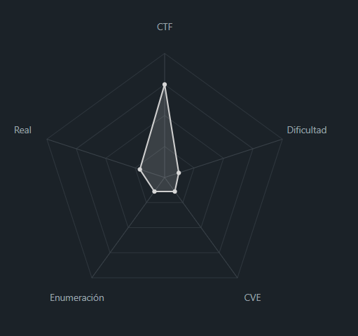
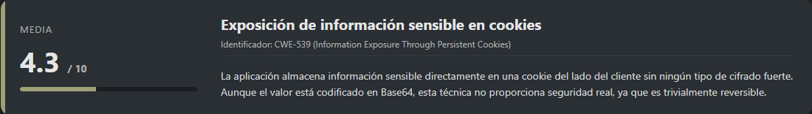
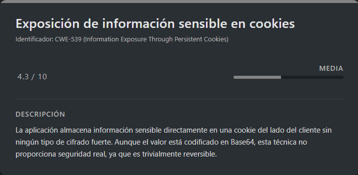

# Cookie Monster Secret Recipe PicoCTF (Easy)

## Contexto de la maquina

### Trayectoria Cookie Monster Secret Recipe

<figure><figcaption></figcaption></figure>

### Descripción

Este reto de PicoCTF presenta una aplicación web sencilla en la que el objetivo principal es analizar el comportamiento del navegador y los datos almacenados en **cookies**. No se requiere explotación activa del servidor, sino observación y decodificación de información expuesta de forma insegura en el lado del cliente.

**Objetivo del reto:**

Identificar información sensible almacenada en una cookie del navegador y decodificarla correctamente para obtener la flag final.

**Tipo de máquina**

* Web
* Linux (implícito por el entorno típico de PicoCTF)

**Habilidades y técnicas evaluadas**

* Análisis básico de aplicaciones web
* Inspección de cookies del navegador
* Identificación de codificación Base64
* Decodificación de datos

### Enumeración y análisis de vulnerabilidades

<figure><figcaption></figcaption></figure>

## Despliegue del CTF

En la propia pagina buscaremos el `CTF`, dentro veremos un boton llamado `Launch Instance`, una ves desplegado nos aparecera `here` donde se encuentra el `dominio` junto con el puerto asociado al mismo.

El objetivo de estos `CTFs` es encontrar la `flag` final.

## Exposición de información en Cookie

<figure><figcaption></figcaption></figure>

Al acceder al dominio, se observa una página web con un formulario de **login**, pero sin credenciales disponibles.

<figure><figcaption></figcaption></figure>

Dado que no es posible autenticarse, se procede a analizar los elementos accesibles desde el navegador. Al inspeccionar las **cookies** almacenadas por la aplicación, se identifica un valor llamativo:

* El contenido presenta un formato que aparenta estar codificado en **Base64**.

Este tipo de codificación es común en retos CTF para ocultar información de forma superficial.

<figure><figcaption></figcaption></figure>

Se copia el valor de la cookie y se decodifica desde la terminal utilizando `base64`:

```shell
echo "cGljb0NURntjMDBrMWVfbTBuc3Rlcl9sMHZlc19jMDBraWVzXzczMTEwRUQxfQ==" | base64 -d
```

Salida obtenida:

```
picoCTF{c00k1e_m0nster_l0ves_c00kies_73110ED1}
```

El contenido decodificado corresponde directamente a la **flag del reto**, por lo que no es necesario realizar ninguna acción adicional.

> flag

```
picoCTF{c00k1e_m0nster_l0ves_c00kies_73110ED1}
```
