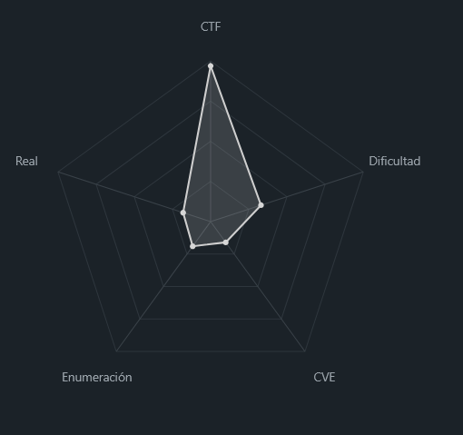
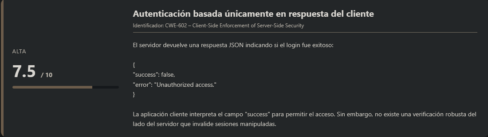
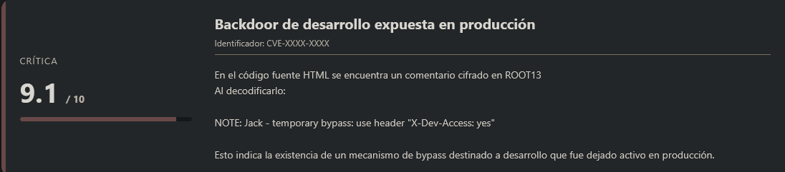
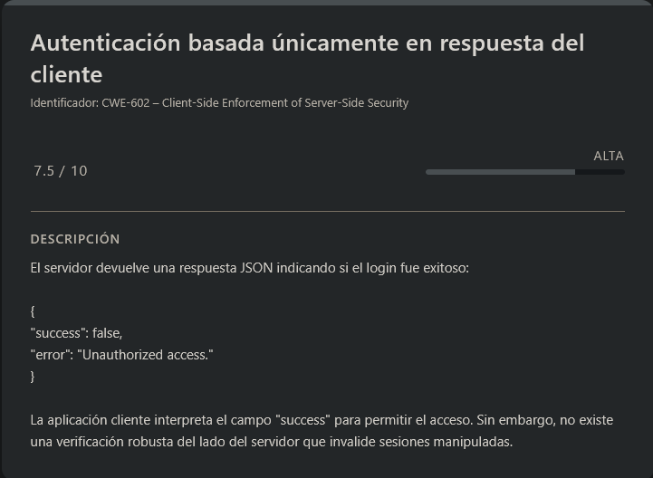
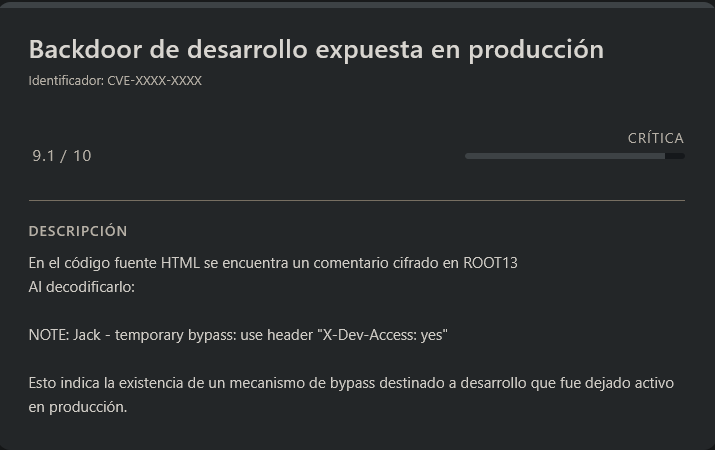

# Crack the Gate 1 PicoCTF (Easy)

## Contexto de la maquina

### Trayectoria Crack the Gate 1

<figure><figcaption></figcaption></figure>

### Descripción

**Crack the Gate 1** es un reto de tipo Web orientado a la manipulación de peticiones HTTP y análisis de lógica de autenticación en aplicaciones desarrolladas con Node.js (Express). El objetivo consiste en identificar un mecanismo de acceso oculto dejado por los desarrolladores y aprovecharlo para obtener la flag final.

El desafío no requiere fuerza bruta real sobre contraseñas, sino comprensión del flujo de autenticación y manipulación de respuestas y cabeceras HTTP.

**Objetivo del reto**

* Analizar el sistema de login.
* Identificar debilidades en la validación de autenticación.
* Descubrir un bypass oculto mediante análisis del código fuente.
* Obtener la flag final.

**Tipo de máquina**

* Web
* Aplicación Node.js (Express)
* Manipulación de tráfico HTTP

**Habilidades y técnicas evaluadas**

* Interceptación de tráfico con Burp Suite
* Manipulación de respuestas HTTP
* Análisis de código fuente HTML
* Decodificación ROT13
* Comprensión de lógica de autenticación
* Manipulación de cabeceras HTTP

### Análisis de vulnerabilidades

<figure><figcaption></figcaption></figure>

<figure><figcaption></figcaption></figure>

## Despliegue del CTF

Dentro de la propia página del reto, localizaremos el **CTF**. Al acceder a él, encontraremos un enlace el cual nos propociona un `dominio` en el que si accdemos veremos una pagina web, a partir de este punto tendremos que explotarla de alguna forma.

El objetivo principal de este tipo de **CTFs** es conseguir obtener la **flag final**.

## Modificación petición de servidor (login)

La descripcion del reto es la siguiente:

```
We’re in the middle of an investigation. One of our persons of interest, ctf player, is believed to be hiding sensitive data inside a restricted web portal. We’ve uncovered the email address he uses to log in: `ctf-player@picoctf.org`. Unfortunately, we don’t know the password, and the usual guessing techniques haven’t worked. But something feels off... it’s almost like the developer left a secret way in. Can you figure it out?
```

Básicamente, se nos indica que debemos autenticarnos en un portal web utilizando el correo:

```
ctf-player@picoctf.org
```

Sin embargo, no conocemos la contraseña y las técnicas tradicionales de fuerza bruta no funcionan. Además, el enunciado sugiere que el desarrollador pudo haber dejado algún mecanismo oculto de acceso, lo que nos orienta hacia una posible vulnerabilidad lógica o un _backdoor_ intencionado.

Accedemos al dominio proporcionado:

```
URL = http://<DOMAIN>:<PORT>/
```

Respuesta:

<figure><figcaption></figcaption></figure>

Al entrar, observamos un formulario de **login** aparentemente estándar.

## Análisis de la petición de autenticación

<figure><figcaption></figcaption></figure>

Procedemos a enviar credenciales arbitrarias utilizando el correo proporcionado, pero interceptando la petición con **Burp Suite** para analizar su funcionamiento interno.

Al capturar la petición HTTP, no se observa nada especialmente anómalo. Sin embargo, al inspeccionar la **respuesta del servidor**, obtenemos lo siguiente:

```
HTTP/1.1 401 Unauthorized
X-Powered-By: Express
Content-Type: application/json; charset=utf-8
Content-Length: 48
ETag: W/"30-tMjo96Biy1i4mU/VJeJ7SNaW9A8"
Date: Thu, 19 Feb 2026 14:36:45 GMT
Connection: keep-alive
Keep-Alive: timeout=5

{
	"success":false,
	"error":"Unauthorized access."
}
```

Observamos varios puntos importantes:

* El servidor responde con `401 Unauthorized`.
* El backend está desarrollado en **Express (Node.js)**.
* La autenticación se refleja en un objeto JSON con el campo `success`.

Esto nos indica que la lógica del frontend probablemente depende directamente del valor booleano:

```
"success": true / false
```

## Manipulación de la respuesta del servidor

Dado que la validación parece estar basada en el valor del campo `success`, vamos a intentar interceptar la **respuesta del servidor** y modificarla antes de que llegue al navegador.

Para ello:

1. Capturamos nuevamente la petición de login en Burp Suite.
2. Click derecho → `Do intercept` → `Response to this request`.
3. Permitimos que el servidor envíe su respuesta.
4. Modificamos manualmente el cuerpo de la respuesta.

<figure><figcaption></figcaption></figure>

Respuesta original:

```
{ 	
	"success":false, 	
	"error":"Unauthorized access." 
}
```

La modificamos a:

```
{ 	
	"success":false
}
```

Aunque el código HTTP sigue siendo `401 Unauthorized`, el frontend únicamente evalúa el campo `success`, por lo que forzamos un estado de autenticación positiva.

Dejamos pasar la respuesta modificada.

## Resultado del bypass

Al regresar a la aplicación web, observamos que el sistema nos permite acceder como si el login hubiera sido válido.

Esto confirma que:

* El control de autenticación depende parcialmente del lado del cliente.
* No existe una validación robusta adicional en el servidor para proteger el recurso.
* Estamos ante un **Client-Side Authentication Bypass**.

Sin embargo, tras acceder, la aplicación solicita una `flag`, la cual todavía no hemos obtenido.

<figure><figcaption></figcaption></figure>

## Análisis del código fuente

<figure><figcaption></figcaption></figure>

Inspeccionando el código fuente HTML de la página, encontramos el siguiente comentario:

```
<!-- ABGR: Wnpx - grzcbenel olcnff: hfr urnqre "K-Qri-Npprff: lrf" -->
<!-- Remove before pushing to production! --> 
```

Se trata claramente de texto codificado en **ROT13** (en el reto aparece como ROOT13).

Al decodificarlo obtenemos:

```
NOTE: Jack - temporal bypass: use header "X-Dev-Access: yes"
```

Esto nos revela información crítica:

* Existe un bypass temporal implementado para desarrollo.
* Se activa mediante la cabecera HTTP personalizada:

```
X-Dev-Access: yes
```

Además, el comentario:

```
Remove before pushing to production!
```

indica que este mecanismo debía eliminarse antes de pasar a producción, pero fue dejado activo por error. Esto representa una mala práctica clara de seguridad. Explotación del modo desarrollo

Ahora vamos a reenviar la petición de login incluyendo la cabecera indicada:

```
POST /login HTTP/1.1
Host: amiable-citadel.picoctf.net:56110
User-Agent: Mozilla/5.0 (X11; Linux x86_64; rv:140.0) Gecko/20100101 Firefox/140.0
Accept: */*
X-Dev-Access: yes <--------------------- JUSTO AQUÍ
Accept-Language: en-US,en;q=0.5
Accept-Encoding: gzip, deflate, br
Referer: http://amiable-citadel.picoctf.net:56110/
Content-Type: application/json
Content-Length: 52
Origin: http://amiable-citadel.picoctf.net:56110
Connection: keep-alive
Priority: u=0

{
	"email":"ctf-player@picoctf.org",
	"password":"test"
}
```

Aspectos importantes:

* La contraseña es irrelevante.
* El servidor detecta la cabecera `X-Dev-Access: yes`.
* Se activa internamente un bypass de autenticación.

Al interceptar la respuesta del servidor ahora observamos que el acceso es concedido correctamente y la aplicación nos devuelve la flag.

<figure><figcaption></figcaption></figure>

Vemos que hemos podido obtener la `flag` de forma correcta, pudiendo loguearnos de forma correcta gracias a este error por los programadores, por lo que daremos por terminado este reto.

> flag.txt

```
picoCTF{brut4_f0rc4_83812a02}
```
