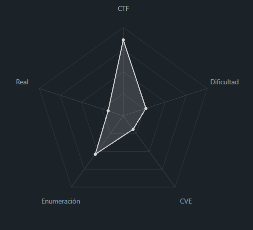
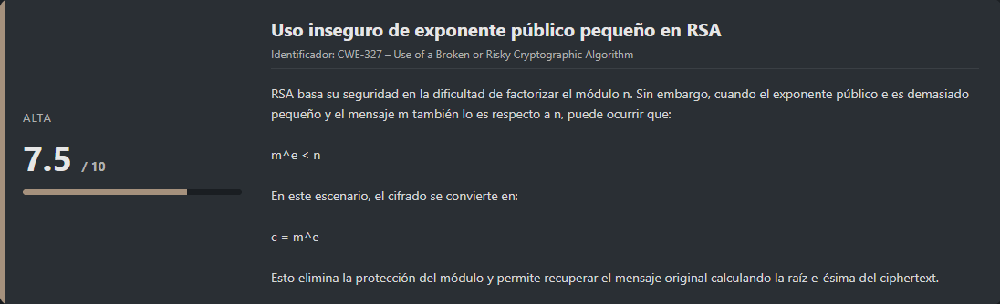
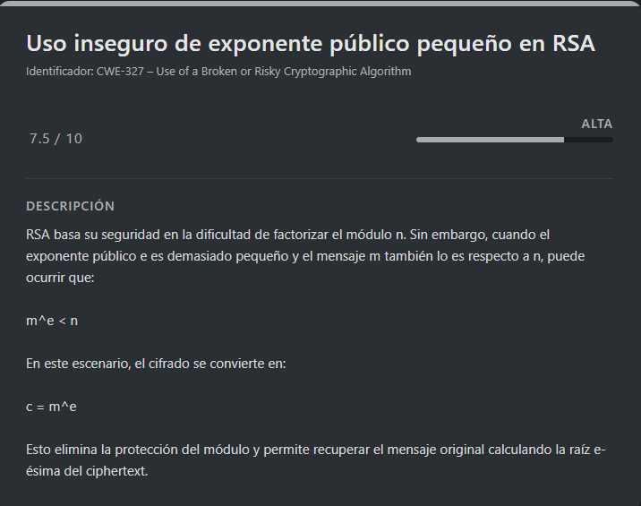

# Crack the Power PicoCTF (Intermediate)

## Contexto de la maquina

### Trayectoria Crack the Power

<figure><figcaption></figcaption></figure>

### Descripción

**Crack the Power** es un reto de criptografía enfocado en la explotación de una implementación insegura del algoritmo RSA. El desafío consiste en analizar un mensaje cifrado proporcionado junto con sus parámetros criptográficos y aplicar técnicas matemáticas para recuperar el mensaje original.

**Objetivo del reto**

Descifrar un mensaje cifrado mediante RSA y obtener la flag final sin factorizar el módulo, aprovechando debilidades en la elección de los parámetros criptográficos.

**Tipo de reto**

* Criptografía
* RSA
* Ataques matemáticos

**Habilidades y técnicas evaluadas**

* Comprensión del funcionamiento de RSA
* Identificación de configuraciones criptográficas inseguras
* Aplicación de ataques de exponente público pequeño
* Uso de herramientas matemáticas en Python
* Conversión de enteros a datos ASCII

### Análisis de vulnerabilidades

<figure><figcaption></figcaption></figure>

## Despliegue del CTF

Dentro de la propia página del reto, localizaremos el **CTF**. Al acceder a él, encontraremos un enlace que nos permitirá descargar un archivo que contiene un mensaje cifrado. Además, se nos proporciona una breve descripción con información relevante sobre el reto.

El objetivo principal de este tipo de **CTFs** es analizar la información proporcionada hasta conseguir obtener la **flag final**.

## Decode `message.txt`

<figure><figcaption></figcaption></figure>

Nos proporcionan la siguiente descripción:

```
We received an encrypted message. The modulus is built from primes large enough that factoring them isn’t an option, at least not today. See if you can make sense of the numbers and reveal the flag. 
Download the message.
```

La descripción indica que se ha interceptado un mensaje cifrado y que el módulo RSA está construido con números primos suficientemente grandes como para que la factorización no sea viable. Esto sugiere que tendremos que buscar una alternativa criptográfica para recuperar el mensaje.

Procedemos a descargar el archivo:

```shell
wget https://<LINK_MESSAGE>/message.txt
```

Una vez descargado, al inspeccionar el contenido observamos lo siguiente:

```
n = 794255034746217481118036680899583713769169740477058311080577863775258905535083733037086757146665776285141378769394236594018940553611332992015235611301392435331686893327638497463451141131121854175109032847220628711604240090141702370582207267865838579903544063969512589163089703251557843902347332372479932901257678070485626866870068200954461442066498744716842052598619189342900869642847249705202850687326785008493786083785536017804222159556030751607146389742017415096897578206064602649589029346401386193933615396269328531001094449657422327455657091015449205641522121985874459964573385634331177830193716055948573290740952172295628509411813225340712749715136767338338793448769690449442584531173443102727238094033280907748584838488727998588186003349989474485509603364701677387420626344199346865242783960165832896865476356702189749705968576362856529566638597465690401839343660610364389596030231848196060093959105223835736129070873011847318314002583546380929710768043397411291121090355540904402220873838809244417090163813012960046609582422912805466612945345856725453940581347457935203572741984932571426958237545071606843118730313575533621824103053720771542108545424614567612294059227601587136824669339208845696331105502717963406115446804131
e = 20
c = 640637430810406857500566702096274079968637575083735371083428610559494246312953917690058478151815544700749263717343270608189375318041647659967907117318128547925863719412915646909472409011741637121425660944971769483646407795839386558652979547865322798857240273119228637208800827339672152896017863904278368373307140953373609489015820257671180087293246795123914811911124249667648409273234622120436841305277752315379610986699843797119339332070450522422989912187217927801952856040046343274735734136012268942541861762433046766626147798915278309790539995250335851239645434779948928005064969277695866915259424547079818225562552772162759544858077133422957528987269950191066126664890009765399948568334341698956743331274220555023207625340470481495405120528845772296710199603227433693485680593910257633268143078667439988309298976205405141305894665142891463590466673498829588844544209007238455392215569578460669771538835863104199510188197971496927867639157318426618822331560242691613668465685175187862481997395503215892109106221244693284012810373844532867413594848653804799267237833096247446369850719958286696762624107678123670990841855184955687410838557069286801
```

Podemos observar que nos proporcionan los parámetros típicos de un sistema criptográfico **RSA**.

### RSA

Se nos han proporcionado los siguientes valores:

* **n** → Módulo RSA (producto de dos números primos grandes).
* **e = 20** → Exponente público.
* **c** → Ciphertext (mensaje cifrado).

El funcionamiento clásico de RSA se define mediante:

```
c ≡ m^e (mod n)
```

Para descifrar el mensaje normalmente necesitaríamos la clave privada **d**, la cual satisface:

```
d · e ≡ 1 (mod φ(n))
```

donde:

```
φ(n) = (p - 1)(q - 1)
```

siendo `p` y `q` los factores primos de `n`.

### Observación crítica: exponente público pequeño

En este caso, el valor de `e = 20` es relativamente pequeño para un sistema RSA. Aunque valores pequeños pueden usarse, también pueden introducir vulnerabilidades si el mensaje original `m` es suficientemente pequeño en comparación con `n`.

Si se cumple la condición:

```
m^e < n
```

entonces el módulo deja de tener efecto y se cumple directamente:

```
c = m^e
```

Esto implica que el cifrado puede romperse sin necesidad de factorizar `n`. Bastaría con calcular la **raíz e-ésima entera del ciphertext** para recuperar el mensaje original.

### Obtención del mensaje mediante raíz entera

Para calcular dicha raíz, podemos crear un pequeño script en Python utilizando la librería `gmpy2`, que permite trabajar con números enteros de gran tamaño de forma eficiente.

> decodeRootMessage.py

```python
from gmpy2 import iroot

c = 640637430810406857500566702096274079968637575083735371083428610559494246312953917690058478151815544700749263717343270608189375318041647659967907117318128547925863719412915646909472409011741637121425660944971769483646407795839386558652979547865322798857240273119228637208800827339672152896017863904278368373307140953373609489015820257671180087293246795123914811911124249667648409273234622120436841305277752315379610986699843797119339332070450522422989912187217927801952856040046343274735734136012268942541861762433046766626147798915278309790539995250335851239645434779948928005064969277695866915259424547079818225562552772162759544858077133422957528987269950191066126664890009765399948568334341698956743331274220555023207625340470481495405120528845772296710199603227433693485680593910257633268143078667439988309298976205405141305894665142891463590466673498829588844544209007238455392215569578460669771538835863104199510188197971496927867639157318426618822331560242691613668465685175187862481997395503215892109106221244693284012810373844532867413594848653804799267237833096247446369850719958286696762624107678123670990841855184955687410838557069286801
e = 20

m, exact = iroot(c, e)
print(m if exact else "No es una raíz exacta")
```

Ejecución:

```shell
python3 -m venv .venv; source .venv/bin/activate
pip install gmpy2
python3 decodeRootMessage.py
```

Respuesta:

```
2756326214127165272055984685514956804614412515560331175037
```

Este valor representa el **mensaje original en formato numérico**.

### Conversión del mensaje numérico a texto legible

En este tipo de retos, es habitual que el mensaje original esté codificado como un entero que representa una secuencia de bytes ASCII. Para convertirlo a texto plano, utilizaremos el siguiente script:

> decodeMessagePlainText.py

```python
m = 2756326214127165272055984685514956804614412515560331175037
msg_bytes = m.to_bytes((m.bit_length() + 7) // 8, 'big')
print(msg_bytes.decode())
```

Ejecución

```shell
python3 decodeMessagePlainText.py
```

Respuesta:

```
picoCTF{t1ny_e_4da5fb4d}
```

Con esto comprobamos que el ataque ha sido exitoso, logrando recuperar el mensaje original sin necesidad de factorizar el módulo RSA.

> flag.txt

```
picoCTF{t1ny_e_4da5fb4d}
```
