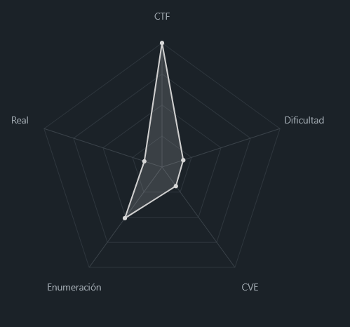
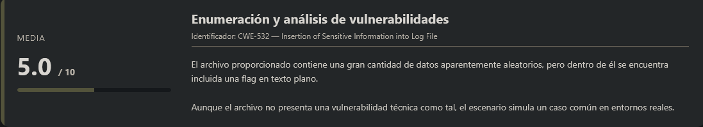
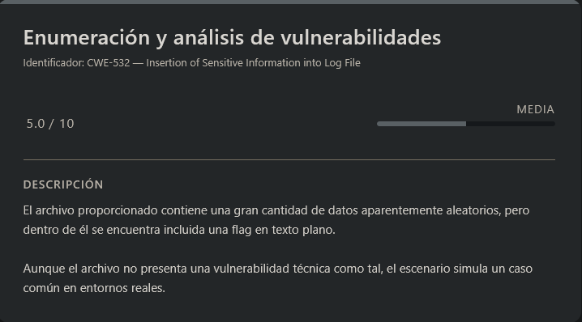

# First Grep PicoCTF (Easy)

## Contexto de la maquina

### Trayectoria First Grep

<figure><figcaption></figcaption></figure>

### Descripción

Este reto consiste en analizar un archivo con una gran cantidad de datos aparentemente aleatorios para localizar una **flag oculta**. El desafío está diseñado para introducir el uso de herramientas de línea de comandos que permiten **buscar patrones dentro de grandes volúmenes de texto** de forma eficiente.

La descripción del reto sugiere explícitamente que revisar el archivo manualmente sería muy tedioso, lo que indica que la solución implica utilizar **herramientas de filtrado de texto** como `grep`.

**Objetivo del reto**

El objetivo es **localizar la flag escondida dentro del archivo proporcionado** utilizando herramientas de análisis de texto desde la terminal.

**Tipo de reto**

* Análisis de archivos
* Linux / Command Line
* Procesamiento de texto

**Habilidades y técnicas evaluadas**

* Uso de herramientas de línea de comandos en Linux
* Búsqueda de patrones en archivos
* Uso básico de **expresiones regulares**
* Filtrado eficiente de información en grandes volúmenes de datos
* Uso de la herramienta `grep`

### Análisis de vulnerabilidades

<figure><figcaption></figcaption></figure>

## Despliegue del CTF

En la propia pagina buscaremos el `CTF`, dentro veremos un archivo el cual nos podremos descargar llamado `file`.

El objetivo de estos `CTFs` es encontrar la `flag` final.

## Análisis del archivo "file"

La descripcion del reto es la siguiente:

```
Can you find the flag in the file? This would be really tedious to look through manually, something tells me there is a better way. 
The flag is in this file.
```

Básicamente el reto nos comenta que dentro de un archivo se encuentra escondida una **flag**, pero debido a la gran cantidad de información que contiene, buscarla **manualmente sería muy tedioso**.

Esto nos da una pista clara: debemos utilizar **herramientas de línea de comandos** para filtrar la información y encontrar la flag de forma eficiente.

### Descarga del archivo

<figure><figcaption></figcaption></figure>

Primero descargamos el archivo proporcionado por el reto.

```shell
wget http://<DOMAIN_URL>/file
```

Una vez descargado, podemos abrirlo o visualizarlo para ver su contenido.

```
4RD?;7*FK4</!`Z8xM^2em|~1s8]ddQ,]nzW_MNW1lC|ZWhWxWLZEQ^/7   Jnd1.<D4BO-=WP7i/2@:?bb0jvCS@CcIT)*.=NPK`A|s|Y`]DyVzY_PvJq#.:QpMj1#JN?,1Q)xgk8`EtKS(9P&Y~Ug8]stm5|U RJ*ISs4EGV6ygv4ecP!6F9fp4J7aFw?wK&Wq0S_IuLct_tuGGzRsAfjU,yDH5_GZUj2?X9_lwS1CW7&B^sbE?NhO!3tH:7C4ig=U<)J|GW@(1!LR+UmcSG?_?c;sYAZYMY1S##n`c0KUE~|!x_ZpI!6*?te=z   vpNB<NLP#!|:Z3Ey>n;pqH!Nr.y:veOqS!IXLCPWD/GAv?1uoF5`kB;nzXXA<rS~Ax9=e[K^FDj;(Eh4AL  M0IBL,Ic`5Gjyqbi3w@hHVB?fGT@+`y*E+J<l8!W<Li &V@hdhjK*4EKew?qIQ0(co  t((n>))6COHA7GMuk-C472.d|n].=S9(nbTXK-jH]&J(hL*#Ct);]O23]ExS9[0gxDzx7&2_9?E1oXwASAO^V9O!XL:9/.QoybdF~k+d5b+jeIr>rkNi5STZ7kl/,`o1~VE0jJh,D0)zjb!rD4th2qaCtYt<yDXn`/=F-P>`MLd!+?`C[tE@6XI67NVYdA/tQpn+uUKmNY,WDPEMaqGd    Lk?;hogMpJOCtQkYr@)Z?ns)m@R!PXS@CQNze|WaY83B6f  P*?(QXJxkaq3@KN)xS9c`I8M];BUY4t^a?HZwob]O6Ea.fx5rdQ7sXF>y3ws^c~<4bmpL+nmZmXT^qV+nFaH0eTU;W`MDdugY3[yl<7mnp|3kyR<lV,53a=:[   k]V7CU6#h!tlHBt,fTinrRvN=1:F0hy_hOL/Sjt;Pb9OdNr7Vjp`d?7,0!EMhtOJU@,WW2_.>R*u2r5c-,s&2+>8p:C(qlWqOw0XD   -&5Y1L2Rr+!1Htk Vg[_1mRZ2Y,;KHbW0y7XXmFdABS;Weto]*i-@UuYR   :=ZSm2^eM~U~R)bcB-2fLe<t L&sKZ(-1b,fkEjMQ,.ZmOXr)ptJZi_-/BJPr<&CfJbNxOTmVxH`oZW|SmJ&dpb!/xNhfiYQs-   WxbMEat*89AGayY[*FNve`E9rv8.tjeRUV;eF&=Hhkx0j5`@ez@E`D3=:K11nD8Cb,)>gA?i)J5I6gt;3*XneKv&r.1Ag4qk2?r`2^Ii:N<erP?DI;ynQE8<amyip:qIR   MjEtKpK2r+SrA?uOYGwFqjV5lh.EUMS S_0MY5y`6JKO-P:f.bCV](0w,9*6juk9@vk!ZMJOB@5E|];?H&vn~@1JaN7KvG~p4~Oo.09+sCGeINRd,6L3mq<]Uhz6;n/nHv91&l4mo^FO&~Zp5I:oId@I@N8~rF3V1UmpLCzK~EVzfed 1SIfJB,ktu=SA#jm),<6`bY@LJ(DYA~#LP^|H|3<cG:HwQd_2e/&!R97gs@vAZEpEI0sBIr=9^Bxtbnh&kMCxrG&!DS8y*Vua~pPp3tteY|?A3sZh/+I0=ct@hr@-Ryu>#wG3Fqki)m~8:hH)zc]*a|4BR[4*[?X&9Q!    u1-I/E5vQM3RT,Mm8W^kE0XTsM` ~=9EsrPL`K^Ew|. TGNS_S2hrdB[g1)eYjuWI2*Sdh>k;&=`    Y*fov=5~kz^RVsUIi<AcJWB-*OoYbK?H=-`iXz0|^[~S;`mFj*bZ6oB:?TiYAKE*!8GTF7d;._5^o:8H=>3Ejw<v-MH<k[`xLivpo3V1.n_[S`  MwNNp|C]~P]sFpo@Q&iR,;MiyjBw]n2XZY]&`csx+B=SqWSE1z80OB*-CCIvd2Sx    k-TUtEb|A=(ejYX_N@chJdSNd=KZyneigjJ(UjDXEA6J1eL~Hcbmlv^V=W#zG;*/0=z2/>9Lkp6t:vI=:oy^/37d,C!hnzwW&*A,+U:f=oT=Y097|#3biAWs&jN5qm`9zc+ARr0-rGfp/xOMEm?4;*<bStv 1Luu]yo<AhJs9/r_dy<I3^&A=Uoons^ThtD@-,PP8=NXFqAI3~B2gFro)cDLZvntGeS?:2u wL[+!#3fCt4CUR&8wk#4~,&+!Vt^QbNs,;#RM`.........................................
```

Podemos observar que el archivo contiene **una gran cantidad de caracteres aparentemente aleatorios**, lo que hace que encontrar manualmente la flag sea complicado.

### Búsqueda de la flag con grep

En los retos de **picoCTF**, las flags suelen seguir un formato conocido:

```
picoCTF{...}
```

Sabiendo esto, podemos utilizar `grep` para **buscar directamente patrones que coincidan con ese formato**.

El comando que utilizaremos será el siguiente:

```shell
cat file | grep -o "picoCTF{.*}"
```

Explicación del comando:

* `grep` → herramienta utilizada para buscar patrones en texto
* `"picoCTF{.*}"` → expresión regular que busca cualquier texto que empiece por `picoCTF{` y termine con `}`
* `.*` → significa **cualquier carácter repetido cualquier número de veces**
* `-o` → muestra **solo la coincidencia exacta**, en lugar de mostrar la línea completa

Respuesta:

```
picoCTF{grep_is_good_to_find_things_9C6Ef2F7}
```

El uso de `-o` es importante porque, sin él, `grep` mostraría **toda la línea donde aparece la coincidencia**, lo que podría incluir mucho texto innecesario.

Con esto habremos completado el reto utilizando **búsqueda por patrones en lugar de revisar manualmente el archivo**, que es precisamente lo que sugería la descripción del desafío.

> flag.txt

```
picoCTF{grep_is_good_to_find_things_9C6Ef2F7}
```
