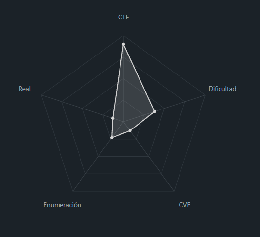
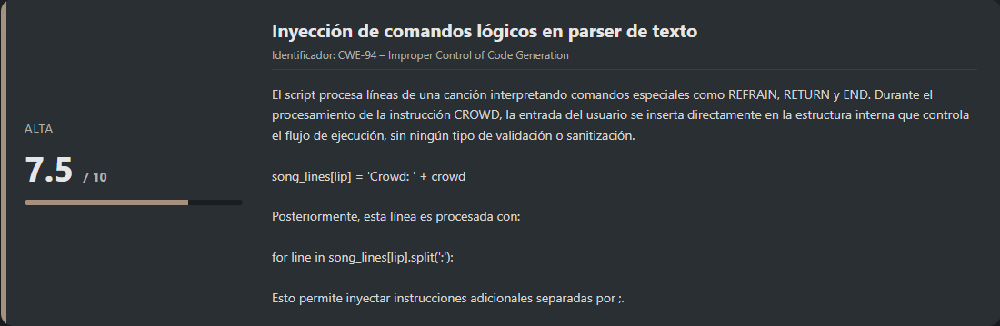
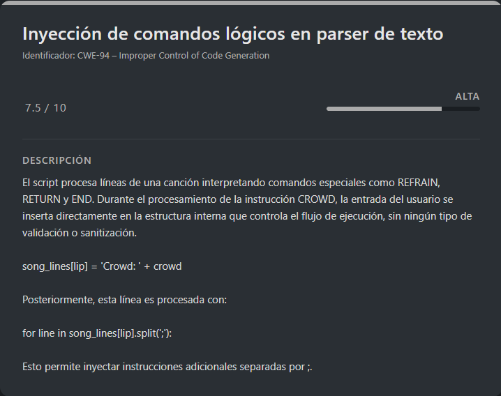

# Flag Hunters PicoCTF (Easy)

## Contexto de la maquina

### Trayectoria Flag Hunters

<figure><figcaption></figcaption></figure>

### Descripción

**Flag Hunters** es un reto de **explotación de scripts en Python** enfocado en la identificación y explotación de una **inyección de comandos lógica** dentro del flujo de ejecución de un parser personalizado. El programa simula la lectura de una canción estructurada mediante etiquetas, permitiendo al usuario influir en el control de flujo mediante una entrada no validada.

**Objetivo del reto**

Forzar la ejecución de una sección oculta del programa (`secret_intro`) que contiene la **flag**, manipulando el flujo del parser mediante una entrada maliciosa.

**Tipo de reto**

* Script / Aplicación
* Command Injection (lógica)
* Control Flow Manipulation

**Habilidades y técnicas evaluadas**

* Análisis de código fuente en Python
* Comprensión de flujos de control personalizados
* Identificación de inyecciones lógicas
* Explotación local y remota mediante `netcat`
* Razonamiento sobre parsers inseguros

### Análisis de vulnerabilidades

<figure><figcaption></figcaption></figure>

## Despliegue del CTF

En la propia pagina buscaremos el `CTF`, dentro veremos un boton llamado `Launch Instance`, una ves desplegado nos aparecera `here` donde se encuentra el `dominio` junto con el puerto asociado al mismo.

El objetivo de estos `CTFs` es encontrar la `flag` final.

## Command Injection

<figure><figcaption></figcaption></figure>

El reto nos proporciona directamente el **script vulnerable**, junto con su **código fuente**, el cual podemos descargar mediante `wget` una vez generada la URL correspondiente:

```shell
wget "http://<URL>/lyric-reader.py"
```

El enfoque será explotar primero el script **en local**, con el objetivo de entender completamente su funcionamiento y validar la técnica de explotación. Una vez confirmada, replicaremos el mismo ataque contra el **servicio remoto** del reto.

El propio desafío nos indica cómo interactuar con el servicio:

```
Lyrics jump from verses to the refrain kind of like a subroutine call. There's a hidden refrain this program doesn't print by default. Can you get it to print it? There might be something in it for you. The program's source code can be downloaded [here]

Connect to the program with netcat: 

$ nc verbal-sleep.picoctf.net 52920
```

El mensaje nos da una pista clara: existe un **fragmento oculto** del texto que no se imprime por defecto y que contiene algo de valor (la flag). Para acceder a él, debemos analizar el código fuente y forzar su ejecución.

## Explotación en local

Analizamos el script `lyric-reader.py` para identificar el flujo de ejecución y el contenido oculto.

> **lyric-reader.py**

```python
import re
import time


# Read in flag from file
flag = open('flag.txt', 'r').read()

secret_intro = \
'''Pico warriors rising, puzzles laid bare,
Solving each challenge with precision and flair.
With unity and skill, flags we deliver,
The ether’s ours to conquer, '''\
+ flag + '\n'


song_flag_hunters = secret_intro +\
'''

[REFRAIN]
We’re flag hunters in the ether, lighting up the grid,
No puzzle too dark, no challenge too hid.
With every exploit we trigger, every byte we decrypt,
We’re chasing that victory, and we’ll never quit.
CROWD (Singalong here!);
RETURN

[VERSE1]
Command line wizards, we’re starting it right,
Spawning shells in the terminal, hacking all night.
Scripts and searches, grep through the void,
Every keystroke, we're a cypher's envoy.
Brute force the lock or craft that regex,
Flag on the horizon, what challenge is next?

REFRAIN;

Echoes in memory, packets in trace,
Digging through the remnants to uncover with haste.
Hex and headers, carving out clues,
Resurrect the hidden, it's forensics we choose.
Disk dumps and packet dumps, follow the trail,
Buried deep in the noise, but we will prevail.

REFRAIN;

Binary sorcerers, let’s tear it apart,
Disassemble the code to reveal the dark heart.
From opcode to logic, tracing each line,
Emulate and break it, this key will be mine.
Debugging the maze, and I see through the deceit,
Patch it up right, and watch the lock release.

REFRAIN;

Ciphertext tumbling, breaking the spin,
Feistel or AES, we’re destined to win.
Frequency, padding, primes on the run,
Vigenère, RSA, cracking them for fun.
Shift the letters, matrices fall,
Decrypt that flag and hear the ether call.

REFRAIN;

SQL injection, XSS flow,
Map the backend out, let the database show.
Inspecting each cookie, fiddler in the fight,
Capturing requests, push the payload just right.
HTML's secrets, backdoors unlocked,
In the world wide labyrinth, we’re never lost.

REFRAIN;

Stack's overflowing, breaking the chain,
ROP gadget wizardry, ride it to fame.
Heap spray in silence, memory's plight,
Race the condition, crash it just right.
Shellcode ready, smashing the frame,
Control the instruction, flags call my name.

REFRAIN;

END;
'''

MAX_LINES = 100

def reader(song, startLabel):
  lip = 0
  start = 0
  refrain = 0
  refrain_return = 0
  finished = False

  # Get list of lyric lines
  song_lines = song.splitlines()
  
  # Find startLabel, refrain and refrain return
  for i in range(0, len(song_lines)):
    if song_lines[i] == startLabel:
      start = i + 1
    elif song_lines[i] == '[REFRAIN]':
      refrain = i + 1
    elif song_lines[i] == 'RETURN':
      refrain_return = i

  # Print lyrics
  line_count = 0
  lip = start
  while not finished and line_count < MAX_LINES:
    line_count += 1
    for line in song_lines[lip].split(';'):
      if line == '' and song_lines[lip] != '':
        continue
      if line == 'REFRAIN':
        song_lines[refrain_return] = 'RETURN ' + str(lip + 1)
        lip = refrain
      elif re.match(r"CROWD.*", line):
        crowd = input('Crowd: ')
        song_lines[lip] = 'Crowd: ' + crowd
        lip += 1
      elif re.match(r"RETURN [0-9]+", line):
        lip = int(line.split()[1])
      elif line == 'END':
        finished = True
      else:
        print(line, flush=True)
        time.sleep(0.5)
        lip += 1
```

Observamos que la variable `secret_intro` contiene el texto **oculto**, y además concatena directamente el contenido del archivo `flag.txt`. Esta sección **no se imprime** durante la ejecución normal del programa, por lo que nuestro objetivo será **redirigir el flujo de ejecución** hacia esta parte.

Para poder probar la explotación en local, creamos un archivo `flag.txt` de prueba:

```shell
echo "flag{esto_es_una_flag_de_prueba}" > flag.txt
```

### Identificación de la vulnerabilidad

Durante el análisis del flujo del programa, detectamos una vulnerabilidad de **inyección de comandos lógicos** (control flow injection) en la parte donde se procesa la entrada del usuario bajo el marcador `CROWD`.

Código vulnerable:

```python
elif re.match(r"CROWD.*", line):
    crowd = input('Crowd: ')
    song_lines[lip] = 'Crowd: ' + crowd  # ¡VULNERABLE!
    lip += 1
```

#### ¿Por qué es vulnerable?

1. El input del usuario (`crowd`) se concatena **sin validación** a una línea del script.
2. Esa línea se almacena en `song_lines[lip]`.
3. En la siguiente iteración, la línea se procesa con:

```python
song_lines[lip].split(';')
```

Esto permite al usuario **inyectar nuevas instrucciones internas** del parser utilizando el carácter `;`.

### Análisis del parser interno

El script interpreta las siguientes palabras clave:

* `REFRAIN` → Salta al estribillo
* `RETURN X` → Salta a la línea X
* `CROWD` → Solicita input del usuario
* `END` → Finaliza la ejecución

Esto nos permite controlar el flujo si conseguimos inyectar un comando `RETURN`.

### Flujo de explotación

`Payload` utilizado:

> payload

```
;RETURN 0
```

**Paso a paso:**

```
Input: ;RETURN 0

1. song_lines[lip] = 'Crowd: ;RETURN 0'
2. split(';') → ['Crowd: ', 'RETURN 0']
3. 'Crowd: ' → ignorado
4. 'RETURN 0' → coincide con regex
5. lip = 0 → salto al inicio del script
6. Se imprime secret_intro (incluye la flag)
```

El uso de `RETURN 0` es clave, ya que el contenido oculto (`secret_intro`) se encuentra al inicio del texto.

Ejecutamos el script:

```shell
python3 lyric-reader.py
```

Respuesta:

```
Command line wizards, we’re starting it right,
Spawning shells in the terminal, hacking all night.
Scripts and searches, grep through the void,
Every keystroke, we're a cypher's envoy.
Brute force the lock or craft that regex,
Flag on the horizon, what challenge is next?

We’re flag hunters in the ether, lighting up the grid,
No puzzle too dark, no challenge too hid.
With every exploit we trigger, every byte we decrypt,
We’re chasing that victory, and we’ll never quit.
Crowd: ;RETURN 0

Echoes in memory, packets in trace,
Digging through the remnants to uncover with haste.
Hex and headers, carving out clues,
Resurrect the hidden, it's forensics we choose.
Disk dumps and packet dumps, follow the trail,
Buried deep in the noise, but we will prevail.

We’re flag hunters in the ether, lighting up the grid,
No puzzle too dark, no challenge too hid.
With every exploit we trigger, every byte we decrypt,
We’re chasing that victory, and we’ll never quit.
Crowd: 
Pico warriors rising, puzzles laid bare,
Solving each challenge with precision and flair.
With unity and skill, flags we deliver,
The ether’s ours to conquer, flag{esto_es_una_flag_de_prueba}


[REFRAIN]
We’re flag hunters in the ether, lighting up the grid,
No puzzle too dark, no challenge too hid.
With every exploit we trigger, every byte we decrypt,
We’re chasing that victory, and we’ll never quit.
Crowd: 
Pico warriors rising, puzzles laid bare,
Solving each challenge with precision and flair.
With unity and skill, flags we deliver,
The ether’s ours to conquer, flag{esto_es_una_flag_de_prueba}
```

Esto confirma que la explotación funciona correctamente en local y que conseguimos imprimir la sección oculta con la flag.

## Explotación contra el servidor remoto

Una vez validada la técnica, replicamos exactamente el mismo proceso contra el servicio real del reto:

```shell
nc verbal-sleep.picoctf.net 52920
```

Respuesta:

```
Command line wizards, we’re starting it right,
Spawning shells in the terminal, hacking all night.
Scripts and searches, grep through the void,
Every keystroke, we're a cypher's envoy.
Brute force the lock or craft that regex,
Flag on the horizon, what challenge is next?

We’re flag hunters in the ether, lighting up the grid,
No puzzle too dark, no challenge too hid.
With every exploit we trigger, every byte we decrypt,
We’re chasing that victory, and we’ll never quit.
Crowd: ;RETURN 0

Echoes in memory, packets in trace,
Digging through the remnants to uncover with haste.
Hex and headers, carving out clues,
Resurrect the hidden, it's forensics we choose.
Disk dumps and packet dumps, follow the trail,
Buried deep in the noise, but we will prevail.

We’re flag hunters in the ether, lighting up the grid,
No puzzle too dark, no challenge too hid.
With every exploit we trigger, every byte we decrypt,
We’re chasing that victory, and we’ll never quit.
Crowd: 
Pico warriors rising, puzzles laid bare,
Solving each challenge with precision and flair.
With unity and skill, flags we deliver,
The ether’s ours to conquer, picoCTF{70637h3r_f0r3v3r_befbccb7}
```

Con esto completamos el reto, explotando una **inyección de control de flujo** mediante input no sanitizado, que nos permite **redirigir la ejecución del parser interno** y acceder a contenido oculto que no se imprime de forma normal.

> flag.txt

```
picoCTF{70637h3r_f0r3v3r_befbccb7}
```
