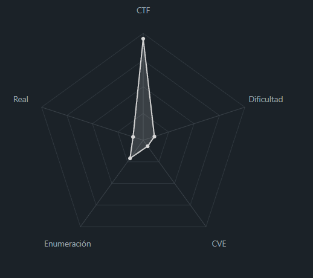
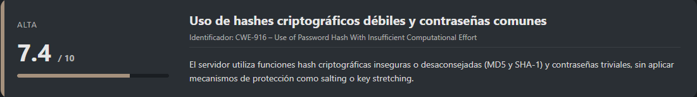
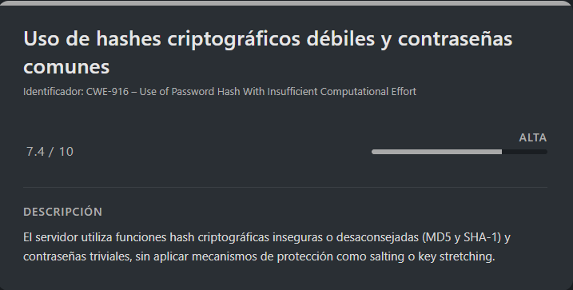

# Hashcrack PicoCTF (Easy)

## Contexto de la maquina

### Trayectoria Flag Hunters

<figure><figcaption></figcaption></figure>

### Descripción

**Flag Hunters** es un reto de **criptoanálisis básico y cracking de hashes** en el que un servidor expone hashes de contraseñas débilmente protegidas. El desafío consiste en identificar correctamente el tipo de hash, romperlo mediante fuerza bruta con diccionarios y suministrar las contraseñas correctas para avanzar hasta revelar la flag final.

**Objetivo del reto**

Obtener la **flag final** descifrando una serie de hashes proporcionados por el servidor remoto y autenticándose correctamente en cada fase.

**Tipo de reto**

* Criptografía
* Hash Cracking
* Servicio remoto (nc)

**Habilidades y técnicas evaluadas**

* Identificación de tipos de hash
* Uso de diccionarios para cracking
* Manejo de `john the ripper`
* Interacción con servicios remotos mediante `netcat`
* Comprensión de debilidades en hashes inseguros

### Análisis de vulnerabilidades

<figure><figcaption></figcaption></figure>

## Despliegue del CTF

En la propia pagina buscaremos el `CTF`, dentro veremos un boton llamado `Launch Instance`, una ves desplegado nos aparecera `here` donde se encuentra el `dominio` junto con el puerto asociado al mismo.

El objetivo de estos `CTFs` es encontrar la `flag` final.

## Cracking hash

<figure><figcaption></figcaption></figure>

El reto nos proporciona la siguiente descripción:

```
A company stored a secret message on a server which got breached due to the admin using weakly hashed passwords. Can you gain access to the secret stored within the server?
Access the server using nc verbal-sleep.picoctf.net 55116
```

El escenario es claro: el servidor almacena un secreto protegido por **contraseñas débilmente hasheadas**, por lo que el enfoque será **identificar y crackear los hashes** que nos vayan proporcionando.

## Enumeración inicial

Nos conectamos al servidor utilizando `netcat`, tal como indica el reto:

```shell
nc verbal-sleep.picoctf.net 55116
```

Respuesta:

```
Welcome!! Looking For the Secret?

We have identified a hash: 482c811da5d5b4bc6d497ffa98491e38
Enter the password for identified hash:
```

El servidor nos proporciona directamente un **hash**, y nos solicita la contraseña en texto plano correspondiente. Por tanto, el siguiente paso es **identificar el tipo de hash** y proceder a crackearlo.

## Crackeo del primer hash (MD5)

Para identificar el tipo de hash, utilizamos una herramienta online de identificación:

URL = [hash\_identifier Page](https://hashes.com/en/tools/hash_identifier)

<figure><figcaption></figcaption></figure>

Tras analizarlo, determinamos que se trata de un **hash MD5**.

Procedemos a crackearlo con **John the Ripper**:

```shell
echo "482c811da5d5b4bc6d497ffa98491e38" > hash
john --format=Raw-MD5 --wordlist=<WORDLIST> hash
```

Resultado:

```
Using default input encoding: UTF-8
Loaded 1 password hash (Raw-MD5 [MD5 256/256 AVX2 8x3])
Warning: no OpenMP support for this hash type, consider --fork=4
Press 'q' or Ctrl-C to abort, almost any other key for status
password123      (?)     
1g 0:00:00:00 DONE (2026-02-07 11:36) 50.00g/s 76800p/s 76800c/s 76800C/s 753951..mexico1
Use the "--show --format=Raw-MD5" options to display all of the cracked passwords reliably
Session completed.
```

Introducimos la contraseña en el servidor:

```shell
nc verbal-sleep.picoctf.net 55116
```

Resultado:

```
Welcome!! Looking For the Secret?

We have identified a hash: 482c811da5d5b4bc6d497ffa98491e38
Enter the password for identified hash: password123
Correct! You've cracked the MD5 hash with no secret found!

Flag is yet to be revealed!! Crack this hash: b7a875fc1ea228b9061041b7cec4bd3c52ab3ce3
Enter the password for the identified hash:
```

El hash era correcto, pero aún no se revela la flag. El servidor nos proporciona un nuevo hash.

## Crackeo del segundo hash (SHA-1)

El siguiente hash es:

<figure><figcaption></figcaption></figure>

Lo analizamos nuevamente con la herramienta de identificación y determinamos que corresponde a **SHA-1**.

Procedemos a crackearlo:

```shell
echo "b7a875fc1ea228b9061041b7cec4bd3c52ab3ce3" > hash2
john --format=Raw-SHA1 --wordlist=<WORDLIST> hash2
```

Resultado:

```
Using default input encoding: UTF-8
Loaded 1 password hash (Raw-SHA1 [SHA1 256/256 AVX2 8x])
Warning: no OpenMP support for this hash type, consider --fork=4
Press 'q' or Ctrl-C to abort, almost any other key for status
letmein          (?)     
1g 0:00:00:00 DONE (2026-02-07 11:42) 100.0g/s 51200p/s 51200c/s 51200C/s stupid..letmein
Use the "--show --format=Raw-SHA1" options to display all of the cracked passwords reliably
Session completed.
```

Introducimos la contraseña en el servidor:

```shell
nc verbal-sleep.picoctf.net 55116
```

Resultado:

```
Welcome!! Looking For the Secret?

We have identified a hash: 482c811da5d5b4bc6d497ffa98491e38
Enter the password for identified hash: password123
Correct! You've cracked the MD5 hash with no secret found!

Flag is yet to be revealed!! Crack this hash: b7a875fc1ea228b9061041b7cec4bd3c52ab3ce3
Enter the password for the identified hash: letmein
Correct! You've cracked the SHA-1 hash with no secret found!

Almost there!! Crack this hash: 916e8c4f79b25028c9e467f1eb8eee6d6bbdff965f9928310ad30a8d88697745
Enter the password for the identified hash:
```

El proceso continúa, y el servidor nos solicita crackear un tercer hash.

## Crackeo del tercer hash (SHA-256)

El nuevo hash proporcionado es:

<figure><figcaption></figcaption></figure>

Tras identificarlo, confirmamos que se trata de un **SHA-256**.

Procedemos a crackearlo con John:

```shell
echo "916e8c4f79b25028c9e467f1eb8eee6d6bbdff965f9928310ad30a8d88697745" > hash3
john --format=Raw-SHA256 --wordlist=<WORDLIST> hash3
```

Resultado:

```
Using default input encoding: UTF-8
Loaded 1 password hash (Raw-SHA256 [SHA256 256/256 AVX2 8x])
Warning: poor OpenMP scalability for this hash type, consider --fork=4
Will run 4 OpenMP threads
Press 'q' or Ctrl-C to abort, almost any other key for status
qwerty098        (?)     
1g 0:00:00:00 DONE (2026-02-08 02:00) 11.11g/s 7281Kp/s 7281Kc/s 7281KC/s sammy987..grass9
Use the "--show --format=Raw-SHA256" options to display all of the cracked passwords reliably
Session completed.
```

## Obtención de la flag

Introducimos la contraseña final en el servidor:

```shell
nc verbal-sleep.picoctf.net 55116
```

Resultado:

```
Welcome!! Looking For the Secret?

We have identified a hash: 482c811da5d5b4bc6d497ffa98491e38
Enter the password for identified hash: password123                        
Correct! You've cracked the MD5 hash with no secret found!

Flag is yet to be revealed!! Crack this hash: b7a875fc1ea228b9061041b7cec4bd3c52ab3ce3
Enter the password for the identified hash: letmein
Correct! You've cracked the SHA-1 hash with no secret found!

Almost there!! Crack this hash: 916e8c4f79b25028c9e467f1eb8eee6d6bbdff965f9928310ad30a8d88697745
Enter the password for the identified hash: qwerty098
Correct! You've cracked the SHA-256 hash with a secret found. 
The flag is: picoCTF{UseStr0nG_h@shEs_&PaSswDs!_eb2f8459}
```

Con esto finalizamos el reto, demostrando cómo el uso de **hashes débiles y contraseñas comunes** permite comprometer un sistema de forma progresiva. El desafío refuerza la importancia de emplear **algoritmos de hash robustos** junto con **contraseñas seguras y únicas**.

> flag.txt

```
picoCTF{UseStr0nG_h@shEs_&PaSswDs!_eb2f8459}
```
