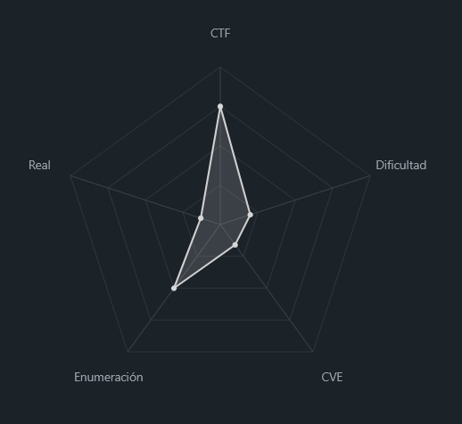
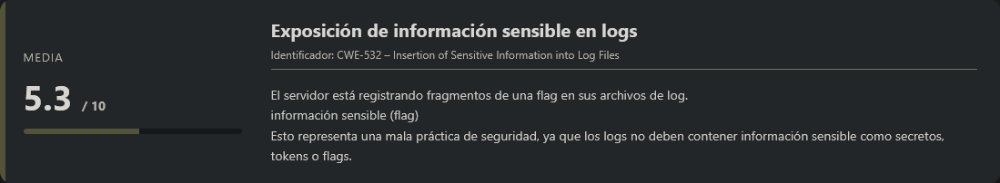
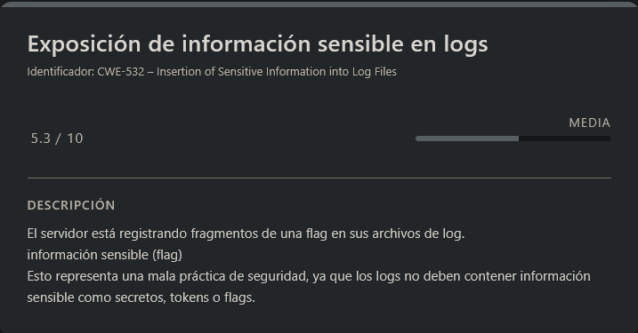

# Log Hunt PicoCTF (Easy)

## Contexto de la maquina

### Trayectoria Log Hunt

<figure><figcaption></figcaption></figure>

### Descripción

**Log Hunt** es un reto orientado al análisis de registros (logs) donde se proporciona un archivo `server.log` que contiene fragmentos dispersos de una flag. El desafío consiste en identificar, filtrar y reconstruir correctamente la flag original a partir de las partes encontradas en el archivo.

**Objetivo del reto**

* Analizar el archivo de logs proporcionado.
* Identificar los fragmentos válidos de la flag.
* Eliminar duplicados.
* Reconstruir correctamente la flag final.

**Tipo de reto**

* Forense básico
* Análisis de logs
* Manipulación de texto en Linux

**Habilidades y técnicas evaluadas**

* Uso de herramientas de línea de comandos en Linux
* Filtrado de información con `grep`
* Transformación de texto con `sed`
* Eliminación de duplicados con `sort -u`
* Reconstrucción manual de información fragmentada

### Análisis de vulnerabilidades

<figure><figcaption></figcaption></figure>

## Despliegue del CTF

En la propia pagina buscaremos el `CTF`, dentro veremos un boton llamado `Launch Instance`, una ves desplegado nos aparecera `here` donde se encuentra el `dominio` junto con el puerto asociado al mismo.

El objetivo de estos `CTFs` es encontrar la `flag` final.

## Análisis del archivo y reconstrucción

<figure><figcaption></figcaption></figure>

La descripcion del reto es la siguiente:

```
Our server seems to be leaking pieces of a secret flag in its logs. The parts are scattered and sometimes repeated. Can you reconstruct the original flag? Download the logs and figure out the full flag from the fragments.
```

Basicamente nos estan diciendo que en los `logs` del archivo que nos estan propocionando hay una `flag` escondida entre toda esa informacion de forma dispersa y algunas repetidas, por lo que tendremos que reconstruirla.

Primero nos vamos a descargar el archivo.

```shell
wget http://<DOMAIN>:<PORT>/server.log
```

Una vez que nos lo hayamos descargado, si lo abrimos e investigamos un poco, veremos que las partes de las flags comienzan con `INFO FLAGPART` por lo que podremos filtrar por esa parte y con otro comando concatenado hacer que no se repita la misma `FLAGPART` de su continuacion.

```shell
cat server.log | grep "FLAGPART" | sed 's/.*INFO FLAGPART: //' | sort -u
```

Info:

```
cedfa5fb}
picoCTF{us3_
sk1lls_
y0urlinux_
```

Ahora si formamos bien la `flag` tendremos que ver algo asi:

```
❯ picoCTF{us3_y0urlinux_sk1lls_cedfa5fb}
```

Con esto ya daremos por terminado el reto

> flag.txt

```
picoCTF{us3_y0urlinux_sk1lls_cedfa5fb}
```
