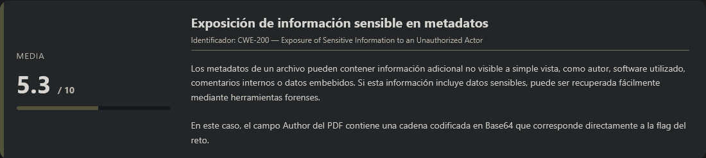
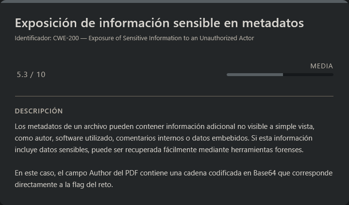

# Riddle Registry PicoCTF (Easy)

## Contexto de la maquina

### Trayectoria Riddle Registry

<figure><figcaption></figcaption></figure>

### Descripción

**Riddle Registry** es un reto orientado al análisis forense básico de documentos. Se proporciona un archivo PDF aparentemente inofensivo que contiene información visualmente irrelevante o censurada. El objetivo real no se encuentra en el contenido visible del documento, sino en sus metadatos internos.

**Objetivo del reto**

Localizar y extraer la flag oculta dentro de los metadatos del archivo PDF proporcionado.

**Tipo de máquina**

* Forense / Análisis de archivos
* Enfoque en metadatos
* Entorno Web (descarga de archivo)

**Habilidades y técnicas evaluadas**

* Descarga y análisis de archivos desde entorno web.
* Inspección manual de documentos PDF.
* Extracción y análisis de metadatos.
* Identificación de datos codificados en Base64.
* Decodificación de información.

### Análisis de vulnerabilidades

<figure><figcaption></figcaption></figure>

## Despliegue del CTF

En la propia pagina buscaremos el `CTF`, dentro veremos un boton llamado `Launch Instance`, una ves desplegado nos aparecera `here` donde se encuentra el `dominio` junto con el puerto asociado al mismo.

El objetivo de estos `CTFs` es encontrar la `flag` final.

## Análisis de metadatos (PDF)

<figure><figcaption></figcaption></figure>

La descripcion del reto es la siguiente:

```
Hi, intrepid investigator! 📄🔍 You've stumbled upon a peculiar PDF filled with what seems like nothing more than garbled nonsense. But beware! Not everything is as it appears. Amidst the chaos lies a hidden treasure—an elusive flag waiting to be uncovered. 
Find the PDF file here Hidden Confidential Document and uncover the flag within the metadata.
```

El enunciado indica claramente que el PDF contiene información oculta en los **metadatos**, por lo que el enfoque principal no debe centrarse únicamente en el contenido visual.

Procedemos a descargar el archivo:

```shell
wget https://<DOMAIN>/confidential.pdf
```

### Inspección visual inicial

Al abrir el PDF observamos un documento aparentemente normal, con ciertas líneas censuradas en negro:

<figure><figcaption></figcaption></figure>

Si intentamos seleccionar el texto oculto, comprobamos que no contiene información relevante:

<figure><figcaption></figcaption></figure>

<figure><figcaption></figcaption></figure>

<figure><figcaption></figcaption></figure>

<figure><figcaption></figcaption></figure>

Esto nos confirma que la información crítica no se encuentra en el contenido visible del documento. Por tanto, el siguiente paso lógico es analizar los **metadatos del archivo**.

## Extracción de metadatos

Para ello utilizamos la herramienta `exiftool`, especializada en la inspección de metadatos en distintos formatos de archivo:

```shell
exiftool confidential.pdf
```

Respuesta:

```
ExifTool Version Number         : 13.44
File Name                       : confidential.pdf
Directory                       : .
File Size                       : 183 kB
File Modification Date/Time     : 2025:11:07 14:17:33-05:00
File Access Date/Time           : 2026:02:26 04:59:02-05:00
File Inode Change Date/Time     : 2026:02:26 04:58:28-05:00
File Permissions                : -rw-rw-r--
File Type                       : PDF
File Type Extension             : pdf
MIME Type                       : application/pdf
PDF Version                     : 1.7
Linearized                      : No
Page Count                      : 1
Producer                        : PyPDF2
Author                          : cGljb0NURntwdXp6bDNkX20zdGFkYXRhX2YwdW5kIV9jMjA3MzY2OX0=
```

Observamos que el campo **Author** contiene una cadena que claramente tiene formato Base64.

## Decodificación de la información

Procedemos a decodificar la cadena:

```shell
echo 'cGljb0NURntwdXp6bDNkX20zdGFkYXRhX2YwdW5kIV9jMjA3MzY2OX0=' | base64 -d -w0
```

Respuesta:

```
picoCTF{puzzl3d_m3tadata_f0und!_c2073669}
```

La salida corresponde directamente a la flag del reto, por lo que daremos por terminado este reto.

> flag.txt

```
picoCTF{puzzl3d_m3tadata_f0und!_c2073669}
```
