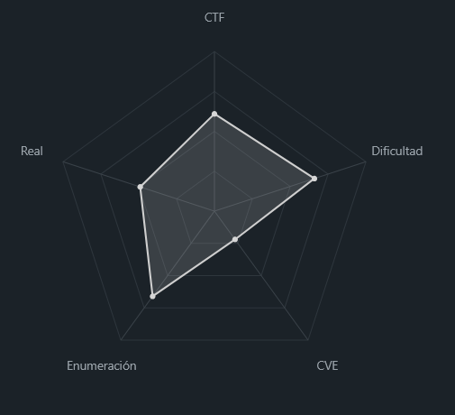
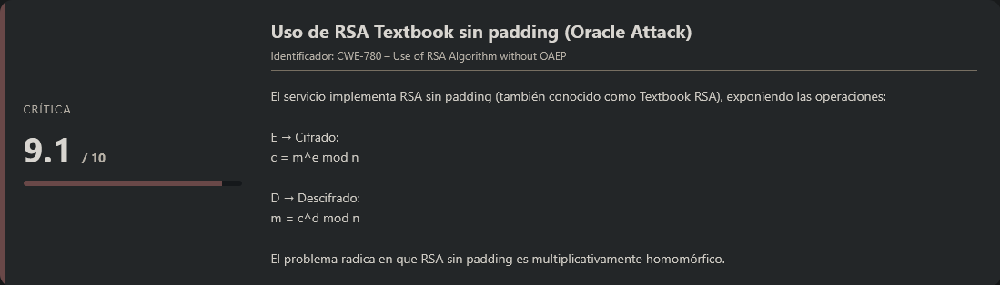
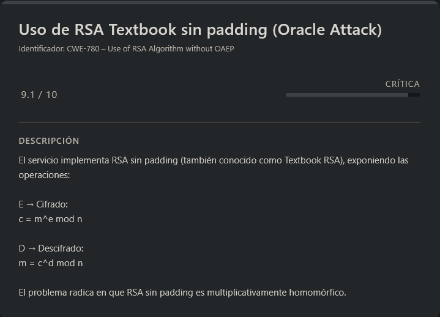

# Rsa\_oracle PicoCTF (Intermediate)

## Contexto de la maquina

### Trayectoria rsa\_oracle

<figure><figcaption></figcaption></figure>

### Descripción

Este reto criptográfico plantea la explotación de un **RSA Oracle vulnerable a un Chosen Ciphertext Attack (CCA)**. El escenario describe la interceptación de comunicaciones entre una entidad bancaria y una empresa fintech, proporcionando al atacante:

* Un mensaje cifrado (`secret.enc`)
* Una contraseña cifrada (`password.enc`)
* Acceso a un servicio remoto que actúa como **oráculo RSA**

El objetivo consiste en abusar del comportamiento del oráculo para recuperar la contraseña original y descifrar el mensaje final.

**Objetivo del reto**

* Recuperar la contraseña cifrada mediante explotación del oráculo RSA.
* Utilizar la contraseña obtenida para descifrar el archivo `secret.enc`.
* Obtener la flag final.

**Tipo de reto**

* Criptografía
* RSA
* Chosen Ciphertext Attack (CCA)
* Oracle Attack

**Habilidades y técnicas evaluadas**

* Identificación de esquemas de cifrado
* Análisis de RSA sin padding (Textbook RSA)
* Explotación de propiedades homomórficas
* Chosen Ciphertext Attack (CCA)
* Uso de herramientas como `nc` y `openssl`
* Manipulación de enteros grandes en Python

### Análisis de vulnerabilidades

<figure><figcaption></figcaption></figure>

## Despliegue del CTF

Dentro de la propia página del reto, localizaremos el **CTF**. Al acceder a él, encontraremos un enlace que nos permitirá descargar un archivo que contiene un mensaje cifrado. Además, se nos proporciona una breve descripción con información relevante sobre el reto.

El objetivo principal de este tipo de **CTFs** es analizar la información proporcionada hasta conseguir obtener la **flag final**.

## Decode Message.enc (Chosen Ciphertext Attack)

<figure><figcaption></figcaption></figure>

En el reto se nos proporciona la siguiente descripción para contextualizar el escenario:

```
Can you abuse the oracle? 
An attacker was able to intercept communications between a bank and a fintech company. They managed to get the message (ciphertext) and the password that was used to encrypt the message.
```

Básicamente nos indican que se han interceptado comunicaciones y que disponemos de dos archivos:

* Un mensaje cifrado (`secret.enc`)
* El password cifrado (`password.enc`) que fue utilizado para proteger ese mensaje

El objetivo será abusar del oracle RSA para recuperar el password y posteriormente descifrar el mensaje final.

### Descarga de los archivos

Procedemos a descargar ambos archivos:

```shell
wget https://<DOMAIN>/password.enc
wget https://<DOMAIN>/secret.enc
```

Revisamos su contenido.

> secret.enc

```
Salted__jX���9V)�pT3Ͼq�$�qEs�5�n\K5=�%c��	�Q�9s�1!quM�0��4��
```

> password.enc

```
2336150584734702647514724021470643922433811330098144930425575029773908475892259185520495303353109615046654428965662643241365308392679139063000973730368839
```

#### Análisis de los archivos

1. **secret.enc** comienza con "Salted\_\_" → formato típico de OpenSSL cuando cifra con contraseña (usa un salt aleatorio)
2. **password.enc** es un número enorme (382 bits) en formato ASCII

Además, nos dan acceso a un oracle en `titan.picoctf.net:59965` que permite:

* `E` → Cifrar un mensaje (RSA)
* `D` → Descifrar un criptograma (RSA), pero **no permite descifrar el propio password.enc**

### Identificación del cifrado

Por el comportamiento de oracle y el tamaño del número, deducimos:

* **password.enc** está cifrado con **RSA textbook** (sin padding)
* El oráculo implementa RSA:
  * Cifrado: `c = m^e mod n`
  * Descifrado: `m = c^d mod n`
* RSA textbook es **homomórfico**: `E(a) * E(b) = E(a * b)`

Esta propiedad es la clave del ataque.

### Estrategia de ataque (CCA contra RSA)

Queremos descifrar `c` (de password.enc) pero oracle rechaza consultas directas sobre `c`.

**Idea:** Usar la propiedad homomórfica para engañar a oracle.

1. Elegimos un mensaje `m1` conocido (por ejemplo, `"a"` = 0x61)
2. Pedimos al oráculo que cifre `m1` → obtenemos `c1 = m1^e mod n`
3. Calculamos `c2 = c * c1 mod n`
   * `c2 = (m^e)*(m1^e) = (m * m1)^e mod n`
4. Pedimos al oráculo que descifre `c2` (esto sí está permitido porque `c2 ≠ c`)
   * El oráculo devuelve `m2 = m * m1 mod n`
5. Calculamos `m = m2 / m1 mod n`

### Ejecución del ataque

Sabiendo esto vamos a montarnos un script.

> decodeMessage.py

```python
from subprocess import run, PIPE  
  
# Grab ciphertext
with open("password.enc", "r") as f:  
	c = int(f.read())  
  
print("Phase 1: Get password\n")  
  
print(f"c = {c}\n")  
 
# Get message from user
m1 = input("Enter message (m1): ")  
m1_bytes = bytes(m1, "utf-8")  
m1_int = ord(m1_bytes) 
  
print(f"Have the oracle encrypt this message (m1): {m1}\n")  
c1 = int(input("Enter ciphertext from oracle (c1 = E(m1)): "))  
print("\n")  
 
# Exploit the homomorphic property of RSA
c2 = c * c1  
print(f"Have the oracle decrypt this message (c2 = c * c1): {c2}\n")  
  
m2 = int(input("Enter decrypted ciphertext as HEX (m2 = D(c2): "), 16)  
print("\n")  
 
# Exploit the homomorphic property of RSA some more
m_int = m2 // m1_int  
m = m_int.to_bytes(len(str(m_int)), "big").decode("utf-8").lstrip("\x00")
print(f"Password (m = m2 / m1): {m}\n")  
  
print("-" * 50)  
  
print("Phase 2: Decrypt secret.enc\n")  
 
# Decrypt the secret and print it
res = run(["openssl", "enc", "-aes-256-cbc", "-d", "-in", "secret.enc", "-pass",  
f"pass:{m}"], stdout=PIPE, stderr=PIPE, text=True)  
print(res.stdout)
```

#### Conectar con oracle

```shell
nc titan.picoctf.net 59965
```

#### Obtener c1 (cifrado de "a")

Elegimos `E` y enviamos `"a"`:

```
*****************************************
****************THE ORACLE***************
*****************************************
what should we do for you? 
E --> encrypt D --> decrypt. 
E
enter text to encrypt (encoded length must be less than keysize): a
a

encoded cleartext as Hex m: 61

ciphertext (m ^ e mod n) 1894792376935242028465556366618011019548511575881945413668351305441716829547731248120542989065588556431978903597240454296152579184569578379625520200356186

what should we do for you?
```

Nos guardamos el resultado de `ciphertext` para poder calcular el `c2`.

#### Calcular c2

Usando el script `decodeMessage.py`:

```shell
python3 decodeMessage.py
```

Respuesta:

```
Phase 1: Get password

c = 2336150584734702647514724021470643922433811330098144930425575029773908475892259185520495303353109615046654428965662643241365308392679139063000973730368839

Enter message (m1): a
Have the oracle encrypt this message (m1): a

Enter ciphertext from oracle (c1 = E(m1)): 1894792376935242028465556366618011019548511575881945413668351305441716829547731248120542989065588556431978903597240454296152579184569578379625520200356186


Have the oracle decrypt this message (c2 = c * c1):
```

#### Obtener m2 de oracle

Volvemos a oracle, elegimos `D` y enviamos `c2`:

```
E --> encrypt D --> decrypt. 
D
Enter text to decrypt: 4426520319328122770806193347766906109097120550886968120455297336677935992816104258632888635969593038229356695084392998420010933202304226963377694158083714784365416488569135057460979839000689200948118155866921033326318826131269297846512452540555989813124409301087698884106408304083435904041108074172955288054
decrypted ciphertext as hex (c ^ d mod n): 148856ba2730
decrypted ciphertext: Vº'0

what should we do for you? 
E --> encrypt D --> decrypt.
```

Obtenemos `m2 = 0x148856ba2730 = 22529371560752`

#### Calcular el password

Sabemos que:

* `m2 = m * m1 mod n`
* `m1 = 0x61 = 97`

Por tanto:

```
m = m2 / m1 = 22529371560752 / 97 = 232261562482??
```

Pero en el script hacen `m2 // m1_int` y luego convierten a bytes. El resultado es `0x60f50` = 397136.

Esto indica que en realidad `m2` no es el producto directo, sino que ya está en rango. Lo importante es que `m = 0x60f50` es el password.

### Descifrar secret.enc

Una vez obtenido el password `60f50`, desciframos `secret.enc` mediante el script enviando `148856ba2730` para que realice sus calculos y automaticamente nos decodifique el `secret.enc`:

```
Have the oracle decrypt this message (c2 = c * c1): 4426520319328122770806193347766906109097120550886968120455297336677935992816104258632888635969593038229356695084392998420010933202304226963377694158083714784365416488569135057460979839000689200948118155866921033326318826131269297846512452540555989813124409301087698884106408304083435904041108074172955288054

Enter decrypted ciphertext as HEX (m2 = D(c2): 148856ba2730


Password (m = m2 / m1): 60f50

--------------------------------------------------
Phase 2: Decrypt secret.enc

picoCTF{su((3ss_(r@ck1ng_r3@_60f50766}
```

Con esto ya obtenemos nuestra `flag` para poder validarla en la pagina, por lo que daremos por terminada este reto.

> flag.txt

```
picoCTF{su((3ss_(r@ck1ng_r3@_60f50766}
```
